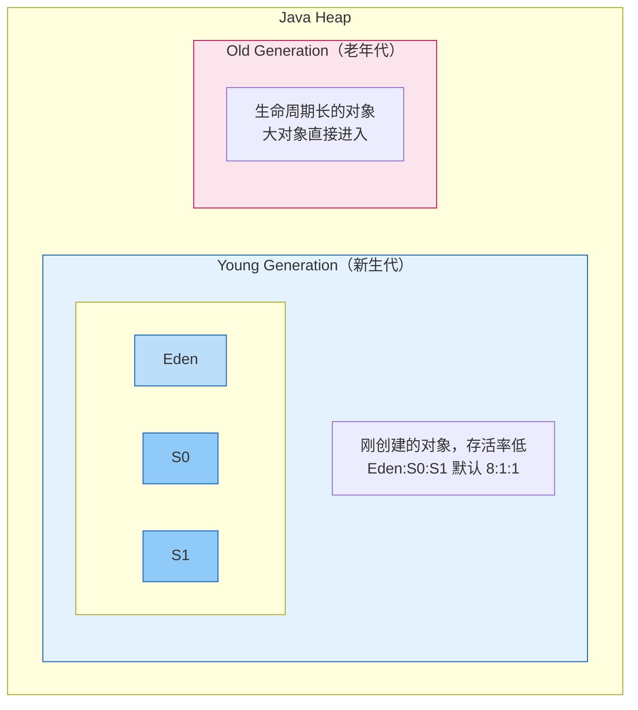
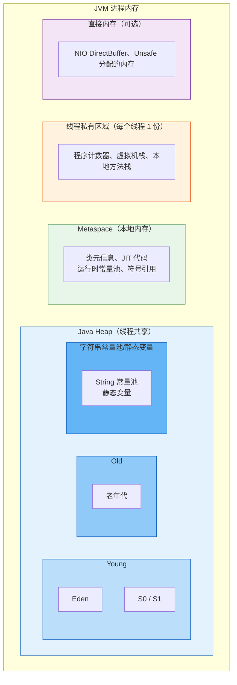
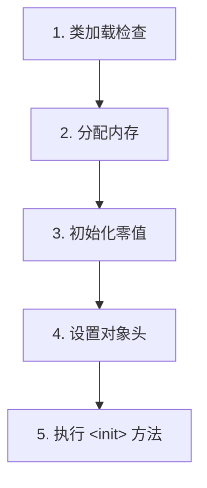
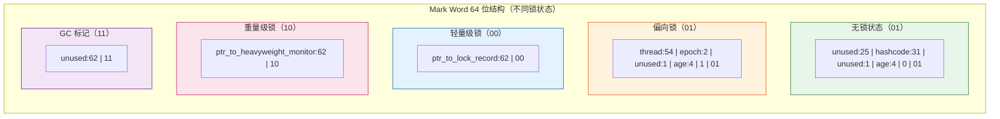
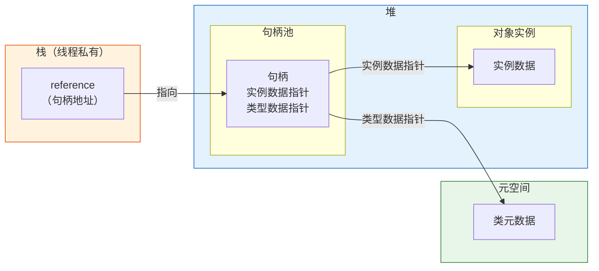
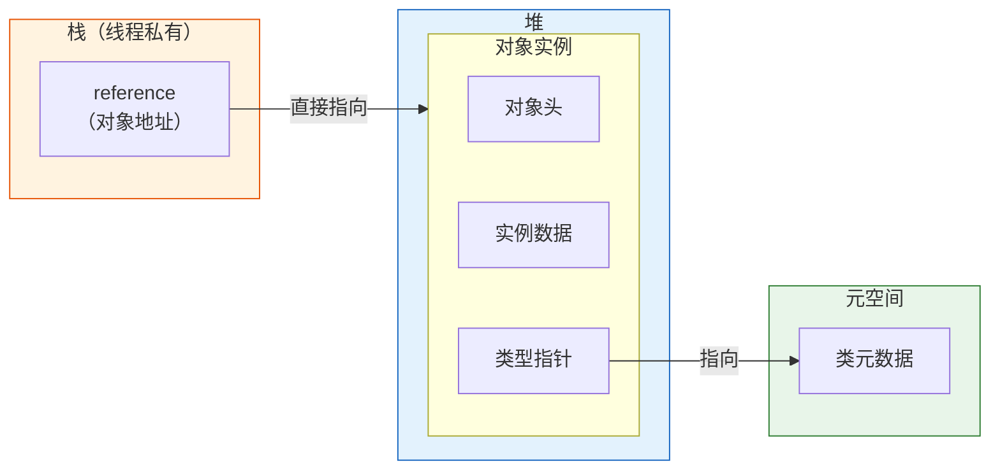

# JVM内存模型

## 一、JVM内存划分定义

### 1.1 内存区域划分的意义

Java虚拟机在执行Java程序的过程中，会把它管理的内存划分为若干个不同的数据区域。这些区域都有各自的用途、创建和销毁时间：

- **线程私有**：随用户线程启动/销毁而创建/销毁
- **线程共享**：随虚拟机进程启动而存在，所有线程共享

---

### 1.2 《深入理解Java虚拟机》中的经典划分

| 运行时数据区 | 线程属性 | 存储内容 | 是否会OOM |
|-------------|---------|---------|-----------|
| **程序计数器** | 线程私有 | 当前线程执行的字节码行号指示器 | ❌ 不会 |
| **虚拟机栈** | 线程私有 | Java方法执行的内存模型：局部变量表、操作数栈、动态链接、方法出口 | ✅ StackOverflowError、OOM |
| **本地方法栈** | 线程私有 | Native方法执行的内存模型 | ✅ StackOverflowError、OOM |
| **Java堆** | 线程共享 | 对象实例、数组，GC的主要区域 | ✅ OOM |
| **方法区** | 线程共享 | 类信息、常量、静态变量、JIT编译后的代码 | ✅ OOM |
| **运行时常量池** | 方法区的一部分 | 编译期生成的各种字面量和符号引用 | ✅ OOM |
| **直接内存** | 非运行时数据区 | NIO使用的堆外内存，不受JVM管理 | ✅ OOM |

---

### 1.3 JVM规范定义 vs 具体实现

**Java虚拟机规范**：定义了抽象的内存区域划分，是一种标准。

**具体实现（以HotSpot为例）**：不同JDK版本有不同的实现方式。

---

## 二、各内存区域详细说明

### 2.1 程序计数器（Program Counter Register）

**定义**：当前线程所执行的字节码的行号指示器。

**存储内容**：
- 当前线程正在执行的字节码指令地址
- 如果执行的是Native方法，计数器值为undefined

**特点**：
- ✅ 线程私有，每条线程都有独立的计数器
- ✅ 内存区域极小，是唯一不会OOM的区域
- ✅ 线程切换后能恢复到正确的执行位置
- ✅ 分支、循环、跳转、异常处理、线程恢复都依赖计数器

**为什么线程私有？**
> 为了线程切换后能恢复到正确的执行位置，每条线程都需要有独立的程序计数器，互不影响。

---

### 2.2 Java虚拟机栈（Java Virtual Machine Stack）

**定义**：描述Java方法执行的内存模型，每个方法执行时都会创建一个栈帧（Stack Frame）。

**存储内容**：每个栈帧包含：

| 组成部分 | 说明 |
|---------|------|
| **局部变量表** | 方法参数、局部变量，编译期可知大小。存储基本类型、对象引用、returnAddress |
| **操作数栈** | 表达式计算的工作区，字节码指令在操作数栈上操作 |
| **动态链接** | 指向运行时常量池的方法引用，支持动态分派 |
| **方法返回地址** | 方法返回时需要恢复的上层方法执行位置 |
| **附加信息** | 调式信息等，与具体实现相关 |

**执行过程**：
```
方法调用 → 创建栈帧 → 入栈 → 方法执行 → 栈帧出栈
```

**特点**：
- 线程私有，生命周期与线程相同
- 栈深度固定或可动态扩展
- 编译期就确定了局部变量表的大小

**异常情况**：
- `StackOverflowError`：栈深度超过虚拟机限制（递归过深）
- `OutOfMemoryError`：栈扩展时无法申请足够内存

**常用JVM参数**：
```bash
-Xss1m    # 设置每个线程的栈大小，默认1MB
```

---

### 2.3 本地方法栈（Native Method Stack）

**定义**：为Native方法服务的栈，与虚拟机栈作用类似。

**存储内容**：
- Native方法调用的参数和返回值
- Native方法执行的栈帧

**特点**：
- 线程私有
- HotSpot中与虚拟机栈合二为一
- 同样会抛出StackOverflowError和OOM

---

### 2.4 Java堆（Java Heap）

**定义**：JVM管理的最大一块内存，在虚拟机启动时创建，是垃圾收集器管理的主要区域。

**存储内容**：
- ✅ 几乎所有的对象实例
- ✅ 数组
- ✅ 字符串常量池（JDK 7+从方法区移到堆）

**经典分代划分（JDK 8之前）**：



| 区域 | 说明 |
|------|------|
| **新生代（Young）** | 刚创建的对象，存活率低 |
| - Eden区 | 对象优先分配在这里 |
| - Survivor 0/1 | 复制算法的From/To区，默认8:1:1 |
| **老年代（Old）** | 存活时间长的对象，大对象直接分配 |

**G1收集器的划分（JDK 9+默认）**：

不再物理分代，而是逻辑分区：
- 整个堆划分为多个大小相等的Region（1~32MB）
- 每个Region可以是Eden、Survivor、Old、Humongous
- Humongous：存放大对象（超过Region大小的50%）

**特点**：
- 线程共享
- 所有线程共享，分配对象时会有TLAB优化
- 是GC的主要战场

**常用JVM参数**：
```bash
-Xms512m    # 初始堆大小
-Xmx1024m   # 最大堆大小
-Xmn256m    # 新生代大小
-XX:SurvivorRatio=8    # Eden:Survivor = 8:1
-XX:MaxTenuringThreshold=15  # 晋升老年代年龄
```

---

### 2.5 方法区（Method Area）

**定义**：存储已被虚拟机加载的类信息、常量、静态变量、即时编译器编译后的代码等数据。

**存储内容**：
| 内容 | 说明 |
|------|------|
| 类的结构信息 | 字段、方法、接口、父类信息 |
| 运行时常量池 | 字面量、符号引用（见2.6节） |
| 静态变量 | static修饰的变量（JDK 7+移到堆） |
| JIT编译后的代码 | C1/C2编译后的机器码 |
| 即时编译器缓存 | |

**⚠️ 重要：方法区在不同JDK版本的实现差异**

| JDK版本 | 实现方式 | 存储位置 | 说明 |
|---------|---------|---------|------|
| JDK 6及之前 | 永久代（PermGen） | 堆内存的一部分 | 大小受限，容易OOM |
| JDK 7 | 永久代过渡 | 部分移到堆 | 字符串常量池、静态变量移到堆 |
| JDK 8及之后 | 元空间（Metaspace） | 本地内存（Native Memory） | 不受堆大小限制，只受物理内存限制 |

**为什么从永久代改为元空间？**
1. 永久代大小难以确定：太小容易OOM，太大会浪费
2. 永久代调优困难：Full GC时才会收集类元数据
3. 类卸载条件复杂，容易内存泄漏
4. 本地内存更灵活，只受物理内存限制

**常用JVM参数**：
```bash
# JDK 8+ 元空间参数
-XX:MetaspaceSize=128m        # 初始元空间大小，达到该值触发GC
-XX:MaxMetaspaceSize=256m     # 最大元空间大小，默认无限制

# JDK 7及之前 永久代参数（已废弃）
-XX:PermSize=128m
-XX:MaxPermSize=256m
```

---

### 2.6 运行时常量池（Runtime Constant Pool）

**定义**：方法区的一部分，存储编译期生成的各种字面量和符号引用。

**存储内容**：
| 类型 | 示例 |
|------|------|
| **字面量** | 字符串、final常量值、基本类型值 |
| **符号引用** | 类和接口的全限定名、字段的名称和描述符、方法的名称和描述符 |
| **直接引用** | 类加载解析阶段将符号引用转为直接引用 |

**特点**：
- 具备动态性：运行时也可以将新的常量放入池中（如String.intern()）
- JDK 7+字符串常量池从方法区移到堆
- 受方法区/元空间内存限制

**String.intern()的变化**：
- JDK 6：intern()把字符串复制到永久代
- JDK 7+：intern()只在常量池中记录首次出现的实例引用

---

### 2.7 直接内存（Direct Memory）

**定义**：不是虚拟机运行时数据区的一部分，也不是JVM规范定义的内存区域，但这部分内存被频繁使用，也可能导致OOM。

**存储内容**：
- NIO的DirectByteBuffer使用的堆外内存
- 通过Unsafe.allocateMemory()分配的内存
- JNI/JNA直接分配的本地内存

**特点**：
- 不受JVM堆大小限制，只受物理内存限制
- 不受JVM GC管理，需要手动释放或通过Cleaner机制
- 适合频繁IO操作（如网络、文件），避免堆内外数据拷贝

**常用JVM参数**：
```bash
-XX:MaxDirectMemorySize=128m  # 限制直接内存大小
```

---

## 三、当前主流JVM内存划分（JDK 8+ HotSpot）

### 3.1 现代内存布局（JDK 8 - JDK 17）



### 3.2 关键变化总结

| 内存区域 | JDK 6 | JDK 7 | JDK 8+ |
|---------|-------|-------|--------|
| 字符串常量池 | 永久代 | 堆 | 堆 |
| 静态变量 | 永久代 | 堆 | 堆 |
| 类元信息 | 永久代（堆内） | 永久代（堆内） | 元空间（本地内存） |
| 运行时常量池 | 永久代 | 永久代 | 元空间 |

---

## 四、HotSpot对象探秘

### 4.1 对象的创建过程



#### 步骤1：类加载检查
- 遇到new指令时，先检查常量池中的类符号引用
- 检查类是否已被加载、解析、初始化
- 如果没有，先执行类加载过程

#### 步骤2：分配内存
对象内存大小在类加载时就已确定。

**内存分配方式**：
| 方式 | 适用场景 | 原理 |
|------|---------|------|
| **指针碰撞（Bump-the-pointer）** | 内存规整（Serial、ParNew） | 把空闲指针向空闲区域移动对象大小的距离 |
| **空闲列表（Free List）** | 内存不规整（CMS） | 维护空闲列表，找一块足够大的空间分配 |

**并发安全问题**：多个线程同时分配对象时的线程安全解决方案：
1. **CAS + 失败重试**：保证分配操作的原子性
2. **TLAB（Thread Local Allocation Buffer）**：每个线程预先在Eden区分配一块私有缓冲区，只有TLAB用完并分配新的TLAB时才需要同步锁定

#### 步骤3：初始化零值
- 将分配到的内存空间都初始化为零值（不包括对象头）
- 保证对象的实例字段在Java代码中可以不赋初始值就使用

#### 步骤4：设置对象头
- 设置对象的Mark Word（哈希码、GC分代年龄、锁状态等）
- 设置类型指针（指向类元数据的指针）
- 如果是数组，还要设置数组长度

#### 步骤5：执行<init>方法
- 调用构造函数
- 初始化对象的成员变量
- 执行构造器中的代码

---

### 4.2 对象的内存布局

HotSpot中，对象在内存中存储的布局分为3块区域：

| 区域 | 大小（64位） | 内容 |
|------|-------------|------|
| **对象头（Header）** | 12/16字节 | Mark Word + 类型指针 + 数组长度（如果是数组） |
| **实例数据（Instance Data）** | 不固定 | 对象的真正有效数据，即字段内容 |
| **对齐填充（Padding）** | 0~7字节 | 保证对象大小是8字节的整数倍 |

#### 对象头详解

**Mark Word（标记字，8字节，64位系统）**：



Mark Word存储的信息：
- 哈希码（HashCode）
- GC分代年龄
- 锁状态标志
- 偏向锁线程ID
- 偏向时间戳
- 指向锁记录的指针
- 指向重量级锁Monitor的指针

**类型指针（Klass Pointer）**：
- 4字节（开启压缩指针时）或8字节（未压缩）
- 指向方法区/元空间中类元数据的指针
- JVM通过这个指针确定对象属于哪个类

**数组长度**：
- 4字节
- 只有数组对象才有

#### 实例数据
- 存储对象的真正有效数据
- 包括父类继承的和子类定义的字段
- 分配顺序受虚拟机分配策略影响（如相同宽度的字段分配到一起）

#### 对齐填充
- HotSpot要求对象起始地址必须是8字节的整数倍
- 当对象头+实例数据大小不是8字节倍数时，需要对齐填充
- 只是占位符，没有实际意义

---

### 4.3 对象的访问定位

Java程序通过栈上的reference引用操作堆上的对象，有两种主流访问方式：

#### 方式1：句柄访问



**优点**：
- reference存储稳定的句柄地址
- 对象移动时（GC时）只需修改句柄中的指针
- reference本身不需要修改

**缺点**：
- 需要两次指针访问才能访问对象
- 效率较低

#### 方式2：直接指针访问（HotSpot采用）



**优点**：
- 速度快，只需一次指针访问
- 节省一次指针定位的开销

**缺点**：
- GC移动对象时需要修改所有指向该对象的reference

---

### 4.4 对象大小计算示例

以64位HotSpot，开启压缩指针为例：

```java
class Object {
    // 空对象
    // 对象头：12字节（Mark Word 8 + 类型指针 4）
    // 对齐填充：4字节
    // 合计：16字节
}

class User {
    int id;         // 4字节
    String name;    // 4字节（引用）
    boolean flag;   // 1字节
    
    // 对象头：12字节
    // 实例数据：4+4+1=9字节
    // 对齐填充：3字节
    // 合计：12+9+3=24字节
}

class IntArray {
    int[] arr = new int[10];
    
    // 数组对象头：12 + 4（数组长度）= 16字节
    // 10个int：10*4=40字节
    // 对齐填充：0字节（56是8的倍数）
    // 合计：16+40=56字节
}
```

---

## 五、常见面试题

### Q1: 简述JVM内存区域划分，哪些是线程私有？哪些是线程共享？

**参考答案**：

JVM运行时数据区划分为：

**线程私有**（随线程创建/销毁）：
1. **程序计数器**：字节码行号指示器，唯一不会OOM的区域
2. **Java虚拟机栈**：Java方法执行的栈帧，每个方法一个栈帧
3. **本地方法栈**：Native方法执行的栈

**线程共享**（所有线程共享，随JVM启动创建）：
1. **Java堆**：几乎所有对象实例和数组，GC主要区域
2. **方法区**：类信息、常量、静态变量、JIT编译后的代码
   - 运行时常量池是方法区的一部分

**直接内存**：不是运行时数据区，但也被频繁使用（NIO）。

---

### Q2: 虚拟机栈中存储什么？StackOverflowError和OOM分别在什么情况下发生？

**参考答案**：

虚拟机栈存储每个方法执行的栈帧，栈帧包含：
- 局部变量表：方法参数和局部变量
- 操作数栈：表达式计算的工作区
- 动态链接：指向运行时常量池的方法引用
- 方法返回地址

**异常情况**：
1. **StackOverflowError**：
   - 线程请求的栈深度超过虚拟机允许的最大深度
   - 常见原因：无限递归、方法调用链过长

2. **OutOfMemoryError**：
   - 虚拟机栈动态扩展时无法申请到足够的内存
   - 常见原因：创建过多线程（每个线程占用栈内存）

---

### Q3: 永久代和元空间有什么区别？为什么要做这个改动？

**参考答案**：

| 维度 | 永久代（PermGen） | 元空间（Metaspace） |
|------|-----------------|-------------------|
| **内存位置** | JVM堆内存中 | 本地内存（Native Memory） |
| **大小限制** | 受`-XX:MaxPermSize`限制 | 只受物理内存限制，默认无上限 |
| **GC时机** | Full GC时才会收集 | 达到MetaspaceSize就触发GC |
| **存储内容** | 类元信息、常量、静态变量 | 类元信息 |

**为什么改为元空间？**
1. **大小难确定**：永久代大小难以预估，太小容易OOM，太大浪费
2. **调优困难**：永久代的类卸载条件苛刻，容易内存泄漏
3. **GC效率**：元空间GC更及时，类元数据回收更高效
4. **融合JRockit**：JRockit没有永久代的概念，Oracle收购后融合

---

### Q4: 对象创建的过程是怎样的？

**参考答案**：

对象创建分为5步：

1. **类加载检查**：new指令时，先检查常量池中的类符号引用，确保类已被加载

2. **分配内存**：
   - 指针碰撞（内存规整时）或空闲列表（内存不规整时）
   - 保证线程安全：CAS+重试 或 TLAB

3. **初始化零值**：将内存空间清零，保证字段不赋值也能使用

4. **设置对象头**：设置Mark Word、类型指针、数组长度

5. **执行<init>方法**：调用构造函数，初始化成员变量

---

### Q5: 对象在内存中的布局是怎样的？对象头包含什么信息？

**参考答案**：

HotSpot对象布局分为3部分：

1. **对象头**（Header）：
   - **Mark Word**（8字节）：哈希码、GC分代年龄、锁状态、偏向线程ID等
   - **类型指针**（4字节，压缩指针时）：指向类元数据
   - **数组长度**（4字节，数组对象才有）

2. **实例数据**（Instance Data）：
   - 对象真正的有效数据
   - 包括父类和子类的字段内容

3. **对齐填充**（Padding）：
   - 保证对象大小是8字节的整数倍
   - 只是占位符，无实际意义

---

### Q6: 对象有哪两种访问方式？HotSpot用哪种？

**参考答案**：

1. **句柄访问**：
   - reference指向句柄池中的句柄
   - 句柄包含对象实例数据和类型数据的指针
   - 优点：reference稳定，对象移动时只需改句柄
   - 缺点：两次指针访问，效率低

2. **直接指针访问**（HotSpot采用）：
   - reference直接指向对象
   - 对象中包含类型数据指针
   - 优点：速度快，一次指针访问
   - 缺点：GC移动对象时需要修改所有reference

---

### Q7: 什么是TLAB？为什么需要TLAB？

**参考答案**：

**TLAB（Thread Local Allocation Buffer，线程本地分配缓冲区）**：

- 每个线程在Eden区预先分配的一块私有缓冲区
- 线程分配对象时优先在自己的TLAB中分配
- 只有TLAB用完需要新的TLAB时才需要同步

**为什么需要TLAB？**
- 解决对象分配时的线程安全问题
- 避免CAS+重试带来的性能开销
- 提高对象分配效率，减少同步竞争

---

### Q8: String.intern()在JDK 6和JDK 7+有什么区别？

**参考答案**：

**JDK 6及之前**：
- 字符串常量池在永久代中
- intern()会把字符串复制到永久代的常量池中
- 返回永久代中字符串的引用
- 容易造成永久代OOM

**JDK 7及之后**：
- 字符串常量池移到堆中
- intern()如果常量池中已有该字符串，直接返回引用
- 如果没有，会把堆中字符串对象的引用记录到常量池中，不会复制
- 返回堆中字符串的引用

**区别示例**：
```java
String s = new String("a") + new String("b");
s.intern();
String s2 = "ab";
System.out.println(s == s2);
// JDK 6: false（s在堆，s2在永久代）
// JDK 7+: true（s和s2都指向堆中的同一个对象）
```
