# 垃圾收集器与内存分配策略

## 一、对象已死吗？——垃圾标记算法

垃圾收集（GC）的第一步：**先判断哪些对象还活着，哪些已经死了**。死了的对象才需要被回收。

---

### 1.1 引用计数法（Reference Counting）

**通俗理解**：每个对象身上装一个"计数器"，有人引用它，计数器+1；引用失效，计数器-1。计数器为0的对象就是死对象。

**工作原理**：

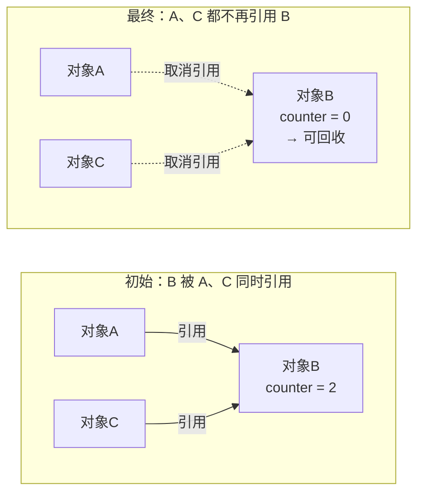

**优点**：
- ✅ 实现简单，判断效率高
- ✅ 不需要暂停整个应用

**致命缺点**：❌ **无法解决循环引用问题**

```java
class MyObject {
    public MyObject ref;
}

// 循环引用示例
MyObject a = new MyObject();  // a.counter = 1
MyObject b = new MyObject();  // b.counter = 1

a.ref = b;  // b.counter = 2
b.ref = a;  // a.counter = 2

a = null;   // a.counter = 1（不是0！）
b = null;   // b.counter = 1（不是0！）

// 结果：a和b实际上已经死了，但计数器永远不为0，永远不会被回收！
```

> 💡 **重要事实**：HotSpot虚拟机**没有使用**引用计数法，就是因为循环引用这个致命缺陷。

---

### 1.2 可达性分析算法（Reachability Analysis）—— HotSpot采用

**通俗理解**：从一组"根对象（GC Roots）"出发，顺着引用链往下找，能找到的对象就是活着的，找不到的就是死了。就像从祖宗往下查家谱，能连上的都是家族成员，连不上的就是"失联"了。

**工作原理图示**：

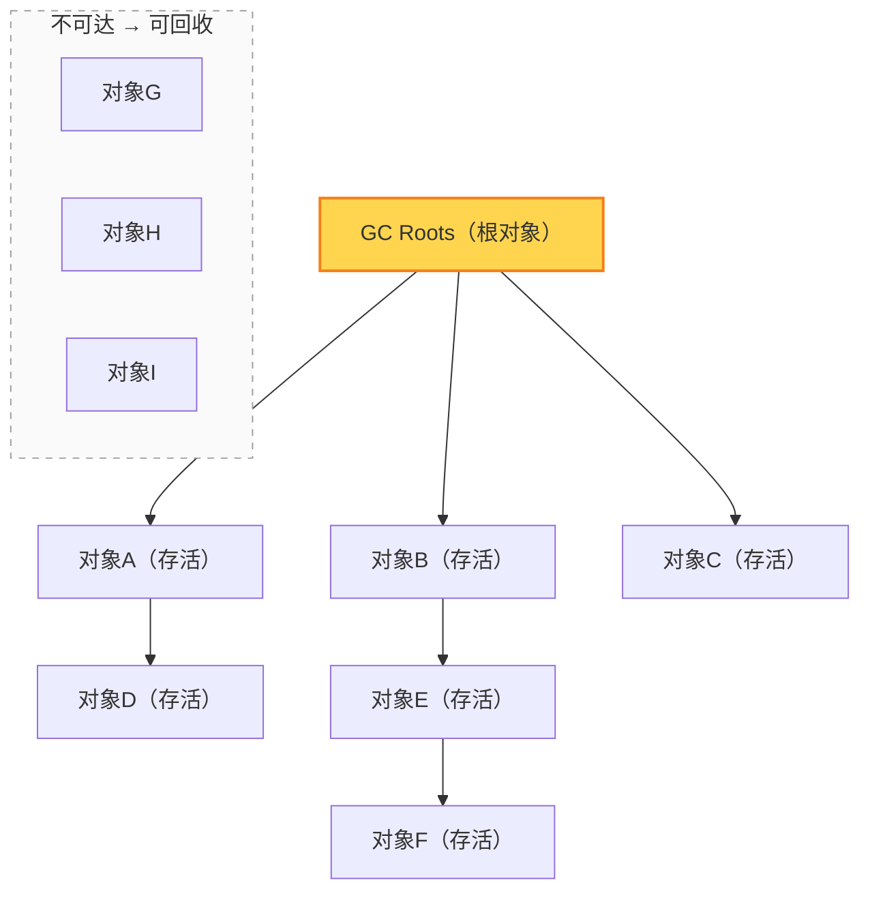

**什么可以作为GC Roots？**

| GC Roots类型 | 说明 |
|------------|------|
| **虚拟机栈（栈帧中的局部变量表）** | 方法中引用的对象，正在执行的方法里的变量 |
| **方法区中类静态属性引用的对象** | static变量引用的对象 |
| **方法区中常量引用的对象** | final static常量引用的对象 |
| **本地方法栈中JNI（Native方法）引用的对象** | Native方法引用的对象 |
| **同步锁（synchronized）持有的对象** | 被锁住的对象 |
| **JVM内部引用** | Class对象、异常对象、系统类加载器等 |

**生活例子**：
> 把GC Roots想象成"正在被使用的东西"：
> - 你手里拿着的手机（局部变量）→ 不能扔
> - 公司前台的公用电话（静态变量）→ 不能扔
> - 墙上挂着的灭火器（常量）→ 不能扔
> - 这些东西直接或间接接触到的东西，都不能扔
> - 被扔在角落里，没人碰的东西 → 可以清理掉

---

### 1.2.1 三色标记法——可达性分析的具体实现

**三色标记法**是现代垃圾收集器（CMS、G1、ZGC等）实现可达性分析的核心算法，特别适合**并发标记**场景。

#### 三种颜色的含义

| 颜色 | 含义 |
|------|------|
| **白色** | 未被标记的对象 → 最后剩下的白色对象就是垃圾，需要回收 |
| **灰色** | 自己已经被标记了，但它引用的对象还没处理完 → "处理中"的状态 |
| **黑色** | 自己和它引用的所有对象都已经标记完了 → 确定存活 |

#### 标记过程（串行版本）

**阶段 1：初始状态**
所有对象都是白色，GC Roots 直接关联的对象标记为灰色。

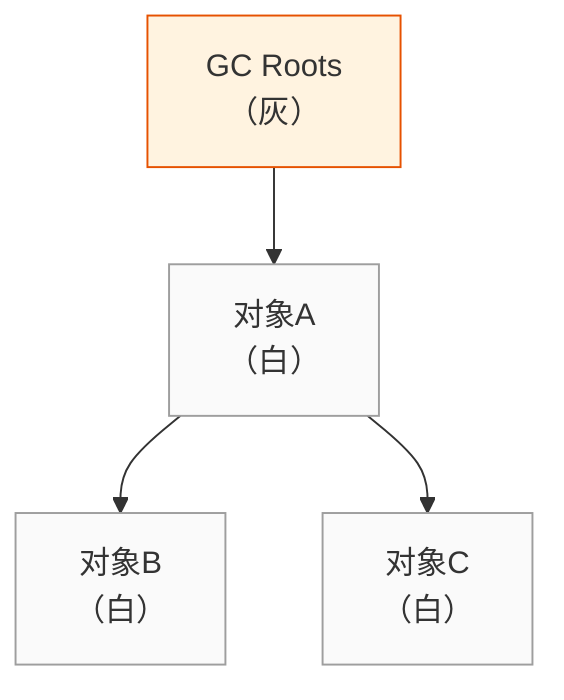

**阶段 2：处理灰色对象**
取出一个灰色对象，把它引用的所有白色对象标记为灰色，然后把自己标记为黑色。

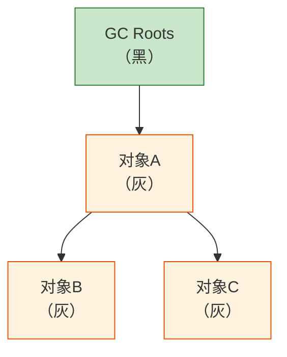

**阶段 3：处理完成**
所有灰色对象都处理完了变成黑色，剩下的白色对象就是不可达的垃圾。

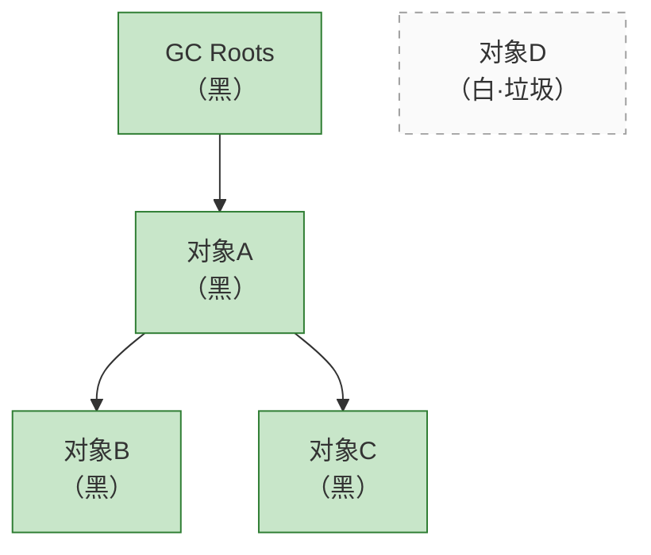

#### 并发标记的难题——"漏标"问题

**为什么CMS、G1需要STW的重新标记阶段？** 因为并发标记时，用户线程在跑，可能出现**漏标**！

**漏标是什么意思？**
> 一个原本存活的对象，最后被当成垃圾回收了！这是严重的bug！

**漏标发生的条件（必须同时满足）**：
1. 黑色对象引用了一个白色对象（黑→白）
2. 所有灰色对象都不再引用这个白色对象

**漏标过程演示**：

**并发标记中途 + 用户线程修改引用**

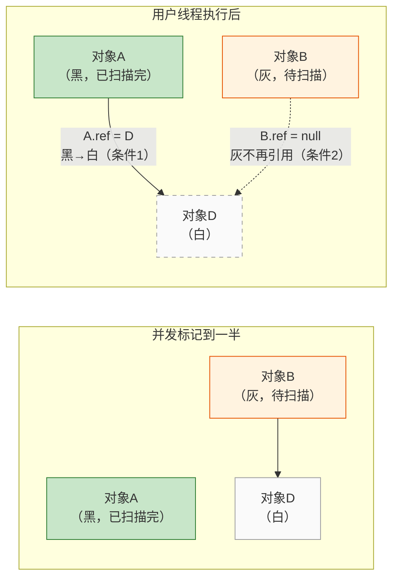

**漏标结果**：
- 对象A已经是黑色，不会再被扫描
- 对象B不再引用D，处理B时也不会标记D
- D一直是白色！但D实际上被A引用着，应该是活的
- 最后D会被当成垃圾回收 → 严重 bug！

> 这就是为什么并发标记必须要有一个 **STW 的重新标记阶段** 来修正这些问题！

这就是为什么并发标记必须要有一个**STW的重新标记阶段**来修正这些问题！

#### 两种解决方案

| 方案 | 原理 | 代表收集器 |
|------|------|-----------|
| **增量更新（Incremental Update）** | 黑色对象引用白色对象时，把这个引用记录下来，并发标记完后，以这些黑色对象为根，再扫描一遍 | CMS |
| **原始快照（Snapshot At The Beginning, SATB）** | 灰色对象删除对白色对象的引用时，把这个引用记录下来，并发标记完后，以这些被删除引用的对象为根，再扫描一遍 | G1、Shenandoah |

**通俗理解**：
- **增量更新**：谁加了新引用，我就重新查谁
- **原始快照**：谁删了旧引用，我就把删掉的那个对象当成根再查一遍
- 不管哪种方案，最后都需要一个STW的阶段来处理这些记录

> 💡 **面试考点**：为什么CMS有重新标记阶段？为什么G1有最终标记阶段？答案就是为了解决并发标记时的漏标问题！

---

### 1.3 引用的四大类型——强、软、弱、虚

JDK 1.2之后，Java对引用进行了更细致的划分，不同引用类型有不同的回收时机。

| 引用类型 | 回收时机 | 用途 | 示例 |
|---------|---------|------|------|
| **强引用（Strong Reference）** | 永远不回收 | 普通对象引用 | `Object obj = new Object()` |
| **软引用（Soft Reference）** | 内存不足时回收 | 缓存 | `SoftReference<Object> soft = new SoftReference<>(obj)` |
| **弱引用（Weak Reference）** | 下次GC时一定回收 | 缓存、避免内存泄漏 | `WeakReference<Object> weak = new WeakReference<>(obj)` |
| **虚引用（Phantom Reference）** | 对象被回收时收到通知 | 管理堆外内存 | `PhantomReference<Object> phantom = new PhantomReference<>(obj, queue)` |

**详细说明**：

#### 1）强引用——"打死不回收"
```java
// 这就是强引用，99%的引用都是强引用
User user = new User("张三");
```
- 只要强引用还在，垃圾收集器**永远不会**回收这个对象
- 内存不够时，直接抛OOM，也不回收强引用对象

#### 2）软引用——"内存不够才回收"
```java
SoftReference<byte[]> cache = new SoftReference<>(new byte[1024*1024]);

// 获取对象
byte[] data = cache.get();  // 可能返回null（如果已经被回收了）
```
- 内存**足够**时：不回收
- 内存**不足**时：把这些对象列进回收范围，进行二次回收
- 适合做**缓存**：图片缓存、数据缓存，内存不够时自动清理

#### 3）弱引用——"看到就回收"
```java
WeakReference<User> weakUser = new WeakReference<>(new User("李四"));

// GC后一定被回收
System.gc();
User user = weakUser.get();  // null！
```
- 只要发生GC，**不管内存够不够**，弱引用关联的对象都会被回收
- ThreadLocal就是用弱引用避免内存泄漏的

#### 4）虚引用——"形同虚设"
```java
ReferenceQueue<Object> queue = new ReferenceQueue<>();
PhantomReference<Object> phantom = new PhantomReference<>(new Object(), queue);

// get()永远返回null
phantom.get();  // null！

// 对象被回收时，虚引用会被放到ReferenceQueue中
// 可以通过监听queue来知道对象什么时候被回收
```
- 完全不影响对象的生命周期
- 唯一目的：对象被回收时收到一个系统通知
- 用于管理堆外内存（DirectByteBuffer就是用虚引用管理的）

**引用强度排序**：
```
强引用 > 软引用 > 弱引用 > 虚引用
```

---

### 1.4 生存还是死亡？—— finalize()方法

**⚠️ 注意：finalize()是对象最后的"自救"机会，但不推荐使用！**

**对象被标记后的两次标记过程**：

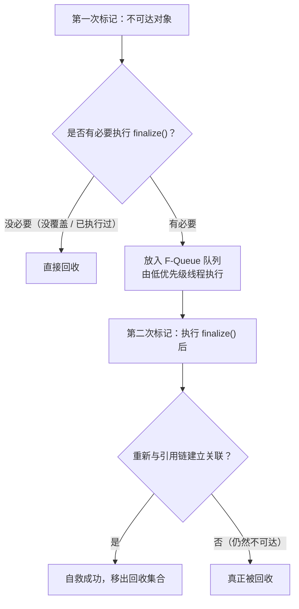

**自救示例（不推荐使用）**：
```java
public class FinalizeEscapeGC {
    public static FinalizeEscapeGC SAVE_HOOK = null;

    @Override
    protected void finalize() throws Throwable {
        super.finalize();
        System.out.println("finalize方法执行了！");
        FinalizeEscapeGC.SAVE_HOOK = this;  // 自救！把自己赋值给一个强引用
    }

    public static void main(String[] args) throws InterruptedException {
        SAVE_HOOK = new FinalizeEscapeGC();
        
        // 第一次自救成功
        SAVE_HOOK = null;
        System.gc();
        Thread.sleep(500);  // 等待finalize执行
        if (SAVE_HOOK != null) {
            System.out.println("我还活着！");  // 会输出这句话
        }
        
        // 第二次自救失败——finalize只会被自动调用一次！
        SAVE_HOOK = null;
        System.gc();
        Thread.sleep(500);
        if (SAVE_HOOK != null) {
            System.out.println("我还活着！");
        } else {
            System.out.println("我死了...");  // 会输出这句话
        }
    }
}
```

**为什么不推荐使用finalize()？**
1. ❌ 执行时机不确定，甚至可能永远不执行
2. ❌ 执行开销大，严重影响性能
3. ❌ 无法保证执行顺序
4. ✅ **推荐使用try-finally或者Cleaner机制**

---

### 1.5 方法区（元空间）的垃圾回收

方法区的垃圾收集"性价比"比较低，但还是会回收。

**方法区回收的内容**：
1. **废弃的常量**：没有任何地方引用的常量
2. **无用的类**：满足以下3个条件才可以被回收：
   - 该类的所有实例都已经被回收
   - 加载该类的ClassLoader已经被回收
   - 该类的java.lang.Class对象没有任何地方被引用

> 💡 **注意**：只是"可以"被回收，不是"必然"被回收。HotSpot提供`-Xnoclassgc`参数可以控制是否对类进行回收。大量使用反射、动态代理、CGLib等字节码框架的场景，需要特别注意类卸载问题。

---

## 二、垃圾收集算法——怎么回收垃圾？

标记出哪些对象要死之后，下一步就是"怎么收"的问题。

---

### 2.1 标记-清除算法（Mark-Sweep）—— 最基础的算法

**通俗理解**：先标记哪些需要清除，然后直接清除。就像大扫除时先把要扔的东西画个圈，然后统一扔掉。

**工作过程**：
```
标记阶段：从GC Roots开始遍历，标记所有存活对象
清除阶段：遍历整个堆，把没有标记的对象清除掉
```

**图示**：

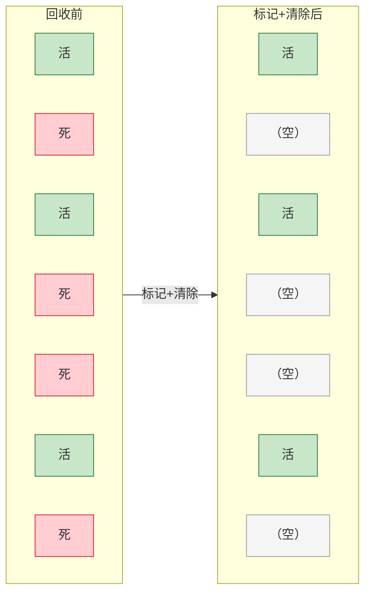

> ⚠️ 问题：空闲内存是一块块不连续的**内存碎片**！

**优点**：
- ✅ 实现简单
- ✅ 不需要移动对象，速度快

**缺点**：
- ❌ **内存碎片问题**：清除后产生大量不连续的内存碎片
- ❌ 可能导致大对象无法分配，提前触发Full GC
- ❌ 清除效率随对象数量增加而降低

**适用场景**：老年代（对象存活率高，垃圾少的场景）

---

### 2.2 复制算法（Copying）—— 解决效率和碎片问题

**通俗理解**：把内存分成两块，每次只用一块。垃圾回收时，把这块里活着的对象复制到另一块去，然后把这块整个清空。就像你有两个书架，每次只用A架，清理时把还需要的书搬到B架，然后把A架整个清空。

**工作过程**：

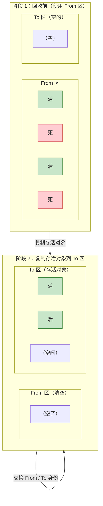

**HotSpot新生代的实现——8:1:1分配**：

新生代对象98%都是"朝生夕死"的，所以不需要1:1划分：
```
新生代 = 1份 Eden + 2份 Survivor（S0和S1，也叫From和To）
默认比例：Eden:S0:S1 = 8:1:1
```

**回收过程**：
1. 每次使用 Eden + 其中一块 Survivor（比如S0）
2. GC时，把 Eden + S0 中存活的对象**全部复制**到 S1 中
3. 然后直接清空 Eden 和 S0
4. 下次GC时，反过来：Eden + S1 → 复制到 S0

**示例**：
```
初始状态（堆内存100MB）：
Eden: 80MB  ← 对象优先分配在这里
S0: 10MB    ← 空的
S1: 10MB    ← 空的

第一次GC：
Eden中存活对象  +  S0中存活对象  →  全部复制到S1
清空Eden和S0

第二次GC：
Eden中存活对象  +  S1中存活对象  →  全部复制到S0
清空Eden和S1

循环往复...
```

**极端情况处理**：如果Survivor空间不够怎么办？
> 答：**分配担保机制**——存活对象直接进入老年代。

**优点**：
- ✅ **不会产生内存碎片**：复制过去的对象按顺序排列
- ✅ **效率高**：只需要移动指针，按顺序分配内存
- ✅ 只需要扫描一半的区域（扫描存活对象，而不是扫描所有对象）

**缺点**：
- ❌ **空间浪费**：总有一块Survivor是空的
- ❌ 对象存活率高时，复制的开销很大
- ❌ 需要老年代做"分配担保"

**适用场景**：新生代（对象存活率低，每次只有少量对象存活）

---

### 2.3 标记-整理算法（Mark-Compact）—— 老年代的解决方案

**通俗理解**：先标记存活对象，然后把所有存活对象都往一端移动，移动完之后，把边界以外的内存全部清理掉。就像整理硬盘碎片，把文件都挪到一起，空出连续的空间。

**工作过程**：

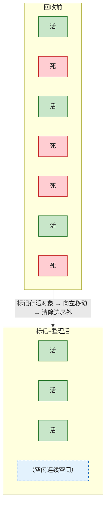

**与标记-清除的区别**：
- 标记-清除：标记后直接清除，会产生碎片
- 标记-整理：标记后先移动对象，再清除，不会产生碎片

**优点**：
- ✅ 没有内存碎片
- ✅ 分配大对象时不需要找空闲列表，直接指针碰撞就行

**缺点**：
- ❌ **需要移动对象**，Stop-The-World时间更长
- ❌ 效率比标记-清除低

**适用场景**：老年代（对象存活率高，没有额外空间做分配担保）

---

### 2.4 分代收集算法（Generational Collection）—— 现在的主流

**通俗理解**：根据对象的"年龄"（存活次数）把对象分到不同的区域，不同区域用不同的回收算法。就像垃圾分类，厨余垃圾、可回收物、有害垃圾，分类处理效率最高。

**核心思想**：
- 新生代：对象大多数都是"朝生夕死"，每次只有少量存活 → 用**复制算法**
- 老年代：对象存活率高，没有额外空间担保 → 用**标记-清除**或**标记-整理**

**HotSpot 的分代划分**：

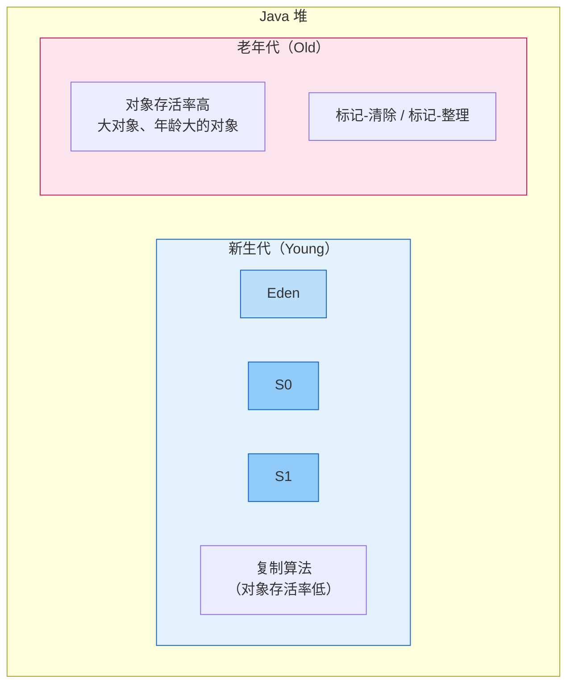

**GC的分类**：

| GC类型 | 发生区域 | 触发条件 | 速度 | Stop-The-World时间 |
|--------|---------|---------|------|-------------------|
| **Minor GC** | 新生代 | Eden区满了 | 很快 | 很短 |
| **Major GC** | 老年代 | 老年代空间不足 | 较慢 | 较长 |
| **Full GC** | 整个堆 | 老年代满、元空间满、System.gc()等 | 最慢 | 很长 |

**生活例子**：
> 把你的房间想象成JVM堆：
> - **桌面（新生代）**：每天都在放东西，大多数东西用完就可以扔
>   - 每天下班清理一次桌面（Minor GC），把还需要的东西放进抽屉
> - **抽屉（老年代）**：放比较重要、长期需要的东西
>   - 抽屉满了才会整理一次（Major GC）
> - 每次整理抽屉都比整理桌面费时间
> - 整个房间大扫除（Full GC）最费时间

---

## 三、HotSpot的算法实现——垃圾收集的细节

### 3.1 枚举根节点（GC Roots枚举）

**问题**：可达性分析需要从GC Roots开始遍历引用链，但是GC Roots太多了（栈帧里的变量、静态变量、常量...），一个个找太慢了。

**解决方案**：**OopMap（Ordinary Object Pointer Map）**

**OopMap是什么？**
> 在类加载完成的时候，HotSpot就把对象内什么偏移量上是什么类型的数据计算出来了。在JIT编译过程中，也会在特定的位置记录下栈和寄存器中哪些位置是引用。

**好处**：
- GC时不需要一个不漏地检查所有执行上下文和全局引用位置
- 直接去OopMap里找就行了，**快速准确**地完成GC Roots枚举

---

### 3.2 安全点（Safepoint）

**问题**：OopMap内容会变化，不可能为每一条指令都生成OopMap，那样空间成本太高。

**解决方案**：只在**特定的位置**记录OopMap，这些位置就叫**安全点（Safepoint）**。

**什么意思？**
> 程序执行时，不是在任何地方都能停下来开始GC，必须跑到"安全点"才能停下来。就像公交车不是招手就停，必须到"公交站"才能停。

**安全点通常选在什么位置？**
- 方法调用
- 循环跳转
- 异常跳转
- 这些让程序"长时间"执行的指令序列的结尾

**GC发生时，怎么让所有线程都跑到安全点停下来？**

1. **抢断式中断（Preemptive Suspension）**：
   - JVM直接把所有线程全部中断
   - 如果发现哪个线程中断的位置不在安全点，就恢复它，让它跑到安全点再中断
   - 现在几乎不用了

2. **主动式中断（Voluntary Suspension）**—— HotSpot采用：
   - JVM不直接中断线程
   - 只是设置一个标志位，线程执行时轮询这个标志
   - 发现标志为true时，线程自己在最近的安全点主动挂起
   - 轮询操作很简单，只有一条汇编指令，开销极低

---

### 3.3 安全区域（Safe Region）

**问题**：安全点解决了"运行中的线程"的问题，但如果线程睡着了（Sleep）或者阻塞了呢？它没法跑到安全点去啊！

**解决方案**：**安全区域（Safe Region）**

**什么是安全区域？**
> 指在一段代码片段中，引用关系不会发生变化。在这个区域中的任意地方开始GC都是安全的。

**工作过程**：
1. 线程进入安全区域时，先标记自己"我进入安全区域了"
2. 线程要离开安全区域时，检查JVM是否已经完成了GC Roots枚举
   - 如果完成了：线程继续跑
   - 如果没完成：线程等着，收到可以离开的信号再走

**生活例子**：
> 安全点就像"公交站"，运行中的线程必须到站才能停
> 安全区域就像"停车场"，停着不动的线程（Sleep、阻塞）在停车场里随时可以GC

---

### 3.4 记忆集与卡表（Remembered Set & Card Table）

**问题**：新生代GC时，只扫描新生代，但是可能有老年代的对象引用了新生代的对象，怎么找到这些引用？

如果扫描整个老年代，那太慢了！

**解决方案**：**记忆集（Remembered Set）**

**卡表（Card Table）—— HotSpot中记忆集的实现**：
- 把老年代分成一个个512字节大小的"卡（Card）"
- 卡表是一个字节数组，每个元素对应一张卡
- 只要卡中有对象引用了新生代，就把这张卡标记为"脏的"（dirty）
- 新生代GC时，只需要扫描脏卡就行，不用扫描整个老年代

**写屏障（Write Barrier）**：
- 什么时候把卡标记为脏的？
- 老年代对象的引用发生变化时，通过"写屏障"更新卡表
- 就是在赋值操作前后加一点额外处理，类似AOP

---

## 四、垃圾收集器——算法的具体实现

> 垃圾收集算法是"方法论"，垃圾收集器是"实现类"。
> 没有最好的收集器，只有最合适的收集器。

**📌 先澄清层级关系：**
- **HotSpot 是 JVM（Java虚拟机）**，不是垃圾收集器
- **HotSpot = Hot（热点） + Spot（探测）**，名字来源于它的核心技术：热点代码探测
- 下面介绍的 Serial、ParNew、CMS、G1、ZGC 等，都是 HotSpot JVM 内部提供的垃圾收集器组件

---

### 4.1 垃圾收集器总览

**📛 垃圾收集器名称由来彩蛋**：

| 收集器 | 名称含义 |
|--------|---------|
| **Serial** | 串行，单线程执行，名字直接描述工作方式 |
| **ParNew** | Parallel New，并行的新生代收集器，Serial的多线程版本 |
| **Parallel Scavenge** | 并行清除，专注吞吐量的收集器 |
| **CMS** | Concurrent Mark Sweep，并发标记清除，直接描述了算法 |
| **G1** | Garbage First，垃圾优先，哪个Region垃圾多优先回收哪个 |
| **ZGC** | Zetta Garbage Collector，官方说Z代表Zetta（万亿级堆），业内理解为"Zero"零停顿 |
| **Shenandoah** | 谢南多厄河谷，美国弗吉尼亚州的一个地名，是Red Hat开发团队的所在地 |
| **Epsilon** | 希腊字母ε，在数学中表示"极小的量"，暗示这个GC几乎什么都不做 |

> 💡 补充：Shenandoah（谢南多厄）是Red Hat团队在美国弗吉尼亚州开发的，所以用了当地的著名河谷地名来命名。

HotSpot 虚拟机的垃圾收集器（JDK 8 及之前）：

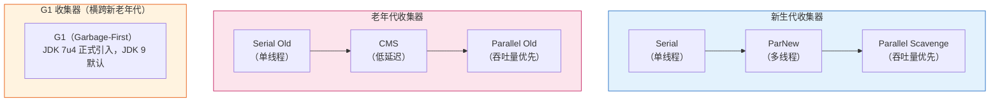

**重要概念说明**：

| 术语 | 说明 |
|-----|------|
| **Stop-The-World（STW，全称"停止世界"，业内通常直接说STW）** | GC时必须暂停所有用户线程，"天下武功，唯快不破"，STW时间越短越好 |
| **并行（Parallel）** | 多条垃圾收集线程并行工作，用户线程还是暂停的 |
| **并发（Concurrent）** | 垃圾收集线程和用户线程同时运行（不一定并行，可能交替执行） |
| **吞吐量** | CPU用于运行用户代码的时间 / CPU总消耗时间。吞吐量越高越好 |
| **响应时间** | GC时STW的时间。响应时间越短，用户体验越好 |

> 💡 **权衡**：吞吐量和响应时间是矛盾的。追求高吞吐量可能单次GC时间长；追求低延迟可能GC次数多，总吞吐量下降。

---

### 4.2 Serial收集器—— 单线程的"古董级"收集器

**特点**：单线程、复制算法、新生代收集器

**工作过程**：


**时间线图示**：

```mermaid
gantt
    title Serial 收集器时间线
    dateFormat X
    axisFormat %s
    section 用户线程
    用户运行1 : active, 0, 3
    STW 暂停 : crit, 3, 5
    用户运行2 : active, 5, 8
    section GC 线程
    空闲 : 0, 3
    单线程GC : active, 3, 5
    空闲 : 5, 8
```

**优点**：
- ✅ 简单而高效（与其他收集器的单线程比）
- ✅ 没有线程交互的开销，专注于GC
- ✅ 内存限制的环境下表现好

**缺点**：
- ❌ 必须暂停所有用户线程
- ❌ 单线程，多核CPU下无法利用CPU资源

**适用场景**：
- 客户端模式（Client Mode）下的虚拟机
- 内存很小的应用（桌面应用、嵌入式）
- `-XX:+UseSerialGC` 开启

> 💡 **比喻**：就像单车道的公路，虽然窄，但在车少的时候反而不堵车。

---

### 4.3 ParNew收集器—— Serial的多线程版本

**特点**：多线程、复制算法、新生代收集器

**工作过程**：和Serial一样，只是GC时用多条线程并行收集。

**图示**：

```mermaid
gantt
    title ParNew 收集器时间线（多线程并行）
    dateFormat X
    axisFormat %s
    section 用户线程
    用户运行1 : active, 0, 3
    STW 暂停 : crit, 3, 4.5
    用户运行2 : active, 4.5, 7.5
    section GC 线程 1
    空闲 : 0, 3
    并行 GC : active, 3, 4.5
    空闲 : 4.5, 7.5
    section GC 线程 2
    空闲 : 0, 3
    并行 GC : active, 3, 4.5
    空闲 : 4.5, 7.5
    section GC 线程 3
    空闲 : 0, 3
    并行 GC : active, 3, 4.5
    空闲 : 4.5, 7.5
```

> 💡 **对比 Serial**：单线程 GC 耗时 2 单位，3 条 GC 线程并行后耗时约 1.5 单位，STW 更短。

**和Serial的区别**：
- Serial：1条GC线程
- ParNew：N条GC线程并行（默认等于CPU核心数）

**优点**：
- ✅ 多核CPU下比Serial快
- ✅ 能和CMS收集器配合工作（CMS是老年代收集器，新生代需要用ParNew或Serial）

**缺点**：
- ❌ 还是需要STW
- ❌ 单核CPU下不如Serial（线程切换有开销）

**适用场景**：
- 服务端模式，多核CPU
- 配合CMS使用
- `-XX:+UseParNewGC` 开启
- `-XX:ParallelGCThreads=N` 设置GC线程数

> 💡 **注意**：ParNew是CMS的默认新生代收集器。除了Serial，只有ParNew能和CMS配合。

---

### 4.4 Parallel Scavenge收集器—— 吞吐量优先

**外号**："吞吐量优先收集器"

**特点**：多线程、复制算法、新生代收集器

**和ParNew的区别**：
- ParNew：目标是**缩短GC时的停顿时间**（响应时间优先）
- Parallel Scavenge：目标是**达到一个可控制的吞吐量**（吞吐量优先）

**吞吐量优先是什么意思？**
> 假设总时间100分钟，GC花了1分钟，吞吐量就是99%。
> 高吞吐量意味着CPU利用率高，适合后台计算任务，不需要和用户交互的场景。

**两个重要参数**：

1. **最大垃圾收集停顿时间**：`-XX:MaxGCPauseMillis=N`
   - 告诉JVM，希望每次GC停顿不超过N毫秒
   - 注意：不是设得越小越好！设太小会导致GC频繁，总吞吐量下降

2. **吞吐量大小**：`-XX:GCTimeRatio=N`
   - GC时间占总时间的比率 = 1 / (N + 1)
   - 比如N=19，GC时间占比 = 1/20 = 5%
   - 默认N=99，GC时间占比 = 1%

3. **自适应调节策略**：`-XX:+UseAdaptiveSizePolicy`
   - 开启后，不需要手动设置新生代大小、Eden/Survivor比例等参数
   - JVM会根据运行情况自动调整，把吞吐量调到最优
   - 这是Parallel Scavenge和ParNew的重要区别！

**适用场景**：
- 后台计算型任务，不需要太多交互
- 比如：大数据处理、批量处理、科学计算
- `-XX:+UseParallelGC` 开启（JDK 8 server模式默认）

> 💡 **比喻**：ParNew就像快递员，追求单次送货快（响应快）；Parallel Scavenge就像物流中心，追求一天送的总量多（吞吐量高）。

---

### 4.5 Serial Old收集器—— Serial的老年代版本

**特点**：单线程、标记-整理算法、老年代收集器

**工作过程**：和Serial类似，只是用在老年代，算法换成标记-整理。

**两个用途**：
1. 与Parallel Scavenge配合使用
2. 作为CMS的"后备预案"——CMS发生Concurrent Mode Failure时，临时用Serial Old来"救火"

---

### 4.6 Parallel Old收集器—— Parallel Scavenge的老年代版本

**特点**：多线程、标记-整理算法、老年代收集器

**工作过程**：和Parallel Scavenge配套，多线程并行收集老年代。

**配合效果**：
```
新生代：Parallel Scavenge（多线程，复制算法，吞吐量优先）
老年代：Parallel Old（多线程，标记-整理，吞吐量优先）
─────────────────────────────────────────────────────
整体：吞吐量优先的组合！
```

**适用场景**：
- 吞吐量优先的应用
- JDK 8 server模式的默认组合：Parallel Scavenge + Parallel Old

---

### 4.7 CMS收集器—— 低延迟的里程碑！⭐

**全称**：Concurrent Mark Sweep（并发标记-清除）

**目标**：**获取最短的回收停顿时间**，让用户感觉不到卡顿。

**这是一个非常重要的收集器，面试重点！**

---

#### CMS的工作过程——6个阶段

CMS的核心思想是：**尽量把工作并发做，减少STW的时间**。

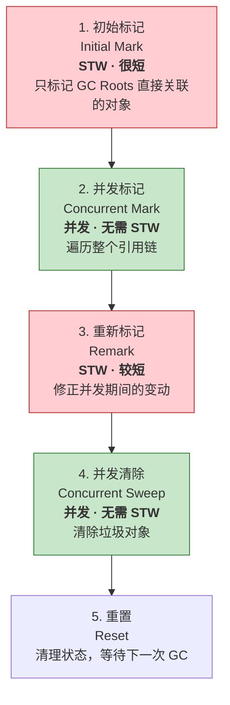

**详细解释每个阶段**：

##### 阶段1：初始标记（Initial Mark）—— STW，很快！
```
只做一件事：标记GC Roots能直接关联到的对象。

比如：
- 栈上的局部变量引用的对象 → 标记
- 静态变量引用的对象 → 标记

就像你收拾房间时，先把"手里正在用的"东西标记一下，很快！
```
- **STW**：需要暂停用户线程
- **速度**：非常快！因为只标记直接关联的对象

##### 阶段2：并发标记（Concurrent Mark）—— 并发，不需要STW！
```
从刚才标记的对象出发，遍历整个对象图，找出所有存活的对象。

这个过程和用户线程同时运行，你用你的，我标我的，互不影响！
```
- **并发**：和用户线程一起跑
- **速度**：虽然耗时，但不影响用户，用户感觉不到！

##### 阶段3：重新标记（Remark）—— STW，比初始标记长，但比并发标记短得多
```
并发标记时，用户线程还在跑，可能有些对象的引用关系变了：
- 有些本来死的对象，又被引用了（复活了）
- 有些本来活的对象，没人引用了（死了）

这个阶段就是来修正这些变动的！
```
- **STW**：需要暂停用户线程
- **速度**：比初始标记长，但比并发标记短得多

##### 阶段4：并发清除（Concurrent Sweep）—— 并发，不需要STW！
```
把标记出来的垃圾对象清理掉。

这个过程也和用户线程同时运行！
```
- **并发**：和用户线程一起跑
- **速度**：虽然耗时，但用户感觉不到！

##### 阶段5：重置（Reset）
```
清理CMS的内部状态，为下一次GC做准备。
```

**时间线图示**：

```mermaid
gantt
    title CMS 收集器时间线
    dateFormat X
    axisFormat %s
    section 用户线程
    用户运行 : active, 0, 10
    section GC 阶段
    初始标记 STW : crit, 1, 1.3
    并发标记 : active, 1.3, 7
    重新标记 STW : crit, 7, 7.5
    并发清除 : active, 7.5, 9.5
```

> ✅ **只有初始标记和重新标记需要 STW，而且都很短！**
> ✅ 最耗时的并发标记和并发清除都和用户线程一起跑！
> ✅ 这就是 CMS 低延迟的秘诀！

---

#### CMS的三大缺点

CMS虽然牛逼，但也不是完美的，有三个明显的缺点：

##### 缺点1：对CPU资源敏感

并发阶段虽然不暂停用户线程，但会占用CPU资源。

- CMS默认启动的GC线程数 = `(CPU数量 + 3) / 4`
- CPU=4：1条用户线程，1条GC线程 → 用户占75% CPU
- CPU=2：1条用户线程，1条GC线程 → 用户只占50% CPU！
- CPU越少，CMS对用户程序的影响越大

> 就像你一边开车一边打电话，虽然车还在开，但开车效率下降了。

##### 缺点2：无法处理"浮动垃圾"（Floating Garbage）

并发清除时，用户线程还在跑，还在不断产生新的垃圾：
```
并发标记完了，开始并发清除
    ↓
用户线程又产生了新的垃圾（比如把某个引用设为null）
    ↓
这些垃圾是标记完之后才产生的，这次GC清理不到
    ↓
它们叫"浮动垃圾"，只能等下一次GC再清理
```

**后果**：
- CMS不能等老年代快满了才GC，必须预留空间给用户线程运行
- JDK 5默认：老年代使用68%时触发CMS
- JDK 6默认：老年代使用92%时触发CMS
- 可以用`-XX:CMSInitiatingOccupancyFraction=N`调整

**Concurrent Mode Failure**：
- 如果CMS运行期间，预留的空间不够用户线程用
- 就会发生"Concurrent Mode Failure"
- 这时JVM会启动"应急预案"：临时用Serial Old来回收老年代
- Serial Old是单线程的，STW时间会很长！这就是为什么调优时要避免这个情况

##### 缺点3：内存碎片问题

CMS用的是**标记-清除**算法，会产生内存碎片。

碎片太多会导致：
- 明明还有很多空闲内存，但都是碎片
- 分配大对象时找不到连续的空间
- 不得不提前触发Full GC

**解决方案**：
- `-XX:+UseCMSCompactAtFullCollection`（默认开启）：Full GC时进行碎片整理
- `-XX:CMSFullGCsBeforeCompaction=N`：执行N次不压缩的Full GC后，来一次带压缩的
  - 默认0，即每次Full GC都进行碎片整理

---

#### CMS总结

**优点**：
- ✅ **低延迟**：STW时间很短，用户体验好
- ✅ **并发收集**：大部分工作和用户线程同时进行
- ✅ 响应时间优先的首选

**缺点**：
- ❌ 对CPU资源敏感
- ❌ 无法处理浮动垃圾，可能Concurrent Mode Failure
- ❌ 标记-清除产生内存碎片

**适用场景**：
- 互联网应用、B/S系统的服务端
- 重视响应速度，希望系统停顿时间短
- 比如：Web服务器、电商后台
- `-XX:+UseConcMarkSweepGC` 开启

> 💡 **比喻**：CMS就像边开车边修车，虽然有风险，但不用停车，乘客体验好！

---

### 4.8 G1收集器—— 面向服务端的下一代收集器 ⭐⭐

**全称**：Garbage-First

**定位**：JDK 9及之后的默认收集器，目标是取代CMS。

**设计目标**："鱼和熊掌兼得"——在高吞吐量的前提下，尽可能降低延迟。

---

#### G1的革命性变化——Region分区

G1之前的收集器，都是物理分代：
- 新生代 = Eden + S0 + S1（一块连续的内存）
- 老年代 = 另一块连续的内存

**G1 的创新——Region 分区**：

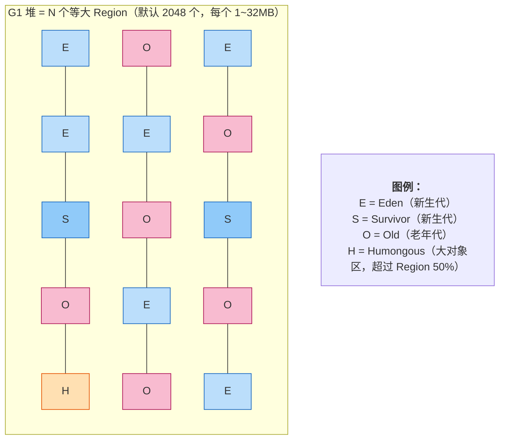

**关键创新点**：
1. **逻辑分代，物理不分**：每个Region可以是Eden、Survivor、Old，身份可以变
2. **化整为零**：每次只回收一部分Region，不是整个堆
3. **可预测的停顿时间模型**：用户可以设置期望的最大停顿时间，G1尽量满足

---

#### ❓ 关于Region的两个高频面试题

**问题1：G1中每个Region的大小都一样吗？**

✅ **答案：同一个JVM实例中，所有Region大小完全相同！**

**Region大小的确定规则**：
- 自动计算：`Region大小 = 堆内存总大小 / 2048`，然后向2的幂次对齐
- 必须是：1MB、2MB、4MB、8MB、16MB、32MB 中的一个（必须是2的幂次）
- 也可以手动指定：`-XX:G1HeapRegionSize=16m`

**自动计算参考表**：
| 堆内存大小 | 默认Region大小 |
|-----------|---------------|
| < 2GB | 1MB |
| 2GB ~ 4GB | 2MB |
| 4GB ~ 8GB | 4MB |
| 8GB ~ 16GB | 8MB |
| 16GB ~ 32GB | 16MB |
| > 32GB | 32MB |

**唯一例外**：大对象（Humongous）
- 超过Region大小50%的对象算大对象
- 大对象可能占用**连续多个Region**，但单个Region的大小还是和其他Region一样

---

**问题2：G1还有Eden:S0:S1 = 8:1:1的固定比例吗？**

❌ **答案：没有！比例是动态变化的！**

| 维度 | 传统分代（ParNew） | G1收集器 |
|------|------------------|---------|
| **物理结构** | 三块连续内存 | N个独立Region |
| **Eden:S0:S1** | 固定8:1:1 | 动态变化，无固定比例 |
| **区域身份** | 固定不变 | 可变，Region身份可随时切换 |
| **新生代大小** | 固定 | 每次GC都可能不一样 |

**G1怎么确定比例？**
- 根据`-XX:MaxGCPauseMillis`动态计算
- 这次回收多少个Eden Region能达到目标停顿时间，就回收多少
- Survivor的数量也根据每次存活对象的大小动态调整
- 完全灵活，没有固定的8:1:1限制

---

#### G1怎么做到"可预测的停顿"？

G1会跟踪每个Region里垃圾的"价值"：
- 价值 = 回收这个Region能获得多少空间 + 需要多少时间
- 建立一个"优先级列表"
- GC时，优先回收价值最高的Region（垃圾最多的）

> 这就是"Garbage-First"名字的由来：垃圾最多的优先回收！

**好处**：
- 用户说"希望每次GC停顿不超过10ms"
- G1就从优先级列表里挑，挑到预计时间接近10ms就停
- 这样就能把停顿时间控制在用户期望的范围内

---

#### G1的工作过程

和CMS类似，也分为几个阶段，但更复杂：

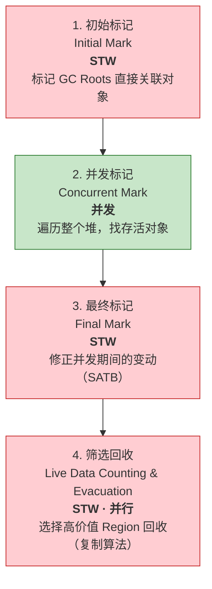

**阶段4：筛选回收是G1的核心**：
- 计算各个Region的回收价值和成本
- 根据用户期望的停顿时间制定回收计划
- 把存活对象复制到空的Region中（复制算法）
- 然后清空整个旧Region
- 因为是复制算法，**不会产生内存碎片**！

---

#### G1的三大关键优势

##### 优势1：不会产生内存碎片
- 整体看是标记-整理
- 局部（Region之间）看是复制算法
- 两种算法结合，不会产生内存碎片

##### 优势2：可预测的停顿时间模型
- 用户可以设置期望的最大停顿时间
- G1尽量满足这个目标
- 这是其他收集器做不到的

##### 优势3：GC方式更灵活
- 不是每次都要整个堆一起回收
- 可以只回收一部分Region
- 把大的GC拆成很多小的GC，每次停顿时间很短

---

#### G1和CMS对比

| 维度 | CMS | G1 |
|------|-----|----|
| **内存碎片** | 标记-清除，会产生碎片 | 标记-整理+复制，不会产生碎片 |
| **停顿控制** | 只能尽量缩短，无法预测 | 可预测的停顿时间模型 |
| **回收范围** | 每次回收整个老年代 | 每次只回收部分Region |
| **内存效率** | 需要预留空间处理浮动垃圾 | Region粒度，空间利用率高 |
| **GC效率** | 老年代越大，单次GC越长 | 不受堆大小限制，只回收有价值的Region |
| **适用堆大小** | 几个GB到十几个GB | 几十GB以上的大堆 |
| **算法** | 标记-清除 | 标记-整理 + 复制 |

---

#### G1的适用场景和参数

**适用场景**：
- 大内存应用（堆内存8GB以上）
- 替换CMS，解决CMS的内存碎片问题
- 需要可预测的停顿时间
- JDK 9及之后默认使用

**常用参数**：
```bash
-XX:+UseG1GC                    # 开启G1
-XX:MaxGCPauseMillis=200        # 期望的最大停顿时间，默认200ms
-XX:G1HeapRegionSize=16m        # 设置每个Region的大小（1~32MB，必须是2的幂）
-XX:InitiatingHeapOccupancyPercent=45  # 堆使用达到多少时触发并发标记，默认45%
```

> 💡 **比喻**：G1就像智能垃圾桶，自动识别哪个桶里垃圾最多，优先清理那个，而且每次只花你设定的时间，还会自动整理，不会乱七八糟。

---

### 4.9 ZGC—— 亚毫秒级停顿的黑科技 ⭐⭐⭐

**全称**：Z Garbage Collector

**定位**：JDK 11实验发布，JDK 15正式转正，JDK 21引入分代ZGC，是目前最先进的垃圾收集器。

**设计目标**：**STW停顿时间 < 1ms**，而且不随堆大小增加而增加！（1GB堆和1TB堆，停顿时间都差不多）

**📛 名称由来**：
- 官方说法：Z = Zetta（泽它，10²¹），表示支持万亿级别的堆内存
- 业内共识：Z = Zero（零），真正做到了"零"停顿（亚毫秒级）

---

#### ZGC的三大核心黑科技

##### 黑科技1：着色指针（Colored Pointers）⭐⭐⭐

**最核心的技术！** ZGC把信息直接存在指针本身的空位子上！

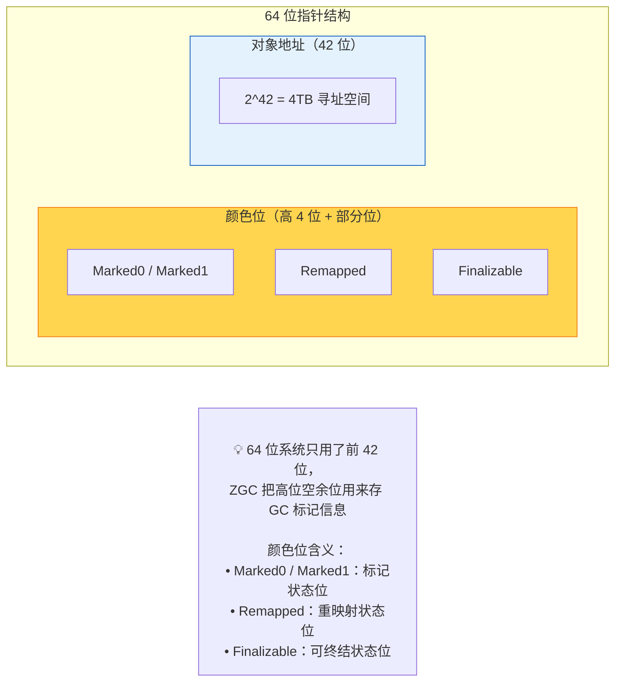

**牛逼在哪里？**
- 指针本身就带了对象的GC状态信息
- 不需要额外的数据结构来记录对象标记状态
- 转移对象时，直接改颜色位就行，不需要STW等所有指针都更新

---

##### 黑科技2：读屏障（Load Barrier）

**什么是读屏障？**
- 每次读对象指针时，先执行一小段额外的代码检查指针的颜色位
- 如果发现这个对象正在被转移，就帮着更新一下指针
- 这是个非常轻量级的操作，性能开销只有几个百分点

**为什么需要读屏障？这才是ZGC最牛逼的地方！🔥**

```mermaid
graph TB
    subgraph Traditional["传统 GC（CMS / G1）的死穴"]
        T1["对象 A 在 0x1000，要移到 0x2000"]
        T2["有 N 个指针都指向 0x1000"]
        T3["❌ 必须找到所有 N 个指针，全部改成 0x2000"]
        T4["❌ 这一步必须 STW！不然用户线程一边跑一边改就乱了"]
        T5["❌ N = 100 万 → STW 100ms"]
        T6["❌ N = 1000 万 → STW 1000ms"]
        T7["❌ 堆越大，指针越多 → STW 越长！这是死穴！"]
    end

    Arrow["↓↓↓ ZGC ↓↓↓"]

    subgraph ZGCBox["ZGC 的神级操作——读屏障 + 着色指针"]
        Z1["对象 A 在 0x1000，要移到 0x2000"]
        Z2["有 N 个指针都指向 0x1000"]
        Z3["✅ 第一步：把对象移到 0x2000"]
        Z4["✅ 第二步：通过着色指针把 0x1000 标记成「已转移」"]
        Z5["✅ 第三步：马上恢复用户线程！不等所有指针改完！"]
        Z6["用户线程读指针时：<br>  线程1 → 发现已转移 → 自己改成 0x2000 → 继续跑<br>  线程2 → 发现已转移 → 自己改成 0x2000 → 继续跑<br>  线程3 → 发现已转移 → 自己改成 0x2000 → 继续跑"]
        Z7["⚡ 改指针分摊到每个用户线程头上<br>⚡ GC 线程只需改 GC Roots 那几百个指针<br>⚡ STW 永远不到 1ms！不管堆是 8GB 还是 8TB！"]
    end

    Traditional --> Arrow --> ZGCBox

    style Traditional fill:#ffcdd2,stroke:#c62828
    style ZGCBox fill:#c8e6c9,stroke:#2e7d32
```

**🎯 核心区别：**
- **传统GC**：GC线程一个人改所有指针，必须一次性改完 → 所有人等他
- **ZGC**：每个用户线程用的时候自己改自己的 → 没人需要等

**💡 生活比喻：**
- 传统GC搬家：行政一个人搬10000人的东西，搬完才让大家复工 → 停工3天
- ZGC搬家：行政把东西搬过去贴个纸条，大家自己用的时候看到纸条自己去拿 → 几乎不停工

这就是ZGC能做到亚毫秒停顿的最关键原因！彻底解决了"堆越大STW越长"的死穴！

---

##### 黑科技3：多重映射内存视图

ZGC 把同一块物理内存映射到 3 个不同的虚拟地址：

```mermaid
graph LR
    subgraph PhysMem["同一块物理内存页"]
        PM["物理内存数据"]
    end

    subgraph VirtAddr["三个虚拟地址视图（指向同一物理内存）"]
        direction TB
        VA["虚拟地址 A → Marked0 状态使用"]
        VB["虚拟地址 B → Marked1 状态使用"]
        VC["虚拟地址 C → Remapped 状态使用"]
    end

    PM -.-> VA
    PM -.-> VB
    PM -.-> VC

    Note["<br>💡 切换 GC 标记状态时：<br>不需要遍历所有对象改标记位<br>直接切换使用哪个虚拟地址视图就行！"]

    style PhysMem fill:#fff3e0,stroke:#e65100
    style VirtAddr fill:#e3f2fd,stroke:#1565c0
```

---

#### ZGC的工作过程（单代ZGC）

```mermaid
graph TD
    S1["1. 暂停开始<br>Pause Mark Start<br><b>STW · < 1ms</b><br>初始标记 GC Roots 直接关联对象"]
    S2["2. 并发标记<br>Concurrent Mark<br><b>并发</b><br>着色指针 + 读屏障，遍历所有对象"]
    S3["3. 暂停标记结束<br>Pause Mark End<br><b>STW · < 1ms</b><br>处理引用，结束标记阶段"]
    S4["4. 并发准备重定位<br>Concurrent Prepare for Relocate<br><b>并发</b><br>选择要回收的 Page，准备转移"]
    S5["5. 暂停重定位开始<br>Pause Relocate Start<br><b>STW · < 1ms</b><br>转移 GC Roots 直接关联对象"]
    S6["6. 并发重定位<br>Concurrent Relocate<br><b>并发</b><br>读屏障自动修正指针<br>不需要等所有指针都修正完！"]

    S1 --> S2 --> S3 --> S4 --> S5 --> S6

    style S1 fill:#ffcdd2,stroke:#c62828
    style S3 fill:#ffcdd2,stroke:#c62828
    style S5 fill:#ffcdd2,stroke:#c62828
    style S2 fill:#c8e6c9,stroke:#2e7d32
    style S4 fill:#c8e6c9,stroke:#2e7d32
    style S6 fill:#c8e6c9,stroke:#2e7d32
```

> ✅ **所有 STW 阶段加起来通常都 < 1ms！**

**✅ 所有STW阶段加起来通常都 < 1ms！**

---

#### JDK 21：分代ZGC（Generational ZGC）

**为什么需要分代？**
- 98%的对象都是"朝生夕死"的
- 单代ZGC每次都要扫描整个堆，有点浪费
- 分代后可以专门针对新生代做更高效的回收

**分代 ZGC 的改进**：

```mermaid
graph TB
    subgraph GenZGC["分代 ZGC 堆"]
        direction LR
        subgraph YoungGen["年轻代 Young"]
            YGC["年轻代 GC<br>只回收年轻代 → 更快！"]
        end
        subgraph OldGen["老年代 Old"]
            OGC["老年代 GC<br>频率低很多 → 回收老年代"]
        end
    end

    subgraph Benefits["四大好处"]
        direction TB
        B1["1. GC 频率降低"]
        B2["2. 单次 GC 更短"]
        B3["3. 吞吐量提升"]
        B4["4. 需要的内存更少"]
    end

    style YoungGen fill:#e3f2fd,stroke:#1565c0
    style OldGen fill:#fce4ec,stroke:#c2185b
    style Benefits fill:#f3e5f5,stroke:#6a1b9a
```

> ⚠️ **注意**：JDK 21引入了分代ZGC，但 **G1仍然是默认垃圾收集器**！
> 需要手动加参数 `-XX:+UseZGC` 才会用ZGC，分代ZGC在JDK 21+是默认开启的（用了ZGC就默认分代）。

---

#### ZGC的性能表现

| 指标 | ZGC | G1 | CMS |
|------|-----|----|-----|
| **STW停顿时间** | < 1ms | 10~200ms | 10~100ms |
| **停顿随堆大小变化** | ❌ 几乎不变 | ✅ 堆越大越长 | ✅ 堆越大越长 |
| **最大支持堆** | 16TB | 64GB左右 | 8GB左右 |
| **吞吐量损失** | ~15% | ~10% | ~20% |
| **内存碎片** | ❌ 无 | ❌ 无 | ✅ 有 |

**🔥 最牛逼的一点：堆从8GB升到8TB，ZGC的停顿时间还是<1ms！**

---

#### ZGC的适用场景和参数

**适用场景**：
- 超低延迟要求的应用（金融交易、实时系统）
- 大内存应用（16GB+堆）
- JDK 17+生产环境强烈推荐
- JDK 21+首选

**常用参数**：
```bash
-XX:+UseZGC                    # 开启ZGC
-XX:+UseLargePages             # 开启大页，进一步提升性能
-Xmx16G                        # 堆内存大小
-XX:ZCollectionInterval=30     # 最小GC间隔（秒）
-XX:+UnlockExperimentalVMOptions -XX:ZGenerational  # JDK 21前开启分代ZGC
```

---

#### ZGC常见问题解答

**Q: ZGC的停顿这么短，有什么缺点吗？**
- 吞吐量比G1略低一点（大概多损失5%的CPU）
- 对CPU要求更高，需要更多核心来跑并发GC线程
- 内存占用也略高一点

**Q: ZGC什么时候适合用？什么时候不适合？**
- ✅ 适合：对延迟敏感、大堆、CPU资源充足
- ❌ 不适合：小堆（<8GB）、CPU资源紧张、极端追求吞吐量

**Q: ZGC有分代吗？**
- JDK 21之前：单代ZGC
- JDK 21及之后：分代ZGC，**使用ZGC时默认开启分代**（但ZGC本身不是默认GC）

**Q: ZGC是JDK 21的默认垃圾收集器吗？**
- ❌ 不是！JDK 9 到 JDK 21+，**默认垃圾收集器一直都是G1**
- ZGC需要手动加参数 `-XX:+UseZGC` 开启
- Shenandoah也是一样，需要手动开启

---

> 💡 **比喻**：ZGC就像"边开车边换轮胎"的顶级赛车手，车子（用户线程）一直在跑，他在旁边偷偷把轮胎（垃圾对象）换完了，乘客（用户）几乎感觉不到任何颠簸！

---

### 4.9.1 补充：Shenandoah收集器（Red Hat开发）

Shenandoah是Red Hat开发的另一款低延迟垃圾收集器，定位和ZGC类似：

| 对比项 | Shenandoah | ZGC |
|--------|-----------|-----|
| **开发公司** | Red Hat | Oracle |
| **目标停顿** | < 10ms | < 1ms |
| **核心技术** | 读屏障 + 转发指针 | 读屏障 + 着色指针 |
| **分代** | JDK 17+支持分代 | JDK 21+支持分代 |
| **Oracle JDK 8/11** | ❌ 没有 | ✅ 有（实验性） |
| **OpenJDK** | ✅ 有 | ✅ 有 |

> 💡 **简单区别**：
> - 追求极致超低延迟 → 选ZGC
> - 用OpenJDK、追求兼容性 → Shenandoah也是不错的选择
> - 两者都是并发整理、超低延迟，差异不大

---

### 4.10 垃圾收集器选择指南

**怎么选垃圾收集器？**

| 应用场景 | 推荐组合 | 说明 |
|---------|---------|------|
| **桌面应用、小内存、单核** | Serial + Serial Old | 简单高效 |
| **后台计算、追求吞吐量** | Parallel Scavenge + Parallel Old | JDK 5-JDK 8默认 |
| **Web应用、追求低延迟** | ParNew + CMS | JDK 9前可用，JDK 9-14过时，JDK 15移除 |
| **大多数场景默认** | G1 | **JDK 9-JDK 23+ 一直是默认** |
| **超低延迟场景** | ZGC / Shenandoah | 需要手动开启，JDK 15+生产可用 |

---

### 🔥 垃圾收集器发展历程与默认选择 ⭐⭐⭐

> **重要说明**：Oracle JDK 和 OpenJDK 在垃圾收集器实现上**完全一致**，因为它们用的是同一个HotSpot代码库。以下历程对两者都适用。

#### 默认GC变化时间线

| JDK版本 | 默认垃圾收集器 | 重要变化 |
|---------|--------------|---------|
| **JDK 1.3 及之前** | Serial收集器 | 单线程，只能用Serial |
| **JDK 1.4** | Serial收集器 | 引入Parallel收集器，但不是默认 |
| **JDK 5 - JDK 8** | Parallel Scavenge + Parallel Old | 吞吐量优先成为默认 |
| **JDK 9 - JDK 21+** | **G1 收集器** | G1成为默认，CMS被标记为过时 |
| **未来版本（JDK 23+？）** | ZGC可能成为默认 | 目前还在讨论中 |

#### ZGC和Shenandoah的发展历程

| JDK版本 | ZGC状态 | Shenandoah状态 |
|---------|---------|---------------|
| **JDK 11** | 实验性发布（Linux only） | - |
| **JDK 12** | - | 实验性发布 |
| **JDK 13** | 支持macOS/Windows | - |
| **JDK 15** | ✅ 正式转正，生产可用 | ✅ 正式转正 |
| **JDK 17** | 生产级，推荐使用 | 生产级 |
| **JDK 21** | 引入分代ZGC，性能大幅提升 | 持续改进 |

> 💡 **关键点**：
> 1. **G1从JDK 9开始一直是默认GC**，直到最新的JDK 21、JDK 23都是
> 2. ZGC和Shenandoah虽然功能强大，但都是**可选**的，需要手动开启
> 3. Oracle JDK和OpenJDK没有区别，都是一样的HotSpot，一样的GC实现

#### 怎么开启非默认的GC？

```bash
# 开启ZGC（JDK 15+ 生产可用）
-XX:+UseZGC

# 开启Shenandoah（注意：Oracle JDK 8/11没有Shenandoah，OpenJDK有）
-XX:+UseShenandoahGC

# 开启Parallel（吞吐量优先）
-XX:+UseParallelGC

# 开启CMS（JDK 9-14可用，JDK 15移除）
-XX:+UseConcMarkSweepGC

# 查看当前JDK的默认GC
java -XX:+PrintCommandLineFlags -version  # 看输出中的 UseXXGC

# 输出示例（JDK 21）：
# -XX:+UseG1GC  ← 看到了吗？默认还是G1！
# -XX:MaxGCPauseMillis=200
# ...

```

---

**补充：Oracle JDK vs OpenJDK 的关系**
- JDK 11之前：Oracle JDK有商业特性，OpenJDK是开源版
- JDK 11及之后：两者基本一样，Oracle JDK只是多了一个商业支持证书
- **垃圾收集器方面完全没有区别**，G1/ZGC/Shenandoah在两者中都一样

---

## 五、内存分配与回收策略

> 内存分配：对象往哪放？
> 回收策略：对象什么时候进入老年代？

---

### 5.1 原则1：对象优先在Eden分配

**大多数情况下，对象在新生代Eden区分配**。

```mermaid
graph TD
    A["new Object()"] --> B["优先分配到 Eden 区"]
    B --> C["Eden 区满了"]
    C --> D["触发 Minor GC"]
    D --> E["Eden 中存活对象复制到 Survivor"]
```

**示例**：
```java
// 堆内存20MB，新生代10MB（Eden 8MB + S0 1MB + S1 1MB）
// -Xms20M -Xmx20M -Xmn10M -XX:+PrintGCDetails

byte[] allocation1 = new byte[2*1024*1024];  // 2MB，分配在Eden
byte[] allocation2 = new byte[2*1024*1024];  // 2MB，分配在Eden
byte[] allocation3 = new byte[2*1024*1024];  // 2MB，分配在Eden
// 此时Eden用了6MB，还剩2MB

byte[] allocation4 = new byte[4*1024*1024];  // 4MB！Eden放不下了
    ↓
触发Minor GC！
GC时发现6MB对象都存活，Survivor只有1MB，放不下
    ↓
分配担保！6MB对象直接进入老年代
    ↓
Eden清空，allocation4分配在Eden

结果：Eden 4MB，Survivor 0MB，老年代 6MB
```

---

### 5.2 原则2：大对象直接进入老年代

**什么是大对象？**
- 需要大量连续内存空间的对象
- 比如：很长的字符串、很大的数组

**为什么大对象要直接进老年代？**
- 大对象在Eden放不下
- 在Eden和Survivor之间复制来复制去，开销大
- 直接扔到老年代，避免来回复制

**参数设置**：
```bash
-XX:PretenureSizeThreshold=3145728  # 超过3MB的对象直接进老年代
```

> ⚠️ **注意**：这个参数只对Serial和ParNew有效，Parallel Scavenge不认识这个参数。G1有Humongous区专门存大对象。

**避坑指南**：
> 写代码时尽量避免"朝生夕死"的大对象，比如：
> ```java
> // 不好的写法：每次调用都创建大数组，很快触发GC
> public void badMethod() {
>     byte[] data = new byte[10*1024*1024];  // 10MB大对象，直接进老年代
>     // 只用一次，然后就死了...
> }
> ```

---

### 5.3 原则3：长期存活的对象进入老年代

**对象年龄计数器**：
- 对象在Eden出生，经过一次Minor GC后还活着，并且能被Survivor容纳
- 就被移动到Survivor，年龄设为1
- 每熬过一次Minor GC，年龄+1
- 年龄达到一定程度（默认15），就晋升到老年代

**参数设置**：
```bash
-XX:MaxTenuringThreshold=15  # 年龄达到15岁进入老年代
```

**晋升过程图示**：

```mermaid
graph TD
    A0["年龄 0：在 Eden 出生"] -->|"Minor GC，存活"| A1["年龄 1：到 Survivor"]
    A1 -->|"又一次 Minor GC，存活"| A2["年龄 2：继续在 Survivor"]
    A2 -->|"..."| A15["年龄 15：晋升到老年代！"]

    style A0 fill:#bbdefb,stroke:#1565c0
    style A1 fill:#90caf9,stroke:#1565c0
    style A2 fill:#64b5f6,stroke:#1565c0
    style A15 fill:#f8bbd0,stroke:#ad1457
```

---

### 5.4 原则4：动态对象年龄判定

JVM不会死板地等到年龄15才晋升，还有"动态年龄判定"：

**规则**：
> 如果Survivor空间中，相同年龄所有对象大小的总和 > Survivor空间的一半
> 那么年龄大于等于该年龄的对象，直接进入老年代，不用等MaxTenuringThreshold

**示例**：

```mermaid
graph TB
    subgraph Survivor["Survivor 空间 1MB"]
        A1["年龄 1 的对象：300KB"]
        A2["年龄 2 的对象：300KB"]
        Total["合计：600KB > Survivor 一半（500KB）"]
    end

    Result["结果：年龄 ≥ 2 的对象，直接晋升老年代！<br>虽然才 2 岁，远没到 15 岁..."]

    Survivor --> Result

    style Survivor fill:#e3f2fd,stroke:#1565c0
    style Result fill:#fce4ec,stroke:#c2185b
```

**目的**：更加灵活地适应不同程序的内存情况。

---

### 5.5 原则5：空间分配担保

**什么是分配担保？**
> Minor GC之前，JVM检查老年代最大可用的连续空间，是否大于新生代所有对象的总空间。
> 如果是，Minor GC是安全的。
> 如果不是，JVM查看HandlePromotionFailure设置，看是否允许担保失败。

**详细流程**：

```mermaid
graph TD
    A["发生 Minor GC 之前"] --> B{"老年代最大连续空间<br>> 新生代所有对象总空间？"}
    B -->|"是"| C["安全，放心 Minor GC"]
    B -->|"否"| D{"检查 HandlePromotionFailure<br>是否允许担保失败？"}
    D -->|"允许"| E{"老年代最大连续空间<br>> 历次晋升对象的平均大小？"}
    E -->|"是"| F["尝试 Minor GC（有风险）"]
    E -->|"否"| G["改为 Full GC"]
    D -->|"不允许"| G
```

**为什么需要担保？**
- 极端情况下，Minor GC后新生代所有对象都存活了（100%存活）
- Survivor肯定放不下，需要老年代来"担保"
- 让这些对象直接进入老年代
- 所以要确保老年代有足够的空间放下这些对象

---

### 5.6 内存分配策略总结

| 策略 | 规则 | 目的 |
|------|------|------|
| **对象优先在Eden分配** | 大多数对象在Eden创建，Eden满了触发Minor GC | 利用新生代对象"朝生夕死"的特性 |
| **大对象直接进老年代** | 超过PretenureSizeThreshold的对象直接分配在老年代 | 避免大对象在Survivor之间来回复制 |
| **长期存活对象进老年代** | 对象年龄达到MaxTenuringThreshold（默认15）晋升 | 真正"老"的对象去老年代 |
| **动态年龄判定** | Survivor中同年龄对象总和>Survivor一半，年龄>=该年龄的都晋升 | 灵活适应不同程序的情况 |
| **空间分配担保** | Minor GC前检查老年代空间是否足够，不够就Full GC | 避免Minor GC时老年代放不下导致失败 |

---

## 六、常见面试题

### Q1: 怎么判断对象是否可以被回收？引用计数法和可达性分析的区别？

**参考答案**：

判断对象是否可回收有两种算法：

**1. 引用计数法**：
- 每个对象有一个引用计数器，被引用时+1，引用失效时-1
- 计数器为0就可以回收
- 优点：实现简单，效率高
- **致命缺点**：无法解决循环引用问题（A引用B，B引用A，计数器永远不为0）
- HotSpot**没有使用**引用计数法

**2. 可达性分析算法**（HotSpot采用）：
- 从GC Roots（根对象）出发，沿着引用链搜索
- 能到达的对象是存活的，不可达的对象可以回收
- GC Roots包括：栈中局部变量、静态变量、常量、Native方法引用等
- 可以解决循环引用问题

---

### Q2: Java中有哪四种引用？区别是什么？

**参考答案**：

| 引用类型 | 回收时机 | 用途 |
|---------|---------|------|
| **强引用** | 永远不回收 | 普通对象引用，`Object obj = new Object()` |
| **软引用** | 内存不足时回收 | 缓存，内存不够时自动释放 |
| **弱引用** | 下次GC时一定回收 | 缓存、避免内存泄漏（ThreadLocal） |
| **虚引用** | 对象回收时收到通知 | 管理堆外内存（DirectByteBuffer） |

---

### Q3: 常见的垃圾收集算法有哪些？优缺点？

**参考答案**：

**1. 标记-清除算法**：
- 先标记存活对象，再清除未标记的
- 优点：实现简单
- 缺点：内存碎片、效率随对象数量下降
- 适用：老年代

**2. 复制算法**：
- 内存分成两块，每次只用一块，把存活对象复制到另一块，然后清空当前块
- 优点：没有内存碎片、效率高
- 缺点：空间浪费、对象存活率高时复制开销大
- 适用：新生代（对象存活率低）

**3. 标记-整理算法**：
- 先标记存活对象，然后把存活对象都移到一端，清除边界以外的内存
- 优点：没有内存碎片
- 缺点：需要移动对象，STW时间长
- 适用：老年代

**4. 分代收集算法**：
- 把对象按年龄分到不同代，新生代用复制算法，老年代用标记-清除/标记-整理
- 现在的主流实现

---

### Q4: 详细描述CMS收集器的工作过程和优缺点

**参考答案**：

CMS（Concurrent Mark Sweep）是一款以低延迟为目标的老年代收集器。

**工作过程**：
1. **初始标记**：STW，只标记GC Roots直接关联的对象，很快
2. **并发标记**：和用户线程并发，遍历整个引用链，耗时但不影响用户
3. **重新标记**：STW，修正并发标记期间引用变化，比初始标记长但比并发标记短
4. **并发清除**：和用户线程并发，清除垃圾对象

**只有初始标记和重新标记需要STW，而且都很短！**

**优点**：
- ✅ 低延迟，停顿时间短
- ✅ 大部分工作和用户线程并发
- ✅ 适合对响应时间要求高的应用（Web服务器）

**缺点**：
- ❌ 对CPU资源敏感，并发阶段占用CPU
- ❌ 无法处理浮动垃圾，可能发生Concurrent Mode Failure
- ❌ 标记-清除算法产生内存碎片

---

### Q5: G1收集器和CMS相比有什么优势？

**参考答案**：

G1相比CMS的优势：

1. **不会产生内存碎片**：
   - CMS用标记-清除，会产生碎片
   - G1用标记-整理+复制算法，不会产生碎片

2. **可预测的停顿时间模型**：
   - CMS只能尽量缩短停顿，无法预测
   - G1可以让用户设置期望的最大停顿时间，尽量满足

3. **Region分区更灵活**：
   - CMS物理分代，每次回收整个老年代
   - G1分成多个Region，每次只回收部分高价值Region
   - 堆越大，G1优势越明显

4. **不需要预留空间处理浮动垃圾**：
   - CMS需要预留空间给用户线程并发运行
   - G1的Region粒度更细，空间利用率更高

---

### Q6: 对象什么时候进入老年代？

**参考答案**：

对象进入老年代有4种情况：

1. **大对象直接进入**：超过`-XX:PretenureSizeThreshold`设置的大对象，直接分配在老年代，避免在Survivor之间复制

2. **长期存活对象进入**：对象在Survivor中每熬过一次Minor GC年龄+1，达到`-XX:MaxTenuringThreshold`（默认15）时晋升

3. **动态年龄判定**：Survivor中相同年龄所有对象大小总和 > Survivor空间的一半，年龄大于等于该年龄的对象直接晋升，不用等到15岁

4. **空间分配担保失败**：Minor GC时Survivor放不下存活对象，老年代通过分配担保机制直接接纳这些对象

---

### Q7: 什么是Stop-The-World？为什么会发生？

**参考答案**：

**Stop-The-World（STW）**：垃圾收集时，必须暂停所有用户线程，整个应用看起来像卡住了一样。

**为什么必须STW？**
- 如果不暂停用户线程，标记垃圾的过程中，对象的引用关系还在不断变化
- 刚标记完一个对象是活的，用户线程又把它引用置空了，它就死了
- 刚标记完一个对象是死的，用户线程又引用它了，它又活了
- 这样垃圾标记永远准确不了！

**什么操作会导致STW？**
- GC Roots枚举（所有收集器都有这一步）
- 新生代Minor GC
- 老年代Major GC、Full GC
- CMS的初始标记、重新标记阶段
- G1的初始标记、最终标记、筛选回收阶段

**优化方向**：
- 让STW时间越短越好
- 把能并发的工作都放到并发阶段做
- 把大的GC拆成很多小的GC

---

### Q8: 什么是安全点和安全区域？

**参考答案**：

**安全点（Safepoint）**：
- 程序执行时，不是在任何地方都能停下来GC，必须跑到安全点才能停
- 安全点通常选在方法调用、循环跳转、异常跳转等"长时间执行"的指令结束处
- GC时，所有线程都跑到最近的安全点挂起，才能开始GC

**安全区域（Safe Region）**：
- 安全点解决了"运行中的线程"的问题，但Sleep或阻塞的线程没法跑到安全点
- 安全区域是指一段代码片段，其中引用关系不会发生变化
- 线程进入安全区域时标记自己，离开时检查GC是否完成
- 在安全区域内随时可以GC

---

### Q9: Minor GC、Major GC、Full GC有什么区别？

**参考答案**：

| GC类型 | 发生区域 | 触发条件 | 速度 | STW时间 |
|--------|---------|---------|------|---------|
| **Minor GC** | 新生代 | Eden区满了 | 很快 | 很短 |
| **Major GC** | 老年代 | 老年代空间不足 | 较慢 | 较长 |
| **Full GC** | 整个堆 | 老年代满、元空间满、System.gc()、分配担保失败 | 最慢 | 很长 |

**注意**：实际情况中，很多Virtual Machine的Major GC实现上和Full GC差不多，都是整个堆一起回收。

---

### Q10: 怎么选择垃圾收集器？

**参考答案**：

选择垃圾收集器需要根据应用场景：

1. **如果是桌面应用、小内存、单核CPU**：
   - 选 Serial + Serial Old
   - 简单高效，没有线程切换开销

2. **如果是后台计算任务，追求吞吐量**：
   - 选 Parallel Scavenge + Parallel Old
   - 高吞吐量优先，适合不需要太多用户交互的场景

3. **如果是Web应用、互联网项目，追求低延迟**：
   - JDK 8及之前：ParNew + CMS
   - JDK 9及之后：G1

4. **如果是大内存应用（8GB以上）**：
   - 选 G1
   - G1的Region分区和可预测停顿更有优势

5. **JDK 17+追求极致低延迟**：
   - 选 ZGC 或 Shenandoah
   - 停顿时间可以做到亚毫秒级

> 最后一句话：**没有最好的收集器，只有最合适的收集器**，需要根据实际情况压测调优。

---

## 七、JVM Sharing——类数据共享机制 ⭐

> **面试高频考点**：JVM Sharing是什么？CDS/AppCDS有什么用？能带来多少性能提升？

---

### 7.1 什么是JVM Sharing？

**JVM Sharing = Class Data Sharing（CDS）= 类数据共享**

**通俗理解**：
> 同一个服务器上跑了10个Java进程，每个都要加载`java.lang.String`、`java.util.ArrayList`这些类。
> 10个JVM各自加载一份，内存里就有10份重复的数据，太浪费了！
> 
> JVM Sharing就是：把这些共享类提前加载好，存在一个共享的归档文件里。
> 多个JVM进程可以直接映射（map）这份归档到内存，**大家共享同一份数据**！

```mermaid
graph TB
    subgraph Traditional["传统方式"]
        direction LR
        J1["JVM1<br>加载 String → 0x1000"]
        J2["JVM2<br>加载 String → 0x2000"]
        J3["JVM3<br>加载 String → 0x3000"]
        TNote["❌ 同一份类数据，内存里存了 N 份！"]
    end

    subgraph CDSWay["CDS 方式"]
        Archive["共享归档文件<br>（String, ArrayList, HashMap...）"]

        J1c["JVM1 → 0x8000"]
        J2c["JVM2 → 0x8000"]
        J3c["JVM3 → 0x8000"]

        Archive -.->|"直接映射到内存"| J1c
        Archive -.->|"直接映射到内存"| J2c
        Archive -.->|"直接映射到内存"| J3c

        CNote["✅ 10 个 JVM 共享同一份类数据！"]
    end

    style Traditional fill:#ffcdd2,stroke:#c62828
    style CDSWay fill:#c8e6c9,stroke:#2e7d32
```

---

### 7.2 JVM Sharing的两大好处

#### 好处1：节省内存——立竿见影！

```mermaid
graph LR
    subgraph NoCDS["不用 CDS（10 个进程）"]
        direction TB
        N1["10 × 50MB = 500MB<br>（每个进程各加载一份基础类）"]
    end

    subgraph WithCDS["用 CDS（10 个进程）"]
        direction TB
        W1["共享 50MB + 每进程私有 5MB"]
        W2["≈ 50MB + 10×5MB = 100MB"]
    end

    Result["✅ 节省了 400MB 内存！"]

    NoCDS --> WithCDS --> Result

    style NoCDS fill:#ffcdd2,stroke:#c62828
    style WithCDS fill:#c8e6c9,stroke:#2e7d32
```

#### 好处2：加快启动速度——冷启动更快！

类加载是Java启动慢的重要原因之一。用了CDS：
- ❌ 不需要：从jar包读取字节码 → 验证 → 解析 → 初始化
- ✅ 只需要：直接把共享归档文件映射到内存

**实测性能提升**：
- 启动速度提升 **30% ~ 50%**
- Spring Boot应用冷启动时间从10秒降到6-7秒是正常的

---

### 7.3 CDS的发展历程

CDS从JDK 1.5就有了，但一直在进化：

| JDK版本 | CDS类型 | 能共享什么类 | 说明 |
|---------|---------|-------------|------|
| **JDK 1.5 - JDK 8** | 基础CDS | 只能共享 **rt.jar** 中的类（JDK内置类） | 只能系统类，不能共享应用类 |
| **JDK 9 - JDK 10** | AppCDS | 可以共享 **应用类** | 应用自己写的类也能共享了，但要手动dump |
| **JDK 11 - JDK 12** | 动态CDS（Dynamic CDS） | 自动在退出时dump | 不用手动指定类列表了，更方便 |
| **JDK 13+** | 默认开启基础CDS | 基础CDS默认开 | 不用加参数了，开箱即用 |

---

### 7.4 不同CDS类型详解

#### 1）基础CDS（Class Data Sharing）—— JDK 5+

**只能共享JDK内置的系统类**：
- `java.lang.*`
- `java.util.*`
- `java.io.*`
- ...其他rt.jar中的类

**JDK 13及之后默认开启**：
```bash
# JDK 13+ 默认就开了，不用加参数
java -jar your-app.jar

# 查看CDS信息
java -Xshare:on -version
```

**手动开启（JDK 8-12）**：
```bash
# JDK 8-12需要手动开启
java -Xshare:on -jar your-app.jar
```

---

#### 2）AppCDS（Application CDS）—— JDK 9+

**可以共享应用自己的类了！** 这是质的飞跃！

**AppCDS支持共享**：
- ✅ JDK系统类
- ✅ 应用自己写的类（`com.xxx.XXX`）
- ✅ 第三方依赖库的类（`org.springframework.*`）

**AppCDS使用步骤（JDK 10）**：
```bash
# 步骤1：运行一次应用，记录要共享的类列表
java -XX:DumpLoadedClassList=classes.lst -jar your-app.jar
# 退出后会生成 classes.lst 文件，里面是加载过的所有类

# 步骤2：根据类列表生成共享归档文件
java -XX:SharedClassListFile=classes.lst \
     -XX:SharedArchiveFile=app-cds.jsa \
     -Xshare:dump \
     -jar your-app.jar
# 生成 app-cds.jsa 归档文件

# 步骤3：使用归档文件启动应用
java -XX:SharedArchiveFile=app-cds.jsa \
     -Xshare:on \
     -jar your-app.jar
```

**实测效果**：
- 大型Spring Boot应用：**启动速度提升40%+**
- 内存节省：**每个JVM节省几十到上百MB**

---

#### 3）动态CDS（Dynamic CDS）—— JDK 11+

AppCDS虽然好，但要手动搞两步有点麻烦。动态CDS简化了：

**使用方法（超级简单）**：
```bash
# 第一次运行，加参数，退出时自动dump归档
java -XX:ArchiveClassesAtExit=app-cds.jsa -jar your-app.jar
# 正常退出后，自动生成 app-cds.jsa

# 之后每次启动都用这个归档
java -XX:SharedArchiveFile=app-cds.jsa -jar your-app.jar
```

**不用手动指定类列表了！** JVM在退出时自动把这次运行加载的类都dump到归档里。

---

### 7.5 CDS的底层原理

#### 共享归档文件里存了什么？

不是简单存字节码，而是存了**经过解析、验证、甚至部分JIT编译后的类数据**：

```mermaid
graph TD
    subgraph JarClass["普通 jar 中的 class 文件"]
        direction TB
        J1["字节码（二进制）"]
        J2["需要：加载 → 验证 → 解析 → 初始化 → ..."]
    end

    subgraph CDSArchive["CDS 归档文件中的类数据"]
        direction TB
        C1["✅ 已经解析好的类元数据"]
        C2["✅ 已经验证过，无需再验证"]
        C3["✅ 内存布局已优化好，可直接映射"]
        C4["✅ 甚至包含早期 JIT 编译代码（AOT）"]
    end

    Result["直接映射就能用，跳过很多步骤！"]

    JarClass --> CDSArchive --> Result

    style JarClass fill:#fff3e0,stroke:#e65100
    style CDSArchive fill:#c8e6c9,stroke:#2e7d32
```

#### 内存映射是怎么做到共享的？

```mermaid
graph LR
    subgraph VirtMem["虚拟地址空间"]
        direction TB
        J1["JVM1 虚拟地址<br>0x7f0000000000"]
        J2["JVM2 虚拟地址<br>0x7f0000000000"]
        J3["JVM3 虚拟地址<br>0x7f0000000000"]
    end

    subgraph PhysMem["物理内存"]
        PM["同一块物理内存页<br>（共享归档数据）"]
    end

    J1 -.-> PM
    J2 -.-> PM
    J3 -.-> PM

    Note["<br>💡 这是操作系统的虚拟内存机制<br>CDS 只是利用了这个机制而已"]

    style VirtMem fill:#e3f2fd,stroke:#1565c0
    style PhysMem fill:#fff3e0,stroke:#e65100
```

---

### 7.6 CDS的限制和注意事项

#### 不是所有类都能共享

**能被共享的条件**：
1. 类必须是 **final** 的？❌ 不对，没有这个限制
2. 类必须在 **同一个类加载器** 中加载？✅ 对，AppCDS只支持系统类加载器加载的类
3. 不能是 **动态生成的类**（比如CGLIB生成的代理类）❌ 这些不能共享

**哪些类不能被CDS共享**：
- 反射动态生成的类
- 自定义类加载器加载的类（非系统类加载器）
- lambda表达式生成的匿名类
- JDK动态代理生成的类

#### CDS归档文件是"绑定"的

⚠️ **重要**：
- CDS归档文件是和**特定JDK版本、特定操作系统、特定CPU架构**绑定的
- 不能把Linux上生成的jsa文件拿到Windows用
- 不能把JDK 11生成的jsa文件拿到JDK 17用
- JDK小版本升级（11.0.1→11.0.2）通常可以，但保险起见最好重新生成

---

### 7.7 生产环境使用建议

#### 什么时候建议用CDS？

✅ **强烈建议使用的场景**：
1. 一台机器上跑多个Java进程（比如微服务、K8s Pod）
2. 对启动速度有要求的应用（Serverless、FaaS、快速扩缩容）
3. 内存敏感的场景（容器环境、边缘设备）

❌ **收益不大的场景**：
1. 单台机器只跑一个大Java进程（内存节省不明显）
2. 应用大部分类都是动态生成的（比如大量使用CGLIB代理）

#### 生产环境最佳实践

```bash
# JDK 11+ 推荐配置（动态CDS）
# Dockerfile 中：
RUN java -XX:ArchiveClassesAtExit=/app/app-cds.jsa -jar /app/app.jar --spring.context.exit=onRefresh
# 上面这条命令让Spring启动后马上退出，完成类加载并dump归档

# 然后真正启动时用这个归档
CMD ["java", "-XX:SharedArchiveFile=/app/app-cds.jsa", "-jar", "/app/app.jar"]
```

**性能参考**：
- 普通Spring Boot应用：启动时间减少 30%~50%
- 内存占用减少 10%~30%
- 几乎没有副作用，建议能开就开！

---

### 7.8 JDK 19+：静态CDS归档（JLink + CDS）

JDK 19之后，你甚至可以把CDS归档直接打包到自定义JRE镜像里：

```bash
# 用jlink创建自定义JRE，同时包含CDS归档
jlink --add-modules java.base,java.xml \
      --output my-jre \
      --generate-cds-archive

# 生成的my-jre已经自带CDS归档，直接用就行
./my-jre/bin/java -jar app.jar
```

开箱即用，连参数都不用加了！

---

### 7.9 常见面试题

#### Q: 什么是CDS/AppCDS？有什么好处？

**参考答案**：

CDS（Class Data Sharing）是JVM的类数据共享机制，允许多个JVM进程共享同一份类元数据。

**工作原理**：
- 把加载过的类数据存到一个共享归档文件（.jsa）
- 多个JVM进程通过内存映射共享这份数据
- 跳过类加载的验证、解析等步骤

**好处**：
1. **节省内存**：多个JVM共享同一份类数据，避免重复加载
2. **加快启动**：直接映射归档文件，跳过类加载的很多步骤
3. **启动速度提升30%~50%**，内存节省10%~30%

**发展历程**：
- 基础CDS（JDK 5+）：只能共享JDK系统类
- AppCDS（JDK 9+）：可以共享应用类和第三方依赖
- 动态CDS（JDK 11+）：自动在退出时dump，更易用
- JDK 13+：基础CDS默认开启

---

#### Q: CDS共享的是对象还是类元数据？

**参考答案**：

**CDS共享的是类元数据（Klass对象），不是对象实例！**

| 内容 | 是否共享 | 说明 |
|------|---------|------|
| 类元数据（Klass） | ✅ 共享 | 比如`java.lang.String`的Klass对象，方法表，常量池等 |
| 静态变量 | ❌ 不共享 | 每个JVM有自己的静态变量，互不影响 |
| 对象实例（new出来的） | ❌ 不共享 | 每个JVM的堆是独立的，对象不共享 |

> 类比：CDS就像多个程序共享同一个DLL/so动态库代码段，
> 代码是共享的，但每个程序自己的数据是独立的。

---

#### Q: 开启CDS有什么副作用或限制吗？

**参考答案**：

**副作用几乎可以忽略**，主要限制有：

1. **不是所有类都能共享**：
   - 自定义类加载器加载的类不能共享
   - 动态生成的类（CGLIB代理、lambda）不能共享

2. **归档文件是绑定的**：
   - 和特定JDK版本、操作系统、CPU架构绑定
   - 不能跨平台、跨JDK版本使用

3. **极小的运行时开销**：
   - 为了支持CDS，某些优化会稍微保守一点
   - 但通常在1%以内，完全可以忽略

**总结**：CDS几乎是"有百利而无一害"的特性，生产环境建议能开就开！

---

> 💡 **CDS就像：公司每个人都不用自己打印员工手册，HR打印一份放在前台，大家共享看就行！省纸（内存）又省时（不用再打印了）！**
