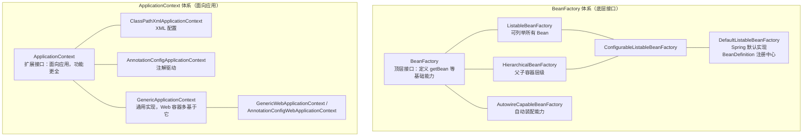
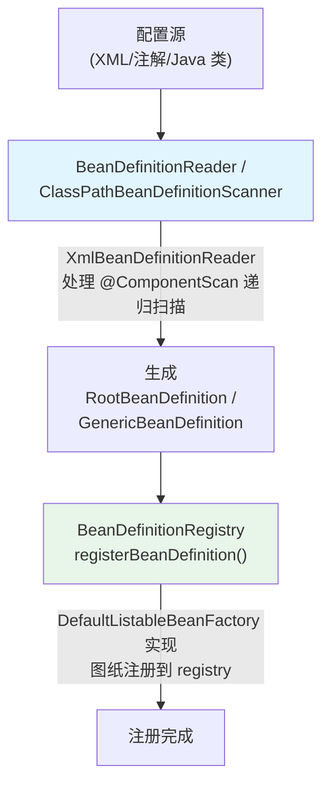
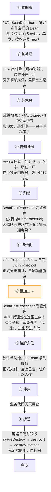
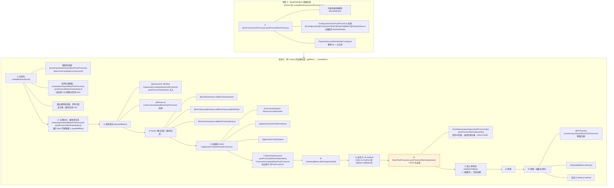

# Spring核心 - IoC容器与Bean生命周期

> 📌 **一句话理解**：IoC 是把"对象的创建和依赖装配"这种控制权从业务代码反转交给 Spring 容器；Bean 生命周期则是容器把一张"图纸(BeanDefinition)"加工成一个"可用的成品 Bean"的完整流水线，流水线上每一道工序都预留了扩展点（BeanPostProcessor），AOP、@Autowired、@PostConstruct 全靠它实现。

---

## 核心概念

### 一、为什么需要 IoC：从"手工组装"到"容器托管"

#### 1. 传统方式的问题

在没有 IoC 的代码里，对象自己 `new` 依赖，并自己 `set` 进去：

```java
// 传统写法：控制权在业务代码手里
public class OrderService {
    private UserDao userDao = new UserDaoImpl();        // 直接 new
    private PayService payService = new AlipayService();
    public void createOrder() {
        userDao.save();
        payService.pay();
    }
}
```

痛点：

- **强耦合**：`OrderService` 写死依赖实现类，想换 `WechatPayService` 就要改源码。
- **重复劳动**：每个使用方都要自己组装一遍依赖链，散落各处。
- **难统一管理**：事务、日志、AOP 这些横切关注点无从下手。

#### 2. IoC 的解法：把"创建控制权"交出去

```java
@Service
public class OrderService {
    @Autowired private UserDao userDao;      // 只声明依赖，不自己 new
    @Autowired private PayService payService;
}
```

`OrderService` 不再自己决定"依赖是谁、怎么造"，而是被动接收容器塞进来的对象。这种"对象创建控制权从业务代码转移到外部容器"就是**控制反转(IoC)**。

> 📌 **类比理解**：以前是自己造家具（打柜子、拼桌椅），累了还拼错；现在把户型图交给装修公司(Srping 容器)，装修公司按图施工、送货上门、负责安装。你只要说"我要一张桌子(@Autowired)"。

#### 3. 三个关键概念

| 概念 | 角色 | 类比 |
|------|------|------|
| **容器(IoC Container)** | 对象工厂 + 装配中心，负责造 Bean、管依赖、管生命周期 | 装修公司 |
| **Bean** | 被 Spring 管理的 Java 对象（单例池里那份） | 装好的家具 |
| **依赖(Dependency)** | Bean 与 Bean 之间的引用关系 | 家具之间的配套关系 |

#### 4. 依赖注入 vs 依赖查找 ⭐

- **依赖注入(DI, Dependency Injection)**：容器**主动推**，Bean 被动接收（`@Autowired`、构造器注入、setter 注入）。**这是 Spring 推荐的方式。**
- **依赖查找(DL, Dependency Lookup)**：Bean **主动拉**，如 `applicationContext.getBean("userDao")`。

IoC 是思想，DI 是 IoC 的主流实现手段（另一种是 DL，但很少用）。

---

### 二、IoC 容器体系 ⭐⭐

#### 1. 继承体系（一张图看懂）



#### 2. BeanFactory vs ApplicationContext ⭐⭐

| 维度 | BeanFactory | ApplicationContext |
|------|-------------|---------------------|
| 定位 | IoC 最基础接口，只管"造Bean+取Bean" | 面向应用的高级容器 |
| 加载时机 | **懒加载**：第一次 `getBean` 才创建 | **预实例化**：`refresh()` 时把非 lazy 的 singleton 全部造好 |
| 国际化 | ❌ | ✅ `MessageSource` |
| 事件发布 | ❌ | ✅ `ApplicationEventPublisher` |
| 资源加载 | ❌ | ✅ `ResourceLoader`（统一处理 classpath:/file:/URL） |
| 环境抽象 | ❌ | ✅ `Environment`（profile、properties） |
| 适用场景 | 资源受限（移动端、低内存） | 企业级应用**默认选择** |

> ⚠️ **易错点**：`BeanFactory` 顶层的 `getBean` 是懒加载语义，但 **`ApplicationContext` 在 `refresh()` 结束前会预实例化所有非 lazy 单例**，启动慢但运行时直接命中单例池，且能提前暴露配置错误。

#### 3. 常见实现类

- `ClassPathXmlApplicationContext`：从 classpath 加载 XML 配置。
- `FileSystemXmlApplicationContext`：从文件系统加载 XML。
- `AnnotationConfigApplicationContext`：纯注解驱动（`@Configuration` + `@ComponentScan`），Spring Boot 内部用它引导。
- `GenericApplicationContext`：通用底层实现，子类（如 `DefaultListableBeanFactory` 的搭档）负责如何注册 BeanDefinition。Spring Boot 的 `AnnotationConfigServletWebServerApplicationContext` 就在它之上。

---

### 三、BeanDefinition：Bean 的"图纸/配方" ⭐

#### 1. 是什么

`BeanDefinition` 描述了一个 Bean **应该怎么造**的所有元信息，是"图纸"，不是 Bean 本身。容器先收集所有图纸，再按图纸生产 Bean。

```java
public interface BeanDefinition {
    String getBeanClassName();          // 类全限定名
    String getScope();                  // singleton / prototype
    boolean isLazyInit();               // 是否懒加载
    String getInitMethodName();         // init-method
    String getDestroyMethodName();      // destroy-method
    ConstructorArgumentValues getConstructorArgumentValues();  // 构造参数
    MutablePropertyValues getPropertyValues();                  // setter 参数
    // ... factoryBeanName、factoryMethodName、primary、dependsOn 等
}
```

> 📌 **类比**：`BeanDefinition` = 装修公司的**户型施工图纸**；`Bean` = 按图纸盖出来的**实体房子**。一张图纸可以盖多套房（prototype），也可以只盖一套共享（singleton）。

#### 2. 图纸怎么来：Reader 与 Scanner



- `XmlBeanDefinitionReader`：解析 `<bean>` 标签生成 BeanDefinition。
- `ClassPathBeanDefinitionScanner`：扫描 `@ComponentScan` 包下带 `@Component/@Service/...` 的类，注册图纸。
- `AnnotatedBeanDefinitionReader`：注册单个 `@Configuration` 类。

#### 3. 图纸的合并

父子 BeanDefinition（XML `<bean parent="...">`）通过 `getMergedBeanDefinition()` 合并出最终的 `RootBeanDefinition`，再据此实例化。

---

### 四、Bean 完整生命周期 ⭐⭐⭐

这是 Spring 最核心、最易考错的知识点。先讲一个**通俗易懂的故事版**建立直觉，再给**源码细节版**深入复习，最后是面试题。

> 💡 **先记住一句话**：Bean 的生命周期 = **一个半成品"毛坯房"被一步步装修成"精装成品房"并挂牌出售，最后拆迁**的过程。中间每一道工序，Spring 都留了"挂钩"（扩展点 BeanPostProcessor），让你能插手改造。

#### 1. 故事版：Bean 是怎么"造"出来的？（先看这个）

把 Bean 想象成一栋房子，Spring 容器是装修公司，整个生命周期就是"**看图纸 -> 盖毛坯 -> 装修 -> 验收挂牌 -> 住人 -> 拆迁**"：



**记住这个顺序口诀**（面试速答版）：

> **实例化 → 属性注入 → Aware → 前置处理(@PostConstruct) → 初始化(afterPropertiesSet/init-method) → 后置处理(AOP代理) → 使用 → 销毁**

---

#### 2. 完整流程图（源码细节版，深入复习用）

> 下面这份是带源码方法名的完整 13 步，准确性更高，适合二轮深入复习和源码追问。如果只求面试能答，上面的故事版+口诀就够了。




#### 3. 三个初始化方法的执行顺序 ⭐⭐


> ⚠️ **铁律纠错**：网上有说法称 `@PostConstruct` 和 `afterPropertiesSet` 顺序不确定——**错误**。`@PostConstruct` 由 `CommonAnnotationBeanPostProcessor.postProcessBeforeInitialization()` 处理，发生在 `afterPropertiesSet` **之前**；两者都发生在 `postProcessAfterInitialization`（AOP 代理生成）**之前**。这意味着 **@PostConstruct 内 `this` 是原始对象，不是代理对象**，`this` 调用走不到代理逻辑。

#### 4. AOP 代理生成位置 ⭐⭐⭐

代理在 **第 ⑩ 步 `postProcessAfterInitialization`** 由 `AnnotationAwareAspectJAutoProxyCreator`（实现 `AbstractAutoProxyCreator`）生成。

```
postProcessAfterInitialization(bean, beanName):
  1. wrapIfNecessary()：根据 Pointcut 匹配当前 Bean
  2. 命中则 createProxy()：选 JDK 动态代理（有接口默认）或 CGLIB（无接口 / @Configuration）
  3. 返回代理对象，后续 singletonObjects 里存的是代理
```

> ⚠️ 注意 `@Configuration` 类会被 CGLIB 增强（proxyBeanMethods=true 时），这也是在 postProcessAfterInitialization 阶段完成，目的是保证 `@Bean` 方法之间的调用经过容器，保证单例语义。

#### 5. 三级缓存与循环依赖（紧密相关）⭐⭐

完整 Bean 创建涉及三级缓存（仅 singleton 模式有效）：

| 缓存 | 名称 | 存什么 |
|------|------|--------|
| 一级 | `singletonObjects` | **完整**的成品 Bean（跑完 ⑩ 后放入） |
| 二级 | `earlySingletonObjects` | 提前暴露的**半成品**（可能已被代理） |
| 三级 | `singletonFactories` | `ObjectFactory`，lambda，调用时才决定是否生成代理 |

A 依赖 B、B 依赖 A 的循环依赖解决流程：

```mermaid
graph TD
    A1["createA：实例化 A（②）"] --> A2["把 A 的 ObjectFactory 放进三级缓存"]
    A2 --> A3["属性填充 A（④）<br/>发现依赖 B"]
    A3 --> B1["createB：实例化 B"]
    B1 --> B2["把 B 的 ObjectFactory 放进三级缓存"]
    B2 --> B3["属性填充 B<br/>发现依赖 A"]
    B3 --> B4["getBean(\"A\")<br/>三级缓存找到 A 的 ObjectFactory"]
    B4 --> B5["执行 getEarlyBeanReference()<br/>⭐ AOP 提前生成代理"]
    B5 --> B6["提前暴露 A 的代理<br/>放入二级缓存，删除三级缓存"]
    B6 --> B7["B 拿到 A 的代理<br/>B 创建完成，放入一级缓存"]
    B7 --> A4["A 拿到 B<br/>A 创建完成，放入一级缓存<br/>（清除二、三级）"]

    style B5 fill:#fff3e0,stroke:#ff9800,stroke-width:2px
```

> ⚠️ **易错点**：只有**singleton + 构造器以外的注入方式**能解决循环依赖。**构造器循环依赖无法解决**（实例化阶段就要依赖，但此时半成品还没生成），Spring 会抛 `BeanCurrentlyInCreationException`。
>
> ⚠️ 三级缓存的存在不是为了单纯解循环依赖，而是为了**延迟决定是否生成代理**——只在确实出现循环时才提前生成，避免对无循环的 Bean 都提前创建代理。

---

### 五、Bean 的注册方式

#### 1. XML：`<bean>`

```xml
<bean id="userDao" class="com.example.UserDaoImpl" 
      init-method="init" destroy-method="cleanup" scope="singleton"/>
```

#### 2. 派生注解：`@Component` + `@ComponentScan`

```java
@Component        // 通用
@Service          // 业务层
@Repository       // DAO 层（额外做异常转换）
@Controller       // 表现层
@Configuration    // 配置类（特殊：会被 CGLIB 增强）
```

后四个**全部元注解 `@Component`**，`@ComponentScan` 扫描时一视同仁。

#### 3. `@Configuration` + `@Bean`

```java
@Configuration
public class AppConfig {
    @Bean(initMethod = "init")
    public DataSource dataSource() {
        return new HikariDataSource();
    }
}
```

`@Bean` 方法的返回值类型作为 Bean 类型，方法名作为 Bean 名。`@Configuration` 默认 `proxyBeanMethods=true`，会被 CGLIB 代理，保证 `@Bean` 方法间互调返回的是容器内的单例。

#### 4. `@Import` 三种用法 ⭐⭐

| 用法 | 形式 | 处理时机 |
|------|------|---------|
| **① 直接导入类** | `@Import(PlainConfig.class)` | 该类被当作普通 Bean 注册（无需 `@Configuration`） |
| **② ImportSelector** | `@Import(MySelector.class)`，实现 `selectImports()` 返回类名数组 | `ConfigurationClassPostProcessor` 调用，批量导入 |
| **③ ImportBeanDefinitionRegistrar** | `@Import(MyRegistrar.class)`，实现 `registerBeanDefinitions()` 直接操作 `BeanDefinitionRegistry` | 直接注册 BeanDefinition，**最灵活** |

实战中 `@EnableMybatis`、`@EnableAsync`、`@EnableScheduling`、`@EnableAspectJAutoProxy` 都靠 `@Import` + 第 ③ 种方式驱动。例如 MyBatis Mapper 的注册：扫描 `@Mapper` 接口，用 `MapperFactoryBean`（FactoryBean）逐个注册 BeanDefinition。

#### 5. FactoryBean ⭐⭐

```java
public interface FactoryBean<T> {
    T getObject() throws Exception;   // 返回真正的 Bean
    Class<?> getObjectType();
    boolean isSingleton();
}
```

注册一个 `FactoryBean`，容器里放两份东西：

- 名字 `&xxx`：FactoryBean 本身
- 名字 `xxx`：`getObject()` 返回的产物（MyBatis 的 Mapper、Spring AOP 的 ProxyFactoryBean 都靠它）

```java
@Bean
public SqlSessionFactoryBean sqlSessionFactory() {  // 返回类型是 FactoryBean
    ...
}
// applicationContext.getBean("sqlSessionFactory")     → SqlSessionFactory（产物）
// applicationContext.getBean("&sqlSessionFactory")   → SqlSessionFactoryBean 本体
```

---

## 常见面试题

### 1. 说一下 Spring Bean 的完整生命周期？

**回答思路：** 按"图纸准备 → 实例化 → 属性填充 → 初始化 → 使用 → 销毁"五大阶段讲，并强调 BeanPostProcessor 在初始化前后的两个钩子。

> Bean 生命周期分两大阶段。**图纸阶段**：`BeanFactoryPostProcessor` 可修改 BeanDefinition，`ConfigurationClassPostProcessor` 在此处理 `@Configuration/@Import/@Bean/@ComponentScan` 注册新图纸。
>
> **Bean 加工阶段**共 13 步：①`BeanFactoryPostProcessor` → ②实例化(推断构造器、`InstantiationAwareBeanPostProcessor`) → ③`postProcessAfterInstantiation` → ④`populateBean` 注入 `@Autowired/@Value` → ⑤Aware 回调(`BeanNameAware/BeanClassLoaderAware/BeanFactoryAware`) → ⑥容器级 Aware(`ApplicationContextAwareProcessor`) → ⑦`BeanPostProcessor.postProcessBeforeInitialization` 执行 `@PostConstruct` → ⑧`InitializingBean.afterPropertiesSet` → ⑨自定义 `init-method` → ⑩`postProcessAfterInitialization` **生成 AOP 代理** → ⑪放入单例池 → ⑫使用 → ⑬销毁(`@PreDestroy` → `DisposableBean` → `destroy-method`)。
>
> 核心扩展点是 `BeanPostProcessor` 的两个钩子：前钩子处理 `@PostConstruct`，后钩子生成代理。`@Autowired` 实际在 `populateBean` 阶段由 `AutowiredAnnotationBeanPostProcessor` 完成。

### 2. BeanFactory 和 ApplicationContext 有什么区别？

**回答思路：** 从定位、加载时机、附加能力三方面对比。

> `BeanFactory` 是 Spring IoC 的顶层接口，只定义 `getBean` 等基础能力，**懒加载**语义——第一次 `getBean` 才实例化。
>
> `ApplicationContext` 扩展了 `BeanFactory`，额外集成四大能力：①`MessageSource` 国际化；②`ApplicationEventPublisher` 事件发布；③`ResourceLoader` 统一资源加载；④`Environment` 环境抽象（profile/properties）。
>
> 加载时机上，`ApplicationContext` 在 `refresh()` 阶段会**预实例化**所有非 lazy 的 singleton，启动慢但运行时直接命中缓存且能尽早暴露配置错误。企业应用默认选 `ApplicationContext`；`BeanFactory` 用于资源受限场景。

### 3. @PostConstruct、afterPropertiesSet、init-method 的执行顺序？

**回答思路：** 直接报顺序，再讲清原因。

> 顺序是 `@PostConstruct` → `InitializingBean.afterPropertiesSet()` → 自定义 `init-method`，三者都在 `BeanPostProcessor.postProcessAfterInitialization`（AOP 代理生成）**之前**完成。
>
> 原因：`@PostConstruct` 由 `CommonAnnotationBeanPostProcessor.postProcessBeforeInitialization()` 处理；之后 Spring 调用 `invokeInitMethods()`，先调 `InitializingBean`，再反射调 `init-method`。
>
> 顺带提醒：此时 AOP 代理还没生成，所以 `@PostConstruct` 方法里 `this` 是原始对象，`this.xxx()` 调用不走代理；想触发事务/AOP 必须用注入的对象引用。

### 4. BeanFactory 和 FactoryBean 的区别？ ⭐⭐

**回答思路：** 一句话区分角色，再讲 FactoryBean 的作用。

> - `BeanFactory`：IoC 容器的**顶层接口**，回答"怎么管 Bean"。
> - `FactoryBean`：一个特殊的 **Bean**，回答"这个 Bean 怎么造"。它本身被容器管理，但 `getBean(name)` 返回的是 `getObject()` 的产物，而不是 FactoryBean 本身；取 FactoryBean 本身要用 `&name`。
>
> 典型应用：MyBatis 的 `MapperFactoryBean`、`SqlSessionFactoryBean`，Spring AOP 的 `ProxyFactoryBean`，第三方集成的 `FactoryBean<T>` 经常配合 `ImportBeanDefinitionRegistrar` 批量注册。

### 5. @Bean、@Component、@Import 的区别？@Import 的三种用法？

**回答思路：** 分别讲清各自定位，重点讲 `@Import`。

> - `@Component`：标在**类**上，靠 `@ComponentScan` 扫描注册，要求类能被包扫描到。
> - `@Bean`：标在 `@Configuration` 类的**方法**上，方法返回值就是 Bean，适合引入第三方库的类（改不了源码的场景）。
> - `@Import`：直接把类塞进容器，不要求被扫描。三种用法：
>   1. `@Import(X.class)`：直接注册，X 不需要 `@Configuration`。
>   2. `@Import(MySelector.class)`：`MySelector implements ImportSelector`，`selectImports()` 返回类名数组，批量导入。
>   3. `@Import(MyRegistrar.class)`：`MyRegistrar implements ImportBeanDefinitionRegistrar`，直接拿到 `BeanDefinitionRegistry` 注册图纸，最灵活。
>
> `@Enable*` 系列注解几乎都靠 `@Import` 第三种用法驱动，如 `@EnableAsync`、`@EnableAspectJAutoProxy`、`@EnableMybatis` 的 Mapper 注册。

### 6. BeanPostProcessor 有什么作用？哪些功能依赖它？

**回答思路：** 强调它是 Spring 最核心扩展点，列举依赖它的功能。

> `BeanPostProcessor` 是 Spring 最核心的扩展点，定义了两个钩子：`postProcessBeforeInitialization` 和 `postProcessAfterInitialization`，对所有 Bean 的初始化前后都生效。
>
> 依赖它的功能：
> - `@PostConstruct` —— `CommonAnnotationBeanPostProcessor`
> - `@Autowired/@Value` —— `AutowiredAnnotationBeanPostProcessor`（实际在 `populateBean` 阶段用其子接口 `InstantiationAwareBeanPostProcessor`）
> - `@Resource` —— `CommonAnnotationBeanPostProcessor`
> - **AOP 代理生成** —— `AnnotationAwareAspectJAutoProxyCreator`
> - `@Async` —— `AsyncAnnotationBeanPostProcessor`
> - `ApplicationContextAware` 等容器级 Aware —— `ApplicationContextAwareProcessor`
>
> 一句话：Spring 几乎所有"魔法注解"都是 `BeanPostProcessor` 实现的，AOP 代理也在它的 `postProcessAfterInitialization` 钩子生成。

### 7. BeanDefinition 是什么？

**回答思路：** 用图纸类比，列举字段，再讲来源。

> `BeanDefinition` 是 Bean 的**元数据描述（图纸）**，描述 Bean 应该怎么造：类名、scope、lazy、init/destroy method、构造参数、属性值、依赖、factoryBeanName 等。
>
> 来源：XML 经 `XmlBeanDefinitionReader` 解析；注解经 `ClassPathBeanDefinitionScanner` 扫描 `@ComponentScan` 包；`@Bean` 方法和 `@Import` 由 `ConfigurationClassPostProcessor` 解析。所有图纸注册到 `BeanDefinitionRegistry`（默认实现 `DefaultListableBeanFactory`）。
>
> 生产时若存在父子 BeanDefinition，先 `getMergedLocalBeanDefinition()` 合并成 `RootBeanDefinition`，再据此实例化。`BeanFactoryPostProcessor` 可以在实例化前修改图纸（如占位符替换）。

### 8. Spring IoC 容器的启动流程（refresh 13 步简述）？

**回答思路：** 抓住 `AbstractApplicationContext.refresh()` 的关键步骤。

> `AbstractApplicationContext.refresh()` 是容器启动模板方法，核心步骤：
> 1. `prepareRefresh()`：准备上下文，校验必备属性。
> 2. `obtainFreshBeanFactory()`：获取/刷新 `BeanFactory`，加载 BeanDefinition。
> 3. `prepareBeanFactory()`：配置 `BeanFactory` 标准特征（ClassLoader、`ApplicationContextAwareProcessor`）。
> 4. `postProcessBeanFactory()`：留给子类的扩展钩子。
> 5. `invokeBeanFactoryPostProcessors()`：⭐ 执行 `BeanFactoryPostProcessor`，`ConfigurationClassPostProcessor` 在此处理 `@Configuration/@ComponentScan/@Import/@Bean`，注册新图纸。
> 6. `registerBeanPostProcessors()`：注册 `BeanPostProcessor`（注意此时还没实例化业务 Bean）。
> 7. `initMessageSource()`：国际化。
> 8. `initApplicationEventMulticaster()`：事件广播器。
> 9. `onRefresh()`：留给子类初始化特殊 Bean（如 Spring Boot 内嵌 Tomcat）。
> 10. `registerListeners()`：注册监听器。
> 11. `finishBeanFactoryInitialization()`：⭐ **预实例化所有非 lazy singleton**，Bean 生命周期的主体就在这里发生。
> 12. `finishRefresh()`：发布 `ContextRefreshedEvent`。
> 13. `resetCommonCaches()`：清理反射缓存。
>
> 记忆口诀：**准备 → 拿工厂 → 配工厂 → 后置工厂 → BFPP → 注册BPP → 国际化 → 事件器 → onRefresh → 监听器 → 实例化 → 完成刷新 → 清缓存**。

---

## 本章学习建议

1. **先打主线**：把"图纸(BeanDefinition) → 实例化 → 属性填充 → Aware → 初始化三件套 → 代理 → 单例池 → 销毁"这条主线背到能默写，再补扩展点。
2. **抓 BeanPostProcessor 这根线**：所有注解魔法和 AOP 都挂在它的两个钩子上，理解了它就理解了 Spring 一半的扩展机制。
3. **画三遍图**：第一遍照抄本文流程图；第二遍合上书自己画；第三遍尝试画"循环依赖 + 三级缓存"的时序图，画得通就彻底通了。
4. **源码对照**：`AbstractBeanFactory.doGetBean` → `DefaultSingletonBeanRegistry.getSingleton` → `AbstractAutowireCapableBeanFactory.createBean` 这条链路读一遍，把扩展点的调用顺序和源码对上。
5. **手写小 Demo**：自己实现一个 `BeanFactoryPostProcessor` 改 BeanDefinition、一个 `BeanPostProcessor` 打印每阶段日志，亲手看到执行顺序比背书管用。
6. **结合 AOP 章**：本文件只点出"代理在 `postProcessAfterInitialization` 生成"，AOP 的 Pointcut 匹配、JDK vs CGLIB 选型放到 AOP 章节深入。

> 💡 **学习心法**：Spring 的复杂不在于"功能多"，而在于"扩展点密"。把 Bean 生命周期当成一条流水线，每个注解/AOP/事务都是流水线上挂的传感器或加工工位——记住流水线顺序，传感器挂哪里就一目了然。

---

## 资料勘误与重点提醒

> 本节依据 Spring 5.x / 6.x 官方源码与业界共识，对常见资料中的表述偏差进行修正，并补齐面试高频但易遗漏的点。

### 1. 易错点纠正

1. **@PostConstruct 与 afterPropertiesSet 的顺序**
   - ❌ 错误说法："两者顺序不确定 / 看实现"。
   - ✅ 正确：`@PostConstruct` **严格在** `afterPropertiesSet` **之前**。`@PostConstruct` 由 `CommonAnnotationBeanPostProcessor.postProcessBeforeInitialization()` 处理，位于 `invokeInitMethods()` 之前；`afterPropertiesSet` 在 `invokeInitMethods()` 内最先调用，再反射调 `init-method`。完整顺序：`@PostConstruct → afterPropertiesSet → init-method`，三者都先于 AOP 代理生成。

2. **AOP 代理生成时机**
   - ❌ 错误说法："AOP 在 Bean 实例化时就生成" 或 "在属性填充时生成"。
   - ✅ 正确：AOP 代理在 **`postProcessAfterInitialization`** 阶段由 `AnnotationAwareAspectJAutoProxyCreator` 生成（第 ⑩ 步）。只有出现循环依赖时，才会在 `getEarlyBeanReference()` 中**提前**生成（三级缓存机制），最终保证一级缓存里的就是代理对象。

3. **三级缓存存在的真正原因**
   - ❌ 错误说法："三级缓存是为了解决循环依赖"——这只是结果，不是设计目的。
   - ✅ 正确：三级缓存 `singletonFactories` 存的是 `ObjectFactory`，目的在于**延迟决定是否生成代理**（`getEarlyBeanReference` 钩子）。如果二级缓存直接存半成品对象，无循环依赖的 Bean 也会被迫提前生成代理；用 `ObjectFactory` 只有在真出现循环依赖被调用时才生成。二级缓存 `earlySingletonObjects` 是为避免重复执行 `getEarlyBeanReference`。

4. **@Autowired 的处理阶段**
   - ❌ 错误说法："`@Autowired` 在 `postProcessBeforeInitialization` 注入"。
   - ✅ 正确：`@Autowired/@Value` 在 **`populateBean`（属性填充，第 ④ 步）** 由 `AutowiredAnnotationBeanPostProcessor.postProcessProperties()` 注入，**早于** Aware 回调和初始化方法。`BeanPostProcessor` 接口本身只管初始化前后；属性注入用的是它的子接口 `InstantiationAwareBeanPostProcessor`。

5. **BeanFactory 与 ApplicationContext 谁预实例化**
   - ❌ 错误说法："`BeanFactory` 默认预实例化"。
   - ✅ 正确：`BeanFactory` 顶层接口语义是**懒加载**，第一次 `getBean` 才创建；`ApplicationContext` 在 `refresh()` 的 `finishBeanFactoryInitialization()` 阶段**预实例化**所有非 lazy singleton。

6. **@Configuration 的 CGLIB 增强时机**
   - ❌ 错误说法："`@Configuration` 在编译期被增强"。
   - ✅ 正确：`@Configuration` 类（`proxyBeanMethods=true`）在 `postProcessAfterInitialization` 阶段被 `ConfigurationClassPostProcessor` 配合 `ConfigurationClassEnhancer` 用 CGLIB 生成子类，目的是拦截 `@Bean` 方法间调用，保证单例语义。是运行期增强，非编译期。

### 2. 易遗漏的高频重点

- **构造器循环依赖无法解决**：Spring 三级缓存只能解决 setter/字段注入的循环依赖；构造器循环依赖会在实例化阶段就抛 `BeanCurrentlyInCreationException`。可以用 `@Lazy` 注入一方打破（注入代理，首次使用时才真正解析）。
- **`BeanPostProcessor` 自身不能被延迟初始化**：BPP 必须在业务 Bean 实例化前就位，所以 `registerBeanPostProcessors()` 早于 `finishBeanFactoryInitialization()`。如果在 BPP 里 `@Autowired` 一个普通 Bean，那个普通 Bean 会被提前实例化，且**不会触发其他 BPP 对它的后置处理**（潜在坑）。
- **prototype 作用域不走三级缓存**：每次 `getBean` 都新建，不缓存，也不解决循环依赖。
- **`@PostConstruct` 内 `this` 不是代理**：调用 `this.otherMethod()` 不走代理，事务/AOP 不生效——这是 Spring 自调用失效的根因之一。
- **`SmartInitializingSingleton`**：所有非 lazy singleton 实例化完成后回调（`preInstantiateSingletons` 末尾），Spring Boot 的 `WebServer` 启动、`@EventListener` 的延迟注册会用到它，面试加分项。
