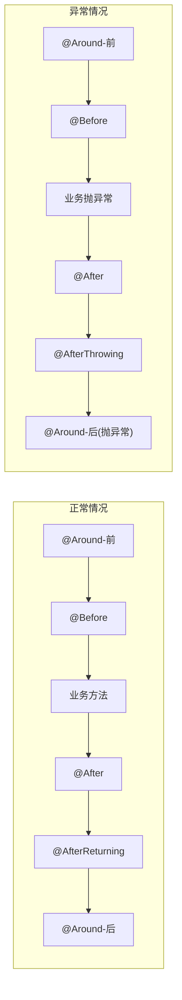
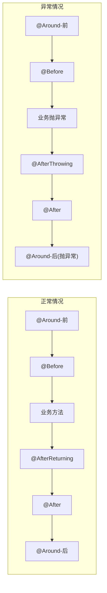
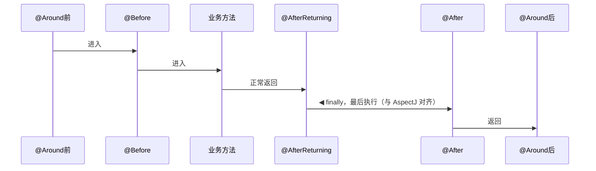
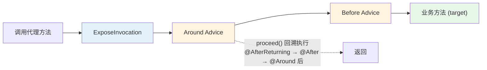
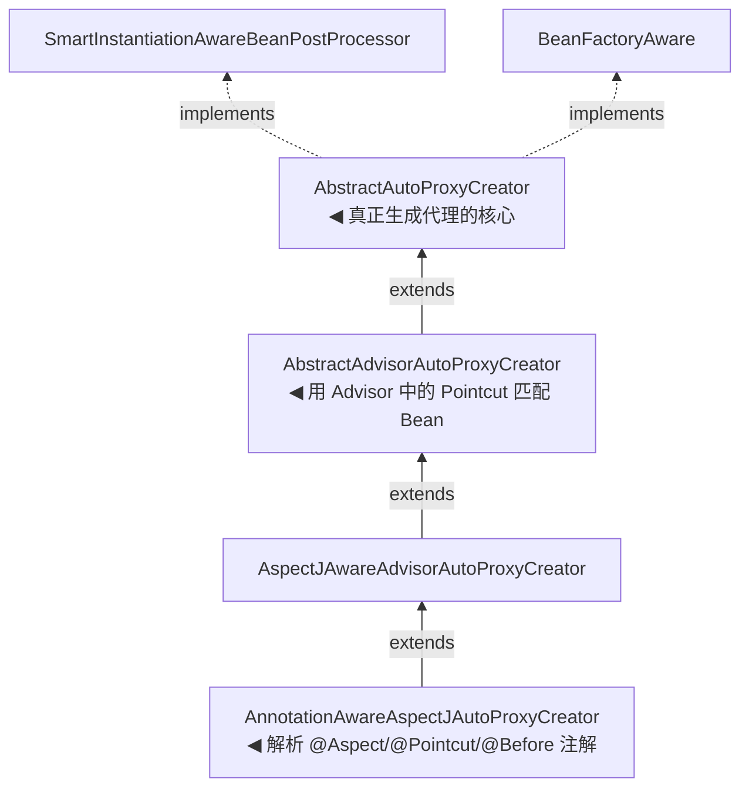
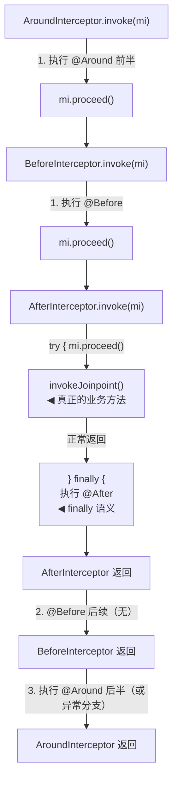
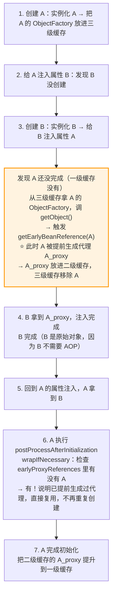
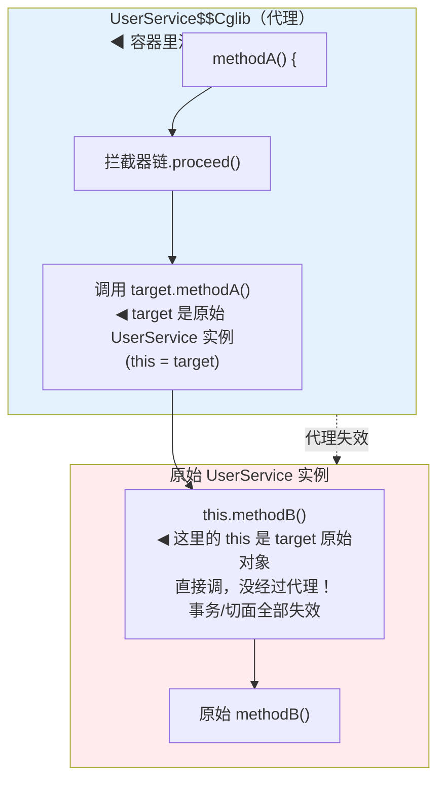

# Spring核心-AOP原理

> 📌 **一句话理解**：AOP 把「日志/事务/权限」这些和业务无关却又散落在各处的横切逻辑，用一个「切面」统一织入到目标方法前后，本质是「在运行时给Bean生成一个代理对象，在代理里包裹拦截器链」。

---

## 核心概念

### 一、为什么需要AOP？（OOP的补充）⭐⭐

先看一个痛点：

```java
public class UserService {
    public void addUser(User user) {
        // 记录日志
        System.out.println("[LOG] addUser start, param=" + user);
        long start = System.currentTimeMillis();
        try {
            // 真正的业务
            userDao.insert(user);
            System.out.println("[LOG] addUser success, cost=" + (System.currentTimeMillis() - start));
        } catch (Exception e) {
            System.out.println("[LOG] addUser error: " + e.getMessage());
            throw e;
        }
    }
    
    public void deleteUser(Long id) {
        // 又是一坨一模一样的日志代码...
    }
    
    public void updateUser(User user) {
        // 又是一坨...
    }
}
```

**问题**：业务代码只占1行，日志代码占了8行，而且每个方法都在重复粘贴。想改日志格式？几十个方法都得改一遍。

**OOP为什么解决不了？** OOP擅长纵向的「继承、封装、多态」，但这种**横切关注点（Cross-Cutting Concern）**是横着切的——日志、事务、权限、缓存，每个业务方法都需要，但又不属于任何业务领域。

**类比理解**：你开了100家分店，每家店都要装监控。OOP的做法是给每家店单独装一套（重复粘贴）；AOP的做法是请一个「监控公司」，它统一在每家店开门前和关门后录像——业务（开店卖货）和监控（横切逻辑）彻底分开。

AOP（Aspect-Oriented Programming，面向切面编程）就是把这些横切关注点抽出来，集中到一个「切面」里，由容器自动织入到需要的地方。

#### 一个最小可运行示例（先看这个，建立直觉）

不用急着背术语，先看一段能跑起来的代码。场景：给 `UserService` 的所有方法自动加日志和耗时统计，**业务代码里一个字的日志都不用写**。

**1）引入依赖**（Spring Boot 已自带，普通 Spring 工程需引入 `spring-boot-starter-aop`，它包含 `aspectjweaver`）

```xml
<dependency>
    <groupId>org.springframework.boot</groupId>
    <artifactId>spring-boot-starter-aop</artifactId>
</dependency>
```

**2）业务类**（干干净净，只有业务逻辑，没有任何日志代码）

```java
@Service
public class UserService {
    public String getUserById(Long id) {
        // 模拟业务耗时
        try { Thread.sleep(100); } catch (InterruptedException ignored) {}
        return "用户" + id;
    }
}
```

**3）切面类**（日志 + 耗时统计全写在这里，业务类完全无感）

```java
@Aspect           // 声明这是一个切面
@Component        // 必须交给 Spring 容器管理，否则不生效
public class LogAspect {

    // 切点：匹配 UserService 所有方法
    @Pointcut("execution(* com.example.service.UserService.*(..))")
    public void servicePoint() {}

    // 环绕通知：包裹目标方法，能在它前后都做事，还能拿执行结果
    @Around("servicePoint()")
    public Object around(ProceedingJoinPoint pjp) throws Throwable {
        String method = pjp.getSignature().getName();          // 方法名
        Object[] args = pjp.getArgs();                          // 入参
        long start = System.currentTimeMillis();

        System.out.println("[日志] " + method + " 开始，参数=" + Arrays.toString(args));
        try {
            Object result = pjp.proceed();                      // 放行，执行真正的业务方法
            System.out.println("[日志] " + method + " 返回=" + result);
            return result;
        } catch (Throwable e) {
            System.out.println("[日志] " + method + " 抛异常=" + e.getMessage());
            throw e;
        } finally {
            System.out.println("[日志] " + method + " 耗时=" + (System.currentTimeMillis() - start) + "ms");
        }
    }
}
```

**4）启动并调用**

```java
@SpringBootApplication
public class App implements CommandLineRunner {
    @Autowired private UserService userService;
    public static void main(String[] args) { SpringApplication.run(App.class, args); }
    @Override public void run(String... args) { userService.getUserById(1L); }
}
```

**运行结果**（业务方法自己一句 `println` 都没写，日志全是切面自动织入的）：

```
[日志] getUserById 开始，参数=[1]
[日志] getUserById 返回=用户1
[日志] getUserById 耗时=102ms
```

> 💡 **这就是 AOP 的全部直觉**：你只管写业务，日志/耗时/权限/事务这些横切逻辑全甩给切面。`@Pointcut` 决定"管哪些方法"，`@Around/@Before/@After` 决定"在什么时候干什么"，`pjp.proceed()` 就是那个"放行按钮"。
>
> 后面的术语（切点/通知/切面/织入）都是给这段代码各部分起的名字而已，不用怕。

#### AOP 都能干啥？常见应用场景

AOP 不只是写日志。凡是你发现「**这段逻辑到处重复、又不属于业务本身**」，就适合用切面收口。下面是实际项目中最常见的几类场景，对照看你的项目该用哪个：

| 场景 | 切入点 | 干什么 | 用什么通知 | 代表实现 |
|------|--------|--------|-----------|---------|
| **声明式事务** | Service 层方法 | 方法前开事务、异常回滚、正常提交 | 环绕（`@Around`） | Spring `@Transactional` 本身就是 AOP |
| **接口鉴权** | Controller 方法 | 校验 token/权限，没权限直接拒绝 | 前置（`@Before`） | 自定义 `@RequireLogin` 注解 + 切面 |
| **统一日志** | 全部 Service 方法 | 记录方法入参、返回值、异常堆栈 | 环绕（`@Around`） | 上面的 `LogAspect` 示例 |
| **接口耗时监控** | Controller / 关键方法 | 统计执行耗时，超阈值告警 | 环绕（`@Around`） | 配合 Micrometer 指标上报 |
| **缓存** | 查询方法 | 先查缓存，命中直接返回；未命中查 DB 后回填 | 环绕（`@Around`） | Spring Cache（`@Cacheable`） |
| **接口限流** | Controller 方法 | 令牌桶/计数器，超限返回 429 | 环绕（`@Around`） | 自定义 `@RateLimit` + Redis |
| **异步执行** | 方法 | 把方法丢到线程池异步跑 | 后置（无返回值） | Spring `@Async`（基于 AOP） |
| **链路追踪打标** | RPC/HTTP 入口 | 注入 traceId 到 MDC，方法结束清理 | 环绕（`@Around`） | SkyWalking / Micrometer Tracing |
| **API 签名校验** | 对外开放的 API | 校验请求签名防篡改，失败拒绝 | 前置（`@Before`） | 自定义 `@SignCheck` 切面 |
| **操作审计** | 写操作方法 | 记录"谁、什么时候、改了什么"到审计表 | 后置（`@AfterReturning`） | 自定义 `@AuditLog` 注解 + 切面 |
| **参数校验前置** | Service 方法 | 统一校验入参非空、格式，不合法直接抛异常 | 前置（`@Before`） | 自定义校验切面 |
| **重试** | 调用外部接口的方法 | 失败自动重试 N 次，仍失败再抛 | 环绕（`@Around`） | Spring Retry（`@Retryable`） |

**几个高频追问点**：

1. **为什么大多用 `@Around`？** 因为环绕最全能：能改入参、能决定要不要 `proceed()`（即拦截）、能改返回值、能 catch 异常、能在 finally 统计耗时。`@Before`/`@After` 能做的它都能做，只是写起来稍繁。所以日志、限流、缓存这类"既要前又要后"的场景，`@Around` 是首选。

2. **`@Transactional` 和 AOP 啥关系？** 它本身就是 AOP 的产物。`@Transactional` 加在方法上，Spring 在 `postProcessAfterInitialization` 给 Bean 生成代理，代理在方法前 `begin transaction`、异常时 `rollback`、正常时 `commit`。**所谓"声明式事务"，本质就是一个内置的事务切面**。同理 `@Async`、`@Cacheable`、`@Retryable` 都是 AOP 思想的具体封装。

3. **自定义注解 + 切面的固定套路**：实战中最常用的模式是「自定义注解标记 + 切面扫描注解执行逻辑」。比如限流：

```java
// 1. 自定义注解（标记用，运行时保留）
@Target(ElementType.METHOD)
@Retention(RetentionPolicy.RUNTIME)
public @interface RateLimit {
    int qps() default 100;        // 每秒最多 100 次
}

// 2. 业务方法上贴注解
@RestController
public class OrderController {
    @RateLimit(qps = 50)         // 这个接口限 50 QPS
    @PostMapping("/order")
    public String createOrder() { return "下单成功"; }
}

// 3. 切面扫描注解，命中就执行限流逻辑
@Aspect
@Component
public class RateLimitAspect {
    @Around("@annotation(rateLimit)")   // 拦截所有标了 @RateLimit 的方法
    public Object around(ProceedingJoinPoint pjp, RateLimit rateLimit) throws Throwable {
        int qps = rateLimit.qps();
        if (!tryAcquire(qps)) {          // 令牌桶/计数器判断
            throw new RuntimeException("接口限流，请稍后重试");
        }
        return pjp.proceed();
    }
}
```

> 💡 **这个套路记住一句话**：「**注解负责"贴标签"，切面负责"看标签干活"**」。`@RateLimit`、`@AuditLog`、`@SignCheck` 全是这个模式。面试问"你项目里 AOP 怎么用的"，说一个自定义注解 + 切面的实战就足够亮眼。

---


AOP的术语容易混，先上图：

```mermaid
graph TB
    subgraph Aspect_box["Aspect（切面）<br/>= Pointcut + Advice 组合（一个带 @Aspect 的类）"]
        P["@Pointcut(\"execution(* com.xx..*.*(..))\")<br/>◀ 筛选规则"]
        A["@Before(\"pointcut()\") / @After(...) / @Around<br/>◀ 干什么 + 何时"]
    end

    Aspect_box -->|"织入 Weaving"| Proxy

    subgraph Target_box["Target（目标对象）"]
        T1["UserService 原始实例"]
        T2["没有任何切面代码"]
    end

    subgraph Proxy_box["Proxy（代理对象）"]
        P1["被包裹了通知的代理"]
        P2["调用 addUser 会先过<br/>拦截器链再走原始方法"]
    end

    Target_box --> Proxy_box
    Proxy_box --> JP["JoinPoint（连接点）<br/>可以被增强的点<br/>Spring AOP 里 = 方法的执行"]

    style Aspect_box fill:#f3e5f5
    style Target_box fill:#e8f5e9
    style Proxy_box fill:#fff3e0
```

逐个术语解释（**一定要区分 Pointcut 和 JoinPoint，面试最爱混**）：

| 术语 | 英文 | 通俗理解 | Spring AOP中的范围 |
|------|------|---------|-------------------|
| **连接点** | JoinPoint | 「所有可能被增强的地方」 | 仅方法的执行（不含字段访问、构造器、静态初始化等） |
| **切点** | Pointcut | 「从所有连接点里筛选哪些要增强的规则」 | `execution(* com.xx.service..*.*(..))` |
| **通知** | Advice | 「在选中点上干什么、什么时候干」 | @Before/@After/@Around 五种 |
| **切面** | Aspect | 「切点+通知打包成一个类」 | @Aspect 标注的类 |
| **织入** | Weaving | 「把切面套到目标对象上生成代理」 | Spring 是**运行时**织入 |
| **目标对象** | Target | 「被增强的原始Bean」 | UserService 原始实例 |
| **代理对象** | Proxy | 「织入后用户实际拿到的对象」 | JdkDynamicAopProxy / CglibAopProxy |
| **引介** | Introduction | 「给类动态加接口/字段」 | Spring 较少用，了解即可 |

**类比理解（中介）**：
- **JoinPoint** = 所有正在出租的房子（每套房都「可能」通过中介租出去）
- **Pointcut** = 中介公司的筛选条件「只接朝阳区、月租>5000的房子」
- **Advice** = 中介干的活「带看前先打电话、签合同后收中介费」
- **Aspect** = 这家中介公司（一个整体）
- **Weaving** = 把中介安插到房东和租客之间（原来租客直接找房东，现在必须通过中介）
- **Target** = 房东（原始的出租方）
- **Proxy** = 中介装扮出来的「看起来像房东」的代理方

⚠️ **易错**：`JoinPoint` 是「所有可被增强的点」（一个集合概念），`Pointcut` 是「筛选条件」（一个表达式）。别把这两个搞反——常说「切点匹配连接点」。

---

### 三、5种通知类型与执行顺序 ⭐⭐

#### 1. 五种通知

```java
@Aspect
@Component
public class LogAspect {
    
    @Pointcut("execution(* com.xx.service.UserService.*(..))")
    public void servicePoint() {}
    
    @Around("servicePoint()")
    public Object around(ProceedingJoinPoint pjp) throws Throwable {
        System.out.println("Around-前");
        try {
            Object result = pjp.proceed();  // 手动放行
            System.out.println("Around-后(正常)");
            return result;
        } catch (Throwable t) {
            System.out.println("Around-后(异常)");
            throw t;
        }
    }
    
    @Before("servicePoint()")
    public void before(JoinPoint jp) { System.out.println("Before"); }
    
    @AfterReturning(value = "servicePoint()", returning = "ret")
    public void afterReturning(Object ret) { System.out.println("AfterReturning, ret=" + ret); }
    
    @AfterThrowing(value = "servicePoint()", throwing = "ex")
    public void afterThrowing(Throwable ex) { System.out.println("AfterThrowing, ex=" + ex); }
    
    @After("servicePoint()")
    public void after() { System.out.println("After(finally)"); }
}
```

| 通知 | 时机 | 能否拿到返回值 | 能否阻止业务 | 能否改返回值 |
|------|------|--------------|------------|------------|
| @Around | 环绕（前后都包） | 能（proceed返回） | 能（不调proceed） | 能 |
| @Before | 方法执行前 | 不能 | 能（抛异常） | 不能 |
| @AfterReturning | 方法正常返回后 | 能（returning参数） | 不能 | 能（改ret） |
| @AfterThrowing | 方法抛异常后 | 不能（throwing拿异常） | 不能 | 不能 |
| @After | 方法结束后（finally语义，无论正常异常） | 不能 | 不能 | 不能 |

⚠️ **@After 是 finally 语义**：无论方法正常返回还是抛异常，都会执行。这是它和 @AfterReturning/@AfterThrowing 的本质区别。

#### 2. 执行顺序（重点，有版本差异）⭐⭐

**Spring Framework 5.2.7 之前**（对应 Spring Boot 2.3.2 之前的版本）：



**Spring Framework 5.2.7 之后**（调整 @After 位置，与 AspectJ 语义对齐）：



⚠️ **版本差异说明（务必记准方向）**：Spring 5.2.7 把 `@After`（finally 语义）从「业务方法后第一时间执行」调整到「`@AfterReturning`/`@AfterThrowing` 之后执行」，目的是与 AspectJ 语义对齐。判断依据：Java 的 `try-catch-finally` 中 `finally` 是最后执行的；`@After` 既是 finally 语义，就应在 `@AfterReturning`/`@AfterThrowing` **之后**执行。Spring 5.2.7 release notes 原文："the @AfterReturning advice will be invoked before @After advice"。**对应 Spring Boot 版本：Spring Boot 2.3.2.RELEASE 起使用新顺序**。

> **记忆口径**：现代项目（Spring Boot 2.3.2+）按新顺序记--`@After`（finally）在 `@AfterReturning`/`@AfterThrowing` **之后**执行，对应 Java 的 `try-finally` 语义（finally 最后执行）。这既是 AspectJ 的语义，也是 Spring 5.2.7+ 的语义。

时序图（新版本，正常流程）：



**拦截器链的本质（责任链模式）**：



---

### 四、两种动态代理（核心对比）⭐⭐⭐

Spring AOP 的代理生成有两种实现：JDK 动态代理和 CGLIB。这是面试**最高频**的对比题。

#### 1. JDK 动态代理

基于「**接口**」，用 `java.lang.reflect.Proxy` 生成一个实现目标接口的代理类。

```java
// 目标类必须实现接口
public interface UserService {
    void addUser(User u);
}
public class UserServiceImpl implements UserService {
    public void addUser(User u) { /* ... */ }
}

// JDK 动态代理
public class LogInvocationHandler implements InvocationHandler {
    private final Object target;  // 目标对象
    public LogInvocationHandler(Object target) { this.target = target; }
    
    @Override
    public Object invoke(Object proxy, Method method, Object[] args) throws Throwable {
        System.out.println("[LOG] " + method.getName() + " start");
        try {
            Object ret = method.invoke(target, args);  // 反射调用原方法
            System.out.println("[LOG] " + method.getName() + " return " + ret);
            return ret;
        } catch (Throwable t) {
            System.out.println("[LOG] " + method.getName() + " error");
            throw t;
        }
    }
}

// 生成代理
UserService proxy = (UserService) Proxy.newProxyInstance(
    UserServiceImpl.class.getClassLoader(),
    UserServiceImpl.class.getInterfaces(),   // 关键：基于接口
    new LogInvocationHandler(new UserServiceImpl())
);
```

**底层原理**：JVM 在运行时动态生成一个类 `$Proxy0`，它实现了目标接口的所有方法，每个方法内部直接调用 `InvocationHandler.invoke()`。生成的字节码可以用 `Arthas` 的 `jad` 命令或 `ProxyGenerator` 看到。

#### 2. CGLIB

基于「**继承**」，用 `Enhancer` 生成目标类的**子类**作为代理。

```java
// 目标类无需接口
public class OrderService {
    public void createOrder(Order o) { /* ... */ }
}

// CGLIB 代理
public class LogMethodInterceptor implements MethodInterceptor {
    @Override
    public Object intercept(Object obj, Method method, Object[] args, 
                            MethodProxy methodProxy) throws Throwable {
        System.out.println("[LOG] " + method.getName() + " start");
        try {
            // 注意：这里调的是 methodProxy.invokeSuper，不是反射 method.invoke
            // 因为是子类调父类，用 FastClass 机制避免反射
            Object ret = methodProxy.invokeSuper(obj, args);
            System.out.println("[LOG] " + method.getName() + " return " + ret);
            return ret;
        } catch (Throwable t) {
            System.out.println("[LOG] " + method.getName() + " error");
            throw t;
        }
    }
}

// 生成代理
Enhancer enhancer = new Enhancer();
enhancer.setSuperclass(OrderService.class);   // 关键：基于继承
enhancer.setCallback(new LogMethodInterceptor());
OrderService proxy = (OrderService) enhancer.create();
```

**底层原理**：CGLIB 底层用 ASM 操作字节码，生成一个继承目标类的子类（类名类似 `OrderService$$EnhancerByCGLIB$$1a2b3c`），override 所有非 final 方法。子类方法里通过 `MethodInterceptor.intercept()` 回调通知逻辑。

**FastClass 机制（CGLIB 加速点）**：CGLIB 不用反射调用原方法，而是给「代理类」和「原类」各生成一个 FastClass（下标索引类），调用时通过 `method.getIndex()` 拿到方法下标，再走 `fastClass.invoke(index, obj, args)` 的 switch 分支直接调用，避免反射开销。这是 CGLIB 在调用阶段比 JDK 反射快的根因。

#### 3. 核心对比表

| 对比项 | JDK 动态代理 | CGLIB |
|-------|-------------|-------|
| **实现方式** | 实现接口 | 继承生成子类 |
| **要求** | 目标类必须实现接口 | 不需要接口 |
| **代理对象类型** | 目标接口的实现类 | 目标类的子类 |
| **不能代理** | 没有接口的类 | `final` 类、`final` 方法、`private` 方法、`static` 方法 |
| **生成速度** | 快（JVM 内置） | 略慢（要 ASM 生成字节码） |
| **调用速度** | 反射调用，JDK 8+ 有缓存优化 | FastClass 机制，略快 |
| **依赖** | JDK 自带 | 需引入 `cglib`（Spring 已内嵌 `cglib-nodep`） |
| **JDK 版本限制** | 无 | JDK 17+ 需 `--add-opens` 反射访问 |

⚠️ **性能说法的纠偏**：早期资料常说「CGLIB 比 JDK 快 10 倍」，这是过时说法。现代 JVM（JDK 8+）对反射做了大量优化（MethodAccessor 缓存、 inflation 机制等），两者**调用性能已基本相当**，差距可以忽略。选型不要基于性能，而要基于「是否有接口」和「Spring Boot 默认策略」。

#### 4. Spring 的选择策略（务必准确）⭐⭐⭐

**Spring Framework 默认策略**：
- 如果目标类**实现了至少一个接口** -> 用 JDK 动态代理
- 如果目标类**没有实现任何接口** -> 用 CGLIB
- 通过 `@EnableAspectJAutoProxy(proxyTargetClass = true)` 强制全部用 CGLIB

**Spring Boot 2.0+ 默认策略**（这是高频考点）：

```java
// Spring Boot 的 AopAutoConfiguration 中默认：
// spring.aop.proxy-target-class=true
@EnableAspectJAutoProxy(proxyTargetClass = true)  // Spring Boot 自动配置默认开启
```

> ⭐ **关键点**：**Spring Boot 2.0 起，AOP 默认使用 CGLIB**（不管你有没有接口）。原因：避免「有接口用 JDK、无接口用 CGLIB」导致的行为不一致问题。这也是为什么在 Spring Boot 项目里你 `@Autowired` 注入的是具体类型而非接口，照样能拿到代理——因为 CGLIB 代理是子类，可以赋给父类引用。

**版本对应**：
- Spring Boot 1.x：默认 JDK 代理（与 Spring Framework 默认一致）
- Spring Boot 2.0+：默认 CGLIB（`proxyTargetClass=true`）

---

### 五、Spring AOP 实现原理 ⭐⭐⭐

#### 1. 核心类：AnnotationAwareAspectJAutoProxyCreator

这是 Spring AOP 的「大脑」，类继承关系：



**关键点**：`AbstractAutoProxyCreator` 实现了 `BeanPostProcessor`，所以它能在 Bean 生命周期的关键节点介入。

#### 2. 代理生成的时机：postProcessAfterInitialization

```mermaid
graph TD
    Start["Bean 生命周期（简化）<br/>实例化 → 属性注入 → 初始化<br/>(Aware → BPP#before → init-method → BPP#after)"]
    Start --> PAOP["AbstractAutoProxyCreator<br/>#postProcessAfterInitialization"]
    PAOP --> WIN["wrapIfNecessary()"]

    WIN --> S1["① 找出所有 @Aspect 切面<br/>解析成 Advisor 列表"]
    WIN --> S2["② 用每个 Advisor 的 Pointcut<br/>匹配当前 Bean 的方法"]
    S1 --> MATCH{"匹配上？"]
    S2 --> MATCH

    MATCH -->|是| CP["createProxy() 创建代理"]
    CP --> JDK{"目标有接口 && !proxyTargetClass"}
    JDK -->|是| JD["JdkDynamicAopProxy"]
    JDK -->|否| CG["ObjenesisCglibAopProxy"]
    JD --> RESULT["代理对象放回容器<br/>之后 getBean 拿到的就是代理"]
    CG --> RESULT

    MATCH -->|否| NOOP["返回原始对象，不代理"]

    style CP fill:#fff3e0,stroke:#ff9800,stroke-width:2px
```

**核心流程说明**：
1. Spring 启动时，`AnnotationAwareAspectJAutoProxyCreator` 扫描所有带 `@Aspect` 注解的 Bean，把里面的 `@Before`/`@After`/`@Around` 等解析成 `Advisor`（切点+通知）缓存起来。
2. 每个 Bean 初始化完成后，调用 `postProcessAfterInitialization` -> `wrapIfNecessary`。
3. 遍历所有 `Advisor`，用 `Pointcut` 的 `ClassFilter` 和 `MethodMatcher` 匹配当前 Bean 的类和方法。
4. 只要有一个方法被匹配上，就给这个 Bean 创建代理。
5. 代理内部持有一个 `Advised` 对象，包含 `target`（原始 Bean）和 `Advisor` 链（拦截器链）。

#### 3. 方法调用时：拦截器链（责任链模式）

代理对象的方法被调用时：

```java
// JdkDynamicAopProxy.invoke() 简化逻辑
public Object invoke(Object proxy, Method method, Object[] args) {
    // 1. 拿到匹配当前方法的 Advisor 链
    List<Object> chain = this.advised.getInterceptorsAndDynamicInterceptionAdvice(method, targetClass);
    
    if (chain.isEmpty()) {
        // 没有拦截器，直接反射调原方法
        return method.invoke(target, args);
    } else {
        // 2. 创建 ReflectiveMethodInvocation，递归 proceed()
        MethodInvocation invocation = new ReflectiveMethodInvocation(
            proxy, target, method, args, targetClass, chain);
        return invocation.proceed();  // 责任链往下走
    }
}
```

`ReflectiveMethodInvocation.proceed()` 的核心就是责任链：

```java
public Object proceed() throws Throwable {
    // 当前下标走到链尾了，说明该执行真正的业务方法了
    if (this.currentInterceptorIndex == this.interceptorsAndDynamicMethodMatchers.size() - 1) {
        return invokeJoinpoint();  // 反射调 target.method()
    }
    
    // 取下一个拦截器，调用它的 invoke()
    Object interceptorOrAdvice = this.interceptorsAndDynamicMethodMatchers.get(++this.currentInterceptorIndex);
    ((MethodInterceptor) interceptorOrAdvice).invoke(this);  // 拦截器内部会再次调 proceed() 往下走
    ...
}
```

**责任链示意**（以 @Around + @Before + @After 为例）：



#### 4. 与循环依赖的呼应 ⭐⭐

Spring 用**三级缓存**解决单例的循环依赖，AOP 也参与其中：

```
singletonObjects        一级：完整的单例Bean（含代理）
earlySingletonObjects   二级：提前暴露的半成品Bean（可能是代理）
singletonFactories     三级：ObjectFactory，调用 getObject() 才生成半成品
```

**为什么 AOP 要参与循环依赖？** 因为 A 创建代理后，B 拿到的应该是 A 的**代理对象**，而不是原始对象。否则 B 里调用 a.method() 时切面不生效。

**`AbstractAutoProxyCreator` 实现了 `getEarlyBeanReference`**：

```java
// SmartInstantiationAwareBeanPostProcessor#getEarlyBeanReference
public Object getEarlyBeanReference(Object bean, String beanName) {
    // 提前缓存原始对象引用
    Object cacheKey = getCacheKey(bean.getClass(), beanName);
    this.earlyProxyReferences.put(cacheKey, bean);
    // 如果需要代理，这里就提前生成代理（注意：是循环依赖时才会被触发）
    return wrapIfNecessary(bean, beanName, cacheKey);
}
```

**流程**（以 A、B 循环依赖为例，A 需要 AOP 代理）：



⚠️ **关键点**：`getEarlyBeanReference` 只在**循环依赖时**才被调用。如果没有循环依赖，代理正常在 `postProcessAfterInitialization` 阶段生成。所以「AOP 是否会提前生成代理」取决于有没有循环依赖。

> **关联知识点**：详见 Spring IoC 中关于三级缓存的章节。构造器循环依赖 Spring 无法解决（实例都还没创建出来没法提前暴露），会抛 `BeanCurrentlyInCreationException`。

---

### 六、Spring AOP vs AspectJ ⭐⭐

很多人以为 Spring AOP 就是 AspectJ，其实**只借用了 AspectJ 的注解语法，实现完全是自己写的代理**。

| 对比项 | Spring AOP | AspectJ |
|-------|-----------|---------|
| **织入时机** | 运行时（动态代理） | 编译时（ajc 编译器）/ 加载时（LTW，-javaagent） |
| **实现方式** | JDK/CGLIB 动态代理 | 修改字节码 |
| **JoinPoint 范围** | 仅方法执行 | 方法、字段访问、构造器、静态初始化、方法调用等 |
| **性能** | 运行时反射，有开销 | 编译期织入，无运行时开销 |
| **依赖** | Spring 容器 | 需 ajc 编译器或 LTW agent |
| **使用方式** | @Aspect 注解 + Spring 容器 | @Aspect 注解 + ajc 编译 / aop.xml + LTW |
| **粒度** | Bean 级（受 Spring 容器管理） | 任意类（脱离容器也能用） |
| **典型场景** | 业务层的日志、事务、权限 | 性能敏感的细粒度织入、跨模块横切 |

**为什么 Spring 不用 AspectJ 而是自己实现？**
1. AspectJ 需要额外的 ajc 编译器或 LTW agent，部署成本高
2. Spring AOP 够用了——大部分业务场景只需要方法级增强
3. Spring AOP 与 IoC 容器天然集成，@Aspect 切面本身也是个 Bean

**Spring 借用 AspectJ 的什么？** 借用了 `@Aspect`、`@Pointcut`、`@Before`、`@After`、`@Around` 等**注解语法**和 `execution()` 等**切点表达式语法**。解析这些注解需要 `aspectjweaver` 依赖（Spring Boot 已自动引入）。

⚠️ **易错**：写 `@Pointcut("execution(...))"` 用的是 AspectJ 的语法，但运行时由 Spring AOP 的代理实现，**不是 AspectJ 在编译期织入**。这也是为什么 Spring AOP 只能拦截 Spring 容器管理的 Bean 的方法调用——非容器对象的方法调用 Spring 管不到。

---

### 七、代理失效场景（高频考点）⭐⭐⭐

这是 AOP 最容易踩的坑，也是面试高频题。

#### 1. 经典失效：同类内部方法调用

```java
@Service
public class UserService {
    
    public void methodA() {
        System.out.println("A 执行");
        // ⚠️ 这里的 this 是目标对象本身，不是代理！
        this.methodB();   // methodB 上的 @Transactional/@Async/切面 全部失效
    }
    
    @Transactional   // 期望事务生效
    public void methodB() {
        userDao.insert(...);
    }
}
```

**为什么失效？**



**根因**：代理对象只能拦截「从外部进入代理的方法调用」，一旦进入了 `target.methodA()`，方法体内的 `this` 就是 target 本身，再调 `this.methodB()` 走的是原始对象的方法分派，绕过了代理。

#### 2. 失效场景汇总

| 场景 | 是否失效 | 原因 |
|------|---------|------|
| 同类内部 `this.xxx()` 调用 | ✅ 失效 | this 是 target，不是代理 |
| `static` 方法 | ✅ 失效 | 静态方法属于类，JDK/CGLIB 都不代理静态方法 |
| `final` 方法 | ✅ 失效（CGLIB） | CGLIB 靠 override，final 不能被 override |
| `private` 方法 | ✅ 失效 | private 不能被继承/override，代理拦截不到 |
| 构造器内调用 `this.xxx()` | ✅ 失效 | Bean 还在实例化阶段，代理还没生成 |
| 调用 `final` 类的方法 | ✅ 失效（CGLIB） | final 类不能被继承，CGLIB 无法生成子类 |
| 外部正常调用代理方法 | ❌ 正常 | 经过代理拦截器链 |

#### 3. 解决方案

**方案一：注入自身（Spring 4.3+ 支持自注入）**

```java
@Service
public class UserService {
    @Autowired
    @Lazy   // 解决循环依赖（自身注入自身）
    private UserService self;   // 注入的是代理对象
    
    public void methodA() {
        System.out.println("A 执行");
        self.methodB();   // ✅ 走代理，事务/切面生效
    }
    
    @Transactional
    public void methodB() { ... }
}
```

⚠️ 注意：自注入要加 `@Lazy`，否则会触发循环依赖警告（Spring 4.3+ 虽然支持自注入，但实测某些版本仍会报警告）。原因是构造器注入会引发循环依赖；用字段注入+`@Lazy` 比较稳。

**方案二：AopContext.currentProxy()（推荐，无侵入）**

```java
@Service
@EnableAspectJAutoProxy(exposeProxy = true)  // 必须开启
public class UserService {
    
    public void methodA() {
        System.out.println("A 执行");
        // 从 ThreadLocal 拿当前代理
        ((UserService) AopContext.currentProxy()).methodB();  // ✅ 走代理
    }
    
    @Transactional
    public void methodB() { ... }
}
```

**原理**：开启 `exposeProxy=true` 后，代理对象在执行方法前会把自己放到 `AopContext` 的 `ThreadLocal` 里，方法体内可以通过 `AopContext.currentProxy()` 取出来。

**方案三：通过 ApplicationContext 拿代理（不推荐，重量级）**

```java
@Service
public class UserService {
    @Autowired
    private ApplicationContext ctx;
    
    public void methodA() {
        ctx.getBean(UserService.class).methodB();  // 每次都从容器拿，性能差
    }
}
```

⚠️ **三个方案的对比**：

| 方案 | 侵入性 | 性能 | 推荐度 |
|------|-------|------|-------|
| `@Autowired @Lazy self` | 字段侵入 | 高（注入一次后复用） | ⭐⭐ 业务代码可接受 |
| `AopContext.currentProxy()` | 方法内多写一行 + 类上加注解 | 高（ThreadLocal 读取） | ⭐⭐⭐ 框架代码推荐 |
| `ctx.getBean()` | 字段侵入 + 每次查找 | 低 | ⭐ 不推荐 |

> **架构建议**：根治办法是**重构**——把 `methodA` 和 `methodB` 拆到两个类里，让它们通过依赖注入互相调用，天然走代理。比如把 `methodB` 拆到 `OrderTxService` 里，`UserService` 注入 `OrderTxService`，调用就是跨类的，必然走代理。

---

## 常见面试题

### 1. JDK 动态代理和 CGLIB 的区别？Spring AOP 默认用哪个？

**回答思路：** 从实现方式、要求、限制、性能、选择策略五个维度答，最后点明 Spring Boot 2.0+ 默认 CGLIB。

> ① JDK 动态代理基于**接口**，用 `Proxy.newProxyInstance` 生成实现接口的代理类；CGLIB 基于**继承**，用 `Enhancer` 生成目标类的子类。
> ② JDK 要求目标类必须实现接口，CGLIB 不需要。
> ③ CGLIB 不能代理 `final` 类、`final` 方法、`private` 方法、`static` 方法（因为靠继承 override）。
> ④ 性能上现代 JVM 下两者调用速度相当，JDK 8+ 反射有缓存优化；CGLIB 用 FastClass 机制避免反射，略快但差距可忽略。
> ⑤ **Spring Framework 默认**：有接口用 JDK，无接口用 CGLIB；`@EnableAspectJAutoProxy(proxyTargetClass=true)` 强制 CGLIB。**Spring Boot 2.0+ 默认 `proxyTargetClass=true`，即默认用 CGLIB**（不管有没有接口）。

### 2. Spring AOP 的实现原理？切面是怎么织入的？

**回答思路：** 核心类 -> 时机 -> 拦截器链 -> 责任链模式。

> 核心：`AnnotationAwareAspectJAutoProxyCreator`（继承 `AbstractAutoProxyCreator`，实现 `BeanPostProcessor`）。
> ① 启动时扫描所有 `@Aspect` Bean，把里面的 `@Before/@After` 等解析成 `Advisor`（切点+通知）。
> ② 在每个 Bean 初始化后的 `postProcessAfterInitialization` 阶段调用 `wrapIfNecessary`，用每个 Advisor 的 Pointcut 匹配当前 Bean 的方法。
> ③ 匹配上就创建代理：有接口用 `JdkDynamicAopProxy`，否则用 `ObjenesisCglibAopProxy`。代理内部持有 `Advised`（target + 拦截器链）。
> ④ 调用代理方法时，先取出匹配该方法的拦截器链，构造 `ReflectiveMethodInvocation`，通过 `proceed()` 递归执行责任链，最后反射调用 target 的原方法。

### 3. Spring AOP 和 AspectJ 有什么区别？

**回答思路：** 织入时机、JoinPoint 范围、性能、依赖。

> ① **织入时机**：Spring AOP 是运行时动态代理；AspectJ 是编译时（ajc）或加载时（LTW）修改字节码。
> ② **JoinPoint 范围**：Spring AOP 只支持方法执行；AspectJ 还支持字段访问、构造器、方法调用等更细粒度的连接点。
> ③ **性能**：AspectJ 编译期织入，运行时无开销；Spring AOP 每次调用都走代理 + 责任链，有反射开销。
> ④ **依赖**：Spring AOP 只需 Spring 容器 + `aspectjweaver`（解析注解）；AspectJ 需要 ajc 编译器或 `-javaagent` LTW。
> ⑤ **本质**：Spring 只**借用 AspectJ 的注解语法**（@Aspect/@Pointcut/@Before），运行时实现是自己写的代理。Spring AOP 只能拦截 Spring 容器管理的 Bean 的方法，AspectJ 能拦截任意类的任意 joinpoint。

### 4. 同一个类里 A 方法调用 B 方法，B 的切面生效吗？为什么？怎么解决？（高频）

**回答思路：** 失效 -> 根因 -> 解决方案 -> 架构建议。

> **失效。** 根因：A 方法被代理拦截后，最终调用的是 `target.methodA()`，方法体内的 `this` 指向 target 原始对象，`this.methodB()` 走的是原始对象的方法分派，绕过了代理，所以 B 上的切面（事务、异步等）都不生效。
> 
> **解决方案**：
> ① `@Autowired @Lazy private UserService self;` 自注入代理（字段注入）。
> ② `@EnableAspectJAutoProxy(exposeProxy=true)` + `((UserService) AopContext.currentProxy()).methodB()` 拿当前代理调用（推荐）。
> ③ `applicationContext.getBean(UserService.class).methodB()`（不推荐，性能差）。
> 
> **根治**：把 methodA 和 methodB 拆到两个类里，通过依赖注入互相调用，天然走代理。

### 5. AOP 的通知执行顺序？

**回答思路：** 五种通知 + 正常/异常两条线 + 版本差异。

> 顺序（Spring 5.2.7+ 新版）：
> - **正常**：`@Around-前` -> `@Before` -> 业务方法 -> `@AfterReturning` -> `@After` -> `@Around-后`
> - **异常**：`@Around-前` -> `@Before` -> 业务抛异常 -> `@AfterThrowing` -> `@After` -> `@Around-后(抛异常)`
> 
> **版本差异**：Spring 5.2.7 之前 `@After` 在 `@AfterReturning`/`@AfterThrowing` **之前**执行；5.2.7 调整为**之后**执行（@After 是 finally 语义，对应 Java 的 try-finally，finally 最后执行；与 AspectJ 对齐）。
> 
> 记忆口诀：环绕包最外，Before 在前，Returning/Throwing 收尾，After（finally）垫底最后执行。

### 6. @EnableAspectJAutoProxy 的两个参数 proxyTargetClass 和 exposeProxy 分别什么作用？

**回答思路：** 两个参数独立回答，配合场景。

> ① `proxyTargetClass`（默认 false）：是否强制使用 CGLIB 代理。`true` 表示强制用 CGLIB（即使目标有接口也用 CGLIB）；`false` 表示按默认策略（有接口用 JDK，无接口用 CGLIB）。**Spring Boot 2.0+ 默认 true**。
> 
> ② `exposeProxy`（默认 false）：是否把当前代理对象暴露到 `AopContext` 的 ThreadLocal。`true` 后方法内可通过 `AopContext.currentProxy()` 拿到当前代理对象，解决**同类内部方法调用代理失效**问题。

### 7. AOP 术语：连接点、切点、通知、切面、织入？

**回答思路：** 一句话定义 + 一个类比。

> - **JoinPoint 连接点**：程序执行中可以被增强的点。Spring AOP 里 = 方法的执行。
> - **Pointcut 切点**：用表达式从所有连接点中筛选「哪些要被增强」的规则，如 `execution(* com.xx..*.*(..))`。
> - **Advice 通知**：在连接点上「在什么时机、干什么」，分 @Before/@After/@Around/@AfterReturning/@AfterThrowing 五种。
> - **Aspect 切面**：切点 + 通知的组合，对应一个 `@Aspect` 标注的类。
> - **Weaving 织入**：把切面应用到目标对象生成代理的过程。Spring 是**运行时**织入。
> 
> 类比：连接点 = 所有正在出租的房子；切点 = 中介的筛选条件；通知 = 中介干什么活；切面 = 中介公司；织入 = 把中介安插到房东和租客之间。

### 8. CGLIB 为什么不能代理 final 方法？

**回答思路：** CGLIB 实现机制 -> final 限制 -> 实际表现。

> CGLIB 通过**继承生成子类**做代理，子类通过 `override` 父类方法来插入拦截逻辑（在 `MethodInterceptor.intercept()` 里回调通知）。
> Java 语法规定 `final` 方法不能被 `override`，所以 CGLIB 生成的子类无法改写 final 方法。
> 实际表现：调用代理对象的 final 方法时，不会经过 `MethodInterceptor` 拦截，直接走父类的 final 方法实现，**切面不生效**（不会报错，只是静默失效，最坑）。
> 同理 `final` 类不能被继承，CGLIB 直接无法生成子类，会抛异常或退化为 JDK 代理（如果目标有接口）。

---

## 本章学习建议

1. **先建直觉再背术语**：AOP 的本质就是「给 Bean 套一层代理壳」，理解了这层壳是怎么套上去的，所有术语都顺理成章。
2. **两种代理必须能徒手写**：JDK 用 `Proxy.newProxyInstance` + `InvocationHandler`，CGLIB 用 `Enhancer` + `MethodInterceptor`，面试官可能让你现场写。
3. **拦截器链是责任链模式**：把 `ReflectiveMethodInvocation.proceed()` 的递归调用画一遍，通知执行顺序就通了。
4. **代理失效是送分题也是送命题**：「内部 this 调用失效」必须会答，根因是 this 指向 target 不是 proxy；解决方案至少背两个（自注入、AopContext）。
5. **循环依赖和 AOP 联动**：理解 `getEarlyBeanReference` 提前生成代理的时机，能把 AOP 和 IoC 两块知识串起来。
6. **版本差异要标注**：通知顺序（5.2.7 前后）、Spring Boot 2.0 默认 CGLIB，这两个版本差异是面试官最爱的「挖坑题」。

> 💡 **学习心法**：AOP 看似玄学，本质就是「代理 + 拦截器链」。把代理对象想象成一个壳，壳里装着 target（原始对象）和一条责任链（拦截器链）。外部调用进壳，壳一层层拦截处理，最后调到 target。所谓「失效」就是绕过了壳直接戳到了 target——所有问题都从这个根因出发理解。

---

## 资料勘误与重点提醒

> 本节集中强调参考资料中常见的不严谨表述、过时说法及易遗漏的高频重点。判断依据为 Spring 官方文档与业界共识。

### 1. 表述不准确 / 过时说法

**① 「CGLIB 比 JDK 快 10 倍」**
- 早期资料常这么写，这是 JDK 1.4 时代的过时数据。
- ⚠️ 现代结论：JDK 8+ 对反射做了大量优化（MethodAccessor 缓存、inflation 机制等），两者调用性能**基本相当**。CGLIB 的 FastClass 机制在调用阶段略快，但差距可忽略。选型**不要基于性能**，应基于「是否有接口」和「Spring Boot 默认策略」。

**② 「Spring AOP 默认用 JDK 动态代理」**
- ⚠️ 这句话要分版本：
  - **Spring Framework** 默认（无 Boot）：有接口用 JDK，无接口用 CGLIB。这句话本身没错。
  - **Spring Boot 2.0+**：默认 `spring.aop.proxy-target-class=true`，即**默认用 CGLIB**（不管有没有接口）。
- 面试答「Spring AOP 默认用 JDK」要补一句「但 Spring Boot 2.0+ 默认 CGLIB」，否则被扣分。

**③ 「@After 是 finally，所以最后执行」**
- ⚠️ 不严谨。「finally 最后执行」这个说法在 Spring 5.2.7 前后结论相反：
  - 5.2.7 前：`@After` 在 `@AfterReturning`/`@AfterThrowing` **之前**执行（业务方法后第一时间执行）。
  - 5.2.7 后：`@After` 在 `@AfterReturning`/`@AfterThrowing` **之后**执行（与 AspectJ 对齐，finally 最后执行，对应 Java 的 try-finally 语义）。
- 准确表述：`@After` 是 finally 语义；5.2.7 后它在 `@AfterReturning`/`@AfterThrowing` **之后**执行（finally 垫底）。版本差异以 Spring Framework 5.2.7 为分水岭。

### 2. 易遗漏的高频重点

**④ JDK 代理生成的 `$Proxy0` 类**
- 很多资料只说「JDK 动态代理生成代理类」，没说怎么验证。
- 补充：用 Arthas 的 `jad` 命令，或加启动参数 `-Dsun.misc.ProxyGenerator.saveGeneratedFiles=true`（JDK 8）/ `-Djdk.proxy.ProxyGenerator.saveGeneratedFiles=true`（JDK 9+）可以把生成的 `$Proxy0.class` 落盘查看。CGLIB 同理可用 `-Dcglib.debugLocation` 查看生成的子类。

**⑤ AspectJ 注解与实现的分离**
- 易遗漏：写 `@Pointcut("execution(...))"` 用的是 AspectJ 语法，但运行时是 Spring 自己的代理实现，**不是 AspectJ 织入**。
- 这导致一个限制：**Spring AOP 只能拦截 Spring 容器管理的 Bean 的方法调用**，非容器对象（比如 `new` 出来的）的方法调用 Spring 管不到。

**⑥ final 方法代理「静默失效」**
- 高频坑点：CGLIB 对 final 方法**不报错也不生效**，调用直接走父类实现。
- 这是最难排查的 bug 之一——你的 `@Transactional` 加了但事务就是不生效，结果发现方法是 final 的（Lombok 生成的、或被某些工具改成了 final）。
- 排查办法：检查目标方法/类是否被 `final` 修饰；用 `javap -p` 看字节码。

**⑦ 循环依赖与 AOP 的联动**
- 易遗漏：`getEarlyBeanReference` **只在循环依赖时被调用**，没有循环依赖时代理在 `postProcessAfterInitialization` 正常生成。
- 这是「AOP 是否提前生成代理」的分水岭，也是为什么三级缓存要存 ObjectFactory 而非直接存半成品——存 ObjectFactory 才能做到「需要代理时才生成代理，不需要时不生成」。

**⑧ Spring AOP 不支持字段访问、构造器等 joinpoint**
- 易混：AspectJ 支持字段 `get/set`、构造器 `call`、方法 `call` 等多种 joinpoint，Spring AOP 只支持方法的 `execution`。
- 如果面试官问「Spring AOP 能拦截字段访问吗？」答案是不能，要用 AspectJ 的 LTW。

---

> 📌 本章核心是「**代理 + 拦截器链**」六个字。把代理对象的生成时机（`postProcessAfterInitialization` / 循环依赖提前）、代理的两种实现（JDK/CGLIB）、调用时拦截器链的责任链递归、以及失效根因（this 不是 proxy）串成一条主线，所有问题都能用这四个点回答。
