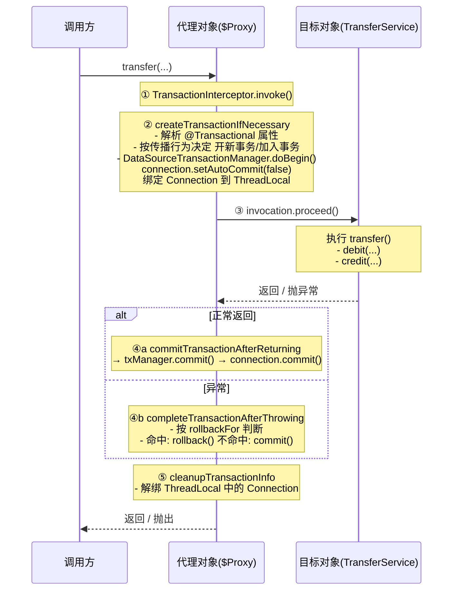
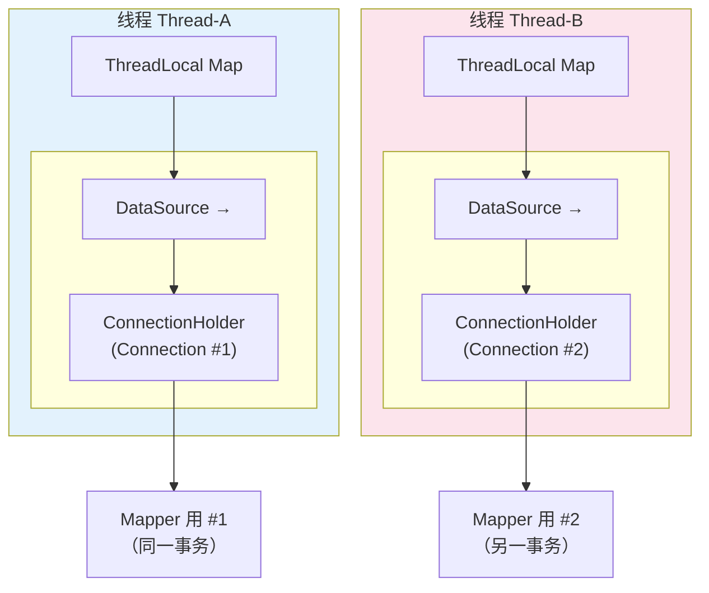
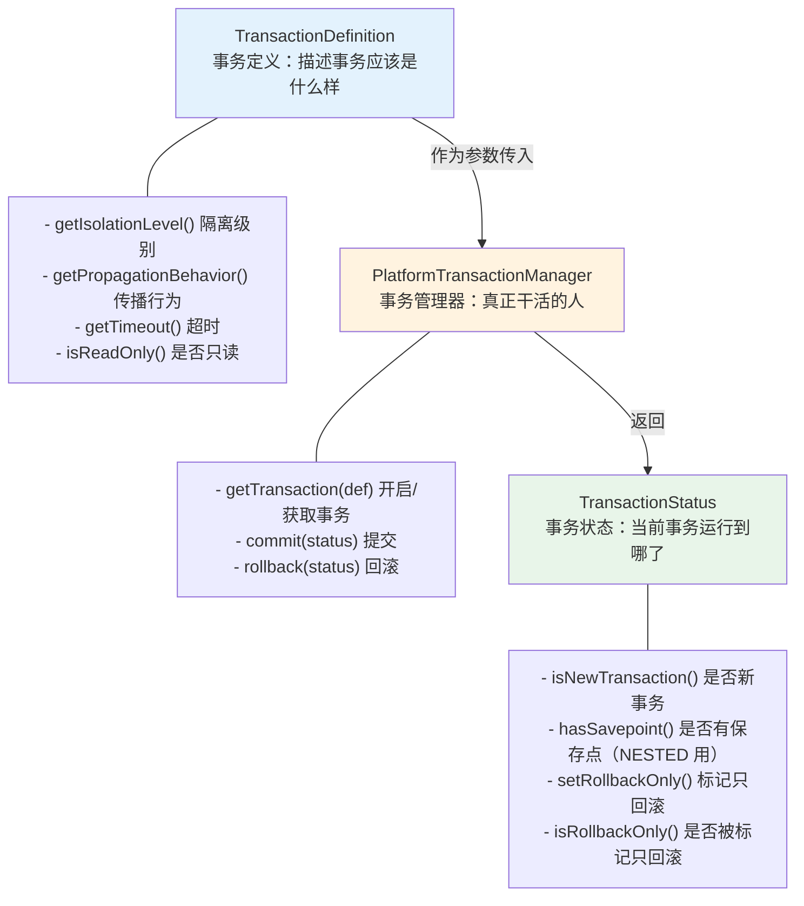
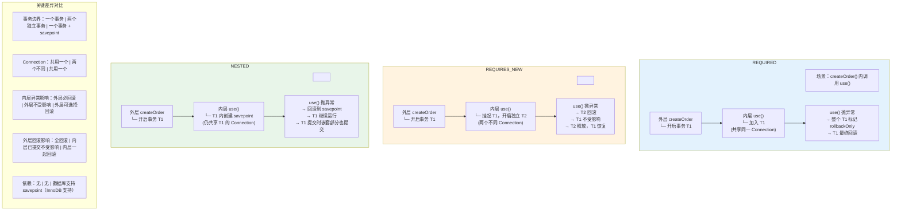

# 04 - Spring 事务管理：原理、传播行为、失效场景

> 📌 **一句话理解**：Spring 事务本质是对 JDBC `Connection.setAutoCommit(false)/commit()/rollback()` 的封装，通过 AOP 代理在方法执行前后自动开关事务；开发者的三大痛点是 7 种传播行为、默认不回滚 checked 异常、自调用失效。

---

## 核心概念

### 一、两种事务管理方式 ⭐⭐

Spring 提供两种使用事务的方式：**编程式**（手动写代码控制）和**声明式**（注解一打自动生效，最常用）。

**类比理解**：
- 编程式 = 自己去银行柜台办业务，每一步都要亲自操作
- 声明式 = 雇个私人管家，你只声明"这事归你管"，剩下的他全包

#### 1. 编程式事务

**两种写法**：

```java
// 写法一：TransactionTemplate（推荐，回调式，自动提交/回滚）
transactionTemplate.execute(status -> {
    accountMapper.debit(from, amount);
    accountMapper.credit(to, amount);   // 抛异常自动回滚
    return null;
});

// 写法二：PlatformTransactionManager（手动控制，粒度更细）
DefaultTransactionDefinition def = new DefaultTransactionDefinition();
TransactionStatus status = txManager.getTransaction(def);
try {
    accountMapper.debit(from, amount);
    accountMapper.credit(to, amount);
    txManager.commit(status);
} catch (Exception e) {
    txManager.rollback(status);   // 必须手动 rollback
    throw e;
}
```

#### 2. 声明式事务

```java
@Service
public class TransferService {
    @Transactional(rollbackFor = Exception.class)
    public void transfer(Long from, Long to, BigDecimal amount) {
        accountMapper.debit(from, amount);
        accountMapper.credit(to, amount);
    }
}
```

#### 3. 两种方式对比

| 维度 | 编程式 | 声明式 |
|---|---|---|
| 实现方式 | TransactionTemplate / PlatformTransactionManager | `@Transactional` 注解（AOP 代理）|
| 侵入性 | 强侵入业务代码 | 零侵入，业务无感知 |
| 粒度 | 可控到代码块 / 几行 | 方法级（最细到方法）|
| 灵活性 | 高（局部事务可控）| 低（整个方法统一）|
| 失效风险 | 无（直接调用）| 有（自调用、非 public 等）|
| 适用场景 | 局部事务、跨多个不相关操作、粒度精细控制 | 95% 的业务场景 |

> 💡 **实践建议**：默认用声明式；只有"方法内只有一小段需要事务"或"同一个方法内多个独立事务"才考虑编程式。

---

### 二、声明式事务原理 ⭐⭐⭐

#### 1. 整体工作流程（必背）



#### 2. 核心组件与源码脉络

| 组件 | 作用 |
|---|---|
| `@Transactional` | 标注事务方法，声明事务属性 |
| `TransactionAttributeSourcePointcut` | 切点：判断哪些方法需要事务（匹配 `@Transactional`）|
| `TransactionInterceptor` | 事务拦截器，实现 `MethodInterceptor`，事务入口 |
| `TransactionAspectSupport` | `TransactionInterceptor` 父类，封装事务逻辑 |
| `TransactionAttributeSource` | 解析 `@Transactional` 属性，缓存结果 |
| `PlatformTransactionManager` | 真正干活的事务管理器 |
| `TransactionSynchronizationManager` | 把 Connection 绑定到 ThreadLocal |

`TransactionInterceptor.invoke()` 关键源码（精简）：

```java
@Override
public Object invoke(MethodInvocation invocation) throws Throwable {
    Class<?> targetClass = AopUtils.getTargetClass(invocation.getThis());
    // 委托给父类 TransactionAspectSupport
    return invokeWithinTransaction(invocation.getMethod(), targetClass,
        () -> invocation.proceed());   // ③ 执行目标方法
}
```

`TransactionAspectSupport.invokeWithinTransaction()` 核心：

```java
// ① 解析事务属性
TransactionAttribute txAttr = tas.getTransactionAttribute(method, targetClass);
// ② 定位事务管理器
PlatformTransactionManager tm = determineTransactionManager(txAttr);
// ③ 开启事务（按传播行为决定 getTransaction 的行为）
TransactionInfo txInfo = createTransactionIfNecessary(tm, txAttr, methodId);
try {
    retVal = invocation.proceedWithInvocation();   // 执行目标方法
} catch (Throwable ex) {
    completeTransactionAfterThrowing(txInfo, ex);  // ④b 异常：按回滚规则判断
    throw ex;
} finally {
    cleanupTransactionInfo(txInfo);                 // ⑤ 清理 ThreadLocal
}
commitTransactionAfterReturning(txInfo);           // ④a 正常返回：提交
```

#### 3. 底层本质：对 JDBC Connection 的封装

Spring 没有发明"事务"这个东西，它只是把 JDBC 的事务 API 封装得更优雅：

```java
// DataSourceTransactionManager.doBegin() 简化源码
protected void doBegin(Object transaction, TransactionDefinition definition) {
    DataSourceTransactionObject txObject = (DataSourceTransactionObject) transaction;
    Connection con = obtainDataSource().getConnection();
    con.setAutoCommit(false);      // ← 这就是事务的起点！

    // 把 Connection 绑定到 ThreadLocal，供同线程内的 Mapper 复用
    TransactionSynchronizationManager.bindResource(
        obtainDataSource(), txObject.getConnectionHolder());
}
```

> 💡 **关键认知**：Spring 事务 = `setAutoCommit(false)` + 同线程复用同一个 `Connection`。`@Transactional` 方法内所有 SQL 共享一个 Connection，这就是"同一事务"的本质。

#### 4. 事务与 ThreadLocal 的绑定



> ⚠️ **多线程下事务失效**：ThreadLocal 只绑定当前线程，子线程、`@Async` 异步方法拿不到外层事务的 Connection，事务无法跨线程传播。

---

### 三、三大核心接口 ⭐⭐

Spring 事务抽象的"三驾马车"，理解它们的关系就懂了 Spring 事务的骨架。



**通俗类比**：去银行办贷款
- `TransactionDefinition` = 贷款申请表（你要借多少、期限多长）
- `PlatformTransactionManager` = 银行柜员（负责办理）
- `TransactionStatus` = 办理回执单（当前到哪一步、是否已放款）

#### 常用实现类对比

| 实现类 | 数据访问技术 | 说明 |
|---|---|---|
| `DataSourceTransactionManager` | JDBC / MyBatis | 最常用，绑定一个 `DataSource` |
| `JpaTransactionManager` | JPA / Hibernate | 支持 JPA 的事务 |
| `HibernateTransactionManager` | Hibernate（旧版）| 老项目可能用 |
| `JtaTransactionManager` | JTA | 分布式事务（跨数据源）|
| `ChainedTransactionManager` | 多数据源（已废弃）| Spring 5.2 弃用，不推荐 |

> ⚠️ **单数据源用 `DataSourceTransactionManager`，多数据源/跨库用 `JtaTransactionManager`**（配合 Atomikos、Seata 等）。Spring 自身不解决分布式事务，只提供接入抽象。

---

### 四、事务属性详解

`@Transactional` 注解的全部属性：

```java
@Transactional(
    value          = "txManager",           // 事务管理器名（多 TM 时指定）
    propagation    = Propagation.REQUIRED, // 传播行为
    isolation      = Isolation.DEFAULT,    // 隔离级别
    timeout        = 30,                   // 超时秒数（仅对新事务生效）
    readOnly       = false,                // 是否只读
    rollbackFor    = Exception.class,       // 指定回滚异常
    noRollbackFor  = {}                     // 指定不回滚异常
)
```

#### 1. 隔离级别 ⭐⭐

| Spring 常量 | 值 | 对应数据库隔离级别 |
|---|---|---|
| `ISOLATION_DEFAULT` | -1 | 使用数据库默认（最常用）|
| `ISOLATION_READ_UNCOMMITTED` | 1 | 读未提交（脏读）|
| `ISOLATION_READ_COMMITTED` | 2 | 读已提交 |
| `ISOLATION_REPEATABLE_READ` | 3 | 可重复读 |
| `ISOLATION_SERIALIZABLE` | 8 | 串行化 |

**关键认知**：
- **MySQL 默认 `REPEATABLE_READ`**（可重复读，用 MVCC + 间隙锁解决幻读）
- **Oracle / PostgreSQL 默认 `READ_COMMITTED`**
- `ISOLATION_DEFAULT` 是最常见配置，交给数据库决定
- ⚠️ Spring 隔离级别**不能比数据库实际支持的更严格**，配置 `SERIALIZABLE` 性能急剧下降

#### 2. 传播行为（7 种）⭐⭐⭐

这是 Spring 事务**最核心**也最易混淆的概念。传播行为回答一个问题：**当前方法被调用时，如果调用方已经有事务了，我该怎么办？**

| 传播行为 | 当前有事务 | 当前无事务 | 通俗比喻 |
|---|---|---|---|
| **REQUIRED**（默认）| 加入 | 新建 | 有团队就加入，没团队自己组队 |
| **REQUIRES_NEW** | 挂起当前，新建独立事务 | 新建 | 我单干，你先等着 |
| **NESTED** | 在当前事务内建嵌套事务（savepoint）| 新建 | 大账本里开了个小存钱罐 |
| **SUPPORTS** | 加入 | 非事务运行 | 有则跟随，没有也无所谓 |
| **NOT_SUPPORTED** | 挂起当前，非事务运行 | 非事务运行 | 我不爱团队活，挂起你来 |
| **MANDATORY** | 加入 | **抛异常** | 必须有团队，否则告状 |
| **NEVER** | **抛异常** | 非事务运行 | 我独行侠，看到团队就翻脸 |

**逐一详解**：

**(1) REQUIRED（默认，最常用）** —— 90% 场景都用它

```java
@Service
public class OrderService {
    @Autowired private StockService stockService;
    @Autowired private PointService pointService;

    @Transactional
    public void createOrder() {            // 外层开启事务 T1
        stockService.deduct();             // 内层 REQUIRED → 加入 T1
        pointService.add();                // 内层 REQUIRED → 加入 T1
    }                                       // T1 提交（所有操作一起提交或回滚）
}
```

**比喻**：三个员工同在一个项目组，干完一起结账，谁出错项目全盘失败。

**(2) REQUIRES_NEW（独立事务，日志/审计场景）**

```java
@Service
public class OrderService {
    @Autowired private LogService logService;

    @Transactional
    public void createOrder() {            // 事务 T1
        orderMapper.insert(...);
        try {
            logService.record("订单创建");  // 内层 REQUIRES_NEW
        } catch (Exception e) {            // 日志失败不影响下单
            log.warn("日志写入失败", e);
        }
    }
}

@Service
public class LogService {
    @Transactional(propagation = Propagation.REQUIRES_NEW)
    public void record(String msg) {        // 挂起 T1，开启新事务 T2
        logMapper.insert(msg);              // T2 独立提交
    }                                       // T1 恢复
}
```

**比喻**：我单干，你先等着。日志记录无论主事务成败都要落地，比如记录操作失败原因。

**(3) NESTED（嵌套事务，部分回滚）**

```java
@Service
public class OrderService {
    @Transactional
    public void createOrder() {            // 事务 T1
        orderMapper.insert(...);
        try {
            couponService.use("NEW100");    // NESTED
        } catch (Exception e) {             // 优惠券失败，订单还能继续
            log.warn("优惠券不可用", e);
        }
        // T1 继续，最终一起提交
    }
}

@Service
public class CouponService {
    @Transactional(propagation = Propagation.NESTED)
    public void use(String code) {         // 在 T1 内创建 savepoint
        couponMapper.update(...);           // 失败回滚到 savepoint
    }                                       // 释放 savepoint
}
```

**比喻**：大账本（外层事务）里开了个小存钱罐（嵌套事务），存钱罐摔碎了不影响大账本，但大账本撕了存钱罐也跟着没了。

#### 3. REQUIRED vs REQUIRES_NEW vs NESTED（核心对比）⭐⭐⭐

这是面试必考的对比，画一张调用关系图：



> 💡 **选型口诀**：要"一荣俱荣一损俱损"用 REQUIRED；要"井水不犯河水"用 REQUIRES_NEW；要"子可独立回滚、父回滚子也回滚"用 NESTED。

#### 4. 其余 4 种传播行为

| 行为 | 何时用 |
|---|---|
| **SUPPORTS** | 查询方法，不强求事务，跟随调用方 |
| **NOT_SUPPORTED** | 耗时操作不需要事务（如调用外部接口），避免长事务 |
| **MANDATORY** | 校验调用方必须开事务的工具方法，没开就抛异常提示 |
| **NEVER** | 强制要求不能在事务中执行（如初始化操作）|

> 💡 后 4 种实际很少用，但面试要能说出语义。后三个 `SUPPORTS` / `NOT_SUPPORTED` 在"当前无事务"时都是非事务运行，区别仅在"当前有事务"时一个加入一个挂起。

#### 5. 回滚规则 ⭐⭐⭐（超高频考点）

**默认规则（必须背）**：

| 异常类型 | 默认是否回滚 | 举例 |
|---|---|---|
| `RuntimeException`（非受检）| **回滚** | `NullPointerException`、`IllegalArgumentException` |
| `Error` | **回滚** | `OutOfMemoryError`、`StackOverflowError` |
| **checked Exception（受检）** | **不回滚** ⚠️ | `IOException`、`SQLException`、`ClassNotFoundException` |

**源码佐证** `DefaultTransactionAttribute.rollbackOn()`：

```java
public boolean rollbackOn(Throwable ex) {
    return (ex instanceof RuntimeException || ex instanceof Error);
}
```

**为什么这样设计**？Spring 哲学：checked 异常是"业务预期内、可恢复"的（如文件找不到，业务可以处理），不应触发回滚；RuntimeException 是"程序错误、不可预期"的（如空指针），必须回滚。

⚠️ **三大易错点**：

```java
// ❌ 错误1：抛 checked 异常，默认不回滚！
@Transactional
public void upload() throws IOException {
    fileMapper.insert(file);
    Files.copy(src, dst);   // 抛 IOException
    // 结果：insert 不会回滚！
}

// ✅ 修正1：显式声明 rollbackFor
@Transactional(rollbackFor = Exception.class)
public void upload() throws IOException { ... }

// ❌ 错误2：异常被 catch 吞掉，根本不抛出
@Transactional
public void transfer(...) {
    try {
        debit(...); credit(...);
    } catch (Exception e) {
        log.error("失败", e);    // 异常被吞，事务不回滚！
    }
}

// ❌ 错误3：rollbackFor 写了具体类，但抛的是其父类
@Transactional(rollbackFor = SQLException.class)   // 只回滚 SQLException
public void doWork() throws Exception {
    throw new IOException("文件错");   // 不是 SQLException，不回滚！
}

// ✅ 通用最佳实践
@Transactional(rollbackFor = Exception.class)   // 所有异常都回滚
```

#### 6. timeout 与 readOnly ⭐

```java
@Transactional(timeout = 30)               // 事务超过 30s 自动回滚
@Transactional(readOnly = true)           // 只读事务
@Transactional(timeout = 30, readOnly = true)
```

**要点**：
- `timeout`：单位秒，默认 -1（用数据库默认）。仅对**新开启的事务**生效，加入已有事务（REQUIRED 加入场景）时被忽略。
- `readOnly`：提示数据库做查询优化（如 MySQL 不分配事务 ID、不记录 undo log）。**不是强制只读**，写了不会报错，只是失去优化意义。同样仅对新事务生效。

> 💡 **最佳实践**：查询方法加 `@Transactional(readOnly = true)`，可让数据库做优化、也让 ORM 框架（如 Hibernate）跳过 dirty check。

---

### 五、Spring 事务与数据库事务的关系 ⭐

| 维度 | 数据库事务 | Spring 事务 |
|---|---|---|
| 实质 | Connection 上的 `setAutoCommit/commit/rollback` | 对上述 API 的封装 |
| 边界 | 开发者手动控制 | AOP 代理自动开关 |
| 跨数据源 | 不支持（单连接）| 通过 JTA 支持分布式事务 |
| 传播行为 | 无此概念 | Spring 独有抽象 |
| 隔离级别 | 数据库原生 | 透传到数据库 |

**核心结论**：
1. Spring 事务**不是另起炉灶**，本质还是数据库事务的封装
2. **同一 Spring 事务 = 同一个 JDBC Connection**（通过 ThreadLocal 绑定）
3. 跨数据源场景，单数据源的 `DataSourceTransactionManager` 无能为力，必须用 JTA 或分布式事务方案

---

### 六、事务失效场景（高频⭐⭐⭐，重点逐条讲）

这是面试**必问清单**，每条都要能讲出"原因 + 复现 + 修复"。

#### 场景 1：方法非 public ⭐⭐⭐

```java
@Service
public class UserService {
    @Transactional                       // ❌ 加在 protected 方法上
    protected void createUser(...) {     // Spring AOP 默认不拦截非 public 方法
        userMapper.insert(...);
    }
}
```

**原因**：Spring AOP 默认只对 public 方法织入事务代理。`AnnotationTransactionAttributeSource` 构造时 `publicMethodsOnly = true`，非 public 方法解析事务属性时返回 null，等同于"没有事务"。

**修复**：改为 `public`，或抽到另一个 Service 由外部调用。

> ⚠️ **Spring 6 微调**：Spring 6 仍默认只对 public 生效（`publicMethodsOnly=true`）。要代理非 public 方法需用 AspectJ 编译时/加载时织入，但实际很少这么用。

#### 场景 2：自调用 this 调用 ⭐⭐⭐

```java
@Service
public class OrderService {
    @Transactional
    public void createOrder() {
        orderMapper.insert(...);
        this.addBonus();          // ❌ this 调用，不走代理！
    }

    @Transactional(propagation = Propagation.REQUIRES_NEW)
    public void addBonus() {      // 即便有独立配置也不生效
        bonusMapper.insert(...);
    }
}
```

**原因**：AOP 代理拦截的是"外部调用进入 Bean"的那一刻。`this.addBonus()` 是对象内部直接方法调用，绕过代理对象，所以 `addBonus` 上的 `@Transactional` 不生效。注意：外层 `createOrder` 的事务仍有效，失效的只是 `addBonus` 上**额外的**事务配置。

**三种修复方案**：

```java
// 方案一：注入自身（推荐，Spring 4.3+ 支持自注入）
@Autowired private OrderService self;
self.addBonus();

// 方案二：AopContext.currentProxy()（需开启 exposeProxy）
@Configuration
@EnableAspectJAutoProxy(exposeProxy = true)   // 必须开启
// 业务中：
((OrderService) AopContext.currentProxy()).addBonus();

// 方案三：抽到另一个 Service（最干净的工程实践）
@Autowired private BonusService bonusService;
bonusService.addBonus();   // 跨 Bean 调用，天然走代理
```

#### 场景 3：异常被 catch 吞掉 ⭐⭐⭐

```java
@Transactional
public void transfer(...) {
    try {
        debit(...); credit(...);
    } catch (Exception e) {
        log.error("失败", e);   // ❌ 异常没抛出，TransactionInterceptor 不知道出错了
    }
}
```

**原因**：事务回滚靠 `TransactionInterceptor` 捕获方法抛出的异常触发。异常被吞，拦截器认为方法正常返回，直接 commit。

**修复**：catch 后重新抛出，或手动标记回滚。

```java
try { ... }
catch (Exception e) {
    log.error("失败", e);
    throw new RuntimeException("转账失败", e);   // 重新抛出
    // 或：TransactionAspectSupport.currentTransactionStatus().setRollbackOnly();
}
```

#### 场景 4：抛 checked 异常默认不回滚 ⭐⭐⭐

见上文回滚规则小节，必须 `rollbackFor = Exception.class`。

#### 场景 5：异常类型不匹配 ⭐⭐

```java
@Transactional(rollbackFor = SQLException.class)
public void doWork() throws IOException {
    throw new IOException("...");   // ❌ 不在 rollbackFor 列表，不回滚
}
```

**修复**：`rollbackFor = Exception.class` 一网打尽，或精确匹配实际异常类型。

#### 场景 6：数据库引擎不支持事务 ⭐⭐

```sql
-- ❌ MyISAM 不支持事务，@Transactional 形同虚设
CREATE TABLE account (...) ENGINE=MyISAM;

-- ✅ InnoDB 支持事务
CREATE TABLE account (...) ENGINE=InnoDB;
```

**说明**：MySQL 的 MyISAM 引擎无事务能力，Spring 事务不会报错，但 commit/rollback 都是空操作。**现代项目都用 InnoDB**，但面试要知道这个坑。

#### 场景 7：传播行为配置错误 ⭐⭐

```java
@Transactional
public void createOrder() {
    orderMapper.insert(...);
    logService.record(...);   // logService 用了 NOT_SUPPORTED → 挂起当前事务
    pointService.add(...);    // pointService 用了 NEVER → 抛异常！
}
```

**说明**：`NOT_SUPPORTED` 会挂起当前事务，`NEVER` 在有事务时直接抛 `IllegalTransactionStateException`，`REQUIRES_NEW` 会开新事务导致数据可能不一致。需理解清楚每个传播行为的语义。

#### 场景 8：Bean 未被 Spring 管理 ⭐

```java
// ❌ new 出来的对象，没经过 Spring 容器，自然没有代理
UserService userService = new UserService();
userService.createUser(...);   // @Transactional 不生效
```

**修复**：必须通过 `@Autowired` 注入或从 `ApplicationContext` 获取。

#### 场景 9（补充）：final / static 方法 ⭐

```java
@Transactional public final void createUser(...) { ... }   // ❌ CGLIB 无法代理 final 方法
@Transactional public static void staticMethod(...) { ... } // ❌ static 方法不参与 AOP
```

**原因**：CGLIB 通过生成子类重写方法实现代理，`final` 方法无法重写；`static` 方法属于类不属于实例，AOP 代理对象无法覆盖。

#### 场景 10（补充）：多线程跨调用 ⭐

```java
@Transactional
public void batchInsert(List<Data> list) {
    list.parallelStream().forEach(d -> dataMapper.insert(d));   // ❌ 子线程拿不到外层事务
}
```

**原因**：事务通过 ThreadLocal 绑定 Connection，子线程的 ThreadLocal 是空的，会从连接池取新的 Connection，不在同一事务。

**修复**：单线程处理，或采用批量插入 + 编程式事务分批提交。

---

## 常见面试题

### 1. Spring 事务的实现原理？

**回答思路**：声明式事务本质 = AOP 代理 + JDBC Connection 封装。讲清代理拦截、事务管理器、ThreadLocal 绑定三层。

> Spring 声明式事务基于 AOP 实现。`@Transactional` 标注的方法在 Bean 初始化时被 `TransactionAttributeSourcePointcut` 匹配，Spring 为该 Bean 创建代理（CGLIB 或 JDK 动态代理）。调用方法时，代理对象先进入 `TransactionInterceptor.invoke()`，它会：
> 1. 解析 `@Transactional` 的事务属性
> 2. 调用 `createTransactionIfNecessary`，按传播行为开启或加入事务（`DataSourceTransactionManager.doBegin` 中执行 `connection.setAutoCommit(false)` 并把 Connection 绑定到 `ThreadLocal`）
> 3. 执行目标方法
> 4. 正常返回调用 `commitTransactionAfterReturning`，异常调用 `completeTransactionAfterThrowing`（按 `rollbackFor` 规则判断回滚还是提交）
> 5. 清理 `ThreadLocal` 上下文
>
> 本质是对 JDBC `Connection.setAutoCommit/commit/rollback` 的封装，同一事务内所有 Mapper 共享同一个 `Connection`。

### 2. Spring 事务的 7 种传播行为？分别什么场景用？

**回答思路**：分两类讲——"改变事务边界的"（REQUIRED/REQUIRES_NEW/NESTED）和"不影响事务边界的"（SUPPORTS/NOT_SUPPORTED/MANDATORY/NEVER）。

> 1. **REQUIRED**（默认）：有则加入，无则新建。90% 业务场景。
> 2. **REQUIRES_NEW**：总是新建独立事务，挂起当前事务。用于日志、审计等必须独立提交的场景。
> 3. **NESTED**：在当前事务内建嵌套事务（基于 savepoint）。子事务可独立回滚，父事务回滚则子事务一起回滚。
> 4. **SUPPORTS**：有事务就加入，没有就非事务运行。用于查询方法。
> 5. **NOT_SUPPORTED**：非事务运行，挂起当前事务。用于耗时操作避免长事务。
> 6. **MANDATORY**：必须在事务中，否则抛异常。用于工具方法校验调用方。
> 7. **NEVER**：不能有事务，否则抛异常。用于强制要求非事务执行的场景。

### 3. REQUIRED、REQUIRES_NEW、NESTED 有什么区别？

**回答思路**：从"事务数量、Connection 共享、子异常对外层影响、外层回滚对子影响、是否依赖 savepoint"五维度对比。

> - **REQUIRED**：一个事务，共享同一个 Connection。内层抛异常会标记外层 `rollbackOnly`，外层最终回滚。
> - **REQUIRES_NEW**：两个独立事务，两个 Connection。内层提交/回滚完全不影响外层，但会占用额外数据库连接，可能死锁或连接池耗尽。
> - **NESTED**：一个事务 + 一个 savepoint，共享一个 Connection。内层异常回滚到 savepoint，外层可选择继续；外层回滚则内层一起回滚。依赖数据库 savepoint 支持（InnoDB 支持）。
>
> 一句话：REQUIRED 是"同舟共济"，REQUIRES_NEW 是"井水不犯河水"，NESTED 是"父子连心但子可独立失败"。

### 4. @Transactional 在什么情况下会失效？（重点）

**回答思路**：分"代理层面"和"配置层面"两类，按高频到低频列。

> 代理层面失效：
> 1. 方法非 public（Spring AOP 默认只拦截 public）
> 2. 自调用 `this.method()`（不走代理）
> 3. Bean 未被 Spring 管理（`new` 出来的对象）
> 4. `final` / `static` 方法（CGLIB 无法代理）
> 5. 多线程跨调用（ThreadLocal 不跨线程）
>
> 配置层面失效：
> 6. 异常被 catch 吞掉（拦截器收不到异常）
> 7. 抛 checked 异常未配 `rollbackFor`（默认只回滚 RuntimeException + Error）
> 8. 异常类型不匹配 `rollbackFor`
> 9. 传播行为错配（NOT_SUPPORTED 挂起事务、NEVER 抛异常）
> 10. 数据库引擎不支持事务（如 MyISAM）

### 5. Spring 事务默认回滚哪些异常？checked 异常会回滚吗？怎么让它回滚？

**回答思路**：默认规则 → 为什么这样设计 → 怎么改 → 源码佐证。

> Spring 事务默认只回滚 `RuntimeException` 和 `Error`，**checked 异常（如 IOException、SQLException）默认不回滚**。
>
> 源码在 `DefaultTransactionAttribute.rollbackOn()`：
> ```java
> public boolean rollbackOn(Throwable ex) {
>     return (ex instanceof RuntimeException || ex instanceof Error);
> }
> ```
> 设计哲学：checked 异常是业务预期内、可恢复的（如文件找不到），应由业务处理；RuntimeException 是程序错误、不可预期，必须回滚。
>
> 让 checked 异常也回滚：`@Transactional(rollbackFor = Exception.class)`。生产实践建议**统一加 `rollbackFor = Exception.class`**，避免踩坑。

### 6. 自调用导致事务失效怎么解决？

**回答思路**：根因 → 三种解决方案及适用场景。

> 根因：`this.method()` 是对象内部直接调用，绕过了 Spring 生成的代理对象，方法上的 `@Transactional` 不生效。
>
> 三种解决方案：
> 1. **注入自身**：`@Autowired private OrderService self;` 调用 `self.method()`（推荐，最清晰）
> 2. **AopContext.currentProxy()**：需先开启 `@EnableAspectJAutoProxy(exposeProxy = true)`，通过 `((OrderService) AopContext.currentProxy()).method()` 调用
> 3. **抽到另一个 Service**：跨 Bean 调用天然走代理（最干净的工程实践）

### 7. @Transactional 注解加在 private 方法上会怎样？

**回答思路**：直接答现象 → 解释原因 → 给出修复。

> 事务**不会生效**。Spring AOP 默认只对 public 方法织入事务代理，`AnnotationTransactionAttributeSource` 的 `publicMethodsOnly` 默认为 true，对 private 方法解析事务属性时返回 null，等同于没有事务配置。
>
> 即使用 CGLIB 代理，也无法重写 private 方法（子类不可见父类私有方法）。Spring 6 仍维持此默认行为，要代理非 public 方法必须切换到 AspectJ 编译时/加载时织入（CTW/LTW）。
>
> 修复：把方法改为 `public`，或抽到独立 Service 通过外部调用。

### 8. 编程式事务和声明式事务的区别？各适用什么场景？

**回答思路**：区别 → 各自适用场景 → 生产建议。

> | 维度 | 编程式 | 声明式 |
> |---|---|---|
> | 方式 | `TransactionTemplate` / `PlatformTransactionManager` | `@Transactional` 注解 |
> | 侵入性 | 强侵入业务 | 零侵入 |
> | 粒度 | 代码块级 | 方法级 |
> | 灵活性 | 高 | 低 |
> | 失效风险 | 无（无代理） | 有（自调用等场景）|
>
> 编程式适用：① 方法内只有一小段需要事务；② 同一方法内多个独立事务（如批量处理分批提交）；③ 需要细粒度控制（如部分异常回滚、部分提交）。
>
> 声明式适用：90% 业务场景，标准 CRUD、Service 层业务方法。
>
> 生产建议：默认声明式，特殊场景才用编程式。混合使用时注意不要在 `@Transactional` 方法内又嵌套 `TransactionTemplate`，容易踩传播行为的坑。

---

## 本章学习建议

1. **先把流程图背下来**：`TransactionInterceptor.invoke` → `createTransactionIfNecessary` → 目标方法 → `commitTransactionAfterReturning` / `completeTransactionAfterThrowing` → `cleanupTransactionInfo`。能用嘴画出这张时序图就过 60%。
2. **7 种传播行为用"比喻 + 调用关系图"记忆**：REQUIRED=同舟共济、REQUIRES_NEW=井水不犯河水、NESTED=父子连心但子可独立失败，剩下 4 种按字面理解。
3. **默认回滚规则是超高频考点**：RuntimeException + Error 回滚，checked 不回滚。背下 `rollbackOn()` 那两行源码。
4. **失效场景清单要烂熟**：从"代理失效"和"配置失效"两个维度记，面试官追问时能逐条说原因 + 修复方案。
5. **动手写一个失败案例**：自己写一段抛 checked 异常不回滚的代码，跑一遍，再用 `rollbackFor = Exception.class` 修复，印象最深刻。
6. **源码建议阅读路径**：`@Transactional` → `TransactionInterceptor` → `TransactionAspectSupport.invokeWithinTransaction` → `DataSourceTransactionManager.doBegin/doCommit/doRollback` → `TransactionSynchronizationManager.bindResource`。

> 💡 **学习心法**：Spring 事务没有魔法，本质就是"Around 通知 + ThreadLocal 绑定 Connection"。把这两点想通，7 种传播行为、10 种失效场景都能用自己的话推导出来，不用死记。

---

## 资料勘误与重点提醒

> 以下为阅读参考资料时识别出的常见错误表述或遗漏重点，特此集中强调。

### 1. 关于"Spring 6 取消了 public 限制"的传言

- 部分资料称"Spring 6 起 `@Transactional` 可用于非 public 方法"
- ⚠️ **不准确**：Spring 6 仍默认只对 public 方法生效（`AnnotationTransactionAttributeSource.publicMethodsOnly` 默认 `true`）。要支持非 public 方法需切换到 AspectJ 编译时/加载时织入，属于另一套机制。面试不要答"Spring 6 取消了限制"。

### 2. NESTED 的"独立回滚"常被误解为"完全独立"

- 常见误区：把 NESTED 等同于 REQUIRES_NEW
- ⚠️ **关键区别**：
  - NESTED 的"独立"指**子事务可独立回滚到 savepoint**，不影响外层继续运行
  - 但**外层回滚时，NESTED 的修改也会一起回滚**（父子关系）
  - REQUIRES_NEW 是真正的两个独立事务，互不影响
- 这是面试核心区分点，务必讲清。

### 3. REQUIRES_NEW 与连接池死锁的隐患

- 资料常忽略：REQUIRES_NEW 会**占用第二个数据库连接**（原事务 Connection 被挂起但仍占用）
- 高并发场景下可能**耗尽连接池**，或两个事务操作同一行产生**死锁**
- 生产实践：慎用 REQUIRES_NEW，日志场景可改用**异步非事务**或**消息队列**解耦

### 4. `@Transactional` 加在接口上 vs 实现类上

- 资料 commonly 推荐"加在 Service 实现类上"
- ⚠️ 补充：Spring 官方**不推荐**加在接口上。JDK 动态代理能识别接口注解，但 CGLIB 代理基于子类**不能识别接口上的注解**，换代理方式行为就变了。
- 规范：始终加在**具体类的 public 方法**上。

### 5. timeout / readOnly 对已有事务无效

- 资料常漏：`timeout` 和 `readOnly` **仅对新开启的事务生效**
- 当传播行为为 REQUIRED 且外层已有事务时，内层加入事务，`timeout` / `readOnly` 配置被忽略
- 面试追问"为什么我配了 timeout=30 还是不生效"——多半是加入了已有事务。

### 6. 多数据源 `@Transactional` 默认只对主数据源生效

- 多数据源场景下，`@Transactional` 默认使用**主事务管理器**，操作从库的 SQL 不在事务内
- 显式指定 `@Transactional("slaveTransactionManager")` 才能让从库操作进入事务
- 跨库事务必须用 `JtaTransactionManager` 或 Seata 等分布式事务方案，单库的 `DataSourceTransactionManager` 不支持跨库

### 7. `setRollbackOnly` 与 `REQUIRES_NEW` 的隐性陷阱

- 易混点：当内层用 REQUIRED 加入外层事务并抛异常时，外层事务会被标记 `rollbackOnly`
- 此时即便外层 catch 了异常继续执行，最终 commit 时仍会抛 `UnexpectedRollbackException`
- 解决方案：要么内层用 REQUIRES_NEW 独立事务，要么内层不抛异常，要么外层放弃事务
