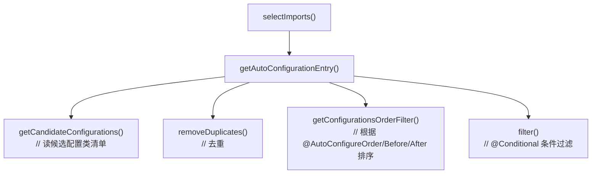
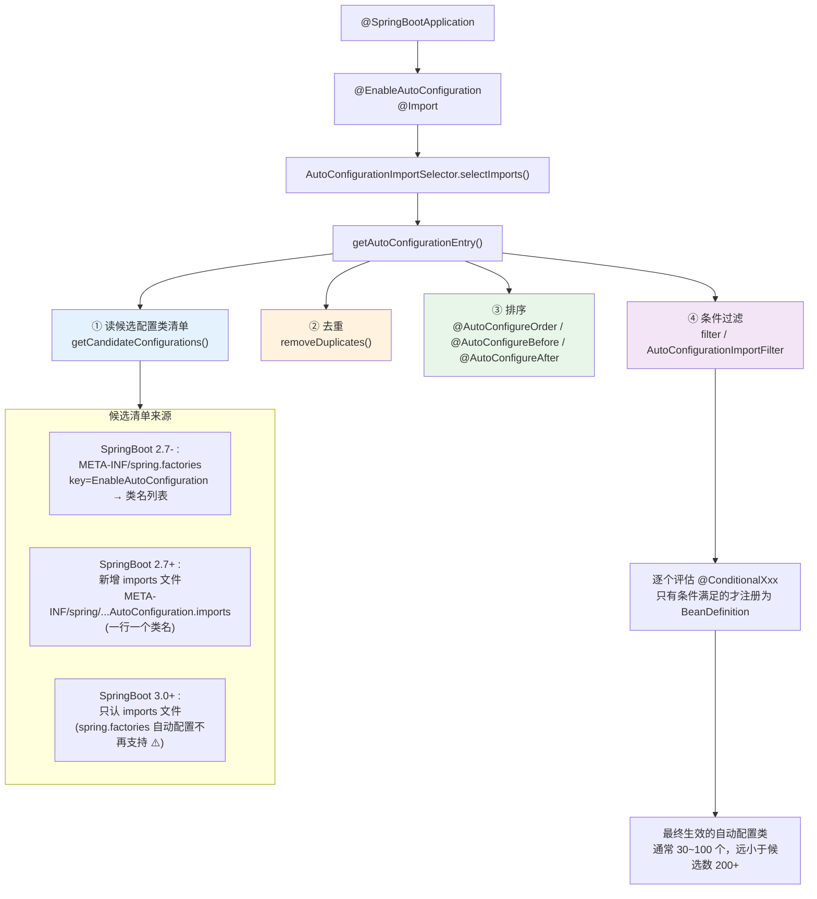
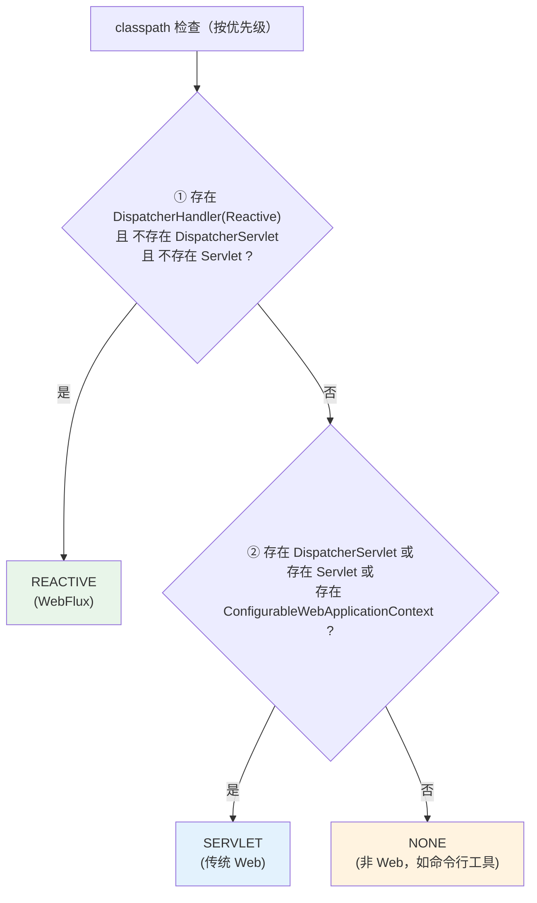
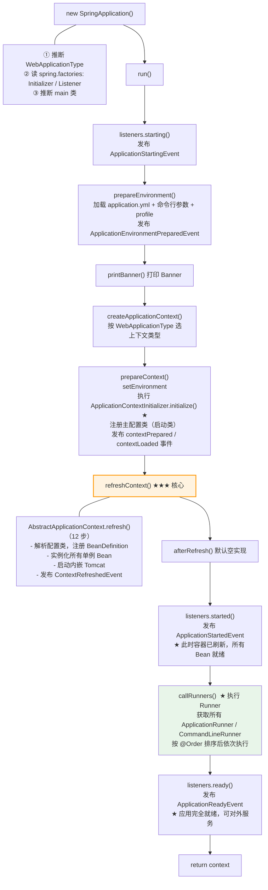
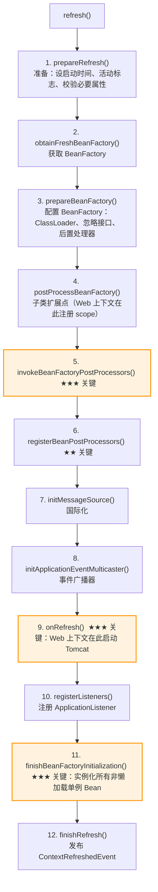
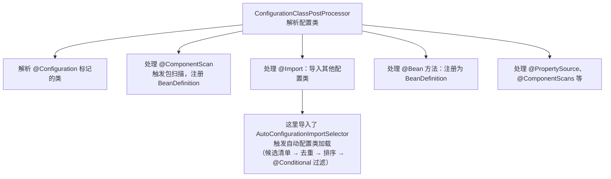
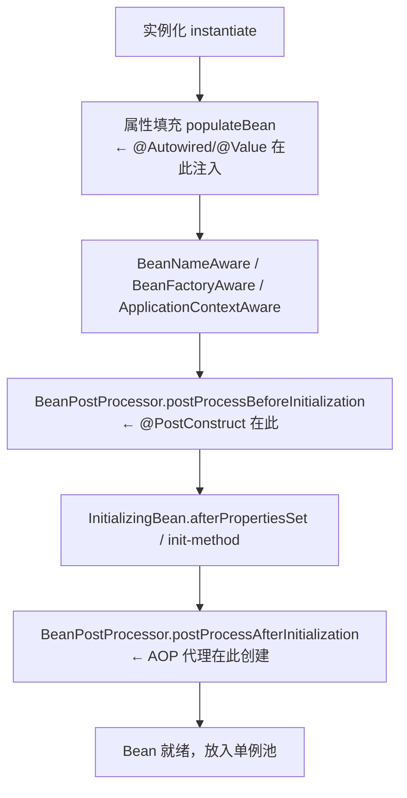
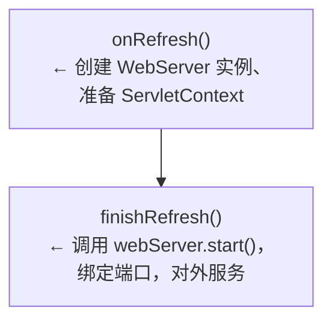

# SpringBoot 自动配置原理与启动流程

> 📌 **一句话理解**：SpringBoot 用「约定 + 条件装配」把 Spring 的手动接线变成自动接线——启动时扫描一批候选配置类，靠 `@Conditional` 按需生效，让开发者「引一个 starter 就能用」。

---

## 核心概念

### 一、约定优于配置 ⭐⭐

Spring 时代写一个 Web 应用，要手写一堆 XML：`DispatcherServlet` 配置、`ViewResolver` 配置、`DataSource` 配置、事务管理器配置…… 配置比业务代码还多。SpringBoot 的核心思想是「**约定优于配置（Convention over Configuration）**」，用三件套解决这个痛点：

| 三件套 | 解决的问题 | 类比理解 |
|--------|-----------|---------|
| **Starter** | 依赖冲突、版本不匹配 | 像「装修套餐」，买一个就配齐所有材料 |
| **自动配置** | 反复手写相同配置 | 像「智能家电」，插上电自动按默认模式工作 |
| **内嵌容器** | 部署要装 Tomcat、打 WAR | 像「自带电池的电器」，不依赖外部电源 |

**约定的两层含义**：
1. **默认配置**：不给任何参数时，SpringBoot 给出一套合理的默认值（如默认 HikariCP、默认端口 8080、默认上下文路径 `/`）。
2. **按条件覆盖**：只要你显式配置了，默认值就让位。比如你手动声明了一个 `DataSource`，自动配置就不再创建默认的。

> ⚠️ **易错提醒**：「约定」不是「强制」。SpringBoot 从未剥夺你的控制权，它只是把「最常见的情况」设为默认，特殊情况你随时可以覆盖。理解这一点是理解自动配置的前提。

---

### 二、@SpringBootApplication 拆解 ⭐⭐

写 SpringBoot 应用，入口类上必然有 `@SpringBootApplication`。它是一个**组合注解**，等价于三个注解的叠加：

```java
@SpringBootApplication
// 等价于：
@SpringBootConfiguration
@EnableAutoConfiguration
@ComponentScan
public class MyApplication {
    public static void main(String[] args) {
        SpringApplication.run(MyApplication.class, args);
    }
}
```

逐个拆解：

| 注解 | 作用 | 类比 |
|------|------|------|
| `@SpringBootConfiguration` | 本质就是 `@Configuration`，标记主配置类，里面可以写 `@Bean` | 标记「这是一个配置文件」 |
| `@ComponentScan` | 包扫描，**默认扫描启动类所在包及其子包** | 像「招聘范围」，默认只招本公司员工 |
| `@EnableAutoConfiguration` | 自动配置入口，**核心**，触发自动配置加载机制 | 像「总开关」，一开就启动自动装配流水线 |

**重点说明 `@ComponentScan` 的默认范围**：
- 默认扫描**启动类所在包及其所有子包**。
- 所以约定俗成的做法是：把启动类放在根包下（如 `com.company.project`），所有业务代码都在它的子包下，这样 Controller、Service、Repository 都能被扫到。
- 如果启动类放错位置（比如放在 `com.company.project.app` 里），同级的其他包就不会被扫描，会导致 Bean 找不到的诡异问题。

---

### 三、自动配置全链路 ⭐⭐⭐

这是 SpringBoot 最核心、最常考的部分。我们沿着调用链一步步拆解。

#### 1. 入口：@EnableAutoConfiguration

```java
@AutoConfigurationPackage
@Import(AutoConfigurationImportSelector.class)
public @interface EnableAutoConfiguration {
    // ...
}
```

两个关键动作：
- `@Import(AutoConfigurationImportSelector.class)`：导入**自动配置选择器**，这才是自动配置的真正引擎。
- `@AutoConfigurationPackage`：把启动类所在包注册为「自动配置包」，给 JPA、Entity 扫描用（与自动配置类加载是两件事，别混淆）。

#### 2. AutoConfigurationImportSelector 干了啥

核心方法调用链（SpringBoot 2.7+ 源码）：



**核心流程图**：



#### 3. 候选清单的读取（版本演变，超高频考点）⭐⭐⭐

这是面试**最容易翻车**的点，务必讲清：

| SpringBoot 版本 | 自动配置类清单来源 | spring.factories 状态 |
|----------------|------------------|----------------------|
| 2.7 之前 | `META-INF/spring.factories` 中 `EnableAutoConfiguration` 键对应的类列表 | 完全使用 |
| 2.7 ~ 3.0 | **新旧两套并存**：优先读 `AutoConfiguration.imports`，兼容 `spring.factories` | 仍可用（已废弃，会有 deprecation 日志） |
| 3.0+ | **只读** `AutoConfiguration.imports` | **自动配置部分被移除** |

**`AutoConfiguration.imports` 文件格式**（注意和 `spring.factories` 不同）：

```
# META-INF/spring/org.springframework.boot.autoconfigure.AutoConfiguration.imports
# 一行一个全类名，没有 key=value，更清爽
org.springframework.boot.autoconfigure.web.servlet.WebMvcAutoConfiguration
org.springframework.boot.autoconfigure.jdbc.DataSourceAutoConfiguration
org.springframework.boot.autoconfigure.redis.RedisAutoConfiguration
...
```

> ⚠️ **超高频考点（铁律3纠偏）**：「`spring.factories` 在 SpringBoot 3.x 被废除了」——**这句话是错的**！
>
> 真相是：只有**自动配置类**那一项从 `spring.factories` 迁移到了 `AutoConfiguration.imports`。下面这些组件**在 3.x 依然从 `spring.factories` 读取**：
> - `ApplicationContextInitializer`
> - `ApplicationListener`
> - `SpringApplicationRunListener`
> - `EnvironmentPostProcessor`
> - `FailureAnalyzer`
>
> 面试时如果被问「3.x 还用 spring.factories 吗」，正确答案是：**自动配置类不再用它，但其他扩展点还在用**。

#### 4. @Conditional 条件过滤

读完候选清单（200 多个），不可能全部生效。SpringBoot 用条件注解做「按需装配」。常见条件：

```java
@Configuration(proxyBeanMethods = false)
@ConditionalOnClass(DataSource.class)           // classpath 有 DataSource 才生效
@ConditionalOnMissingBean(DataSource.class)    // 容器中没有 DataSource 才生效
@EnableConfigurationProperties(DataSourceProperties.class)
public class DataSourceAutoConfiguration {
    // 默认创建 HikariDataSource
}
```

**举例：DataSourceAutoConfiguration 的生效条件**
- 你引入了 `spring-boot-starter-jdbc`（或 `spring-boot-starter-data-jpa`），classpath 上才有 `DataSource` 类。
- 你没有手动声明自己的 `DataSource` Bean（`@ConditionalOnMissingBean`）。
- 满足这两条，SpringBoot 就给你自动配一个 HikariCP 数据源，连接池参数从 `application.yml` 的 `spring.datasource.hikari.*` 读取。

> **类比理解**：自动配置像「智能家居系统」，每个设备（配置类）都带一个传感器（`@Conditional`）。传感器检测到「家里有这个插座」「主人没自己买这个电器」等条件，设备才开机工作。

---

### 四、条件注解一览表 ⭐⭐

| 注解 | 触发条件 | 典型场景 |
|------|---------|---------|
| `@ConditionalOnClass` | classpath 上存在指定类 | 没引依赖就不装配 |
| `@ConditionalOnMissingClass` | classpath 上不存在指定类 | 与上面相反 |
| `@ConditionalOnBean` | 容器中存在指定 Bean | 依赖其他 Bean 已就绪 |
| `@ConditionalOnMissingBean` | 容器中不存在指定 Bean | 用户没自定义就用默认 |
| `@ConditionalOnProperty` | 配置项满足条件 | `spring.cache.type=redis` 才装配 |
| `@ConditionalOnWebApplication` | 是 Web 应用（Servlet/Reactive） | Web 才生效的配置 |
| `@ConditionalOnNotWebApplication` | 不是 Web 应用 | 命令行工具场景 |
| `@ConditionalOnResource` | classpath 上存在指定资源文件 | 配置文件存在才生效 |
| `@ConditionalOnExpression` | SpEL 表达式为 true | 复杂条件组合 |
| `@ConditionalOnSingleCandidate` | 容器中该类型只有一个 Bean 或有 `@Primary` | 注入歧义时才生效 |

**最常用、最高频**的是 `@ConditionalOnClass` 和 `@ConditionalOnMissingBean`，前者决定「装不装配」，后者决定「让不让位」。

> ⚠️ **易错点**：`@ConditionalOnMissingBean` 是 SpringBoot 默认配置「可覆盖」的核心机制。你手动声明一个 Bean，自动配置的同类型 Bean 就不再创建。这就是为什么「写个自己的 `DataSource` 就能替换默认 HikariCP」。

---

### 五、启动流程 SpringApplication.run() ⭐⭐⭐

理解了自动配置，还要理解「谁来触发它」。入口就是 `SpringApplication.run()`，分两个阶段。

#### 阶段一：new SpringApplication() 构造

```java
public SpringApplication(Class<?>... primarySources) {
    this(null, primarySources);
}

public SpringApplication(ResourceLoader resourceLoader, Class<?>... primarySources) {
    // 1. 推断应用类型 WebApplicationType
    this.webApplicationType = WebApplicationType.deduceFromClasspath();
    // 2. 从 spring.factories 读 ApplicationContextInitializer
    setInitializers(getSpringFactoriesInstances(ApplicationContextInitializer.class));
    // 3. 从 spring.factories 读 ApplicationListener
    setListeners(getSpringFactoriesInstances(ApplicationListener.class));
    // 4. 推断主类（栈回溯找到 main 方法所在类）
    this.mainApplicationClass = deduceMainApplicationClass();
}
```

**应用类型推断（`WebApplicationType.deduceFromClasspath`）**：



> **类比理解**：SpringBoot 启动前先「望闻问切」——看看 classpath 上有什么药（类），就推断你得了什么病（应用类型），对症下药（选合适的 ApplicationContext）。

#### 阶段二：run() 方法执行

```java
public ConfigurableApplicationContext run(String... args) {
    // 1. 获取 SpringApplicationRunListener（默认 EventPublishingRunListener，从 spring.factories 读）
    SpringApplicationRunListener listeners = getRunListeners(args);
    listeners.starting();  // 发布 ApplicationStartingEvent

    // 2. 准备 Environment
    ConfigurableEnvironment environment = prepareEnvironment(listeners, args);
    //   - 加载 application.yml/properties
    //   - 合并命令行参数
    //   - 激活 profile

    // 3. 打印 Banner
    Banner printedBanner = printBanner(environment);

    // 4. 创建 ApplicationContext（根据应用类型）
    context = createApplicationContext();
    //   - SERVLET -> AnnotationConfigServletWebServerApplicationContext
    //   - REACTIVE -> AnnotationConfigReactiveWebServerApplicationContext
    //   - NONE -> AnnotationConfigApplicationContext

    // 5. prepareContext：准备上下文
    prepareContext(context, environment, listeners, ...);
    //   - 设置 Environment
    //   - 执行 ApplicationContextInitializer.initialize()
    //   - 注册主配置类（启动类）为 BeanDefinition
    //   - 发布 contextPrepared / contextLoaded 事件

    // 6. refreshContext（关键！）
    refreshContext(context);  // 调用 AbstractApplicationContext.refresh()
    //   - 解析 @Configuration/@ComponentScan/@Import/@Bean
    //   - 注册所有 BeanDefinition（含自动配置类引入的）
    //   - 实例化所有非懒加载单例 Bean
    //   - 启动内嵌 Web 容器（Tomcat）

    // 7. afterRefresh（钩子，默认空实现）
    afterRefresh(context, args);

    // 8. 发布 ApplicationStartedEvent
    listeners.started(context);
    //   - 触发 ApplicationRunner / CommandLineRunner（callRunners）

    // 9. 发布 ApplicationReadyEvent
    listeners.ready(context, null);
    return context;
}
```

**完整时序图**：



> ⚠️ **Runner 执行时机（铁律3重点纠偏）**：
> - `ApplicationRunner` 和 `CommandLineRunner` 在 **`ApplicationStartedEvent` 之后、`ApplicationReadyEvent` 之前** 执行。
> - 「容器刷新完成（所有 Bean 就绪）」是 `ApplicationStartedEvent` 的标志。
> - 「Runner 跑完、应用完全就绪」是 `ApplicationReadyEvent` 的标志。
> - 面试常有人答反，务必记牢顺序。

---

### 六、refresh() 关键步骤 ⭐⭐

`refreshContext()` 最终调用 `AbstractApplicationContext.refresh()`，这是 Spring 容器初始化的核心方法。完整代码是一长串步骤，这里列出关键几步（源码中按顺序）：



> **关于「13 步」的说法**：有些资料说 `refresh()` 是 13 步，实际是把 `finishRefresh()` 中的 `registerLifecycleProcessor()`、`publishEvent()` 等细化拆出来算的。核心流程就是上述 12 个方法，**不必纠结具体数字**，重点是理解每一步做了什么、什么时机触发什么。

#### 关键步骤详解

**① `invokeBeanFactoryPostProcessors()`（第 5 步）⭐⭐⭐**

这一步执行所有 `BeanFactoryPostProcessor`，其中最重要的是 **`ConfigurationClassPostProcessor`**，它负责：



> **关键点**：自动配置类的加载发生在这一步！`AutoConfigurationImportSelector` 实现了 `DeferredImportSelector`（延迟导入选择器），会在所有 `@Configuration` 解析完后再执行，保证用户自定义的 Bean 先注册、自动配置的 Bean 后注册（这是 `@ConditionalOnMissingBean` 能生效的前提）。

**② `registerBeanPostProcessors()`（第 6 步）⭐⭐**

注册所有 `BeanPostProcessor`（注意是注册，不是执行）。常见的：
- `AutowiredAnnotationBeanPostProcessor`：处理 `@Autowired`、`@Value` 注入
- `CommonAnnotationBeanPostProcessor`：处理 `@PostConstruct`、`@PreDestroy`
- `AnnotationAwareAspectJAutoProxyCreator`：AOP 动态代理创建

这些 PostProcessor 会在后续 Bean 实例化时介入，是 Spring 扩展机制的核心。

**③ `onRefresh()`（第 9 步）⭐⭐⭐**

这是模板方法，子类覆盖。对于 `ServletWebServerApplicationContext`，这一步**创建并启动内嵌 Web 容器**（Tomcat）。详见下节。

**④ `finishBeanFactoryInitialization()`（第 11 步）⭐⭐⭐**

**实例化所有非懒加载的单例 Bean**，走完整生命周期：



**⑤ `finishRefresh()`（第 12 步）**

发布 `ContextRefreshedEvent`，通知所有监听器容器刷新完成。

---

### 七、内嵌 Web 容器 ⭐⭐

SpringBoot 不需要打 WAR 包部署到外部 Tomcat，它把 Tomcat 内嵌进来了。

#### 1. 自动配置入口

`ServletWebServerFactoryAutoConfiguration` 负责自动配置 Web 容器工厂：

```java
@Configuration
@AutoConfigureOrder(Ordered.HIGHEST_PRECEDENCE)
@ConditionalOnClass(ServletRequest.class)
@ConditionalOnWebApplication(type = Type.SERVLET)
@EnableConfigurationProperties(ServerProperties.class)  // 读 server.port 等
@Import({ ServletWebServerFactoryAutoConfiguration.BeanPostProcessorsRegistrar.class,
          ServletWebServerFactoryConfiguration.EmbeddedTomcat.class,      // 默认
          ServletWebServerFactoryConfiguration.EmbeddedJetty.class,        // 备选
          ServletWebServerFactoryConfiguration.EmbeddedUndertow.class })  // 备选
public class ServletWebServerFactoryAutoConfiguration {
}
```

三个候选工厂都有 `@ConditionalOnClass`，谁先满足条件（即 classpath 上有对应类）就用谁。默认引入 `spring-boot-starter-web` 会带上 `tomcat-embed-core`，所以 Tomcat 生效。

#### 2. 切换容器

```xml
<!-- 排除 Tomcat -->
<dependency>
    <groupId>org.springframework.boot</groupId>
    <artifactId>spring-boot-starter-web</artifactId>
    <exclusions>
        <exclusion>
            <groupId>org.springframework.boot</groupId>
            <artifactId>spring-boot-starter-tomcat</artifactId>
        </exclusion>
    </exclusions>
</dependency>
<!-- 引入 Jetty -->
<dependency>
    <groupId>org.springframework.boot</groupId>
    <artifactId>spring-boot-starter-jetty</artifactId>
</dependency>
```

#### 3. 启动时机：refresh 的 onRefresh 阶段

```java
// ServletWebServerApplicationContext
@Override
protected void onRefresh() {
    super.onRefresh();
    try {
        createWebServer();  // ★ 创建内嵌 Web 容器
    } catch (Throwable ex) {
        throw new ApplicationContextException("Unable to start web server", ex);
    }
}

private void createWebServer() {
    ServletWebServerFactory factory = getWebServerFactory();
    this.webServer = factory.getWebServer(...);  // 创建 Tomcat 实例
    // ...
}
```

`WebServer.start()` 真正启动 Tomcat、绑定端口的时机是在 `finishRefresh()` 阶段（`refresh()` 最后一步附近）。准确说：



> **类比理解**：`onRefresh` 像「把车造好、加好油」，`finishRefresh` 像「点火发动、上路」。两者分开是为了在容器启动过程中能执行一些初始化逻辑（如注册 ServletContextInitializer）。

---

### 八、启动扩展点 ⭐⭐

SpringBoot 启动过程提供了多个扩展点，按介入时机分类：

| 扩展点 | 介入时机 | 典型用途 |
|--------|---------|---------|
| `SpringApplicationRunListener` | 贯穿启动各阶段 | 框架级监听，监听各阶段事件（默认实现 `EventPublishingRunListener`，开发者很少自己写） |
| `ApplicationContextInitializer` | refresh 前、contextPrepared 之后 | 编程式注册 BeanDefinition、设置环境变量、加密解密配置 |
| `ApplicationListener` | 响应各种 `ApplicationEvent` | 监听 `ApplicationEnvironmentPreparedEvent` 加载配置、监听 `ApplicationReadyEvent` 做启动后处理 |
| `ApplicationRunner` | `ApplicationStartedEvent` 之后 | 容器就绪后执行业务初始化（参数是 `ApplicationArguments`） |
| `CommandLineRunner` | 同上 | 同上（参数是原始 `String[]`） |

#### 1. SpringApplicationRunListener 的回调方法

```java
public interface SpringApplicationRunListener {
    void starting();               // run() 刚开始
    void environmentPrepared(ConfigurableEnvironment environment);  // Environment 准备好
    void contextPrepared(ConfigurableApplicationContext context);  // Context 创建好、refresh 前
    void contextLoaded(ConfigurableApplicationContext context);    // BeanDefinition 加载完
    void started(ConfigurableApplicationContext context);          // refresh 完成、Runner 前
    void ready(ConfigurableApplicationContext context);            // Runner 完成、应用就绪
    void failed(ConfigurableApplicationContext context, Throwable exception);  // 启动失败
}
```

> ⚠️ **易错点**：`SpringApplicationRunListener` 默认实现是 `EventPublishingRunListener`，它的作用就是把各阶段回调**转换成 ApplicationEvent** 广播出去。所以开发者一般不直接实现 `SpringApplicationRunListener`，而是通过 `ApplicationListener` 监听对应事件。

#### 2. ApplicationContextInitializer

```java
public class MyInitializer implements ApplicationContextInitializer<ConfigurableApplicationContext> {
    @Override
    public void initialize(ConfigurableApplicationContext applicationContext) {
        // refresh 前的最后机会
        // 可以注册 BeanDefinition、设置 Environment
        ConfigurableEnvironment env = applicationContext.getEnvironment();
        env.addActiveProfile("prod");
    }
}
```

注册方式：通过 `spring.factories`（3.x 也从这里读）。

#### 3. ApplicationRunner 与 CommandLineRunner

```java
@Component
@Order(1)
public class MyApplicationRunner implements ApplicationRunner {
    @Override
    public void run(ApplicationArguments args) throws Exception {
        // 参数是被解析的 ApplicationArguments，支持 --foo=bar 这种格式
        System.out.println("ApplicationRunner 启动后初始化...");
    }
}

@Component
@Order(2)
public class MyCommandLineRunner implements CommandLineRunner {
    @Override
    public void run(String... args) throws Exception {
        // 参数是原始的 String[]
        System.out.println("CommandLineRunner 启动后初始化...");
    }
}
```

**执行顺序（铁律3重点纠偏）**：

> ⚠️ **常见错误说法**：「`ApplicationRunner` 先执行，`CommandLineRunner` 后执行」——**这是错的**！
>
> 真相：两者通过 `SpringApplication.callRunners()` 统一调用，源码大致是：
> ```java
> List<Object> runners = new ArrayList<>();
> runners.addAll(context.getBeansOfType(ApplicationRunner.class).values());
> runners.addAll(context.getBeansOfType(CommandLineRunner.class).values());
> AnnotationAwareOrderComparator.sort(runners);  // ★ 按 @Order 排序
> // 然后依次执行
> ```
> 所以**执行顺序完全由 `@Order` 决定**，与是 `ApplicationRunner` 还是 `CommandLineRunner` 无关。
>
> 但有一点要注意：`AnnotationAwareOrderComparator.sort` 是稳定排序，所以相同 `@Order` 值（包括都没标 `@Order` 的情况）下，`ApplicationRunner` 会排在 `CommandLineRunner` 前面（因为先把 ApplicationRunner 加进列表）。这只是「默认情况下」的微弱倾向，**实际开发绝不能依赖这个**，要么显式标 `@Order`，要么就接受顺序未指定。

---

## 常见面试题

### 1. SpringBoot 自动配置的原理？@EnableAutoConfiguration 做了什么？⭐⭐⭐

**回答思路**：入口注解 -> 导入选择器 -> 读候选清单 -> 条件过滤 -> 注册 BeanDefinition。

> `@EnableAutoConfiguration` 通过 `@Import(AutoConfigurationImportSelector.class)` 导入自动配置选择器。该选择器的 `selectImports()` -> `getAutoConfigurationEntry()` 完成三件事：
> 1. 读取候选自动配置类清单（SpringBoot 2.7+ 读 `META-INF/spring/org.springframework.boot.autoconfigure.AutoConfiguration.imports`，2.7 之前读 `spring.factories`）。
> 2. 对候选类去重、按 `@AutoConfigureOrder/@Before/@After` 排序。
> 3. 通过 `@Conditional` 系列注解做条件过滤，只有条件满足的才注册为 BeanDefinition。
>
> 真正生效的自动配置类通常只有 30~100 个（候选有 200+）。典型例子：`DataSourceAutoConfiguration` 只在 classpath 有 `DataSource` 类且用户没自定义 `DataSource` 时才生效，默认创建 HikariCP。

### 2. SpringBoot 2.7 / 3.x 自动配置文件有什么变化？spring.factories 还在用吗？⭐⭐⭐（高频）

**回答思路**：版本演变时间线 + spring.factories 未完全废除的真相。

> 三阶段演变：
> - **2.7 之前**：自动配置类清单在 `META-INF/spring.factories` 中，key 为 `org.springframework.boot.autoconfigure.EnableAutoConfiguration`，value 是逗号分隔的类名列表。
> - **2.7 ~ 3.0**：新增 `META-INF/spring/org.springframework.boot.autoconfigure.AutoConfiguration.imports` 文件，**一行一个类名**，更清晰。两套并存，优先读 imports。
> - **3.0+**：`spring.factories` 中**自动配置类部分被移除**，只认 imports 文件。
>
> ⚠️ **关键纠偏**：`spring.factories` 并未完全废除！只有自动配置类迁出了。`ApplicationContextInitializer`、`ApplicationListener`、`SpringApplicationRunListener`、`EnvironmentPostProcessor` 等组件**在 3.x 依然从 `spring.factories` 读取**。这是面试常踩的坑。

### 3. SpringBoot 的启动流程？SpringApplication.run() 做了哪些事？⭐⭐⭐

**回答思路**：构造阶段 + run 阶段，分步骤说。

> 启动分两个阶段：
>
> **构造阶段 `new SpringApplication()`**：
> 1. 通过 `WebApplicationType.deduceFromClasspath()` 推断应用类型（SERVLET/REACTIVE/NONE）。
> 2. 从 `spring.factories` 读取 `ApplicationContextInitializer` 和 `ApplicationListener`。
> 3. 通过栈回溯推断 `mainApplicationClass`。
>
> **run() 阶段**：
> 1. 获取 `SpringApplicationRunListener`（默认 `EventPublishingRunListener`），发布 `ApplicationStartingEvent`。
> 2. `prepareEnvironment()`：加载 `application.yml`、合并命令行参数、激活 profile，发布 `ApplicationEnvironmentPreparedEvent`。
> 3. `printBanner()` 打印 Banner。
> 4. `createApplicationContext()`：按应用类型创建上下文（SERVLET 创建 `AnnotationConfigServletWebServerApplicationContext`）。
> 5. `prepareContext()`：设置 Environment、执行 `ApplicationContextInitializer`、注册主配置类。
> 6. `refreshContext()`：调用 `AbstractApplicationContext.refresh()`，解析配置类、注册 BeanDefinition、实例化单例 Bean、启动内嵌 Tomcat。
> 7. `afterRefresh()`：钩子方法，默认空。
> 8. 发布 `ApplicationStartedEvent`，执行 `ApplicationRunner` / `CommandLineRunner`。
> 9. 发布 `ApplicationReadyEvent`，应用就绪。

### 4. SpringBoot 如何推断应用类型？⭐⭐

**回答思路**：classpath 检查 + 三种类型。

> `WebApplicationType.deduceFromClasspath()` 按优先级检查 classpath：
> - 若存在 `DispatcherHandler`（Reactive 的）且**不存在** `DispatcherServlet` 和 `Servlet`，推断为 `REACTIVE`（WebFlux 应用）。
> - 若存在 `DispatcherServlet` 或 `Servlet` 或 `ConfigurableWebApplicationContext`，推断为 `SERVLET`（传统 Web 应用）。
> - 都不存在，推断为 `NONE`（非 Web 应用，如命令行工具）。
>
> 应用类型决定了创建哪种 `ApplicationContext`、是否启动内嵌 Web 容器。

### 5. SpringBoot 内嵌 Tomcat 是怎么启动的？在 refresh 哪个阶段？⭐⭐⭐

**回答思路**：自动配置工厂 + onRefresh 创建 + finishRefresh 启动。

> 内嵌 Tomcat 由 `ServletWebServerFactoryAutoConfiguration` 自动配置，通过 `@ConditionalOnClass` 选择 classpath 上存在的容器工厂（默认 Tomcat）。
>
> 启动过程分两步，都在 `refresh()` 中：
> 1. `onRefresh()` 阶段：`ServletWebServerApplicationContext.onRefresh()` 调用 `createWebServer()`，**创建** Tomcat 实例、准备 ServletContext，但**不启动**。
> 2. `finishRefresh()` 阶段附近：调用 `WebServer.start()`，**真正启动** Tomcat、绑定端口（默认 8080），对外提供服务。
>
> 之所以分两步，是为了在容器启动过程中能注入 `ServletContextInitializer`（如注册 Servlet、Filter）。

### 6. ApplicationRunner 和 CommandLineRunner 的区别？什么时候执行？⭐⭐

**回答思路**：参数差异 + 执行时机 + 排序规则纠偏。

> **区别**：
> - `ApplicationRunner.run(ApplicationArguments args)`：参数是被解析的对象，支持 `--foo=bar` 格式的选项参数，方便取值。
> - `CommandLineRunner.run(String... args)`：参数是原始 `String[]`，需要自己解析。
>
> **执行时机**：都在 `ApplicationStartedEvent` 之后、`ApplicationReadyEvent` 之前执行。此时容器已刷新，所有 Bean 就绪。
>
> ⚠️ **排序纠偏**：两者通过 `SpringApplication.callRunners()` 统一调用，**执行顺序由 `@Order` 决定，与是哪种 Runner 无关**。「ApplicationRunner 一定先执行」是错误说法。相同 `@Order`（或都没标）时，由于 `ApplicationRunner` 先被加入列表，会略早执行，但这只是实现细节，**生产代码不应依赖**。

### 7. refresh() 的 13 步做了什么？哪几步最关键？⭐⭐

**回答思路**：列出关键步骤 + 标注最关键的三步。

> `AbstractApplicationContext.refresh()` 核心步骤（按执行顺序）：
> 1. `prepareRefresh()`：准备刷新
> 2. `obtainFreshBeanFactory()`：获取 BeanFactory
> 3. `prepareBeanFactory()`：配置 BeanFactory
> 4. `postProcessBeanFactory()`：子类扩展点
> 5. **`invokeBeanFactoryPostProcessors()`**：★ 最关键之一，`ConfigurationClassPostProcessor` 在此解析 `@Configuration/@ComponentScan/@Import/@Bean`，注册 BeanDefinition（**自动配置类在此加载**）
> 6. `registerBeanPostProcessors()`：注册 `BeanPostProcessor`
> 7. `initMessageSource()`：国际化
> 8. `initApplicationEventMulticaster()`：事件广播器
> 9. **`onRefresh()`**：★ Web 上下文在此创建内嵌 Tomcat
> 10. `registerListeners()`：注册监听器
> 11. **`finishBeanFactoryInitialization()`**：★ 最关键，实例化所有非懒加载单例 Bean，走完整生命周期
> 12. `finishRefresh()`：发布 `ContextRefreshedEvent`，启动 Web 容器
>
> 最关键三步：**5（解析配置类）、9（启动容器）、11（实例化 Bean）**。
>
> 注：有些资料把 `finishRefresh` 中的 `registerLifecycleProcessor`、`publishEvent` 拆出来算成「13 步」，核心流程一致，不必纠结数字。

### 8. @Conditional 系列注解有哪些？自动配置如何按条件生效？⭐⭐

**回答思路**：列举常用注解 + 举例说明生效机制。

> 常用 `@ConditionalOnXxx`：
> - `@ConditionalOnClass` / `@ConditionalOnMissingClass`：classpath 上存在/不存在指定类
> - `@ConditionalOnBean` / `@ConditionalOnMissingBean`：容器中存在/不存在指定 Bean
> - `@ConditionalOnProperty`：配置项满足条件（可设 `havingValue`、`matchIfMissing`）
> - `@ConditionalOnWebApplication` / `@ConditionalOnNotWebApplication`：是否 Web 应用
> - `@ConditionalOnResource`：classpath 上存在指定资源
> - `@ConditionalOnExpression`：SpEL 表达式为 true
> - `@ConditionalOnSingleCandidate`：该类型只有一个 Bean 或有 `@Primary`
>
> **生效机制**：`AutoConfigurationImportSelector` 在加载候选清单后，调用 `AutoConfigurationImportFilter`（默认 `OnBeanCondition`、`OnClassCondition` 等）对每个候选类评估条件。条件不满足的被剔除，剩下的才注册为 BeanDefinition，后续才会实例化。
>
> **典型应用**：`@ConditionalOnMissingBean` 是「用户可覆盖默认配置」的核心。你声明一个自己的 `DataSource`，`DataSourceAutoConfiguration` 就不再创建默认的，从而实现「默认 + 可覆盖」的约定机制。

---

## 本章学习建议

1. **先打通主干，再抠细节**：先把「`@SpringBootApplication` -> `@EnableAutoConfiguration` -> `AutoConfigurationImportSelector` -> 读清单 -> `@Conditional` 过滤」这条主干背下来，再去抠 `spring.factories` 版本演变、`DeferredImportSelector` 延迟加载等细节。
2. **动手验证版本演变**：找两个 SpringBoot 项目（一个 2.3、一个 3.0+），分别看 `spring-boot-autoconfigure` jar 里的 `META-INF` 目录，对比 `spring.factories` 和 `AutoConfiguration.imports` 的差异。眼见为实，比背十遍书都强。
3. **打断点走一遍启动流程**：在 `SpringApplication.run()` 第一行、`refresh()` 各步骤、`createWebServer()`、`callRunners()` 处打断点，单步走一遍，对照本笔记的时序图，建立「肌肉记忆」。
4. **自己写一个自动配置类**：建一个独立模块，写一个带 `@ConditionalOnProperty` 的配置类，打包后在另一个项目引入，通过开关配置项验证生效与否。这是理解自动配置最快的路径。
5. **重点记忆三个高频翻车点**：
   - `spring.factories` 在 3.x **未完全废除**，只迁走了自动配置类。
   - `ApplicationRunner` / `CommandLineRunner` 执行顺序**由 `@Order` 决定**，与类型无关；时机在 `StartedEvent` 后、`ReadyEvent` 前。
   - 内嵌 Tomcat 在 `refresh` 的 `onRefresh` 创建、`finishRefresh` 启动，**不是一步完成**。
6. **refresh 步骤不必死记数字**：记住「解析配置类（5）」「创建容器（9）」「实例化 Bean（11）」这三步的作用即可，其他步骤理解大意，被问到能说出作用就行。

> 💡 **学习心法**：SpringBoot 看似「魔法」，本质是「约定 + 条件装配 + 事件驱动」。把 `@Conditional` 当成开关、把 `spring.factories`/`imports` 当成清单、把 `refresh()` 当成装配流水线，三大件一通，整个框架就不再神秘。面试官问到底，你能讲到 `ConfigurationClassPostProcessor` 解析 `@Import` 触发 `AutoConfigurationImportSelector` 这一层，基本就到位了。

---

## 资料勘误与重点提醒

> 本节按 CLAUDE.md 铁律3要求，集中强调资料中常见的错误说法与高频易错点。

### 勘误1：spring.factories 并未被完全废除（最高频错误）

**错误说法**：「SpringBoot 3.0 废除了 spring.factories」。

**真相**：只有**自动配置类**（`EnableAutoConfiguration` 键）从 `spring.factories` 迁移到了 `AutoConfiguration.imports`。以下组件在 3.x 依然从 `spring.factories` 读取：
- `ApplicationContextInitializer`
- `ApplicationListener`
- `SpringApplicationRunListener`
- `EnvironmentPostProcessor`
- `FailureAnalyzer`
- `BeanFactoryPostProcessor`（部分场景）

面试时如果回答「3.x 完全不用 spring.factories 了」，会被扣分。

### 勘误2：ApplicationRunner 与 CommandLineRunner 的执行顺序

**错误说法**：「ApplicationRunner 先执行，CommandLineRunner 后执行」。

**真相**：两者通过 `callRunners()` 统一调用，混合后按 `@Order` 排序，**与类型无关**。相同 `@Order` 时由于 `ApplicationRunner` 先入列表会略早，但这只是实现细节，不应依赖。

### 勘误3：Runner 执行时机

**易混淆点**：Runner 到底在 `ApplicationStartedEvent` 之前还是之后？

**准确说法**：Runner 在 `ApplicationStartedEvent` **之后**、`ApplicationReadyEvent` **之前** 执行。`StartedEvent` 标志「容器刷新完成、Bean 就绪」，`ReadyEvent` 标志「Runner 跑完、应用完全就绪对外服务」。

### 勘误4：refresh() 是 12 步还是 13 步

**资料分歧**：有的说 12 步，有的说 13 步。

**真相**：`AbstractApplicationContext.refresh()` 方法体本身是 12 个主要方法调用。部分资料把 `finishRefresh()` 内部细化的 `registerLifecycleProcessor()`、`publishEvent()` 拆出来算成 13 步。**核心流程一致，不必纠结数字**，重点是理解每一步作用。被问到时说「主要 12 步，关键三步是 invokeBeanFactoryPostProcessors / onRefresh / finishBeanFactoryInitialization」即可。

### 重点补充：DeferredImportSelector 的延迟机制（高频考点补充）

资料中常被忽略但面试高频的点：

`AutoConfigurationImportSelector` 实现的是 `DeferredImportSelector`（延迟导入选择器），而非普通 `ImportSelector`。区别：
- 普通 `ImportSelector`：在 `@Configuration` 解析时**立即执行** `selectImports()`。
- `DeferredImportSelector`：在所有 `@Configuration` 类解析**完成后**才执行 `selectImports()`。

**意义**：保证用户通过 `@ComponentScan` / `@Bean` 自定义的 Bean **先注册**，自动配置类**后加载**。这样 `@ConditionalOnMissingBean` 才能正确判断「用户有没有自定义」，实现「用户配置优先于默认配置」的语义。如果自动配置先加载，用户的 Bean 还没注册，`@ConditionalOnMissingBean` 就会误判为「没有」，从而创建默认 Bean，覆盖用户的配置。

### 重点补充：自动配置类为什么用 `proxyBeanMethods = false`

SpringBoot 的自动配置类大量使用 `@Configuration(proxyBeanMethods = false)`：

```java
@Configuration(proxyBeanMethods = false)
@ConditionalOnClass(DataSource.class)
public class DataSourceAutoConfiguration {
    @Bean
    public DataSource dataSource() { ... }
}
```

**原因**：`proxyBeanMethods = true`（默认）会为配置类创建 CGLIB 代理，保证 `@Bean` 方法间调用走容器（单例）。但自动配置类内部 `@Bean` 方法通常**不互相调用**，不需要代理。设为 `false` 可以跳过 CGLIB 代理创建，**加速启动**（SpringBoot 称之为 Lite 模式）。这是 SpringBoot 2.2+ 引入的优化，面试问「SpringBoot 如何优化启动速度」时可以提这个点。

### 重点补充：自动配置的调试开关

面试或排查问题时实用的两个配置：

```yaml
# 启动时打印所有生效/未生效的自动配置类及原因
debug: true

# 只看生效的自动配置类（Positive filter）
# 在启动日志中搜索 "Positive matches" / "Negative matches"
```

设 `debug=true` 后，SpringBoot 会打印 `CONDITIONS EVALUATION REPORT`，详细列出哪些自动配置类匹配成功、哪些匹配失败及原因，是排查「为什么我的配置没生效」的利器。面试提到这个会显得很有实战经验。
