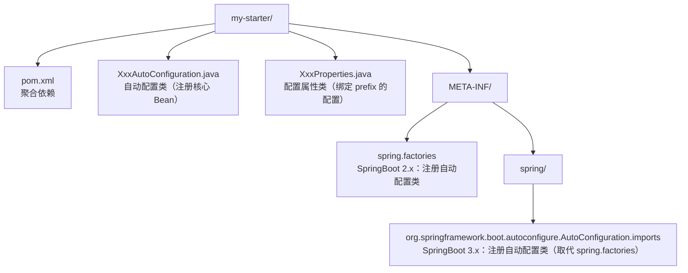
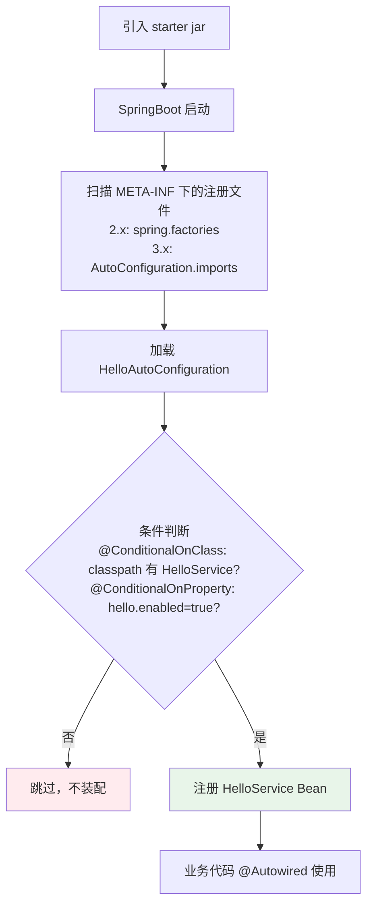
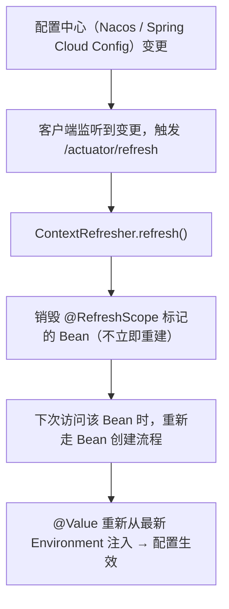

# SpringBoot Starter 与配置体系

> 📌 **一句话理解**：Starter 是「聚合依赖 + 自动配置」的打包；配置体系是「外部化配置 + 优先级覆盖 + 多环境 Profile」的一整套加载与注入机制。两者合力让 SpringBoot 实现「约定优于配置，开箱即用」。

---

## 核心概念

### 一、Starter 机制是什么 ⭐⭐

在 Spring（非 SpringBoot）时代，要用 Redis 得手写：引入 jedis 依赖、配连接池参数、写 `JedisConnectionFactory`、写 `RedisTemplate` Bean、拼一堆 XML。版本号要自己管，类要自己注册。SpringBoot 把这种重复劳动抽象成 **Starter**：**一个 Starter = 一组「聚合依赖 + 自动配置类」的打包**。引入一个坐标，对应功能就「开箱即用」。

**类比理解**：Starter 像家电的「套装套餐」--买「微波炉套餐」开箱即得到微波炉本体 + 电源线 + 食谱 + 保修卡，不用单买配件。SpringBoot 把功能相关依赖和配置一起打包好，你只要 `import` 坐标。

**Starter 解决的问题**：

| 痛点 | Starter 如何解决 |
|------|-----------------|
| 依赖版本冲突 | 官方 Starter 继承 `spring-boot-dependencies` BOM，版本统一 |
| 一堆 XML 配置 | 自动配置类用 `@Configuration` + `@Bean` 代替 XML |
| 手动判断该不该装配 | `@ConditionalOnXxx` 条件注解自动判断（classpath 有类才装配、有 Bean 才装配） |
| 配置项分散难记 | `@ConfigurationProperties` 把一组配置聚合成属性类 |

**Starter 的组成**：



> 💡 **底层原理一句话**：Starter 的本质是「jar 包 + 自动配置类的注册声明」。SpringBoot 启动时扫描 `META-INF` 下的注册文件，加载声明的 `AutoConfiguration` 类，再由 `@Conditional` 注解按条件装配 Bean。

---

### 二、Starter 命名规范 ⭐⭐

这是高频易错点，必须准确记忆。

| 类型 | 命名格式 | 示例 |
|------|----------|------|
| **官方 Starter** | `spring-boot-starter-{功能}` | `spring-boot-starter-web`<br>`spring-boot-starter-data-redis`<br>`spring-boot-starter-jdbc` |
| **第三方 Starter** | `{功能}-spring-boot-starter` | `mybatis-spring-boot-starter`<br>`druid-spring-boot-starter`<br>`pagehelper-spring-boot-starter` |

**为什么这样区分**：官方用 `spring-boot-starter-` 前缀作为「官方标识」--看到这个前缀就知道是 Spring 团队维护、版本经 `spring-boot-dependencies` 校验。第三方把 `spring-boot-starter` 放后面，避免给人「Spring 官方出品」的错觉。如果第三方也写成 `spring-boot-starter-mybatis`，会让人误以为是官方维护，出问题找官方背锅。

> ⚠️ **面试常踩的坑**：不少资料笔误写成 `spring-boot-starter-mybatis`，这是错的。MyBatis 是第三方，正确写法是 `mybatis-spring-boot-starter`。

---

### 三、自定义 Starter 完整步骤 ⭐⭐⭐

面试最高频的实操题。下面给一个**完整可运行**的例子：自定义 `hello-spring-boot-starter`，配置 `hello.prefix`，启动时调用 `HelloService.sayHello("World")` 打印问候。

#### 步骤 1：写配置属性类

```java
package com.example.hello;

import org.springframework.boot.context.properties.ConfigurationProperties;

// 把 hello.* 配置项绑定到这个类的字段
@ConfigurationProperties(prefix = "hello")
public class HelloProperties {
    private String prefix = "Hello";
    private String suffix = "!";
    private boolean enabled = true;

    // getter / setter 必须有，绑定靠 setter 注入
    public String getPrefix() { return prefix; }
    public void setPrefix(String prefix) { this.prefix = prefix; }
    public String getSuffix() { return suffix; }
    public void setSuffix(String suffix) { this.suffix = suffix; }
    public boolean isEnabled() { return enabled; }
    public void setEnabled(boolean enabled) { this.enabled = enabled; }
}
```

#### 步骤 2：写业务类（被自动装配的核心 Bean）

```java
package com.example.hello;

public class HelloService {
    private final HelloProperties properties;
    public HelloService(HelloProperties properties) { this.properties = properties; }
    public String sayHello(String name) {
        return properties.getPrefix() + ", " + name + properties.getSuffix();
    }
}
```

#### 步骤 3：写自动配置类

```java
package com.example.hello;

import org.springframework.boot.autoconfigure.condition.ConditionalOnClass;
import org.springframework.boot.autoconfigure.condition.ConditionalOnMissingBean;
import org.springframework.boot.autoconfigure.condition.ConditionalOnProperty;
import org.springframework.boot.context.properties.EnableConfigurationProperties;
import org.springframework.context.annotation.Bean;
import org.springframework.context.annotation.Configuration;

@Configuration
@EnableConfigurationProperties(HelloProperties.class)   // 开启属性绑定
@ConditionalOnClass(HelloService.class)                  // classpath 有 HelloService 才装配
@ConditionalOnProperty(                                  // hello.enabled 未设或为 true 才装配
    prefix = "hello", name = "enabled", havingValue = "true", matchIfMissing = true)
public class HelloAutoConfiguration {

    @Bean
    @ConditionalOnMissingBean                              // 容器里没有 HelloService 才装配（让用户可覆盖）
    public HelloService helloService(HelloProperties properties) {
        return new HelloService(properties);
    }
}
```

#### 步骤 4：注册自动配置类（**2.x vs 3.x 必须区分**）⭐⭐⭐

> ⚠️ 这是面试超高频的版本差异，务必答对。

**SpringBoot 2.x** -- `src/main/resources/META-INF/spring.factories`：

```properties
org.springframework.boot.autoconfigure.EnableAutoConfiguration=\
  com.example.hello.HelloAutoConfiguration
```

- key 固定是 `org.springframework.boot.autoconfigure.EnableAutoConfiguration`
- value 是自动配置类全限定名，多个用逗号分隔，行末用 `\` 换行

**SpringBoot 3.x** -- `src/main/resources/META-INF/spring/org.springframework.boot.autoconfigure.AutoConfiguration.imports`：

```
com.example.hello.HelloAutoConfiguration
```

- **没有 key=value，一行一个全限定类名**
- 文件路径变了：`META-INF/spring/` 下，文件名固定
- 旧的 `spring.factories` 在 3.x **不再用于注册自动配置类**（仅保留用于 `ApplicationListener`、`ApplicationContextInitializer` 等少数场景）

> ⚠️ **为什么 3.x 要换**：旧机制是「全文件扫描」--所有 `AutoConfiguration` 类名要先读到内存再解析 key-value。3.x 改用独立 `.imports` 文件，SpringBoot 直接读列表，**省去解析开销，启动更快**。新机制还能配合 `@AutoConfigureBefore/After/Order` 排序更可控。

#### 步骤 5：（可选）控制加载顺序 + 打包引用

```java
@AutoConfigureAfter(DataSourceAutoConfiguration.class)   // 在某个自动配置之后加载
@AutoConfigureBefore(RedisAutoConfiguration.class)        // 在某个自动配置之前加载
public class HelloAutoConfiguration { ... }
```

打包后，使用方在 `pom.xml` 引入：

```xml
<dependency>
    <groupId>com.example</groupId>
    <artifactId>hello-spring-boot-starter</artifactId>
    <version>1.0.0</version>
</dependency>
```

`application.yml` 配置：

```yaml
hello:
  prefix: 你好
  suffix: ~
```

使用：

```java
@RestController
public class DemoController {
    @Autowired
    private HelloService helloService;   // 自动装配进来

    @GetMapping("/hi")
    public String hi() {
        return helloService.sayHello("World");   // 输出：你好, World~
    }
}
```

**完整流程图**：



---

### 四、配置文件：properties vs YAML ⭐⭐

SpringBoot 默认支持两种配置文件格式，两者可并存（同名时 `.properties` 优先级高于 `.yml`，但**不推荐并存**）。

#### 4.1 两种格式对比

```properties
# application.properties
server.port=8080
spring.redis.host=localhost
spring.redis.port=6379
spring.redis.pool.max-active=8
```

```yaml
# application.yml
server:
  port: 8080
spring:
  redis:
    host: localhost
    port: 6379
    pool:
      max-active: 8
```

#### 4.2 优缺点对比

| 维度 | properties | YAML |
|------|-----------|------|
| 可读性 | 一般，前缀重复多 | 好，层级清晰，类似 JSON |
| 支持 List/Map | 不直观（`list[0]=x`） | 直观（`- item`、`{key: value}`） |
| 缩进敏感性 | 不敏感 | 敏感，错一个空格就解析错 |
| `@PropertySource` 加载 | ✅ 支持 | ❌ **默认不支持**（见下文） |
| 多文档（多 Profile） | 不支持，必须拆多个文件 | ✅ 用 `---` 分隔 |

> ⚠️ **高频易错点**：`@PropertySource` **默认只支持 `.properties`**，不能直接加载 `.yml`。想加载 YAML 要自定义 `PropertySourceFactory`（基于 `YamlPropertiesFactoryBean`）。

```java
// 默认只能加载 .properties
@PropertySource("classpath:config.properties")

// 想加载 .yml 要自定义工厂：
@PropertySource(value = "classpath:config.yml", factory = YamlPropertySourceFactory.class)
```

#### 4.3 YAML 多文档（Multi-Document）

YAML 支持在一个文件里用 `---` 分隔多个文档，每个文档可绑定不同 Profile：

```yaml
# 默认文档（无 Profile 激活时生效）
server:
  port: 8080

---
# dev profile 激活时生效
spring:
  config:
    activate:
      on-profile: dev
server:
  port: 8081

---
# prod profile 激活时生效
spring:
  config:
    activate:
      on-profile: prod
server:
  port: 80
```

> ⚠️ **版本差异**：SpringBoot **2.4 之前**用 `spring.profiles: dev`；**2.4 起**改用 `spring.config.activate.on-profile: dev`。旧写法在 2.4 仍兼容但已弃用，**3.x 彻底移除**。面试答新语法即可。

---

### 五、配置加载优先级 ⭐⭐⭐

SpringBoot 配置体系**最高频面试题**，必须把优先级顺序答对。

**核心三句话记忆法**：

1. **外部优先于内部**（jar 包外 > jar 包内）
2. **`config/` 目录优先于根目录**（jar 同级 `config/` 子目录 > jar 同级根目录）
3. **Profile 优先于非 Profile**（`application-{profile}.yml` 覆盖 `application.yml`）

**完整优先级表（高 -> 低）**：

| 优先级 | 来源 | 示例 |
|--------|------|------|
| 1 | **命令行参数** | `java -jar app.jar --server.port=8080` |
| 2 | **SPRING_APPLICATION_JSON** | 环境变量 `SPRING_APPLICATION_JSON='{"server":{"port":8080}}'` |
| 3 | **ServletConfig / ServletContext** 初始化参数 | Web 容器启动参数 |
| 4 | **JNDI 属性** | `java:comp/env/...` |
| 5 | **Java 系统属性** | `-Dserver.port=8080` |
| 6 | **OS 环境变量** | `SERVER_PORT=8080`（下划线会被宽松映射） |
| 7 | **`RandomValuePropertySource`** | `random.*` 随机值 |
| 8 | **jar 外 `application-{profile}.yml`**（`config/` > jar 同级根） | `./config/application-dev.yml` |
| 9 | **jar 内 `application-{profile}.yml`**（`classpath:/config/` > `classpath:/`） | jar 内 `config/application-dev.yml` |
| 10 | **jar 外 `application.yml`**（`config/` > jar 同级根） | `./config/application.yml` |
| 11 | **jar 内 `application.yml`**（`classpath:/config/` > `classpath:/`） | jar 内 `application.yml` |
| 12 | **`@PropertySource`** 注解 | `@PropertySource("classpath:xxx.properties")` |
| 13 | **默认值** | `SpringApplication.setDefaultProperties()` 设的 |

**实际场景举例**：

- 开发本地：jar 内 `application.yml` 配 `port: 8080`
- 测试环境部署：jar 丢到 `/opt/app/`，同级放 `application.yml` 配 `port: 9090` -> 启动是 9090（外部覆盖内部）
- 线上紧急改端口不改包：`java -jar app.jar --server.port=7070` -> 命令行最高，覆盖一切

> 💡 **面试金句**：SpringBoot 配置体系的设计哲学是「**外部化配置优先**」--线上运维不重新打包就能改配置。命令行 > 环境变量 > 外部文件 > 内部文件 > 默认值，每一层都是为了让不同角色（开发、运维、紧急情况）能在不同层级覆盖配置。

---

### 六、Profile 多环境 ⭐⭐

实际开发有 dev / test / prod 多套环境，SpringBoot 用 **Profile** 隔离配置。

#### 6.1 命名约定

```
application.yml            # 公共配置（所有环境都加载）
application-dev.yml        # dev 环境特有
application-test.yml       # test 环境特有
application-prod.yml       # prod 环境特有
```

加载规则：**`application.yml` 一定加载 + 激活的 `application-{profile}.yml` 加载**。profile 文件覆盖公共文件的同名 key。

#### 6.2 激活 Profile 的方式

| 方式 | 示例 | 优先级 |
|------|------|--------|
| 配置文件激活 | `application.yml` 写 `spring.profiles.active=dev` | 低 |
| 命令行激活 | `java -jar app.jar --spring.profiles.active=prod` | 高 |
| 环境变量激活 | `export SPRING_PROFILES_ACTIVE=prod` | 中 |
| JVM 参数 | `-Dspring.profiles.active=prod` | 中 |

> 💡 **生产实践**：线上用环境变量 `SPRING_PROFILES_ACTIVE=prod`，CI/CD 部署时注入，比命令行参数更不容易在 `ps` 里被看到、更安全。

#### 6.3 SpringBoot 2.4+ 的 Profile 变更

| 旧（2.3 及以前） | 新（2.4+，3.x 必须） |
|------------------|---------------------|
| 多文档 YAML：`spring.profiles: dev` | 多文档 YAML：`spring.config.activate.on-profile: dev` |
| `spring.profiles.include: xxx` 直接 include | 推荐用 `spring.profiles.group` 定义 profile 组 |
| `spring.profiles.active` 可写在 multi-document 文档里 | 不能写在被 `on-profile` 激活的文档里，避免循环依赖 |

#### 6.4 默认 Profile

```yaml
spring:
  profiles:
    default: dev    # 没指定 active 时，用 dev 兜底
```

注意 `default` 和 `active` 的区别：`active` 是显式激活的；`default` 是「没有任何激活时兜底用的」。

---

### 七、配置注入三种方式对比 ⭐⭐⭐

核心对比题。SpringBoot 提供三种方式把配置值注入到代码里。

#### 7.1 @Value（单值注入）

```java
@Component
public class MyBean {
    @Value("${server.port}")              // 直接注入
    private int port;

    @Value("${app.name:defaultApp}")      // 支持默认值（冒号后是默认值）
    private String appName;

    @Value("#{2 * 3600}")                // 支持 SpEL
    private int twoHoursInSeconds;

    @Value("${app.description}")          // ⚠️ 不支持松散绑定：必须用配置里的精确 key
    private String description;
}
```

#### 7.2 @ConfigurationProperties（批量绑定）

```java
@Component
@ConfigurationProperties(prefix = "app")
@Validated                                // 开启 JSR303 校验
public class AppProperties {
    @NotBlank
    private String name;                  // app.name

    private String description;           // app.description
    private int port = 8080;              // 默认值
    private List<String> servers;         // app.servers[0]=x  或 YAML list
    private Map<String, String> mapping;  // app.mapping.key=value
    private String myName;                // app.my-name 松散绑定到 myName
    // getter / setter 必须
}
```

配合 YAML：

```yaml
app:
  name: my-app
  description: 示例
  port: 9090
  servers:
    - server1
    - server2
  mapping:
    key1: value1
  my-name: Alice   # 松散绑定到 myName
```

#### 7.3 Environment（编程式读取）

```java
@Component
public class EnvReader {
    @Autowired
    private Environment env;

    public void print() {
        String port = env.getProperty("server.port");
        String name = env.getProperty("app.name", "default");  // 带默认值
        String[] activeProfiles = env.getActiveProfiles();
    }
}
```

#### 7.4 三种方式对比表

| 维度 | @Value | @ConfigurationProperties | Environment |
|------|--------|--------------------------|-------------|
| 注入方式 | 字段注入，单值 | 批量绑定到对象 | 编程式 `getProperty()` |
| 松散绑定 | ❌ 不支持 | ✅ 支持 | ❌ 不支持 |
| SpEL | ✅ 支持 `#{...}` | ❌ 不支持 | ❌ 不支持 |
| 默认值 | ✅ `:` 分隔 | ✅ 字段初始值 | ✅ 第二参数 |
| Map/List 绑定 | ❌ 麻烦 | ✅ 原生支持 | ❌ 麻烦 |
| JSR303 校验 | ❌ 不支持 | ✅ 配合 `@Validated` | ❌ 不支持 |
| IDE 配置提示 | ❌ 无 | ✅ 配合 metadata json | ❌ 无 |
| 热刷新 | ❌ 不支持（启动时注入一次） | ✅ 配合 `ContextRefresher` | ✅ 读时获取最新 |
| 使用场景 | 单值、简单场景 | 一组相关配置批量绑定 | 运行时动态读取、不确定 key |

> 💡 **使用建议**：配置项 ≥3 个且语义相关 -> `@ConfigurationProperties`；只读一两个简单值 -> `@Value` 够用；key 运行时才知道 / 需要遍历所有 -> `Environment`。

---

### 八、松散绑定（Relaxed Binding）⭐

**松散绑定**：配置 key 用 `kebab-case`（小写连字符），Java 字段用 `camelCase`（驼峰），SpringBoot 自动映射。**只对 `@ConfigurationProperties` 生效**。

**规则**（针对 `@ConfigurationProperties`）：

| 配置 key 写法 | Java 字段 | 是否能绑定 |
|---------------|-----------|-----------|
| `app.my-name`（kebab-case，**推荐**） | `myName` | ✅ |
| `app.myName`（camelCase） | `myName` | ✅（不推荐） |
| `app.my_name`（snake_case） | `myName` | ✅（不推荐） |
| `app.MY_NAME`（大写） | `myName` | ✅（不推荐） |

**推荐做法**：配置文件里统一用 **kebab-case**（`my-name`），Java 字段用 **camelCase**（`myName`）。

> ⚠️ **易错点**：松散绑定**只对 `@ConfigurationProperties` 生效**，`@Value("${app.my-name}")` 注入到 `myName` 字段，**字段名随意，但 `${...}` 里的 key 必须是配置文件里的精确 key**。不要误以为 `@Value` 也支持「配置写 `app.my-name`，`@Value` 写 `app.myName`」。

---

### 九、配置热刷新 ⭐

普通 `@Value` 和 `@ConfigurationProperties` 在 Bean 创建时一次性注入，配置文件改了**不会自动生效**。要实现「配置变更，Bean 自动更新」需要额外机制。

#### 9.1 @ConfigurationProperties + ContextRefresher

`@ConfigurationProperties` 类本身是「读时获取」--配合 Spring Cloud 的 `ContextRefresher`，触发 `refresh` 时会重新从 Environment 读取并绑定到字段。**默认支持热更新**，无需额外注解。

#### 9.2 @RefreshScope（配合 Spring Cloud Config / Nacos）

普通 `@Component` / `@Service` 里的 `@Value` 字段不会热更新。要给这种 Bean 加 `@RefreshScope`：

```java
@Service
@RefreshScope                   // 关键注解
public class OrderService {
    @Value("${order.timeout}")
    private int timeout;        // 配置中心改了，自动重新注入
}
```

**原理**：



**核心机制**：`@RefreshScope` 让 Spring 给这个 Bean 生成一个 **CGLIB 代理**，代理内部持有一个「目标 Bean 引用」。refresh 时把目标引用销毁，下次调用代理方法时**懒加载重建**目标 Bean，重建过程中 `@Value` 会读到最新配置。

> 💡 **面试金句**：`@RefreshScope` 的本质是「**代理 + 懒重建**」--配置变更时销毁旧 Bean，下次访问时才重建。所以**不是立即生效，而是「下次访问时生效」**。这是区分背题与理解的标志。

---

## 常见面试题

### 1. 什么是 SpringBoot 的 Starter？如何自定义一个 Starter？

**回答思路**：先讲 Starter 是什么、解决什么；再分步骤讲自定义流程；最后强调 2.x/3.x 的注册差异。

> **Starter** 是 SpringBoot 的「聚合依赖 + 自动配置类」打包机制。引入一个 Starter 坐标，就能把某功能（Web、Redis、MyBatis）开箱即用，省去手动管理依赖版本和写 XML。
>
> **自定义步骤**：
> 1. 写配置属性类 `XxxProperties`，用 `@ConfigurationProperties(prefix="xxx")` 绑定一组配置；
> 2. 写业务类 `XxxService`；
> 3. 写自动配置类 `XxxAutoConfiguration`，用 `@Configuration` + `@EnableConfigurationProperties` + `@ConditionalOnClass`/`@ConditionalOnProperty` 等条件注解控制装配；
> 4. 在 `META-INF` 下注册自动配置类：**2.x** 写 `spring.factories`，key 为 `EnableAutoConfiguration`；**3.x** 写 `META-INF/spring/org.springframework.boot.autoconfigure.AutoConfiguration.imports`，一行一个类名；
> 5. （可选）用 `@AutoConfigureBefore/After` 控制加载顺序；
> 6. 打包后被其他工程引入即生效。

---

### 2. 官方 Starter 和第三方 Starter 命名有什么区别？为什么这样规定？

**回答思路**：先给两种格式，再解释原因（避免与官方混淆）。

> - **官方 Starter**：`spring-boot-starter-{功能}`，如 `spring-boot-starter-web`、`spring-boot-starter-data-redis`。
> - **第三方 Starter**：`{功能}-spring-boot-starter`，如 `mybatis-spring-boot-starter`、`druid-spring-boot-starter`。
>
> **原因**：避免第三方 Starter 给人「Spring 官方出品」的错觉。官方统一用 `spring-boot-starter-` 前缀作为「官方标识」，质量有 Spring 团队背书；第三方把 `spring-boot-starter` 放后面，让用户一眼看出这是社区/第三方维护。如果第三方也写成 `spring-boot-starter-mybatis`，会让人误以为是官方维护，出问题找官方背锅。

---

### 3. SpringBoot 配置文件加载优先级？（高频）

**回答思路**：先给核心三句话原则，再列优先级表。

> **核心三原则**：① 外部优先于内部（jar 外 > jar 内）；② `config/` 目录优先于根目录；③ Profile 优先于非 Profile。
>
> 从高到低：
> 1. **命令行参数**（`--server.port=8080`）
> 2. **SPRING_APPLICATION_JSON** 环境变量
> 3. **ServletConfig / ServletContext** 初始化参数
> 4. **JNDI** 属性
> 5. **Java 系统属性**（`-Dserver.port=8080`）
> 6. **OS 环境变量**（`SERVER_PORT=8080`）
> 7. **`random.*`** 随机值
> 8. **jar 外 `application-{profile}.yml`**（`config/` > jar 同级根目录）
> 9. **jar 内 `application-{profile}.yml`**（`classpath:/config/` > `classpath:/`）
> 10. **jar 外 `application.yml`**（`config/` > jar 同级根目录）
> 11. **jar 内 `application.yml`**（`classpath:/config/` > `classpath:/`）
> 12. **`@PropertySource`** 注解
> 13. **默认值**（`SpringApplication.setDefaultProperties`）
>
> 设计哲学是「外部化优先」--运维不重新打包就能改配置，紧急情况用命令行参数覆盖一切。

---

### 4. @Value 和 @ConfigurationProperties 有什么区别？分别什么场景用？

**回答思路**：对比表格 + 场景建议。

> | 维度 | @Value | @ConfigurationProperties |
> |------|--------|--------------------------|
> | 注入方式 | 单值字段注入 | 批量绑定到对象 |
> | 松散绑定 | ❌ 不支持 | ✅ 支持 |
> | SpEL | ✅ 支持 `#{...}` | ❌ 不支持 |
> | Map/List | ❌ 麻烦 | ✅ 原生支持 |
> | JSR303 校验 | ❌ | ✅ 配合 `@Validated` |
> | IDE 提示 | ❌ | ✅ 配合 metadata json |
> | 热刷新 | ❌ | ✅（配合 ContextRefresher） |
>
> **场景**：配置项 ≥3 个且语义相关（如数据库连接配置）-> `@ConfigurationProperties`，结构清晰、可校验、可热刷新；只读一两个简单值 -> `@Value` 足够；需要 SpEL 计算（`#{2 * 3600}`）-> `@Value`。

---

### 5. YAML 相对于 properties 有什么优缺点？

**回答思路**：先说优点（层级、列表、多文档），再强调两个坑（@PropertySource、缩进敏感）。

> **优点**：
> 1. **层级清晰**，类似 JSON，前缀不重复；
> 2. **原生支持 List/Map**（`- item` 和 `{key: value}`），properties 要写 `list[0]=x` 不直观；
> 3. **支持多文档**，一个文件用 `---` 分隔多个 Profile，不必拆多个文件；
> 4. 可读性好，适合配置项多的场景。
>
> **缺点/坑**：
> 1. **缩进敏感**，错一个空格就解析错，IDE 有时也不好提示；
> 2. **`@PropertySource` 默认不能加载 YAML**，只能加载 `.properties`，要加载 YAML 必须自定义 `PropertySourceFactory`（基于 `YamlPropertiesFactoryBean`）；
> 3. 冒号后面必须有空格（`key: value` 而非 `key:value`），否则解析失败。

---

### 6. 什么是 Profile？怎么实现多环境配置？

**回答思路**：先讲 Profile 是什么，再讲文件命名、激活方式、2.4+ 语法变化。

> **Profile** 是 SpringBoot 的多环境隔离机制，让 dev / test / prod 各有独立配置。
>
> **实现方式**：
> 1. **文件命名**：`application.yml`（公共）+ `application-{profile}.yml`（环境特有，如 `application-dev.yml`、`application-prod.yml`）。profile 文件覆盖公共文件的同名 key。
> 2. **激活方式**（优先级从高到低）：命令行 `--spring.profiles.active=prod`、环境变量 `SPRING_PROFILES_ACTIVE=prod`、JVM 参数 `-Dspring.profiles.active=prod`、配置文件 `spring.profiles.active=dev`。
> 3. **默认 Profile**：`spring.profiles.default=dev`，没有显式激活时兜底。
> 4. **多文档 YAML**（2.4+）：用 `spring.config.activate.on-profile: dev` 标记文档所属 profile（**3.x 必须用新语法**，旧语法 `spring.profiles: dev` 已移除）。
>
> **生产实践**：用环境变量 `SPRING_PROFILES_ACTIVE=prod` 激活，CI/CD 部署时注入，避免在配置文件里硬编码环境。

---

### 7. 配置如何热刷新？@RefreshScope 的原理？

**回答思路**：分两层回答--@ConfigurationProperties 默认支持；普通 @Value 要 @RefreshScope，再讲代理原理。

> **两种情况**：
>
> 1. **`@ConfigurationProperties` 类**：本身在 refresh 时会被重新绑定，**默认支持热更新**，配合 `ContextRefresher` 即可。
>
> 2. **普通 `@Component` / `@Service` 里的 `@Value`**：Bean 创建时一次性注入，配置改了不会自动生效。需要加 `@RefreshScope`，配合 Spring Cloud Config / Nacos 实现热刷新。
>
> **`@RefreshScope` 原理**：
> - Spring 给 `@RefreshScope` 标记的 Bean 生成一个 **CGLIB 代理**，代理内部持有「目标 Bean 引用」；
> - 配置中心变更时触发 `ContextRefresher.refresh()`，**销毁旧目标 Bean**（不立即重建）；
> - 下次访问该 Bean 时，代理**懒加载重建**目标 Bean，重建过程中 `@Value` 从最新 Environment 注入；
> - **效果是「下次访问时生效」，不是「立即生效」**。
>
> 关键点：本质是「代理 + 懒重建」，不是「字段原地更新」。

---

### 8. 松散绑定是什么？

**回答思路**：先讲定义，给例子，再强调 @Value 不支持。

> **松散绑定（Relaxed Binding）** 是 `@ConfigurationProperties` 的特性：配置文件 key 用 `kebab-case`（如 `app.my-name`），Java 字段用 `camelCase`（如 `myName`），SpringBoot 自动映射。`kebab-case` / `camelCase` / `snake_case` / `UPPER_CASE` 都能映射到同一字段，但**官方推荐配置文件统一用 kebab-case**。
>
> **易错点**：松散绑定**只对 `@ConfigurationProperties` 生效**。`@Value("${app.my-name}")` 注入到 `myName` 字段是**不行的**--`@Value` 必须用配置文件里精确的 key。
>
> ```yaml
> app:
>   my-name: Alice     # kebab-case
> ```
> ```java
> @ConfigurationProperties(prefix = "app")
> public class AppProperties {
>     private String myName;   // ✅ 松散绑定成功
> }
>
> @Component
> public class OtherBean {
>     @Value("${app.my-name}")   // ✅ 用配置里的精确 key
>     private String myName;     // ⚠️ 字段名随意，但 @Value 的 key 必须精确
> }
> ```

---

## 本章学习建议

1. **先理解 Starter 的本质**：它不是什么黑科技，就是「jar + 自动配置类 + 注册声明」。把第三章的 `hello-spring-boot-starter` 例子动手敲一遍，跑通了再去看官方源码（如 `RedisAutoConfiguration`），会发现套路完全一样。
2. **死磕配置优先级表**：面试必考。自己做个实验--jar 内 `application.yml` 写 `port: 8080`，jar 同级放 `application.yml` 写 `port: 9090`，命令行加 `--server.port=7070`，依次验证优先级。
3. **2.x vs 3.x 的注册差异要分清**：很多人卡在这。一句话记忆--「2.x 用 `spring.factories` 的 key=value，3.x 用 `.imports` 文件的一行一类名」。项目用 3.x 还写 `spring.factories`，自动配置类根本不会被加载。
4. **`@Value` vs `@ConfigurationProperties` 对比表要会默写**：尤其是松散绑定、JSR303 校验、热刷新这三项差异，是面试官最爱追问的点。
5. **多文档 YAML 的语法演进**：知道 2.4 是分水岭，3.x 完全用 `spring.config.activate.on-profile`。回答时答新语法，但提一句「2.4 之前是 `spring.profiles`」，显示你了解演进。
6. **`@RefreshScope` 原理要会画图**：「代理 + 懒重建」是核心，回答时强调「下次访问时生效」而非「立即生效」，这是区分背题与理解的标志。

> 💡 **学习心法**：SpringBoot 配置体系的所有设计都围绕一句话--**「约定优于配置，外部化优于内部」**。理解了这句话，优先级表、Profile、热刷新都是它的自然推论。面试时如果记不清某个细节，回到这个原则推导，往往能自圆其说。

---

## 资料勘误与重点提醒

> 对照官方文档与业界共识校正的常见错误/遗漏点。

1. **`spring.factories` 在 SpringBoot 3.x 不能再注册自动配置类**：网上很多教程仍写 `spring.factories`，在 3.x 项目里**完全不生效**。3.x 必须用 `META-INF/spring/org.springframework.boot.autoconfigure.AutoConfiguration.imports`，一行一个类名，没有 key=value。注意 `spring.factories` 文件本身在 3.x 仍用于注册 `ApplicationListener`、`ApplicationContextInitializer` 等，只是 `EnableAutoConfiguration` 这个 key 被移除。

2. **配置优先级「profile > 非 profile」要结合「外部 > 内部」一起看**：先按「外部 vs 内部」分层，同一层内 profile 覆盖非 profile。准确顺序：`jar 外 application-dev.yml` > `jar 外 application.yml` > `jar 内 application-dev.yml` > `jar 内 application.yml`。

3. **`@PropertySource` 默认不支持 YAML**：常被错误地说成「支持」。准确说法是默认只支持 `.properties`，加载 YAML 要自定义 `PropertySourceFactory`（基于 `YamlPropertiesFactoryBean`）。

4. **`@Value` 不支持松散绑定**：`@Value("${app.my-name}")` 注入到 `myName` 字段--字段名随意，但 `${...}` 里的 key 必须是配置文件里的精确 key。不要误以为 `@Value` 也支持「配置写 `app.my-name`，`@Value` 写 `app.myName`」。

5. **SpringBoot 2.4 是 Profile 语法的分水岭**：旧 `spring.profiles: dev` 已弃用，3.x 彻底移除；新语法 `spring.config.activate.on-profile: dev`。2.4 还引入 `spring.profiles.group` 定义 profile 组。回答时答新语法，并主动提一句「2.4 之前是旧语法」，显示知识广度。

6. **`@RefreshScope` 不是「立即生效」**：refresh 时**销毁旧 Bean，下次访问时懒重建**，所以是「下次访问时生效」。若该 Bean 长时间不被访问，配置不会刷新。回答时强调这点，是区分背题与理解的标志。

7. **YAML 同名时 `.properties` 优先级高于 `.yml`**：同目录下两者并存，`.properties` 覆盖 `.yml` 同名 key，但**不推荐并存**。另外环境变量 `SERVER_PORT` 会被宽松映射到 `server.port`（OS 环境变量不允许小写点号的兼容设计），但配置文件里仍推荐 `server.port` 规范写法。
