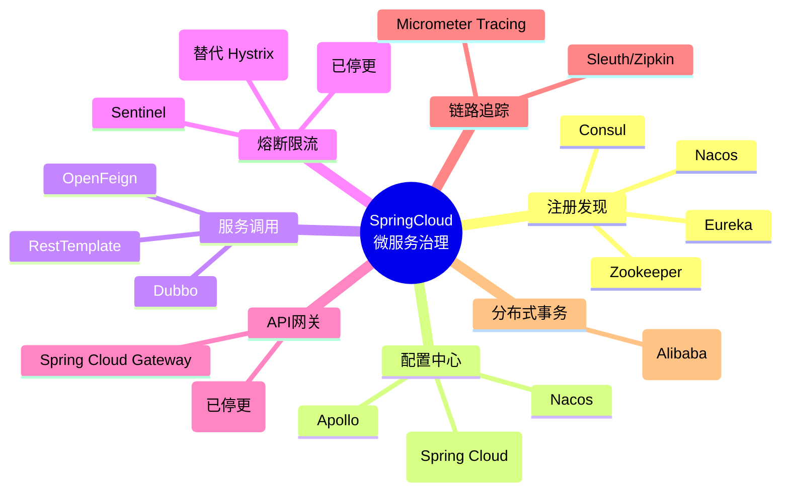
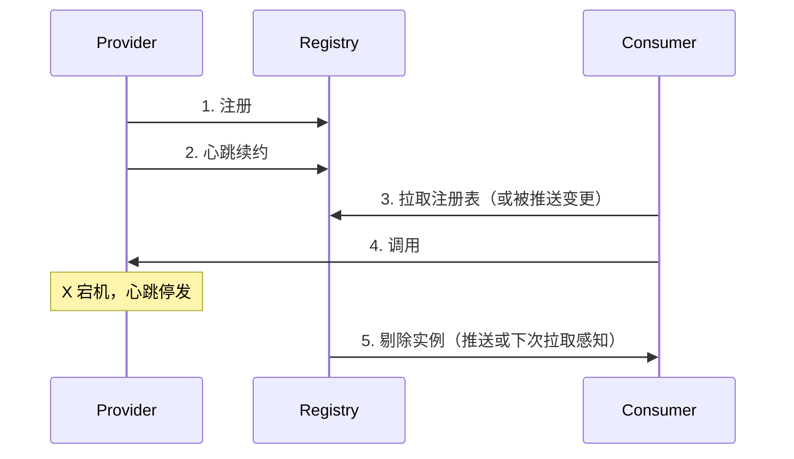
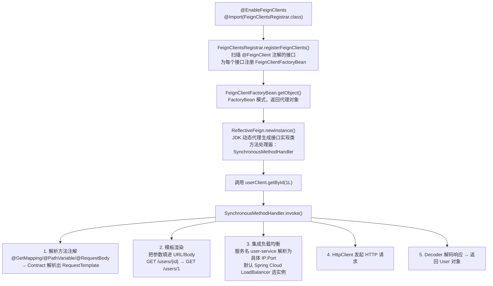
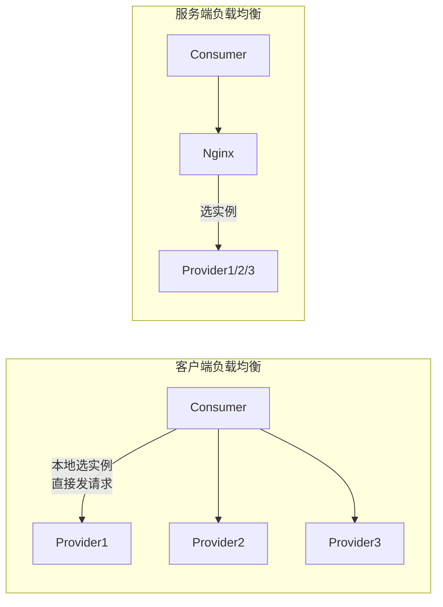

# SpringCloud 微服务 - 注册发现与服务调用

> 📌 **一句话理解**：SpringCloud 是给 SpringBoot 单体服务之间「装治理套件」的全家桶——谁上线了、谁能调谁、调不动了怎么办，统统归它管。

---

## 核心概念

### 一、SpringCloud 是什么 ⭐⭐

#### 1.1 定位：微服务治理全家桶

SpringBoot 解决的是**单个服务**怎么快速开发（自动配置、起步依赖、内嵌容器）；SpringCloud 解决的是**多个服务之间**怎么协作治理。

打个比方：

- SpringBoot 像造一辆车——发动机、底盘、内饰一应俱全，能开。
- SpringCloud 像交管系统——给每辆车发车牌（注册）、给司机发地图（发现）、装红绿灯和限速（熔断限流）、设交警指挥（网关）、装行车记录仪（链路追踪）。

SpringCloud 本身**不重新造轮子**，而是把各家的微服务组件（Netflix、Alibaba、VMware Tanzu 等）统一用 SpringBoot 风格封装一遍，提供一致的编程模型和配置方式。

#### 1.2 与 SpringBoot 的关系

| 维度 | SpringBoot | SpringCloud |
|------|-----------|-------------|
| 关注点 | 单服务快速开发 | 多服务协作治理 |
| 依赖关系 | 独立可用 | **依赖 SpringBoot**（先有 Boot 才有 Cloud） |
| 版本对应 | 3.2.x | 2023.0.x |
| 解决问题 | 自动装配、内嵌容器、起步依赖 | 注册发现、配置、网关、熔断、链路追踪、分布式事务 |

#### 1.3 版本命名演变（高频易错点）⭐⭐

SpringCloud 的版本号经历过一次重大变化，**面试常考，资料常错**：

**阶段一：伦敦地铁站名（2013 ~ 2020）**

按字母顺序依次命名，称为 **Release Train（发布列车）**：

```
Angel → Brixton → Camden → Dalston → Edgware → Finchley
      → Greenwich → Hoxton
```

每个字母对应一个伦敦地铁站名，按字母序往后推。如 `Finchley` 对应 SpringBoot 2.0.x，`Hoxton` 对应 SpringBoot 2.2.x/2.3.x。

**阶段二：日历版本（2020.0+ 至今）**

从 2020.0.0 起，改为 **`YYYY.MINOR.X`** 的日历化命名（类似 Ubuntu），与 SpringBoot 大版本对齐：

| SpringCloud | SpringBoot |
|-------------|-----------|
| 2020.0.x | 2.4.x / 2.5.x |
| 2021.0.x | 2.6.x / 2.7.x |
| 2022.0.x | 3.0.x / 3.1.x |
| 2023.0.x | 3.2.x / 3.3.x |

> ⚠️ **勘误点**：很多老资料还在讲「伦敦地铁站」是当前命名方式。实际上从 2020.0 起已经改成日历版本，地铁站名只在 2020.0 之前用过。

#### 1.4 核心组件全景



---

### 二、两大阵营与 Netflix 停更现状 ⭐⭐⭐

#### 2.1 两大阵营对照

| 阵营 | 注册中心 | 配置中心 | 网关 | 熔断限流 | 负载均衡 | RPC | 分布式事务 |
|------|---------|---------|------|---------|---------|-----|-----------|
| **Netflix** | Eureka | Archaius | Zuul | Hystrix | Ribbon | - | - |
| **Alibaba** | Nacos | Nacos | - | Sentinel | - | Dubbo | Seata |

补充：
- **SpringCloud 自家组件**：Spring Cloud Gateway（网关，替代 Zuul）、Spring Cloud LoadBalancer（替代 Ribbon）、Spring Cloud OpenFeign（声明式 HTTP）、Resilience4j（替代 Hystrix，实际是第三方但 SpringCloud 官方推荐）。
- **Alibaba 阵营**网关一般直接用 Spring Cloud Gateway，不重复造轮子。

#### 2.2 ⚠️ Netflix 组件停更现状（高频考点，资料最易错）

这是面试中最容易拉开差距的点，**务必准确**：

| 组件 | 现状 | 替代方案 |
|------|------|---------|
| **Eureka 2.x** | 计划搁置（2012~2015 年尝试，最终未发布） | Eureka 1.x 进入维护模式（可用但不再演进）；新项目用 **Nacos** |
| **Hystrix** | 2018 年起官方停止开发（进入维护模式，不再加新特性） | **Resilience4j** / **Sentinel** |
| **Ribbon** | Spring Cloud 官方宣布停更 | **Spring Cloud LoadBalancer**（2020.0+ 默认） |
| **Zuul 1.x** | 维护模式（基于 Servlet 同步 IO） | **Spring Cloud Gateway**（基于 Reactor 异步非阻塞） |
| **Zuul 2.x** | Netflix 内部用，**未集成进 SpringCloud** | 同上，转向 Spring Cloud Gateway |
| **Archaius** | 维护 | Spring Cloud Config / Nacos Config |

整体结论：**Spring Cloud Netflix 项目自 2019 年起整体进入维护模式**（maintenance mode），不再添加新特性，只修关键 Bug。SpringCloud 官方推荐迁移到 Spring Cloud LoadBalancer + Spring Cloud Gateway + Resilience4j 这套「新一代」组合，或直接采用 Spring Cloud Alibaba 全家桶。

> ⚠️ **勘误提醒**：大量老教程、老笔记、老视频仍把 Eureka/Hystrix/Zuul/Ribbon 当主流技术讲。面试时**一定要主动说出停更事实和替代方案**，体现对生态的时效性把握，这是加分项。但要注意分寸——不是说「学 Netflix 没用」，因为存量项目仍然大量在用，原理仍然要懂。

#### 2.3 选型建议

- **新项目**：Alibaba 全家桶（Nacos + Gateway + Sentinel + Seata + OpenFeign）最稳，社区活跃、文档全、国产化友好。
- **存量维护**：Netflix 老组件能不动就不动，逐步迁移。Ribbon→LoadBalancer 是迁移成本最低的一步（2020.0+ 直接默认换）。
- **学习顺序**：先懂 Netflix 原理（因为原理相通、面试高频），再学 Alibaba 组件（实战主流）。

---

### 三、服务注册发现 ⭐⭐⭐

#### 3.1 注册中心要解决的核心问题

微服务架构下，服务实例 IP:Port 是动态的（容器化部署更是频繁变化），不能写死在配置里。注册中心解决三件事：

1. **注册**：服务启动时把自己的地址告诉注册中心。
2. **发现**：消费方调用前从注册中心拿到可用实例列表。
3. **保活与剔除**：通过心跳确认实例还活着，挂了及时剔除。

打个比方：注册中心 = 黄页/通讯录。每个服务开机就去黄页登记自己，调用方查黄页找到对方，黄页定期检查谁失联了就划掉。



#### 3.2 Eureka（AP 模型）

##### 角色

- **Eureka Server**：注册中心集群，节点间 **peer-to-peer 复制**（无主从，所有节点平等）。
- **Eureka Client**：
  - **Provider**：启动注册 + 定时发心跳续约。
  - **Consumer**：定时拉取注册表 + 本地缓存。

##### 核心机制

| 机制 | 数值 | 说明 |
|------|------|------|
| 心跳续约 | Client 每 **30s** 一次 | 告诉 Server「我还活着」 |
| 剔除超时 | **90s** 没收到心跳 | Server 主动从注册表剔除 |
| 拉取注册表 | Consumer 默认 **30s** 一次 | 拉完缓存到本地 |
| 缓存失效感知 | 最多 30s 延迟 | 不是每次调用都问 Server，而是从本地缓存读 |

##### 自我保护机制 ⭐⭐⭐（高频考点）

**触发条件**：Eureka Server 在 **15 分钟**内心跳数低于阈值（默认 **85%**），自动进入「自我保护模式」。

**触发后的行为**：**不再剔除**任何实例（哪怕心跳已经停发很久）。

**为什么这么设计？**——这是 Eureka 设计哲学的精华：

- 心跳大量丢失，**可能是网络分区**（Server 收不到 Client 心跳，但 Client 其实还活着、还在被调用）。
- 如果此时剔除实例，Consumer 会以为这些服务下线，**误杀健康实例**，导致可用性下降。
- Eureka 是 **AP 系统**，宁可保留少量失效实例（让 Consumer 调用可能失败再重试），也不能贸然剔除可能健康的实例。

> 类比：消防系统误报时，宁可让警报多响一会儿让人撤离，也不能因为「可能误报」就关掉警报——错过真的火灾代价更大。Eureka 也是这个思路：宁可保留「可能死了」的实例，也不能误删「可能活着」的实例。

**关闭自我保护**（生产慎用）：

```yaml
eureka:
  server:
    enable-self-preservation: false   # 默认 true
    eviction-interval-timer-in-ms: 60000  # 清理过期实例的间隔
```

##### 为什么是 AP

- Eureka Server 节点间是 **peer-to-peer 复制**，**不强一致**。
- 网络分区时，各节点数据可能不一致，但**都能继续提供服务**（注册、查询都不阻塞）。
- 牺牲一致性（C），换可用性（A）。

> ⚠️ **勘误点**：很多老资料误把 Eureka 说成 CP 系统。**Eureka 是 AP**——这是它的核心设计目标，也是它和 Zookeeper/Consul 的本质区别。面试如果被问「Eureka 是 AP 还是 CP」，答 AP 并解释自我保护机制就是满分答案。

#### 3.3 Nacos（AP/CP 可切换）⭐⭐⭐

Nacos = Naming and Configuration Service，Alibaba 开源，**注册中心 + 配置中心二合一**。

##### 临时实例 vs 永久实例（核心区分）

Nacos 把实例分两类，**对应两种一致性协议**：

| 实例类型 | 健康检查方式 | 一致性协议 | 下线处理 |
|---------|------------|-----------|---------|
| **临时实例**（默认） | 客户端主动发心跳（5s 一次，15s 标记不健康，30s 删除） | **AP** —— Distro 协议 | 自动从注册表删除 |
| **永久实例** | 服务端主动探测（HTTP/TCP 探活） | **CP** —— Raft 协议 | 标记为不健康，**不删除** |

类比理解：
- 临时实例 = 合同工，没活干了自己走人（心跳停了就删）。
- 永久实例 = 在编员工，请假了也只是标「请假」（不健康），但人事档案还在（不删）。

默认是 **AP 模式**（临时实例），这和 Eureka 一致，也是大多数业务场景的选择。

##### 与 Eureka 的区别（高频面试题）

| 维度 | Eureka | Nacos |
|------|--------|-------|
| **CAP** | 只能 AP | AP / CP 可切换 |
| **变更感知** | 客户端轮询拉取（30s） | **服务端主动推送** + 客户端长轮询（实时性更好） |
| **健康检查** | 客户端心跳 | 临时实例心跳 / 永久实例服务端探测 |
| **一致性协议** | peer-to-peer 复制（无协议） | Distro（AP）/ Raft（CP） |
| **配置中心** | 不支持（需配 Spring Cloud Config） | **原生集成**，注册+配置一体 |
| **集群一致性** | 节点间最终一致（无主） | AP 模式每节点负责部分数据；CP 模式 Raft 选主 |
| **权重路由** | 不直接支持 | 支持实例权重、灰度发布 |

> 关键差异：**Nacos 推送 vs Eureka 拉取**。Eureka 消费方靠 30s 轮询拉取注册表，最多有 30s 感知延迟；Nacos 服务端在实例变更时主动推送给订阅者，毫秒级感知。

#### 3.4 Consul 与 Zookeeper（补充）

| 注册中心 | CAP | 协议 | 特点 |
|---------|-----|------|------|
| **Zookeeper** | CP | ZAB | 树形节点存储、强一致；当 Leader 挂掉选主期间**不可用**（不满足 A） |
| **Consul** | CP | Raft | HashiCorp 出品，支持**多数据中心**，自带健康检查，HTTP API |
| **Eureka** | AP | peer-to-peer | 心跳续约 + 自我保护，牺牲一致换可用 |
| **Nacos** | AP/CP | Distro/Raft | 临时 AP / 永久 CP，可切换 |

##### CAP 选择的业务含义

- **CP（Zookeeper/Consul）**：实例注册强一致。Leader 选举期间注册中心**不可用**，对一致性要求高（如金融账户）才选。
- **AP（Eureka/Nacos 默认）**：注册中心始终可用，允许短暂数据不一致。**互联网业务首选**——服务发现场景，宁可偶尔调到失效实例（重试即可），也不能注册中心挂掉导致全局不可用。

> 面试金句：注册中心**首选 AP**。因为注册中心挂了，整个微服务集群就废了；偶尔数据不一致，靠重试和熔断兜底就行。

---

### 四、服务调用 ⭐⭐

#### 4.1 RestTemplate + @LoadBalanced（基础方式）

最朴素的服务调用：用 RestTemplate 发 HTTP 请求，但服务名代替 IP:Port。

```java
@Configuration
public class RestConfig {

    @Bean
    @LoadBalanced   // 关键注解
    public RestTemplate restTemplate() {
        return new RestTemplate();
    }
}

@Service
public class OrderService {

    @Autowired
    private RestTemplate restTemplate;

    public User getUser(Long userId) {
        // 注意 URL 里的 user-service 是服务名，不是 IP
        return restTemplate.getForObject(
            "http://user-service/users/" + userId,
            User.class
        );
    }
}
```

##### 原理 ⭐⭐

`@LoadBalanced` 本质是一个 `@Qualifier`，给 RestTemplate 注入一个拦截器 `LoadBalancerInterceptor`：

```mermaid
graph TD
    R["RestTemplate 调用"] --> LI["LoadBalancerInterceptor.intercept()"]
    LI --> S1["1. 解析 URL：http://user-service/users/1<br/>→ 提取服务名 user-service"]
    S1 --> S2["2. 调用 LoadBalancerClient.choose(\"user-service\")<br/>→ 负载均衡选一个实例，如 192.168.1.10:8081"]
    S2 --> S3["3. 替换 URL：http://192.168.1.10:8081/users/1"]
    S3 --> S4["4. 转发给真正的 HTTP 客户端执行"]
```

2020.0+ 版本后，`LoadBalancerInterceptor` 默认走 **Spring Cloud LoadBalancer**（不是 Ribbon）。

#### 4.2 OpenFeign（声明式 HTTP，主流）⭐⭐⭐

##### 是什么

OpenFeign = **声明式 HTTP 客户端**。你只需要写一个接口 + 注解，Feign 自动帮你发 HTTP 请求、解析响应。

类比：OpenFeign 像给远程服务套个本地接口马甲——你调本地方法，它在底下偷偷帮你发 HTTP。

```java
@FeignClient(name = "user-service", path = "/users")
public interface UserClient {

    @GetMapping("/{id}")
    User getById(@PathVariable("id") Long id);

    @PostMapping
    User create(@RequestBody User user);
}

@Service
public class OrderService {

    @Autowired
    private UserClient userClient;   // 像调本地方法一样调远程

    public void createOrder(Order order) {
        User user = userClient.getById(order.getUserId());
        // ...
    }
}
```

启动类加 `@EnableFeignClients`：

```java
@SpringBootApplication
@EnableFeignClients
public class OrderApplication { }
```

##### 工作原理 ⭐⭐⭐



关键点：
- **JDK 动态代理**（不是 CGLIB），因为 FeignClient 是接口。
- **Contract** 解析 SpringMVC 注解（`@RequestMapping`/`@GetMapping`/`@PathVariable`/`@RequestBody`），所以 Feign 接口长得像 Controller 接口。
- **集成负载均衡**：默认 Spring Cloud LoadBalancer（2020.0+），低版本是 Ribbon。
- **可插拔**：Encoder/Decoder/Interceptor/Client 都可自定义（如改成 OkHttp、加请求头拦截器）。

##### OpenFeign vs Dubbo（高频对比）

| 维度 | OpenFeign | Dubbo |
|------|-----------|-------|
| **协议** | HTTP | TCP（默认 dubbo 协议，自定义二进制） |
| **序列化** | JSON | 默认 Hessian2，可换 Protobuf/Kryo 等 |
| **性能** | 一般（HTTP 文本协议开销大） | **更好**（TCP + 二进制序列化） |
| **声明式** | 是（接口 + 注解） | 是（接口 + 注解） |
| **生态** | 与 SpringCloud/HTTP 生态深度集成 | 自带完整 RPC 体系，可独立于 SpringCloud |
| **跨语言** | 友好（HTTP+JSON 跨语言通用） | 弱（默认协议需 Dubbo SDK） |
| **注册中心** | 任意（Nacos/Eureka/Consul） | 任意（Nacos/Zookeeper/Redis） |
| **典型场景** | SpringCloud 内部调用、跨语言调用 | 高 QPS 内部 RPC、对性能敏感的业务 |

> 选型口诀：**SpringCloud 内部调用首选 OpenFeign**（生态契合、调试方便）；**性能极致/历史存量选 Dubbo**（如电商交易核心链路）。Dubbo3 已支持 Triple 协议（基于 HTTP/2 + Protobuf），跨语言能力大幅提升，是未来趋势。

---

### 五、负载均衡 ⭐⭐

#### 5.1 客户端 vs 服务端负载均衡

| 维度 | 客户端负载均衡 | 服务端负载均衡 |
|------|--------------|--------------|
| **代表** | Ribbon / Spring Cloud LoadBalancer | Nginx / LVS / F5 |
| **位置** | Consumer 进程内 | 独立的代理层（在 Consumer 和 Provider 之间） |
| **实例列表来源** | 从注册中心拉取到本地缓存 | 自身维护 upstream 列表 |
| **决策者** | Consumer 自己选实例 | Nginx 选实例 |
| **额外开销** | 无（不需要独立部署） | 多一跳网络（Consumer → Nginx → Provider） |
| **典型场景** | 微服务内部互相调用 | 流量入口（外网 → 内网）、统一鉴权/限流入口 |

类比：
- 客户端 LB = 你自己翻通讯录挑人打电话。
- 服务端 LB = 你打给前台，前台帮你转接。



> 实际生产中**两者常配合使用**：外网入口用 Nginx 做流量分发和 SSL 卸载，内部服务间调用用 LoadBalancer。Nginx 不直接参与服务间调用（除非做网关）。

#### 5.2 Ribbon（已停更，但仍需懂原理）

Ribbon 是 Netflix 的客户端负载均衡器，曾经是 SpringCloud 默认 LB。

##### 核心组件

- `ILoadBalancer`：负载均衡器入口，维护实例列表。
- `IRule`：负载均衡策略。
- `IPing`：实例健康检查（默认 DummyPing，不检查，依赖注册中心心跳）。
- `ServerList`：从注册中心获取的实例列表（动态更新）。

##### 内置策略

| 策略类 | 名称 | 说明 |
|--------|------|------|
| `RoundRobinRule` | **轮询**（默认） | 按顺序轮流选 |
| `RandomRule` | 随机 | 随机选一个 |
| `WeightedResponseTimeRule` | 权重响应时间 | 响应越快权重越高 |
| `BestAvailableRule` | 最小并发 | 选并发数最小的实例 |
| `RetryRule` | 重试 | 轮询失败时重试其他实例 |
| `ZoneAvoidanceRule` | 区域感知 | 多机房场景，优先同 Zone |

##### 配置切换策略

```yaml
user-service:
  ribbon:
    NFLoadBalancerRuleClassName: com.netflix.loadbalancer.RandomRule
```

#### 5.3 Spring Cloud LoadBalancer（替代 Ribbon）⭐⭐

2020.0+ 起 SpringCloud **移除 Ribbon**，默认使用自家 Spring Cloud LoadBalancer。

##### 核心差异

| 维度 | Ribbon | Spring Cloud LoadBalancer |
|------|--------|--------------------------|
| **架构** | Netflix 自家一套 | 基于 Spring 生态，依赖 `Reactor` |
| **API 风格** | 命令式（Netflix 风格） | 响应式（Reactive） + 命令式 |
| **默认策略** | RoundRobin | RoundRobin |
| **可扩展性** | 通过 IRule | 实现 `ReactorLoadBalancer` 接口 |
| **维护状态** | 停更 | 持续演进 |

##### 自定义负载均衡策略

```java
public class CustomLoadBalancer implements ReactorLoadBalancer<ServiceInstance> {

    @Override
    public Mono<Response<ServiceInstance>> choose(Request request) {
        // 自定义选实例逻辑
        return Mono.just(new DefaultResponse(selectedInstance));
    }
}

@Configuration
public class LoadBalancerConfig {

    @Bean
    ReactorLoadBalancer<ServiceInstance> reactorServiceInstanceLoadBalancer(
            Environment environment, LoadBalancerClientFactory factory) {
        String serviceId = environment.getProperty(LoadBalancerClientFactory.PROPERTY_NAME);
        return new CustomLoadBalancer();
    }
}
```

> ⚠️ **2020.0+ 注意**：从 SpringCloud 2020.0 起，引入 `spring-cloud-starter-loadbalancer` 替代 Ribbon。如果项目里还残留 `spring-cloud-starter-netflix-ribbon`，必须排除掉，否则两者冲突。

#### 5.4 负载均衡策略选用建议

| 场景 | 推荐策略 | 原因 |
|------|---------|------|
| 实例配置相同、无状态服务 | RoundRobin（默认） | 简单均匀 |
| 实例配置不同（CPU/内存差异） | Weighted（权重） | 让强机器多干活 |
| 多机房部署 | ZoneAvoidance | 优先同 Zone，减少跨机房延迟 |
| 灰度发布 | 自定义（按版本号路由） | 按元数据版本分流 |
| 高 QPS + 长尾请求 | BestAvailable（最小并发） | 避免请求堆在慢实例 |

---

## 常见面试题

### 1. Eureka 和 Nacos 有什么区别？（高频）

**回答思路：** 从 CAP、变更感知、健康检查、功能定位四方面对比，并点出 Nacos 后发优势。

> ① **CAP 模型**：Eureka 只支持 AP；Nacos 支持 AP/CP 可切换（临时实例 AP，永久实例 CP，默认 AP）。
>
> ② **变更感知方式**：Eureka 客户端**定时轮询拉取**注册表（默认 30s），最多 30s 感知延迟；Nacos **服务端主动推送** + 客户端长轮询，毫秒级感知，实时性更好。
>
> ③ **健康检查**：Eureka 客户端心跳（30s 一次，90s 剔除）；Nacos 临时实例心跳（5s/15s/30s），永久实例服务端主动探测。
>
> ④ **功能定位**：Eureka 只是注册中心；Nacos 是**注册中心 + 配置中心二合一**，且支持权重路由、灰度发布、命名空间隔离等高级特性。
>
> ⑤ **生态**：Eureka 属于 Netflix 停更组件；Nacos 是 Alibaba 主力维护，社区活跃。

### 2. Eureka 是 AP 还是 CP？为什么？自我保护机制是什么？

**回答思路：** 直接答 AP，用 peer 复制和自我保护两件事解释 AP 设计。

> Eureka 是 **AP 系统**。
>
> 为什么 AP：
> - Eureka Server 节点间是 **peer-to-peer 复制**，没有 Leader，不强一致。
> - 网络分区时各节点数据可能不一致，但**都能继续服务**（注册、查询不阻塞），保住了可用性 A。
> - 牺牲的是强一致性 C（注册数据可能短暂不一致）。
>
> 自我保护机制：
> - 当 Eureka Server 在 **15 分钟**内心跳数低于 **85%** 阈值时，自动进入自我保护模式。
> - 进入后**不再剔除**任何实例，哪怕它们已经停止发心跳。
> - 设计意图：心跳大量丢失很可能是**网络分区**而非实例真的挂了，此时贸然剔除会误杀健康实例，降低可用性。Eureka 选 AP，宁可保留失效实例让 Consumer 重试，也不能误删可能健康的实例。
>
> 这是 Eureka 设计哲学的核心体现——**牺牲一致性保可用性**。

### 3. Nacos 是 AP 还是 CP？

**回答思路：** 强调可切换，分实例类型说明。

> Nacos **同时支持 AP 和 CP**，由实例类型决定：
>
> - **临时实例**（默认）：客户端心跳保活，使用 **Distro 协议**（AP）。实例下线时自动从注册表删除。
> - **永久实例**：服务端主动探测，使用 **Raft 协议**（CP）。实例下线只标记不健康，不删除。
>
> **默认是 AP**（临时实例）。大多数业务场景用临时实例即可；只有少数需要强一致和持久化的服务（如基础配置类服务）才用永久实例。
>
> 切换方式：`spring.cloud.nacos.discovery.ephemeral=false` 改成永久实例（CP）。

### 4. Spring Cloud 为什么逐渐弃用 Netflix 组件？现在用什么替代？

**回答思路：** 分组件讲清停更现状和替代方案，体现对生态演进的把握。

> Netflix OSS 自 2018~2019 起整体进入**维护模式**（停止添加新特性）：
>
> - **Eureka 2.x 计划搁置**，1.x 维护模式。替代：**Nacos**（阿里）/ Consul。
> - **Hystrix 停止开发**。替代：**Resilience4j**（SpringCloud 官方推荐）/ **Sentinel**（阿里）。
> - **Ribbon 停更**。替代：**Spring Cloud LoadBalancer**（2020.0+ 默认）。
> - **Zuul 2 未集成进 SpringCloud**，Zuul 1.x 维护。替代：**Spring Cloud Gateway**（基于 Reactor 异步非阻塞）。
> - **Archaius** 维护。替代：**Spring Cloud Config** / **Nacos Config**。
>
> 整体原因：Netflix OSS 是微服务早期的事实标准，但 Netflix 内部重心转移，组件不再演进，SpringCloud 官方顺势推出新一代组件（LoadBalancer、Gateway）并拥抱 Alibaba 阵营。
>
> 新项目推荐：**Nacos + Gateway + OpenFeign + Sentinel + Seata** 这套组合，社区活跃、文档全、国产化友好。

### 5. OpenFeign 的原理？

**回答思路：** 从注解扫描 → FactoryBean → 动态代理 → 方法处理器四步讲，最后串调用流程。

> ① **启动扫描**：`@EnableFeignClients` 导入 `FeignClientsRegistrar`，扫描所有 `@FeignClient` 接口。
>
> ② **注册 FactoryBean**：每个 FeignClient 接口注册成一个 `FeignClientFactoryBean` 到 Spring 容器（不是直接注册实现类，因为接口没法实例化）。
>
> ③ **生成动态代理**：当其他 Bean 注入 FeignClient 时，触发 `FactoryBean.getObject()`，内部由 `ReflectiveFeign` 通过 **JDK 动态代理**生成接口的代理对象。
>
> ④ **方法调用流程**：
> - 调用代理方法 → 进入 `SynchronousMethodHandler.invoke()`。
> - 用 `Contract`（默认 `SpringMvcContract`）解析方法上的 SpringMVC 注解（`@GetMapping`/`@PathVariable`/`@RequestBody`），构造 `RequestTemplate`。
> - 模板渲染：把参数填入 URL/Body。
> - 集成负载均衡：服务名 → 通过 Spring Cloud LoadBalancer 选实例 → 解析为具体 IP:Port。
> - HttpClient 发起 HTTP 请求。
> - Decoder 解码响应，返回对象。

### 6. OpenFeign 和 Dubbo 的区别？

**回答思路：** 协议、序列化、性能、生态四方面对比，再给选型建议。

> | 维度 | OpenFeign | Dubbo |
> |------|-----------|-------|
> | 协议 | HTTP | TCP（默认 dubbo 协议） |
> | 序列化 | JSON | Hessian2 / Protobuf / Kryo |
> | 性能 | 一般 | 更好（TCP + 二进制） |
> | 跨语言 | 友好 | 弱（Dubbo3 Triple 协议已改善） |
> | 生态 | SpringCloud 原生 | 自带完整 RPC 体系 |
>
> 选型：SpringCloud 内部调用首选 OpenFeign（生态契合）；对性能敏感的高 QPS 核心链路选 Dubbo。两者也可以混用：网关 → OpenFeign 调业务 → Dubbo 调交易核心。

### 7. Ribbon 和 Spring Cloud LoadBalancer 的关系？负载均衡策略有哪些？

**回答思路：** 先说清替代关系和版本节点，再列策略。

> Ribbon 是 Netflix 的客户端负载均衡器，SpringCloud 2020.0 起**移除 Ribbon**，默认使用 **Spring Cloud LoadBalancer**（自家组件，基于 Reactor）。
>
> Ribbon 内置策略：RoundRobin（轮询，默认）/ Random（随机）/ WeightedResponseTime（响应时间权重）/ BestAvailable（最小并发）/ Retry（重试）/ ZoneAvoidance（区域感知）。
>
> Spring Cloud LoadBalancer 默认 RoundRobin，可通过实现 `ReactorLoadBalancer` 接口自定义。常用策略与 Ribbon 基本对应。
>
> ⚠️ 注意：2020.0+ 项目里如果还残留 `spring-cloud-starter-netflix-ribbon` 依赖，必须排除，否则和 LoadBalancer 冲突。

### 8. 客户端负载均衡和服务端负载均衡（Nginx）的区别？

**回答思路：** 位置、决策方、额外开销、典型场景四方面对比。

> | 维度 | 客户端 LB（Ribbon/LoadBalancer） | 服务端 LB（Nginx） |
> |------|-------------------------------|-------------------|
> | 位置 | Consumer 进程内 | 独立代理层 |
> | 实例来源 | 注册中心本地缓存 | 自维护 upstream |
> | 决策方 | Consumer 自己选 | Nginx 选 |
> | 网络开销 | 无额外跳 | 多一跳 |
> | 部署成本 | 无需独立部署 | 需独立部署 |
> | 典型场景 | 微服务内部调用 | 流量入口、SSL 卸载、统一鉴权 |
>
> 实际生产常配合：外网入口用 Nginx（或 Gateway）做流量分发和鉴权，内部服务间调用用 LoadBalancer。

### 9. SpringCloud 的版本号怎么命名？

**回答思路：** 分两阶段讲，举具体例子对应 SpringBoot 版本。

> 经历两个阶段：
>
> **阶段一（2013~2020）**：用**伦敦地铁站名**，按字母顺序：Angel → Brixton → Camden → Dalston → Edgware → Finchley → Greenwich → Hoxton。例如 Finchley 对应 SpringBoot 2.0.x。
>
> **阶段二（2020.0+ 至今）**：改为**日历版本** `YYYY.MINOR.X`，与 SpringBoot 版本对齐。例如 SpringCloud 2023.0.x 对应 SpringBoot 3.2.x。
>
> 改版原因：地铁站名难记、字母用完后不好扩展，改成日历版本更清晰、可预期。

---

## 本章学习建议

1. **先建立全局认知**：SpringCloud = 治理全家桶，对应解决注册发现/配置/网关/熔断/调用/链路追踪/分布式事务七大问题。组件多但分类清晰，先把骨架建起来再填血肉。
2. **CAP 原理是地基**：把 Eureka(AP) / Nacos(AP/CP) / Zookeeper(CP) / Consul(CP) 四个对比表背熟，再深入看自我保护机制。理解了 CAP，所有注册中心的差异都顺理成章。
3. **Netflix 停更现状一定要记牢**：这是面试中最容易拉开分数的点。主动说「Netflix 已停更，现在用 xxx 替代」体现时效性。但同时也别贬低 Netflix——存量项目大量在用，原理相通。
4. **OpenFeign 原理要画得出来**：从 `@EnableFeignClients` → `FeignClientFactoryBean` → JDK 动态代理 → `SynchronousMethodHandler` → 负载均衡 → HttpClient 这条链路，自己画一遍流程图就懂了。
5. **Ribbon vs LoadBalancer 是版本敏感点**：面试官如果项目用 2020.0+，问 Ribbon 答案是「已移除，用 LoadBalancer」；如果是存量老项目，老老实实讲 Ribbon 策略。别一刀切。
6. **动手跑一遍 Demo**：起一个 Nacos + 两个 Provider + 一个 Consumer（OpenFeign）的最小可运行示例，自己改实例数、改权重、kill 一个实例看调用情况，比看十篇文章都管用。

> 💡 **学习心法**：SpringCloud 组件多但套路一致——都是「SpringBoot 自动装配 + 第三方组件封装」。把 OpenFeign 的 `@EnableXxx + AutoConfiguration + FactoryBean + 动态代理` 这一套吃透，再看 Sentinel/Gateway/Seata 都是一脉相承。学组件原理时永远抓住「SpringBoot 是怎么把它装进来的」这条主线。

---

## 资料勘误与重点提醒

1. **Eureka 是 AP，不是 CP**（高频错误）。大量老资料/课程误把 Eureka 说成 CP，理由是「注册中心要保证一致」。**这是错的**——Eureka 自我保护机制的存在恰恰就是为了保 A 牺牲 C。Eureka Server 节点间是 peer-to-peer 复制（无 Leader、无强一致协议），网络分区时各自为政继续服务，是典型的 AP。
2. **Netflix 组件停更≠不能用**。很多资料走极端「Netflix 已死别学了」，这是误导。Eureka 1.x、Hystrix 1.x 仍可用且稳定，存量项目大量在用，原理仍是面试高频。准确表述是「进入维护模式，不再加新特性，新项目推荐用 xxx 替代」。
3. **Ribbon 移除版本节点**：2020.0.0 起 Ribbon 被移除，默认 Spring Cloud LoadBalancer。**不是 Hoxton（2019 年）就移除**，Hoxton 还包含 Ribbon，是 2020.0 才正式移除。
4. **Nacos AP/CP 由实例类型决定**，不是「Nacos 是 AP」也不是「Nacos 是 CP」。准确表述：**临时实例（默认）用 Distro 协议（AP），永久实例用 Raft 协议（CP）**。Nacos 默认配置 `ephemeral=true` 即临时实例，所以默认 AP。
5. **Eureka 自我保护阈值是 85%、时间窗是 15 分钟**。资料里常见 80%、5 分钟、10 分钟等错误说法。准确数据来自 `RenewalPercentThreshold` 默认 0.85 和 `numberOfRenewsPerMinThreshold` 计算的 15 分钟统计窗口。
6. **SpringCloud 版本号演变**：伦敦地铁站名只在 2020.0 之前用，2020.0 起改日历版本。**不是所有版本都是地铁站名，也不是所有版本都是日历版本**——时间节点要分清。
7. **Zuul 2 没进 SpringCloud**：Zuul 2.x 是 Netflix 内部用的异步版本，但 SpringCloud 团队没有集成它，而是自己做了 Spring Cloud Gateway。资料里如果说「SpringCloud 用 Zuul 2」是错的。
8. **OpenFeign 默认 Client 在 2020.0+ 仍是 JDK HttpURLConnection**（性能一般），生产建议换成 OkHttp 或 Apache HttpClient：
   ```yaml
   spring:
     cloud:
       openfeign:
         okhttp:
           enabled: true
   ```
   并不是默认就用高性能 HTTP 客户端，这点资料常含糊带过。
