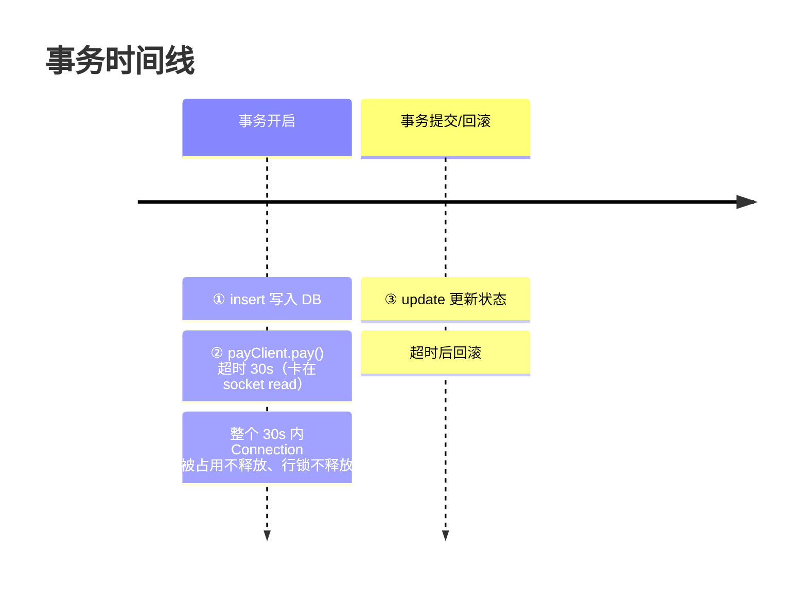

# 09 - Spring 事务高频场景题：长事务与外部调用

> 📌 **一句话理解**：凡是 `@Transactional` 方法里夹了**远程调用（HTTP/RPC/MQ 发送）或耗时操作**，都是埋雷--事务边界被拉长成"长事务"，数据库连接和锁被白白占用，高并发下直接连接池耗尽、服务雪崩。一句话铁律：**事务里不要做任何不在数据库内的事**。

---

## 核心场景：事务方法中调用第三方接口超时

### 场景描述

```java
@Service
public class OrderService {
    @Autowired private OrderMapper orderMapper;
    @Autowired private PayClient payClient;   // 第三方支付 HTTP 客户端

    @Transactional(rollbackFor = Exception.class)
    public void createOrder(Order order) {
        orderMapper.insert(order);            // ① DB 写入
        PayResult result = payClient.pay(order); // ② 调第三方，假设超时 30s
        orderMapper.updatePayStatus(order.getId(), result.getCode()); // ③ 更新状态
    }
}
```

面试官问：**如果第三方服务超时，这个场景会出现什么问题？**

### 会出现的问题（按严重程度）



**1. 长事务（核心问题）** ⭐⭐⭐⭐⭐
- 事务在方法入口（实际是第一条 DB 操作时）开启，直到方法结束才提交/回滚。
- 第三方超时（如 30s）期间，整个事务一直挂着不提交，事务时长 = DB 操作时间 + 第三方调用时间。

**2. 数据库连接被占用** ⭐⭐⭐⭐⭐
- Spring 事务通过 ThreadLocal 把一个 `Connection` 绑定到当前线程，方法结束前不会归还连接池。
- 第三方超时的 30s 里，这个连接一直被独占。高并发下多个请求同时卡在超时，**连接池迅速耗尽**，新请求拿不到连接直接报错，服务雪崩。

**3. 锁持有时间过长** ⭐⭐⭐⭐
- 若事务内 `insert/update` 的行带有行锁（或间隙锁），这些锁在第三方超时期间一直不释放。
- 其他事务操作相同行会被阻塞，可能导致**锁等待超时**甚至**死锁**。

**4. 超时回滚导致数据不一致** ⭐⭐⭐⭐
- 第三方超时通常抛异常，事务回滚，① 的 insert 被撤销。
- **致命陷阱**：第三方可能**实际已扣款成功**，只是响应超时。本地事务回滚了订单，但第三方已扣钱 -> 资金不一致。
- 反过来若设计成"先扣本地再调第三方"，超时回滚把本地库存恢复了，第三方又没成功，也不一致。

**5. `@Transactional(timeout=30)` 救不了** ⭐⭐⭐
- 很多人以为加了 `timeout` 就能避免长事务。但 Spring 事务 timeout 的实现是**事务开始时记录 deadline，在 SQL 执行时检查**，或依赖底层连接的 timeout。
- 线程卡在 HTTP 客户端的 `socket.read()` 上时，**根本不会去执行 SQL，timeout 检查不会触发**，超时形同虚设。

### 解决方案

```java
// ✅ 方案一：缩小事务边界 —— 先做 DB 操作并提交，事务外调第三方
public void createOrder(Order order) {
    orderMapper.insert(order);   // 不开事务，或单独小事务
    PayResult result;
    try {
        result = payClient.pay(order);   // 事务外调用，超时不影响 DB
    } catch (Exception e) {
        orderMapper.updateStatus(order.getId(), "PAY_TIMEOUT"); // 标记待处理
        throw e;
    }
    orderMapper.updatePayStatus(order.getId(), result.getCode());
}

// ✅ 方案二：编程式事务，精确包裹 DB 部分
public void createOrder(Order order) {
    PayResult result = payClient.pay(order);   // 先调第三方（或后调）
    transactionTemplate.execute(status -> {
        orderMapper.insert(order);
        orderMapper.updatePayStatus(order.getId(), result.getCode());
        return null;
    });   // 事务只覆盖 DB，不含远程调用
}

// ✅ 方案三：异步化 —— 事务只管本地落库，第三方走 MQ
@Transactional(rollbackFor = Exception.class)
public void createOrder(Order order) {
    orderMapper.insert(order);
    // 发 MQ，由消费者异步调第三方，本地事务快速提交
    mqTemplate.send("pay-topic", new PayTask(order.getId()));
}
```

**方案选型**：
- 同步强一致要求：方案一/二（缩小事务边界），第三方调用放在事务外。
- 可接受最终一致：方案三（MQ 异步）+ 本地消息表保证可靠投递。
- 复杂分布式：Seata 等分布式事务框架（成本高，慎用）。

---

## 同类场景题集

### Q1：事务方法里发送 MQ 消息，会有什么问题？

```java
@Transactional
public void createOrder(Order order) {
    orderMapper.insert(order);
    mqTemplate.send("order-topic", order);   // 事务内发 MQ
}
```

**两个坑**：
- **坑一：事务回滚但消息已发**。MQ 发送在事务提交前执行，如果后续操作抛异常导致事务回滚，DB 数据没了但**消息已发出**，消费端处理了不存在的订单。
- **坑二：事务提交前消息被消费**。消息发出去后消费者立刻拉取，去查 DB 发现订单还没提交（事务未结束），查不到数据。

**解决**：
- **本地消息表**：事务内只往本地消息表 insert 一条记录（与业务同事务），事务提交后由定时任务/MQ 投递器扫表发送，保证"DB 提交"与"消息发送"原子。
- **事务消息**：RocketMQ 事务消息（half message -> 本地事务 -> commit/rollback），原生支持。
- 详见 `05-分布式系统/03-消息队列.md` 与 `05-分布式系统/04-分布式事务.md`。

### Q2：事务方法里调用另一个微服务（RPC/Dubbo/Feign）会怎样？

- 和调 HTTP 接口一样：**长事务 + 连接占用 + 分布式一致性问题**，且 RPC 超时通常比 HTTP 更隐蔽。
- **额外问题**：本地事务回滚无法回滚远端服务的操作。远端已扣减库存，本地回滚 -> 库存丢失。
- **解决**：
  - 远程调用移出事务边界；
  - 用 TCC（Try-Confirm-Cancel）或 SAGA 模式做分布式事务补偿；
  - 能最终一致的用本地消息表 + 重试。

### Q3：事务方法里 for 循环调用外部接口，有什么问题？

```java
@Transactional
public void batchProcess(List<Long> ids) {
    for (Long id : ids) {
        Data data = dataMapper.selectById(id);
        remoteService.process(data);   // 每条都调一次远程
    }
}
```

- **长事务被放大**：N 次远程调用串行，事务时长 = N × 单次调用时间，极易超时。
- 连接和锁占用时间成倍增长，性能极差。
- **解决**：把循环内的远程调用拆出事务，事务内只批量查/写 DB；远程调用在事务外批量并行处理（CompletableFuture）。

### Q4：事务方法里做耗时 CPU 计算（大文件解析、加解密、复杂计算）会怎样？

- 同样是长事务：CPU 计算不涉及 DB，却把事务边界拉长。
- 连接被白白占用（计算期间 DB 连接闲置但无法归还）。
- **解决**：先在事务外完成计算，事务内只做 DB 写入；或用编程式事务精确包裹写库部分。

### Q5：事务方法内调用 `REQUIRES_NEW` 的子方法，有什么隐患？

```java
@Transactional
public void outer() {           // 事务 T1，持有 Connection A
    mapper.insert(...);
    self.inner();              // REQUIRES_NEW
}
@Transactional(propagation = Propagation.REQUIRES_NEW)
public void inner() {          // 挂起 T1，新开事务 T2，持有 Connection B
    mapper.update(...);
}
```

- **同时占用两个数据库连接**：T1 的 Connection A 被挂起但仍占用，T2 又取了 Connection B。高并发下**连接池翻倍消耗**，易耗尽。
- 若 T1 和 T2 操作同一行，可能**死锁**（T2 持锁等 T1，T1 等 T2 释放连接）。
- **解决**：日志/审计场景改用异步非事务（`@Async`）或 MQ；必须同步独立事务时评估连接池容量。

### Q6：事务方法里操作 Redis / 更新缓存，有什么问题？

- **长事务**：Redis 调用虽快但仍占用事务时间，且 Redis 操作不在事务内（Redis 事务 ≠ Spring 事务）。
- **一致性问题**：DB 事务回滚了，但 Redis 已写入/删除的缓存无法自动回滚，导致 DB 与缓存不一致。
- **解决**：缓存操作移到事务提交后（用 `TransactionSynchronizationManager.registerSynchronization` 在 `afterCommit` 回调里执行）；详见 `05-分布式系统/02-缓存策略.md`。

### Q7：为什么大事务要避免？怎么排查和治理？

**大事务危害**：
- 数据库连接占用时间长，连接池压力大；
- 锁持有时间长，并发度下降，易死锁；
- 主从延迟加大（大事务 binlog 传输慢）；
- 回滚成本高。

**排查手段**：
- 开启慢 SQL / 慢事务日志，定位执行时间长的事务；
- APM（如 SkyWalking）看事务 trace 时长，找出耗时事务；
- 代码 review：`@Transactional` 方法内是否有远程调用、循环、耗时操作。

**治理手段**：
- **缩小事务边界**：编程式事务精准包裹 DB 操作；
- **远程调用移出事务**；
- **异步化**：耗时操作走 MQ 异步；
- **批量优化**：循环改批量；
- **合理超时**：`@Transactional(timeout=N)` + 数据库连接超时 + 第三方调用超时三层设置。

### Q8：`@Transactional(timeout = 5)` 能防止长事务吗？为什么经常不生效？

- `timeout` **仅对新开启的事务生效**，加入已有事务（REQUIRED 加入场景）时被忽略。
- 实现机制：事务开始记录 deadline，在**每次 SQL 执行前**检查是否超时。如果线程卡在**非 SQL 的阻塞操作**（HTTP socket read、Thread.sleep、等锁）上，**不会触发检查**，timeout 形同虚设。
- 底层数据库连接的 timeout 才是兜底（如 MySQL 的 `wait_timeout`、JDBC 的 `queryTimeout`），但那是针对单条 SQL，不是整个事务。
- **结论**：`timeout` 只是辅助，**根本办法是不在事务内放耗时操作**。

---

## 通用解决框架

事务里能不能做 X？一张表判断：

| 操作 | 能否在事务内 | 原因 / 处理 |
|------|------------|------------|
| DB 读写（同库） | ✅ 应该 | 事务的本质，同 Connection |
| 查询（只读） | ✅ 可，建议 `readOnly=true` | 缩短时间 |
| HTTP / RPC 调用 | ❌ 不要 | 长事务 + 不一致，移出事务 |
| 发 MQ 消息 | ⚠️ 慎用 | 用本地消息表 / 事务消息 |
| Redis 缓存操作 | ❌ 不要 | 一致性 + 长事务，移到 afterCommit |
| 耗时 CPU 计算 | ❌ 不要 | 长事务，事务外算完再写 |
| 循环调远程 | ❌ 不要 | 放大长事务，拆批 + 事务外并行 |
| `Thread.sleep` / 等锁 | ❌ 不要 | 白占连接 |
| 日志 / 审计写入 | ⚠️ 可用 REQUIRES_NEW 或异步 | 避免影响主事务 |

**一句话铁律**：事务内只放"必须在同一事务原子提交的 DB 操作"，其余一律移出。

---

## 常见面试题

### Q1：Service 方法加了 @Transactional，里面查询数据库并调用第三方接口，第三方超时会怎样？

（见核心场景）核心是**长事务**：事务在方法开始时开启，第三方超时期间数据库连接和锁一直被占用，高并发下连接池耗尽、服务雪崩；超时回滚还可能因第三方实际已成功而数据不一致。`timeout` 参数在卡 socket 时也不生效。解决：远程调用移出事务、编程式事务缩小边界、MQ 异步化。

### Q2：事务里发 MQ 消息，事务回滚了消息怎么办？

事务回滚但 MQ 消息已发出，消费端处理了不存在的数据。用**本地消息表**（消息记录与业务同事务写入，事务后异步投递）或 **RocketMQ 事务消息**保证 DB 提交与消息发送的原子性。

### Q3：怎么避免长事务？

事务内只做必须在同一事务原子提交的 DB 操作；远程调用、缓存操作、耗时计算移出事务；用编程式事务精准控制边界；耗时操作异步化（MQ）；合理设置超时。

### Q4：@Transactional 的 timeout 为什么有时不生效？

timeout 仅对新事务生效，加入已有事务时被忽略；且其检查点在 SQL 执行前，线程卡在非 SQL 阻塞操作（HTTP/锁/sleep）时不触发。根本办法是不在事务内放耗时操作。

### Q5：事务方法里调用 REQUIRES_NEW 的子方法有什么风险？

同时占用两个数据库连接，高并发下连接池翻倍消耗易耗尽；操作同一行可能死锁。日志场景改用异步或 MQ。

---

## 资料勘误与重点提醒

> ⚠️ 这类场景题的常见误区与必须澄清的点：

1. **"加了 `@Transactional(timeout=N)` 就不怕长事务了"是错觉**。timeout 在卡 socket/锁时不触发，不能依赖它兜底。根本是不在事务内做耗时操作。

2. **"事务里发 MQ 用 `@Transactional` 包住就安全了"错误**。DB 事务与 MQ 发送是两个独立动作，DB 回滚无法撤销已发消息。必须用本地消息表或事务消息保证原子。

3. **"第三方超时，事务回滚就没事了"忽略了副作用**。第三方可能已实际执行成功（如已扣款），本地回滚反而造成资金不一致。需配合对账、幂等、状态机处理。

4. **REQUIRES_NEW 的连接占用常被忽略**。挂起的原事务仍占着连接，不是"释放"。高并发下这是连接池耗尽的隐形杀手。

5. **缓存操作不能在事务内**。DB 回滚缓存无法回滚，且拉长事务。应注册 `afterCommit` 回调在事务提交后操作缓存。

6. **重点补充（资料常漏）**：
   - 事务的**真正起点**是第一条 DB 操作（懒开启），不是方法入口。但无论从哪开始，结束都在方法 return，远程调用夹在中间就会拉长事务。
   - **连接池耗尽**是长事务最直接的线上事故表现：现象是接口大量超时、日志报 `Cannot get a connection, pool error`，根因往往是有 `@Transactional` 方法卡在远程调用上。
   - 治理优先级：**先排查并移除事务内的远程调用/耗时操作**（治本），再调超时和连接池大小（治标）。

> 📌 **本章总结**：场景题的主线就是"**事务边界内不该有的操作**"--远程调用、MQ、缓存、耗时计算、循环，每加一个都在拉长事务、占连接、藏一致性坑。被问到时按"会出现什么问题（长事务→连接占用→锁→不一致）→ 为什么（事务边界=方法、Connection 绑定、回滚无法波及外部）→ 怎么解决（移出事务/编程式事务/异步化/本地消息表）"三段答，逻辑清晰。
