# MySQL 高频面试题集

> 📌 **一句话理解**：本文是 MySQL 面试**深度速查题集**，覆盖基础架构、索引、事务、锁、日志、Buffer Pool、SQL 优化、存储引擎、主从复制等十大核心主题，每题给「要点答案 + 原理图解 + 易错点/勘误」。与 `04-数据库` 的深度知识点详解互补——那里讲原理，这里查题目。
>
> 整理依据：两份参考资料（java面试宝典-连老师 MySQL、咕泡 MySQL 专栏面试题）+ 业界高频考点补充。已按 MySQL 官方文档与业界共识**逐题纠错**（铁律3），资料中的错误就地修正并在该题 `⚠️` 行说明，文末「资料勘误与重点提醒」集中汇总。

---

## 第一章 MySQL 基础架构与执行流程

### Q：说说 MySQL 的基础架构图（一条 SQL 在 MySQL 中如何执行）？

MySQL 整体分为 **Server 层** 和 **存储引擎层** 两大部分，插件式架构使得存储引擎可以插拔替换。

**架构示意图：**

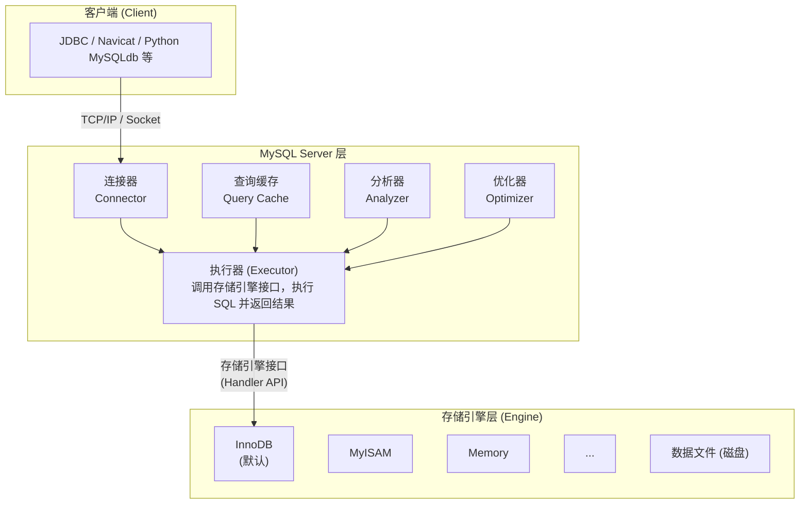

**Server 层各组件详解：**

| 组件 | 作用 | 关键细节 |
|------|------|---------|
| **连接器** | 与客户端建立连接、权限校验、连接管理 | 连接成功后权限快照固定；长连接内存占用问题 |
| **查询缓存** | SQL 命中缓存直接返回（8.0 已移除） | 表更新则缓存全部失效，命中率极低，所以被删 |
| **分析器** | 词法分析 + 语法分析 | 识别关键字/表名/列名；判断 SQL 是否符合语法规则 |
| **优化器** | 生成执行计划，选择索引和表连接顺序 | 基于成本估算选择；可能选错索引（统计信息不准） |
| **执行器** | 调用引擎接口执行 SQL 并返回结果 | 先校验权限再调用引擎；逐行读取返回给客户端 |

**一条 SELECT 查询的完整执行链路：**


一条 **UPDATE/DELETE** 语句的执行链路（比 SELECT 多了事务日志部分）：


> ⚠️ 易错点：① 很多资料说"MySQL 架构分三层"或列出的组件不全。标准分层是 Server 层 + 存储引擎层两层。② 查询缓存 MySQL 8.0 已彻底移除，面试时需注明版本差异。③ 数据修改不是直接写磁盘，而是先写 Buffer Pool 再由后台刷脏，这是 WAL（Write-Ahead Logging）机制的体现。

### Q：连接器的工作原理？为什么长连接会导致内存暴涨？

**连接器的核心职责：**
1. **TCP 三次握手**建立物理连接
2. **身份认证**：校验用户名、密码、主机白名单
3. **权限快照**：查询 `mysql.user` 等权限表，将该用户权限**缓存到连接对象中**
4. **连接管理**：维护连接状态、超时自动断开（`wait_timeout`）

**长连接内存暴涨的原因：**
- MySQL 连接对象中会保存执行过程中使用的内存资源（如查询结果缓存、临时表、排序缓冲区等）
- 这些内存只有在连接断开时才会释放
- 如果长连接一直不断，且执行过很多大查询，内存会越积越多，最终可能 OOM

**解决办法：**
1. 定期断开长连接，或定时执行 `mysql_reset_connection` 重置连接（释放内存但不重连）
2. MySQL 5.7 后可考虑使用连接池（HikariCP/Druid）配合 `maxLifetime`
3. 业务层面控制大查询的频率和数量

> ⚠️ 易错点：权限是在连接建立时快照的，之后管理员修改了该用户的权限，**已经建立的连接不会生效**，需要重连才行。这是一个非常实用的考点。

### Q：查询缓存为什么在 MySQL 8.0 被移除了？

查询缓存（Query Cache）的原理是：把 SELECT 语句的哈希值作为 key，查询结果作为 value 缓存起来。相同 SQL 直接返回缓存结果。

**被移除的原因：**
1. **命中率极低**：只要表有任何更新（INSERT/UPDATE/DELETE），这张表的所有查询缓存都会被**全部清空**。在写多读少的互联网场景下，命中率通常不到 1%
2. **维护成本高**：每次查询都要做哈希查找，每次更新都要失效所有相关缓存
3. **加锁开销大**：查询缓存有全局锁，高并发下反而成为瓶颈
4. **实际收益为负**：在大多数生产环境中，开启查询缓存反而会降低性能

> ⚠️ 易错点：面试时如果提到查询缓存，一定要补充"MySQL 8.0 已移除"这个版本前提，否则会显得知识陈旧。

### Q：MySQL 数据库 cpu 飙升到 500% 怎么处理？

排查思路（由外到内、由粗到细、先止血再根治）：

**第一步：确认与临时止血**
1. `top` 确认是否是 `mysqld` 进程导致
2. `show processlist` / `show full processlist` 查看当前所有连接和执行中的 SQL
3. 找到耗 CPU 的 SQL，`kill <id>` 临时止损（注意不要 kill 核心业务连接）

**第二步：根因分析**

| 可能原因 | 排查方法 | 典型特征 |
|---------|---------|---------|
| 大量全表扫描 | `explain` 看 type=ALL | 慢查询日志中 rows 很大 |
| 大量排序/临时表 | `explain` 看 Extra=Using filesort/temporary | order by / group by 没走索引 |
| 锁等待严重 | `show engine innodb status` 看锁等待 | 大量连接处于 Locked 状态 |
| 连接数暴增 | `show status like 'Threads%'` | Threads_running 飙高 |
| 存储过程/复杂函数 | 查看是否有长时间运行的存储过程 | CPU 持续高但 SQL 看起来不多 |

**第三步：长效治理**
1. 开启慢查询日志 + SQL 评审机制
2. 索引优化：联合索引、覆盖索引、避免索引失效
3. 架构优化：读写分离、分库分表、缓存层
4. 监控告警：CPU 使用率、慢查询数、连接数监控

> ⚠️ 易错点：不能上来就 kill 进程，需先定位根因；CPU 飙升不一定是 SQL 慢，也可能是连接数过多导致的上下文切换、锁等待、排序/临时表过多等因素。

### Q：什么是 MySQL？为什么选择 MySQL？

MySQL 是 Oracle 旗下开源免费的关系型数据库管理系统（RDBMS），是 WEB 应用中最流行的 RDBMS 之一。

选择原因：开源免费、社区活跃、生态完善、性能优异、支持事务、支持高可用与读写分离、方便水平扩展、互联网公司广泛使用（大厂验证）。

---

## 第二章 索引与数据结构

### Q：什么是索引？索引的优缺点？

**定义**：索引是帮助数据库高效获取数据的**排序数据结构**，类似书的目录。InnoDB 中使用 B+ 树实现。

**优点**：
- 大幅加快数据检索速度（减少扫描行数，核心收益）
- 加速排序和分组（索引本身有序，避免 filesort 和临时表）
- 加速表连接（被驱动表关联字段有索引时可用 Nested-Loop Join）

**缺点**：
- 占用额外磁盘空间（索引文件可能比数据文件还大）
- 降低写性能：INSERT/UPDATE/DELETE 时需要同步维护所有索引
- 索引过多会增加优化器选择成本，可能选错索引
- 增加了 DBA 维护复杂度

> ⚠️ 易错点：索引不是越多越好——写操作要维护所有索引，过多索引会拖慢写入并占用大量空间。一个表的索引数量建议控制在 5 个以内。

### Q：索引有哪些类型？

按**数据结构**分：B+ 树索引、Hash 索引、全文索引、R-Tree 索引
按**物理存储**分：聚簇索引、非聚簇索引（二级索引/辅助索引）
按**字段特性**分：
- 主键索引（PRIMARY KEY）：不允许重复、不允许 NULL，一个表只能一个
- 唯一索引（UNIQUE）：不允许重复，允许 NULL（可以有多个 NULL），一个表可多个
- 普通索引（INDEX/KEY）：最基本的索引
- 联合索引/复合索引：多个字段组成的索引
- 前缀索引：对字符串的前 N 个字符建立索引
- 全文索引（FULLTEXT）：用于文本内容的关键词检索

> ⚠️ 易错点：InnoDB 的默认索引类型是 B+ 树索引，不是 B 树（虽然 `SHOW INDEX` 中显示为 BTREE）。Hash 索引 InnoDB 有**自适应哈希索引（AHI）**，是引擎自动维护的，用户不能手动创建。

### Q：B 树和 B+ 树的区别？为什么 MySQL 用 B+ 树而不用 B 树？

**B+ 树结构示意图（3 阶 B+ 树示例）：**

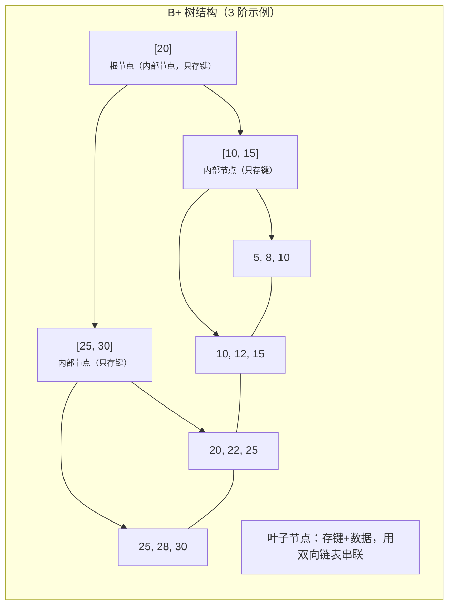

**B 树结构对比：**

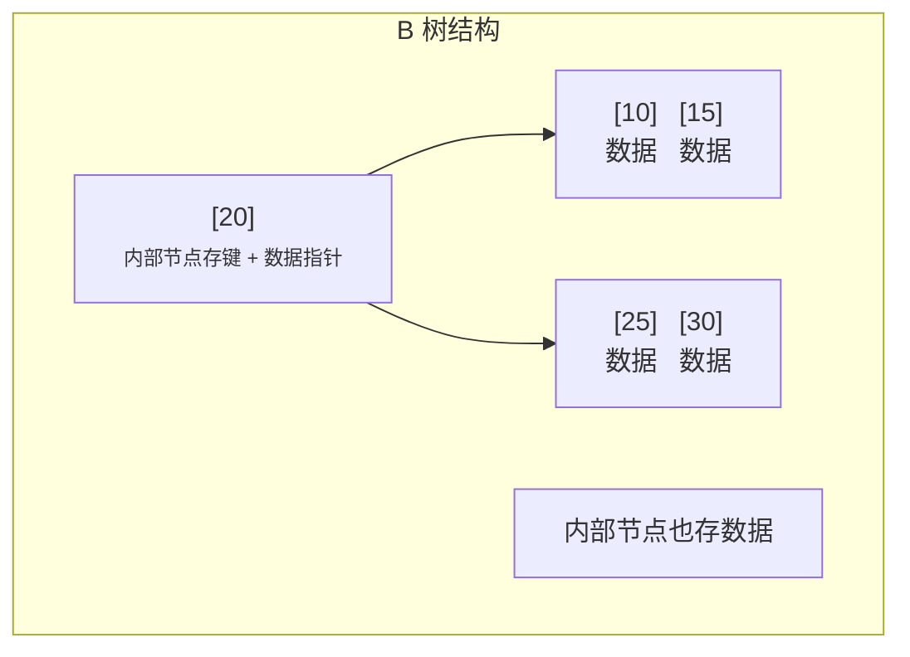

**B 树与 B+ 树的核心区别：**

| 特性 | B 树 | B+ 树 |
|------|------|-------|
| 内部节点 | 既存键也存数据指针 | 只存键，不存数据 |
| 叶子节点 | 各自独立，不串联 | 用**双向链表**串联，有序 |
| 查询稳定性 | 不稳定，越靠近根越快 | 稳定，所有查询必须走到叶子节点 |
| 范围查询 | 需要中序遍历整棵树，回溯 | 只需找到起点后沿链表遍历 |
| 数据存储 | 数据分散在所有节点 | 数据全部在叶子节点 |
| 叶子数量 | 每个节点都有数据指针 | 只有叶子节点有数据指针 |

**MySQL 选择 B+ 树的原因（核心面试题）：**

1. **更少的 I/O 次数**：内部节点只存键不存数据，一页（16KB）能容纳更多键 → 树更矮胖（通常 2~4 层）→ 磁盘 I/O 次数更少。以主键 bigint(8B) + 指针(6B) 计算，一页能放约 16*1024/14 ≈ 1170 个键，3 层树就能存 1170×1170×16 ≈ 2000 万条数据

2. **范围查询极其高效**：叶子节点是有序双向链表，范围查询只需找到起点后顺序遍历，不需要回溯到父节点。这对 `between`、`>`、`<` 等查询特别友好

3. **查询效率稳定**：所有查询都走到叶子节点，每次查询 I/O 次数一致（树的高度），性能可预期

4. **天然支持排序**：叶子节点有序，`order by`、`group by` 可以直接利用索引顺序，避免 filesort

5. **增删效率更稳定**：叶子节点链表结构便于节点分裂与合并，数据变动时影响范围可控

> ⚠️ 易错点：很多资料把"B 树"和"B- 树"混为一谈。实际上 B- 树就是 B 树（B-Tree），B 是 Balanced 的意思。B+ 树是 B 树的变种。还有 B* 树（兄弟节点有指针，利用率更高），但 InnoDB 用的是 B+ 树。

### Q：B+ 树的高度怎么计算？（千万级数据 B+ 树有多高？）

这是一个高频手撕计算题。

**前提：**
- InnoDB 一页 = 16KB（`innodb_page_size` 默认 16KB）
- 主键假设为 BIGINT，8 字节
- 子节点指针在 InnoDB 中约 6 字节
- 叶子节点存完整行数据，假设一行约 1KB

**计算过程：**

第 1 层（根节点，内部节点）：
- 每个索引条目 ≈ 8B(主键) + 6B(指针) = 14B
- 一页能放 ≈ 16 × 1024 / 14 ≈ 1170 个条目
- 即根节点能指向 1170 个子节点

第 2 层（内部节点）：
- 同样，每个节点约 1170 个子节点
- 总子节点数 = 1170 × 1170 ≈ **136.8 万个**

第 3 层（叶子节点，存数据）：
- 每页存数据行数 ≈ 16KB / 1KB = 16 行
- 总行数 = 136.8 万 × 16 ≈ **2190 万行**

**结论：**
- 2~3 层 B+ 树就能存千万级数据，3~4 层存亿级数据
- 所以"一张表存了几千万数据，为什么查询还很快"——因为只需要 3 次 I/O 就能定位到数据
- 如果行数据很小（如只有几个字段几十字节），叶子一页能存几百行，那层数更低

> ⚠️ 易错点：计算高度时要区分"内部节点"和"叶子节点"的单页容量，两者存的东西不一样。而且根节点常驻内存，实际查询只需要 2 次 I/O（第 2 层 + 叶子层）。

### Q：什么是聚簇索引和非聚簇索引？区别是什么？

**聚簇索引（Clustered Index）**：索引和数据存在一起，叶子节点存储**完整的行数据**。一张 InnoDB 表只能有一个聚簇索引，就是主键索引。

**聚簇索引的选择优先级：**
1. 表定义了主键 → 主键就是聚簇索引
2. 没有主键 → 选第一个**非空唯一索引**作为聚簇索引
3. 也没有唯一索引 → InnoDB 隐式生成一个 6 字节的 `row_id` 作为聚簇索引

**非聚簇索引（Non-Clustered / Secondary Index）**：也叫二级索引/辅助索引。叶子节点不存完整行数据，只存**索引列的值 + 主键值**。

**回表**：通过二级索引找到主键值后，再回到主键索引树（聚簇索引）查找完整行数据的过程。

**结构对比图：**

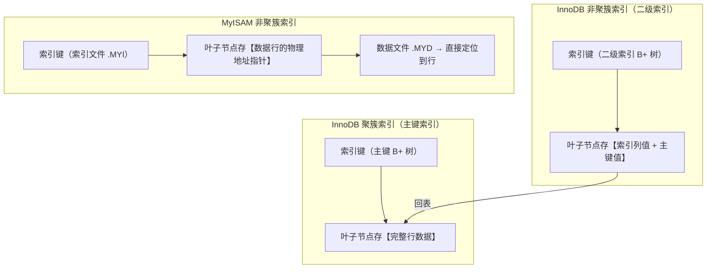

**MyISAM vs InnoDB 索引对比：**

| 特性 | MyISAM | InnoDB |
|------|--------|--------|
| 索引组织方式 | 非聚簇索引 | 聚簇索引（主键）+ 非聚簇索引（二级） |
| 叶子节点内容 | 数据行的物理地址指针 | 主键索引存完整行数据；二级索引存主键值 |
| 是否必须有主键 | 可以没有 | 必须有（没有就自动建 row_id） |
| 回表概念 | 没有（索引直接指向物理地址） | 二级索引需要回表 |
| 索引文件 | .MYI 文件单独存放 | 主键索引和数据一起在 .ibd 中 |

> ⚠️ 易错点：① 聚簇索引不是一种索引"类型"，而是一种**数据存储方式**（索引组织表 IOT）。② InnoDB 的二级索引一定存的是**主键值**，不是物理地址——因为数据页可能因为页分裂、表空间优化等原因移动，物理地址会变，但主键值不变。③ 所以主键越小越好，因为所有二级索引的叶子节点都存了主键值，主键大则所有二级索引都跟着膨胀。

### Q：什么是覆盖索引？什么是回表？

**回表**：通过二级索引找到主键值后，再回到主键索引树查找完整行数据的过程。回表需要多查一棵 B+ 树，多一次 I/O（或多次，视树高而定）。

**覆盖索引（Covering Index）**：查询所需的所有列都能在二级索引中直接获取（不需要回表）。

**示例：** 表 user 有 id(主键)、name、age、email，联合索引 idx_name_age(name, age)

```sql
-- 覆盖索引：Extra=Using index，不需要回表
SELECT id, name, age FROM user WHERE name = 'Tom';
-- 解析：name 和 age 在索引里，id 是主键，二级索引叶子也存主键，所以三列都在索引里

-- 不是覆盖索引：需要回表查 email
SELECT name, age, email FROM user WHERE name = 'Tom';
-- 解析：email 不在索引里，需要拿到主键后回表查
```

**Explain 中识别：** Extra 列出现 `Using index`。

**好处**：减少 I/O 次数、减少 Buffer Pool 占用、提升查询性能。是 SQL 优化的重要手段之一。

**常见应用场景：**
- 统计查询：`SELECT COUNT(*) FROM user WHERE name = 'xxx'` → 走二级索引即可
- 分页查询：先通过覆盖索引找到 id 再关联（延迟关联优化）
- 只需少量列的列表查询：把常用查询列建成联合索引

> ⚠️ 易错点：`Using index` 表示使用了覆盖索引，不是"使用了索引"这么简单；很多资料混淆"使用索引"和"使用覆盖索引"。`Using where; Using index` 表示用了索引且用了索引下推（ICP）或直接在索引上过滤。

### Q：什么是联合索引？什么是最左前缀匹配原则？

**联合索引**：用多个字段一起建立的索引，如 `idx_name_age_school(name, age, school)`。

**最左前缀匹配原则**：联合索引按索引定义的字段顺序从左到右匹配，遇到**范围查询**（>、<、between、like 左前缀模糊）就停止匹配。

**联合索引 B+ 树结构示意（idx(a, b, c)）：**

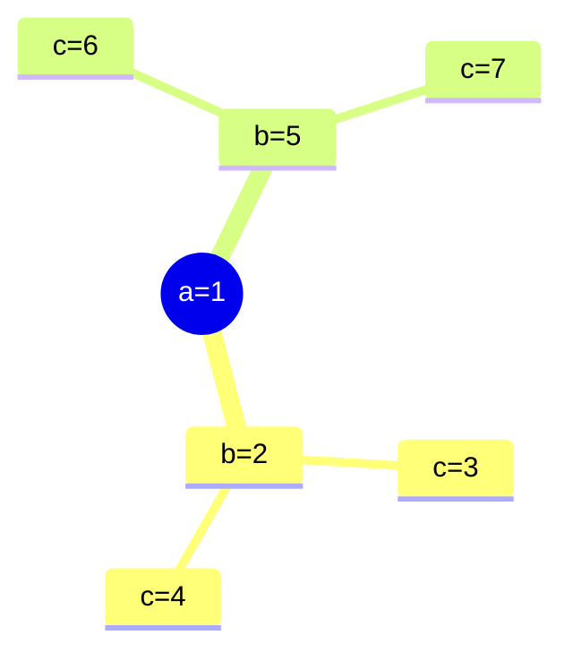

查询匹配规则（索引按 `a → b → c` 排序）：

| WHERE 条件 | 索引用到的字段 |
|-----------|--------------|
| `a=1 AND b=2 AND c=3` | 全部用到（a匹配→b匹配→c匹配） |
| `a=1 AND c=3` | 只用到 a（b 断了，c 没法定位） |
| `b=2 AND c=3` | 完全用不到（没有最左列 a） |

以 `idx(a, b, c)` 为例的完整匹配情况：

| WHERE 条件 | 索引用到的字段 | 说明 |
|-----------|--------------|------|
| `a = 1 AND b = 2 AND c = 3` | a、b、c | 全字段匹配 |
| `a = 1 AND b = 2` | a、b | 前两个字段 |
| `a = 1 AND c = 3` | 只用到 a | b 断了，c 用不到 |
| `b = 2 AND c = 3` | 完全不用 | 没有最左列 a |
| `a = 1 AND b > 2 AND c = 3` | a、b | 遇到范围查询，c 用不到 |
| `a = 1 AND c = 3 AND b = 2` | a、b、c | 等值查询优化器会自动调整顺序 |
| `a IN (1,2) AND b = 3` | a、b | IN 也算等值，不中断 |
| `a LIKE '张%' AND b = 3` | a | LIKE 左前缀匹配是范围查询，b 用不到 |

> ⚠️ 易错点：① 等值查询（= 和 in）的顺序不影响，MySQL 优化器会自动调整，不是必须按索引定义的顺序写 SQL。② 范围查询才会中断匹配，等值查询不会。③ 不是"遇到范围查询后后面的字段完全不用"，而是"范围查询的那个列用到了，后面的列不能继续走索引定位"，但可以用索引下推（ICP）做过滤。

### Q：什么是索引下推（Index Condition Pushdown, ICP）？

MySQL 5.6 引入的优化。在索引遍历过程中，对索引中包含的字段先做条件判断，直接过滤掉不满足条件的记录，**减少回表次数**。

**示意图：**

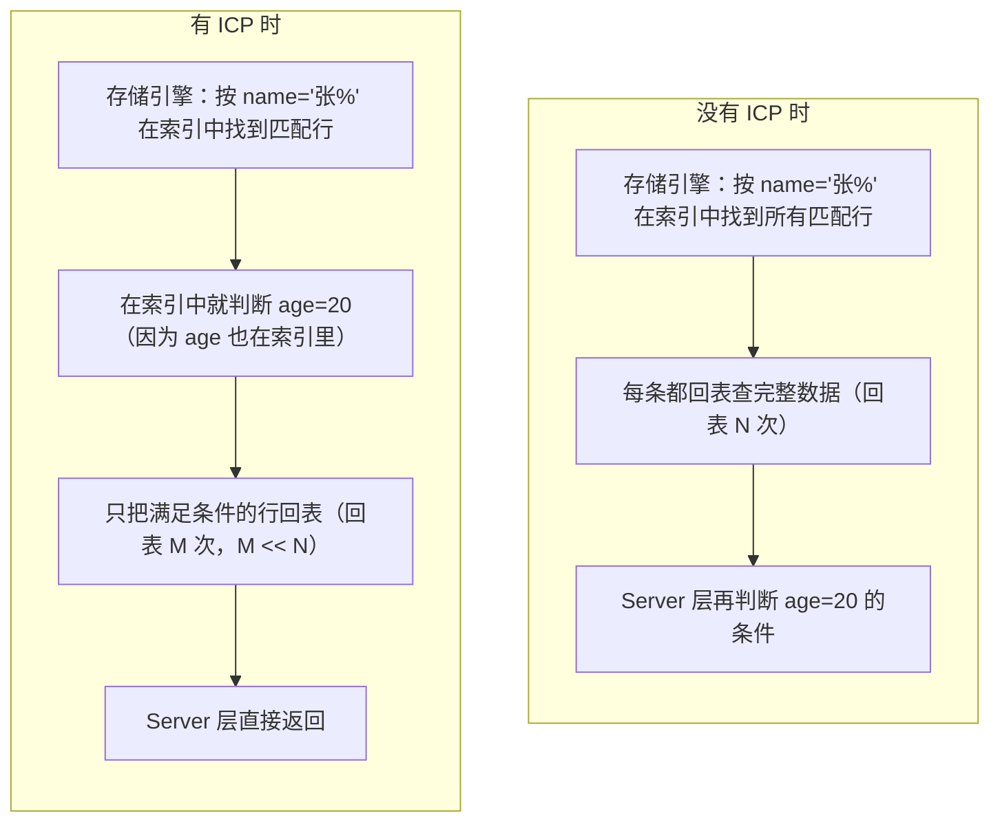

**示例**：联合索引 `idx(name, age)`，查询 `WHERE name LIKE '张%' AND age = 20`

- 无 ICP：按 name 找到所有"张"开头的记录（可能有 100 条），逐条回表再判断 age
- 有 ICP：在索引中就同时判断 age 条件，不满足的直接跳过（假设只剩 10 条），只回表 10 次

**Explain 中识别：** Extra 列出现 `Using index condition`。

**适用场景：**
- 联合索引中，前面的列是范围查询，后面的列有等值过滤
- 减少回表次数，提高查询效率

### Q：索引失效的场景有哪些？

常见索引失效场景（**高频考点，必须背下来**）：

| 场景 | 示例 | 原因 |
|------|------|------|
| 索引列上做运算/函数 | `WHERE YEAR(create_time) = 2023` | MySQL 无法直接定位索引键值（8.0 可建函数索引） |
| 隐式类型转换 | `WHERE phone = 13800000000`（phone 是 varchar） | 字符串转数字，索引失效 |
| 隐式字符集转换 | 联表时两表字符集不同 | 转换后索引用不上 |
| 使用 !=、<>、NOT | `WHERE age != 20` | 优化器认为走索引还不如全表扫（数据比例高时） |
| IS NULL / IS NOT NULL | `WHERE name IS NOT NULL` | 取决于数据分布，NULL 值优化困难 |
| LIKE 以 % 开头 | `WHERE name LIKE '%张%'` | 前缀不确定，无法利用有序索引 |
| OR 连接的条件 | `WHERE a = 1 OR b = 2` | OR 两边必须都有索引才走，否则全表扫 |
| 联合索引不满足最左前缀 | `WHERE b = 2`（idx(a,b)） | 无法定位索引起点 |
| 索引列参与表达式计算 | `WHERE id + 1 = 10` | 索引存的是 id 值，不是 id+1 |
| 优化器选择不走索引 | 小表、返回数据比例高 | 走索引+回表的成本 > 全表扫描成本 |

> ⚠️ 易错点："索引失效"不是绝对的，很多场景是优化器的成本估算决定的。小表上即使有索引也可能走全表扫描，因为直接扫表比走索引回表还快。最终以 `explain` 结果为准。另外，MySQL 8.0 引入了函数索引（Functional Index），可以为 `YEAR(create_time)` 这种表达式建索引，打破了"索引列上用函数一定失效"的铁律。

### Q：创建索引的原则是什么？

**建索引的原则（高频考点）：**

1. **WHERE、JOIN ON、ORDER BY、GROUP BY 中的列**优先建索引
2. **区分度高（基数大）的列**建索引效果好，如手机号、用户 ID；性别、状态等区分度低的不适合单独建索引
3. **联合索引中，区分度高的列放最左边**（等值查询时能更快速过滤）
4. **尽量扩展索引而非新建**：已有 `idx(a)`，要加 `(a,b)` 直接修改原索引即可
5. **短索引/前缀索引**：长字符串（如邮箱、URL）用前缀索引节省空间
6. **避免过多索引**：索引增加写入成本、占用空间，一般不超过 5~6 个
7. **频繁更新的字段**谨慎建索引（维护成本高）
8. **尽量使用覆盖索引**：减少回表，提高查询性能
9. **外键列必须建索引**（虽然 InnoDB 会自动建，但显式建更清晰）

**不适合建索引的场景：**
- 表数据量很小（几千行以内，全表扫描更快）
- 区分度很低的列（性别、状态等 2~3 个值的列，单独建没用）
- 频繁更新的列（写代价 > 读收益）
- 不会出现在 WHERE/JOIN/ORDER BY 中的列

> ⚠️ 易错点：不是 where 后面的列都要建索引。索引是有成本的，要根据实际查询频率和区分度来权衡。实际工作中是"先有查询，再建索引"，而不是"表建好了就随便加索引"。

### Q：Hash 索引和 B+ 树索引的区别？

| 特性 | Hash 索引 | B+ 树索引 |
|------|----------|-----------|
| 等值查询 | O(1)，极快 | O(logN) |
| 范围查询 | ❌ 不支持 | ✅ 支持，高效（链表遍历） |
| 排序 | ❌ 不支持 | ✅ 天然有序 |
| 最左前缀匹配 | ❌ 不支持 | ✅ 支持 |
| 覆盖索引 | ❌ 必须回表 | ✅ 可覆盖索引避免回表 |
| 哈希碰撞 | 有性能退化问题（链表/红黑树） | 无 |
| 查询稳定性 | 不稳定（碰撞多时慢） | 稳定 |

**使用场景**：绝大多数场景选 B+ 树；只有纯等值查询且对性能要求极高时，才考虑自适应哈希索引（AHI）。

> ⚠️ 易错点：InnoDB 不支持用户手动创建 Hash 索引，Memory 引擎才支持。所谓 InnoDB 的 Hash 索引指的是**自适应哈希索引（Adaptive Hash Index, AHI）**，是引擎根据访问频率自动为热点页建立的**内存索引**，完全自动、用户不可控。

### Q：什么是前缀索引？适用场景？

对字符串列的前 N 个字符建立索引，而不是整个列。

**语法**：`CREATE INDEX idx_name ON user(name(10))`

**优点**：节省索引空间（字符串很长时效果明显）
**缺点**：
- 无法用于 ORDER BY、GROUP BY（因为前 N 个字符可能相同）
- 无法做覆盖索引
- 范围查询效率低

**如何选择前缀长度：**
```sql
-- 计算不同长度下的区分度
SELECT
  COUNT(DISTINCT LEFT(name, 5)) / COUNT(*) AS len5,
  COUNT(DISTINCT LEFT(name, 10)) / COUNT(*) AS len10,
  COUNT(DISTINCT LEFT(name, 20)) / COUNT(*) AS len20
FROM user;
```
选取区分度接近 1（或接近全列区分度）的最小长度。

**适用场景**：长字符串列（如邮箱、URL、地址），且主要是前缀匹配查询的场景。

### Q：使用索引查询一定能提高性能吗？为什么？

不一定。索引的代价：
1. 占用额外磁盘空间（空间成本）
2. 增加写操作的开销（INSERT/UPDATE/DELETE 需要维护所有索引）
3. 索引扫描 + 回表的开销可能大于全表扫描（比如返回结果集占表数据 20%~30% 以上时，随机 I/O 比顺序 I/O 慢很多）

结论：索引是"空间换时间"的策略，需要权衡。索引的本质是**把随机 I/O 变成顺序 I/O**，但当需要回表的数据量很大时，大量随机 I/O 反而不如全表扫描的顺序 I/O。

### Q：什么是页分裂和页合并？（深度题）

这是 B+ 树维护过程中的核心机制，与写入性能密切相关。

**页分裂（Page Split）：**

当向 B+ 树的叶子节点插入新数据时，如果该页已经满了（16KB 放不下了），就需要把这一页分成两页，这个过程叫页分裂。

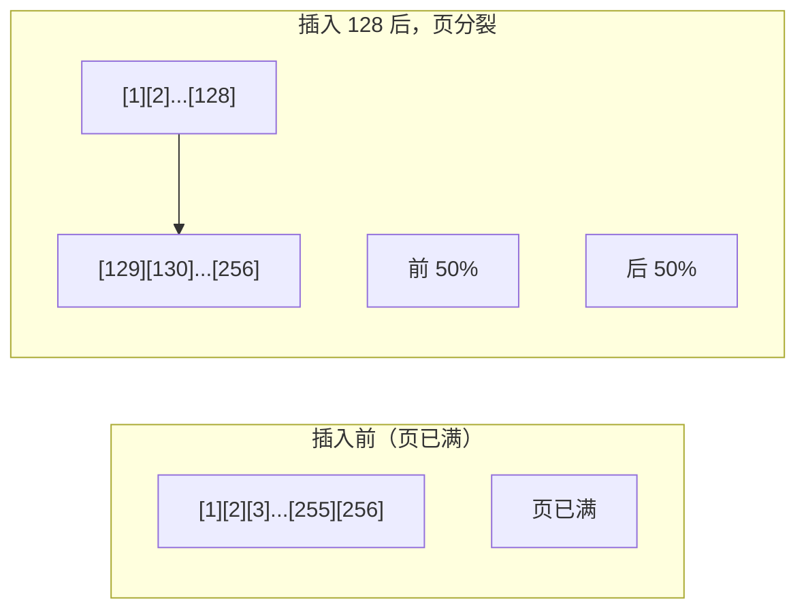

**页分裂的代价：**
- 需要申请新的页（内存+磁盘）
- 修改指针，维护链表关系
- 可能导致父节点也发生分裂（递归向上）
- 页分裂后页的利用率从 100% 降到约 50%，空间利用率下降

**页合并（Page Merge）：**

当删除数据时，相邻两个页的数据量都很少（低于 `MERGE_THRESHOLD`，默认 50%），InnoDB 会尝试把它们合并成一个页。

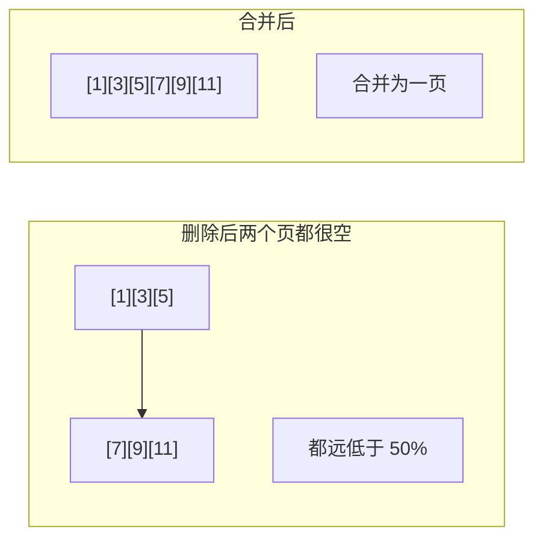

**为什么自增主键写入性能好？**
- 自增主键是顺序的，每次都插在最后一页的末尾
- 不会触发中间页的分裂，只有最后一页满了才分裂（且最后一页后续会持续追加，利用率高）
- 如果是 UUID 这种随机主键，每次插入可能落在不同的页，导致频繁页分裂，写入性能差

> ⚠️ 易错点：页分裂不是对半分的（InnoDB 有优化）。如果是**顺序插入**，InnoDB 会做优化——新数据单独放新页，旧页不动，这样旧页利用率还是 100%。只有在**中间插入**时才是对半分。这个细节知道了会很加分。

### Q：索引选择器是怎么工作的？为什么会选错索引？（深度题）

**优化器选择索引的逻辑：**
MySQL 优化器是**基于成本（Cost-based Optimizer, CBO）**的，它会估算每个执行计划的成本，选择成本最低的那个。

**成本估算的两个维度：**
1. **I/O 成本**：从磁盘读取数据页到内存的成本（主要成本，单位成本默认 1.0）
2. **CPU 成本**：在内存中比较、排序的成本（次要成本，单位成本默认 0.2）

**为什么会选错索引？**

1. **统计信息不准**：
   - InnoDB 不是实时统计行数和索引基数的，而是**采样统计**（随机采样几个页估算整体）
   - 数据分布变化大时，统计信息可能过时，导致成本估算偏差
   - 可以用 `ANALYZE TABLE` 手动更新统计信息

2. **成本模型的局限性**：
   - 优化器的成本模型是理想化的，不考虑 Buffer Pool 命中率（假设每次读页都是磁盘 I/O）
   - 实际上如果数据已经在内存中，成本就低很多，但优化器不知道

3. **回表成本估算不准**：
   - 二级索引需要回表，回表的代价取决于需要回多少行
   - 如果优化器低估了返回行数，可能错误地选择二级索引而不是全表扫描

4. **多个索引可选时的排序选择**：
   - 如果查询有 ORDER BY，优化器可能选择排序字段的索引（避免 filesort），即使 WHERE 条件走另一个索引更快

**如何干预：**
- `ANALYZE TABLE` 更新统计信息
- `FORCE INDEX` 强制使用某个索引（慎用，数据分布会变）
- `USE INDEX` / `IGNORE INDEX` 建议/忽略某些索引
- 调整索引结构，让优化器更容易选对

### Q：什么是索引基数（Cardinality）？

**索引基数**：索引中唯一值的数量（区分度）。基数 / 行数 = 选择性，越接近 1 区分度越好。

**查看方式**：`SHOW INDEX FROM table_name;` 中的 `Cardinality` 列。

**为什么重要：**
- 基数高（区分度大）的列，索引过滤效果好，优化器更倾向于选择它
- 基数低（区分度小）的列（如性别、状态），索引过滤效果差，可能还不如全表扫描

**联合索引的最左字段选择：**
- 联合索引的第一个字段基数越高越好（能快速过滤掉大部分数据）
- 但也要结合实际查询模式——最常用的查询条件应该放最左边

### Q：百万级数据如何删除？

直接 DELETE 百万数据的问题：逐条删除慢、产生大量 undo/redo/binlog、锁时间长、可能导致主从延迟。

**常用方案：**
1. **分批删除**：每次删 1000~5000 条，分批提交，避免长事务和锁表
   ```sql
   WHILE EXISTS (SELECT 1 FROM t WHERE condition) DO
     DELETE FROM t WHERE condition LIMIT 1000;
     COMMIT; -- 每批提交，释放锁
   END WHILE;
   ```
2. **先删索引再重建**：删除大量数据前先删非必要索引，删完数据再重建
3. **新表替换**：如果要删大部分数据（>70%），可建同结构新表，插入保留数据，RENAME 表，删除旧表
   ```sql
   CREATE TABLE t_new LIKE t;
   INSERT INTO t_new SELECT * FROM t WHERE 保留条件;
   RENAME TABLE t TO t_old, t_new TO t; -- 原子操作
   DROP TABLE t_old;
   ```

> ⚠️ 易错点：方案 2 要谨慎使用，因为删索引期间其他查询可能受影响，需在业务低峰操作。推荐优先用分批删除。

### Q：索引设计时为什么字段越小越好？

因为数据库以页（Page，默认 16KB）为单位存储和读取。索引字段越小，一页能存放的索引条目越多，树的高度越低，磁盘 I/O 次数越少。这也是推荐用自增整数主键而非 UUID 的核心原因之一。

而且，InnoDB 的二级索引叶子节点存的是主键值，主键越小，所有二级索引都越小。

---

## 第三章 事务与隔离级别

### Q：什么是数据库事务？事务的四大特性（ACID）？

**事务**：一组不可分割的数据库操作序列，是并发控制的基本单位。要么全部执行成功，要么全部失败回滚。

**ACID 四大特性：**

| 特性 | 含义 | 实现机制 |
|------|------|---------|
| **原子性 (Atomicity)** | 事务是最小执行单元，不可分割。要么全成，要么全败 | undo log（回滚） |
| **一致性 (Consistency)** | 事务执行前后，数据从一个一致性状态变到另一个一致性状态 | 是最终目标，由 A+I+D + 业务约束共同保障 |
| **隔离性 (Isolation)** | 并发事务之间互不干扰，各有独立的数据视图 | MVCC + 锁 + 隔离级别 |
| **持久性 (Durability)** | 事务一旦提交，修改永久有效，宕机不丢 | redo log + 刷盘策略 |

> ⚠️ 易错点：很多资料将一致性简单解释为"数据一致"。实际上一致性是**业务语义层面**的概念（如转账前后总金额不变），原子性、隔离性、持久性都是为了保障一致性而存在的手段。**一致性是目标，其他三个是手段。**

### Q：什么是脏读、不可重复读、幻读？

三个并发事务异常现象（**必须能清晰区分，高频考点**）：

**脏读（Dirty Read）：**
一个事务读取到了另一个事务**尚未提交**的数据。如果对方回滚，读到的就是"脏"数据。
- 例：事务 A 把余额从 100 改成 200（未提交），事务 B 读取到 200，A 随后回滚，B 读到的 200 就是脏数据

**不可重复读（Non-repeatable Read）：**
同一事务内，对**同一行**数据两次读取的结果不同。重点是**修改和删除**（UPDATE/DELETE）。
- 例：事务 A 第一次读取余额是 100，事务 B 把余额改成 200 并提交，事务 A 第二次读取余额变成 200

**幻读（Phantom Read）：**
同一事务内，相同的**范围查询**两次返回的行数不同。重点是**新增**（INSERT）。
- 例：事务 A 查询 `WHERE age > 20` 得到 10 条，事务 B 插入一条 age=25 并提交，事务 A 再次查询得到 11 条

> ⚠️ 易错点：很多资料混淆幻读和不可重复读。简单区分：**不可重复读针对的是同一条记录内容的变化（update/delete），幻读针对的是记录条数的变化（insert）**。两者解决思路不同：前者靠 MVCC/行锁，后者靠间隙锁。

### Q：事务隔离级别有哪些？MySQL 默认隔离级别是什么？

SQL 标准定义了 4 种隔离级别，由低到高：

| 隔离级别 | 脏读 | 不可重复读 | 幻读 | 实现核心 |
|---------|------|-----------|------|---------|
| 读未提交（Read Uncommitted, RU） | ✅ 可能 | ✅ 可能 | ✅ 可能 | 读不加锁，直接读最新 |
| 读已提交（Read Committed, RC） | ❌ 不会 | ✅ 可能 | ✅ 可能 | 每条 SELECT 生成新 ReadView |
| 可重复读（Repeatable Read, RR） | ❌ 不会 | ❌ 不会 | ✅ 可能（SQL标准） | 事务内首次 SELECT 生成 ReadView，后续复用 |
| 串行化（Serializable） | ❌ 不会 | ❌ 不会 | ❌ 不会 | 全表范围锁，串行执行 |

- **MySQL InnoDB 默认隔离级别是 RR（可重复读）**
- Oracle、PostgreSQL 默认是 RC

**各隔离级别适用场景：**
- RU：几乎不用，性能提升有限但问题很多
- **RC**：互联网公司常用（如阿里就是 RC），没有间隙锁，死锁少，并发高。需要接受不可重复读
- **RR**：MySQL 默认，业务逻辑简单时用，不需要关心不可重复读的问题
- Serializable：极端场景用，并发性能极差

> ⚠️ 勘误：很多资料说"MySQL RR 级别下仍有幻读"，这是 **SQL 标准下的理论结论**。在 MySQL InnoDB 的 RR 级别下，通过 **MVCC（快照读）+ Next-Key Lock（当前读）** 的组合，**在很大程度上解决了幻读问题**。注意是"很大程度上"而不是"完全"——如果用快照读和当前读混用，仍可能出现"幻读"现象。

### Q：MVCC 是什么？底层原理？（核心中的核心）

**MVCC（Multi-Version Concurrency Control，多版本并发控制）**：通过保存数据行的多个历史版本，使得读写操作不冲突，从而提高并发性能。是 InnoDB 实现隔离级别（RC 和 RR）的核心机制之一。

**MVCC 实现三要素（必须背）：**

**1. 隐藏列（每行数据都有）**

InnoDB 的每行数据除了业务字段，还隐含三个字段：

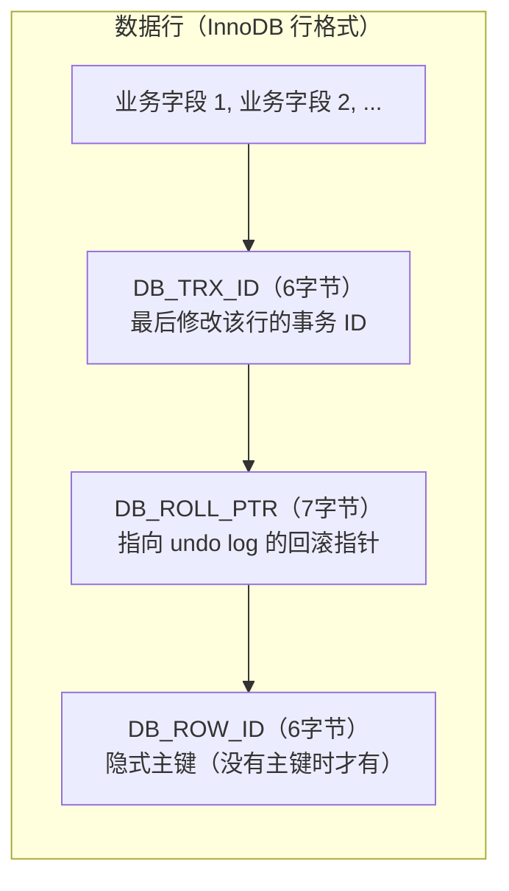

- `DB_TRX_ID`（6字节）：最后一次修改（insert/update/delete）该行的事务 ID
- `DB_ROLL_PTR`（7字节）：指向 undo log 中该行上一个版本的指针（回滚指针，构成版本链）
- `DB_ROW_ID`（6字节）：隐式主键（没有显式主键时才生成）

**2. undo log（回滚日志）**

保存数据的历史版本，形成版本链。每次修改把旧版本写入 undo log，通过回滚指针串联起来。

**版本链示意图：**

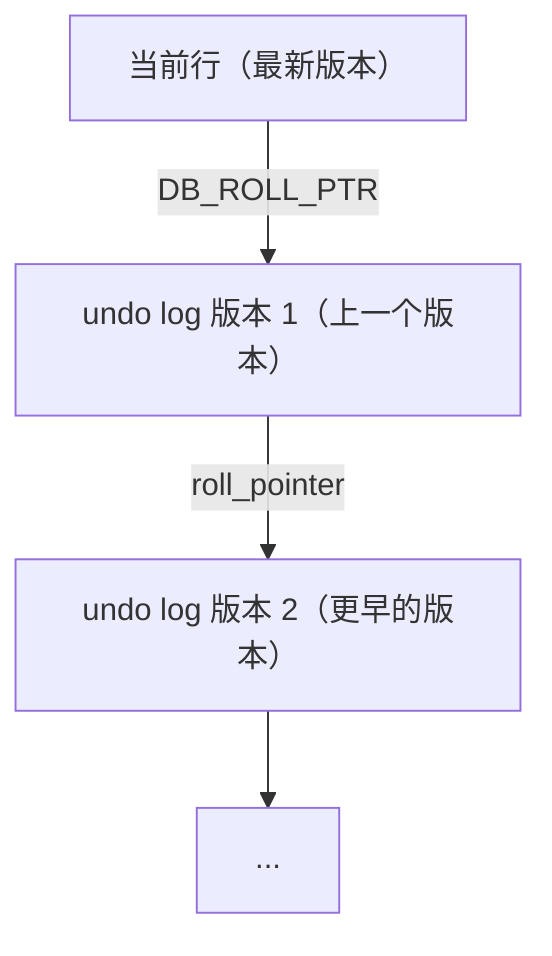

每次事务修改数据：把旧值写入 undo log → 修改当前行的 DB_TRX_ID 和 DB_ROLL_PTR → 指向新的 undo log 节点

**3. ReadView（读视图）**

判断事务能看到哪些版本的数据。包含四个关键信息：

| 字段 | 含义 |
|------|------|
| `m_ids` | 生成 ReadView 时，当前活跃（未提交）的事务 ID 列表 |
| `min_trx_id` | 活跃事务中最小的 ID |
| `max_trx_id` | 下一个要分配的事务 ID（即最大活跃事务 ID + 1） |
| `creator_trx_id` | 生成 ReadView 的事务自己的 ID |

**可见性判断规则（从当前版本沿着版本链往前找）：**

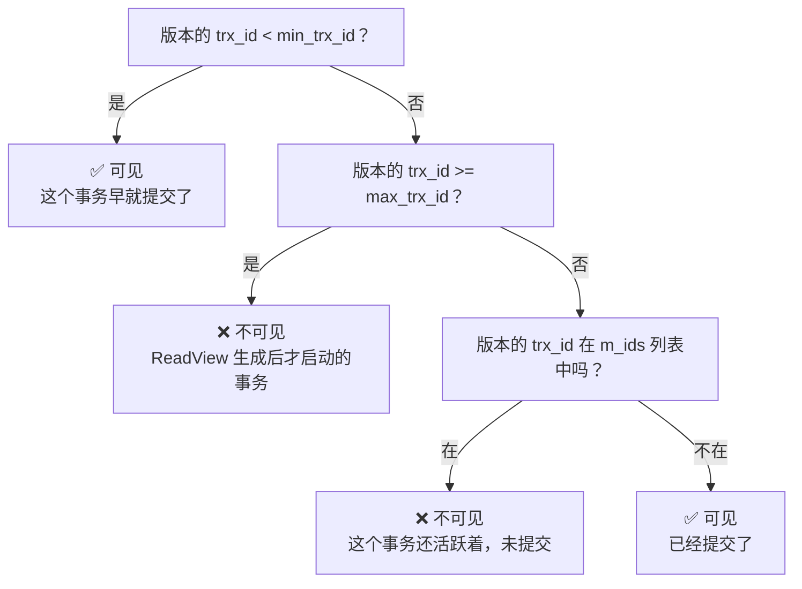

简单理解：**比 ReadView 创建时所有活跃事务都早的版本可见，晚的不可见。**

**RC 和 RR 在 MVCC 上的区别（核心考点）：**

| 隔离级别 | ReadView 生成时机 | 效果 |
|---------|-----------------|------|
| **RC** | **每次** SELECT 都生成一个新的 ReadView | 能看到其他事务刚提交的修改 → 不可重复读 |
| **RR** | 事务中**第一次** SELECT 生成，后续复用同一个 | 看不到其他事务的新提交 → 可重复读 |

**快照读 vs 当前读：**

- **快照读（Snapshot Read）**：普通的 SELECT 语句，读取的是数据的可见版本（可能是历史版本），不加锁。走 MVCC
- **当前读（Current Read）**：`SELECT ... FOR UPDATE`、`SELECT ... LOCK IN SHARE MODE`、`INSERT`、`UPDATE`、`DELETE`，读取的是**最新版本**的数据，需要加锁。走 LBCC（Lock-Based Concurrency Control）

> ⚠️ 勘误：很多资料说"MVCC 只在 RR 级别下存在"或"MVCC 是 RR 独有的"，这是错误的。**RC 和 RR 都使用 MVCC**，区别在于 ReadView 的生成时机不同。另外，MVCC 主要针对**快照读**（普通 SELECT），当前读走的是锁机制。

### Q：MVCC 能解决幻读吗？

这是一个高频争议问题，需要分情况说明（**面试必须答出层次**）：

**快照读（普通 SELECT）场景：**
- 在 RR 级别下，MVCC 通过复用同一个 ReadView，使得事务内每次查询看到的数据版本都是一致的
- 不会看到其他事务新插入的数据
- 所以快照读层面"避免"了幻读

**当前读（SELECT ... FOR UPDATE / UPDATE / DELETE / INSERT）场景：**
- MVCC 管不到当前读，当前读读取的是最新版本的数据
- 靠 **Next-Key Lock（Record Lock + Gap Lock）** 来防止其他事务在查询范围内插入新数据
- 从而在当前读层面解决幻读

**关键注意点：快照读和当前读混用可能出现"幻读"现象**

```mermaid
sequenceDiagram
    participant A as 事务 A
    participant B as 事务 B

    Note over A: BEGIN;
    A->>A: SELECT * FROM t WHERE id > 10;<br/>快照读，得到 5 条

    Note over B: BEGIN;
    B->>B: INSERT INTO t VALUES(11, 'x');
    Note over B: COMMIT;

    A->>A: SELECT * FROM t WHERE id > 10;<br/>快照读，还是 5 条（ReadView 没变）

    A->>A: UPDATE t SET name='y' WHERE id=11;<br/>当前读！居然更新成功了！<br/>刚才快照读还说没有 id=11 的行

    A->>A: SELECT * FROM t WHERE id > 10;<br/>快照读，变成 6 条了！<br/>（自己更新了，版本链中加入了自己的修改）

    Note over A: 这就是"幻读"现象——<br/>虽然 RR 基本解决了幻读，<br/>但在快照读+当前读混用场景下仍可能出现
```

**总结（标准答案）：**

> MySQL InnoDB 的 RR 级别下：
> - **纯快照读** → 不会有幻读（MVCC，ReadView 不变）
> - **纯当前读** → 不会有幻读（Next-Key Lock，间隙锁防止插入）
> - **快照读 + 当前读混用** → 可能出现幻读现象
>
> 这是 InnoDB RR 的已知特性，不是 bug。实际业务中如果需要严格防止幻读，应该统一使用当前读（加锁）或使用串行化隔离级别。

> ⚠️ 勘误：很多资料要么说"MVCC 完全解决了幻读"，要么说"MVCC 不能解决幻读，只有间隙锁才能解决"。这两种说法都不准确。正确的说法是：**快照读靠 MVCC 解决，当前读靠 Next-Key Lock 解决**，两者配合才能在 RR 级别下"基本"解决幻读。

### Q：InnoDB 事务的实现原理（ACID 实现）？

- **原子性**：通过 undo log 实现。修改数据前先把旧值写入 undo log，事务失败/回滚时，用 undo log 反向回滚
- **隔离性**：通过 MVCC（快照读）+ 锁机制（当前读）实现
- **持久性**：通过 redo log + force log at commit 机制实现。事务提交前先把 redo log 刷到磁盘，即使数据页还没刷盘就宕机，重启后也能通过 redo log 恢复
- **一致性**：是最终目标，由 A+I+D + 业务约束共同保障

---

## 第四章 锁机制

### Q：MySQL 有哪些锁？按粒度/类别分别说

**按锁的粒度分：**
- **行级锁（Row Lock）**：锁定粒度最小，只锁当前操作的行。并发度最高，但加锁开销大、可能死锁。InnoDB 支持
- **表级锁（Table Lock）**：锁定粒度最大，直接锁整张表。开销小、加锁快、不会死锁，但并发度低。MyISAM 默认使用，InnoDB 也支持
- **页级锁（Page Lock）**：粒度介于行和表之间，锁定相邻的一组记录。BDB 引擎使用，现已少见

**按锁的功能/类别分：**
- **共享锁（S 锁 / 读锁）**：多个事务可以同时持有，互不阻塞。加锁方式：`SELECT ... LOCK IN SHARE MODE`（8.0 起是 `FOR SHARE`）
- **排他锁（X 锁 / 写锁）**：只能有一个事务持有，与其他所有锁都冲突。加锁方式：`SELECT ... FOR UPDATE`；UPDATE/DELETE/INSERT 自动加 X 锁

**兼容性矩阵：**

| 锁类型 | S 锁（共享） | X 锁（排他） |
|--------|:-----------:|:-----------:|
| S 锁   |    ✅ 兼容   |   ❌ 冲突   |
| X 锁   |   ❌ 冲突   |   ❌ 冲突   |

**按思想/策略分：**
- **悲观锁**：假设一定会发生并发冲突，操作前先加锁。实现：数据库行锁、表锁、`for update`
- **乐观锁**：假设不会发生冲突，操作时不加锁，提交时检查是否冲突。实现：版本号、CAS

**InnoDB 行锁的三种算法（高频考点）：**

| 算法 | 锁定范围 | 说明 |
|------|---------|------|
| **Record Lock** | 单个行记录 | 主键/唯一索引等值查询，且精确匹配时 |
| **Gap Lock** | 间隙（不包括记录本身） | 锁住两个索引记录之间的空隙，防止插入 |
| **Next-Key Lock** | 记录 + 间隙 | Record + Gap，InnoDB 默认行锁算法，左开右闭 |

> ⚠️ 易错点：InnoDB 的行锁**是基于索引实现的**，如果 SQL 没有走索引，会升级为表锁（扫描全表并对所有记录加锁）。很多人忽略了这个前提。

### Q：InnoDB 行锁是怎么实现的？

InnoDB 行锁是**基于索引**实现的。具体来说，是通过给索引上的记录加锁来实现行锁。

**加锁过程：**

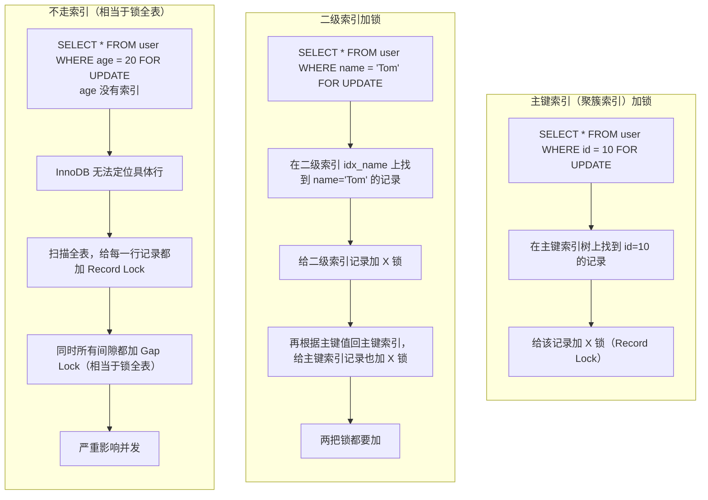

> ⚠️ 易错点：很多人说"InnoDB 支持行锁所以并发高"，但有前提——必须用到索引。没有索引的更新操作，InnoDB 实际上是表锁，并发性能还不如 MyISAM。

### Q：什么是 Next-Key Lock？加锁范围怎么算？（深度题）

**Next-Key Lock** 是 InnoDB 默认的行锁算法 = Record Lock + Gap Lock。锁定的是一个**左开右闭 (]** 区间。

**为什么需要 Next-Key Lock？**
- 在 RR 隔离级别下，为了解决当前读的幻读问题
- 只锁记录本身（Record Lock）不够，其他事务还可以在间隙中插入新数据 → 幻读
- 所以把记录和它前面的间隙一起锁住，就防止了在范围内插入新行

**加锁范围示例：**

假设有一个表，id 是主键，已有记录：10, 20, 30, 40, 50

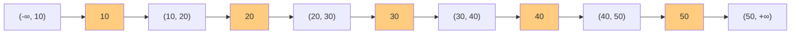

索引记录（橙色）与间隙（白色）示意：记录之间的空隙就是间隙，Next-Key Lock 锁住「记录 + 左边间隙」。

| 查询语句 | 加锁类型 | 锁定范围 |
|---------|---------|---------|
| `WHERE id = 10 FOR UPDATE` | Record Lock（唯一索引等值匹配） | 只锁 id=10 这一行 |
| `WHERE id = 15 FOR UPDATE` | Gap Lock（不存在的记录） | 锁 (10, 20) 这个间隙 |
| `WHERE id > 20 FOR UPDATE` | Next-Key Lock | 锁 (20,30] + (30,40] + (40,50] + (50,+∞) |
| `WHERE id >= 20 FOR UPDATE` | Next-Key Lock | 锁 [20,30] + (30,40] + ... |
| `WHERE id < 30 FOR UPDATE` | Next-Key Lock | 锁 (-∞,10] + (10,20] + (20,30) |

**加锁的详细规则（加分项）：**

1. **唯一索引 + 等值查询 + 命中记录** → 退化为 **Record Lock**（只锁记录本身，不需要间隙锁，因为唯一索引不会有重复值）
2. **唯一索引 + 等值查询 + 未命中** → 退化为 **Gap Lock**（只锁那个间隙）
3. **唯一索引 + 范围查询** → **Next-Key Lock**（左开右闭）
4. **普通索引 + 等值查询 + 命中** → **Next-Key Lock**（记录 + 前面的间隙），并且还有下一个间隙的 Gap Lock？（实际是锁定记录+左边间隙，右边间隙看情况）
5. **普通索引 + 范围查询** → **Next-Key Lock**
6. **没有索引** → 全表所有记录 + 所有间隙都加锁（相当于表锁）

> ⚠️ 易错点：① 间隙锁之间是**兼容的**（不互斥）——多个事务可以同时对同一个间隙加间隙锁，它们共同阻止的是插入操作。这也是间隙锁容易产生死锁的原因。② 间隙锁只在 RR 级别存在，RC 级别没有间隙锁（除了外键约束和唯一键检查的场景）。

### Q：什么是悲观锁和乐观锁？怎么实现？

**悲观锁（Pessimistic Lock）：**
- 思想：假设并发冲突一定会发生，操作前先加锁，阻塞其他事务
- 实现方式：数据库的行锁、表锁；`SELECT ... FOR UPDATE`
- 适用场景：写多读少、冲突概率高的场景
- 缺点：加锁开销大、可能死锁、降低并发

**乐观锁（Optimistic Lock）：**
- 思想：假设冲突很少发生，操作时不加锁，提交时才检查是否有冲突
- 实现方式：
  - **版本号机制**：加 `version` 字段，更新时 `WHERE version = 旧version`，影响行数为 0 则表示冲突
  - **CAS 算法**：Compare And Swap，本质和版本号类似
- 适用场景：读多写少、冲突概率低的场景
- 缺点：冲突多时重试成本高

**版本号乐观锁示例：**
```sql
-- 初始：UPDATE goods SET count = count - 1, version = version + 1
--       WHERE id = 1 AND version = 旧版本号;
UPDATE goods 
SET count = count - 1, version = version + 1
WHERE id = 1 AND version = 3;
-- 执行后看影响行数，如果是 0 说明版本号不对（有人改过了），需要重试
```

> ⚠️ 易错点：乐观锁不是数据库原生的锁机制，而是一种并发控制思想，通常在应用层实现。版本号字段是业务层面自己加的，不是数据库自动维护的。

### Q：什么是死锁？怎么排查和解决？

**死锁**：两个或多个事务互相持有对方需要的锁，同时请求对方持有的锁，导致循环等待，事务都无法继续执行。

**死锁的四个必要条件：**
1. **互斥条件**：资源不能共享，一次只能一个事务使用
2. **请求与保持**：事务持有部分资源的同时还请求新的资源
3. **不可剥夺**：已获得的资源不能被强行剥夺，只能自己释放
4. **循环等待**：事务之间形成头尾相接的循环等待链

**死锁示例：**
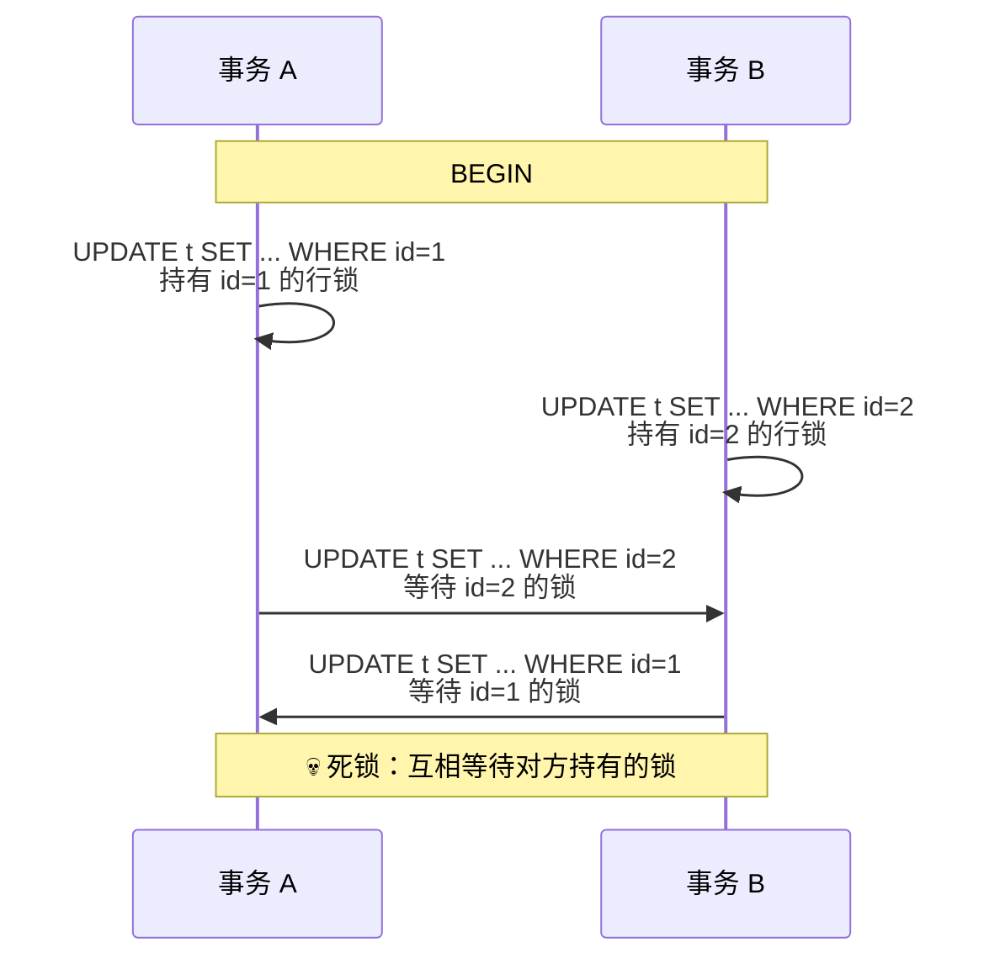

**排查方式：**
- `SHOW ENGINE INNODB STATUS`：查看最近一次死锁的详细信息（死锁日志，包含两个事务各自持有什么锁、等待什么锁）
- `SELECT * FROM INFORMATION_SCHEMA.INNODB_TRX`：查看当前正在运行的事务
- `SELECT * FROM INFORMATION_SCHEMA.INNODB_LOCKS`：查看当前持有的锁
- `SELECT * FROM INFORMATION_SCHEMA.INNODB_LOCK_WAITS`：查看锁等待关系
- 打开死锁日志：`SET GLOBAL innodb_print_all_deadlocks = 1`，将所有死锁记录到 error log
- 生产环境用 PT 工具或监控系统采集死锁信息

**InnoDB 死锁检测：**
- InnoDB 有自动死锁检测机制
- 检测到死锁后，会选择**代价最小**的事务回滚（通常是影响行数少的那个）
- 死锁检测有开销：每次加锁都要检查是否会形成死锁，高并发下可能成为性能瓶颈（`innodb_deadlock_detect`）

**解决/避免死锁的方法：**
1. **固定加锁顺序**：所有事务按相同顺序访问资源（如按 ID 从小到大加锁）→ 破坏循环等待条件
2. **缩小事务范围**：事务尽量短，减少锁持有时间 → 降低冲突概率
3. **合理使用索引**：避免无索引导致的表锁，减少锁范围 → 减少冲突
4. **使用更低的隔离级别**：如 RC 级别没有间隙锁，死锁概率更低 → 互联网公司常用 RC
5. **使用乐观锁替代悲观锁** → 从思想上避免锁冲突
6. **设置锁等待超时**：`innodb_lock_wait_timeout`，超时后自动回滚 → 兜底机制
7. **批量操作时尽量排序后再执行** → 固定加锁顺序

> ⚠️ 易错点：死锁不是 InnoDB 独有的，但 InnoDB 有自动检测机制。MyISAM 不支持死锁检测，只能靠超时。另外，**间隙锁是死锁的高发原因**（因为间隙锁之间兼容，两个事务都加了同一个间隙锁，然后都想插入就会死锁），RC 级别没有间隙锁所以死锁少很多。

### Q：SELECT ... FOR UPDATE 有什么含义？锁表还是锁行？

`SELECT ... FOR UPDATE` 是一种**当前读**，会对查询结果集加**排他锁（X 锁）**，其他事务不能再加 S 锁或 X 锁，必须等待。

**锁行还是锁表取决于是否走索引：**

| 场景 | 加锁类型 | 说明 |
|------|---------|------|
| 走主键/唯一索引，等值查询，命中 | Record Lock | 只锁匹配行 |
| 走主键/唯一索引，等值查询，未命中 | Gap Lock | 锁那个间隙 |
| 走普通索引，等值查询 | Next-Key Lock | 记录 + 左边间隙 |
| 范围查询 | Next-Key Lock | 多个行 + 间隙 |
| 不走索引 | 全表锁（所有行+所有间隙） | 相当于表锁，极其影响并发 |

> ⚠️ 易错点：很多人以为 `for update` 一定是行锁，其实不是。条件列没有索引时会锁全表，这是生产环境常见的性能坑。

### Q：什么是间隙锁（Gap Lock）？有什么作用？

**间隙锁**：锁定索引记录之间的"间隙"，防止其他事务在间隙中插入新记录。是 Next-Key Lock 的一部分。

**关键点：**
- 只在 **RR 隔离级别**下存在（RC 级别没有间隙锁，除非外键约束和唯一键检查）
- **作用**：解决幻读问题（当前读场景下）
- **间隙锁之间不冲突**：一个事务加了间隙锁，另一个事务也可以在同一个间隙加间隙锁。它们共同阻止的是插入操作
- **加锁范围**：Gap Lock 是**开区间 (a, b)**，Next-Key Lock 是**左开右闭 (a, b]**

**间隙锁导致死锁的经典案例：**
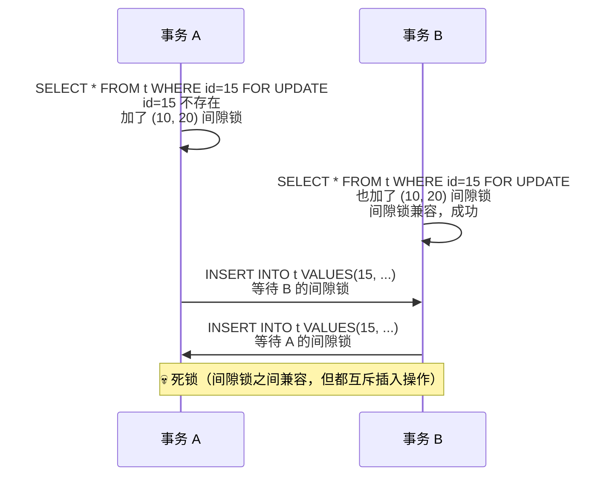

> ⚠️ 易错点：间隙锁之间是**兼容的（不互斥）**，它们互斥的是"插入操作"。很多资料误以为间隙锁之间也会冲突，这是错误的。

---

## 第五章 日志系统

### Q：MySQL 有哪些日志？分别有什么作用？

核心日志有三种，合称**三大日志**：

| 日志 | 作用 | 所属层级 | 物理/逻辑 | 写入方式 |
|------|------|---------|----------|---------|
| **redo log** | 保证事务持久性，崩溃恢复 | InnoDB 引擎层 | 物理日志（页的修改） | 循环写（空间固定） |
| **undo log** | 保证事务原子性（回滚）+ MVCC 多版本 | InnoDB 引擎层 | 逻辑日志（反向操作） | 追加写，purge 线程清理 |
| **binlog** | 主从复制、数据备份恢复 | Server 层（所有引擎） | 逻辑日志（SQL/行变更） | 追加写（写完一个写下个） |

还有其他日志：
- **error log**：错误日志，MySQL 启动/运行/关闭过程中的错误信息
- **slow query log**：慢查询日志，记录执行时间超过 `long_query_time` 的 SQL
- **general log**：通用查询日志，记录所有 SQL（生产一般不开，性能影响大）
- **relay log**：中继日志，从库用于存放从主库拉取的 binlog
- **audit log**：审计日志（企业版功能）

> ⚠️ 易错点：很多面试者把 redo log 和 binlog 混淆。记住：**redo log 是 InnoDB 的、物理日志、循环写、保持久性；binlog 是 Server 层的、逻辑日志、追加写、用做主从复制**。两者配合使用实现事务的两阶段提交。

### Q：redo log 是什么？WAL 机制？

**redo log（重做日志）**：InnoDB 引擎特有的物理日志，记录"哪个数据页做了什么修改"。用于保证事务的持久性和崩溃恢复。

**WAL（Write-Ahead Logging）机制：**
- 核心思想：**先写日志，再写磁盘**
- 修改数据时，不是直接把数据页写回磁盘，而是先写 redo log
- 后台线程在适当的时候再把修改后的数据页（脏页）刷回磁盘
- 这样即使中间宕机，重启后也可以通过 redo log 恢复还没刷盘的修改

**为什么要有 WAL？**
- 随机 I/O 慢，顺序 I/O 快
- 数据页刷盘是随机 I/O（数据分散在不同位置）
- redo log 是顺序写入磁盘的（追加写），比随机写快很多
- 先写 redo log（顺序写，快），再慢慢刷数据页（随机写，慢），整体性能更高

**redo log 的写入过程（简化版）：**

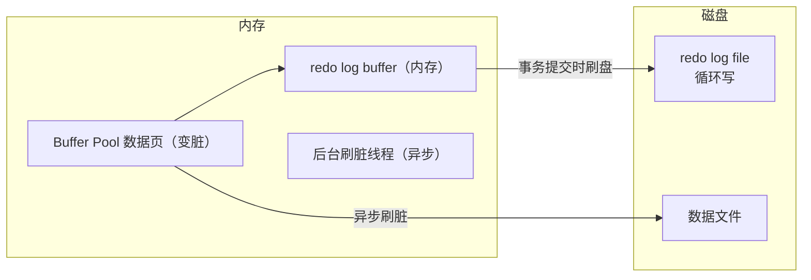

**redo log 是循环写的：**
- 有固定大小（如配置 4 个文件，每个 1GB，共 4GB）
- 写满了就从头开始写，循环往复
- 有两个关键位置：`write pos`（当前写到哪）、`checkpoint`（当前刷盘到哪）
- `write pos` 追上 `checkpoint` 说明 redo log 写满了，得先刷点脏页腾出空间才能继续写

> ⚠️ 易错点：redo log 不是"记录 SQL 语句"，而是记录**物理页的修改**（"第N号表空间第M号数据页的第X偏移量处的内容改成了Y"）。这是物理日志和逻辑日志的本质区别。

### Q：redo log 和 binlog 有什么区别？（高频考点）

| 特性 | redo log | binlog |
|------|----------|--------|
| 所属层级 | InnoDB 引擎层 | Server 层，所有存储引擎共用 |
| 日志类型 | 物理日志（数据页的修改） | 逻辑日志（SQL语句 / 行变更） |
| 写入方式 | 循环写（空间固定，写满覆盖） | 追加写（写完一个文件写下一个） |
| 作用 | 崩溃恢复、保证事务持久性 | 主从复制、数据备份恢复 |
| 内容格式 | 数据页变更记录（物理） | STATEMENT / ROW / MIXED 三种格式 |
| 提交时机 | 事务提交时刷盘（可配置） | 事务提交时写入（可配置策略） |
| 容量 | 固定大小（通常几 GB） | 可以无限增长（配置 max_binlog_size 切分） |

**为什么需要两份日志？**
- 因为 MySQL 是插件式架构，Server 层和引擎层是分开的
- binlog 是 Server 层的，只负责主从复制和备份，不管崩溃恢复
- redo log 是 InnoDB 引擎的，只负责自己的崩溃恢复，不了解其他引擎
- 两份日志各有各的职责，需要通过**两阶段提交**保证一致性

### Q：binlog 有几种录入格式？区别和优缺点？

三种格式：STATEMENT、ROW、MIXED。

**STATEMENT 模式：**
- 记录实际执行的 SQL 语句
- 优点：日志量小、节省 IO、便于阅读、易排查
- 缺点：
  - 某些函数（`UUID()`、`NOW()`、`LAST_INSERT_ID()`）在主从执行结果可能不一致
  - 触发器、存储过程可能导致不一致
  - `UPDATE ... WHERE ... LIMIT` 执行顺序不确定可能导致不一致

**ROW 模式（MySQL 5.7.7 起默认）：**
- 记录每一行数据的变更（修改前的值 + 修改后的值）
- 优点：**不会有数据不一致问题**，主从复制最可靠。是目前生产环境的标准配置
- 缺点：日志量大（特别是批量更新时），占用空间多，排查不如 STATEMENT 直观

**MIXED 模式：**
- 混合模式，一般语句用 STATEMENT，特殊情况（如调用 UUID()）自动切换为 ROW
- 兼顾两者优点，但判断逻辑复杂，实际用得不多

> ⚠️ 易错点：MySQL 5.7.7 及之后版本默认 binlog 格式是 **ROW**，不是 STATEMENT 也不是 MIXED。这是常见考点。另外，binlog_row_image 参数可以控制 ROW 模式下记录全量列还是只记录变更列（FULL vs MINIMAL）。

### Q：什么是两阶段提交（2PC）？为什么需要两阶段提交？

**两阶段提交（Two-Phase Commit）** 是 MySQL 为了保证 **redo log 和 binlog 两份日志的一致性**而设计的内部协调机制。

**为什么需要？**
因为 redo log 是 InnoDB 引擎的，binlog 是 Server 层的，两份日志各自独立写入。如果中间宕机：
- 可能 redo log 写了但 binlog 没写 → 主库恢复了数据，但从库没收到 binlog → 主从不一致
- 可能 binlog 写了但 redo log 没写 → 从库执行了，但主库恢复后没这条数据 → 主从不一致

所以需要一个协调机制保证两份日志要么都写成功，要么都失败。

**两阶段提交流程图：**

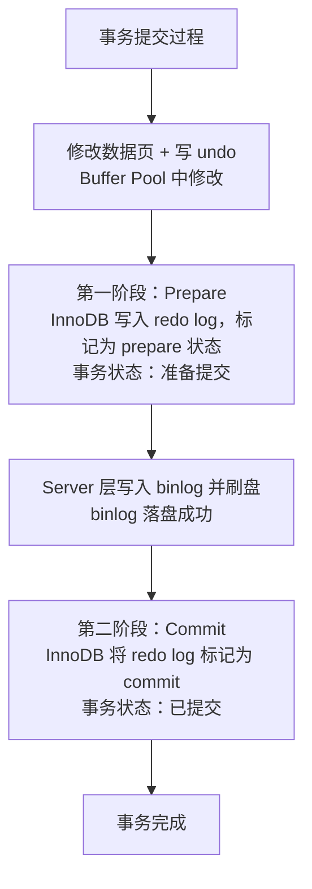

**崩溃恢复逻辑（如何判断事务该提交还是回滚）：**

| redo log 状态 | binlog 存在 | 处理方式 |
|-------------|------------|---------|
| commit 状态 | 是 | 直接提交，没问题 |
| prepare 状态 | 完整存在 | 提交事务（补 commit 标记） |
| prepare 状态 | 不存在 | 回滚事务 |

**如何判断 binlog 是否完整？**
- binlog 最后有一个 **XID event**（事务 ID），表示这个事务的 binlog 是完整的
- 如果 redo log 是 prepare 状态，且能在 binlog 中找到对应的 XID → 提交
- 找不到 → 回滚

> ⚠️ 易错点：MySQL 内部的两阶段提交不是分布式事务的 2PC，而是**同一个数据库内 redo log 和 binlog 之间的协调机制**。很多资料把它和分布式事务的 2PC 混为一谈，要注意区分。

### Q：什么是组提交（Group Commit）？（深度题）

**组提交（Group Commit）**：多个事务的日志刷盘操作合并成一次刷盘，减少磁盘 I/O 次数，提高并发性能。

**为什么需要组提交？**
- 每次事务提交都需要把 redo log / binlog 刷到磁盘（fsync）
- 磁盘 I/O 很贵，每次 fsync 只能处理一个事务的话，高并发下性能很差
- 组提交就是把"同一时刻"提交的多个事务的日志合并在一起，做一次 fsync

**两阶段提交与组提交的关系：**
- 早期 MySQL 的两阶段提交中，prepare 阶段是串行的，影响并发性能
- 后来引入了组提交优化，让多个事务可以一起完成 prepare 和 commit

**组提交的三个阶段（binlog 组提交）：**
1. **Flush 阶段**：多个事务把 binlog 从内存写到文件系统缓存（page cache）
2. **Sync 阶段**：统一调用 fsync 把 binlog 刷到磁盘（一次 fsync 刷多个事务）
3. **Commit 阶段**：依次通知各存储引擎提交事务

**刷盘相关的两个重要参数（常考）：**

| 参数 | 含义 | 值 | 说明 |
|------|------|----|------|
| `sync_binlog` | binlog 刷盘频率 | 0 | 由操作系统决定何时刷盘（性能最高，可能丢数据） |
| | | 1 | 每次事务提交都刷盘（最安全，默认值 5.7.7+） |
| | | N | 每 N 个事务刷一次盘 |
| `innodb_flush_log_at_trx_commit` | redo log 刷盘频率 | 0 | 每秒刷盘（性能最好，可能丢 1 秒数据） |
| | | 1 | 每次事务提交都刷盘（最安全，默认值） |
| | | 2 | 每次提交写到 page cache，每秒刷盘（折中） |

**"双1"配置**：`sync_binlog=1` + `innodb_flush_log_at_trx_commit=1`，是最安全的配置，但性能也是最差的。生产环境根据业务对数据安全性的要求调整。

### Q：undo log 有什么作用？

两个主要作用：
1. **事务回滚**：保证原子性。事务执行失败或 ROLLBACK 时，用 undo log 中保存的旧版本数据反向回滚
2. **MVCC 多版本**：存储数据的历史版本链，配合 ReadView 实现快照读，使得读写不冲突

**undo log 是逻辑日志**，记录的是"反向操作"。比如 INSERT 对应 DELETE，UPDATE 对应反向 UPDATE。

**undo log 的类型：**
- **insert undo log**：INSERT 操作产生的，事务提交后可以直接删除（因为只有自己能看到）
- **update undo log**：UPDATE/DELETE 操作产生的，事务提交后不能立即删除，因为可能还有其他事务需要这些版本（MVCC）

**undo log 的清理：**
- 由后台 **purge 线程**定期清理
- 确认没有任何事务还需要这些 undo log 版本后才会清理
- 如果有长事务一直不提交，可能导致 undo log 越来越大

> ⚠️ 易错点：undo log 不是每次提交就删除的。事务提交后 undo log 不会立即删除，而是放入 purge 队列，由后台 purge 线程在确认没有其他事务需要这些版本后才清理。**长事务是 undo log 膨胀的常见原因**。

---

## 第六章 Buffer Pool 与内存管理

### Q：什么是 Buffer Pool？为什么需要 Buffer Pool？（核心题）

**Buffer Pool（缓冲池）**：InnoDB 在内存中开辟的一块区域，用于缓存磁盘上的数据页和索引页。是 MySQL 性能的关键组件之一。

**为什么需要 Buffer Pool？**
- 磁盘 I/O 太慢（机械盘随机 I/O 几毫秒，内存是纳秒级，差了 6 个数量级）
- 如果每次查询都直接读磁盘，性能完全扛不住
- Buffer Pool 把热点数据缓存到内存，读请求直接从内存返回，速度提升几个数量级

**Buffer Pool 的大小**：
- 由 `innodb_buffer_pool_size` 控制
- 是 InnoDB 最重要的配置参数之一
- 一般建议设置为服务器内存的 50%~70%（给操作系统和其他进程留空间）

### Q：Buffer Pool 的结构？内部是怎么管理的？（深度题）

**Buffer Pool 内存结构示意图：**

```mermaid
graph TB
    subgraph BP["Buffer Pool（内存，128MB 起，可配置）"]
        direction TB

        subgraph Pages["数据页（默认每 16KB，和磁盘页一一对应）"]
            direction LR
            P1["页1"]
            P2["页2"]
            P3["页3"]
            P4["页4"]
            P5["页5"]
            PN["页N"]
            Dots["..."]
        end

        subgraph Lists["通过链表管理"]
            direction TB
            Free["Free List<br/>空闲页链表"]
            LRU["LRU List<br/>缓存页链表，冷热数据管理"]
            Flush["Flush List<br/>脏页链表，需要刷回磁盘的页"]
        end
    end
```

**三个核心链表：**

| 链表 | 作用 |
|------|------|
| **Free List** | 空闲页链表。Buffer Pool 初始化时所有页都在这里，需要读新页时从这里取 |
| **LRU List** | 缓存页链表，管理热点数据。用改进的 LRU 算法（分 young 和 old 两部分） |
| **Flush List** | 脏页链表。被修改过的页（脏页）按修改时间挂在这里，后台线程刷盘用 |

### Q：Buffer Pool 的 LRU 算法为什么要改进？（深度题）

**普通 LRU 的问题：**
传统 LRU 是把新访问的页放到链表头部，淘汰链表尾部的页。但有两个问题：

1. **预读失效**：InnoDB 有预读机制（Read Ahead），会提前把可能访问的页加载到 Buffer Pool。如果这些预读的页之后根本没被访问，却占了 LRU 头部位置，把真正的热点页挤出去了

2. **全表扫描污染**：执行全表扫描时，会把大量不常用的数据页加载进来，全部放到 LRU 头部，把热点数据全部挤出去，导致 Buffer Pool 命中率骤降

**改进的 LRU（Midpoint Insertion Strategy）：**
把 LRU List 分成两部分：
- **young 区（热数据区）**：占 5/8（`innodb_old_blocks_pct` 控制，默认 37%，即 old 区占 37%）
- **old 区（冷数据区）**：占 3/8

```mermaid
graph LR
    subgraph LRU["改进的 LRU List（Midpoint Insertion）"]
        direction LR
        H[head]
        subgraph young["young 区（热数据，占 5/8）"]
            Y1["经常访问的页"]
        end
        subgraph old["old 区（冷数据，占 3/8）"]
            O1["新数据从这里插入"]
        end
        T[tail]
        H --- Y1 --- O1 --- T
        MP["midpoint（约 5/8 位置）"]
    end
```

**改进的规则：**
1. 新页从 **old 区的头部**插入（而不是整个 LRU 的头部）
2. 只有在 old 区被访问**且**距离首次加载超过 `innodb_old_blocks_time`（默认 1000ms）的页，才会被提升到 young 区头部
3. young 区的页被访问时，只有当它在 young 区的前 1/4 以外时，才会移到头部（减少链表移动开销）

**效果：**
- 预读的页如果没被后续访问，就一直待在 old 区，很快被淘汰，不会影响 young 区的热点数据
- 全表扫描的大量数据页进入 old 区，停留时间短，不会污染热数据

### Q：什么是脏页？什么时候刷脏？

**脏页（Dirty Page）**：Buffer Pool 中被修改过的、与磁盘上数据不一致的页。修改是先改内存中的页，不是直接写磁盘。

**刷脏（Flush）**：把脏页写回磁盘，使内存和磁盘数据一致的过程。

**什么时候触发刷脏？**

| 触发时机 | 说明 |
|---------|------|
| **后台线程定期刷** | 正常情况，后台 Master Thread 异步刷脏，不影响前台事务 |
| **redo log 写满** | write pos 追上 checkpoint，必须先刷一部分脏页推进 checkpoint |
| **Buffer Pool 不足** | 没有空闲页了，需要淘汰一些页，淘汰脏页前必须先刷盘 |
| **MySQL 正常关闭** | 关闭前把所有脏页刷回磁盘 |
| **手动触发** | `FLUSH TABLES` 等命令 |

**刷脏的性能影响：**
- 如果刷脏太慢 →  redo log 写满 → 前台所有写操作被阻塞（等刷脏腾出空间）→ 性能抖动
- 所以要合理配置 Buffer Pool 大小和刷脏策略，避免出现"性能尖刺"

### Q：Buffer Pool 命中率怎么看？多少算正常？

**查看命中率：**
```sql
SHOW STATUS LIKE 'Innodb_buffer_pool_read%';
```

| 变量 | 含义 |
|------|------|
| `Innodb_buffer_pool_read_requests` | 从 Buffer Pool 中读取的请求数（逻辑读） |
| `Innodb_buffer_pool_reads` | 从磁盘读取的请求数（物理读） |

**命中率计算公式：**
```
命中率 = (1 - 物理读 / 逻辑读) × 100%
```

**正常范围：**
- 生产环境一般要求 **99% 以上**（越高越好）
- 低于 95% 就需要考虑增加 Buffer Pool 大小或优化查询

**Buffer Pool 大小建议：**
- 数据量 < 内存 → Buffer Pool 可以存下所有数据，命中率接近 100%
- 数据量 > 内存 → 取决于热点数据比例，一般也要保证 98%+

---

## 第七章 SQL 优化与性能调优

### Q：Explain 怎么看？各列的含义？（必背）

使用 `EXPLAIN + SQL 语句` 查看执行计划。

**重点列详解：**

| 列名 | 含义 | 关注点 |
|------|------|--------|
| **id** | 查询中各子句的执行顺序 | id 越大越先执行；id 相同从上到下；id 为 NULL 是结果集 |
| **select_type** | 查询类型 | SIMPLE / PRIMARY / SUBQUERY / DERIVED / UNION / UNION RESULT |
| **table** | 操作的表 | 可能是表名、别名、衍生表 |
| **type** | 访问类型（重要！性能从好到差） | system > const > eq_ref > ref > range > index > ALL |
| **possible_keys** | 可能用到的索引 | 只是可能，不一定用 |
| **key** | 实际使用的索引 | NULL 表示没用到索引 |
| **key_len** | 索引使用的字节数 | 判断联合索引用了多少个字段 |
| **ref** | 与索引比较的列/常量 | const 表示常量，字段名表示关联列 |
| **rows** | 估算需要扫描的行数 | 越少越好 |
| **Extra** | 额外信息（非常重要！） | Using index / Using where / Using filesort 等 |

**type 列详解（从好到差）：**
- `system`：表只有一行（系统表），几乎碰不到
- `const`：主键或唯一索引等值查询，最多一条匹配。速度极快
- `eq_ref`：联表时用主键/唯一索引关联。被驱动表每次只匹配一行
- `ref`：普通非唯一索引等值查询。可能匹配多行
- `range`：索引范围查询（between、in、>、< 等）
- `index`：扫描全索引树（比 ALL 快一点因为索引文件比数据文件小）
- `ALL`：全表扫描，最差

**Extra 列常见值：**
- `Using index`：使用了覆盖索引，无需回表 ✅
- `Using where`：需要回表后用 WHERE 过滤
- `Using index condition`：使用了索引下推 ICP ✅
- `Using filesort`：需要外部排序，无法用索引排序 ❌（需优化）
- `Using temporary`：使用了临时表 ❌（需优化）
- `Using join buffer`：被驱动表用不上索引，用了连接缓冲区 ❌

> ⚠️ 易错点：阿里开发手册说"至少要达到 range 级别，要求是 ref 级别"，这是对业务查询的推荐值。不是所有查询都必须 ref 以上，比如范围查询 type 就是 range，是正常的。另外，`key_len` 的计算也是常考题，要会根据字段类型和字符集算出来。

### Q：key_len 怎么计算？（手撕题）

`key_len` 表示索引使用的字节数，可以用来判断联合索引实际用到了几个字段。

**计算规则：**

| 类型 | 字节数 | 说明 |
|------|--------|------|
| tinyint | 1 | 1字节整数 |
| smallint | 2 | 2字节整数 |
| int | 4 | 4字节整数 |
| bigint | 8 | 8字节整数 |
| float | 4 | 单精度浮点 |
| double | 8 | 双精度浮点 |
| char(n) utf8 | n × 3 | 定长字符，utf8 每个字符 3 字节 |
| char(n) utf8mb4 | n × 4 | utf8mb4 每个字符 4 字节 |
| varchar(n) utf8 | n × 3 + 1~2 | 变长字符 + 长度前缀（≤255用1字节，>255用2字节） |
| varchar(n) utf8mb4 | n × 4 + 1~2 | 同上 |
| 允许 NULL | +1 | NULL 标识位，1 字节 |
| decimal | 不定 | 每 9 位数字占 4 字节，剩余数字另算 |

**示例：**
```
索引 idx_name_age(name varchar(20) not null, age int, addr varchar(50))
字符集 utf8

name: varchar(20) not null, utf8
     = 20 × 3 + 1（长度前缀，<=255） + 0（not null）
     = 61 字节

age: int not null
     = 4 + 0 = 4 字节

addr: varchar(50) NULL, utf8
     = 50 × 3 + 1 + 1（NULL标识）
     = 152 字节

key_len = 61 + 4 + 152 = 217 字节
```

### Q：SQL 优化的一般步骤是什么？

1. **定位慢 SQL**：开启慢查询日志（slow_query_log），设置 long_query_time（默认 10 秒，可调到 1 秒或更短）
2. **分析执行计划**：用 EXPLAIN 查看 SQL 走没走索引、扫描行数、有没有 filesort/temporary
3. **优化索引**：
   - 确保 WHERE/ORDER BY/GROUP BY/JOIN 的列有索引
   - 考虑联合索引、覆盖索引
   - 避免索引失效场景
4. **优化 SQL 语句**：
   - 避免 `SELECT *`，只查需要的列
   - 避免在索引列上做运算/函数
   - 用 UNION ALL 代替 OR（两边都有索引时）
   - 用 JOIN 代替子查询（视具体情况）
   - 分页优化（延迟关联等）
5. **优化表结构**：选择合适的数据类型、适度冗余、垂直拆分
6. **架构层面**：读写分离、分库分表、缓存

### Q：超大分页（limit 1000000, 10）怎么优化？

**原理**：LIMIT offset, n 需要先扫描 offset + n 条数据，然后丢弃前 offset 条。offset 越大，扫描越多，越慢。

**优化方案：**

1. **基于主键的游标分页**（ID 连续递增时）：
   ```sql
   SELECT * FROM t WHERE id > 1000000 LIMIT 10;
   ```
   利用主键索引，只扫 10 行。但不支持跳页（只能下一页/上一页）

2. **延迟关联（子查询优化）**：
   ```sql
   SELECT a.* FROM t a
   INNER JOIN (SELECT id FROM t WHERE 条件 LIMIT 1000000, 10) b
   ON a.id = b.id;
   ```
   先用覆盖索引找到目标行的 id（子查询走覆盖索引，快），再回表关联 10 条数据

3. **业务层限制**：限制最大翻页数（如最多 100 页），不允许直接跳转到很深的页
4. **缓存**：热点分页数据缓存到 Redis
5. **搜索引擎**：深度分页的搜索场景走 ES 等搜索引擎

> ⚠️ 易错点：方案 1（游标分页）只能用在 ID 连续且有序的场景，如果有删除操作导致 ID 不连续，每页数量会不一致。而且不支持"跳页"。

### Q：慢查询怎么优化？

**排查思路：**
1. **开启慢查询日志**，找到具体哪些 SQL 慢
   ```sql
   SET GLOBAL slow_query_log = 'ON';
   SET GLOBAL long_query_time = 1;  -- 超过1秒就记录
   ```
2. **EXPLAIN 分析执行计划**，看 type、key、rows、Extra
3. **对症下药**：
   - 没走索引 → 加索引
   - 索引失效 → 优化 SQL 写法
   - filesort → 让排序字段走索引
   - 回表太多 → 覆盖索引
   - 数据量实在太大 → 分库分表

**慢查询分析工具：**
- `mysqldumpslow`：MySQL 自带
- `pt-query-digest`：Percona 工具，功能强大
- 数据库监控平台（如 Prometheus + Grafana + slow query exporter）

### Q：一条 SQL 执行很慢，怎么从哪些方面入手优化？

分层面排查：
1. **SQL 语句层面**：是否全表扫描？是否索引失效？是否 select *？是否不必要的 join？
2. **索引层面**：索引是否合理？联合索引顺序是否正确？区分度够不够？
3. **数据量层面**：单表是否过大？是否需要分库分表？
4. **配置层面**：Buffer Pool 大小是否合适？连接数够不够？排序缓冲区？
5. **架构层面**：是否需要缓存？读写分离？
6. **业务层面**：是否可以限定查询范围？是否可以异步化？是否必须实时？

### Q：MySQL 服务器性能分析常用命令？

- `show processlist` / `show full processlist`：查看当前所有连接和执行中的 SQL
- `show status`：查看服务器状态变量（全局/会话级）
- `show engine innodb status`：InnoDB 引擎详细状态（含死锁、缓冲池、事务等）
- `explain`：查看执行计划
- `slow query log`：慢查询日志
- `show variables`：查看系统变量
- `analyze table`：更新统计信息
- `show index from t`：查看索引信息（含基数）
- 操作系统层面：`top`、`iostat`、`vmstat`、`dstat`

### Q：实战案例：一条订单查询 SQL 如何从 3 秒优化到 10 毫秒？

**场景：** 订单表 order 有 2000 万条数据，查询 `SELECT * FROM order WHERE user_id = 123 AND status = 1 ORDER BY create_time DESC LIMIT 10` 耗时 3 秒。

**优化步骤：**

**第一步：EXPLAIN 分析**
- type: ALL（全表扫描）
- rows: 20000000
- Extra: Using where; Using filesort

**第二步：分析问题**
- `user_id` 没有索引 → 全表扫描
- `status` 区分度低（大部分订单都是已完成状态）
- `ORDER BY create_time` 没走索引 → filesort

**第三步：加联合索引**
```sql
-- 方案：加联合索引 idx_user_status_createtime(user_id, status, create_time)
ALTER TABLE `order` ADD INDEX idx_user_status_createtime(user_id, status, create_time);
```

为什么这么建？
- `user_id` 放最左：等值查询，区分度高（一个用户的订单只占很小比例）
- `status` 放中间：等值查询，进一步过滤
- `create_time` 放最后：排序用，索引有序可避免 filesort

**第四步：再 EXPLAIN**
- type: ref
- key: idx_user_status_createtime
- rows: 几百（该用户的订单数）
- Extra: Using where（有了索引之后的情况）

**第五步：进一步优化——覆盖索引**
如果查询列不多，考虑覆盖索引进一步减少回表：
```sql
-- 不查 *, 只查需要的列
SELECT id, order_no, amount, create_time 
FROM order WHERE user_id = 123 AND status = 1 ORDER BY create_time DESC LIMIT 10;
-- 同时把索引扩展为 (user_id, status, create_time, order_no, amount)
-- 或者尽量让查询列少，利用二级索引+主键减少回表
```

**优化结果：** 3 秒 → 10 毫秒，300 倍性能提升。

> 💡 **优化总结心法**：全表扫描 → 加索引 → 减少扫描行数 → 覆盖索引减少回表 → 从架构层面解决。核心思路是**减少 I/O 次数和数据量**。

---

## 第八章 存储引擎

### Q：InnoDB 和 MyISAM 的区别？（高频考点）

| 特性 | MyISAM | InnoDB |
|------|--------|--------|
| 事务 | ❌ 不支持 | ✅ 支持 |
| 锁粒度 | 表级锁 | 行级锁 + 表级锁（默认行锁） |
| 外键 | ❌ 不支持 | ✅ 支持 |
| 索引结构 | 非聚簇索引 | 聚簇索引（主键）+ 非聚簇索引（二级） |
| 存储文件 | .frm（表定义）.MYD（数据）.MYI（索引） | .frm（表定义）.ibd（数据+索引，独立表空间） |
| 全文索引 | ✅ 原生支持 | MySQL 5.6+ 也支持了 |
| 哈希索引 | ❌ | 自适应哈希索引（AHI，引擎自动维护） |
| count(*) 无 WHERE | 极快（维护了计数器变量） | 需要扫描统计（MVCC 原因，每个事务看到的行数不同） |
| 崩溃恢复 | 较差，可能丢数据 | 好（redo log + undo log + 双写缓冲） |
| MVCC | ❌ 不支持 | ✅ 支持 |
| 默认引擎 | MySQL 5.1 及之前 | MySQL 5.5 及之后 |
| 适用场景 | 读多写少、无事务需求 | 通用、有事务需求、并发高 |

> ⚠️ 勘误：很多旧资料说"InnoDB 不支持全文索引"，实际上 MySQL 5.6 起 InnoDB 就支持全文索引了。还有的资料说"MyISAM 的 count(*) 比 InnoDB 快很多"，这个结论只在**没有 WHERE 条件**的全表 count 时成立，有 WHERE 条件时两者差不多，都要扫描。

### Q：InnoDB 引擎的四大特性？

1. **插入缓冲（Insert Buffer / Change Buffer）**：
   - 对**非唯一二级索引**的插入/更新操作，先写入 Change Buffer，不直接插入索引页
   - 后台合并（merge）后批量写入磁盘，减少随机 I/O
   - 现在已升级为 **Change Buffer**，支持 INSERT/DELETE/UPDATE
   - 适用：写多读少的场景（如日志、流水表）；读多写少反而可能增加合并开销

2. **二次写（Double Write）**：
   - 页写入磁盘前先写到 doublewrite buffer（共享表空间的 2MB 区域，128 页），再写磁盘
   - 防止写一半时宕机导致**页损坏（partial page write）**
   - 因为磁盘扇区大小（通常 512B 或 4KB）小于 InnoDB 页大小（16KB），写一半断电就会出现"页撕裂"
   - redo log 是物理日志，但它记录的是"在页的基础上做什么修改"，如果页本身损坏了，redo log 也无能为力
   - doublewrite 保证页本身是完整的，然后 redo log 才能正常恢复

3. **自适应哈希索引（AHI, Adaptive Hash Index）**：
   - InnoDB 自动监控索引页的访问频率
   - 如果某页热点数据被频繁等值查询，自动在内存中为其建立 Hash 索引
   - 加速等值查询（O(1)）
   - 用户无法手动创建和控制，完全自动

4. **预读（Read Ahead）**：
   - 提前把即将访问的数据页加载到 Buffer Pool 中
   - **线性预读**：按顺序访问到一个区（extent）中一定数量的页时，触发预读下一个区
   - **随机预读**：一个区中一定数量的页都在 Buffer Pool 时，把该区剩余的页也加载进来（默认关闭）

> ⚠️ 易错点：Insert Buffer 只对**非唯一**的二级索引生效，主键索引和唯一索引因为要校验唯一性，不能缓冲。Change Buffer 占用的 Buffer Pool 比例可以通过 `innodb_change_buffer_max_size` 配置。

### Q：MyISAM 索引和 InnoDB 索引的区别？

1. **MyISAM 是非聚簇索引**：索引和数据分开存储。索引叶子节点存储的是行数据的**物理地址指针**
2. **InnoDB 是聚簇索引**（主键索引）：索引和数据在一起，叶子节点存储**完整行数据**
3. **InnoDB 二级索引**：叶子节点存储**主键值**，查询时需要回表
4. **MyISAM 所有索引地位相同**：主键索引和普通索引结构一样，没有回表概念
5. **InnoDB 必须有主键**（没有会自动生成 row_id），MyISAM 可以没有

### Q：InnoDB 的逻辑存储结构？表空间→段→区→页？（深度题）

**InnoDB 逻辑存储结构图：**

```mermaid
graph TD
    A["表空间 (Tablespace)"]
    --> B["段 (Segment)<br/>数据段、索引段、回滚段等"]
    --> C["区 (Extent)<br/>连续的 64 个页，1MB（64 × 16KB）"]
    --> D["页 (Page)<br/>最小 I/O 单元，默认 16KB"]
    --> E["行 (Row)"]
```

**各层级详解：**

| 层级 | 大小 | 说明 |
|------|------|------|
| **表空间 (Tablespace)** | 可大可小 | 最上层。独立表空间每表一个 .ibd 文件；共享表空间 ibdata1 |
| **段 (Segment)** | 不定 | 分为数据段、索引段、回滚段等。一个索引 = 两个段（叶子段 + 非叶子段） |
| **区 (Extent)** | 1MB（64页） | 连续的 64 个页。为了保证物理上连续，提高顺序读写性能 |
| **页 (Page)** | 16KB（默认） | 最小 I/O 单位。常见类型：数据页、undo 页、系统页、事务数据页等 |
| **行 (Row)** | 不定 | 实际存储的数据行。有 Compact、Redundant、Dynamic 等行格式 |

**为什么要有"区"这个概念？**
- 如果按页分配空间，数据分散在磁盘各处，顺序读取性能差
- 按区分配（一次分配 64 个连续页），保证了物理上的连续性，提高顺序扫描性能
- 小表时为了节省空间，前几个区是用"碎片页"（从其他区借的零散页），数据量大了才分配完整的区

---

## 第九章 主从复制与高可用

### Q：MySQL 主从复制的原理和流程？

**原理**：主库将 DDL/DML 操作记录到 binlog，从库通过 I/O 线程拉取 binlog 写入 relay log（中继日志），再通过 SQL 线程重放 relay log 中的操作，从而实现数据同步。

**主从复制架构图：**

```mermaid
graph LR
    subgraph Master["主库 Master"]
        direction TB
        M1["客户端写操作"]
        M2["写入 binlog"]
        M3["Binlog Dump 线程"]
        M1 --> M2 --> M3
    end

    subgraph Slave["从库 Slave"]
        direction TB
        S1["I/O 线程"]
        S2["relay log"]
        S3["SQL 线程"]
        S4["从库数据"]
        S1 --> S2 --> S3 --> S4
    end

    M3 -->|"binlog 传输"| S1
```

**三个关键线程：**
- **Binlog Dump 线程**（主库）：把 binlog 内容推送给从库的 I/O 线程。每个从库连接对应一个 Dump 线程
- **I/O 线程**（从库）：连接主库，请求并接收 binlog，写入 relay log
- **SQL 线程**（从库）：读取 relay log，在从库上重放 SQL 操作

**详细流程：**
1. 主库在事务提交前，将变更记录串行写入 binlog
2. 从库 I/O 线程连接主库，主库启动 Binlog Dump 线程
3. 主库 Binlog Dump 线程读取 binlog 事件发送给从库
4. 从库 I/O 线程接收后写入 relay log（中继日志）
5. 从库 SQL 线程读取 relay log，依次重放到从库数据中
6. 从库记录自己应用到的 position（同步点），下次从这里继续

> ⚠️ 易错点：主从复制是**异步**的（默认异步模式），不是实时同步的，存在延迟。延迟时间取决于网络、从库性能、事务大小等因素。

### Q：主从复制有几种模式？

| 模式 | 原理 | 数据可靠性 | 性能 | 适用场景 |
|------|------|-----------|------|---------|
| **异步复制（Async）** | 主库提交完就返回，不关心从库是否收到 | 可能丢数据 | 最高 | 对数据一致性要求不高的场景 |
| **半同步复制（Semi-sync）** | 主库至少等 1 个从库确认收到 binlog 才返回 | 比异步可靠 | 折中 | 一般生产环境，兼顾性能和可靠性 |
| **组复制（MGR）** | 基于 Paxos 协议，大多数节点同意才提交 | 强一致性 | 较低 | 对一致性要求极高的场景 |

**半同步复制的细节：**
- 主库只需要等**至少一个**从库确认收到（不是所有从库）
- 从库收到 binlog 并写入 relay log 后就回 ACK，不需要等执行完
- 如果超时（`rpl_semi_sync_master_timeout`，默认 10 秒）还没收到 ACK，自动降级为异步复制
- MySQL 5.5 引入插件，5.7 增强（无损半同步，after_sync）

### Q：主从延迟（主从同步延迟）的原因和解决办法？

**原因：**

1. **从库单线程重放（历史原因）**：
   - MySQL 5.6 之前从库 SQL 线程是单线程的
   - 主库可以并发写入，但从库串行回放 → 跟不上速度
   - MySQL 5.6 支持 schema 级并行，5.7 支持基于 logical_clock 的真正并行复制，8.0 基于 WRITESET 的并行复制

2. **大事务**：主库执行了一个很大的事务（如批量删除百万数据），从库也要重放同样长的时间

3. **网络延迟**：主从之间网络带宽不足或延迟高

4. **从库硬件差**：从库的 CPU/磁盘性能不如主库

5. **从库负载高**：从库承担了大量读请求，CPU/IO 被占满，影响 SQL 线程回放

6. **没有主键的表**：没有主键的表在 row 格式 binlog 下同步极慢（每次都要全表扫描定位行）

7. **从库执行慢查询**：从库上的大查询占用资源，影响同步线程

**解决办法：**
1. **开启并行复制**：MySQL 5.7+ 的 MTS（多线程复制）
2. **避免大事务**：把大事务拆成小事务分批执行
3. **优化网络**：主从部署在同机房、提升带宽
4. **升级从库硬件**：CPU、SSD 等
5. **增加从库数量**：分散读压力
6. **调整刷盘策略**：从库可适当降低 `sync_binlog` 和 `innodb_flush_log_at_trx_commit`
7. **确保所有表有主键**：row 格式复制的最佳实践
8. **读写分离 + 业务侧容忍延迟**：读请求尽量接受一定延迟

> ⚠️ 易错点：很多资料还在说"从库只有一个 SQL 线程所以慢"，这是老黄历了。MySQL 5.7 的**基于组提交的并行复制（MTS）**已经可以做到真正的并行回放，8.0 的**基于 WRITESET 的并行复制**更进一步。面试时说清楚版本差异会加分。

### Q：读写分离有哪些实现方案？

- **应用层方案**：在代码或 DAO 层通过 `AbstractRoutingDataSource` + AOP + 注解实现动态数据源切换
- **中间件方案**：
  - **ProxySQL**（主流，功能强大，性能好）
  - **MySQL Router**（官方，轻量）
  - **ShardingSphere-JDBC / ShardingSphere-Proxy**（同时支持分库分表）
  - **MyCat**（早期流行，现在用得少了）
- **ORM 层方案**：如 MyBatis 插件拦截 SQL，根据读写类型路由

### Q：MySQL 高可用方案有哪些？

| 方案 | 原理 | 自动切换 | 数据一致性 | 适用场景 |
|------|------|---------|-----------|---------|
| **主从 + MHA** | 管理主从复制，Master 挂了自动提升一个 Slave 为新 Master | 支持（MHA 管理） | 异步/半同步 | 传统经典方案，互联网公司广泛使用 |
| **主从 + Keepalived** | VIP 漂移，主挂了 VIP 飘到从 | 支持（Keepalived） | 异步/半同步 | 简单场景 |
| **MGR（组复制）** | MySQL 官方，基于 Paxos 协议的多主/单主复制 | 支持（内置） | 强一致 | MySQL 官方推荐 |
| **Galera Cluster** | 基于 Galera 的多主同步复制 | 支持 | 强一致 | Percona/MariaDB 常用 |
| **共享存储（SAN/DRBD）** | 主从共享存储，主挂了从挂载同一个存储 | 支持 | 不丢数据 | 传统企业级方案 |

**目前互联网公司常用的：** MHA + 半同步复制（传统但成熟）、MGR（MySQL 官方方向）。

### Q：MGR（MySQL Group Replication）是什么？

**MGR（MySQL Group Replication）** 是 MySQL 官方推出的高可用方案，基于 Paxos 协议的组复制。

**核心特点：**
- 基于**组通信系统（Group Communication System, GCS）**
- 大多数（majority）节点同意，事务才可以提交
- 内置**故障检测**和**自动选主**（单主模式下主挂了自动选新主）
- 支持**单主模式**（Single-Primary，推荐，一个写入节点多个只读节点）
- 支持**多主模式**（Multi-Primary，所有节点都可以写，冲突处理复杂）

**与传统主从的区别：**
- 传统主从是异步/半同步，可能丢数据
- MGR 是强一致（多数派确认），不丢数据
- 传统主从切换需要外部工具（MHA），MGR 内置自动切换

---

## 第十章 其他高频题

### Q：数据库三大范式是什么？

- **第一范式（1NF）**：列不可再分，每个字段都是原子的
- **第二范式（2NF）**：在 1NF 基础上，非主键列**完全依赖**于主键（不能只依赖主键的一部分）。主要针对联合主键
- **第三范式（3NF）**：在 2NF 基础上，非主键列**只依赖于主键**，不依赖于其他非主键列。消除传递依赖

实际工作中常为了性能而**反范式设计**（适度冗余），以空间换时间，减少 join。

### Q：drop、delete、truncate 的区别？

| 特性 | DELETE | TRUNCATE | DROP |
|------|--------|----------|------|
| 类型 | DML | DDL | DDL |
| 回滚 | 可回滚（事务内） | 不可回滚 | 不可回滚 |
| 操作对象 | 删除表中的行（可带 WHERE） | 删除表中所有数据，保留表结构 | 删除整张表（数据+结构+索引+约束） |
| 速度 | 慢（逐行删除，记日志） | 快（相当于删表重建） | 快 |
| 触发触发器 | ✅ 会触发 | ❌ 不会触发 | ❌ 不会触发 |
| 自增ID | 不重置（继续增长） | 重置为初始值 | —— |
| 高水位线 | 不降低 | 重置 | 完全删除 |

> ⚠️ 易错点：TRUNCATE 是 DDL 不是 DML，隐式提交，不能回滚。它的速度快是因为本质上是"新建一张空表，把旧表删掉"，而不是逐行删除。

### Q：varchar 和 char 的区别？

| 特性 | CHAR | VARCHAR |
|------|------|---------|
| 长度 | 定长，不足补空格 | 变长，存多少占多少 |
| 最大长度 | 255 字符 | 65535 字节（受编码和其他列影响，实际约 16383 字符 utf8mb4） |
| 存储效率 | 短字符串时更省空间（不需要长度前缀） | 长字符串时省空间 |
| 存取速度 | 更快（定长易计算偏移） | 稍慢 |
| 尾部空格 | 查询时自动去掉 | 保留 |
| 适用场景 | 长度固定的（如手机号、身份证、MD5、性别） | 长度变化大的（如姓名、地址、备注） |

> ⚠️ 易错点：CHAR 存储时会用空格填充到指定长度，但查询时会自动去掉尾部空格（除非用 `PAD_CHAR_TO_FULL_LENGTH` SQL 模式）。VARCHAR 需要 1~2 个字节存储长度信息（<=255 用 1 字节，>255 用 2 字节）。

### Q：int(10) 和 char(10)、varchar(10) 的区别？

- `int(10)` 的 10 是**显示宽度**，不是存储大小。int 永远占 4 字节，存值范围和 10 没关系。只有配合 `ZEROFILL` 时才有意义（不足 10 位前面补 0）
- `char(10)` 的 10 是**字符数**，定长存储，最多存 10 个字符，不足补空格
- `varchar(10)` 的 10 是**字符数**，变长存储，最多存 10 个字符，存多少占多少 + 长度前缀

> ⚠️ 易错点：很多人以为 int(10) 表示最多存 10 位数字，这是错误的。int 的取值范围是 -2147483648 ~ 2147483647（约 10 位十进制数，这只是巧合）。int(5) 和 int(20) 存储和计算完全一样。**MySQL 8.0 已经逐步淡化显示宽度这个概念了**。

### Q：MySQL 中 in 和 exists 的区别？

- **IN**：外表和内表做 HASH 连接。先执行子查询，再用子查询结果去外表匹配
- **EXISTS**：对外表做 LOOP 循环，每次循环再查内表（子查询相关）

**性能比较（经典结论）：**
- 外表大、子查询表小 → 用 **IN**（小表驱动大表）
- 外表小、子查询表大 → 用 **EXISTS**（小表驱动大表）
- NOT EXISTS 通常比 NOT IN 快（NOT IN 无法用索引且 NULL 语义复杂）

> ⚠️ 勘误：很多资料说"exists 比 in 效率高"，这是不准确的。要看两张表的大小关系，核心原则是**小表驱动大表**。现代 MySQL 优化器已经很智能了，很多场景下两者执行计划相同，不要死记硬背，以 explain 为准。

### Q：自增主键 vs UUID？推荐用哪个？

**自增主键优点：**
- 顺序插入，B+ 树按顺序增长，不会频繁页分裂，写入性能好
- 占用空间小（4 字节 int / 8 字节 bigint）
- 索引体积小，查询更快
- 二级索引都存主键值，主键小 = 所有二级索引都小

**UUID 缺点：**
- 随机无序，插入时导致 B+ 树频繁页分裂，写入性能差
- 空间大（36 字符 = 36 字节，或 16 字节 binary），索引体积大
- 所有二级索引都存主键值，索引空间浪费严重

**推荐**：绝大多数场景用**自增主键（BIGINT）**。分布式场景下可用**雪花算法（Snowflake）**等分布式 ID 方案，兼顾有序性和全局唯一性。

### Q：自增主键用完了怎么办？

- 如果用的是 `INT`（4 字节，有符号约 21 亿，无符号约 43 亿），可以考虑改为 `BIGINT`（8 字节，约 922 亿亿，基本用不完）
- 分布式场景用雪花算法等分布式 ID 生成方案
- 业务设计上避免单表数据量过大，配合分库分表

> ⚠️ 易错点：INT 无符号最大值是 4294967295（约 43 亿），有符号是 2147483647（约 21 亿）。真要用完也是有符号 INT 先用完，实际场景中很少遇到，大多数是业务增长太快需要分库分表而首先遇到的。自增主键用完后插入会报 `Duplicate entry '2147483647' for key 'PRIMARY'` 错误。

### Q：count(*) / count(1) / count(列名) 的区别？（高频题）

| 类型 | 含义 | 是否忽略 NULL | 性能（InnoDB） |
|------|------|--------------|---------------|
| **count(*)** | 统计所有行数 | 不忽略 | 最快（优化器做了专门优化） |
| **count(1)** | 用 1 代表每行，统计所有行数 | 不忽略 | 和 count(*) 差不多（现代优化器已优化） |
| **count(列名)** | 统计该列非 NULL 的行数 | ✅ 忽略 NULL 值 | 可能较慢（要判断 NULL） |
| **count(distinct 列名)** | 统计该列去重后的非 NULL 行数 | ✅ 忽略 NULL 值 | 最慢（去重开销） |

**MyISAM 和 InnoDB 的区别：**
- **MyISAM**：维护了一个全局计数器，`count(*)` 无 WHERE 时直接读计数器，极快
- **InnoDB**：因为 MVCC，每个事务看到的行数可能不同，没有全局计数器，需要扫表统计。但 MySQL 8.0+ 对 `count(*)` 做了优化，会选择最小的索引树来扫描

**InnoDB 中 count(*) 的优化：**
- `count(*)` 会选择**最小的索引**（通常是二级索引，因为叶子节点只存主键值，体积小）来扫描
- 而不是走主键索引（聚簇索引，叶子节点存完整行数据，体积大）
- 所以 `count(*)` 比你想象的快，但有 WHERE 条件时还是要看条件能不能走索引

> ⚠️ 易错点：① `count(*)` 不是"统计所有列"，它只是"统计行数"的语法，`*` 不代表列。② 很多人以为 `count(1)` 比 `count(*)` 快，在现代 MySQL 中两者性能基本一致，优化器已经做了同样的优化。③ **有 WHERE 条件时，MyISAM 和 InnoDB 的 count 性能差不多**，都要扫描。

### Q：字段为什么要求定义为 NOT NULL？

- NULL 值会使索引、索引统计和比较运算更加复杂，优化器难以判断
- NULL 需要额外的存储空间（每行的 NULL 位图）
- 很多函数对 NULL 的处理不符合预期（如 `COUNT(NULL)` 为 0、`NULL = NULL` 结果为 NULL、`NULL IN (1,2,3)` 结果也是 NULL）
- 联合索引中，含 NULL 的列优化效果差
- `IS NULL` / `IS NOT NULL` 也可能不走索引

建议用 0、空字符串、特殊值等代替 NULL。

### Q：UNION 和 UNION ALL 的区别？

- **UNION**：合并两个结果集，**去重**后返回。需要额外的排序去重操作（DISTINCT），性能较差
- **UNION ALL**：合并两个结果集，**不去重**。直接拼接，性能更好

业务上如果确定没有重复数据或重复数据不影响，优先用 UNION ALL。

### Q：内连接、左连接、右连接、全连接的区别？

- **内连接（INNER JOIN）**：只返回两张表中匹配的行
- **左外连接（LEFT JOIN）**：返回左表所有行，右表匹配不到的用 NULL 填充
- **右外连接（RIGHT JOIN）**：返回右表所有行，左表匹配不到的用 NULL 填充（基本可转成 LEFT JOIN）
- **全外连接（FULL JOIN）**：返回两表所有行，不匹配的用 NULL。**MySQL 不支持**，可用 `LEFT JOIN UNION RIGHT JOIN` 模拟
- **交叉连接（CROSS JOIN）**：笛卡尔积，结果行数 = 左表行数 × 右表行数，几乎不用

### Q：存储过程是什么？有哪些优缺点？

**存储过程**：一组预编译的 SQL 语句集合，存储在数据库中，可以被调用执行。

**优点：**
1. 预编译，执行效率高
2. 减少网络传输（传存储过程名和参数，不传多条 SQL）
3. 安全性好（可以单独授权存储过程权限）
4. 可复用，减少开发工作量

**缺点：**
1. 调试困难
2. 移植性差（绑定特定数据库）
3. 版本管理困难（存储在数据库中，不在代码仓库）
4. 大量使用会导致维护困难、扩展困难
5. 数据库本身就是瓶颈，不适合承载复杂业务逻辑

> ⚠️ 易错点：现在互联网公司普遍不推荐使用存储过程，因为运维和调试成本高，且数据库本身是瓶颈，不适合承载复杂业务逻辑。

### Q：数据库连接池的作用？为什么需要连接池？

**连接池**是一种池化技术，预先创建一批数据库连接保存在池中，需要用的时候直接从池中取，用完归还。

**为什么需要：**
- 数据库连接创建和销毁开销大（TCP 三次握手、认证、权限校验、资源分配等）
- 高并发下频繁创建销毁连接严重影响性能

**好处：**
1. **资源复用**：避免重复创建连接的开销
2. **更快的响应速度**：直接从池中获取，无需新建
3. **统一的连接管理**：避免连接泄漏、控制最大连接数
4. **资源分配手段**：控制数据库并发连接数，保护数据库

**常见连接池：** HikariCP（Spring Boot 2.0+ 默认，性能最好）、Druid（阿里，功能丰富，有监控）、Tomcat JDBC Pool、DBCP 等。

### Q：大表优化方案（千万级大表 CRUD 慢）？

多层面综合优化：

**SQL + 索引优化（第一步）：**
- 索引优化：确保慢查询走索引，覆盖索引减少回表
- SQL 优化：避免全表扫描、避免 select *、优化 join、优化分页

**架构优化（第二步）：**
1. **加缓存**：Redis 缓存热点数据（读多写少的场景最有效）
2. **读写分离**：主库写，从库读，分散读压力
3. **垂直分表**：将不常用的大字段、低频字段拆到另一张表
4. **水平分表/分库**：按分片键（如用户 ID、时间）把数据拆分到多张表/多个库
5. **冷热数据分离**：历史数据归档到冷存储（如归档库、Hive）

**中间件**：ShardingSphere、MyCat 等分库分表中间件

> ⚠️ 易错点：不要上来就分库分表。分库分表会带来分布式事务、跨库 join、分页排序、扩容迁移等复杂问题。先确认 SQL 和索引是否已经优化到位，千万级数据在优化得当的情况下单表完全能扛住（3~4 层 B+ 树，几次 I/O 的事）。

### Q：分库分表会带来哪些问题？

1. **分布式事务**：跨库操作无法使用本地事务，需要分布式事务（如 Seata、TCC、可靠消息最终一致）
2. **跨库 Join**：需要分两次查询再在应用层聚合，或用宽表冗余
3. **跨库排序/分页/聚合**：各节点查询后在应用层合并，消耗大，深分页尤其难
4. **全局唯一 ID**：不能依赖数据库自增 ID，需要分布式 ID 方案
5. **数据迁移与扩容**：扩容时需要数据迁移（如 2 库扩 4 库），方案复杂（双写、迁移、切量）
6. **运维复杂度**：多库多表的管理、备份、恢复都更复杂
7. **路由计算**：分片键的选择和路由逻辑

### Q：分布式主键方案有哪些？

| 方案 | 优点 | 缺点 |
|------|------|------|
| 数据库自增（号段表） | 简单、有序 | 单点问题、性能瓶颈 |
| UUID | 简单、全局唯一 | 无序、写入性能差、占空间大 |
| Redis 生成（INCR） | 性能好 | 依赖 Redis、需考虑持久化 |
| **雪花算法（Snowflake）** | 有序递增、性能高、全局唯一 | 依赖时钟（时钟回拨问题）、机器 ID 分配 |
| 号段模式（美团 Leaf、滴滴 TinyID） | 性能高、有序、易扩展 | 依赖数据库 |
| MongoDB ObjectId | 类似雪花 | 依赖 MongoDB |

最常用的是**雪花算法及其变体**（如百度 UidGenerator、美团 Leaf-snowflake）。

**雪花算法结构（64位）：**
```
1位 符号位（0，正）
+ 41位 时间戳（毫秒级，可用约69年）
+ 10位 机器ID（5位数据中心ID + 5位工作机器ID，最多1024个节点）
+ 12位 序列号（每毫秒内自增，每毫秒最多4096个ID）
```

---

## 资料勘误与重点提醒

> ⚠️ 以下为两份参考资料中的常见错误与不严谨之处，已在正文对应题目中标注，此处集中强调，面试时务必按正确表述回答：

### 一、索引相关

1. **"B 树索引"的说法不严谨**：MySQL InnoDB 使用的是 **B+ 树**，不是 B 树。`SHOW INDEX` 中显示的 BTREE 是通用名称，实际底层是 B+ 树
2. **"InnoDB 支持 Hash 索引"表述不准确**：InnoDB 的 Hash 索引是**自适应哈希索引（AHI）**，由引擎自动维护，用户不能手动创建
3. **"最左前缀匹配必须按索引顺序写 SQL"错误**：等值查询（= 和 in）的顺序不影响，MySQL 优化器会自动调整。只有范围查询才会中断匹配
4. **"索引失效是绝对的"误区**：索引失效很多时候是优化器的成本选择，不是绝对的。最终以 explain 为准
5. **"索引列上用函数一定失效"已过时**：MySQL 8.0 引入了**函数索引（Functional Index）**，可以为表达式建索引
6. **页分裂不是总对半分**：顺序插入时 InnoDB 有优化，新数据单独放新页，旧页不动（利用率 100%）；只有中间插入时才对半分

### 二、事务与隔离级别相关

7. **"MySQL RR 级别下一定存在幻读"不准确**：SQL 标准下 RR 不能防止幻读，但 **MySQL InnoDB 的 RR 通过 Next-Key Lock（当前读）+ MVCC（快照读）基本解决了幻读问题**。只有快照读和当前读混用时才可能出现幻读现象
8. **"MVCC 是 RR 独有的"错误**：RC 和 RR 都使用 MVCC，区别在于 **ReadView 的生成时机不同**（RC 每次查询生成，RR 事务内首次生成）
9. **"MVCC 完全解决幻读"错误**：MVCC 只解决**快照读**场景下的幻读，**当前读**场景靠 Next-Key Lock 解决
10. **"一致性是靠锁/MVCC 实现的"不准确**：一致性（Consistency）是业务层面的目标，原子性、隔离性、持久性都是手段，三者共同保障一致性

### 三、锁相关

11. **"InnoDB 支持行锁所以并发一定高"错误**：行锁基于索引实现，**没有索引会锁全表**（等同于表锁）
12. **"间隙锁之间会冲突"错误**：间隙锁之间是兼容的，它们共同阻止的是插入操作。这是间隙锁容易产生死锁的原因之一
13. **"for update 一定是行锁"错误**：取决于是否走索引，不走索引就是全表锁
14. **"RC 级别完全没有间隙锁"不完全准确**：一般查询确实没有，但外键约束检查和唯一键检查时仍会加间隙锁

### 四、存储引擎相关

15. **"InnoDB 不支持全文索引"过时**：MySQL 5.6 起 InnoDB 就支持全文索引了
16. **"MyISAM count(*) 比 InnoDB 快"不全面**：只有**无 WHERE 条件**的全表 count 才快，有 WHERE 条件时两者差不多
17. **"Insert Buffer 对所有索引都生效"错误**：只对**非唯一的二级索引**生效，主键和唯一索引因为要校验唯一性不能缓冲
18. **"doublewrite 是多余的"错误误区**：doublewrite 解决的是"页撕裂"问题，没有它页损坏了 redo log 也恢复不了

### 五、日志与两阶段提交相关

19. **两阶段提交是分布式事务 2PC 的混淆**：MySQL 内部的两阶段提交是 **redo log 和 binlog 之间的协调机制**，不是分布式事务的 2PC
20. **"binlog 默认格式是 STATEMENT"过时**：MySQL 5.7.7 起默认格式是 **ROW**
21. **"redo log 记录的是 SQL 语句"错误**：redo log 是**物理日志**，记录的是数据页的修改，不是 SQL

### 六、Buffer Pool 与内存相关（资料基本没覆盖，重点补充）

22. **Buffer Pool 是 MySQL 性能的核心**：大小建议设为服务器内存的 50%~70%，命中率应保持在 99% 以上
23. **LRU 不是普通 LRU**：InnoDB 用的是**改进的 LRU（midpoint insertion）**，分为 young 区和 old 区，防止全表扫描和预读失效污染热数据
24. **数据不是直接写磁盘的**：先写 Buffer Pool（变脏页），后台异步刷脏。WAL 机制保证持久性

### 七、其他

25. **"int(10) 表示最多存 10 位数"错误**：int 永远 4 字节，(10) 只是显示宽度，不影响存储范围
26. **"exists 一定比 in 快"错误**：取决于两表大小，核心原则是**小表驱动大表**
27. **"varchar(50) 的 50 是字节数"过时**：现在是**字符数**，不是字节数
28. **"查询缓存是 MySQL 的核心功能"过时**：MySQL 8.0 已彻底**移除**查询缓存功能
29. **"count(1) 比 count(*) 快"错误**：现代 MySQL 中两者性能基本一致，优化器做了同样的优化
30. **"从库只有一个 SQL 线程"过时**：MySQL 5.7 起支持基于组提交的并行复制（MTS），8.0 进一步优化

---

> 📌 **使用建议**：本文是 MySQL 面试深度速查题集，覆盖了从基础架构到深度原理的 50+ 高频题。学习路径建议：
>
> 1. **第一轮**：按章节顺序通读，建立知识体系
> 2. **第二轮**：重点突破索引、事务、锁、日志四大核心模块，配合手动画图
> 3. **第三轮**：用「题目 → 先自己回答 → 再对照答案」的方式自测
> 4. **面试时**：把「核心结论 + 原理机制 + 一个例子 + 易错点/勘误」讲清楚，层次分明地答
