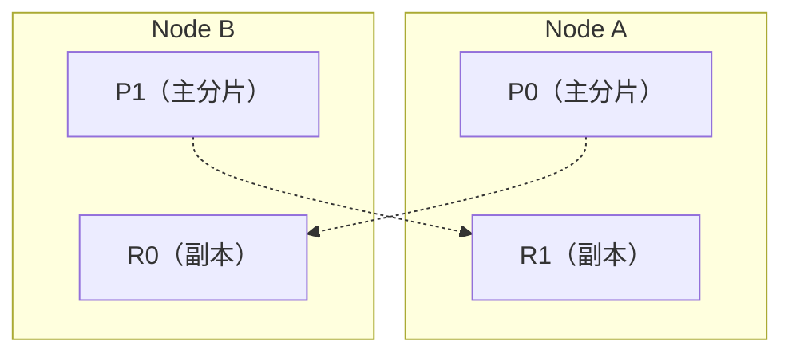
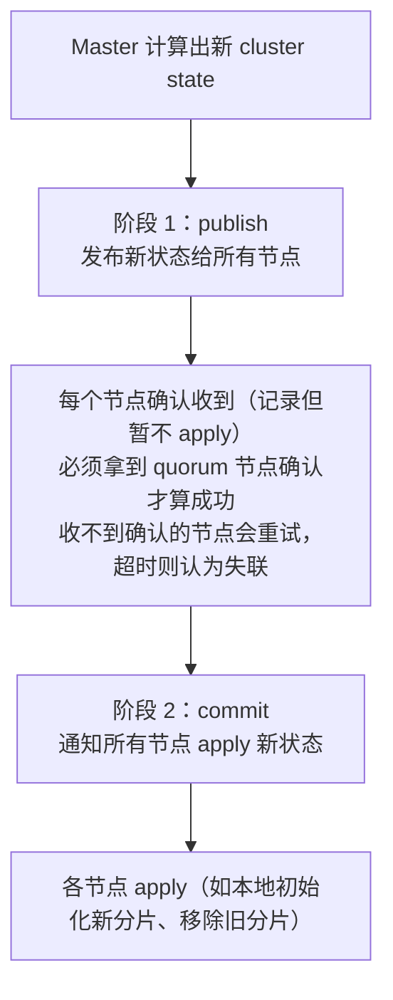
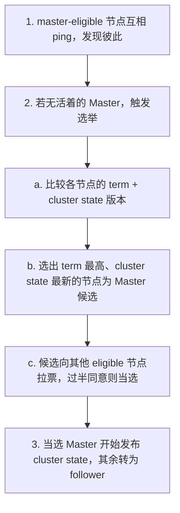
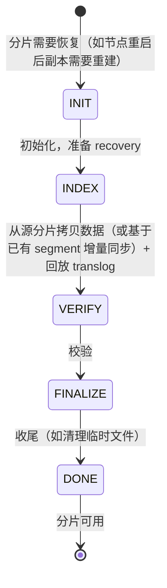
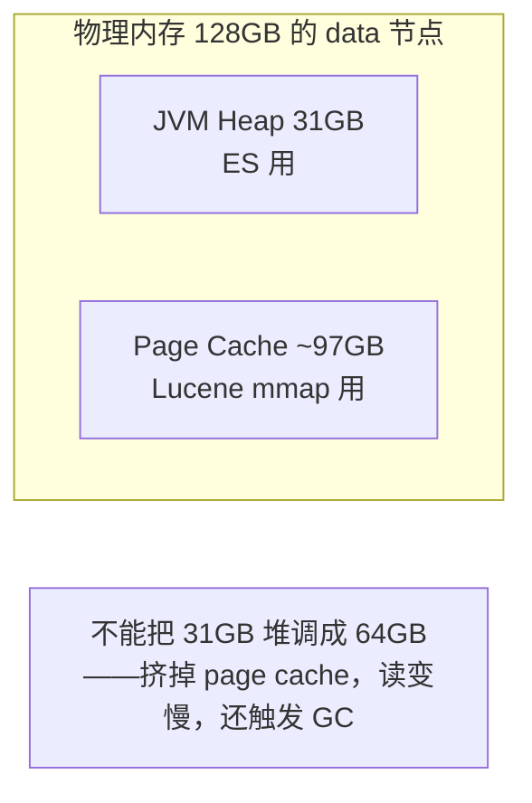
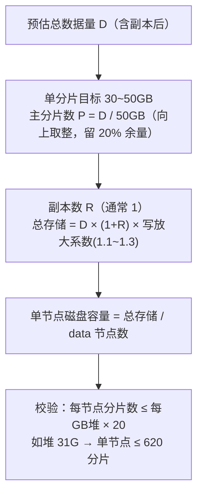

# Elasticsearch 基础与架构

> Elasticsearch（简称 ES）是面试高频。本章先建立全局认知：ES 是什么、概念模型、集群节点角色、分片副本、路由原理、与 MySQL 的本质区别。后续「06-索引与读写原理」「07-查询与调优」建立在本章之上。

---

## 一、核心概念

### 1.1 ES 是什么

- **定义**：基于 **Lucene** 的**分布式搜索和分析引擎**，兼文档型 NoSQL 数据库。对外提供 **RESTful API**，数据以 **JSON 文档**存取。
- **出处**：2004 年 Shay Banon 想给妻子找一个菜谱搜索工具，基于 Lucene 写了 Compass，后重构为分布式版本，2010 年以 Elasticsearch 开源。现属 Elastic 公司。
- **双身份**（上一节已确认归类）：
  - **搜索引擎**：全文检索、倒排索引、相关性打分（核心能力）。
  - **文档型 NoSQL 数据库**：JSON 文档存储、CRUD、Mapping。
- **不是通用 RDBMS**：无跨文档 ACID 事务（只有单文档/单分片级）、不擅长复杂 Join、不擅长强一致点查。**擅长的场景**：全文搜索、日志分析、指标聚合、APM。

> 💡 **面试金句**：MySQL 擅长「精确点查 + 强事务」，ES 擅长「全文检索 + 聚合分析」。生产中常配合：**MySQL 存源数据 + 同步到 ES 做搜索**，各取所长。

### 1.2 ES 常见用途

| 场景 | 说明 |
|------|------|
| **全文搜索** | 电商商品搜索、文章搜索、App 内搜索 |
| **日志分析** | ELK/EFK（Elasticsearch + Logstash/Fluentd + Kibana）日志栈 |
| **指标 / APM** | 系统指标、链路追踪（如 SkyWalking 用 ES 存 trace） |
| **安全分析** | SIEM 安全信息事件管理 |

---

## 一点五、Elastic Stack（ELK）生态全景

> 尚硅谷视频以 ELK 技术栈为主线讲解。ES 从不只是一个搜索引擎，而是一整套数据收集、存储、检索、可视化的生态。面试时被问到「ELK 是什么」要能说出各组件的分工。

### 1.5.1 ELK 是什么

| 组件 | 角色 | 一句话说明 |
|-------|------|-----------|
| **E = Elasticsearch** | 存储与检索核心 | 存数据、建索引、搜索、聚合 |
| **L = Logstash** | 数据采集与转换 | input → filter → output 管道，多源输入多目的地输出 |
| **K = Kibana** | 可视化与管理 | 画仪表盘、Dev Tools、监控、Discover 探索数据 |

### 1.5.2 Beats 家族（后加入后称 Elastic Stack）

Logstash 功能强但资源消耗大（JVM 进程、吃内存），后推出更轻量的 **Beats** 做端侧采集器（Go 编写，资源占用极低），Elastic 生态从「ELK」升级为 **Elastic Stack**：

| Beat | 用途 | 场景 |
|------|------|------|
| **Filebeat** | 采集日志文件 | 最常用，tail - 采集 Nginx/应用日志 |
| **Metricbeat** | 采集系统/指标 | 服务器 CPU/内存/磁盘指标 |
| **Packetbeat** | 采集网络数据包 | 网络流量分析、APM 前身 |
| **Heartbeat** | 主动探测可用性 | 站点/服务拨测监控 |
| **Auditbeat** | 审计数据审计 | 文件完整性、登录审计 |
| **Functionbeat** | 无服务器采集 | 云函数场景（云环境） |

典型数据流：**Beats（端采集）→ Logstash（过滤转换）→ Elasticsearch（存储检索）→ Kibana（可视化）**

小场景 Beats 也可以直接写 ES（Filebeat → ES），省掉 Logstash。

### 1.5.3 Logstash 核心三段式

- **Input（输入）**：从哪里读数据。常用：
  - `file`：读文件（配合 sincedb 记录读取位置，断点续传）
  - `jdbc`：从数据库拉数据
  - `kafka`：从 Kafka 消费
  - `beats`：接收 Beats 发来的数据
  - `stdin`：标准输入（测试用）
- **Filter（过滤转换）**：中间处理，核心价值所在常用：
  - `grok`：用正则解析非结构化日志（如 Nginx access log → 结构化字段
  - `date`：解析时间字段，覆盖默认 @timestamp
  - `mutate`：字段增删改、类型转换
  - `json`：解析 JSON 格式字段
  - `geoip`：IP → 地理位置
- **Output（输出）**：写到哪里去常用：
  - `elasticsearch`：输出到 ES
  - `kafka`：输出到 Kafka
  - `stdout`：控制台（测试用）
  - `file`：文件

### 1.5.4 Kibana 核心功能

| 模块 | 作用 |
|------|------|
| **Discover** | 数据探索，搜索过滤日志，看原始数据 |
| **Visualize** | 创建可视化图（柱状图/折线图/饼图/数据表） |
| **Dashboard** | 仪表盘，组合多个可视化 |
| **Dev Tools** | DSL 调试神器（Console） |
| **Stack Monitoring** | 监控 ES 集群状态 |
| **Management** | 索引模式、高级设置 |

> **索引模式（Index Pattern）** 是 Kibana 访问 ES 索引的桥梁，配置后才能在 Discover/Visualize 里选索引。支持通配符如 `logstash-*`，匹配按天滚动的多个索引。

---

## 二、概念模型（对照 MySQL 理解）

ES 的概念和关系型数据库一一对应但**不等同**，用对照表最快建立认知：

| ES 概念 | 对照 MySQL | 说明 |
|---------|------------|------|
| **Cluster 集群** | 一个 MySQL 集群 | 多个节点组成，对外一个整体 |
| **Node 节点** | 一个 MySQL 实例 | 集群中的一台 ES 服务 |
| **Index 索引** | 一张表（≈ 数据库） | ⚠️ 7.x 起 type 弃用，Index 直接是文档集合 |
| **Document 文档** | 一行记录 | JSON 格式，ES 的最小数据单元 |
| **Field 字段** | 一列 | 文档里的一个 key |
| **Mapping 映射** | 表结构（schema） | 定义字段类型、是否分词、是否索引 |
| **Shard 分片** | 分表 | 数据水平切分的单元 |
| **Replica 副本** | 主从的从库 | 分片的拷贝，高可用 + 读扩展 |

> ⚠️ **关于 type**：早期 ES 一个 Index 下可有多个 type（像数据库下多张表），7.0 起一个 Index 只能有一个 type，8.0 彻底移除 type 概念。**现在把 Index 就当一张「表」理解即可**，别再纠结 type。

### 2.1 Index（索引）

- 一组相似文档的集合，名字全小写。
- 一个 Index 的数据分布在多个 Shard 上。
- 索引名规则：`sw_segment-20240717` 这种「滚动索引」（按天建新索引）是日志/APM 常见模式，便于按时间 TTL 清理（呼应 SkyWalking「按天滚动索引」）。

### 2.2 Document（文档）

- JSON 对象，有唯一 `_id`（不指定则自动生成）。
- 一个文档 = 一条记录。包含若干字段。
- 文档是**不可变**的：更新 = 标记旧文档删除 + 写入新文档（merge 后才物理删除，见 06 章）。

### 2.3 Mapping（映射）

- 定义字段及其类型、分析方式，相当于表结构。
- 分**动态映射**（自动推断类型）和**显式映射**（手动指定）。生产建议显式定义，避免动态推断出错（如把 ID 推成数字导致搜索问题）。
- 核心类型：`text`（分词）/ `keyword`（不分词，精确匹配）/ `integer` / `long` / `double` / `date` / `boolean` / `ip` / `nested`（嵌套对象）/ `object` 等。

> `text` vs `keyword` 是高频面试题，详见「06-索引与读写原理」。

---

## 三、集群与节点角色

### 3.1 集群（Cluster）

- 一个集群由多个节点组成，集群名 `cluster.name` 相同的节点才能加入同一集群。
- 集群有**主节点**负责管理元数据（哪些索引、哪些分片在哪个节点），数据节点负责存数据。

### 3.2 节点角色（高频面试点）

一个节点可同时承担多个角色（默认都开）：

| 角色 | 职责 | 生产建议 |
|------|------|---------|
| **Master-eligible**（master 候选） | 参与选主；当选 Master 后管理集群元数据（索引创建、分片分配） | 3 个专用 master 节点（奇数，防脑裂），不存数据 |
| **Data**（数据节点） | 存数据、执行 CRUD、搜索、聚合 | 按数据量横向扩展，吃 CPU/内存/磁盘 |
| **Coordinating**（协调节点） | 接收请求、路由分发、汇总结果（query then fetch 的协调者） | 高负载时拆出专用协调节点 |
| **Ingest** | ingest pipeline 预处理（写入前转换/富化数据，类似 Logstash 轻量版） | 需要预处理时开 |
| **ML**（机器学习） | 跑异常检测等 ML 任务（商业版 X-Pack） | - |

> 💡 **关键认知**：**每个节点默认都是 Coordinating 节点**。即使你只配了 data 节点，它也能充当协调者。专用协调节点（`node.master/data/ingest/ml` 全 false，只留 coordinating）是在大集群里为卸载 data 节点压力而设。

### 3.3 专用 Master 节点为什么重要

- Master 只管元数据，不管数据 CRUD，负担轻但**至关重要**--Master 挂了集群无法创建索引、分片无法分配。
- 生产推荐：**3 个专用 master 节点**（奇数个，便于选主过半），让它们不存数据、不协调，专职稳定。
- 数据量大的集群务必把 master 与 data 分离。

### 3.4 数据节点的冷热分层（Hot/Warm/Cold/Frozen）★ 运维重点

> 这是日志/APM 时序场景的标配架构，直接决定存储成本和查询性能。7.10+ 引入 **data tier（数据层）**角色，取代旧版单一的 `node.data`，把数据节点按「温度」分层，配合 ILM 自动迁移数据。

| 角色 | 用途 | 存储介质 | 典型数据 |
|------|------|---------|---------|
| `data_content` | **内容索引**（非时序、不随时间流转，如商品/用户/订单） | SSD | 业务搜索数据 |
| `data_hot` | 时序热数据，写入和查询最频繁 | NVMe/最快 SSD | 今天~近几天的日志、metrics |
| `data_warm` | 时序温数据，写入已停，偶尔查询 | SSD/普通 | 几天~几周前 |
| `data_cold` | 时序冷数据，很少查询，查询可接受较慢 | HDD | 几月前 |
| `data_frozen` | 冻结数据，按需部分加载（partial mount） | HDD/对象存储 | 几月~几年，极少查询 |

要点：

- 一个节点可同时属于多层（小集群常见 `data_hot, data_warm` 混部），但生产大集群建议**物理分层**：hot 节点用 NVMe、cold 节点用 HDD，硬件成本差异巨大。
- 索引通过 `index.routing.allocation.include._tier_preference` 决定落哪层，ILM 按策略把索引从 hot → warm → cold → frozen 滚动迁移。
- **frozen 层用 searchable snapshots（可搜索快照）**：数据存在对象存储（S3/OSS），查询时按需把命中的部分加载到本地缓存，存储成本极低（省 90%+），代价是冷查询延迟变高。
- 旧版本（<7.10）没有 tier 概念，靠自定义节点属性 `node.attr.data: hot` + `index.routing.allocation.include.data: hot` 实现，原理相通。

> 💡 **面试金句**：冷热分层本质是「让数据在生命周期里从贵存储流向便宜存储」。热数据吃 SSD 求快，冷数据吃 HDD/对象存储求省。不分层会让所有数据都堆在最贵的 SSD 上，成本爆炸。

### 3.5 节点角色配置实战

专用 Master 节点（`elasticsearch.yml`）：

```yaml
node.roles: [ master ]          # 7.9+ 写法；旧版 node.master: true / node.data: false
cluster.name: prod-es
node.name: es-master-1
network.host: 0.0.0.0
discovery.seed_hosts: ["10.0.0.1","10.0.0.2","10.0.0.3"]   # 三个 master 的地址
cluster.initial_master_nodes: ["es-master-1","es-master-2","es-master-3"]  # 仅首次组建集群时用，稳定后应移除
```

冷热分层的 Data 节点：

```yaml
# hot 节点
node.roles: [ data_hot, data_content, ingest ]

# warm 节点（SSD）
node.roles: [ data_warm ]

# cold 节点（大容量 HDD）
node.roles: [ data_cold ]

# frozen 节点（挂载对象存储快照）
node.roles: [ data_frozen ]
```

专用协调节点（卸载 data 节点的协调压力，大集群才需要）：

```yaml
node.roles: []                   # 不参与 master/data/ingest，仅 coordinating
# 等价于 node.master/data/ingest 全 false；协调是默认能力，无需显式声明
```

> ⚠️ **`cluster.initial_master_nodes` 只在集群首次引导时用**：它告诉节点「首次选主从这些候选里选」。集群成型后应从配置中删除，否则下次重启若遇到脑裂场景可能重新引导出一个只含自己的小集群。这是常见的运维踩坑点。

---

## 四、分片与副本（核心机制）

### 4.1 主分片与副本

- **Primary Shard（主分片）**：数据的水平切片。一个索引的数据被切成 N 个主分片，分布在不同节点，实现**横向扩展**（容量和写入能力随节点增加而提升）。
- **Replica Shard（副本）**：主分片的拷贝，提供**高可用**（主挂了副本提升为主）和**读扩展**（读可走副本分担压力）。
- 副本**永远不会**和它的主分片在同一个节点上（否则该节点挂了主备都没了）。



索引 logs，2 个主分片，每个 1 个副本，共 4 个分片，分布在 2 个节点。虚线表示主-副本对应关系。

### 4.2 ⚠️ 主分片数创建后不能改（高频面试题）

- **主分片数在索引创建时确定，之后不能修改**（修改要 reindex 到新索引）。
- **副本数可随时动态调整**（`number_of_replicas`）。
- **为什么主分片数不能改？** 因为文档到分片的**路由依赖主分片数**（见 4.3）。改了主分片数，旧文档按新公式算出来的分片变了，就再也找不到了。

### 4.3 路由公式（怎么知道一个文档在哪个分片）

```
shard = hash(routing) % number_of_primary_shards
```

- `routing` 默认是文档 `_id`，也可自定义（业务可按 user_id 路由，让同一用户的数据落在同分片）。
- 因为 `% 主分片数`，所以主分片数不能变--变了路由结果就变。
- 这个公式解释了为什么 ES 是「**预分片**」的：扩容靠加节点重新分配分片（rebalance），而不是增加分片数。

### 4.4 分片数怎么选

- 单分片建议不超过 **50GB**（官方经验值，过大影响恢复和搜索性能）。
- 分片**不是越多越好**：分片多 = segment 多 = 搜索要 fan-out 到更多分片 = 协调开销大；每个分片有元数据开销。
- 经验：按数据量预估，`主分片数 ≈ 总数据量 / 单分片目标大小`，并留余量。
- 日志类可配合 ILM（索引生命周期管理）做 rollover，按时间不断建新索引，而不是在一个大索引里堆数据。

### 4.5 集群健康状态

| 颜色 | 含义 |
|------|------|
| **Green** | 所有主分片和副本都正常分配 |
| **Yellow** | 所有主分片正常，但**有副本未分配**（如单节点时副本无处安放） |
| **Red** | **有主分片未分配**，数据有缺失，需立即处理 |

> 单节点启动集群必然 Yellow（副本没地方放，因为没有「别的节点」放副本）。生产至少 2 节点才能 Green。

---

## 五、选主与脑裂

### 5.1 选主

- Master-eligible 节点之间互相发现，选出 1 个 Master。
- Master 负责集群元数据（索引、mapping、分片位置），变更通过**集群状态**广播。

### 5.2 脑裂（Split-Brain）

- **什么是脑裂**：网络分区导致集群分裂成两半，各自选出一个 Master，各自处理写入，导致数据不一致、分片冲突。
- **7.0 之前**：靠 `discovery.zen.minimum_master_nodes`（候选 master 过半数）手动防脑裂，配错就脑裂，运维痛点。
- **7.0+ 基本自动解决**：引入新的协调机制，**自动**管理选主，**不再需要手动配 minimum_master_nodes**。要求 master-eligible 节点数为**奇数**（3 个起步），保证能过半。

> 💡 面试答法：7.0 后 ES 基本自动规避脑裂，靠的是自动选主 + 过半原则 + 奇数节点。生产用 3 个专用 master 节点是最佳实践。

### 5.3 ⚠️ 7.0+ 仍可能出问题的运维场景

7.0 自动防脑裂的前提是「master-eligible 节点≥3 且能凑够 quorum」。以下场景仍会出事，运维要警惕：

| 场景 | 后果 | 处理 |
|------|------|------|
| **master-eligible 只有 1~2 个**（或没专用 master） | 1 个挂了凑不齐 quorum，集群「**假死**」：能查询但不能建索引/改 mapping/分配分片 | 必须配 ≥3 个专用 master |
| **3 个 master 同时挂 2 个** | 剩 1 个凑不齐 quorum，集群停滞 | 提升节点稳定性（独立机器/物理隔离） |
| **`cluster.initial_master_nodes` 未移除** | 重启时可能引导出只含自己的「迷你集群」，数据被孤立 | 集群成型后立即从配置删除 |
| **seed hosts 配错** | 节点发现不到彼此，各自单节点跑成「多个集群」 | 校验 `discovery.seed_hosts` 网络可达 |

> 💡 判断集群是否「假死」：`GET _cluster/health` 看 `number_of_pending_tasks` 是否持续高位且不下降、`GET _cat/tasks` 看是否有大量 master 任务排队、`GET _cluster/state?filter_path=master_node` 确认 master 是否存在。

---

## 六、集群状态与发布机制（Cluster State）★ 运维核心

> 理解 cluster state 是理解「为什么建索引慢」「为什么分片多会拖垮集群」的钥匙，也是排查 Master 过载的基础。

### 6.1 Cluster State 是什么

- **Cluster State 是全集群共享的「真相源」**，由 Master 维护，记录：
  - 所有节点信息（node 列表、角色、版本）。
  - 所有索引的 settings、mappings、别名。
  - **分片分配方案**（每个分片落在哪个节点）。
  - 所有索引模板、ILM 策略、快照仓库等元数据。
- **每个节点都持有完整的 cluster state 副本**（数据节点也需要它来知道本地有哪些分片、怎么处理请求）。
- 任何元数据变更（建/删索引、改 mapping、改副本数、分片迁移、节点上下线）都是一次 cluster state 变更，必须经 Master 发布。

### 6.2 两阶段发布协议

Master 变更 cluster state 采用**两阶段发布**保证一致性：



- 这种 publish-then-commit 的设计保证：**不会出现部分节点用新状态、部分用旧状态的撕裂**。
- 发布是**串行**的（同一时刻只有一个 cluster state 在发布），这是 Master 元数据通道的天然瓶颈。
- 如果某节点长时间不确认，Master 会把它判定失联并剔除，触发分片重分配。

### 6.3 Cluster State 膨胀问题（高频运维痛点）

- cluster state 越大，**发布越慢**（每次发布要序列化全量状态发给所有节点），且**每个节点的堆内存都被它占用一份**。
- 膨胀主因：
  - **分片数过多**：每个分片在 cluster state 里有记录。
  - **Mapping 爆炸**：动态映射导致字段数成千上万，mapping 占据 cluster state 绝大部分。
  - **索引数过多**：每个索引一份 mapping/settings。
- 症状：`pending_tasks` 飙升、Master CPU 高、建索引慢、节点堆内存虚高。
- 解法：控制总分片数（每 GB 堆 ≤20 分片）、关动态映射（`dynamic: false`）、用 ILM 滚动清理过期索引、必要时用 **frozen/searchable snapshot** 把冷数据移出。

> 💡 **面试金句**：cluster state 是 Master 维护、全节点共享的集群真相源，变更走两阶段发布（publish 确认 -> commit 应用）。它越大发布越慢、每个节点堆都被它占一份，所以「控制分片数 + 关动态映射」不是洁癖，是防 cluster state 膨胀拖垮全集群的硬需求。

---

## 七、Discovery 与选主深入（zen2）★

### 7.1 zen2 协调模型（7.0+）

- 7.0 把 Discovery 层**重写为 zen2**，用类似 Raft 的**任期制选举**取代旧版手动 `minimum_master_nodes`。
- 核心：**term（任期）+ 编号**。Master 每次变更 cluster state 递增 term，选举时只认更高 term 的状态，避免旧 Master「诈尸」回来自称老大。
- **自动维护 quorum**：master-eligible 节点数过半即合法，不再需要人工配 `minimum_master_nodes`。
- 发现机制：节点通过 `discovery.seed_hosts`（种子节点）互相发现，组成集群；首次用 `cluster.initial_master_nodes` 引导选出首任 Master。

### 7.2 选举流程



### 7.3 故障检测与剔除

- Master 定期 ping 所有节点（`discovery.cluster_publish_rate`），发现节点失联：
  - 失联超过阈值（`discovery.zen.fd.ping_timeout`/`cluster.election.duration`）判定失联。
  - Master 把失联节点从 cluster state 剔除，并**重分配其上的分片**（副本提升为主或新建副本）。
- 非 Master 节点也定期 ping Master，发现 Master 失联则发起重新选举。

### 7.4 节点 rejoin（重新加入）

- 失联节点恢复后要 **rejoin**：它必须**丢弃自己本地的旧 cluster state**，向当前 Master 拉取最新状态重新同步。
- 这避免了「带旧状态回来」造成的数据撕裂，是 term 制的核心价值。

> ⚠️ **为什么 term 机制能防脑裂**：旧版靠人工配过半数，配错就脑裂；zen2 让集群自动维护 term，任何想「分裂后自立」的节点因为 term 低、拉不到合法 quorum 而无法当选，从机制上杜绝了脑裂。

---

## 八、分片分配机制（Allocation）★

> 「分片为什么落在 A 节点而不是 B 节点」「为什么分片 UNASSIGNED」全靠 Allocation 机制解释。运维排查未分配分片的利器是 `GET _cluster/allocation/explain`。

### 8.1 Allocation Deciders（决策器）

Master 上的 `AllocationService` 用一组 **decider** 决定分片能否落在某节点。关键 decider：

| Decider | 规则 |
|---------|------|
| **SameShard** | 副本分片**不能和主分片在同一节点**（含同宿主机，靠 awareness） |
| **DiskThreshold** | 节点磁盘超水位线（low 85% / high 90% / flood 95%）则不再分配 |
| **NodeVersion** | 分片只能落在版本兼容的节点（滚动升级期间生效） |
| **Awareness** | 按属性（机架/机房）分散主副本，单点故障不全丢 |
| **Filter** | `include/exclude/require` 控制分片能落哪些节点 |
| **ShardsLimit** | 单节点分片数上限（`cluster.max_shards_per_node`，默认 1000） |
| **Balanced** | 均衡各节点分片数，避免过载 |

### 8.2 Awareness（感知分配）

```yaml
# 节点声明自己所在机架
node.attr.rack: rack-1
# 集群配置：按 rack 感知
cluster.routing.allocation.awareness.attributes: rack
```

- 配了 awareness 后，主副本**强制分散到不同 rack**，rack-1 整机故障也不丢副本。
- 进阶 **forced awareness**：强制要求每个属性值都有节点，防止属性缺失时分片乱跑。

### 8.3 Allocation Filter（过滤分配）

按节点属性过滤分片：

```json
// 索引只落 hot 层节点
"index.routing.allocation.include._tier_preference": "data_hot"
// 旧版按自定义属性
"index.routing.allocation.include.data": "hot"
// 排空某节点（用于下线）
"cluster.routing.allocation.exclude._name": "es-data-3"
```

- **排空节点下线**：`exclude._name` 让该节点上的分片迁移走，迁完即可安全下线。这是滚动升级、节点缩容的标准操作。

### 8.4 Balancer（均衡器）

- 后台 `reroute` 周期性检查分片分布，按 `cluster.routing.allocation.balance.*`（shard 阈值、index 阈值、disk 阈值）决定是否搬移分片以均衡。
- 均衡会触发分片迁移（一次 recovery），要控制迁移速率避免拖垮集群。

### 8.5 触发时机与手动 reroute

- 自动触发：节点加入/离开、索引创建、副本数变更、磁盘水位变化、均衡周期到。
- 手动干预：`POST _cluster/reroute` 可指定把某分片搬到某节点、或取消某分配。排查未分配时可用它强制分配。

> 💡 **运维三连**：`_cat/shards?v` 看分片分布 -> `_cluster/allocation/explain` 查未分配原因 -> 必要时 `_cluster/reroute` 手动干预。

---

## 九、Recovery 机制 ★

> 节点重启/分片迁移时，分片要经历 recovery 才能用。大分片 recovery 慢是集群可用性杀手，也是「单分片别超 50GB」的根因之一。

### 9.1 Recovery 阶段



- 主分片恢复：本地已有 segment 则用本地，再用 translog 回放到最新。
- 副本恢复：从主分片拷贝 segment 文件 + 回放 translog 追平。
- 查看进度：`GET _cat/recovery?v`，看 stage 和 percent。

### 9.2 限流配置（运维关键）

Recovery 会吃网络和磁盘 IO，必须限流否则会拖垮生产：

```yaml
indices.recovery.max_bytes_per_sec: 250mb       # 单节点 recovery 带宽上限（默认约 40mb，生产太小）
cluster.routing.allocation.node_concurrent_recoveries: 2  # 单节点并发 recovery 数
```

- 默认限流值偏保守，生产应调大；但调太大会让 recovery 抢占正常读写 IO。

### 9.3 滚动重启的正确姿势

节点重启若不做处理，会触发分片反复迁移（重启前迁走、起来后又迁回），雪上加霜：

```bash
# 1. 暂停分片分配（防止重启时分片被迁走）
PUT _cluster/settings
{ "transient": { "cluster.routing.allocation.enable": "primaries" } }

# 2. 停止节点上的分片写入（可选，单节点 drain）
POST /_cluster/voting_config_exclusions?node_names=es-data-3   # 下线 master 时排除投票节点

# 3. 停节点 -> 升级/重启 -> 等节点加入集群
# 4. 重新启用分片分配
PUT _cluster/settings
{ "transient": { "cluster.routing.allocation.enable": "all" } }

# 5. green 后处理下一个节点
```

- 一次只重启一个节点，等集群 `green`（或分片恢复完）再处理下一个。
- 升级时还要注意**版本兼容**：滚动升级期间，高版本节点不能把分片分配给低版本节点（NodeVersion decider 生效）。

---

## 十、线程池模型 ★

> ES 的读写都走线程池，队列满就 reject（429）。`thread_pool rejected` 是线上过载的第一信号。

### 10.1 核心线程池

| 线程池 | 用途 | 默认 size | 默认 queue |
|--------|------|-----------|-----------|
| **write** | 单条/批量写入（indexing/bulk） | = CPU 核数 | 10000 |
| **search** | 查询的 query 阶段（分散执行） | int((核数*3)/2)+1 | 1000 |
| **search_coordinator** | 查询协调阶段（合并结果） | 同 search | 1000 |
| **get** | 点查（按 _id GET） | = CPU 核数 | 1000 |
| **analyze** | 分词 | 1 | 16 |
| **refresh** | refresh 生成 segment | 较少 | 无界（异步） |
| **flush** | flush 落盘 | 较少 | 无界 |
| **force_merge** | segment 合并 | 1 | - |
| **management** | 集群管理任务 | - | - |
| **snapshot** | 快照 | - | - |

### 10.2 queue 与 reject

- 请求到来先进 queue，queue 满直接 **reject** 返回 429（`EsRejectedExecutionException`）。
- 客户端**应重试**（带退避），不能无限堆积。
- 持续 reject = 集群过载信号，要么扩容、要么限流、要么优化查询/写入。

### 10.3 调整与观测

```bash
# 看各线程池 active/queue/rejected
GET _cat/thread_pool?v&h=node,name,active,queue,rejected,completed

# 调整 write 队列（动态）
PUT _cluster/settings
{ "transient": { "thread_pool.write.queue_size": 1500 } }
```

> ⚠️ **不要一味调大队列**：队列越大，请求积压越久，单请求延迟越高，可能拖垮上层调用方的超时。reject 本身是 ES 的**过载保护**，调大只是把「快速失败」变成「慢速失败」。根本解法是扩容或降负载。

---

## 十一、内存模型 ★

> 调优和排查 OOM 都要分清「堆里是什么」「堆外是什么」。ES 性能调优有一半是在「堆 vs page cache」之间做权衡。

### 11.1 JVM Heap 内部组成

堆内存（建议物理内存 50%，且 ≤31GB）里主要有：

| 组成 | 作用 | 备注 |
|------|------|------|
| **indexing buffer** | 写入缓冲，攒成 segment | `indices.memory.index_buffer_size` 默认堆的 10% |
| **query cache** | filter 子查询结果缓存 | 默认堆 10% |
| **request cache** | shard 级请求结果缓存（size=0 聚合常用） | 默认堆 1% |
| **fielddata cache** | text 字段聚合时的正排数据 | 默认不限（建议 `indices.fielddata.cache.size: 40%`） |
| **translog buffer** | translog 写缓冲 | 较小 |
| **segment 元数据** | 每个分片的 Lucene 元数据常驻堆 | 分片越多占越多，是「控分片数」根因 |
| **cluster state** | 全节点各持一份 | mapping/索引越多越大 |
| **breaker 预留** | circuit breaker 预留空间 | 见 11.3 |

### 11.2 Off-heap 与 Page Cache

堆之外的内存同样关键：

- **Lucene segment 文件靠 OS page cache 加速读**：Lucene 直接用 `mmap` 把 segment 映射到内存，命中 page cache 时读几乎零拷贝。
- 这就是「**留一半物理内存给 OS 文件缓存**」的根因：堆给 ES 用，剩下给 page cache 喂 Lucene。堆太大反而挤占 page cache，读性能下降。
- 还有 direct memory（Netty 网络缓冲）等。



### 11.3 Circuit Breaker（熔断器）★

为防大查询/大聚合打爆堆，ES 用 breaker 在**请求执行前**估算内存，超阈值直接拒绝（防患于未然，优于 OOM 后救火）：

| Breaker | 默认上限 | 作用 |
|---------|---------|------|
| **parent** | 堆的 95% | 总开关，子 breaker 估算总和超此值即熔断 |
| **fielddata** | 堆的 40% | text 聚合的 fielddata 内存 |
| **request** | 堆的 60% | 单次请求（聚合、script）估算内存 |
| **accounting** | 堆的 100% | segment 元数据等常驻 |
| **in_flight_requests** | 堆的 100% | 在途请求内存 |

- 触发 breaker 返回 `circuit_breaking_exception`，请求被拒但**节点不挂**。
- 排查：`GET _nodes/stats/breaker` 看各 breaker used/limit。
- 频繁触发说明查询太重（大聚合、大 cardinality、深分页），需优化查询或加节点。

> 💡 **调优第一原则**：堆给 50%、留 50% 给 page cache、≤31GB；堆过大（>50%）会挤占 page cache 让读变慢，且 GC 停顿长。breaker 是 OOM 的保险丝，频繁跳闸要查根因不是调大阈值。

---

## 十二、生产部署与容量规划 ★ 运维重点

### 12.1 部署拓扑

| 节点类型 | 数量 | 规格 | 角色 |
|---------|------|------|------|
| 专用 Master | **3（奇数）** | 4~8C / 8~16G / 50~100G SSD | 求稳不强，专职元数据 |
| Data(hot) | 按写入量 | 16~64C / 64~128G / NVMe SSD | 写入+热查询，最吃资源 |
| Data(warm/cold) | 按数据量 | 8~32C / 32~128G / HDD | 冷数据，省钱 |
| Data(frozen) | 少量 | 中等 / 挂对象存储 | 可搜索快照 |
| 协调节点（可选） | 2+ | 8~16C / 16~32G | 大集群卸载 data 协调压力 |
| Ingest（可选） | 按需 | 中等 | 预处理 |

- **Master 与 Data 物理隔离**：绝不让 master 承载数据，否则数据节点 GC/IO 抖动会拖垮 Master 导致集群假死。
- 跨机房/跨可用区：用 **awareness** 让主副本分散，专用 master 也分散到不同 AZ。
- 同一物理机不要混部多个 ES 节点（争抢资源、故障域耦合），除非测试。

### 12.2 节点规格经验

- **堆内存 ≤31GB**（指针压缩阈值），且 ≤物理内存 50%。
- **bootstrap.memory_lock: true** 锁内存防 swap（swap 是性能杀手）。
- 数据节点磁盘：单节点建议 **2~30TB**（视恢复时间），太大则单节点恢复慢、风险集中。
- CPU：写入和聚合吃 CPU，search 线程数与核数相关，至少 8C 起步。

### 12.3 容量规划



- 时序数据用 **ILM + 滚动索引**：单索引不要无限大，按天/大小 rollover，便于 TTL 清理和分片均衡。
- 业务搜索数据用固定索引 + 别名，reindex 时无感切换。

### 12.4 关键配置清单（生产）

```yaml
cluster.name: prod-es
node.name: es-data-1
node.roles: [ data_hot, data_content, ingest ]
path.data: /data/es,/data2/es        # 多盘提升 IO
path.logs: /var/log/es

bootstrap.memory_lock: true          # 锁内存防 swap
network.host: 0.0.0.0
http.port: 9200
transport.port: 9300

discovery.seed_hosts: ["master1:9300","master2:9300","master3:9300"]
# cluster.initial_master_nodes: [...]  # 仅首启用，稳定后删除

# 线程池（按需）
thread_pool.write.queue_size: 1000
thread_pool.search.queue_size: 2000

# 恢复限流
indices.recovery.max_bytes_per_sec: 250mb

# 水位线
cluster.routing.allocation.disk.watermark.low: 85%
cluster.routing.allocation.disk.watermark.high: 90%
cluster.routing.allocation.disk.watermark.flood_stage: 95%

# 堆（jvm.options）
-Xms31g -Xmx31g                    # 相等，避免动态扩缩引起 GC
```

> ⚠️ **`-Xms` 与 `-Xmx` 必须相等**：初始堆等于最大堆，避免运行中扩堆触发 Full GC。这是 JVM 调优常识，ES 尤其重要。

---

## 十三、监控指标体系 ★ 运维重点

> 没有监控就没有运维。下面是线上 ES 必盯的指标分层，配合 Prometheus + exporter 或 Kibana Stack Monitoring。

### 13.1 集群级

| 指标 | 含义 | 告警阈值 |
|------|------|---------|
| `status` | green/yellow/red | ≠green 告警 |
| `number_of_pending_tasks` | Master 待处理任务 | >0 持续告警 |
| `unassigned_shards` | 未分配分片 | >0 |
| `relocating_shards` | 迁移中分片 | 关注异常飙升 |
| `active_shards_percent` | 活跃分片占比 | <100% |

### 13.2 节点级

| 指标 | 含义 | 告警阈值 |
|------|------|---------|
| `disk.used_percent` | 磁盘使用率 | >80% 预警，>90% 高危 |
| `jvm.mem.heap_used_percent` | 堆使用率 | >75% 预警，>85% 高危 |
| `jvm.gc.*` | GC 次数/耗时 | Full GC >0 或 Young GC 耗时飙升 |
| `thread_pool.*.rejected` | 线程池拒绝 | >0 持续 |
| `indices.indexing.index_current` | 当前写入并发 | 关注突变 |
| `indices.search.query_current` | 当前查询并发 | 关注突变 |
| `fs.total.disk_io_*` | 磁盘 IO | 饱和告警 |

### 13.3 索引级

| 指标 | 含义 |
|------|------|
| `docs.count` / `store.size` | 文档数/存储大小（评估容量） |
| `segments.count` | segment 数（过多触发 merge） |
| `indexing.index_total` / `index_time` | 写入量/写入耗时 |
| `search.query_total` / `query_time` | 查询量/查询耗时（算平均延迟） |
| `merges.total_time` | merge 耗时 |

### 13.4 JVM 级

| 指标 | 含义 | 告警 |
|------|------|------|
| `heap_used_percent` | 堆使用率 | >75% |
| `gc.collection_count`/`time` | GC 次数/耗时 | Full GC 出现即告警 |
| `old.used` | 老年代占用 | 持续上涨不回落=泄漏 |
| `breakers.*.tripped` | 熔断次数 | >0 |

### 13.5 关键查询接口速查

```bash
GET _cluster/health                    # 集群健康
GET _cat/nodes?v                      # 节点概览
GET _cat/indices?v                    # 索引概览
GET _cat/shards?v                     # 分片分布
GET _cat/allocation?v                  # 各节点磁盘
GET _cat/thread_pool?v                 # 线程池
GET _cat/recovery?v                    # recovery 进度
GET _nodes/stats                       # 节点详细统计
GET _cluster/pending_tasks             # Master 任务队列
GET _nodes/hot_threads                 # 热点线程（CPU 飙高排查）
GET _cat/aliases?v                     # 别名
```

> 💡 **运维口诀**：health 看整体、pending_tasks 看 Master、thread_pool rejected 看过载、disk 看 IO、heap+gc 看内存、hot_threads 看 CPU。四件套（health + pending + thread_pool + nodes/stats）能定位 80% 问题。

---

## 十四、安全机制

> 8.x 起安全（X-Pack basic）默认开启。生产必须配置认证授权和传输加密。

### 14.1 认证与授权（RBAC）

- **认证（Authentication）**：你是谁。支持：
  - **native realm**：ES 内置用户名密码（`elastic` 超级用户、`kibana_system` 等）。
  - **API Key**：应用访问常用，可设权限范围和过期。
  - **SAML / OIDC**：企业 SSO 单点登录。
  - **LDAP / Active Directory**：对接企业目录。
- **授权（Authorization）**：你能干什么。基于 **role -> privileges -> user** 模型：
  - role 定义对哪些 index/cluster 有哪些操作权限（read/write/manage/monitor）。
  - user 绑定若干 role。
  - **最小权限原则**：业务应用不要用 `elastic` 超管，建专用 role 只给目标索引的读写。

### 14.2 传输加密（TLS）

- **transport 层（节点间，9300）**：8.x 默认开启，节点互信靠证书。生产**必须**保持开启，否则节点间通信明文。
- **HTTP 层（客户端，9200）**：建议开启 TLS，防抓包窃取凭证。
- 证书管理：可用 `elasticsearch-certutil` 生成 CA 和节点证书。

### 14.3 API Key

- 适合应用长期访问：生成一个限定权限、可过期的 API Key，应用用 `Authorization: ApiKey xxx` 访问。
- 比 native 用户密码更安全（可吊销、可限权、可过期）。

### 14.4 审计日志（Audit Log）

- 开启 `xpack.security.audit.enabled`，记录认证失败、授权拒绝、敏感操作。
- 合规和安全排查必备，能定位「谁在什么时候做了什么」。

---

## 十五、ES vs MySQL（核心对比）

| 维度 | MySQL | Elasticsearch |
|------|-------|----------------|
| **定位** | 关系型 OLTP 数据库 | 搜索引擎 + 文档 NoSQL |
| **存储模型** | 行式，B+ 树索引 | JSON 文档，倒排索引 |
| **查询语言** | SQL | Query DSL（JSON） + RESTful |
| **强项** | 精确点查、ACID 事务、Join | 全文检索、模糊匹配、聚合分析 |
| **弱项** | 全文搜索弱（LIKE 慢） | 事务弱、Join 弱、强一致点查弱 |
| **一致性** | 强一致（事务） | 近实时（refresh 间隔，默认 1s 可搜） |
| **扩容** | 垂直为主，分库分表复杂 | 原生分布式，水平扩展 |
| **schema** | 强 schema | 弱 schema（动态映射） |
| **典型场景** | 业务核心数据 | 搜索、日志、指标分析 |

### 6.1 为什么不用 MySQL 做搜索

- MySQL 的 `LIKE '%keyword%'` 走不了索引（前缀通配），全表扫描，慢且不相关。
- MySQL 没有分词、相关性打分、同义词、高亮等搜索能力。
- 所以把 MySQL 数据同步到 ES 做搜索是经典架构：MySQL 是「事实源」，ES 是「搜索副本」。

### 6.2 数据同步方式（MySQL -> ES）

| 方式 | 说明 |
|------|------|
| **双写** | 业务代码写 MySQL 同时写 ES，简单但一致性难保证 |
| **Canal 监听 binlog** | 监听 MySQL binlog 增量同步到 ES，解耦、近实时，主流 |
| **MQ 异步同步** | 写 MySQL 后发 MQ，消费者写 ES，削峰解耦 |
| **定时全量** | 简单粗糙，只适合小数据或初始化 |

> 面试常问：双写一致性怎么保证？答：要么用事务/消息最终一致，要么用 binlog 监听（Canal）保证顺序和可靠。

---

## 十六、常见面试题

1. **ES 是什么？是数据库吗？**
   基于 Lucene 的分布式搜索分析引擎，兼文档型 NoSQL。它有数据库特征（持久化、CRUD、索引），但不是通用 RDBMS--无跨文档事务、弱 Join、弱强一致点查，强项是全文检索和聚合分析。

2. **ES 的 Index / Document / Mapping / Shard 分别对应 MySQL 什么？**
   Index ≈ 表，Document ≈ 一行记录，Mapping ≈ 表结构 schema，Shard ≈ 分表，Replica ≈ 从库。

3. **ES 的节点角色有哪些？为什么要专用 Master 节点？**
   Master-eligible / Data / Coordinating / Ingest / ML；7.10+ Data 又细分为 data_content/data_hot/data_warm/data_cold/data_frozen 五个数据层。专用 Master（3 个奇数）专职管理元数据、不存数据，保证选主稳定、防脑裂、不让数据节点负载拖垮 Master。

4. **主分片数能不能改？为什么？**
   不能改（改要 reindex）。因为文档到分片的路由 `shard = hash(routing) % 主分片数` 依赖主分片数，改了旧文档就找不到分片了。副本数可动态改。

5. **一个文档怎么路由到分片？**
   `shard = hash(routing) % number_of_primary_shards`，routing 默认是 _id，可自定义按业务键路由让相关数据落同分片。

6. **集群 Yellow 和 Red 分别意味着什么？**
   Yellow：主分片都正常但有副本未分配（如单节点）。Red：有主分片未分配，数据缺失，需立即处理。

7. **为什么用 ES 做搜索而不用 MySQL 的 LIKE？**
   MySQL `LIKE '%xx%'` 走不了索引全表扫描且无相关性；ES 有分词、倒排索引、相关性打分、同义词、高亮等搜索能力，快且准。

8. **MySQL 数据怎么同步到 ES？**
   双写、Canal 监听 binlog（主流，解耦近实时）、MQ 异步、定时全量。一致性靠 binlog 顺序或消息最终一致保证。

9. **ES 的冷热分层是什么？为什么要分层？**
   把数据节点按「温度」分层：hot（最新热数据，NVMe/SSD）、warm（温，SSD）、cold（冷，HDD）、frozen（冻结，对象存储+可搜索快照），配合 ILM 让数据从贵存储流向便宜存储。不分层会让所有数据堆在最贵的 SSD 上成本爆炸；时序数据天然有冷热，分层是省成本的关键。

10. **Cluster State 是什么？为什么是瓶颈？**
    Master 维护、全节点各持一份的集群真相源（节点/索引/mapping/分片分配）。变更走两阶段发布（publish 确认 -> commit 应用），串行执行。mapping 字段多/分片多/索引多会让它膨胀，发布变慢、每个节点堆被它占一份。这是「控分片数 + 关动态映射」的根因，也是 Master 串行任务队列（07 章 5.6）的物质基础。

11. **7.0 后 ES 怎么防脑裂？term 机制是什么？**
    zen2 用类 Raft 的**任期制选举**取代旧版手动 `minimum_master_nodes`：Master 每次变更递增 term，选举只认更高 term 的状态，旧 Master 无法靠低 term 诈尸回来自立。失联节点 rejoin 时必须丢弃旧 cluster state 重新同步，避免撕裂。前提仍是 master-eligible ≥3 奇数。

12. **分片 UNASSIGNED 怎么排查？**
    `GET _cat/shards?v` 找未分配分片 -> `GET _cluster/allocation/explain` 看具体原因和被哪个 decider 拒绝。常见原因：磁盘超水位线（85/90/95%）、节点掉线未恢复、副本与主同节点、ShardsLimit 超限、Filter 排除、版本不兼容（滚动升级中）。对应处理：清磁盘/加节点/调水位线/等 recovery/改配置。

13. **ES 线程池 reject（429）怎么办？要不要调大队列？**
    reject 是过载保护，先看 `GET _cat/thread_pool?v` 是哪个池（write/search/get）rejected。**不要一味调大队列**--队列越大请求积压越久、延迟越高，把快速失败变成慢速失败。根本解法：扩容、客户端限流降并发、优化查询/写入（bulk 批量、避免深分页/wildcard）。

14. **ES 堆内存为什么建议 ≤31GB 且 ≤物理内存 50%？**
    ① 31GB 是 JVM 指针压缩阈值，超了用普通指针，内存占用增加、GC 效率下降；② 不超物理内存 50%，是为了留一半给 OS page cache 喂 Lucene mmap 读（堆太大挤占 page cache 反而读变慢、GC 停顿长）。`-Xms` 与 `-Xmx` 必须相等避免动态扩堆触发 Full GC。

15. **滚动升级/重启一个 ES 节点要怎么做？**
    一次只处理一个节点：① `cluster.routing.allocation.enable=primaries` 暂停分片分配（防重启时被迁走）；② drain 节点（下线 master 用 voting_config_exclusions）；③ 停节点升级重启等加入集群；④ 恢复 `allocation.enable=all`；⑤ 集群 green 后处理下一个。高版本不会把分片分配给低版本节点（NodeVersion decider）。

16. **Circuit Breaker 是什么？频繁触发怎么办？**
    ES 在请求执行前估算内存、超阈值直接拒绝防 OOM 的保险丝。有 parent(95%)/fielddata(40%)/request(60%)/accounting/in_flight 等。频繁触发说明查询太重（大聚合、高 cardinality、深分页、script），应优化查询/加节点，**不是调大阈值**（调大只是把保护拆掉，迟早 OOM）。

---

## 十七、7.x → 8.x 版本演进与新特性

> 尚硅谷视频标题明确提到「7.x+8.x 新特性」。面试中常被问到 7.x 和 8.x 的区别，以及某特性是哪个版本引入的。下面梳理关键版本节点。

### 17.1 6.x → 7.x 核心变化

| 变化点 | 说明 |
|--------|------|
| **Type 弃用** | 7.0 起一个 Index 只能有一个 type（默认 `_doc`），type 正式标记 deprecated |
| **默认主分片数 1** | 默认从 5 改为 1（小索引不再浪费分片） |
| **zen2 选主** | 重写 Discovery 层为 zen2（类 Raft 任期制），不再需要手动配 `minimum_master_nodes` |
| **集群协调重构** | 自动选主 + quorum 管理，脑裂问题基本从机制上解决 |
| **SQL 查询** | 新增 `_sql` 接口，可用 SQL 查询 ES |
| **数据层（Data Tier）** | 7.10 引入 data_content / data_hot / data_warm / data_cold / data_frozen，取代旧版单一 `node.data` |
| **ILM 成熟** | 索引生命周期管理从 beta 走向成熟，日志场景标配 |
| **Frozen 层 + Searchable Snapshot | 7.10+ 引入冻结层，冷数据存对象存储按需加载，存储成本大降 |

### 17.2 7.x → 8.x 核心变化

| 变化点 | 说明 |
|--------|------|
| **Type 彻底移除** | 8.0 正式删除 type 概念，只剩 `_doc` |
| **默认启用安全** | 首次启动自动开启认证（用户名密码）、TLS 加密、API Key |
| **kNN 向量搜索** | 原生支持近似最近邻搜索，适配 AI/大模型/向量检索场景 |
| **PyTorch 模型推理** | 支持加载 PyTorch 模型，在 ES 内做 NLP 推理（如文本分类、命名实体识别） |
| **Data Stream** | 数据流正式 GA，简化时序数据管理（自动建索引、自动滚动） |
| **API Key 增强** | 更细粒度、更完善的 API Key 管理 |
| **Operator 模式** | K8s 上 ES Operator 更成熟，简化云原生部署运维 |
| **性能提升** | 查询、聚合、存储压缩率优化，整体更快更省 |

### 17.3 8.x 安全默认开启（重要变化）

8.x 最直观的变化是**安全默认开启**：
- 首次启动自动生成 `elastic` 用户随机密码（不再是无密码）
- transport 层（节点间）默认启用 TLS
- 生产环境不再需要手动一步步开安全，更安全也更省事

### 17.4 面试常问：7.x 和 8.x 最大的区别是什么

**核心答案**：安全默认开启 + kNN 向量搜索 + type 彻底移除 + 数据层更完善。
- 安全是运维感知最强的变化（不再裸奔）
- kNN 是功能上最大的新增（拥抱 AI 时代向量检索）
- type 移除是兼容性上的 breaking change

---

## 十八、资料勘误与重点提醒

1. **「数据节点 = node.data」是旧认知**：很多资料还讲单一的 `node.data: true/false`。**7.10+ 引入 data tier**，`node.data` 被拆成 `data_content/data_hot/data_warm/data_cold/data_frozen` 五个数据层角色。`node.roles: [data_hot]` 才是现代写法。旧资料讲的冷热分离靠 `node.attr` 自定义属性，原理相通但已被 tier 取代。

2. **「7.0 彻底没脑裂」要带限定**：资料常说「7.0 自动防脑裂不用管」。准确说法是「**只要 master-eligible ≥3 奇数且能凑够 quorum，就自动防脑裂**」。若只配 1~2 个 master，或一次挂掉超过半数 master，集群仍会因凑不齐 quorum 而**假死**（能查不能写）。运维必须配 ≥3 专用 master。

3. **`cluster.initial_master_nodes` 是易踩坑点**：不少资料只说「配置首次 master 列表」，不强调**集群成型后必须删除**。若不删，重启遇到分区可能引导出只含自己的迷你集群，数据被孤立。务必在集群稳定后移除该配置。

4. **「堆越大越好」是误区**：资料常建议「内存大就给 ES 大堆」。实际堆应 ≤物理内存 50% 且 ≤31GB：① 超过 31GB 失去指针压缩，反而低效；② 留一半给 page cache 喂 Lucene mmap 读；③ 堆大 GC 停顿长。**堆太大有害**，这是和多数直觉相反的点。

5. **`-Xms` 与 `-Xmx` 必须相等**：部分资料未强调。两者不等会导致运行中扩堆触发 Full GC，生产必须相等。

6. **breaker 阈值不是越大越好**：资料讲 breaker 时少提「**频繁触发要查根因而非调大阈值**」。调大阈值只是拆掉保险丝，迟早 OOM。正确做法是优化查询（缩小聚合范围、降 cardinality、避免深分页）。

7. **滚动升级必须先禁分配**：资料常省略 `cluster.routing.allocation.enable=primaries` 这步。不暂停分配，重启节点时其分片会被迁走、起来后又迁回，造成无谓的 recovery 风暴，延长不可用时间。

8. **searchable snapshot / frozen 层是省钱利器但资料少提**：frozen 层把冷数据放对象存储按需加载，存储成本降 90%+，是日志/APM 场景降本的关键，传统 ES 教程往往停在 cold 层不提 frozen。

9. **「ELK 必须三个组件都用」是误区**：很多入门资料/视频画 ELK 架构时 Logstash 是必画的一环。实际生产中**大量场景是 Filebeat → ES 直接写**，不需要 Logstash——只有需要复杂过滤转换（grok/geoip/字段富化）时才加 Logstash。Logstash 资源消耗大、是单点瓶颈，能省则省。

10. **「8.x 安全默认开启 = 不能关」是误解**：8.x 默认开安全是为了安全好，但生产中如果在内网且有其他访问控制（如网关鉴权），也可以通过配置 `xpack.security.enabled: false` 关掉。**但不建议关**，尤其是有公网暴露的情况。

11. **「kNN 向量搜索完全替代向量数据库」是夸大宣传**：ES 8.x 的 kNN 确实支持向量检索，但和专门的向量数据库（Milvus/Pinecone/Weaviate）相比，在向量规模、检索性能、混合查询优化上还有差距。ES kNN 适合「已有 ES 集群、向量量不大、想顺便做向量搜索」的场景，大规模向量检索还是专业向量数据库更强。

12. **Beats 不是只有 Filebeat**：很多教程只讲 Filebeat，但 Beats 家族有六七种，Metricbeat（指标）、Packetbeat（网络）、Heartbeat（拨测）、Auditbeat（审计）在运维监控场景各有用处，别一提到 Beats 就只想到 Filebeat。

---

> 本章建立全局认知并细化到运维级深度。下一章「06-索引与读写原理」深入倒排索引、分词、写入/读取流程这些 ES 性能的根基；「07-查询与调优」讲 Query DSL、聚合、深分页、调优；「08-运维与故障排查」讲线上高频故障的现象->排查->定位->解决实战。
