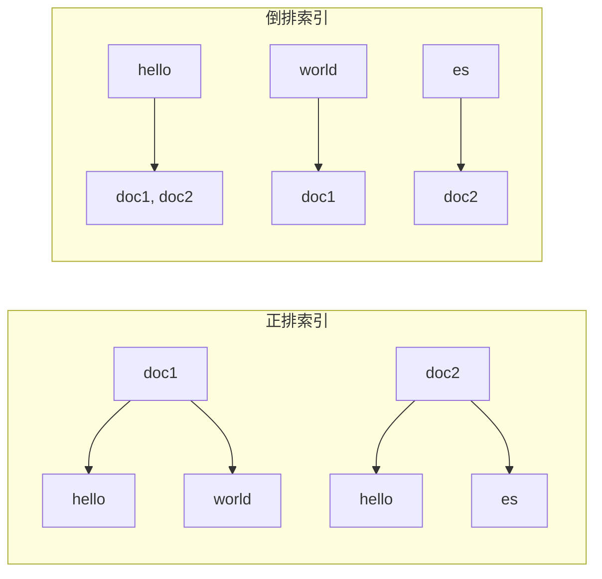
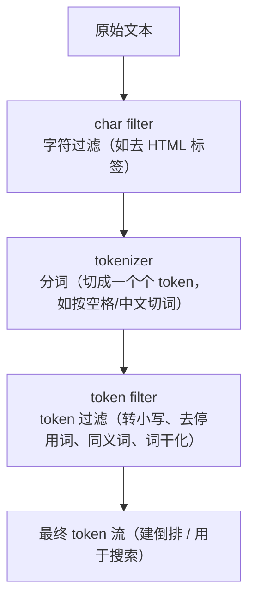
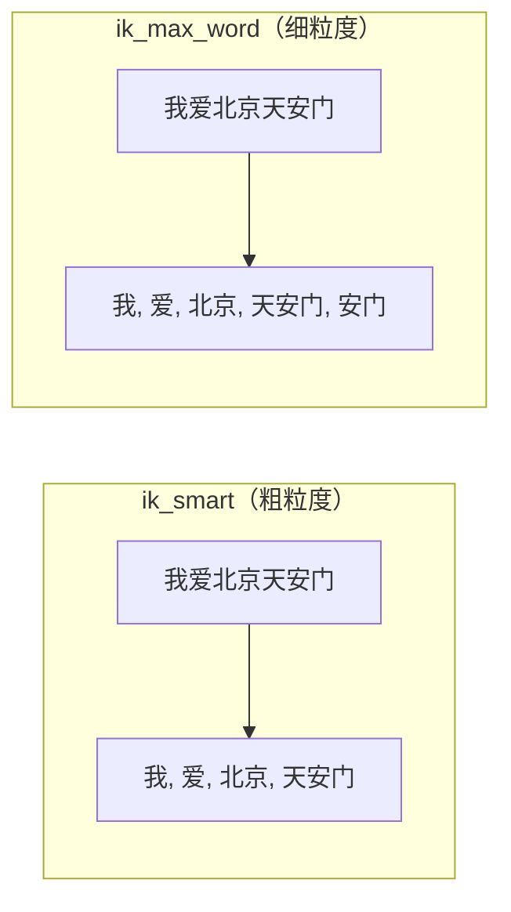
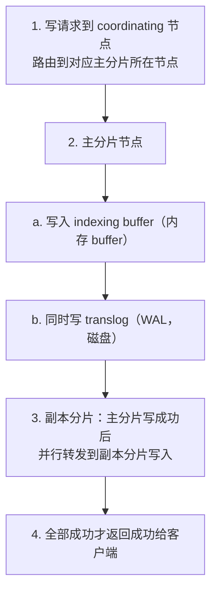
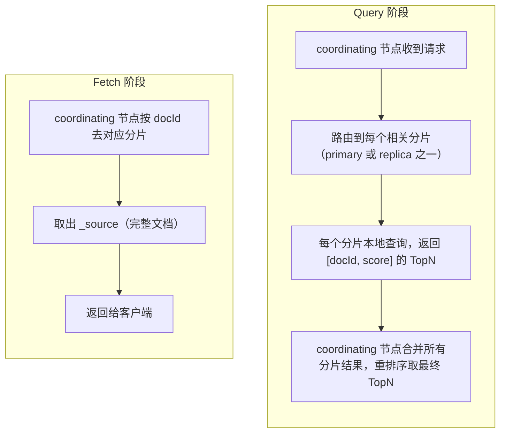

# ES 索引与读写原理

> 本章是 ES 的「灵魂」：倒排索引为什么快、分词器怎么工作、文档怎么写进去、查询怎么读出来、相关性怎么打分。理解这些，调优和面试题就都有了根基。

---

## 一、倒排索引（Inverted Index）★

> 这是 ES（和所有全文搜索引擎）的根基，必考。

### 1.1 为什么需要倒排索引

- **正排索引**：文档 -> 词（「文档 1 包含哪些词」）。查「包含某词的文档」要扫所有文档，慢。
- **倒排索引**：词 -> 文档列表（「这个词出现在哪些文档」）。查「包含某词的文档」直接查词，拿到文档列表，**O(1) 级别**。



### 1.2 倒排索引的组成

一个字段的倒排索引由三部分构成：

| 部分 | 作用 | 存哪 |
|------|------|------|
| **Term Dictionary（词典）** | 所有 term（词项）的列表 | 磁盘 |
| **Term Index（词典索引）** | 加速词典查找（FST） | 内存 |
| **Posting List（倒排表）** | 每个 term 对应的文档列表（含 docId、词频、位置、偏移） | 磁盘 |

查一个词的流程：**Term Index（FST）-> 定位到 Term Dictionary 中的 term -> 拿到对应的 Posting List（文档列表）**。

### 1.3 FST（Finite State Transducer，有限状态转换器）

- Term Dictionary 可能极大（几百万 term），逐个二分查找也慢。
- **FST** 是一种**前缀压缩的有限状态机**，把公共前缀共享、公共后缀共享，极度压缩，能放进**内存**。
- 查 term 时先在内存 FST 上走状态机定位，再少量磁盘 IO 读 Term Dictionary，极快。
- 类比：FST 像「字典的目录」，但比普通目录压缩得多。

### 1.4 Posting List 的压缩

- Posting List 是一串 docId，可能很长。ES 用压缩算法节省空间和加速：
  - **Frame of Reference（FOR）**：把递增 docId 变成差值（delta），再用变长位编码，小数字用少 bit。
  - **Roaring Bitmaps**：对大规模 docId 集合做高效位图压缩，做 AND/OR 交集极快（多条件查询时合并多个 Posting List 的关键）。

### 1.5 Doc Values（列式正排）★ 高频考点

- 倒排索引擅长「按词找文档」，但**不擅长排序和聚合**（排序要按文档取字段值，倒排是反着的）。
- 所以 ES 为（默认非 text）字段额外存一份**正排的列式存储**叫 **Doc Values**：`docId -> 字段值`，列存压缩。
- 排序、聚合、脚本访问字段值都走 Doc Values，不走倒排。
- **代价**：一份字段多存一份数据，是 ES 写入放大的来源之一（见 07 章写放大回顾，及 SkyWalking 存储引擎章节）。
- 可按字段关闭（`doc_values: false`）省空间，前提是该字段不需要排序/聚合/脚本访问。

> 💡 **一句话**：倒排管「搜索」，Doc Values 管「排序聚合」。二者并存是 ES 既快搜索又能聚合的代价。

### 1.6 还有哪些数据结构（呼应写放大）

一个 ES 文档落盘时同时存了多种结构（这是 ES 写放大的根源，详见 SkyWalking 存储引擎章节 + 本系列 07）：

| 数据结构 | 作用 |
|---------|------|
| `_source` | 原始 JSON 全文，GET 返回原文 |
| **倒排索引** | 每个 `index:true` 字段各一份，搜索用，放大主源 |
| `doc_values` | 列式正排，排序聚合 |
| BKD-Tree | 数值/地理/IP 范围查询 |
| `translog` | 预写日志 WAL，崩溃恢复 |

---

## 二、分词器（Analyzer）

### 2.1 分词三段式

文本字段写入和搜索时要先**分词**。Analyzer 由三部分组成：



- **character filter**：预处理字符，如 `html_strip` 去 HTML 标签。
- **tokenizer**：切词，如 `standard`（按 Unicode 文本边界切）、`whitespace`（按空格）。
- **token filter**：处理 token，如 `lowercase`（转小写）、`stop`（去停用词 the/a/an）、`synonym`（同义词）、`stemmer`（词干化 running->run）。

### 2.2 内置 vs 中文分词

- **standard analyzer**：ES 默认，对中文会**按字切**（"我爱北京" -> 我/爱/北/京），中文搜索效果差。
- **ik 分词器**：中文最常用插件，支持 `ik_smart`（粗粒度）和 `ik_max_word`（细粒度，尽可能多切词）。



### 2.3 ⚠️ 写入分词 vs 搜索分词（高频考点）

- 写入时用 `analyzer` 分词建倒排。
- 搜索时**默认用同一个 analyzer** 对查询文本分词，再去匹配倒排。
- 可单独指定 `search_analyzer`，让搜索时用不同分词（如写入用 `ik_max_word` 尽量多切保证召回，搜索用 `ik_smart` 粗切避免噪音）。
- **经典坑**：写入分词和搜索分词不一致会导致搜不到。比如写入按字切、搜索按词切，token 不匹配。

---

## 三、Mapping 与字段类型

### 3.1 动态映射 vs 显式映射

- **动态映射**：写入文档时 ES 自动推断字段类型。方便但有风险（如把 `"123"` 推成 text、把 ID 数字推成长整型导致精度问题、版本号 `"1.2"` 推成 float）。
- **显式映射**：建索引时手动定义每个字段类型，生产**强烈建议显式定义**，关掉动态推断（`"dynamic": false` 或 `strict`）。

### 3.2 text vs keyword ★ 必考

| 维度 | text | keyword |
|------|------|---------|
| 是否分词 | **分词**，建倒排 | **不分词**，整个值作为一个 term |
| 用途 | 全文搜索（match） | 精确匹配（term）、聚合、排序 |
| 能聚合/排序吗 | 不能（除非开启 fielddata，不推荐） | 能 |
| 例子 | 文章正文、商品标题 | 订单号、状态、标签、IP |

- 一个字段常**同时**设为 `text` + 子字段 `keyword`：既支持全文搜索又支持精确聚合排序：

```json
"title": {
  "type": "text",
  "analyzer": "ik_max_word",
  "fields": {
    "keyword": { "type": "keyword" }
  }
}
```
搜索用 `title`，排序/聚合用 `title.keyword`。

### 3.3 其他常见类型

- 数值：`long/integer/short/byte/double/float`。选够用即可，省空间。
- `date`：支持多种格式字符串解析为时间戳。
- `boolean`、`ip`、`geo_point`（地理坐标）、`geo_shape`。
- `object`：嵌套 JSON（默认会被 flatten，丢失数组独立性）。
- `nested`：**保持数组中每个对象的独立性**，能精确查询数组里某个对象同时满足多条件，代价高。

### 3.4 Mapping 核心参数详解

| 参数 | 作用 | 默认值 | 常见场景 |
|------|------|--------|---------|
| `type` | 字段类型 | - | 必选，text/keyword/long/date 等 |
| `index` | 是否建立倒排索引 | `true` | 不需要搜索的字段设 false 省空间和写入 |
| `analyzer` | 写入/搜索时分词器 | `standard` | text 字段配 ik 分词等 |
| `search_analyzer` | 搜索时专用分词器 | 同 analyzer | 写入用 ik_max_word、搜索用 ik_smart |
| `doc_values` | 是否存 doc_values（排序聚合用） | `true`（非 text 默认开） | 不需排序聚合的字段可关，省空间 |
| `store` | 是否单独存储字段值 | `false`（从 _source 取） | 一般不需要，特殊场景可开 |
| `format` | 日期格式 | `strict_date_optional_time||epoch_millis` | date 字段用，如 `yyyy-MM-dd HH:mm:ss` |
| `dynamic` | 动态映射策略 | `true` | true/false/strict，生产建议 false |
| `ignore_above` | 超过长度的字符串不索引/不聚合 | keyword 默认 256 | 防超长字符串浪费空间 |
| `coerce` | 是否自动类型转换（如字符串转数字） | `true` | 生产建议关 false，避免脏数据 |
| `null_value` | null 值替换为指定值再索引 | null | 让 null 值也能被搜到 |

> 💡 **优化口诀**：不需搜索关 index、不需聚合关 doc_values、不需排序关 doc_values、字段够用选小类型（byte 够用别用 long）。这是减少写放大、降存储、提性能的基础操作。

### 3.5 object vs nested 类型（常考）

#### object 类型（默认）

```json
{
  "user": {
    "type": "object",
    "properties": {
      "name": { "type": "keyword" },
      "age": { "type": "integer" }
    }
  }
}
```

写入 `{"user": [{"name":"张三","age":20}, {"name":"李四","age":30}]}` 时，**ES 会被 flatten（扁平化）** 存储为：
```
user.name: ["张三", "李四"]
user.age: [20, 30]
```
数组中每个对象的独立性丢失了——查询 `name=张三 AND age=30` 也能命中（因为张三在 name 数组、30 在 age 数组），这是 object 的典型坑。

#### nested 类型

```json
{
  "user": {
    "type": "nested",
    "properties": {
      "name": { "type": "keyword" },
      "age": { "type": "integer" }
    }
  }
}
```

nested 类型会把数组中**每个对象作为独立的隐藏文档存储**，保持对象独立性。查询必须用 `nested` 查询，能精确匹配「name=张三 且 age=20」。

代价：nested 查询比普通查询慢，写入开销更大，聚合也更复杂。非必要不用。

> 💡 **面试题**：object 和 nested 区别？答：object 数组会被扁平化，丢失对象独立性；nested 把每个数组对象作为独立文档存，查询用 nested 语法能精确匹配。nested 更准但更慢更贵。

### 3.6 ⚠️ Mapping 一旦建好不能改字段类型

- 已有字段的类型**不能修改**（如 text 改 keyword），要改只能 reindex 到新索引。
- 这就是为什么生产要提前规划 mapping、用索引别名（alias）便于 reindex 无感切换。

---

## 四、写入流程（一篇文档怎么进 ES）

> 这是高频面试题，务必记住 refresh / flush / translog 三者的关系。

### 4.1 写入全流程



### 4.2 三个关键动作：refresh / flush / translog

| 动作 | 触发 | 做了什么 | 结果 |
|------|------|---------|------|
| **refresh** | 默认每 **1s** | buffer 生成一个新 **segment**（内存中，可直接搜索） | 文档**近实时**可搜（NRT） |
| **flush** | translog 满（默认 512MB）或定时 | segment **fsync 落盘** + 清空 translog | 数据持久化，崩溃不丢 |
| **translog** | 每次写都写 | 预写日志 WAL | 崩溃后用 translog 恢复未落盘的数据 |

> ⚠️ **核心理解**：
> - **refresh** 让数据「可搜」（生成内存 segment），但**还没真正落盘**，断电会丢。
> - **flush** 才让数据「真正持久化」（fsync + 清 translog）。
> - **translog** 是 refresh 和 flush 之间的安全网：即使 segment 还在内存没 flush，translog 在磁盘，崩溃后能恢复。
> - 这就是 ES 的「**近实时（NRT）**」：写进去默认要等 1s refresh 才能搜到。

### 4.3 Segment 不可变 + Merge

- **Segment 是不可变的**：一旦生成不再修改。这带来好处（并发读无锁、易缓存）也带来代价。
- **删除是「标记删除」**：删文档只是在 `.del` 文件里标记，数据还在。
- **更新 = 标记旧文档删除 + 写新文档**：旧版本留到 merge。
- **Merge**：后台把多个小 segment 合并成大 segment，合并时才**物理删除**被标记删除的文档。
- 这正是 ES **写放大**的隐蔽来源（merge 重写）：详见 07 章和 SkyWalking 存储引擎章节。

> 💡 **面试答「ES 删除/更新为什么慢」**：删除是标记删除不立即释放空间，要等 segment merge；更新是先标记删再写新；大量删除/更新会让磁盘占用虚高，直到 merge 才回收。

---

## 四点五、索引管理进阶

> 尚硅谷视频中索引操作是实操重点。下面补充生产常用的索引模板、动态模板、批量操作、别名等。

### 4.5.1 索引模板（Index Template）

**什么是索引模板**：预定义 settings 和 mappings，新建索引时自动匹配应用。日志/APM 等按时间滚动建索引的场景必备，避免每次手动配 mapping。

```json
// 创建模板
PUT _template/logs_template
{
  "index_patterns": ["logs-*"],          // 匹配 logs- 开头的索引
  "order": 1,                            // 模板优先级，数字大的覆盖小的
  "settings": {
    "number_of_shards": 3,
    "number_of_replicas": 1,
    "refresh_interval": "30s"
  },
  "mappings": {
    "dynamic": false,                    // 关动态映射
    "properties": {
      "level": { "type": "keyword" },
      "message": { "type": "text", "analyzer": "ik_max_word" },
      "timestamp": { "type": "date", "format": "yyyy-MM-dd HH:mm:ss" }
    }
  }
}
```

要点：
- 模板只在**索引创建时**生效，修改模板不影响已有索引
- 多个模板可匹配同一索引，按 `order` 优先级合并
- **组件模板（Component Template）**（7.8+）：可复用的模板片段，索引模板引用多个组件模板，更灵活

### 4.5.2 动态模板（Dynamic Template）

根据字段名或类型动态决定映射类型。比 `dynamic: true` 更可控。

```json
PUT my_index
{
  "mappings": {
    "dynamic_templates": [
      {
        "strings_as_keyword": {
          "match_mapping_type": "string",       // 匹配 string 类型
          "mapping": { "type": "keyword" }      // 映射为 keyword
        }
      },
      {
        "full_text": {
          "match": "*_text",                    // 字段名以 _text 结尾
          "mapping": { "type": "text", "analyzer": "ik_max_word" }
        }
      },
      {
        "long_as_integer": {
          "path_match": "counts.*",             // 路径匹配
          "match_mapping_type": "long",
          "mapping": { "type": "integer" }      // 降为 integer 省空间
        }
      }
    ]
  }
}
```

> 动态模板比关动态映射灵活，适合「字段不确定但有命名规律」的场景。

### 4.5.3 批量操作（Bulk API）

单条写太慢，生产都用 bulk。一次请求可混合多种操作，减少网络往返。

```json
POST _bulk
{ "index": { "_index": "my_index", "_id": "1" } }
{ "title": "文档1", "price": 100 }
{ "create": { "_index": "my_index", "_id": "2" } }
{ "title": "文档2", "price": 200 }
{ "update": { "_index": "my_index", "_id": "1" } }
{ "doc": { "price": 150 } }
{ "delete": { "_index": "my_index", "_id": "2" } }
```

四种操作：
- **index**：存在则覆盖，不存在则创建
- **create**：只创建，存在则报错
- **update**：部分更新（`doc` 或 `script`）
- **delete**：删除

要点：
- 每一行是 JSON，最后一行也要换行
- 单条 bulk 建议 **5~15MB**，不是越大越好
- 操作失败不影响其他操作，返回结果逐条标记成功/失败
- 按分片分组提交可减少协调节点路由开销

### 4.5.4 索引别名（Alias）

别名是索引的「软链接」，一个别名可指向多个索引，一个索引可被多个别名指向。

```json
// 创建别名
POST _aliases
{
  "actions": [
    { "add": { "index": "products_v2", "alias": "products" } }
  ]
}

// 平滑切换（原子操作：删旧加新）
POST _aliases
{
  "actions": [
    { "remove": { "index": "products_v1", "alias": "products" } },
    { "add": { "index": "products_v2", "alias": "products" } }
  ]
}
```

**为什么别名重要**：
- reindex 时**无感切换**：建新索引 → 切换别名 → 删旧索引，业务无感知
- 多索引查询：一个别名指向多个索引（如 `logs-2026.07.*`），查别名一次查全
- **write alias**：指定哪个索引是写入索引（`is_write_index: true`），rollover 必备

> 💡 **生产最佳实践**：业务代码永远用别名访问，不用真实索引名。reindex/重建时切换别名，零停机。

### 4.5.5 Multi Get（\_mget）批量查

按多个 _id 批量查文档，比多次 GET 省网络：

```json
GET _mget
{
  "docs": [
    { "_index": "my_index", "_id": "1" },
    { "_index": "my_index", "_id": "2" }
  ]
}
```

---

## 五、读取流程（query then fetch）★

### 5.1 两阶段查询

ES 的一次搜索分两阶段：



### 5.2 为什么要两阶段

- 如果一阶段就返回完整文档，每个分片要传回大量 _source 数据到协调节点，网络和内存浪费。
- 两阶段：先轻量传 docId+score 选出 TopN，再只 Fetch 这 N 条的完整文档，省网络。

### 5.3 分片选择（读负载均衡）

- 查询会 fan-out 到**每个相关分片**（主或副本之一）。
- 默认**轮询/随机**在 primary 和 replica 间选，实现读负载均衡。
- 副本越多，读吞吐越高（但要付写入和存储代价）。

### 5.4 ⚠️ fan-out 的代价

- 查询要打到**所有**含该索引数据的分片（默认每个分片都要查）。
- 分片越多，单次查询 fan-out 越多，协调开销越大，慢分片拖累整体（木桶效应）。
- 这解释了为什么「分片不是越多越好」。

---

## 六、相关性打分

### 6.1 TF-IDF -> BM25

- 搜索结果按**相关性分数**排序。打分模型演进：
  - **TF-IDF**：词频（TF，词在文档出现越多越相关）× 逆文档频率（IDF，词在所有文档越常见越不重要）。
  - **BM25**（默认，6.0+）：TF-IDF 的改进版，引入**饱和度**和**文档长度归一**：
    - 词频有上限（出现 100 次不比 10 次强太多），避免长文档刷分。
    - 短文档更相关时不会因为短就吃亏太多。

### 6.2 为什么要用 BM25 而非 TF-IDF

- TF-IDF 的问题：长文档天然词频高，得分虚高（不公平）；词频不饱和，堆关键词能刷分。
- BM25 让长文档不再靠长度占便宜，词频饱和防刷分，结果更符合直觉。这也是 ES 默认改用 BM25 的原因。

### 6.3 filter 不打分（重要优化）

- **query 上下文**：算相关性分，影响排序。
- **filter 上下文**：只判断「匹配/不匹配」，**不算分**，且**结果可缓存**。
- 能用 filter 就用 filter（如范围、精确匹配、时间过滤），更快且省缓存。

> 详见「07-查询与调优」。

---

## 七、常见面试题

1. **倒排索引是什么？由哪几部分组成？**
   倒排索引是「词 -> 文档列表」的结构，让按词搜文档 O(1)。由 Term Dictionary（词典，磁盘）、Term Index（FST，内存，加速定位）、Posting List（倒排表，docId+词频+位置，压缩存储）组成。

2. **ES 查词为什么快？FST 起什么作用？**
   先在内存的 FST 上走状态机定位 term，再少量磁盘 IO 读 Term Dictionary，拿到 Posting List。FST 是前缀压缩的有限状态机，极度压缩可放内存，避免了在大词典上二分查找的多次磁盘 IO。

3. **Doc Values 是什么？为什么需要它？**
   列式正排存储（docId -> 字段值）。倒排擅长「按词找文档」但不擅长排序聚合（要按文档取值），Doc Values 解决排序/聚合/脚本访问。代价是字段多存一份数据，是写放大来源之一，不需要排序聚合时可关闭。

4. **ES 写入一个文档的流程？refresh / flush / translog 分别是什么？**
   写 indexing buffer + 写 translog，主分片成功后转发副本。refresh（默认1s）把 buffer 生成内存 segment 使文档可搜（NRT）；flush 把 segment fsync 落盘并清 translog 保证持久化；translog 是 WAL，崩溃后恢复未 flush 的数据。refresh 让可搜，flush 才持久化。

5. **ES 为什么是近实时（NRT）？**
   写入后默认要等 1s refresh 生成 segment 才能被搜到，这 1s 间隔就是近实时的来源。可调大 refresh_interval 换写入性能（代价是可搜延迟变大）。

6. **ES 删除和更新为什么「慢」/不立即释放空间？**
   segment 不可变，删除是标记删除、更新是标记删+写新，数据要等后台 segment merge 才物理删除。大量删除/更新会让磁盘占用虚高，直到 merge 才回收。

7. **ES 一次搜索的 query then fetch 两阶段？**
   Query 阶段：协调节点把请求路由到各分片，各分片返回 docId+score 的 TopN，协调节点合并排序取最终 TopN。Fetch 阶段：按 docId 去分片取完整 _source 返回。两阶段省网络，避免每个分片传回完整文档。

8. **text 和 keyword 区别？**
   text 分词建倒排用于全文搜索（match），不能直接聚合排序；keyword 不分词整值存用于精确匹配（term）和聚合排序。常组合使用：text 主字段 + keyword 子字段。

9. **BM25 比 TF-IDF 好在哪？**
   BM25 引入词频饱和（避免堆关键词刷分）和文档长度归一（避免长文档靠长度占便宜），打分更符合直觉，是 ES 6.0+ 默认。

10. **写入分词和搜索分词不一致会怎样？**
    会搜不到。写入用 analyzer 分词建倒排，搜索也要把查询文本分词成相同 token 才能匹配。可单独配 search_analyzer，常见做法是写入用细粒度（ik_max_word）保召回、搜索用粗粒度（ik_smart）减噪音。

---

## 八、资料勘误与重点提醒

1. **`_template` 是旧 API，7.8+ 推荐用 `_index_template`**：很多教程/视频还在用 `PUT _template/xxx` 老模板 API。7.8 以后官方推荐 **Index Template + Component Template** 新体系（`PUT _index_template/xxx`），支持组合组件模板、更灵活。老 API 虽仍兼容但已 deprecated，新项目用新体系。

2. **`dynamic` 和 `dynamic_templates` 不是一个东西**：常被搞混。`dynamic` 是**动态映射开关**（true/false/strict），控制遇到未定义字段时要不要自动加映射；`dynamic_templates` 是**动态映射规则**，在动态映射开启的前提下，按字段名/类型自定义映射策略。一个是开关，一个是规则集。

3. **「嵌套对象就用 nested」是误区**：很多教程一看到数组对象就推荐 nested 类型。实际上**90% 的场景不需要 nested**：如果不需要对数组内单个对象做多条件精确匹配，用 object 类型完全够用。nested 写入开销大、查询慢、聚合复杂，能不用就不用。

4. **bulk 「5~15MB」是经验值不是硬性标准**：视频/教程常说「bulk 5-15MB 最佳」。这只是一般经验，实际最佳大小受**文档大小、字段数量、索引复杂度、集群负载**影响。正确做法是从 5MB 开始压测，根据 RT 和拒绝率调整，不是死记数字。

5. **「别名就是个软链接」要带限定**：别名不只是「指向索引的名字」。一个别名可指向**多个索引**（多索引查询），且有 **write alias** 概念（`is_write_index: true` 指定哪个索引可写入），rollover 依赖它。不是所有别名都能写，配了 write alias 的才能写。

6. **「dynamic: false 就安全了」不严谨**：关动态映射只是**不索引新字段**，但新字段**仍然会存进 `_source`**（只是搜不到、聚不了）。要完全拒绝未定义字段写入，得用 `dynamic: strict`，遇到未定义字段直接报错。生产根据数据可信度选择。

---

> 本章讲透读写原理。下一章「07-查询与调优」讲 Query DSL、聚合、深分页、调优和集群运维。
