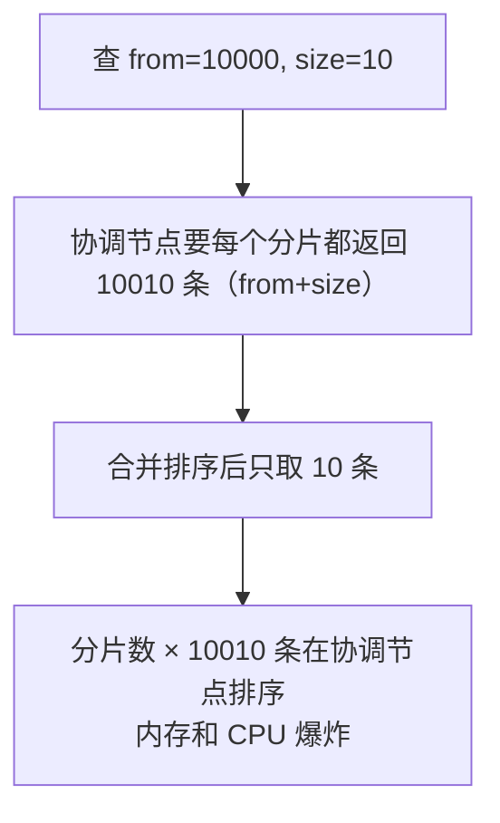
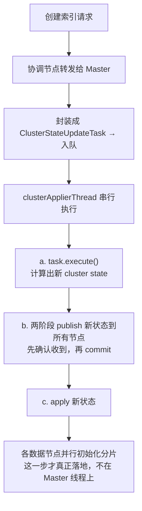
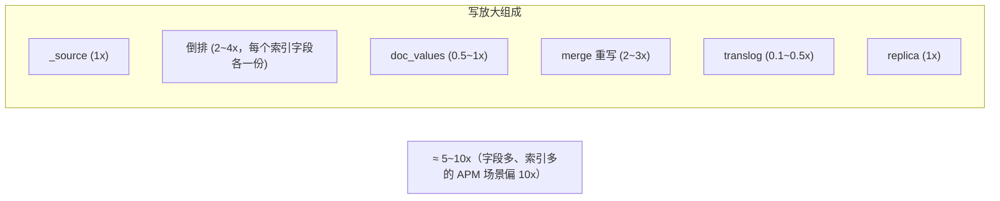

# ES 查询与调优

> 本章是 ES 工程实战篇：Query DSL、聚合、深分页三大分页方式、索引/查询/写入调优、集群运维（脑裂/恢复/ILM）、写放大回顾。面试和生产都高频。

---

## 一、核心概念：Query DSL

ES 用 **JSON 描述查询**，叫 Query DSL。两大查询上下文是调优的根基：

| 上下文 | 是否打分 | 是否缓存 | 用途 |
|--------|---------|---------|------|
| **query（查询）** | 算相关性分 | 否 | 全文搜索，结果按相关性排序 |
| **filter（过滤）** | 不算分 | **可缓存** | 精确匹配、范围、时间过滤 |

> 💡 **调优第一原则**：**能用 filter 就用 filter**。filter 不打分、可缓存、更快。只有需要按相关性排序的全文搜索才用 query。bool 查询里 `filter` 子句就是干这个的。

### 1.1 常用查询类型

| 查询 | 用途 | 例子场景 |
|------|------|---------|
| **match** | 全文搜索（先分词再匹配倒排） | 搜「华为手机」匹配标题 |
| **match_phrase** | 短语匹配（顺序 + 邻近） | 精确匹配「华为手机」整体 |
| **term** | 精确匹配（不分词） | 状态=1、订单号=xxx |
| **terms** | 多值精确匹配（IN） | 状态 in [1,2,3] |
| **range** | 范围 | 时间范围、价格区间 |
| **bool** | 组合查询（must/should/filter/must_not） | 综合条件 |
| **exists** | 字段是否存在 | 有备注的文档 |
| **prefix / wildcard / regexp** | 模式匹配 | 前缀搜索、通配符（慢，慎用） |

### 1.2 bool 查询四子句（高频考点）

```json
{
  "bool": {
    "must":     [ { "match": { "title": "手机" } } ],   // 必须，算分
    "filter":   [ { "term":  { "status": 1 } } ],        // 必须，不算分，可缓存
    "should":   [ { "term":  { "tag": "热销" } } ],      // 可选，命中加分
    "must_not": [ { "term":  { "deleted": true } } ]     // 必须不满足，不算分
  }
}
```

| 子句 | 是否必须满足 | 是否打分 | 缓存 |
|------|------------|---------|------|
| must | 是 | 是 | 否 |
| filter | 是 | 否 | **是** |
| should | 否（命中加分，或满足 minimum_should_match） | 是 | 否 |
| must_not | 是（必须不满足） | 否 | 是 |

> ⚠️ **经典坑**：`term` 查 text 字段经常搜不到！因为 text 写入时分词了，`term` 不分词去精确匹配分词后的 token。查精确值要用 keyword 子字段或 term 查 keyword 字段。

### 1.3 wildcard 的陷阱

- `wildcard` 通配符查询（如 `*手机*`）**前缀是通配符时无法用倒排索引**，几乎全 term 扫描，极慢。
- 能用 `match` / `match_phrase` 就别用 wildcard；真要前缀搜索用 `prefix` 或 completion suggester。

---

## 二、聚合（Aggregation）

### 2.1 三类聚合

| 类型 | 作用 | 类比 |
|------|------|------|
| **Bucket（桶聚合）** | 按规则分桶，每桶含一组文档 | SQL `GROUP BY` |
| **Metric（指标聚合）** | 对桶内文档算指标（sum/avg/max/min/cardinality） | SQL `COUNT/SUM/AVG` |
| **Pipeline** | 对其他聚合结果再聚合（如桶排序、求均值） | 对聚合结果再加工 |

### 2.2 典型示例：按品牌分桶求平均价格

```json
{
  "size": 0,                          // 只要聚合结果，不要文档
  "aggs": {
    "by_brand": {
      "terms": { "field": "brand.keyword", "size": 10 },  // 桶聚合
      "aggs": {
        "avg_price": { "avg": { "field": "price" } }        // 子聚合：桶内均价
      }
    }
  }
}
```

### 2.3 聚合性能要点

- 聚合走 **Doc Values**（不是倒排），所以 text 字段不能直接聚合（要靠 fielddata，不推荐，或用 keyword 子字段）。
- `cardinality`（去重计数）用 HyperLogLog 算法，近似值，精度可调（`precision_threshold`）。
- 大数据量聚合耗内存，可配合 `size:0` 只返回聚合、限定时间范围、用预计算（如 transform / rollup）。

---

## 三、深分页（深分页是高频面试题）★

### 3.1 三种分页方式对比

| 方式 | 原理 | 优点 | 缺点 | 适用 |
|------|------|------|------|------|
| **from + size** | 跳过 from 取 size | 简单、可随机跳页 | 深翻页极慢，受 `max_result_window`(默认10000)限制 | 浅分页、用户分页浏览 |
| **scroll** | 创建快照，用 scroll_id 逐批取 | 全量遍历快 | 占资源、非实时（快照）、有上下文开销、7.10+不推荐 | 一次性全量导出 |
| **search_after** | 基于上一页最后一条的排序值取下一页 | 无状态、性能稳定、实时 | 不能随机跳页、需唯一排序字段 | 深分页、实时流式翻页（推荐） |

### 3.2 为什么 from+size 深翻页慢



- 所以默认 `max_result_window = 10000`，超过直接报错。
- 深翻页用 **search_after**：带上一页最后一条的排序值，每个分片只查「大于该值」的若干条，无需跳过大量数据。

### 3.3 search_after 示例

```json
// 第一页：按时间倒序
{ "size": 10, "sort": [ { "timestamp": "desc" }, { "_id": "asc" } ] }

// 第二页：带上第一页最后一条的排序值
{ "size": 10, "sort": [...],
  "search_after": [ "2026-07-21T10:00:00", "doc_abc" ] }
```

> ⚠️ search_after 要求排序字段**唯一**（常用 `timestamp + _id` 联合排序），否则可能漏数据或重复。

### 3.4 scroll 为什么不推荐了

- scroll 维护服务端快照上下文，占用堆内存，超时才清理，大批量并发会拖垮集群。
- 7.10+ 官方推荐用 **point in time（PIT）+ search_after** 替代 scroll，更轻量、更安全。

> 💡 面试答法：用户分页浏览用 from+size（浅）；全量导出用 scroll/PIT；深翻页或实时流式用 search_after（推荐）。

---

## 四、调优

### 4.1 索引侧调优

| 手段 | 说明 |
|------|------|
| **合理分片数** | 单分片 < 50GB，分片不宜过多（fan-out 开销） |
| **副本数** | 写入密集时可临时设 0，写完恢复（牺牲可用性换写入） |
| **refresh_interval** | 写密集调大（如 30s~60s）减少 segment 生成；搜索密集调小（1s）。可设 -1 临时关闭 |
| **批量 bulk** | 单条写慢，用 bulk 批量，合理 batch size（如 5MB） |
| **mapping 优化** | 不需要搜索/聚合的字段关索引/关 doc_values；text 配 keyword 子字段 |
| **滚动索引 + ILM** | 日志类按天/大小 rollover，便于 TTL 清理，避免单索引过大 |

### 4.2 查询侧调优

| 手段 | 说明 |
|------|------|
| **filter 替代 query** | 不打分、可缓存 |
| **避免深分页** | 用 search_after 替代深 from+size |
| **限制返回字段** | `_source` 过滤只取需要的字段，省网络和反序列化 |
| **合理 size** | 别一次取太多 |
| **用 routing** | 按业务键路由，查询带 routing 只查目标分片，减少 fan-out |
| **避免 wildcard 前缀通配** | 改用 match/prefix |
| **预聚合** | 大量聚合用 transform/rollup 预计算 |

### 4.3 写入侧调优

| 手段 | 说明 |
|------|------|
| **bulk 批量** | 减少 HTTP 往返 |
| **调大 refresh_interval** | 减少小 segment 生成，降 merge 压力 |
| **写时副本设 0，写完恢复** | 副本写入双倍开销，批量导入时临时关 |
| **translog 异步** | `index.translog.durability: async`，定期刷盘换性能（代价是崩溃丢少量数据） |
| **关 mapping 动态推断** | 避免意外推断和 mapping 爆炸 |
| **单 bulk 请求路由** | 按分片分组提交，减少协调开销 |

### 4.4 JVM 与系统调优

- **堆内存**：建议不超过物理内存 50%，且不超过 31GB（指针压缩阈值）。剩下留给 OS 文件缓存（Lucene 靠 page cache 提升读性能）。
- **避免大堆**：堆太大 GC 停顿长，反而慢。
- **关 swap**：`bootstrap.memory_lock: true` 锁定内存，防 swap 拖垮性能。
- **SSD**：ES 对磁盘 IO 敏感，生产用 SSD。

---

## 五、集群运维

### 5.1 集群健康监控

- `_cluster/health`：green / yellow / red。
- `_cat/indices`：看每个索引的健康、文档数、大小。
- `_cat/shards`：分片分布、未分配原因。
- `_cat/allocation`：各节点磁盘使用。

### 5.2 分片未分配的常见原因

- 节点磁盘满（水位线 `cluster.routing.allocation.disk.watermark`，默认 85% 高、90% 警告、95% 只读）。
- 副本和主分片在同节点（不允许）导致单节点无法满足。
- 节点掉线后分片需要重新分配（recovery）。

### 5.3 Recovery（恢复）

- 节点重启或分片迁移时，分片要从副本恢复（主从同步 + translog 回放）。
- 大分片恢复慢，影响集群可用性，这也是「单分片别超 50GB」的原因之一。

### 5.4 ILM（索引生命周期管理）

- 自动管理时序索引：**rollover**（按大小/时间建新索引）-> **force_merge**（合并 segment 降存储）-> **shrink**（缩分片数）-> **delete**（过期清理）。
- 日志/APM 场景必备，避免数据无限膨胀。

### 5.5 脑裂（见 05 章）

7.0+ 自动规避，3 个奇数专用 master 节点是最佳实践。

### 5.6 索引创建风暴与 Master 任务队列 ★

> 同一时间大量创建索引会导致集群卡顿甚至假死。根因在 Master 的串行任务队列，不在数据节点。务必区分「创建索引（改元数据）」和「写入文档（走 indexing 线程池）」是两条完全不同的通道。

#### 5.6.1 为什么创建索引特别"贵"

- **创建索引本质是修改集群状态（cluster state）**：要由 Master 计算新状态（含新索引、mapping、分片分配方案）并**发布到所有节点**，开销远高于普通数据写入。
- 它走的是 **Master 的元数据串行通道**，而非数据并行的写入通道，所以并发能力天然有限，一挤就排队。

#### 5.6.2 ClusterStateUpdateTask 任务队列机制（根因）

创建/删除索引、改 mapping、分片分配等，都被封装成 **`ClusterStateUpdateTask`** 提交到 Master 节点的任务队列：



队列三个关键特性：

| 特性 | 说明 | 影响 |
|------|------|------|
| **串行单线程** | 所有任务在 `clusterApplierThread` 依次执行 | 并发上不去，排队等待 |
| **优先级队列** | 高优先级插队，同优先级才 FIFO | 建索引可能被恢复/选主类任务反复插队 |
| **可批量合并（Batcher）** | 把能合并的多个 task 合成一批发布 | 减少发布次数，但合并有限度 |

> ⚠️ **为什么必须串行**：cluster state 是全集群共享的真相源，必须保证变更有序、不撕裂状态，所以 ES 选择串行化保证一致性。串行是设计取舍，不是缺陷。

> 💡 **分清两步**：第①步"决定建什么、分片放哪"在 **Master 串行队列**（瓶颈在这）；第②步"分片真正初始化落地"在**各数据节点并行**。瓶颈在 Master 元数据通道，不在数据节点。

#### 5.6.3 大量创建索引会导致的问题

| 问题 | 原因 |
|------|------|
| **Master 过载** | 任务在串行队列堆积，Master CPU 飙高、任务排队，极端触发重新选主 |
| **分片分配风暴（Recovery 风暴）** | 海量分片同时初始化，磁盘 I/O、CPU、内存被榨干，触发分配限流排队、集群长时间 Yellow |
| **JVM 堆压力** | 每个分片有 Lucene 实例和元数据开销驻留堆，分片数爆炸 -> GC 频繁 -> 节点 STW 假死被踢出 |
| **Cluster State / Mapping 膨胀** | 字段多 + 动态映射 -> cluster state 迅速膨胀 -> 在**每个节点**全量持有 -> 拖垮全集群（mapping explosion） |
| **磁盘水位线触发只读** | 大量分片同时落盘吃掉磁盘，到 flood（95%）索引被强制只读，写入失败 |
| **文件句柄 / inode 耗尽** | 每个分片大量文件，撞系统文件句柄上限或耗尽 inode |
| **创建超时 + 重试雪崩** | Master 处理不过来 -> 超时 -> 应用重试 -> 进一步加剧风暴，恶性循环 |

经验阈值：**每 GB 堆内存的分片数控制在 20 以内**；单分片 < 50GB。

#### 5.6.4 怎么观测

| 接口 | 看什么 |
|------|--------|
| `GET _cluster/health` | `number_of_pending_tasks`（待处理任务数）飙升 = 队列堆积的直接信号 |
| `GET _cluster/pending_tasks` | 看具体排队了哪些任务、优先级、等多久 |
| `GET _cat/thread_pool?v` | `master` 线程池的 queue / rejected |

> 💡 **面试金句**：创建索引是 `ClusterStateUpdateTask`，进 Master 的串行任务队列单线程处理，靠优先级 + 批量合并优化，并发能力有限。大量并发建索引会让 `pending_tasks` 堆积，这是 Master 过载的直观信号。

#### 5.6.5 怎么解决

| 手段 | 说明 |
|------|------|
| **错峰 / 限流创建** | 控制并发，分批建，别一窝蜂 |
| **预创建索引 / 用 ILM rollover / data stream** | 提前建好或按规则滚动，运行时只写不建（呼应 5.4 ILM） |
| **专用 Master 节点** | 3 个专用 master（不存数据、不协调），专门扛元数据操作 |
| **控制分片数** | 合理 primary shard 数，监控总分片数和每 GB 堆分片数 |
| **关动态映射** | `dynamic: false/strict`，防 mapping explosion |
| **磁盘水位线告警** | 提前预警，别等 95% 只读才处理 |

#### 5.6.6 ⚠️ 区分：索引创建风暴 vs 写入风暴

中文里"索引"既是名词（index）又是动词（建倒排），容易混淆。两类"风暴"根因不同、解法不同：

| 维度 | 索引创建风暴（大量建 index） | 写入风暴（大量写文档） |
|------|---------------------------|---------------------|
| 瓶颈 | Master 元数据串行队列 + 分片分配 | segment 生成 + merge |
| 通道 | ClusterStateUpdateTask（Master 串行） | indexing 线程池（数据节点并行） |
| 信号 | `pending_tasks` 飙升 | segment 数暴涨、CPU/IO 飙高 |
| 解法 | 错峰预创建 + 专用 Master + 控分片数 | bulk 批量 + 调大 refresh_interval + 写时副本设 0 |

> 两类风暴**根因不同**：建索引卡 Master 元数据队列，写文档卡 segment 生成与 merge。排查时先分清是哪一类，别开错药。

---

## 六、写放大回顾（呼应 SkyWalking）

> 这一节把 06 章的数据结构、写入流程和 SkyWalking 存储引擎章节串起来，是 ES 在 APM/日志场景的核心痛点。

一个 ES 文档落盘的磁盘占用 ≈：



- **两层放大**：① 同一数据存成多种结构（_source/倒排/doc_values/BKD）；② Lucene segment merge 重写。
- **APM 为什么特别吃亏**：写密集（海量 trace/log）+ 字段多索引多（一堆 tag 都建索引）+ 用不到全文搜索（APM 是按时间+维度聚合）。等于为不需要的全文搜索能力付 10x 写入代价。
- 这正是 SkyWalking 自研 BanyanDB（列式 + 不建倒排 + LSM）的出发点。详见「10-监控与可观测性/13-SkyWalking-存储引擎.md」。

> 💡 **面试答「ES 写放大」三要点**：① 多数据结构并存（_source/倒排/doc_values/BKD）② segment merge 重写 ③ 写密集 + 字段多索引多，三因叠加到 10x。

---

## 七、ES vs ClickHouse vs MySQL 对比

| 维度 | MySQL | Elasticsearch | ClickHouse |
|------|-------|---------------|-----------|
| 定位 | OLTP 关系库 | 搜索引擎 + 文档 NoSQL | OLAP 列式分析库 |
| 索引 | B+ 树 | 倒排索引 | 稀疏主键 + 列式 + 跳数索引 |
| 强项 | 事务、点查、Join | 全文搜索、模糊、聚合 | 海量数据聚合分析、极高压缩 |
| 写放大 | 小 | 大（5~10x，多结构+merge） | 小（列式+LSM，1~2x） |
| 实时性 | 强一致 | 近实时（1s refresh） | 近实时（parts merge） |
| 典型场景 | 业务核心数据 | 搜索、日志、APM | 大表分析、报表、用户行为分析 |
| 全文搜索 | 弱 | **强** | 弱 |

> 选型口诀：要事务点查选 MySQL；要全文搜索选 ES；要海量数据分析选 ClickHouse。日志/APM 数据量大且不要全文搜索，可考虑 ClickHouse 或专用库（如 BanyanDB/Loki）降本。

---

## 八、常见面试题

1. **query 和 filter 区别？什么时候用 filter？**
   query 算相关性分、不缓存；filter 只判匹配、不算分、可缓存。精确匹配/范围/时间过滤用 filter，更快且省缓存；只有需要相关性排序的全文搜索才用 query。

2. **bool 查询四子句？**
   must（必须，打分）/ filter（必须，不打分，可缓存）/ should（可选，命中加分）/ must_not（必须不满足，不打分，可缓存）。

3. **为什么 term 查 text 字段搜不到？**
   text 写入时分词了，存的是分词后的 token；term 不分词去精确匹配，token 对不上就搜不到。查精确值要用 keyword 字段或 keyword 子字段。

4. **ES 深分页为什么慢？三种分页方式怎么选？**
   from+size 深翻页要每个分片返回 from+size 条在协调节点排序，内存爆，且有 max_result_window 10000 限制。用户浅分页用 from+size；全量导出用 scroll/PIT；深翻页/实时流式用 search_after（推荐，需唯一排序字段）。

5. **search_after 和 scroll 区别？**
   search_after 无状态、基于排序值翻页、实时，适合深翻页；scroll 维护服务端快照、占资源、非实时，适合一次性全量导出，7.10+ 被 PIT+search_after 替代。

6. **ES 写入怎么调优？**
   bulk 批量、调大 refresh_interval、批量写时副本临时设 0、translog 异步刷盘、关动态 mapping、按分片分组提交。搜索侧：filter 替代 query、避免深分页、用 routing、限制 _source。

7. **ES 堆内存为什么建议不超过 31GB？**
   超过 31GB（实际是对象指针压缩阈值）JVM 会用普通指针，内存占用增加、GC 效率下降。同时留一半物理内存给 OS 文件缓存（Lucene 靠 page cache 提升读性能）。

8. **ES 集群 Red 怎么排查？**
   查 `_cluster/health` 和 `_cat/shards` 看哪个分片未分配及原因；常见是磁盘水位线超限（只读）、节点掉线、副本和主同节点。对应处理：清磁盘/加节点/调水位线。

9. **ES 写放大从哪来？APM 场景为什么特别吃亏？**
   ① 同一数据存多种结构（_source/倒排/doc_values/BKD）；② segment merge 重写。APM 写密集+字段多索引多+用不到全文搜索，三因叠加到 10x，这正是 BanyanDB 的出发点。

10. **ES、ClickHouse、MySQL 怎么选？**
    要事务点查选 MySQL；要全文搜索选 ES；要海量数据分析选 ClickHouse。日志/APM 数据量大且不要全文搜索，可考虑 ClickHouse 或专用库降本。

11. **同一时间大量创建索引会导致什么问题？根因是什么？**
    Master 串行任务队列堆积 -> Master 过载、分片分配风暴、JVM 堆压力、cluster state/mapping 膨胀、磁盘水位线只读、创建超时重试雪崩。根因是创建索引本质是修改 cluster state，封装成 ClusterStateUpdateTask 进 Master 单线程串行队列，并发能力有限。观测 `number_of_pending_tasks` 飙升。解法：错峰预创建 + 专用 Master + 控制分片数。

12. **建索引有任务队列吗？怎么工作的？**
    有。创建/删除索引、改 mapping、分片分配等都被封装成 ClusterStateUpdateTask，提交到 Master 的任务队列，在 `clusterApplierThread` 单线程串行执行（计算新状态 -> 两阶段 publish 到所有节点 -> apply）。队列是优先级队列、可批量合并（Batcher）。普通写入文档走的是各数据节点的 indexing 线程池并行，与元数据队列是两条独立通道。

---

## 九、资料勘误与重点提醒

1. **type 已弃用**：早期资料/课程仍讲「Index=库、Type=表、Document=行」，把 Index 当数据库、Type 当表。**这是过时认知**：7.x 起 type 弃用、8.0 移除，现在 **Index 就当一张表**，不要再用 type 概念。
2. **「ES 是数据库」要带限定**：ES 具备数据库特征但**不是通用 RDBMS**，没有跨文档事务和强 Join 能力。面试说「是数据库」要补「是搜索型/文档型 NoSQL」。
3. **主分片数不能改是硬约束**：很多资料只说「创建时定」不说为什么。根因是路由 `hash(routing)%主分片数`，改了文档就找不到分片，必须 reindex。
4. **refresh vs flush 易混**：refresh 是「可搜」（生成内存 segment，没落盘），flush 才是「持久化」（fsync+清 translog）。面试常被绕，务必分清。
5. **APM 场景写放大是高频进阶点**：与 SkyWalking 存储引擎章节呼应，体现「为不需要的全文搜索付写入代价」，是 ES 在可观测性场景被替代的主因。
6. **「大量创建索引」≠「大量写入文档」**：中文「索引」既是名词（index 集合）又是动词（建倒排）。大量创建索引卡 Master 元数据串行队列（pending_tasks），大量写入文档卡 segment 生成与 merge（indexing 线程池）。两类风暴根因和解法都不同，排查时先分清是哪一类。
