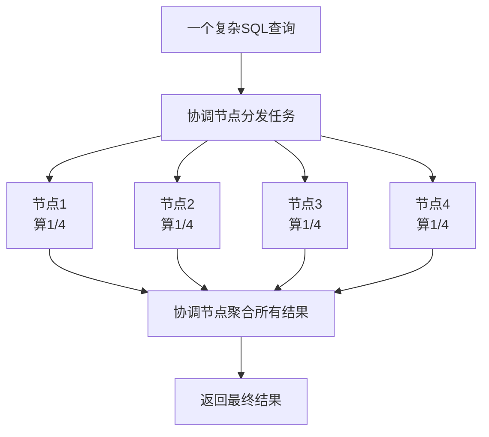
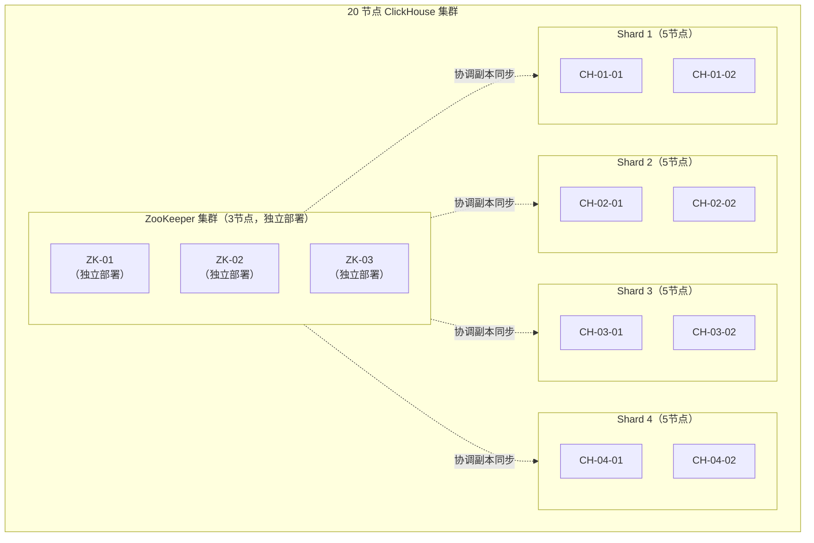
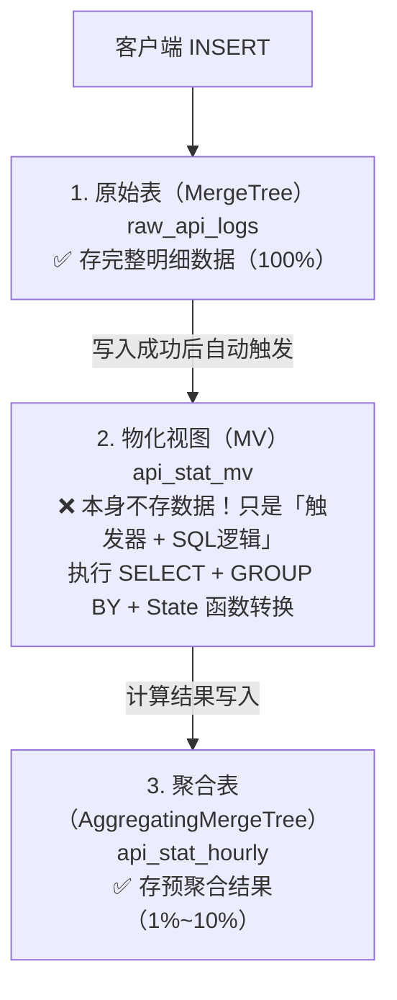

# ClickHouse 基础与部署

---

## 一、基础概念：OLTP vs OLAP vs MPP

在学习 ClickHouse 之前，先搞清楚三个核心概念。

### 1.1 OLTP（Online Transaction Processing）

**中文：** 联机事务处理

**一句话理解：** 面向「交易」的数据库，处理高频的增删改查。

**核心特点：**
- 高并发、低延迟
- 操作数据量小（单行/几行）
- 需要事务（ACID）
- 数据量中等

**典型场景：**
- 电商下单、支付
- 用户注册登录
- 银行转账

**常见数据库：** MySQL、PostgreSQL、Oracle、SQL Server

---

### 1.2 OLAP（Online Analytical Processing）

**中文：** 联机分析处理

**一句话理解：** 面向「分析」的数据库，处理海量数据的统计分析。

**核心特点：**
- 并发不高，但单次查询数据量大
- 复杂的聚合、统计计算
- 读多写少，批量写入
- 数据量巨大（TB-PB级）

**典型场景：**
- 报表统计
- 日志分析
- 用户行为分析
- 监控指标聚合

**常见数据库：** ClickHouse、Doris、StarRocks、Druid、Greenplum

---

### 1.3 MPP（Massively Parallel Processing）

**中文：** 大规模并行处理

**一句话理解：** 把一个大查询拆成N份，在N个节点上同时算。

**核心思想：** 分而治之 + 并行计算

**工作原理：**


**常见 MPP 数据库：** ClickHouse、Greenplum、Doris、StarRocks

---

### 1.4 概念对比总结

| 维度 | OLTP | OLAP |
|------|------|------|
| 面向 | 交易（事务） | 分析（统计） |
| 查询特点 | 高频、小数据量 | 低频、大数据量 |
| 典型SQL | `SELECT * FROM user WHERE id = 123` | `SELECT count(*) FROM logs GROUP BY date` |
| 数据量 | GB-TB | TB-PB |
| 是否需要事务 | 必须 | 一般不需要 |
| 存储方式 | 行存为主 | 列存为主 |
| 代表数据库 | MySQL、PostgreSQL | ClickHouse、Doris |

### 1.5 常见数据库归类

| 数据库 | 类型 | 定位 |
|--------|------|------|
| MySQL | OLTP | 通用关系型数据库 |
| PostgreSQL | OLTP | 高级关系型数据库 |
| Oracle | OLTP | 商用关系型数据库 |
| **ClickHouse** | **OLAP + MPP** | **列式分析数据库** |
| Doris / StarRocks | OLAP + MPP | 国产MPP分析数据库 |
| Greenplum | OLAP + MPP | 基于PostgreSQL的MPP |
| Druid | OLAP | 时序分析数据库 |
| **Elasticsearch** | **搜索引擎 + 轻量OLAP** | **全文检索引擎，也常用作日志分析/指标存储** |
| **MongoDB** | **NoSQL 文档型** | **文档数据库，可存半结构化数据，OLTP为主，少量分析** |
| Redis | KV缓存 | 内存缓存数据库 |
| Hive | OLAP（离线） | Hadoop数仓引擎 |
| Presto/Trino | OLAP（查询引擎） | 联邦查询引擎 |

---

## 二、ClickHouse 概述

### 2.1 什么是 ClickHouse

ClickHouse 是俄罗斯 Yandex 公司开源的 **列式存储数据库**，专门用于 **OLAP（在线分析处理）** 场景。

**核心特点：**
- 🚀 **极致性能**：查询速度比传统数据库快 100-1000 倍
- 📊 **列式存储**：只读取需要的列，IO 效率极高
- 🗜️ **高效压缩**：相同数据占用空间仅为 MySQL 的 1/5-1/10
- 🔄 **向量化执行**：利用 SIMD 指令加速计算
- 🧩 **丰富的表引擎**：不同场景选择不同引擎（MergeTree、Log、Memory 等）

### 1.2 适用场景 vs 不适用场景

| ✅ 适用场景 | ❌ 不适用场景 |
|-----------|-------------|
| 日志分析与存储 | 频繁的单行 UPDATE/DELETE |
| 指标监控与可观测性 | 事务型 OLTP 业务 |
| 用户行为分析 | 需要高并发点查询 |
| 广告/电商报表分析 | 需要频繁的 JOIN 操作 |
| 时序数据存储 | 数据量很小（百万级以下） |

---

## 二、生产环境大规模部署方案（20节点）

### 2.1 集群架构规划

#### 2.1.1 整体架构



#### 2.1.2 节点分配方案

| 节点类型 | 数量 | 规格推荐 | 说明 |
|---------|------|---------|------|
| **ClickHouse 数据节点** | 20 | 64核 / 256G内存 / 4T SSD * 4 | 每台配置 RAID0 |
| **ZooKeeper 节点** | 3 | 8核 / 16G内存 / 500G SSD | 独立部署，不混部 |
| **合计** | **23** | - | 20 + 3 架构 |

**分片策略：**
- **分片数（Shards）：** 4 个分片
- **副本数（Replicas）：** 每个分片 5 个副本
- **总容量：** 单分片 5 台 × 16T ≈ 80T，4分片 ≈ 320T 裸容量
- **压缩后：** 按 5:1 压缩比，可存约 **1.5PB** 数据

---

### 2.2 ZooKeeper 集群详细配置

#### 2.2.1 ZK 部署注意事项

> ⚠️ **ZooKeeper 是 ClickHouse 集群的「大脑」，必须保证稳定！**

**为什么独立部署？**
- ZK 对磁盘延迟非常敏感，混部会导致 ZK 性能抖动
- ZK 性能下降会直接导致 ClickHouse 写入变慢甚至超时
- ZK 集群挂了，整个 ClickHouse 集群无法正常工作

#### 2.2.2 ZK 配置文件（zoo.cfg）

```ini
# 基础配置
tickTime=2000
initLimit=30
syncLimit=10
dataDir=/data/zookeeper/data
dataLogDir=/data/zookeeper/log
clientPort=2181

# 客户端连接数限制
maxClientCnxns=2000

# 关键优化：事务日志预写入
forceSync=no
# 生产环境建议 forceSync=yes，除非你有电池保护卡

# 节点配置
server.1=zk-01:2888:3888
server.2=zk-02:2888:3888
server.3=zk-03:2888:3888

# 自动清理（重要！）
autopurge.snapRetainCount=10
autopurge.purgeInterval=24
```

#### 2.2.3 ZK 磁盘规划

```
# 事务日志单独挂盘（必须是 SSD！）
/data/zookeeper/log  → 独立 SSD 盘（低延迟优先）
/data/zookeeper/data → 普通 SSD
```

**为什么事务日志要单独挂盘？**
- ZK 每次写入都要 fsync 事务日志
- 这个操作对延迟极其敏感
- 磁盘延迟 1ms → 1000 TPS，磁盘延迟 10ms → 100 TPS

---

### 2.3 ClickHouse 节点配置

#### 2.3.1 核心配置文件（config.xml）

```xml
<!-- 监听地址 -->
<listen_host>::</listen_host>

<!-- 数据存储路径 -->
<path>/data/clickhouse/</path>
<tmp_path>/data/clickhouse/tmp/</tmp_path>
<user_files_path>/data/clickhouse/user_files/</user_files_path>

<!-- ZooKeeper 配置 -->
<zookeeper>
    <node>
        <host>zk-01</host>
        <port>2181</port>
    </node>
    <node>
        <host>zk-02</host>
        <port>2181</port>
    </node>
    <node>
        <host>zk-03</host>
        <port>2181</port>
    </node>
    <!-- 会话超时：ZK 与 CH 的心跳超时 -->
    <session_timeout_ms>30000</session_timeout_ms>
    <!-- 操作超时：单次 ZK 操作的超时时间 -->
    <operation_timeout_ms>10000</operation_timeout_ms>
    <!-- 根目录，避免多个集群混用时冲突 -->
    <root>/clickhouse/prod</root>
</zookeeper>

<!-- 标记删除的数据保留时间（防止误删） -->
<mark_cache_size>5368709120</mark_cache_size>
<uncompressed_cache_size>8589934592</uncompressed_cache_size>

<!-- 合并线程数调整 -->
<background_pool_size>32</background_pool_size>
<background_schedule_pool_size>32</background_schedule_pool_size>

<!-- 分布式查询配置 -->
<max_distributed_connections>1024</max_distributed_connections>
<distributed_connections_pool_size>512</distributed_connections_pool_size>
```

#### 2.3.2 用户配置（users.xml）

```xml
<!-- 内存限制：单查询最大内存 -->
<max_memory_usage>128849018880</max_memory_usage>  <!-- 120G -->

<!-- 所有查询总内存限制 -->
<max_memory_usage_for_all_queries>214748364800</max_memory_usage>  <!-- 200G -->

<!-- 超时设置 -->
<max_execution_time>300</max_execution_time>  <!-- 5分钟 -->
<keep_alive_timeout>300</keep_alive_timeout>

<!-- 并发限制 -->
<max_concurrent_queries>200</max_concurrent_queries>

<!-- 分布式查询优化 -->
<distributed_group_by_no_merge>0</distributed_group_by_no_merge>
<optimize_skip_unused_shards>1</optimize_skip_unused_shards>
```

#### 2.3.3 集群拓扑配置（metrika.xml）

```xml
<remote_servers>
    <!-- 生产集群配置 -->
    <prod_cluster>
        <!-- 分片 1 -->
        <shard>
            <internal_replication>true</internal_replication>
            <replica>
                <host>ch-01-01</host>
                <port>9000</port>
            </replica>
            <replica>
                <host>ch-01-02</host>
                <port>9000</port>
            </replica>
            <replica>
                <host>ch-01-03</host>
                <port>9000</port>
            </replica>
            <replica>
                <host>ch-01-04</host>
                <port>9000</port>
            </replica>
            <replica>
                <host>ch-01-05</host>
                <port>9000</port>
            </replica>
        </shard>
        
        <!-- 分片 2-4 配置同上... -->
        
    </prod_cluster>
</remote_servers>

<!-- 宏定义：每个节点不一样！ -->
<macros>
    <!-- 分片编号 -->
    <shard>01</shard>
    <!-- 副本编号 -->
    <replica>01</replica>
    <!-- 集群名称 -->
    <cluster>prod_cluster</cluster>
</macros>
```

> ✅ **最佳实践：** 使用宏定义，建表 SQL 可以通用，不用硬编码分片副本信息。

---

### 2.4 操作系统级别优化

#### 2.4.1 关闭 Swap

```bash
# 临时关闭
swapoff -a

# 永久关闭（修改 /etc/fstab，注释 swap 行）
sed -i '/swap/s/^/#/' /etc/fstab

# 降低 swap 使用倾向
echo 'vm.swappiness = 1' >> /etc/sysctl.conf
```

#### 2.4.2 网络优化

```bash
# 增大连接跟踪表大小
echo 'net.netfilter.nf_conntrack_max = 1048576' >> /etc/sysctl.conf

# TCP 优化
echo 'net.core.somaxconn = 4096' >> /etc/sysctl.conf
echo 'net.ipv4.tcp_syncookies = 1' >> /etc/sysctl.conf
echo 'net.ipv4.tcp_tw_reuse = 1' >> /etc/sysctl.conf
echo 'net.ipv4.tcp_fin_timeout = 30' >> /etc/sysctl.conf
```

#### 2.4.3 文件句柄限制

```bash
# /etc/security/limits.conf
clickhouse soft nofile 262144
clickhouse hard nofile 262144
```

---

## 三、表引擎详解

### 3.1 表引擎分类

ClickHouse 有 **20+ 种表引擎**，按用途分为 4 大类：

| 分类 | 代表引擎 | 用途 |
|------|---------|------|
| **MergeTree 家族** | MergeTree、ReplacingMergeTree、SummingMergeTree | 生产环境主力，存储海量数据 |
| **Log 家族** | TinyLog、Log、StripeLog | 小数据量临时表，测试用 |
| **集成引擎** | MySQL、Kafka、HDFS | 对接外部系统 |
| **特殊引擎** | Memory、Distributed、Dictionary、View | 特殊场景 |

---

### 3.2 MergeTree 家族（核心重点）

#### 3.2.1 MergeTree（基础版）

**特点：**
- 最基础的 MergeTree 引擎
- 支持分区、主键索引、数据副本
- 数据按主键排序存储

**适用场景：**
- 通用的日志、指标存储
- 需要按时间分区的场景
- 没有特殊聚合需求的场景

**建表示例：**
```sql
CREATE TABLE test.log_local ON CLUSTER prod_cluster
(
    `timestamp` DateTime COMMENT '日志时间',
    `level` String COMMENT '日志级别',
    `message` String COMMENT '日志内容',
    `hostname` String COMMENT '主机名'
)
ENGINE = MergeTree()
PARTITION BY toYYYYMMDD(timestamp)
ORDER BY (timestamp, hostname)
TTL timestamp + INTERVAL 30 DAY
SETTINGS index_granularity = 8192;
```

**优缺点：**

| ✅ 优点 | ❌ 缺点 |
|--------|---------|
| 查询速度快 | 不自动去重 |
| 支持分区 TTL | 不自动聚合 |
| 数据有序存储 | 相同主键多次写入会存多份 |

---

#### 3.2.2 ReplacingMergeTree（去重版）

**特点：**
- 在 MergeTree 基础上增加 **去重** 能力
- 后台合并时删除重复数据
- 相同排序键（ORDER BY）的数据只保留最新版本

**适用场景：**
- 数据可能重复写入的场景
- 需要保证数据唯一性
- 比如：用户维度表、配置同步表

**建表示例：**
```sql
CREATE TABLE test.user_profile ON CLUSTER prod_cluster
(
    `user_id` UInt64 COMMENT '用户ID',
    `username` String COMMENT '用户名',
    `email` String COMMENT '邮箱',
    `update_time` DateTime COMMENT '更新时间'
)
ENGINE = ReplacingMergeTree(update_time)  -- 指定版本字段，保留最新的
PARTITION BY toYYYYMM(update_time)
ORDER BY user_id  -- 按 user_id 去重
TTL update_time + INTERVAL 1 YEAR;
```

**⚠️ 注意事项：**
1. **去重只在后台合并时发生**，不是实时去重！
2. 查询时可能看到重复数据，需要加 `FINAL`
3. `FINAL` 会影响查询性能，不要滥用
4. 版本字段可以是 Int 或 DateTime，越大越新

**查询时强制去重：**
```sql
SELECT * FROM test.user_profile FINAL WHERE user_id = 12345;
```

**优缺点：**

| ✅ 优点 | ❌ 缺点 |
|--------|---------|
| 自动去重，简化业务逻辑 | 去重不是实时的 |
| 保留最新版本数据 | 查询需要 FINAL，有性能损耗 |
| 实现简单 | 不能删除数据，只能靠合并 |

---

#### 3.2.3 SummingMergeTree（聚合版）

**特点：**
- 后台合并时自动 **求和聚合**
- 相同排序键的数值列自动相加
- 大幅减少数据量，提升查询速度

**适用场景：**
- 统计报表、指标汇总
- 按维度聚合的监控数据
- 不需要原始明细，只看汇总

**建表示例：**
```sql
CREATE TABLE test.api_stat_hourly ON CLUSTER prod_cluster
(
    `stat_date` Date COMMENT '统计日期',
    `stat_hour` UInt8 COMMENT '统计小时',
    `api_path` String COMMENT '接口路径',
    `request_count` UInt64 COMMENT '请求次数',
    `error_count` UInt64 COMMENT '错误次数',
    `total_duration` UInt64 COMMENT '总耗时(ms)'
)
ENGINE = SummingMergeTree((request_count, error_count, total_duration))
PARTITION BY stat_date
ORDER BY (stat_date, stat_hour, api_path);
```

**工作原理：**
```
合并前：
2024-01-01, 10, /api/user, 100, 5, 5000
2024-01-01, 10, /api/user, 150, 8, 8000

合并后（自动求和）：
2024-01-01, 10, /api/user, 250, 13, 13000
```

**优缺点：**

| ✅ 优点 | ❌ 缺点 |
|--------|---------|
| 数据自动聚合，空间占用小 | 丢失原始明细数据 |
| 查询速度极快 | 只能求和，不能做其他聚合 |
| 写入性能好 | 聚合只在合并时发生，不实时 |

---

#### 3.2.4 AggregatingMergeTree（高级聚合版）

**特点：**
- 比 SummingMergeTree 更强大
- 支持 **任意聚合函数**（count、max、min、avg 等）
- 需要配合 AggregateFunction 类型使用

**适用场景：**
- 复杂的多维度聚合
- 需要多种聚合方式
- 预计算物化视图

**建表示例：**
```sql
CREATE TABLE test.api_stat_agg ON CLUSTER prod_cluster
(
    `stat_date` Date,
    `api_path` String,
    -- 定义聚合状态
    `count_state` AggregateFunction(count, UInt64),
    `max_state` AggregateFunction(max, UInt64),
    `quantile_state` AggregateFunction(quantile(0.95), Float64)
)
ENGINE = AggregatingMergeTree()
PARTITION BY stat_date
ORDER BY (stat_date, api_path);
```

**写入方式（特殊）：**
```sql
-- 写入时要用 State 函数
INSERT INTO test.api_stat_agg
SELECT 
    today(),
    api_path,
    countState(duration),
    maxState(duration),
    quantileState(0.95)(duration)
FROM raw_api_logs
GROUP BY today(), api_path;
```

**查询方式（特殊）：**
```sql
-- 查询时要用 Merge 函数
SELECT 
    stat_date,
    api_path,
    countMerge(count_state) AS total_count,
    maxMerge(max_state) AS max_duration,
    quantileMerge(0.95)(quantile_state) AS p95
FROM test.api_stat_agg
GROUP BY stat_date, api_path;
```

**优缺点：**

| ✅ 优点 | ❌ 缺点 |
|--------|---------|
| 支持任意聚合函数 | 使用复杂，学习成本高 |
| 预聚合后查询极快 | 写入和查询语法特殊 |
| 物化视图的黄金搭档 | 调试困难 |

---

#### 3.2.5 CollapsingMergeTree（折叠版）

**特点：**
- 通过 Sign 标记位实现 **行级删除/更新**
- Sign = 1 表示正常行，Sign = -1 表示取消（删除）
- 合并时相同主键的 +1 和 -1 相互抵消

**适用场景：**
- 需要更新数据的场景
- 状态变化频繁的业务
- 比如：用户行为流、订单状态变更

**建表示例：**
```sql
CREATE TABLE test.user_action ON CLUSTER prod_cluster
(
    `user_id` UInt64,
    `action_type` UInt8,
    `action_time` DateTime,
    `Sign` Int8  -- 标记位：1=新增，-1=删除
)
ENGINE = CollapsingMergeTree(Sign)
PARTITION BY toYYYYMM(action_time)
ORDER BY (user_id, action_type);
```

**工作原理：**
```
原始数据：
user_id=1, action_type=1, Sign=1  ← 用户第一次操作

用户状态变更，先删除旧的，再插新的：
user_id=1, action_type=1, Sign=-1 ← 删除旧的（折叠）
user_id=1, action_type=2, Sign=1  ← 插入新状态

合并后：
第一行和第二行折叠抵消，只保留第三行
```

**优缺点：**

| ✅ 优点 | ❌ 缺点 |
|--------|---------|
| 实现了行级更新能力 | 业务端要维护删除标记 |
| 性能比 ALTER UPDATE 好太多 | 写入逻辑复杂 |
| 支持高并发 | 合并前查询需要处理 Sign |

---

#### 3.2.6 VersionedCollapsingMergeTree（带版本的折叠）

**特点：**
- CollapsingMergeTree 的增强版
- 增加版本号字段，保证删除顺序正确
- 解决并发写入时的顺序问题

**适用场景：**
- 高并发的更新场景
- 分布式系统下的状态变更

**建表示例：**
```sql
ENGINE = VersionedCollapsingMergeTree(Sign, Version)
```

---

### 3.3 Log 家族

#### 3.3.1 TinyLog

**特点：**
- 最简单的引擎
- 每列一个文件，不压缩
- 没有索引

**适用场景：**
- 测试用
- 几千到几万行的小表

**优缺点：**
| ✅ 优点 | ❌ 缺点 |
|--------|---------|
| 写入快 | 查询慢 |
| 结构简单 | 不支持并发 |
| 易理解 | 生产环境禁用 |

---

#### 3.3.2 Log

**特点：**
- 比 TinyLog 多了个标记文件
- 支持并发读
- 同样没有索引

**适用场景：**
- 临时中间表
- 数据导入的中间层

---

### 3.4 集成引擎

#### 3.4.1 MySQL 引擎

**特点：**
- 直接映射 MySQL 表
- 查询时实时去 MySQL 拉数据
- 可以在 ClickHouse 中 JOIN MySQL 数据

**建表示例：**
```sql
CREATE TABLE mysql_users ON CLUSTER prod_cluster
(
    `id` UInt64,
    `username` String,
    `email` String
)
ENGINE = MySQL('mysql-host:3306', 'dbname', 'users', 'user', 'password');
```

**适用场景：**
- 维度表关联查询
- 小数据量的实时同步

---

#### 3.4.2 Kafka 引擎

**特点：**
- 直接消费 Kafka 数据
- 配合物化视图实现实时接入

**建表示例：**
```sql
CREATE TABLE kafka_log ON CLUSTER prod_cluster
(
    `raw_message` String
)
ENGINE = Kafka()
SETTINGS 
    kafka_broker_list = 'kafka-01:9092,kafka-02:9092',
    kafka_topic_list = 'logs',
    kafka_group_name = 'clickhouse-consumer',
    kafka_format = 'JSONAsString';
```

---

### 3.5 特殊引擎

#### 3.5.1 Memory

**特点：**
- 数据完全在内存中
- 重启丢失
- 速度极快

**适用场景：**
- 临时计算
- 极高频的小表查询
- 测试性能

---

#### 3.5.2 Distributed（分布式表）

**特点：**
- 不存储数据，只是个「路由代理」
- 查询时自动分发到各个分片
- 写入时按分片键分发

**建表示例：**
```sql
CREATE TABLE logs_all ON CLUSTER prod_cluster
AS logs_local
ENGINE = Distributed(prod_cluster, 'test', 'logs_local, rand());
```

**分片键选择：**
- `rand()` - 随机均匀分布
- `user_id` - 按用户分，同用户数据在一个分片
- `toYYYYMMDD(timestamp)` - 按日期分

---

### 3.6 MergeTree 家族参数详细对比（面试必考点）

这是面试高频问题，很多人搞混各引擎的参数规则。

---

#### 3.6.1 各引擎参数对照表

| 引擎 | 参数1 | 参数2 | 必填？ | 作用 |
|------|-------|-------|------|------|
| **MergeTree** | - | - | - | 基础版，不做特殊处理 |
| **ReplacingMergeTree** | version | - | ❌ 可选 | 相同键保留 version 最大的 |
| **CollapsingMergeTree** | sign | - | ✅ 必须 | 1 和 -1 折叠抵消 |
| **VersionedCollapsingMergeTree** | sign | version | ✅ 必须 | 折叠 + 版本保证顺序 |
| **SummingMergeTree** | (col1, col2...) | - | ❌ 可选 | 指定列自动求和 |
| **AggregatingMergeTree** | - | - | - | 按列类型自动聚合 |

---

#### 3.6.2 ReplacingMergeTree 深度解析

**语法：**
```sql
-- 带版本字段（推荐）
ReplacingMergeTree(version)

-- 不带版本字段（默认）
ReplacingMergeTree()
```

| 情况 | 去重规则 |
|------|---------|
| **指定了 version 字段** | 相同排序键的数据，**保留 version 最大的那行** |
| **没指定 version（默认）** | 相同排序键的数据，**保留最后写入的那行**（插入顺序） |

> ⚠️ **面试大坑：ReplacingMergeTree 有默认版本字段名吗？**
>
> **答案：没有！**
> - 你不传参数就是没有版本字段
> - 去重逻辑变成「后写入的赢」，而不是「版本大的赢」
> - 很多人误以为有个叫 `version` 的默认字段，**绝对没有！**

**推荐写法 vs 不推荐写法：**
```sql
-- ✅ 推荐：永远显式指定版本字段
ENGINE = ReplacingMergeTree(update_time)
-- 去重时：update_time 大的保留，并发安全

-- ❌ 不推荐：不指定版本
ENGINE = ReplacingMergeTree()
-- 去重时：最后写入的那行保留，高并发下可能乱序
```

---

#### 3.6.3 CollapsingMergeTree 深度解析

**语法：**
```sql
CollapsingMergeTree(sign)
```

| 参数 | 必须？ | 说明 |
|------|-------|------|
| `sign` | ✅ 必须传 | 标记列，值只能是 1 或 -1 |

**折叠规则：**
- `sign = 1` 的行和 `sign = -1` 的行，相同排序键会相互抵消
- 相同键 1 和 -1 数量相等 → 合并后都消失
- 多出来的那行保留

> **特点：** 没有版本字段！只有 sign 是必填！

---

#### 3.6.4 VersionedCollapsingMergeTree 深度解析

**语法：**
```sql
VersionedCollapsingMergeTree(sign, version)
```

| 参数 | 必须？ | 说明 |
|------|-------|------|
| `sign` | ✅ 必须 | 1 或 -1 |
| `version` | ✅ 必须 | 版本列，用于保证折叠顺序正确 |

**解决的问题：**
- 高并发下，可能 -1 先到，1 后到 → 折叠顺序乱了
- 加 version 后，按 version 排序保证折叠顺序正确

---

#### 3.6.5 SummingMergeTree 深度解析

**语法：**
```sql
-- 指定聚合列（推荐）
SummingMergeTree((col1, col2, col3))

-- 不指定（默认）
SummingMergeTree()
```

| 情况 | 聚合规则 |
|------|---------|
| **指定了列** | 这些数值列自动求和 |
| **不指定（默认）** | **所有数值列都自动求和**（除了排序键） |

> ⚠️ **又一个坑：不传参数会把所有数值列都求和！**
> - 小心不要把 ID、时间戳这类不需要求和的数值列不小心加进去
> - 推荐永远显式指定需要求和的列，不要用默认！

---

#### 3.6.6 AggregatingMergeTree 深度解析

**语法：**
```sql
AggregatingMergeTree()
```

| 参数 | 说明 |
|------|------|
| **无参数** | 不需要传任何参数 |

**为什么不需要参数？**
- 聚合逻辑是由列类型 `AggregateFunction` 决定的
- 不是由引擎参数决定的
- 建表时列定义了 `countState`, `maxState` 等类型，合并时自动按对应函数聚合

**State 的核心特性（面试考点）：**

1. **State 是中间聚合状态** - 存的不是最终结果，是特殊二进制结构
2. **合并是不可逆的** - StateA + StateB → 新 State，合了就拆不回去
3. **不同聚合函数行为不同：**

| 聚合函数 | State 行为 | 是否只增不减？ |
|---------|-----------|--------------|
| countState/sumState | 相加合并 | ✅ 是，只增不减 |
| maxState | 取最大值 | ⚠️ 非递减（不变或变大） |
| minState | 取最小值 | ⚠️ 非递增（不变或变小） |
| avgState/quantileState | 内部结构合并 | ⚠️ 可增可减，不单调 |

> ⚠️ **重要大坑：State 不可逆，源数据改了，已聚合的结果不会自动更新！想修正只能删分区重算！**

---

#### 3.6.8 AggregatingMergeTree + 物化视图（黄金搭档）

**99% 的 AggregatingMergeTree 都是和物化视图一起用的！**

**核心原因：** `AggregateFunction` 类型是二进制结构，你没法手动 INSERT，必须用 `countState/sumState` 等函数生成，而物化视图就是干这个的！

---

##### 三者关系图解（90% 的人搞混）



| 对象 | 存数据吗？ | 存的是什么 | 数据量占比 |
|------|-----------|-----------|-----------|
| 原始表 | ✅ 存 | 完整明细 | 100% |
| 物化视图（MV） | ❌ 不存 | 只有元数据（表结构+SQL逻辑） | 0% |
| 聚合表 | ✅ 存 | 预聚合后的 State | 1% ~ 10% |

> **MV 是个「虚拟存在」，更像一个触发器，不是真的表！**

---

##### 查询时查哪张表？

**直接查聚合表！**
```sql
-- ✅ 正确：查 AggregatingMergeTree 聚合表
SELECT
    stat_hour,
    api_path,
    countMerge(cnt_state) AS total_count,  -- 用 Merge 函数算出最终值
    sumMerge(sum_state) AS total_duration
FROM api_stat_hourly
WHERE stat_hour >= '2024-01-01'
GROUP BY stat_hour, api_path;

-- ❌ 错误：不要查 MV 本身，它不存数据
SELECT * FROM api_stat_mv;
```

---

##### 为什么设计成存两份？

| ✅ 好处 | ❌ 坏处 |
|--------|---------|
| 查询快：查聚合表只有 1% 数据量，秒出 | 占用双倍存储空间 |
| 灵活：新需求可以拿明细重新聚合 | 数据更新后聚合表不会自动同步 |
| 可多层级联：分钟 → 小时 → 天 | 写入放大，写 1 次等于写多次 |

---

##### 面试一句话总结

> **物化视图是计算触发层，AggregatingMergeTree 是存储层。MV 本身不存数据，只负责把新写入的数据实时计算成 State 写入聚合表。查询直接查聚合表，用 Merge 函数算出最终结果。**

---

#### 3.6.9 引擎参数最佳实践总结

| 引擎 | 推荐写法 | 原因 |
|------|---------|------|
| ReplacingMergeTree | `ReplacingMergeTree(update_time)` | 永远显式指定版本字段 |
| CollapsingMergeTree | 能不用就不用 | 业务逻辑太复杂 |
| SummingMergeTree | `SummingMergeTree((cnt, sum, duration))` | 显式指定聚合列，不要用默认 |
| AggregatingMergeTree | `AggregatingMergeTree()` | 不需要参数 |

---

## 四、表引擎选型指南

| 场景 | 推荐引擎 | 理由 |
|------|---------|------|
| 通用日志存储 | MergeTree | 稳定、功能全 |
| 数据可能重复 | ReplacingMergeTree | 自动去重 |
| 指标统计汇总 | SummingMergeTree | 自动求和 |
| 多维复杂聚合 | AggregatingMergeTree | 灵活聚合 |
| 需要更新状态 | CollapsingMergeTree | 行级更新 |
| Kafka 实时接入 | Kafka Engine + MV | 实时消费 |
| 临时测试表 | TinyLog / Memory | 简单快速 |

---

## 常见面试题

### 1. MergeTree 家族有哪些常用引擎？区别是什么？

**答案：**
- MergeTree - 基础版，有序存储
- ReplacingMergeTree - 去重版，相同主键保留最新
- SummingMergeTree - 聚合版，数值列自动求和
- AggregatingMergeTree - 高级聚合，支持任意聚合函数
- CollapsingMergeTree - 折叠版，通过 Sign 实现行级更新

### 2. ReplacingMergeTree 是实时去重吗？

**答案：**
**不是！** 去重只在后台合并（merge）时发生。合并前查询可能看到重复数据，需要加 `FINAL` 关键字强制去重，但会影响性能。

### 3. SummingMergeTree 和 AggregatingMergeTree 的区别？

**答案：**
- SummingMergeTree 只能做 **求和** 聚合，使用简单
- AggregatingMergeTree 支持 **任意聚合函数**（count/max/min/quantile 等），但使用复杂，需要 State/Merge 函数

### 4. ClickHouse 怎么实现更新？有几种方式？

**答案：**
1. **ALTER TABLE UPDATE** - 适合低频批量更新，性能差
2. **CollapsingMergeTree** - 通过 Sign 标记实现更新，性能好，业务端要处理逻辑
3. **VersionedCollapsingMergeTree** - 带版本的折叠，解决并发顺序问题

---

### 5. ReplacingMergeTree 有默认的版本字段吗？

**答案：**
**绝对没有！** 这是面试高频大坑。

- **传了 version 参数**：`ReplacingMergeTree(update_time)` → 相同排序键，保留 version 最大的那行
- **没传参数**：`ReplacingMergeTree()` → 相同排序键，保留最后写入的那行（按插入顺序）

> ✅ 最佳实践：永远显式指定版本字段，不要用默认行为！高并发下默认行为会乱序。

---

### 6. SummingMergeTree 不传参数会怎么样？

**答案：**
**所有数值列（除了排序键）都会被自动求和！**

这也是个坑：
- 你有个 `user_id` 是 UInt64，但不是排序键
- 建表写了 `SummingMergeTree()` 没传参数
- 合并时 `user_id` 也会被求和，数据直接废了

> ✅ 最佳实践：永远显式指定需要求和的列：`SummingMergeTree((col1, col2, col3))`

---

### 7. 哪些 MergeTree 引擎的参数是必填的？

**答案：**

| 引擎 | 参数是否必填 |
|------|------------|
| CollapsingMergeTree | ✅ sign 必须传 |
| VersionedCollapsingMergeTree | ✅ sign 和 version 都必须传 |
| ReplacingMergeTree | ❌ version 可选 |
| SummingMergeTree | ❌ 聚合列可选 |
| AggregatingMergeTree | ❌ 无参数 |

### 5. 生产环境为什么不推荐用 Memory 引擎？

**答案：**
- 重启数据全丢
- 内存容量有限，存不了大数据
- 性价比低（内存比磁盘贵太多）
