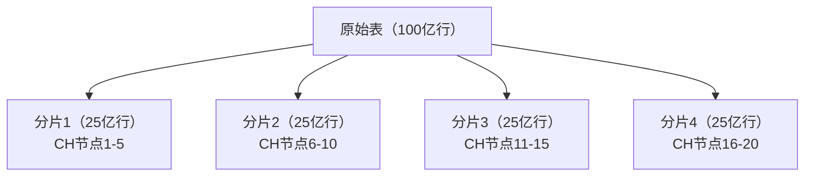
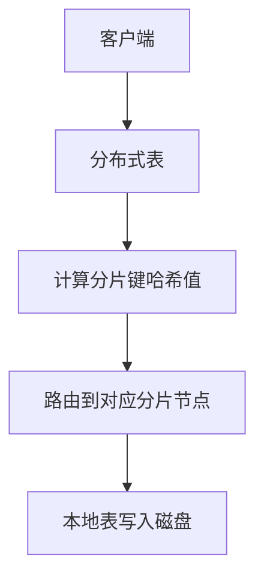
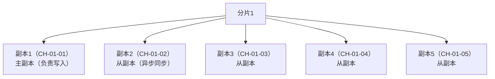
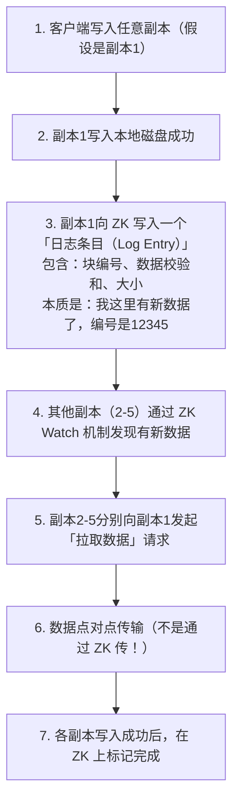
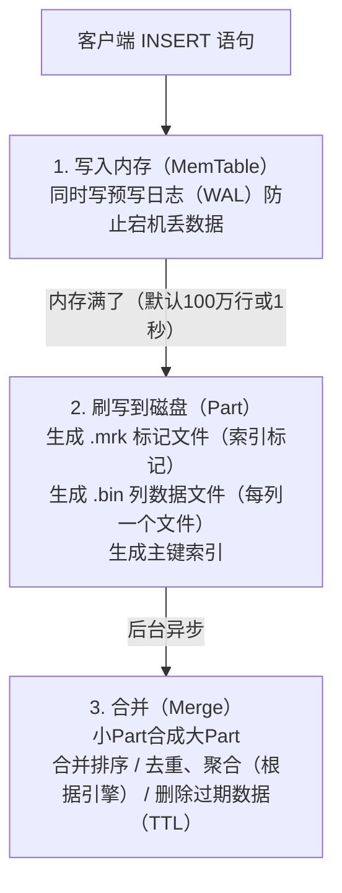
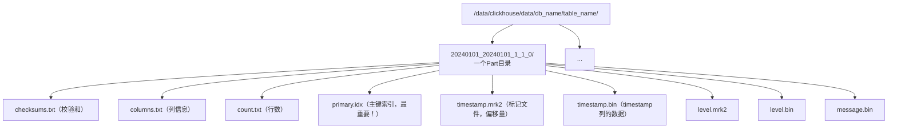
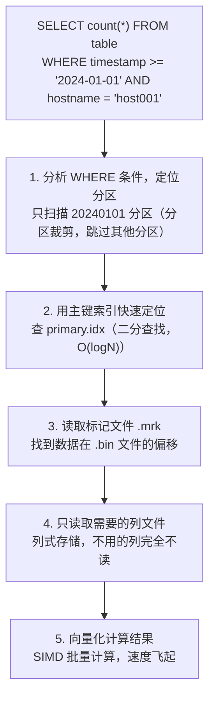
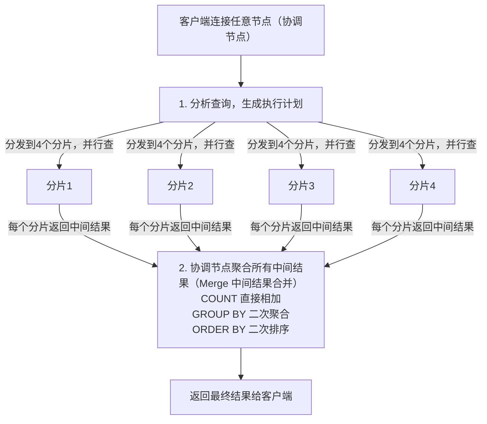
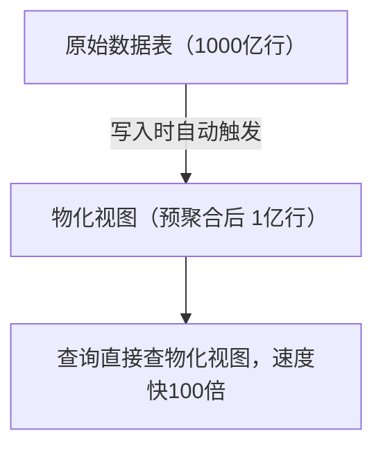
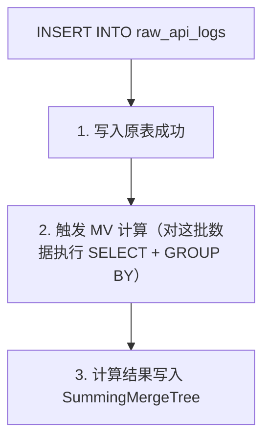

# ClickHouse 原理与优化

---

## 一、副本与分片内部原理

### 1.1 分片（Sharding）原理

#### 什么是分片？

分片就是把**大表拆成多份，分别存在不同节点上**，解决单机容量和性能瓶颈。



#### 分片键选择策略

| 分片键类型 | 例子 | 适用场景 | 优缺点 |
|-----------|------|---------|--------|
| **随机分片** | `rand()` | 通用场景，无热点 | ✅ 数据均匀 ❌ 同维度查询要跨片 |
| **业务维度** | `user_id` | 用户行为分析 | ✅ 同用户数据聚合快 ❌ 大V热点 |
| **时间维度** | `toYYYYMMDD(ts)` | 日志/时序数据 | ✅ 时间范围查询快 ❌ 历史分片数据堆积 |

> ✅ **最佳实践：** 优先选择「高基数 + 查询常用」的字段作为分片键。比如 user_id 比 level 好。

#### 分布式写入流程



---

### 1.2 副本（Replication）原理

#### 什么是副本？

同一个分片的多份数据拷贝，解决**单点故障**问题，保证**高可用**。



#### ZooKeeper 在副本中的作用

> ZK 是副本机制的「协调者」，不存实际数据！

| ZK 存储的信息 | 作用 |
|--------------|------|
| `/clickhouse/metadata` | 表结构元数据 |
| `/clickhouse/replicas` | 各副本状态、心跳 |
| `/clickhouse/queue` | 数据同步队列（Log Entry） |
| `/clickhouse/locks` | 分布式锁，防止并发冲突 |

#### 副本同步机制详解



**⚠️ **关键认知：**
1. ZK 只传「元数据」，不传「实际数据」
2. 数据同步是 **副本之间点对点传输**
3. 同步是 **异步** 的（最终一致性）
4. 写入只要 **任意一个副本就算成功，其他副本后台追赶
5. 读取时默认只查一个副本就行（默认读本机副本

#### 为什么是 5副本？

| 副本数 | 可用性 | 丢失风险 | 适用场景 |
|-------|--------|---------|---------|
| 1 | ❌ 无容错 | 挂了就丢数据 | 测试、不重要数据 |
| 2 | ⚠️ 基本可用 | 脑裂风险 | 非核心业务 |
| 3 | ✅ 生产标准 | 极低 | 标准生产环境 |
| 5 | ✅✅ 超高可用 | 几乎为0 | 核心日志/监控 |

> 你的 5副本的优势：
- 任意2台同时挂了，数据还在
- 读负载可以分散到5台
- 查询并发能力更强

---

## 二、写入流程深度解析

### 2.1 写入完整链路



### 2.2 Part 文件结构



**Part 命名规则：** `MinBlockNum_MaxBlockNum_Level`**

### 2.3 写入优化建议

| 优化项 | 推荐值 | 说明 |
|-------|-------|------|
| 批量大小 | 1万-10万行/批次 | 太小高频，太大OOM |
| 写入并发 | 单表不超过5个并发 | 太多容易Part太多 |
| Part数量 | 控制在<1000个/表 | Part太多查询慢 |

> ⚠️ **常见坑：** 高频小批量写入 → 产生海量小Part → Merge追不上 → 「Too many parts」报错！

---

## 三、查询流程深度解析

### 3.1 本地查询流程



### 3.2 分布式查询流程（4分片场景）



---

## 四、索引原理深度解析

### 4.1 主键索引（Primary Index）

#### 什么是稀疏索引？

> ClickHouse 用的是 **稀疏索引**，不是 MySQL 的稠密索引！
>
> ⚠️ **面试高频大坑：稀疏索引需要手动创建吗？**
> **答案：不需要！稀疏索引是 MergeTree 天生自带、自动创建、自动维护的！**

**稠密索引（MySQL）：** 每一行数据都有索引条目
```
行号 → 磁盘位置
1 → offset 0
2 → offset 100
3 → offset 200
...
```

**稀疏索引（ClickHouse）：** 每 index_granularity 行才有一个索引条目

---

#### 稀疏索引怎么来的？（面试必问）

**一句话：你写 ORDER BY 的那一刻，稀疏索引就有了！**

```sql
CREATE TABLE test.logs (
    timestamp DateTime,
    hostname String,
    message String
) ENGINE = MergeTree()
ORDER BY (hostname, timestamp);  -- ← 这个就决定了稀疏索引！
```

**生成逻辑：**
1. 数据按 `ORDER BY` 排序键有序写入磁盘
2. 每 `index_granularity` 行（默认 8192 行），取第一行排序键的值
3. 这些值存到 `primary.idx` 文件里 → 这就是稀疏索引！

**你不能手动创建稀疏索引，只能在建表时配置：**

| 配置项 | 作用 |
|--------|------|
| `ORDER BY (col1, col2...)` | 决定索引包含哪些列 |
| `PRIMARY KEY col1` | 可单独指定索引列（默认 = ORDER BY） |
| `index_granularity = 8192` | 调整采样粒度（行数） |

---

#### 和跳数索引的区别（别搞混！）

| 索引类型 | 怎么创建 | 作用 |
|---------|---------|------|
| **稀疏索引（主键索引）** | 自动创建，ORDER BY 决定 | 定位 granule，每查必用 |
| **跳数索引（Skipping Index）** | `CREATE INDEX` 手动创建 | 额外过滤，跳过整个 granule |

> 只有跳数索引才需要 `CREATE INDEX` 手动建！别搞混了！
```
granule 1 (行1-8192) → offset 0
granule 2 (行8193-16384) → offset 10000
granule 3 (行16385-24576) → offset 20000
...
```

**对比：**

| 特性 | 稠密索引 | 稀疏索引 |
|------|---------|---------|
| 索引大小 | 大（和数据1/10） | 极小（和数据1/1000） |
| 定位精度 | 精确到行 | 精确到 granule（8192行） |
| 内存占用 | 高 | 极低 |
| 查询速度 | 点查快 | 范围查更快 |

#### 索引工作原理

```
primary.idx 文件内容（排序列的值）：

[2024-01-01 00:00:00, host001]  ← granule 1
[2024-01-01 00:05:00, host045]  ← granule 2
[2024-01-01 00:10:00, host089]  ← granule 3
...

查询 WHERE hostname = 'host066'：

1. 二分查找 primary.idx，发现 host066 在 granule 2-3 之间
2. 读取 granule 2 的标记文件偏移量
3. 去 bin 文件中只读取这 8192 行数据
4. 在这 8192 行里过滤找 host066
```

> ✅ **核心优势：** 100亿行表，主键索引只需要 ~200MB，完全放内存里！

---

### 4.2 分区键（Partition Key）

#### 什么是分区？

分区是**粗粒度的数据划分**，通常按时间。

```
PARTITION BY toYYYYMMDD(timestamp)

生成的Part：
20240101_...
20240102_...
20240103_...
```

#### 分区的作用

1. **快速删除过期数据** - 直接删目录，比 DELETE 快万倍
2. **分区裁剪** - 查询时跳过不相关的分区

#### 分区键设计原则

| 设计原则 | 反例 | 正例 |
|---------|------|------|
| 基数不能太高 | `toSecond(timestamp)` → 86400分区/天 | `toYYYYMMDD(timestamp)` → 1分区/天 |
| 基数不能太低 | `toYYYYMM(timestamp)` → 1分区/月 | 看数据量，日均亿级按天，百万级按月 |

> ⚠️ **常见坑：** 分区粒度太细 → 每天几百个分区 → Part爆炸！

---

### 4.3 排序键（Order By）

#### 排序键 = 数据物理存储顺序

**最重要！数据在磁盘上是严格按 ORDER BY 列排序存储的！**

```
ORDER BY (timestamp, hostname, level)

磁盘上的数据顺序：
2024-01-01 00:00:00, host001, INFO
2024-01-01 00:00:00, host001, ERROR
2024-01-01 00:00:01, host002, INFO
...
2024-01-01 00:05:00, host045, WARN
```

#### 排序键设计原则

**规则：** 把**最常用的过滤列放前面！**

✅ **好例子：**
```sql
ORDER BY (hostname, timestamp)
-- 因为经常查 WHERE hostname = 'xxx'
```

❌ **坏例子：**
```sql
ORDER BY (timestamp, hostname)
-- 查 hostname 时，索引完全用不上！
```

**排序键顺序决定了：
1. 主键索引的顺序
2. 数据在磁盘上的物理顺序
3. 查询的过滤效率

> ✅ **经验法则：** 先等值查询的列放前面，范围查询的列放后面。

---

### 4.4 主键 vs 排序键

```sql
-- 写法1：主键 = 排序键（默认）
ORDER BY (a, b, c)

-- 写法2：主键 ≠ 排序键
PRIMARY KEY a
ORDER BY (a, b, c)
```

**区别：**
- 主键（PRIMARY KEY）：决定去重和索引粒度
- 排序键（ORDER BY）：决定数据物理存储顺序

> 99% 场景下，主键 = 排序键就够了。

---

### 4.5 倒排索引（Inverted Index）⭐ 2024 新特性

> ClickHouse 23.8+ 版本正式支持倒排索引！专门解决全文搜索问题。

#### 什么是倒排索引？

和 ES 的倒排索引原理一样：**单词 → 文档列表**

```
日志内容：
"error: connection timeout"
"error: disk full"
"info: request success"

倒排索引：
error    → [行1, 行2]
connection → [行1]
timeout  → [行1]
disk     → [行2]
full     → [行2]
info     → [行3]
request  → [行3]
success  → [行3]
```

查询 `message LIKE '%error%'` 时，直接查倒排索引，瞬间定位行号，不需要扫全表！

---

#### 怎么创建倒排索引？

```sql
-- 建表时创建
CREATE TABLE logs (
    timestamp DateTime,
    message String,
    INDEX idx_message message TYPE inverted
) ENGINE = MergeTree()
ORDER BY timestamp;

-- 已有表追加索引
ALTER TABLE logs ADD INDEX idx_message message TYPE inverted;

-- 物化索引（让已有数据生效）
ALTER TABLE logs MATERIALIZE INDEX idx_message;
```

---

#### 高级配置

```sql
-- 带参数的倒排索引
INDEX idx_message message TYPE inverted(
    GRANULARITY = 1,           -- 索引粒度
    TOKENIZER = 'default',     -- 分词器：default/chinese
    MAX_TOKEN_LENGTH = 64,     -- 最大词长
    MIN_TOKEN_LENGTH = 2       -- 最小词长（过滤单字）
)
```

**中文分词支持：**
```sql
-- 需要 24.3+ 版本
INDEX idx_message message TYPE inverted(TOKENIZER = 'chinese')
```

---

#### 支持的查询

倒排索引会自动加速这些查询：

| 查询语句 | 是否加速 |
|---------|---------|
| `message = 'error'` | ✅ 精确匹配 |
| `message LIKE '%error%'` | ✅ 模糊包含 |
| `message IN ('error', 'warn')` | ✅ IN 列表 |
| `hasToken(message, 'error')` | ✅ 专用函数 |
| `multiSearchAny(message, ['error', 'warn'])` | ✅ 多关键词 |

---

#### 和跳数索引（ngrambf）的对比

| 特性 | 倒排索引 inverted | ngram 布隆过滤器 |
|------|-----------------|----------------|
| 查询速度 | 极快（精确匹配词） | 快（过滤 granule） |
| 假阳性 | 0%，完全精确 | 有（布隆过滤器特性） |
| 索引大小 | 大（存所有词） | 小（只存哈希） |
| LIKE '%a%' | 支持（但 a 是单字可能效果一般） | 支持 |
| 多关键词 AND/OR | ✅ 完美支持 | ⚠️ 不支持组合逻辑 |
| 中文分词 | ✅ 内置中文分词 | ❌ 不支持 |

---

#### 最佳实践

| 场景 | 推荐 |
|------|------|
| 日志全文搜索，关键词查询 | ✅ 优先用倒排索引 |
| 简单关键词过滤，索引越小越好 | 可以用 ngram bf |
| 需要中文分词搜索 | 必须用倒排索引 |
| 组合逻辑查询（A AND B NOT C） | 倒排索引 |

> ⚠️ 注意：倒排索引索引大小可能是原字段的 50%~100%，比跳数索引大很多，只给真正需要全文搜索的列建！

---

#### ClickHouse 倒排索引 vs Elasticsearch 对比（日志选型必看）

这是 90% 做日志系统的团队都会纠结的选型问题！

| 维度 | ClickHouse 倒排索引 | Elasticsearch |
|------|-------------------|---------------|
| **核心定位** | 分析数据库 + 兼职全文搜索 | 专业搜索引擎 |
| **索引结构** | 简化版倒排，列式存储 | 完整 Lucene 倒排 + 词典 + 跳表 |
| **分词能力** | ⚠️ 基础分词（default/chinese） | ✅ 强大，IK/hanlp 等几十种分词器 |
| **精确匹配** | ✅ 极快 | ✅ 快 |
| **模糊查询** | ✅ 支持 | ✅ 支持 |
| **正则查询** | ❌ 不支持 | ✅ 支持 |
| **短语查询** | ⚠️ 支持但不保证位置精确 | ✅ 完美支持，位置精确 |
| **相关性打分** | ❌ 不支持 | ✅ TF-IDF / BM25 |
| **高亮显示** | ❌ 不支持 | ✅ 原生支持 |
| **聚合能力** | ✅ 极强，百种聚合函数 | ⚠️ 一般，嵌套聚合慢 |
| **写入速度** | ✅ 5~10倍于ES | ❌ 慢，要算分词、打分 |
| **存储占用** | ✅ 只有 ES 的 1/3 ~ 1/5 | ❌ 索引膨胀大 |
| **运维复杂度** | ✅ 低，自带复制 | ❌ 高，脑裂、分片管理复杂 |
| **多字段组合搜索** | ⚠️ 每个字段单独建索引，分别查 | ✅ 原生支持 _all 字段 |
| **嵌套/对象类型** | ❌ 不支持 | ✅ 原生支持 |
| **数据量 < 10TB** | 都可以 | 更成熟 |
| **数据量 > 100TB** | ✅ 强烈推荐 | ❌ 成本太高 |

---

#### 选型结论

| 场景 | 选哪个 |
|------|--------|
| 以统计分析为主，偶尔搜日志关键词 | ✅ ClickHouse |
| 以全文搜索为主，需要相关性、高亮、复杂搜索 | ✅ Elasticsearch |
| 日志量巨大（每天 > 1TB），想省服务器成本 | ✅ ClickHouse |
| 需要复杂分词、同义词、纠错、搜索推荐 | ✅ Elasticsearch |

> **一句话总结：ClickHouse 的倒排索引是「够用就好」，ES 的是「专业级」。日志场景 ClickHouse 做 90% 的需求都够了，成本还低一个数量级。**

---

#### 倒排索引支持相关性打分吗？（面试高频）

**答案：原生不支持 TF-IDF / BM25 相关性打分！**

**核心原因：**
- ClickHouse 的倒排索引定位是 **「布尔过滤器」**，只回答「这行包含这个词吗？」（有/没有）
- 它不是 **「搜索引擎排名器」**，不算「这行和这个词相关程度是多少分」
- BM25 需要存词频、文档频率、字段长度归一化因子，索引大小会翻倍

---

##### 进阶：手动实现简单打分（工作中够用）

虽然没有内置 BM25，但可以用字符串函数手动实现：

**方案1：按命中关键词数量打分**
```sql
SELECT
    message,
    multiSearchAnyCount(message, ['error', 'timeout', 'disk']) AS score
FROM logs
WHERE hasAnyToken(message, ['error', 'timeout', 'disk'])
ORDER BY score DESC;
```

**方案2：加权打分（不同词权重不同）**
```sql
SELECT
    message,
    -- error 权重 5 分，timeout 3 分，disk 2 分
    if(message LIKE '%error%', 5, 0) +
    if(message LIKE '%timeout%', 3, 0) +
    if(message LIKE '%disk%', 2, 0) AS score
FROM logs
WHERE hasAnyToken(message, ['error', 'timeout', 'disk'])
ORDER BY score DESC;
```

---

##### 和 ES 专业打分的差距

| 特性 | Elasticsearch | ClickHouse 手动实现 |
|------|--------------|-------------------|
| TF-IDF / BM25 | ✅ 原生精确算法 | ❌ 没有 |
| 字段长度归一化 | ✅ 短字段匹配权重更高 | ❌ 没有 |
| IDF 逆文档频率 | ✅ 稀有词匹配权重更高 | ❌ 没有 |
| 短语匹配加分 | ✅ 连续命中的词加分 | ❌ 没有 |
| 自定义权重 | ✅ 灵活配置 | ⚠️ 可以手写 IF 实现 |
| 打分性能 | ✅ 索引阶段预计算 | ⚠️ 查询时计算，数据量大了慢 |

---

#### 另一个重要区别：搜索宽容度（面试加分项）

**ES 会做模糊匹配，尽量给你返回点什么；ClickHouse 精确匹配，搜不到就是空。**

---

##### Elasticsearch 的「用户友好型」搜索

ES 有多层容错机制：

| ES 机制 | 效果 |
|--------|------|
| **Fuzzy 模糊查询** | 搜 `helo` → 自动匹配 `hello`（编辑距离 ≤ 2） |
| **拼写纠错建议** | 完全没匹配到，会提示「你是不是想搜 hello？」 |
| **同义词扩展** | 搜「手机」→ 匹配「移动电话、智能手机」 |
| **词根还原** | 搜 `running` → 匹配 `run / ran` |

> **ES 哲学：用户体验至上，永远不想让你看到空结果页。**

---

##### ClickHouse 的「机器友好型」搜索

**ClickHouse 是 100% 精确匹配！**

| 场景 | ClickHouse 行为 |
|------|----------------|
| 搜 `helo` | ❌ 就是没有，不会帮你匹配 `hello` |
| 搜大写 `ERROR` | ❌ 不会匹配小写 `error`（需手动开 CASE_INSENSITIVE） |
| 搜单数 `error` | ❌ 不会匹配复数 `errors` |
| 完全没匹配到 | ✅ 干干净净返回空，不会给任何「你是不是想搜」建议 |

> **ClickHouse 哲学：精确性和性能至上，你搜什么就是什么，从不自作主张。**

---

##### 能不能在 CK 里实现类似效果？能，但要自己做

**方案1：大小写不敏感索引**
```sql
INDEX idx_message message TYPE inverted(CASE_INSENSITIVE = 1)
```

**方案2：查询层做降级匹配**
```sql
-- 先精确匹配，没结果再用编辑距离模糊匹配
WITH 'helo' AS keyword
SELECT * FROM logs WHERE hasToken(message, keyword)
UNION ALL
SELECT * FROM logs
WHERE 0 = (SELECT count() FROM logs WHERE hasToken(message, keyword))
  AND editDistanceUTF8(message, keyword) <= 2  -- 允许错2个字符
LIMIT 100;
```

**方案3：架构层封装** → 先搜 CK，没结果再调用 ES 做拼写纠错，再搜一次。

---

### 4.6 跳数索引（Skipping Index）

#### 什么是跳数索引？

> 在排序键之外，给其他列建的「辅助索引」。

比如：日志表按时间排序，但经常要按 message 关键词查。

#### 跳数索引类型

| 索引类型 | 适用场景 | 例子 |
|---------|---------|------|
| `minmax` | 数值列，范围查询 | `timestamp` |
| `set(n)` | 低基数字符串 | `level, status` |
| `ngrambf_v1` | 字符串包含查询 | `message LIKE '%error%'` |
| `bloom_filter` | 高基数精确匹配 | `trace_id` |

**建索引示例：**
```sql
-- 给 message 列建布隆过滤器索引
CREATE INDEX idx_message ON logs(message)
TYPE bloom_filter()
GRANULARITY 4;
```

**工作原理：**
```
查询 WHERE message LIKE '%error%'：

1. 检查每个 granule 的布隆过滤器
2. 布隆说"绝对不存在" → 跳过整个 granule（8192×4行）
3. 布隆说"可能存在" → 才真正读取数据过滤
```

> ✅ **效果：** 字符串包含查询速度提升 10-100 倍！

---

## 五、物化视图（Materialized View）

### 5.1 什么是物化视图？

> 「预计算」技术：数据写入时，自动计算并存储结果。类似「实时ETL」。



### 5.2 工作原理

```sql
-- 1. 创建物化视图
CREATE MATERIALIZED VIEW api_stat_mv
ENGINE = SummingMergeTree(...)
PARTITION BY toYYYYMMDD(ts)
ORDER BY (ts, api_path)
AS
SELECT
    timestamp AS ts,
    api_path,
    count() AS request_count,
    sum(duration) AS total_duration
FROM raw_api_logs
GROUP BY timestamp, api_path;
```

**写入流程：**


> ⚠️ **注意：** 物化视图只处理**新写入**的数据，不处理历史数据！

### 5.3 典型场景

#### 场景1：日志级别分钟级统计

原始表：每秒1万条日志
物化视图：按分钟+级别聚合 → 数据量缩到1%

#### 场景2：APM指标聚合

原始Trace数据：每条Trace几十个Span
物化视图：按服务+接口+分钟聚合P99/P95 → 查询秒级返回

### 5.4 物化视图最佳实践

| 最佳实践 | 说明 |
|---------|------|
| 幂等写入 | 避免重复计算导致数据不准 |
| 粒度适中 | 不要太细（1秒）也不要太粗（1小时） |
| 层级聚合 | 1分钟 → 1小时 → 1天，多层MV |
| 监控滞后 | 注意监控物化视图写入延迟 |

> ⚠️ **常见坑：** MV 嵌套太多层 → 写入链路太长 → 整个集群写入变慢！

---

## 六、性能优化实战

### 6.1 表设计优化

#### 优化1：分区键设计
```sql
-- ✅ 好：按天分区
PARTITION BY toYYYYMMDD(timestamp)

-- ❌ 坏：按秒分区（太多分区）
PARTITION BY toSecond(timestamp)
```

#### 优化2：排序键设计
```sql
-- ✅ 好：先等值查询的列放前面
ORDER BY (hostname, service, timestamp)

-- ❌ 坏：范围查询列放前面，后面的索引用不上
ORDER BY (timestamp, hostname, service)
```

#### 优化3：数据类型选择
```sql
-- ✅ 好：用最小够用的类型
level Enum8('INFO'=1, 'WARN'=2, 'ERROR'=3)

-- ❌ 坏：用 String 存枚举
level String  -- 浪费几倍存储空间
```

| 场景 | 推荐类型 |
|------|---------|
| 状态/枚举 | Enum8/16 |
| 整型 | 够用就用小的(UInt8/UInt16) |
| IP地址 | IPv4/IPv6 类型 |
| 时间 | DateTime（不要用String存时间） |

---

### 6.2 查询优化

#### 优化1：只查需要的列

```sql
-- ✅ 好：只查需要的列
SELECT timestamp, hostname, level FROM logs;

-- ❌ 坏：SELECT * 读所有列
SELECT * FROM logs;
```

#### 优化2：用好分区裁剪

```sql
-- ✅ 好：WHERE 里带分区键
WHERE timestamp >= '2024-01-01' 
  AND timestamp < '2024-01-02';

-- ❌ 坏：对分区键用函数，导致裁剪失效
WHERE toDate(timestamp) = '2024-01-01';
```

#### 优化3：避免全表扫描

```sql
-- ✅ 好：先过滤再计算
SELECT count(*) 
FROM logs 
WHERE timestamp >= today() - 7
  AND hostname = 'host001';  -- 排序键，走索引

-- ❌ 坏：先计算再过滤
SELECT count(*)
FROM logs
WHERE md5(hostname) = 'xxxx';  -- 函数计算，全表扫描
```

---

### 6.3 合并优化

#### 问题：Part 太多怎么办？

**症状：** `Too many parts (300). Merges are processing significantly slower than inserts.`

**原因：** 写入太频繁，小文件太多，合并追不上。

**解决方案：**

| 方案 | 操作 |
|------|------|
| 调大批次 | 1000行/批 → 10万行/批 |
| 降低并发 | 10个写入 → 3个写入 |
| 手动触发合并 | `OPTIMIZE TABLE table FINAL;` |
| 调整合并参数 | 调大 `background_pool_size` |

---

### 6.4 内存优化

#### 问题：查询 OOM 怎么办？

**症状：** `Memory limit (for query) exceeded`

**解决方案：**

1. **控制单次查询扫描的数据量** - 不要查太久远的数据
2. **开启溢出磁盘** - `max_bytes_before_external_group_by`
3. **用聚合下推** - 分布式查询先在分片聚合，减少数据传输

```xml
<!-- users.xml 配置 -->
<max_bytes_before_external_group_by>20000000000</max_bytes_before_external_group_by>
<max_bytes_before_external_sort>20000000000</max_bytes_before_external_sort>
```

---

## 常见面试题

### 1. ClickHouse 为什么这么快？

**答案：**
1. **列式存储** - 只读需要的列，IO 减少 10-100 倍
2. **数据有序 + 稀疏索引** - 主键索引极小，全在内存里
3. **向量化执行** - 利用 CPU 的 SIMD 指令，批量计算
4. **LSM 架构** - 写入快，合并优化
5. **数据压缩** - 相同数据占空间小，IO 更快
6. **并行查询** - 多线程、多节点并行

### 2. 主键索引和 MySQL 的区别？

**答案：**
- MySQL 是 **稠密索引**，每一行都有索引条目，索引大
- ClickHouse 是 **稀疏索引**，每 8192 行一个条目，索引极小
- MySQL 点查快，ClickHouse 范围分析快

### 3. 分区键和排序键的区别？

**答案：**
- **分区键**：粗粒度，按目录划分，用于快速删过期数据和分区裁剪
- **排序键**：细粒度，决定数据物理存储顺序，用于查询过滤定位
- 分区键是「分大类」，排序键是「大类内排序」

### 4. 物化视图和普通视图的区别？

**答案：**
- **普通视图**：只是别名，不存数据，查询时展开执行原 SQL
- **物化视图**：预计算并存储结果，查询直接读结果
- 物化视图写入时计算，普通视图查询时计算

### 5. 为什么不推荐频繁小批量写入？

**答案：**
- 每次写入产生新的 Part 文件
- Part 太多会导致：
  1. 查询要打开很多文件，变慢
  2. 合并线程追不上，报错 `Too many parts`
- 推荐：每批次 1万-10万行，单表写入并发 < 5

### 6. 副本同步是强一致性吗？

**答案：**
**不是！是最终一致性。
- 写入只要一个副本成功就算成功
- 其他副本后台异步同步
- 同步延迟通常毫秒级到秒级
- 如果要读最新数据，可以用 `SELECT ... FINAL`
