# Kafka基础

> 第二章核心：按数据流转顺序（部署→启动→建主题→生产→存储→消费）讲清 Kafka 内部组件如何协作完成高效数据传输。

---

## 一、核心概念

### 1.1 集群部署与启动

**集群部署**
- 生产环境用 Linux，学习可用 Windows 简易集群（3 节点）
- Kafka 内置 ZooKeeper，需先启动 ZK 再启动 Kafka
- 关键配置：`broker.id`（节点唯一ID）、`listeners`（端口）、`log.dirs`（数据目录）、`zookeeper.connect`

**两大核心角色**

| 角色 | 通俗理解 | 说明 |
|------|---------|------|
| **Broker（代理）** | 集群中的一个服务节点 | 每个 Kafka 进程就是一个 Broker，有唯一 `broker.id` |
| **Controller（控制器）** | 集群的"班主任" | 从多个 Broker 中选出的 Master，借 ZK 管理整个集群 |

**Controller 选举（抢座位机制）**
- 每个 Broker 启动时去 ZK 创建临时节点 `/controller`
- ZK 节点不可重复，**只有一个能创建成功** -> 它就是 Controller
- 其余 Broker 监听 `/controller`，一旦该节点消失（Controller 宕机，临时节点自动删除），剩余 Broker 立刻抢着创建 -> 选出新 Controller
- 💡 这就是**为什么必须先启动 ZooKeeper**：选举靠它

**Broker 启动做了什么（源码层面）**
1. 初始化 ZK 客户端，创建各类持久化节点（`/brokers/ids`、`/brokers/topics` 等）
2. 初始化服务组件：任务调度器、LogManager（数据管理）、ReplicaManager（副本管理）、元数据缓存、SocketServer（NIO通信）
3. 注册 Broker 节点（临时节点，断开即删）
4. 启动控制器（KafkaController），申请成为 Master

---

### 1.2 创建主题

**五大基础概念（重点）**

| 概念 | 通俗类比 | 说明 |
|------|---------|------|
| **Topic（主题）** | 消息的"大类" | 逻辑分类，生产/消费面向 Topic |
| **Partition（分区）** | 大类下的"货架隔层" | 物理分片，解决单节点热点、实现负载均衡与线性扩展 |
| **Replica（副本）** | 货架的"备份" | 分区数据的多份拷贝，防数据丢失（副本数 ≤ Broker 数） |
| **Leader / Follower** | 主备 | 所有副本都叫副本，选一个当 Leader 读写，其余 Follower 只备份 |
| **Log（日志）** | 存货的"账本" | 消息最终存到 `.log` 文件，Kafka 立家之本就是日志 |

> 💡 **关键**：只有 Leader 副本对外读写，Follower 只负责同步备份。分区编号从 0 开始，每条消息有 Offset。

**五大基础概念层级图**（以 `third-topic`：3 分区 3 副本为例）

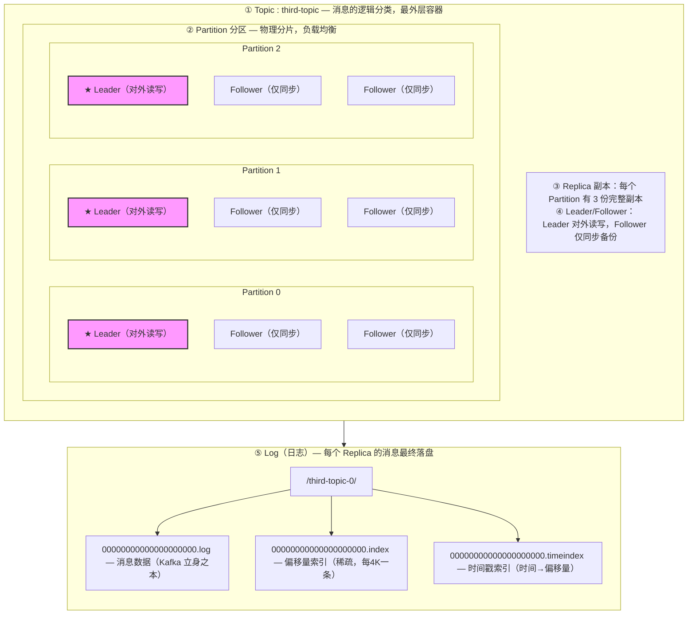

> 💡 **图读要点**：① Topic 是逻辑壳子 → ② 内部切成多个 Partition（物理）→ ③ 每个 Partition 有多个 Replica → ④ Replica 分 Leader（干活的）/ Follower（备份的）→ ⑤ 每个 Replica 的数据最终写进 Log 文件。层级是 **Topic ⊃ Partition ⊃ Replica ⊃ (Leader/Follower) → Log**。

**⚠️ 分区、副本与 Broker 的关系（易混淆，重点）**

> 单个 **Replica** 绑死在**一个 Broker**上，不可跨 Broker；一个 **Partition** 通过多个 Replica **分布在多个 Broker 上**（靠复制实现，不是靠分片）。

- **副本 = 整个分区的完整拷贝**，不是分区的一部分。3 个副本 = 这份分区数据存了 3 份，内容相同。
- **别和 MySQL 分表混淆**：MySQL 分表是"切成片，一片放一节点"（水平分片）；Kafka 分区是"**整个复制**成多份，每份放一个 Broker"，单个副本不切片。
- 举例（`third-topic` 3 分区 3 副本，3 Broker）：

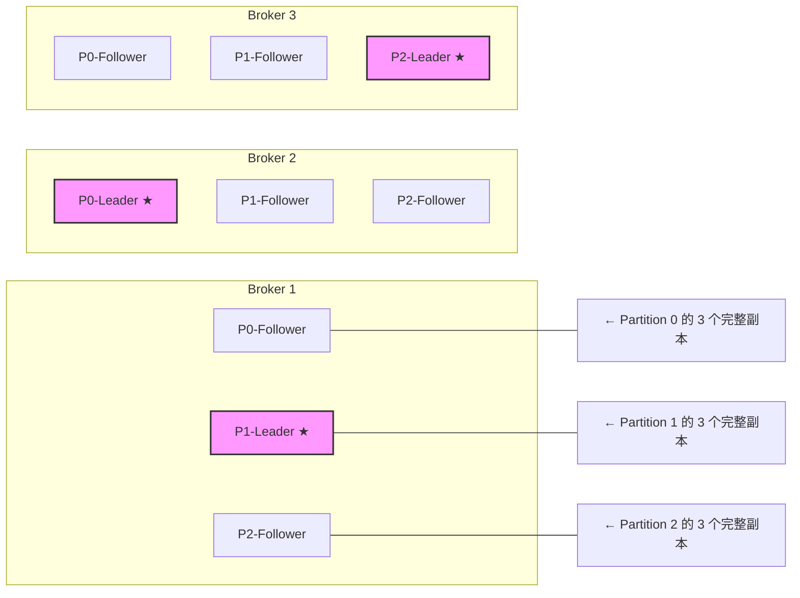
  看 P0 这一行：Partition 0 在 3 个 Broker 上各有一份**完整拷贝**（非 1/3），Broker2 的 P0 是 Leader，其余是 Follower。

- **约束**：副本数 ≤ Broker 数（副本要放不同 Broker 才有备份意义）；分区数可 > Broker 数（一个 Broker 能扛多个不同分区的副本）。

**创建主题命令**
```bash
# 3分区3副本
kafka-topics.sh --bootstrap-server kafka-broker1:9092 --create \
  --topic third-topic --partitions 3 --replication-factor 3
```

**副本分配算法（未指定机架）**
- 第一个副本位置：`(分区编号 + 随机值) % Broker数量`
- 后续副本按间隔随机值轮转分配
- 目的：副本尽量打散到不同 Broker

**创建主题流程**
1. 命令行提交 → 封装 NewTopic → 找 Controller 发请求
2. Controller 接收请求 → 校验参数 → 计算副本分配
3. 在 ZK 创建节点 `/brokers/topics/主题名`
4. 选每个分区的第一个副本为 Leader，全部副本组成 ISR
5. 向各 Broker 发送 LeaderAndIsr 请求 → 创建数据目录和空文件 `主题名-分区号`

---

### 1.3 生产消息

**生产者写入消息全流程原理图**

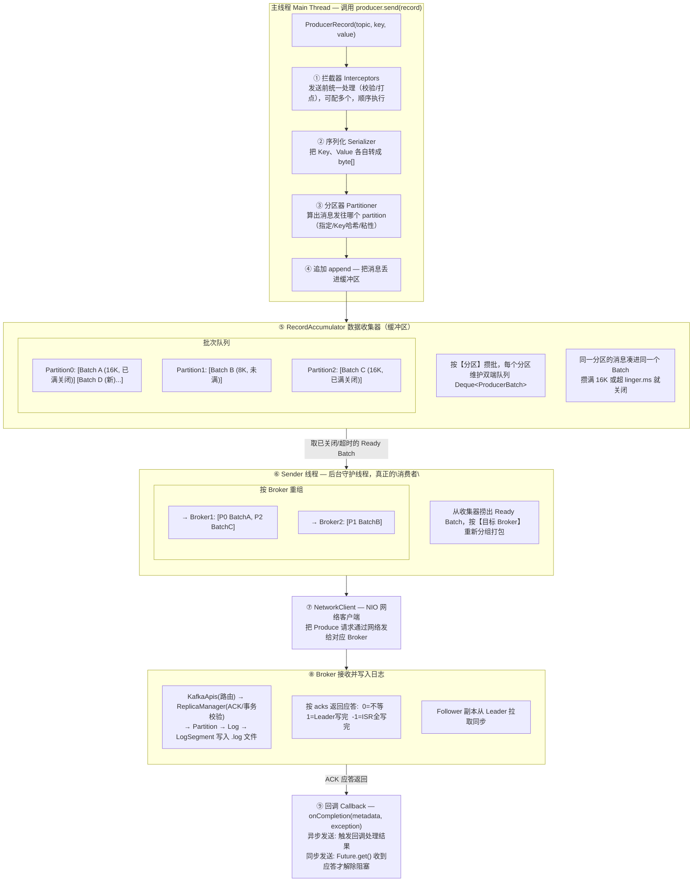

> 💡 **核心理解：双线程的生产者-消费者模式**
> - **主线程 = 生产者**：负责拦截→序列化→算分区→把消息塞进 `RecordAccumulator` 缓冲区，塞完就返回（不等真正发送）
> - **Sender 线程 = 消费者**：后台不停轮询，从缓冲区捞已攒好的批次，按 Broker 重组后通过网络发出去
> - 缓冲区 `RecordAccumulator` 就是连接两者的"阻塞队列"，平衡生产与发送速度，攒批省网络
>
> 这就是为什么 `producer.send()` 看起来是"瞬间返回"的——主线程只是把消息塞进缓冲区，真正发送由后台 Sender 线程异步完成。

**生产者三大内部组件（生产者消费者模式）**

| 组件 | 角色 | 职责 |
|------|------|------|
| **KafkaProducer** | 生产者 | 拦截→序列化→算分区→追加到收集器 |
| **RecordAccumulator** | 缓冲区 | 按**分区**攒批（默认16K），用双端队列管理批次 |
| **Sender** | 消费者 | 轮询取已关闭的批次，按 Broker 重组后网络发送 |

> 💡 Kafka 不逐条发送，而是**按分区攒批发送**，提高吞吐省带宽。

**四种发送方式**

| 方式 | 特点 | 场景 |
|------|------|------|
| **发后即忘** | 不等应答，最快但可能丢 | 日志等容丢场景 |
| **异步发送** | 回调通知结果，不阻塞 | 大部分生产场景 |
| **同步发送** | `Future.get()` 阻塞等结果 | 强可靠 |
| **拦截器** | 发送前/应答后预处理 | 统一校验、打点 |

**公共配置（4种方式通用）**

```java
Map<String, Object> configMap = new HashMap<>();
configMap.put(ProducerConfig.BOOTSTRAP_SERVERS_CONFIG, "localhost:9092");
configMap.put(ProducerConfig.KEY_SERIALIZER_CLASS_CONFIG, StringSerializer.class.getName());
configMap.put(ProducerConfig.VALUE_SERIALIZER_CLASS_CONFIG, StringSerializer.class.getName());
KafkaProducer<String, String> producer = new KafkaProducer<>(configMap);
```

**① 发后即忘（fire-and-forget）**

```java
ProducerRecord<String, String> record =
    new ProducerRecord<>("test", "key1", "value1");
producer.send(record);  // 塞进缓冲区就返回，不管结果
```
> **解释**：`send()` 返回的是 `Future`，但这里**不调用 `get()`、也不传回调**，主线程把消息塞进缓冲区就返回。至于 Sender 线程有没有真正发出去、Broker 有没有收到成功--**完全不关心**。所以**最快但可能丢**。适合日志这类"丢几条无所谓"的场景。

**② 异步发送（推荐）**

```java
producer.send(record, new Callback() {
    @Override
    public void onCompletion(RecordMetadata metadata, Exception exception) {
        if (exception == null) {
            System.out.println("发送成功，offset=" + metadata.offset());
        } else {
            exception.printStackTrace();  // 失败可在此重试或告警
        }
    }
});
// send() 立即返回，主线程继续发下一条，不等 Broker 应答
```
> **解释**：传一个 `Callback`，`send()` 仍然立即返回（不阻塞）。当 Broker 返回 ACK 后，Sender 线程会**异步触发** `onCompletion()` 回调通知结果。主线程不干等，**吞吐高**，同时又能拿到发送结果做兜底处理。**大部分生产场景用它**。

**③ 同步发送**

```java
Future<RecordMetadata> future = producer.send(record);
RecordMetadata metadata = future.get();  // 阻塞，直到 Broker 返回 ACK
System.out.println("已确认，offset=" + metadata.offset());
// 上一条没确认完，不会发下一条
```
> **解释**：在 `send()` 后立刻调用 `future.get()`，**主线程阻塞等待** Broker 的 ACK 应答返回才解除阻塞、继续发下一条。等价于"发一条->等确认->再发一条"。**可靠性最高、吞吐最低**。适合金融等"绝不能丢、且要立即知道失败"的场景。
>
> ⚠️ 注意：同步发送本质还是"主线程塞缓冲区 + Sender 线程发"，只是主线程用 `get()` 强行阻塞等结果。别误以为没有 Sender 线程。

**④ 拦截器（搭配上述方式使用）**

```java
// 1. 实现拦截器
public class CountInterceptor implements ProducerInterceptor<String, String> {
    @Override
    public ProducerRecord<String, String> onSend(ProducerRecord<String, String> record) {
        System.out.println("发送前拦截：可以改 record 或做统计");
        return record;  // 返回（可能修改后的）record 继续往下走
    }
    @Override
    public void onAcknowledgement(RecordMetadata metadata, Exception exception) {
        System.out.println("收到ACK后拦截：可以记录发送结果");
    }
    // close()、configure() 略
}

// 2. 配置拦截器（可配多个，按顺序执行）
configMap.put(ProducerConfig.INTERCEPTOR_CLASSES_CONFIG, CountInterceptor.class.getName());
```
> **解释**：拦截器**不是独立的发送方式**，而是搭在①②③任一方式上的"钩子"。`onSend()` 在**序列化/分区之前**触发（可改消息内容或打点统计），`onAcknowledgement()` 在**收到 ACK 后**触发（可记录成功/失败）。某个拦截器抛异常**不会**影响后续拦截器执行。
>
> 💡 一句话区分：①②③ 三者是"**怎么等结果**"的不同，拦截器是"**在发送前后加点料**"，两者正交。

**分区策略（4种优先级）**
1. 指定 Partition → 直接用
2. 自定义分区器 → 调用计算
3. 有 Key → `murmur2(key) % 分区数`
4. 无 Key → **粘性分区**（随机选一个，攒满2倍批次大小再换）

**分区策略（4种优先级）**
1. 指定 Partition -> 直接用
2. 自定义分区器 -> 调用计算
3. 有 Key -> `murmur2(key) % 分区数`
4. 无 Key -> **粘性分区**（随机选一个，攒满2倍批次大小再换）

> 以下假设 topic `test` 有 3 个分区（0、1、2）。`ProducerRecord` 构造函数决定了走哪种策略。

**① 指定 Partition（最高优先级）**

```java
// 构造时第 2 个参数就是 partition 编号
ProducerRecord<String, String> record =
    new ProducerRecord<>("test", 0, "key1", "value1");  // 强制发往 partition 0
producer.send(record);
```
> **解释**：直接指定 `partition=0`，Kafka **跳过所有分区器**直接用。但要保证编号存在，否则会因拿不到元数据而超时。适合"我明确知道这条数据要去哪个分区"的场景。

**② 自定义分区器**

```java
// 1. 实现 Partitioner 接口，自己写分区逻辑
public class MyPartitioner implements Partitioner {
    @Override
    public int partition(String topic, Object key, byte[] keyBytes,
                         Object value, byte[] valueBytes, Cluster cluster) {
        // 例：key 含 "vip" 的走分区 0，其余走分区 1
        if (key != null && key.toString().contains("vip")) {
            return 0;
        }
        return 1;
    }
    @Override public void close() {}
    @Override public void configure(Map<String, ?> configs) {}
}

// 2. 配置启用自定义分区器
configMap.put(ProducerConfig.PARTITIONER_CLASS_CONFIG, MyPartitioner.class.getName());

// 3. 发送时不指定 partition（指定了就不调分区器）
ProducerRecord<String, String> record =
    new ProducerRecord<>("test", "vip-user", "value1");
producer.send(record);  // 走 MyPartitioner.partition() -> 返回 0
```
> **解释**：只有**未指定 partition** 时才调用分区器（自定义或默认）。适合按业务规则路由，如 VIP 用户走专属分区、按地域分区分流。

**③ 有 Key（默认分区器，哈希取模）**

```java
// 不指定 partition，但带 key
ProducerRecord<String, String> record =
    new ProducerRecord<>("test", "userId-1001", "value1");
producer.send(record);
// 默认分区器：partition = murmur2(key序列化字节) % 分区数
```
> **解释**：没指定 partition、也没配自定义分区器时，用**默认分区器**。带 Key 则对 Key 做 `murmur2` 哈希再对分区数取模。**同一个 Key 永远进同一个分区** -> 这是 Kafka 保证"同 Key 消息有序"的基础（如同一用户的事件按顺序处理）。
>
> ⚠️ 注意：分区数变了，同一 Key 算出的分区也会变。所以**建 Topic 时就要规划好分区数**，别频繁扩容。

**④ 无 Key（粘性分区，默认）**

```java
// 既不指定 partition，也不带 key
ProducerRecord<String, String> record =
    new ProducerRecord<>("test", "value1");  // 只有 topic 和 value
producer.send(record);
// 默认分区器用粘性分区：随机选一个分区，攒满一个批次或 linger.ms 超时再换
```
> **解释**：没 Key 时用**粘性分区（Sticky Partitioner）**。先随机选一个分区持续发，把多条消息凑进同一个 Batch（而不是均匀打散到所有分区），攒满一个批次或 `linger.ms` 到期后再换下一个分区。这样**批次更容易填满，吞吐更高**。
>
> 💡 对比旧版"轮询 RoundRobin"：轮询会把消息均匀撒到各分区，每个分区都凑不满一个 Batch，反而低效。粘性分区解决了这个问题。
>
> ⚠️ **版本演进**（面试常问）：无 Key 时的默认行为经历了变迁
> - **Kafka 2.4 之前**：用 RoundRobin 轮询（内部 `AtomicInteger` 计数器，每条消息 `counter++ % 分区数`，轮流发往各分区）
> - **Kafka 2.4（2019.12）起**：改为 Sticky Partitioner 粘性分区
> - 改进点：轮询导致每个分区都凑不满一个 16K batch，碎片化严重；粘性分区让消息集中到一个分区攒满 batch，减少网络请求、提升吞吐
> - ⚠️ 注意别和消费者端的 StickyAssignor 混淆（后者是分配分区给消费者，0.11 引入，是另一个概念，见 1.5 节）

**分区选择判断流程**

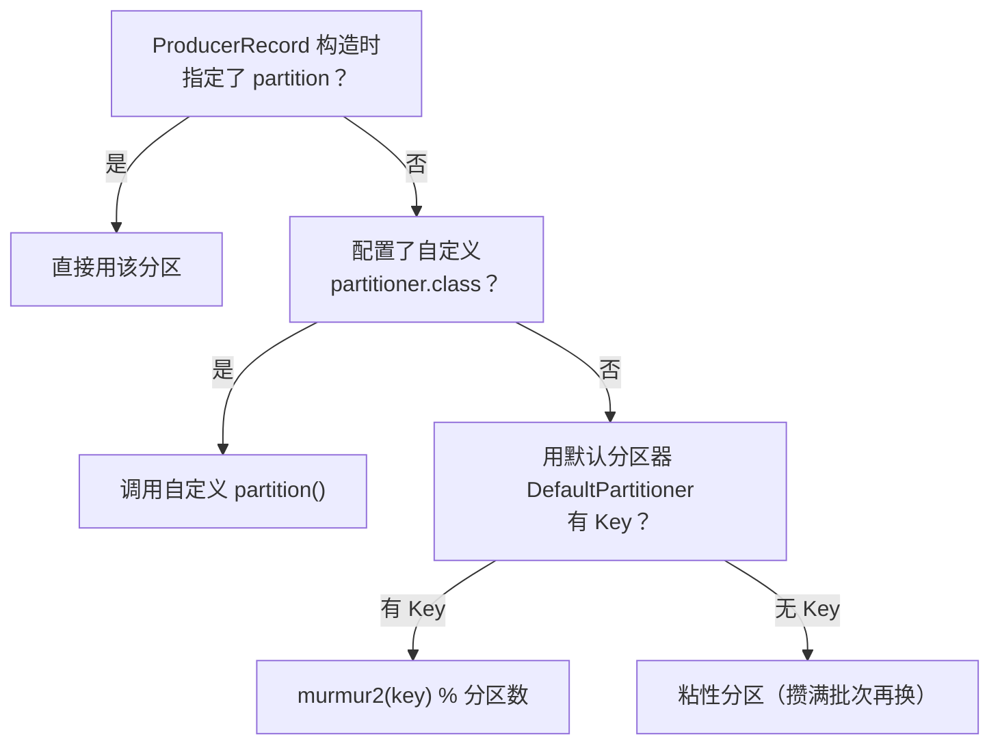

> 💡 **一句话记忆**：**指定分区 > 自定义分区器 > 有Key哈希 > 无Key粘性**，优先级从高到低，前面命中后面就不走。

**ACK 应答机制（可靠性核心）**

| acks | 含义 | 可靠性 | 吞吐 |
|------|------|--------|------|
| **0** | 发到网络流就应答 | 最低（可能丢） | 最高 |
| **1** | Leader 写入日志才应答 | 中（Leader宕机仍丢） | 高 |
| **-1/all** | Leader + 所有 ISR 副本都写入才应答 | 最高 | 最低 |

**消息去重与有序（重试带来的问题）**
- **重试导致重复**：ACK 没回，Producer 以为丢了重发 → 重复
- **重试导致乱序**：第1条失败重排，第2、3条先到 → 顺序打乱

**幂等性（解决单会话重复+乱序）**
- `enable.idempotence=true`
- 给每个批次加 `PID（生产者ID）+ SequenceNum（序列号）`
- Broker 端为每个 `<PID, partition>` 维护一个**已提交的序列号**，收到消息时比对：
  - 序列号 = 已提交+1 -> 正常写入
  - 序列号 < 已提交+1（在 `max.in.flight` 在途窗口内）-> 判定为重复，丢弃但返回成功
  - 序列号 > 已提交+1 -> 判定为乱序，抛异常触发重试
- ⚠️ 这里 `max.in.flight.requests.per.connection` 上限 5，指的是**在途请求窗口**，并非"缓存5个批次"——文档原表述有误
- ⚠️ 局限：**仅单分区单会话**有效，多分区/跨会话无效

**事务（解决跨会话 + 多分区原子性）**

**先搞懂"会话"是什么**

> 一个 KafkaProducer 对象从 `new` 创建到 `close()` 关闭，就是**一个会话（session）**。

幂等性靠 `PID + SequenceNum` 去重。问题在于：**PID 是 Producer 启动时由 Broker 临时分配的，每次重启都变**。

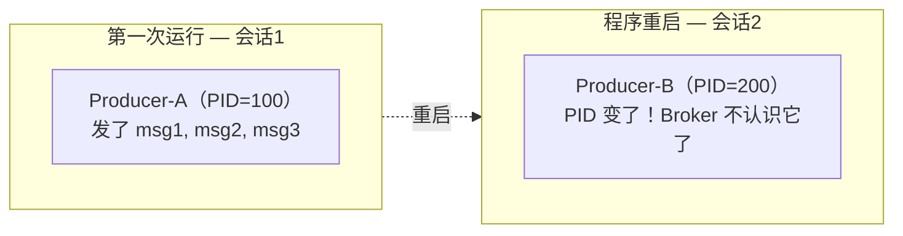

- 重启后 PID 变了，Broker 端的"已提交序列号"记录是按 PID 存的，**新 PID 查不到旧记录**
- 于是 msg1（重启前已发过）可能被当成新消息**重复写入**
- 这就是"幂等性无法跨会话"的本质：**PID 漂移导致去重失效**

**事务怎么解决：用 transactional.id 锚定 PID**

核心思路：给 Producer 配一个**稳定的身份证号** `transactional.id`，让它每次重启都能拿回**同一个 PID**。

- Broker 端维护 `<transactional.id -> PID>` 的映射，持久化在内部主题 `__transaction_state`
- Producer 启动时带着 `transactional.id` 找**事务协调器（TransactionCoordinator）**报到
- 协调器查映射：第一次用就分配新 PID 并记下；**重启后再来，查到同一个 id，就发回原来的 PID**
- 同时递增一个 `epoch`（纪元），让旧 PID 的残留请求作废（防止"僵尸 Producer"复活后冲突）

> 💡 **通俗类比 - 会员卡**：
> - 幂等性 = **临时访客牌**，每次进店发的牌号不一样，店里记不清你昨天来过没
> - 事务 = **办了张会员卡（transactional.id）**，卡号固定，不管你来多少次，店里都认得这张卡，能查到你的历史记录
> - `epoch` = 会员卡**补办次数**，旧卡作废，新卡生效，防止捡到你丢的旧卡来冒充消费

**事务还能做什么：多分区原子性（这是比跨会话更常用的场景）**

事务不仅能解决跨会话，更核心的价值是：**让多条发往不同分区的消息，要么全成功，要么全失败**（原子写入）。

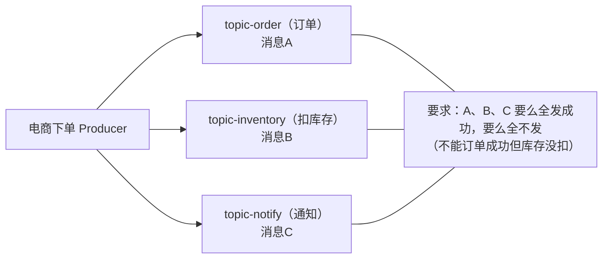

- 开启事务后，Producer 把 A、B、C 先写入各自分区（但此时消费者**看不到**，叫"未提交"状态）
- `commitTransaction()` 提交后，协调器向各分区发 **commit Marker**，消费者才看到 A、B、C
- 中途失败 `abortTransaction()`，发 abort Marker，消费者对未提交消息"视而不见"

**事务提交流程（两步，但不是经典 2PC）**

```mermaid
sequenceDiagram
    participant P as Producer
    participant TC as TransactionCoordinator
    participant L as 各分区 Leader

    Note over P,L: 事务提交流程（非经典 2PC）

    P->>TC: 1. initTransactions() 报到
    TC->>TC: 分配/找回 PID，记下 &lt;tx.id, PID&gt;<br/>写入 __transaction_state

    P->>TC: 2. beginTransaction()
    TC->>TC: 事务状态 → Ongoing

    P->>L: 3. send(A) send(B) send(C)
    L->>L: 写入（未提交，消费者不可见）

    P->>TC: 4. commitTransaction()
    TC->>TC: ① 预提交：写日志 PREPARE_COMMIT<br/>事务状态 → PrepareCommit
    TC->>L: ② 向各分区发 commit Marker
    L->>L: 写入 COMMIT marker
    TC->>TC: 事务状态 → CompleteCommit
    TC-->>P: 提交成功返回

    Note over P,L: 此时消费者才能读到 A、B、C
```

- **第一步**：协调器把事务状态改成 PREPARE（预提交），先记入事务日志 `__transaction_state`（持久化，防协调器自己挂了）
- **第二步**：协调器向**所有相关分区**发 commit/abort **Marker**（无限重试至成功），Broker 写入 Marker 后消费者才能看到/屏蔽消息
- ⚠️ 文档称"二阶段提交"，但 Kafka 事务**并非经典 2PC**：没有参与者的 prepare 投票、没有协调者阻塞恢复机制，本质是"**事务日志 + Marker 标记**"，只是有"两步"的形似。面试别答"Kafka 用 2PC"
- 只保证**最终一致性**，非强一致（极端情况下 Marker 还没全部送达，部分 Broker 暂时看不到数据，协调器会一直重试）

**📌 通俗讲：这两步到底在干什么？**

> 先搞懂关键：消息其实在 `send()` 时**就已经写入各分区**了，只是被标记为"未提交"，消费者看不到。两步提交，本质是"先把提交意图记下来，再挨个通知分区揭幕"。

| 步骤 | 谁干 | 干什么 | 通俗说法 |
|------|------|--------|---------|
| **第一步 PREPARE** | 事务协调器 | 把"准备提交"记入事务日志 `__transaction_state`（落盘） | **立遗嘱："我打算提交了"** |
| **第二步 COMMIT** | 事务协调器 | 向所有分区发 commit **Marker** | **挨家敲门："可以揭幕了"** |

**时间线**（最容易绕的点）：

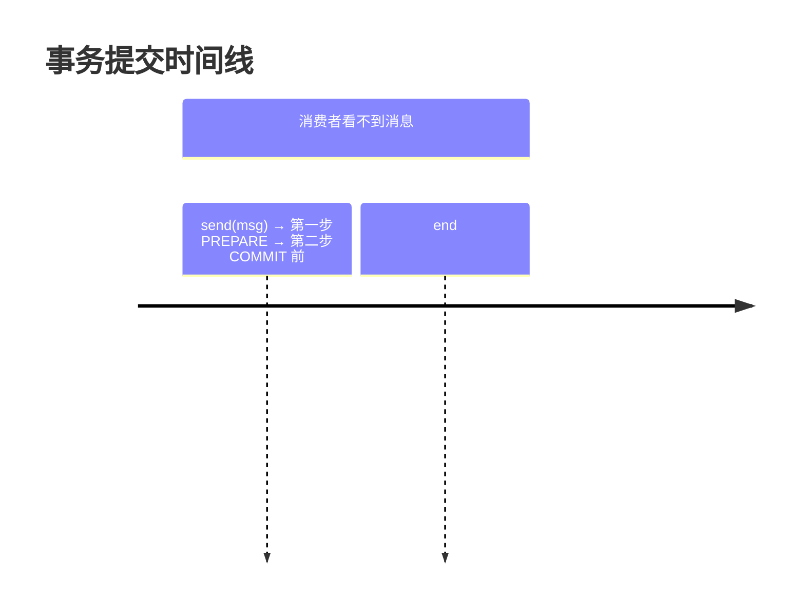

**为什么非要两步？一步不行吗？**
- 若只一步（直接发 Marker 让可见）：协调器发给分区0 后**宕机**，分区1/2 没收到 -> 数据不一致
- 有第一步垫底：协调器先记日志（落盘），即使第二步宕机，**重启后看日志就知道要 commit**，继续补发 Marker -> 最终所有分区一致

> 💡 **一句话**：第一步"立遗嘱保平安"（持久化意图，防协调器宕机丢失），第二步"挨家敲门揭幕"（发 Marker 让消息变可见）。两步配合，协调器中途挂了也能恢复后继续，保证最终一致。

**📌 拓展：什么是 2PC（两阶段提交）？**

> 2PC（Two-Phase Commit）是**分布式事务的经典协议**，用来保证"跨多个节点的操作，要么全成功，要么全失败"。

**两个角色**
- **协调者 Coordinator**：全局调度，决定"提交还是回滚"
- **参与者 Participants**：各执行节点（数据库/服务），各自干活并投票

**通俗类比：聚餐AA结账**

> 4 个人聚餐，约定"要么全AA，要么全不AA，不能有人赖账"。于是请**服务员（协调者）** 来组织：
> - **第一阶段（点菜前确认）**：服务员挨个问 4 人"今天AA行不行？"，每人回答 YES/NO。有人喊 NO 就散伙。
> - **第二阶段（执行）**：全员 YES -> 服务员喊"结账AA"，4 人各自掏钱；有任一 NO -> 服务员喊"散了散了"，谁都不掏。

**两阶段流程**
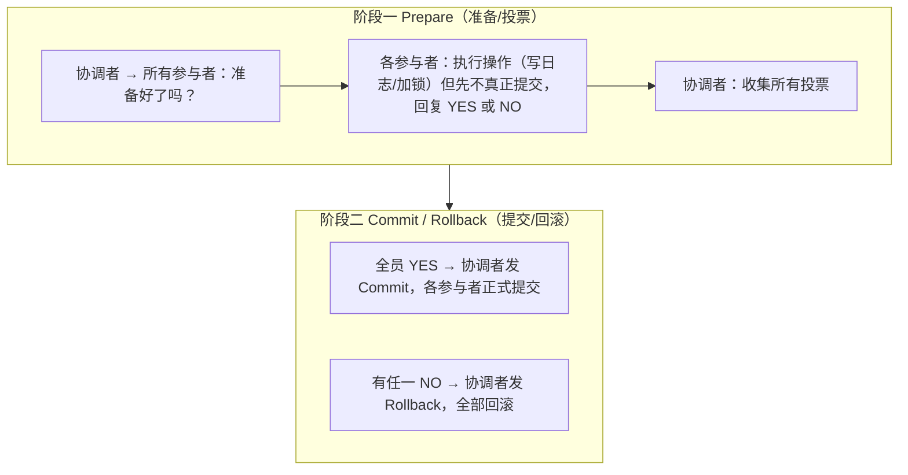

**2PC 的致命缺点**
1. **同步阻塞**：prepare 后参与者一直锁着资源等协调者下令，期间谁都不能动
2. **协调者单点故障**：协调者挂了，参与者会一直卡在"锁资源等待"状态（阻塞恢复）
3. **不一致风险**：commit 阶段协调者发了一半消息挂了，部分参与者提交、部分没提交 -> 数据不一致

**对比：为什么 Kafka 事务不是经典 2PC**

| 对比 | 经典 2PC | Kafka 事务 |
|------|---------|-----------|
| 投票 | 参与者各自 YES/NO **投票** | **没有投票**，生产者单方面决定 commit/abort |
| prepare 阶段 | 参与者执行+加锁，阻塞等待 | 无此阶段 |
| 协调者故障 | 参与者**阻塞死等** | 状态持久化在 `__transaction_state`，可恢复，不阻塞 |
| 提交信号 | 协调者逐个通知参与者 | 协调器向分区写 commit/abort **Marker**，无限重试至成功 |
| 一致性 | 追求强一致 | 只保证**最终一致** |

> 💡 **一句话**：2PC 是"参与者投票 + 协调者下令 + 阻塞等待"的强一致协议；Kafka 事务只是"事务日志 + Marker 标记"的最终一致机制，**两者只是"都有两步"形似，本质不同**。


**事务代码骨架**

```java
configMap.put(ProducerConfig.ENABLE_IDEMPOTENCE_CONFIG, true);          // 事务必须开幂等
configMap.put(ProducerConfig.TRANSACTIONAL_ID_CONFIG, "my-tx-id");      // 关键：稳定的身份证
KafkaProducer<String, String> producer = new KafkaProducer<>(configMap);

producer.initTransactions();   // 1. 报到，拿 PID
try {
    producer.beginTransaction();                      // 2. 开启事务
    producer.send(new ProducerRecord<>("topic-order", "msgA"));
    producer.send(new ProducerRecord<>("topic-inventory", "msgB"));
    producer.send(new ProducerRecord<>("topic-notify", "msgC"));
    producer.commitTransaction();                     // 4. 提交（全成功才可见）
} catch (Exception e) {
    producer.abortTransaction();                      // 失败回滚（全不可见）
} finally {
    producer.close();
}
```

> 💡 **一句话总结**：幂等性是"临时访客牌"，单次会话内不重复；事务是"会员卡"，靠 `transactional.id` 让 PID 跨会话稳定，同时把多条消息绑成**原子操作**（要么全发成功，要么全失败）。

**三种传输语义**

| 语义 | 说明 | 实现 |
|------|------|------|
| At Most Once | 最多一次，可能丢 | ACK=0 |
| At Least Once | 至少一次，可能重复 | ACK=1 |
| Exactly Once | 精准一次 | 幂等+事务+ACK=-1 |

**📌 通俗讲解：三种传输语义是什么意思？**

> 传输语义描述的是**消息从生产者到消费者这条链路上，可靠性的三个等级**。核心就两个问题：**会不会丢？会不会重复？**

| 语义 | 中文 | 会丢吗 | 会重复吗 | 通俗理解 |
|------|------|--------|---------|---------|
| **At Most Once** | 至多一次 | ✅ 可能丢 | ❌ 不会重 | "宁可丢，绝不重" |
| **At Least Once** | 至少一次 | ❌ 不会丢 | ✅ 可能重 | "宁可重，绝不丢" |
| **Exactly Once** | 恰好一次 | ❌ 不会丢 | ❌ 不会重 | "不丢不重，理想态" |

**① At Most Once（至多一次）**
- 消息**最多传一次**，丢了就丢了，不重发
- 实现：生产者 `acks=0`，发出去就不管，不等确认
- 场景：日志采集、监控指标--丢几条无所谓，要的是高吞吐
- 类比：你发条短信，信号不好没发出去，你不补发 -> 对方可能根本没收到

**② At Least Once（至少一次）** ⭐ Kafka 默认
- 消息**至少传一次**，绝不丢，但可能重复
- 实现：生产者 `acks=1`/`acks=-1` + 重试；消费者消费后提交 offset
- **为什么会重复**：生产者发了消息，Broker 收到了，但 ACK 回传时网络断了 -> 生产者以为没发成功 -> **重发** -> 重复
- 场景：大部分业务场景，配合"消费端幂等"兜底
- 类比：你发短信，不确定对方收到没，就**重发** -> 对方可能收到两条一样的

**③ Exactly Once（恰好一次）** ⭐ 理想但难
- 消息**恰好传一次**，不丢不重
- 实现：`幂等 + 事务 + acks=-1`
  - 生产者侧：幂等性（PID+序列号去重）+ 事务（跨分区原子写入）
  - 消费者侧：把"消费处理 + 提交 offset"绑成原子操作
- 场景：金融交易、计费--绝不能丢、也绝不能重复扣款
- 类比：转账，必须且只能发生一次

**可靠性递进**

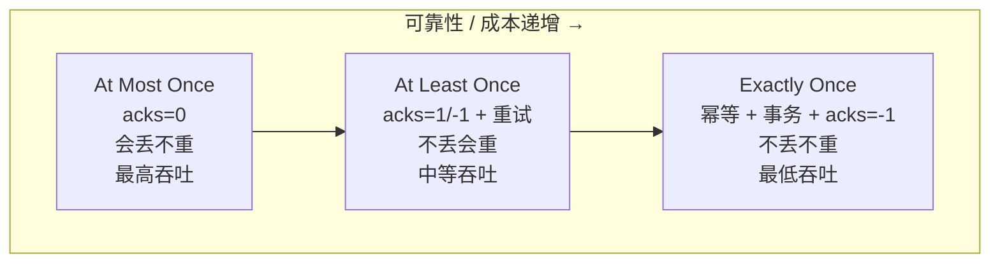

> 💡 规律：可靠性越高，性能开销越大（要等更多确认、要去重、要协调）。鱼和熊掌的权衡。

**⚠️ 三个关键认知**

1. **"Exactly Once" 不是消息只发一遍**：很多人误以为是"网络上只传一次"。其实底层仍可能重发，只是靠**幂等去重**让最终效果等价于"只处理一次"。所以叫"语义上的恰好一次"，不是"物理上只传一次"。

2. **At Least Once 是默认，配幂等变 Exactly Once**：Kafka 默认 At Least Once（acks+重试）；开幂等后生产者侧不重复了 -> 接近 Exactly Once；但要**真正 Exactly Once** 还得事务 + 消费端原子提交。

3. **消费端也参与语义保证**：传输语义不只看生产者。生产者不丢靠 `acks+重试`；消费者不重复靠消费幂等（去重表/唯一键）或把"处理+提交offset"原子化。

> 💡 **一句话记忆**：**At Most Once 宁丢不重，At Least Once 宁重不丢，Exactly Once 不丢不重（靠幂等去重实现）。** Kafka 默认 At Least Once，开幂等+事务才能到 Exactly Once。

---

### 1.4 存储消息

**存储组件链路**

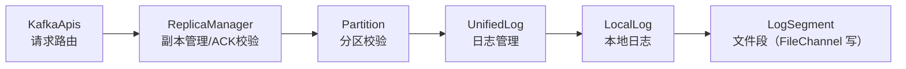

**数据存储流程（7步校验）**
1. ACKS 校验（应答场景是否合法）
2. 内部主题校验（不能写 `__consumer_offsets`、`__transaction_state`）
3. ACK 与 `min.insync.replicas` 关系校验（ISR 至少2个才有意义）
4. 日志文件滚动判断（1G/7天/索引满 → 新建文件段）
5. 请求数据重复性校验（幂等去重）
6. 序列号连续性校验（防乱序）
7. 写入日志文件，更新偏移量

**存储文件格式**

| 文件 | 作用 |
|------|------|
| `.log` | 数据日志，文件名=首条消息偏移量。结构：**批次头(61字节) + 数据体** |
| `.index` | 偏移量索引，**稀疏索引**（每4K日志记一条），mmap 内存映射 |
| `.timeindex` | 时间戳索引，时间戳→偏移量 |

> 💡 **稀疏索引**：不连续，靠二分查找定位；丢几条不影响（可推算）。类比 HashMap 用 Key 快速找 Value。

**数据刷写**
- 数据先进 OS 的 **PageCache（页缓存）**，未落盘
- 可配 `log.flush.interval.messages/ms` 强制刷盘，但**官方不推荐**
- 可靠性应靠**副本**保证，强刷盘影响性能

**副本同步（核心机制）**

**为什么要副本同步？**

> Kafka 一个分区有多个副本，但只有 Leader 对外读写，Follower 只备份。如果 Leader 宕机，Follower 要能立刻顶上。这就要求 **Follower 必须持续从 Leader 拉取数据，保持和 Leader 一致**。否则 Leader 一挂，新 Leader 上来发现数据是旧的 -> 消息丢失。

**Follower 怎么同步：截断 + 抓取循环**

每个 Follower 启动一个同步线程 `ReplicaFetcherThread`，**不停循环做两件事**：

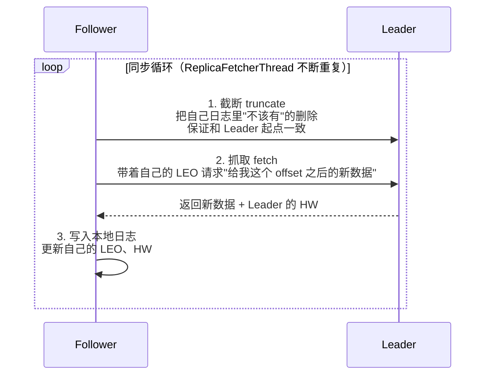

- **截断 truncate**：如果 Follower 本地日志和 Leader 不一致（比如 Follower 之前当过 Leader 有多余数据），先把多余部分删掉，保证起点对齐
- **抓取 fetch**：带上自己的 LEO 向 Leader 拉取新数据，**Leader 把数据和自己的 HW 一起返回**
- Follower 收到后写入本地、更新自己的 LEO，并根据 Leader 下发的 HW 更新自己的 HW

> 💡 **关键**：Follower 是**主动拉取（pull）**Leader 的数据，不是 Leader 推送。这和消费者拉取 Broker 是同一个思路。

**四个关键位移概念（务必分清）**

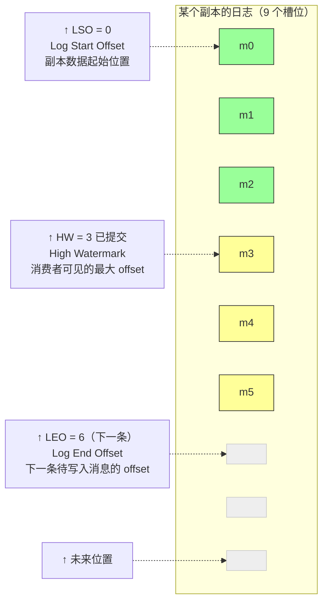

| 概念 | 全称 | 含义 | 谁维护 |
|------|------|------|--------|
| **Offset** | - | 消息在分区的序号，从0开始 | 全局 |
| **LSO** | Log Start Offset | 副本数据起始位置，初始0 | 每个副本 |
| **LEO** | Log End Offset | 下一条待写入消息的offset | **每个副本各自维护** |
| **HW** | High Watermark | 高水位，**消费者可见的最大offset** | Leader 算后下发给 Follower |

> 💡 注意：HW 取的是 **ISR 列表内**各副本 LEO 的最小值，非 ISR 副本（OSR）不计入。文档表述"min(所有副本LEO)"不够严谨。
>
> 理解要点：**LEO 是"我写到哪了"，HW 是"消费者能读到哪了"**。HW ≤ LEO，因为 HW 要等所有副本都同步到那个位置才能往前推。

**HW 木桶理论：怎么保证一致性？**

> 把分区比作一个木桶，每个副本是一块木板，**水位 = 最短木板的高度**。消费者只能读水位以下的数据。

为什么这么做？看场景：

```mermaid
graph TB
    subgraph LeaderA["Leader A — LEO = 6（最快）"]
        A_m0["m0"] A_m1["m1"] A_m2["m2"]
        A_m3["m3"] A_m4["m4"] A_m5["m5"]
    end
    subgraph FollowerB["Follower B — LEO = 4"]
        B_m0["m0"] B_m1["m1"] B_m2["m2"]
        B_m3["m3"] B_empty1[" "] B_empty2[" "]
    end
    subgraph FollowerC["Follower C — LEO = 3（最慢，拖低 HW）"]
        C_m0["m0"] C_m1["m1"] C_m2["m2"]
        C_empty1[" "] C_empty2[" "] C_empty3[" "]
    end

    HW_Note["HW = min(6, 4, 3) = 3<br/>消费者只能读到 m0~m2<br/>最慢副本决定可见水位"]
    FollowerC --> HW_Note
```

如果消费者能读 A 的全部数据（读到 m5），万一此时 A 宕机，C 被选为新 Leader，C 只有 m0~m2（LEO=3），那 m3/m4/m5 就"丢"了 -> **消费者会感知到数据丢失**。

**HW 机制解决**：HW = min(A的LEO, B的LEO, C的LEO) = min(6,4,3) = **3**。消费者只能读 HW=3 以下的数据（m0~m2）。即使 A 宕机、C 上位，消费者能读的范围还是到 m2，**前后一致，不会感知丢失**。

**HW 完整推演（看一遍就懂）**

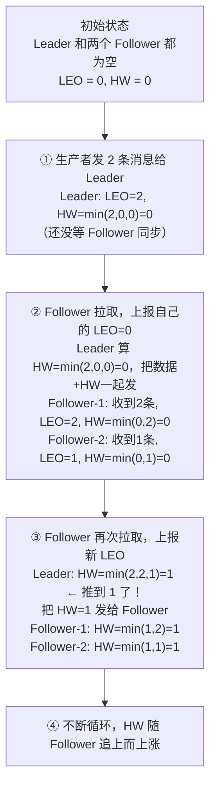

> 💡 规律：**HW 的推进取决于最慢的 Follower**。只有所有 ISR 副本都同步到某个 offset，HW 才推到那里。所以 HW ≤ 任意副本的 LEO。


**ISR 机制（重点，三层含义别混）**

ISR 不只是一个"列表"，它有**三层含义**，面试常考：

| 层面 | 含义 |
|------|------|
| **① 集合概念** | ISR = In-Sync Replicas，"和 Leader 保持同步的副本集合"（含 Leader 本身） |
| **② 同步判定标准** | 不是"一字不差"，而是**在规定时间内追上过 Leader** |
| **③ 动态管理机制** | ISR 不固定，动态伸缩：跟不上踢出(Shrink)，追上拉回(Expand) |

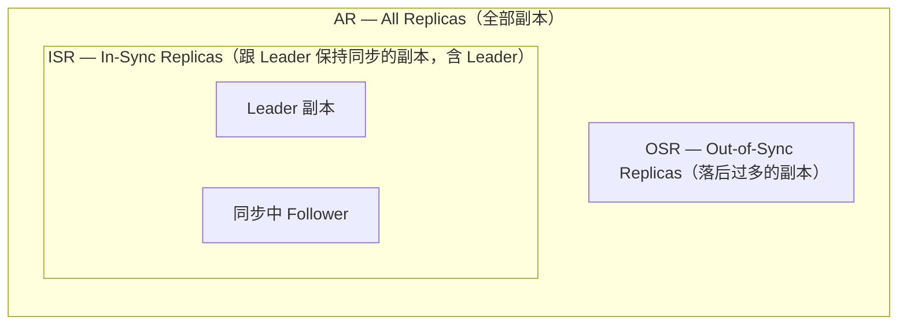

**"同步"的判定标准（最易被忽略的点）**

判定标准是参数 **`replica.lag.time.max.ms`**（旧版默认30s，新版默认10s）：

- Follower 只要**在过去 `replica.lag.time.max.ms` 时间内曾经追上过 Leader 的 LEO**，就算"在同步"，留在 ISR
- 超过这个时间还没追上 -> 判定"落后"，**踢出 ISR 进入 OSR**

> 💡 **关键认知**：ISR 里的副本也可能**暂时落后几个消息**，只要它"最近追上过"就行。ISR 是**基于时间**判定的，不是基于"字节级一致"。

**ISR 伸缩到底是什么**

"伸缩" = ISR 这个集合会**动态变大变小**，平衡两个矛盾：
- **可靠性**：ISR 越多越好，副本都在同步，ACK=all 时数据更安全
- **性能**：ISR 越少越好，ACK=all 不用等慢副本，HW 推进快

所以 ISR 要动态调整，这就是"伸缩"：

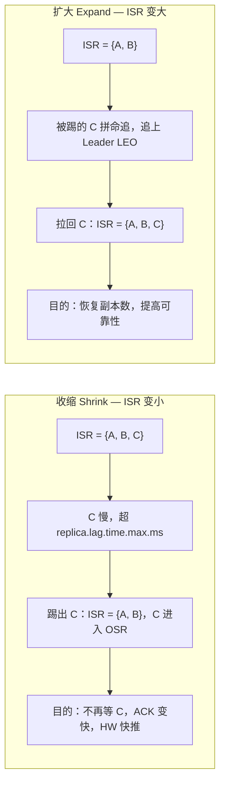

**伸缩带来的两个重要影响**

1. **ACK=all 只等 ISR，不等 AR**：`acks=-1` 只需 ISR 里的副本都写入就应答，OSR 里的副本不影响 ACK。所以 ISR 收缩后 ACK 会变快。

2. **HW 推进只看 ISR**：HW = min(ISR 副本的 LEO)。ISR 收缩掉慢副本后，HW 能快速推进（不被慢副本拖累）。

**🔥 面试连环问：ISR 只剩 Leader 一个，ACK=all 还有意义吗？**
- **没意义了**！ISR 只剩 1 个时，ACK=all 等价于 ACK=1
- Leader 写入就应答，Leader 宕机数据就丢
- **这就是为什么必须配 `min.insync.replicas=2`**：强制 ISR 至少 2 个，否则直接拒绝写入（宁可不可用也不丢数据）
- 生产三件套：`acks=all` + `min.insync.replicas=2` + `replication.factor=3`

> 💡 **一句话总结**：ISR = "**最近追上过 Leader**"的副本集合（基于时间判定，非字节一致）；**伸缩** = 慢副本踢出（保性能）、追上拉回（保可靠）的动态调整；ACK=all 和 HW 都只看 ISR 不看 AR。

**⚠️ HW 机制的缺陷与 Leader Epoch（勘误④，面试高频）**

单纯靠 HW 截断在某些故障下会丢数据：

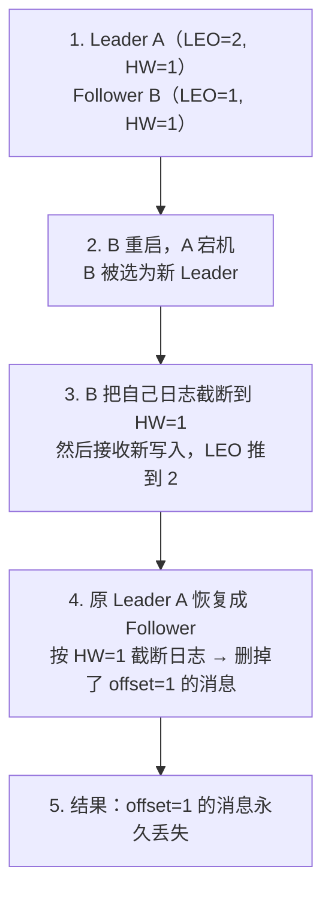

**Leader Epoch 解决**：引入 `<LeaderEpoch, StartOffset>` 日志，每次 Leader 切换递增 Epoch。Follower 重启时不再盲目截断到 HW，而是先问 Leader 当前的 Leader Epoch，据此**精确截断**，避免误删已提交消息。
**📌 先搞懂：Epoch 是什么？**

> Epoch（纪元/时代）= 一个**单调递增的整数编号**，每次发生"权力交接"或"重启换代"时 +1。核心作用：标识"第几代"，并让"上一代的旧请求/旧数据作废"，防止老的已失效的东西回来捣乱。

**通俗类比：国王换届**

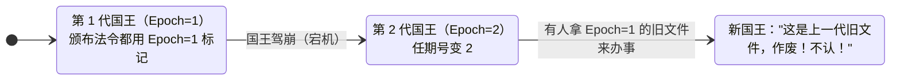

> 💡 Epoch 的本质 = **防止"过期的旧势力"复活搞乱**。任何带旧 Epoch 的请求/数据，都被当"前朝遗老"直接拒绝。

**Kafka 里 Epoch 用在3处（原理一致：换届作废旧势力）**

| Epoch 名 | 换届触发 | 防什么 |
|---------|---------|--------|
| **Leader Epoch** | 分区 Leader 切换 | Follower 用旧数据截断误删已提交消息 |
| **Controller Epoch** | 集群 Controller 切换 | 老 Controller 脑裂指令 |
| **Producer Epoch** | 生产者重启(事务) | 僵尸生产者复活重复写入 |

> 一句话：Epoch = **换届编号**（单调递增），每次权力交接/重启 +1，旧 epoch 作废。

**回到 Leader Epoch 怎么解决 HW 缺陷**

HW 截断的问题是"粗粒度"：Follower 重启时盲目截断到 HW，可能删掉其实已提交的消息。Leader Epoch 用"精确换届"代替"粗水位"：

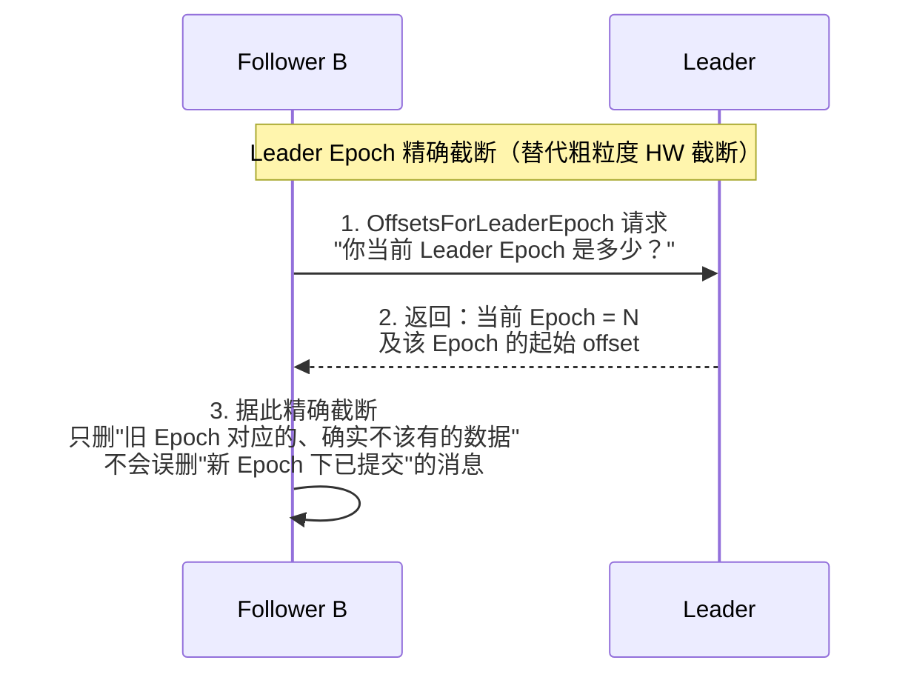

- Leader 在每个日志段维护一份  的映射文件（叫 checkpoint）
- Follower 截断时按 Epoch 对齐，而不是按 HW 这种"最低水位"对齐
- 结果：避免了 HW 机制下"重启后误删已提交消息"的数据丢失问题


> 一句话：**HW 截断是粗粒度的**（可能误删已提交数据），**Leader Epoch 截断是精确的**。这是 Kafka 0.11 引入的改进，文档 2.5.6.1 提了一嘴但没讲清动机。

---

### 1.5 消费消息

**push vs pull（Kafka 选 pull）**
- push：Broker 推送，消费者处理不过来会**积压**，压垮网络存储
- pull：消费者按自己能力主动拉取，通道顺畅 ← **Kafka 用这个**

**消费者组 Consumer Group**
- 多个消费者组成一组，**共同消费一个主题全部数据**
- 核心规则：**一个分区同一时刻只能被组内一个消费者消费**（避免重复）
- 消费者数 > 分区数 → 多余的空闲浪费
- 组间广播：不同组各自消费全量

**Coordinator 协调器**
- Broker 上的组件，管理消费者组的成员、状态、分区分配、偏移量
- 每个组只有一个 Group Coordinator

**分区分配策略（4种）**

| 策略 | 规则 | 缺点 |
|------|------|------|
| **RangeAssignor** | 按主题分区均分，除不尽向前补齐 | 多主题时排序靠前的负载重 |
| **RoundRobinAssignor** | 按 memberid 排序后轮询所有主题分区 | 不够均衡 |
| **StickyAssignor** | 首次分配后尽量保持不变，变动只重分受影响部分 | - |
| **CooperativeStickyAssignor** | 2.4+，把全局重平衡改小规模逐步收敛 | - |

> 默认：`RangeAssignor + CooperativeStickyAssignor`。群主（第一个加入的消费者）负责分配。

**Offset 偏移量管理**
- 起始偏移量 `auto.offset.reset`：
**📌 消费者可读范围：[LSO, HW)（重点，别漏）**

> 消费者能读的消息，是日志里的一个"有效窗口"，左右边界分别由 LSO 和 HW 决定：

```mermaid
graph LR
    subgraph Log["日志分区"]
        direction LR
        Del["[已删除] 0~4"]
        m5["m5"]
        m6["m6"]
        m7["m7"]
        m8["m8"]
        Uncommitted["[未提交] m9+"]
    end

    LSO_note["↑ LSO = 5<br/>最早能读"]
    HW_note["↑ HW = 9<br/>最远能读"]
    LEO_note["↑ LEO = 10<br/>下一条待写入"]

    LSO_note -.-> m5
    HW_note -.-> Uncommitted
    LEO_note -.-> Uncommitted

    Window["可读窗口 = [LSO=5, HW=9) = m5, m6, m7, m8"]
    m5 --- Window

    classDef deleted fill:#eee,stroke:#ccc;
    classDef readable fill:#9f9,stroke:#333;
    classDef uncommitted fill:#ff9,stroke:#333;
    class Del deleted;
    class m5,m6,m7,m8 readable;
    class Uncommitted uncommitted;
```

| 边界 | 含义 |
|------|------|
| **LSO**（Log Start Offset） | 日志里最早一条还存活消息的 offset，消费者"最早能从哪读" |
| **HW**（High Watermark） | 已提交的最大 offset，消费者"最远能读到哪"（不含） |

**LSO 对读取的关键影响（面试常考）**

1. **可读范围是 [LSO, HW)，不是 [0, HW)**：LSO 之前的消息已被日志清理删除，读不到了
2. **LSO 只增不减**：数据过期/日志清理后，旧消息被删，LSO 前移；前移后旧 offset 彻底读不到
3. **earliest 不等于 offset 0**：`auto.offset.reset=earliest` 是从"当前 LSO"开始读，不是从 0。若 LSO 已前移，0~LSO 的消息不存在
4. **seek 到 LSO 之前会报错**：`consumer.seek(partition, 0)` 但若 LSO=5，会被强制拉回 LSO=5，或抛 `OffsetOutOfRangeException`

> 💡 **一句话**：消费者能读的"有效窗口"= [LSO, HW)。LSO 是"最早还活着"，HW 是"最远已提交"。earliest 从 LSO 读，不是从 0 读。

  - `earliest`：从当前 **LSO** 开始读，消费所有还存活的历史消息（不是从0！）
  - `latest`（默认）：从**连接那一刻的 LEO** 开始读，只消费连接后新产生的数据，连接前积压的消息全部跳过
  - `none`：找不到已提交 offset 直接抛异常，生产环境不用

**📌 latest vs earliest 起点（最易答错）**

> 假设分区现有 m0~m9（LSO=0, HW=10, LEO=10），新消费者组首次接入：

```mermaid
graph TB
    subgraph Table["auto.offset.reset 起点对比（假设分区 m0~m9 已存在）"]
        direction TB
        subgraph Row1["earliest"]
            direction LR
            R1_start["起点：LSO（示例=0）"]
            R1_read["读到：m0~m9（历史全量）"]
        end
        subgraph Row2["latest（默认）"]
            direction LR
            R2_start["起点：当前 LEO（示例=10）"]
            R2_read["读到：跳过 m0~m9，只读 m10 之后"]
        end
        subgraph Row3["none"]
            direction LR
            R3_start["起点：—"]
            R3_read["读到：抛异常 OffsetOutOfRangeException"]
        end
    end
```

- ⚠️ **latest 起点是"连接时的 LEO"，不是 HW**！连接前积压的消息一条都不读
- ⚠️ **earliest 起点是"当前 LSO"，不是 0**！LSO 之前的旧消息已被清理读不到

**什么时候才触发 auto.offset.reset？**

只在"**找不到已提交 offset**"时才生效，三种情况：
1. 消费者组**首次**消费（从未提交过 offset）
2. 已提交的 offset 对应消息**已被清理**（offset < LSO）
3. offset 信息丢失

> 💡 **关键**：如果消费者组**有已提交的 offset**，`auto.offset.reset` **根本不生效**，直接从已提交的 offset 继续读。这个参数只兜底"找不到 offset"的情况。

- 指定偏移量：`consumer.seek(partition, offset)`
- **提交方式**：

| 方式 | 特点 |
|------|------|
| 自动提交 | 默认开启，每5s提交，可能重复/丢 |
| 手动异步提交 | `commitAsync()`，不阻塞但可能失败 |
| 手动同步提交 | `commitSync()`，阻塞重试，安全但慢 |

> ⚠️ 提交offset会覆盖 `auto.offset.reset`。要保证不丢：**先处理完数据再提交**。

**偏移量存储**
- 0.9 版本前存 ZooKeeper，之后存内部主题 `__consumer_offsets`
- 默认 **50 个分区**，`hash(consumerGroupId) % 50` 决定存哪个分区
- Key = `consumerGroupId + topic + 分区号`，Value = offset，只保留最新

**消费者事务（重点）**

**① 消费者端的事务为什么弱？**

> 对于单独的 Consumer，事务保证比较弱，核心难点在于：**"消费数据"和"提交偏移量"是两个动作，难以原子绑定**。

- 消费者通过偏移量访问消息，但不同的数据文件（日志段）生命周期不同
- 同一事务的消息可能因重启、日志清理被删除
- 无法保证"提交的偏移量"对应的消息被"精确消费一次"

**两种出错场景**：

| 做法 | 风险 |
|------|------|
| 先提交 offset 再处理业务 | 处理失败但 offset 已提交 -> **数据丢失** |
| 先处理业务再提交 offset | 处理成功但提交失败/重启 -> **重复消费** |

**② 消费端如何做事务（原子绑定）**

> 一般做法：把**数据消费过程 + 偏移量提交过程**进行**原子性绑定**。

- 数据处理完了，必须保证偏移量正确提交，才能进行下一步操作
- 若偏移量提交失败，数据恢复到处理之前的效果（回滚）
- Kafka 提供的方式：将"消费 + 提交 offset"放到**同一个事务**里（配合生产者事务机制）

**③ 与生产者事务的关系：隔离级别**

> 生产者开启事务后，消费者消费的数据也会受到限制。默认消费者**看不到**生产者未提交的数据，需通过隔离级别控制。

| 隔离级别 | 含义 | 是否默认 |
|---------|------|---------|
| `read_committed` | 只读"已提交事务成功"的数据，未提交的看不到 | ✅ 默认 |
| `read_uncommitted` | 已提交 + 未提交事务的数据都能读到 | 否 |

**④ 完整代码示例**

```java
Map<String, Object> paramMap = new HashMap<>();
paramMap.put(ConsumerConfig.BOOTSTRAP_SERVERS_CONFIG, "localhost:9092");
paramMap.put(ConsumerConfig.KEY_DESERIALIZER_CLASS_CONFIG, StringDeserializer.class.getName());
paramMap.put(ConsumerConfig.VALUE_DESERIALIZER_CLASS_CONFIG, StringDeserializer.class.getName());
paramMap.put(ConsumerConfig.GROUP_ID_CONFIG, "test");

// 隔离级别：已提交读，只读取已提交事务成功的数据（默认，可省略）
// paramMap.put(ConsumerConfig.ISOLATION_LEVEL_CONFIG, "read_committed");

// 隔离级别：未提交读，已提交和未提交事务的数据都能读到
paramMap.put(ConsumerConfig.ISOLATION_LEVEL_CONFIG, "read_uncommitted");

KafkaConsumer<String, String> c = new KafkaConsumer<>(paramMap);
c.subscribe(Collections.singletonList("test"));
while (true) {
    ConsumerRecords<String, String> poll = c.poll(Duration.ofMillis(100));
    for (ConsumerRecord<String, String> record : poll) {
        System.out.println(record.value());
    }
}
```

> 💡 **一句话**：消费者事务弱在"消费与提交 offset 难原子绑定"，做法是**原子绑定消费+提交**；生产者开事务后，消费者用 `read_committed`(默认) 只看已提交数据，`read_uncommitted` 连未提交也看。

**⑤ 生产者事务 vs 消费者事务（对比）**

> 生产者事务管"**发消息**"，消费者事务管"**读消息**"，两者是一对呼应关系。

| 对比项 | 生产者事务 | 消费者事务 |
|--------|-----------|-----------|
| **解决什么** | 多条消息要么全成功可见、要么全失败不可见 | 消费处理 + 提交offset 原子绑定，不丢不重 |
| **作用方向** | 发送端（写） | 接收端（读） |
| **核心机制** | `transactional.id` + 事务协调器 + Marker | 消费+提交offset原子绑定 + 隔离级别 |
| **是否需要 PID** | 需要（绑定 PID 跨会话稳定） | 不直接涉及 PID |
| **隔离级别** | 不涉及（生产者只管提交/中止） | `read_committed`(默认) / `read_uncommitted` |
| **强弱** | 相对强（有完整事务协调器机制） | 较弱（单Consumer难精确一次消费） |
| **典型代码** | `initTransactions/begin/commit/abort` | `isolation.level` + 原子提交offset |
| **所在章节** | 见 1.3 节"事务" | 见本节"消费者事务" |

**两者如何配合（端到端 Exactly Once）**

```mermaid
graph TB
    subgraph PT["生产者事务（1.3节）"]
        P1["开事务发多条消息<br/>（未提交时消费者看不到）"]
        P2["commit：发 Marker 让消息可见"]
        P1 --> P2
    end

    subgraph CT["消费者事务（本节）"]
        C1["开事务：消费 + 提交 offset 原子绑定"]
        C2["read_committed：只读已提交消息"]
        C1 --> C2
    end

    EOS["端到端 Exactly Once：消息不丢不重"]

    PT --> CT
    CT --> EOS
```

> 💡 **一句话**：生产者事务保证"发出去的消息要么全可见要么全不可见"，消费者事务保证"读到的消息处理与提交offset原子绑定"。两者配合 + 隔离级别 `read_committed`，才能实现端到端的 Exactly Once。


**消费数据服务端流程（重点）**

> 消费者一般只设定订阅的主题名称，那 Broker 端是怎么"找到数据并返回给消费者"的？下面是服务端拉取数据的完整流程。

**完整流程图**

```mermaid
sequenceDiagram
    participant C as 消费者 Consumer
    participant B as Broker
    participant K as KafkaApis
    participant R as ReplicaManager
    participant L as LogSegment

    C->>B: 1. 发送 FETCH 请求<br/>（带：要消费的分区、当前 offset、拉多少）
    B->>K: 2. KafkaApis 路由<br/>（按请求标记 FETCH 分发）
    K->>R: 3. ReplicaManager 处理
    R->>R: 确定拉取的分区<br/>校验权限/合法性
    R->>R: 4. 判定首选副本<br/>（读 Leader 还是 Follower）
    R->>L: 5. LogSegment 读取数据<br/>按 offset 定位日志段，用索引快速查找
    L-->>C: 6. 零拷贝传输<br/>（FileChannel 从内核直传）
    Note over C: 返回消息批次 + HW/LEO<br/>消费者收到数据，处理后再 poll 下一次
```

**分步详解**

**① 消费者发送 FETCH 请求**
- 消费者通过 `poll()` 向 Broker 发送 `FetchRequest` 拉取数据的请求
- 请求里带上：要消费的分区、当前消费到的 offset（从哪开始拉）、最多拉多少（`fetch.max.bytes`）、超时时间
- 这就是"消费者主动拉取（pull）"，不是 Broker 推送

**② KafkaApis 路由请求**
- Broker 收到请求后，由 `KafkaApis`（应用处理接口）根据请求的标记 `FETCH` 分发
- KafkaApis 是 Broker 内部的"请求调度器"，所有请求先经过它判断类型再转给对应处理器

**③ ReplicaManager 副本管理器处理**
- 确定消费者要拉取的是哪个分区
- 校验：分区是否存在、消费者是否有权限、offset 是否合法（在 [LSO, HW) 范围内）
- 校验通过后交给分区对象去读数据

**④ 判定首选副本（2.4版本重要变化）**
- **2.4 之前**：数据的读写都走 **Leader 副本**（Follower 不参与读）
- **2.4 之后**：支持 **Follower 副本读取**，称为"**首选副本（Preferred Replica）**"
- 目的：跨机房/跨数据中心场景下，**就近从本地机房的副本读数据**，省跨机房流量、降延迟
- 不是所有 Follower 都能读，只有"首选"的那个（通常是和消费者同机房的副本）

**⑤ LogSegment 读取数据**
- 底层用 `LogSegment` 对象操作，对应具体的某个日志段文件
- 按 offset 定位：先二分查找定位到哪个日志段（文件名是起始offset），再用稀疏索引快速定位到日志段内的物理位置
- 读取出一个消息批次返回

**⑥ 零拷贝传输（性能关键）**
- 传统方式：磁盘 -> 内核缓冲 -> 用户空间 -> Socket缓冲 -> 网卡（4次拷贝、4次上下文切换）
- Kafka 用 NIO 的 `FileChannel` + `transferTo` 实现**零拷贝**：数据从**操作系统内核**直接传到网卡，**不经过用户空间**
- 好处：减少2次数据拷贝和上下文切换，大幅提升消费读取效率
- 这也是 Kafka 高吞吐的重要原因之一

**返回的数据里还有什么**

Broker 除了返回消息数据，还会返回一些偏移量信息：
- **HW（高水位）**：消费者据此知道自己能读到的最大范围，避免读到未提交数据
- **LEO**：Leader 的日志末端，消费者可据此判断消费进度（Lag = LEO - 已消费offset）

> 💡 **一句话总结**：消费者 `poll` 发 FETCH 请求 -> Broker 的 KafkaApis 路由 -> ReplicaManager 校验分区 -> 判定首选副本(2.4+可读Follower) -> LogSegment 按 offset 读数据 -> **零拷贝**直接从内核传给消费者，同时返回 HW/LEO。


---

## 二、常见面试题

1. Kafka 集群中 Broker 和 Controller 分别是什么？Controller 是如何选举的？
2. 为什么启动 Kafka 前必须先启动 ZooKeeper？
3. Topic、Partition、Replica、Leader/Follower、Log 之间是什么关系？为什么要有分区和副本？
4. 创建主题时，分区和副本是如何分配到各 Broker 的？
5. Kafka 生产者内部有哪三大组件？为什么采用"攒批"发送？
6. 生产者的异步发送和同步发送有什么区别？拦截器有什么用？
7. Kafka 的分区策略有哪些？无 Key 时如何选择分区（粘性分区）？
8. ACK 的三种取值 0/1/-1 分别是什么含义？生产环境如何选？
9. 生产者重试会带来什么问题？Kafka 如何通过幂等性解决？
10. 幂等性有什么局限？事务又是如何解决的？事务采用什么提交协议？
11. Kafka 的三种传输语义是什么？
12. Kafka 消息存储有哪些文件？.log 文件的结构是什么？为什么用稀疏索引？
13. 什么是 LEO、HW、LSO？它们之间是什么关系？
14. Kafka 如何保证副本间数据一致性？（木桶理论 + HW 机制）
15. 什么是 ISR？它和 AR、OSR 是什么关系？ISR 如何伸缩？
16. Kafka 消费者为什么用 pull 而不用 push？
17. 消费者组的核心规则是什么？一个分区能被几个消费者消费？
18. Kafka 有哪几种分区分配策略？默认是哪种？
19. Offset 存储在哪里？自动提交和手动提交各有什么优缺点？如何避免重复消费和丢消息？
20. 消费者拉取数据时，Kafka 服务端是如何处理的？零拷贝体现在哪里？

---

## 三、资料勘误与重点提醒

> 以下为阅读参考资料时识别出的**表述不准/遗漏**，此处集中修正与补充。

### 3.1 文档表述需修正之处

**① 幂等性的"缓存5个批次"表述不准**
- 文档称"Broker 给每个分区缓存最近的 5 个批次数据，按 seqnum 升序去重"
- ⚠️ 实际：Broker 为每个 `<PID, epoch, partition>` 维护**一个已提交序列号**，去重靠序列号比对，而非"缓存5个批次"。数字 5 实为 `max.in.flight.requests.per.connection` 的在途请求上限（开启幂等后必须 ≤5），它定义的是去重窗口大小。

**② HW 取值基准**
- 文档多处写 `HW = min(所有副本 LEO)`
- ⚠️ 实际：HW = **ISR 列表内**各副本 LEO 的最小值。已脱离同步的 OSR 副本不计入，否则慢副本会无限拖低水位。

**③ "Kafka 事务采用二阶段提交"不够严谨**
- 文档直接等同于 2PC
- ⚠️ 实际：Kafka 事务是 **Transaction Coordinator + 事务日志 `__transaction_state` + commit/abort Marker** 机制，无经典 2PC 的 prepare 投票与协调者阻塞恢复，只是有"预提交->提交"两步的形似。面试时不要答"Kafka 用 2PC"。

### 3.2 文档遗漏的重点（面试高频，务必补充）

**④ HW 更新机制的数据丢失与不一致问题（极高频考点）**

单纯依靠 HW + LEO 在某些故障场景下会出问题，这是 Kafka 引入 **Leader Epoch** 的根本原因：

**场景A：数据丢失**（Follower 重启 + Leader 切换）
1. 副本 A（Leader, LEO=2, HW=1）、B（Follower, LEO=1, HW=1）
2. B 重启，向 A 发 fetch，A 挂了，B 被选为新 Leader
3. B 先把自己的日志**截断到 HW=1**，然后接收新写入，LEO 推到 2
4. 原 Leader A 恢复，成为 Follower，**按 HW=1 截断日志** -> 删掉了 offset=1 的消息
5. 结果：offset=1 的消息**永久丢失**

**场景B：数据不一致**（两端都截断导致日志分叉）

**Leader Epoch 如何解决**
- 引入 `<LeaderEpoch, StartOffset>` 日志：每次 Leader 切换递增 Epoch，并记录该 Epoch 的起始 offset
- Follower 重启时不再盲目截断到 HW，而是先发 `OffsetsForLeaderEpoch` 请求询问 Leader 当前的 Leader Epoch
- Leader 返回其 LeaderEpoch 和对应的 LEO，Follower 据此精确截断 -> 避免误删已提交消息

> 一句话：**HW 截断**是粗粒度的（可能误删已提交数据），**Leader Epoch 截断**是精确的。文档 2.5.6.1 提了一句"存在 Leader Epoch 时截断到对应位移"，但没讲清这个经典问题和动机，务必掌握。

**⑤ `min.insync.replicas` 与 `acks=all` 必须配合**
- 单设 `acks=all` 而 ISR 只剩 1 个副本时，等价于 `acks=1`，可靠性形同虚设
- 生产推荐：`acks=all` + `min.insync.replicas=2` + `replication.factor=3`
- 文档表格里 `min.insync.replicas` 默认值标注为 1，但未强调"配合 acks=all"的必要性，特此补充。

**⑥ 副本数与分区数的约束**
- ⚠️ 副本数 **不能大于** Broker 数（否则副本无法分布到不同节点，备份无意义）
- 分区数 **可以大于** Broker 数（分区是逻辑切片，一个 Broker 可承载多分区）
- 文档表述正确，但易混淆，再次强调。

**⑦ 文档未讲生产者分区的版本演进（面试常问）**
- 文档只说了"无 Key 用粘性分区"，但**没讲这是 Kafka 2.4 才改的**，2.4 之前无 Key 默认是 RoundRobin 轮询。
- 面试常问"无 Key 时 Kafka 怎么分区""为什么从轮询改成粘性"，需答出：轮询导致每个分区都凑不满 batch、碎片化低效；粘性分区集中攒满 batch 提吞吐。
- 已在正文 1.3 节④补充版本演进与对比。
- ⚠️ 同时注意别和消费者端 StickyAssignor（0.11 引入）混淆，两者"粘性"同名不同义。

---

> 📌 本章为 Kafka 核心章，概念较多。建议结合数据流转（生产→存储→消费）一条线串起来理解。
