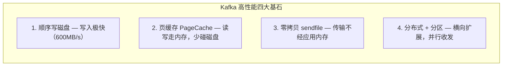

# Kafka进阶

> 第三章核心：从"会用 Kafka"走向"懂 Kafka"。本章不讲部署，只讲**集群如何自治运转**（Controller 选举、Broker 上下线）、**数据如何高效存取**（偏移量定位、日志清理、页缓存、零拷贝、顺序写）以及**下一代架构 KRaft**。这些是面试中"Kafka 为什么这么快/这么稳"的核心答案。

---

## 一、核心概念

### 1.1 Controller 选举（抢座位 + 防脑裂）

**Controller 是什么**
- Controller 是整个 Kafka 集群的"大管家"，借助 ZooKeeper 管理集群元数据：分区 Leader 选举、Broker 上下线感知、Topic 创建/删除、副本迁移等。
- 任意一个 Broker 都能当 Controller，但**任意时刻全集群只有一个** Controller。

**选举机制：抢临时节点（抢座位）**

```
        ZooKeeper
   ┌──────────────────┐
   │  /controller      │  ← 临时节点，谁先创建成功谁就是 Controller
   └──────────────────┘            ▲
            ▲ 创建成功              │ 监听(其余Broker都盯着)
            │                       │
   ┌────────┴───┐   ┌──────────┐   ┌──────────┐
   │ Broker-1   │   │ Broker-2  │   │ Broker-3  │
   │ =Controller│   │ 抢失败    │   │ 抢失败    │
   └────────────┘   └──────────┘   └──────────┘
```

- 每个 Broker 启动时都去 ZK 创建临时节点 `/controller`，ZK 节点不可重复，**只有一个能创建成功** → 它就是 Controller。
- 其余 Broker 监听这个节点。Controller 宕机 → 临时节点因会话超时自动删除 → 监听者收到通知 → 大家抢着重新创建 → 选出新 Controller。
- 💡 这也解释了**为什么必须先启动 ZooKeeper**：选举、元数据存储都靠它。

**脑裂现象（Split-Brain）与 epoch 任期**

抢座位机制有个隐患：Controller 其实没宕机，只是**网络抖动**导致它与 ZK 的会话超时，ZK 删了 `/controller` → 集群选出新 Controller。这时老 Controller 网络恢复，以为自己还在位 → 出现**两个 Controller 同时发号施令**，其他 Broker 不知道听谁的，这就是**脑裂**。

```
老Controller(以为自己还在) ──┐
                            ├──> 其他Broker懵了
新Controller(刚选出)     ──┘
```

- Kafka 用 **Controller Epoch（任期/纪元）** 解决：每次 Controller 换届，epoch 自动 +1。
- Controller 发出的每条控制指令都带 epoch。Broker 收到指令时会比较 epoch：**只认 epoch 更大的指令**。
- 老 Controller 一旦发现有更高 epoch 的新 Controller 存在，就主动退位（清缓存、断开与其他 Broker 的连接、重新加载最新元数据），变回普通 Broker。

> ⚠️ **重点区分（易混淆高频考点）**：这里的 **Controller Epoch** 和第2章副本同步讲的 **Leader Epoch** 是**两个完全不同的东西**，只是名字都叫"epoch"：
> - **Controller Epoch**：Controller 的任期号，解决**集群层面**的脑裂，作用域是整个集群。
> - **Leader Epoch**：分区 Leader 的任期号，解决**副本同步层面**HW 截断导致的数据丢失/不一致，作用域是单个分区。
> 面试被问到"Kafka 的 epoch"时，先问清楚是哪个层面，别答串。

---

### 1.2 Broker 上下线（ZK Watch + Leader 重选举）

**靠 ZK 的 Watch + 临时节点感知**

每个 Broker 上线时：
1. 与 ZK 建立会话（session）
2. 在 `/brokers/ids/` 下创建一个**临时节点**，节点名就是 `broker.id`，里面存该 Broker 的详细信息（host、端口、端点等）

Controller 在 `/brokers/ids` 路径上注册监听器（Watch）：
- 出现新子节点 → 有 Broker **上线**
- 子节点消失 → 有 Broker **下线**（临时节点随会话断开自动删除）

**Controller 注册的监听器一览**

| 监听的 ZK 路径 | 作用 |
|---|---|
| `/brokers/ids` | Broker 上下线感知 |
| `/brokers/topics` | 新 Topic 创建 |
| `/brokers/topics/主题名` | Topic 分区扩容 |
| `/admin/delete_topics` | Topic 删除 |
| `/admin/reassign_partitions` | 分区副本迁移 |
| `/isr_change_notification` | ISR 变动 |
| `/admin/preferred_replica_election` | 最优 Leader 选举 |

**Broker 下线后的关键动作：Leader 重选举（⚠️ 文档遗漏的重点）**

参考资料只说了"Controller 会进行相应处理"，但没讲处理什么。实际最关键的是：

```
Broker-2 宕机
   │
   ▼
Controller 感知到 /brokers/ids/2 消失
   │
   ▼
找出"Leader 在 Broker-2 上"的所有分区
   │
   ▼
对每个分区，从 ISR(同步副本) 列表里挑一个存活的副本 → 设为新 Leader
   │  (若 ISR 全空，可在 unclean.leader.election.enable=true 时冒险从 OSR 选 → 可能丢数据)
   ▼
向集群所有 Broker 广播新的元数据 → 消费者/生产者更新分区路由
```

- 这就是 Broker 宕机后系统能"自愈"的核心。如果 ISR 里没有可用副本，且没开 `unclean.leader.election`，分区就不可用（宁可不可用也不丢数据）。
- 💡 上线时同理：新 Broker 加入，Controller 感知后也会尝试把部分分区副本迁移到新节点，做负载均衡。

---

### 1.3 数据偏移量定位（怎么根据 offset 找到消息）

**分区 → Segment（段）→ 文件**

- 分区是**逻辑**工作单元（保证分区内有序），但不是存储单元。
- 每个分区在磁盘上是一个目录，目录里是一组 **Segment（日志段）** 文件，每个 Segment 含三个文件：

```
某分区目录/                        （文件名 = 该Segment起始offset，20位补0）
  00000000000000000000.log        实际数据
  00000000000000000000.index      偏移量索引（offset -> 物理位置）
  00000000000000000000.timeindex  时间戳索引（timestamp -> offset）
  00000000000000000015.log        下一段，起始offset=15
  00000000000000000015.index
  00000000000000000015.timeindex
```

- 只有**最新的那个 Segment** 可写（活跃段），其他都是只读。
- 文件名就是该段第一条消息的 offset：`00000000000000000004.log` 表示这文件里第一条数据 offset=4。

**稀疏索引（复习）**
- `.index` 文件不是每条消息都记一条，而是**每写入约 4KB 日志**（`log.index.interval.bytes` 默认 4096）记一条 → 这叫**稀疏索引**，省空间。
- 索引项结构：`相对offset(4字节) + 物理position(4字节)`。存"相对 offset"（相对该段首条）只需 4 字节，省空间。

**定位流程（重点，能画出来说明真懂了）**

假设消费者要读 `offset = 18` 的消息：

```
1. 跳跃表选 Segment
   ConcurrentSkipListMap(key=各Segment的起始offset)
        │ 二分/跳跃查找：找 <= 18 的最大起始offset → 命中 00000000000000000015 段
        ▼
2. 二分查 .index
   在 00000000000000000015.index 里二分查找
   找 <= (18-15)=3 的最大相对offset → 得到一个 position（物理偏移）
        ▼
3. 顺序扫描 .log
   从 position 开始，在 .log 文件里**顺序往后读**，
   逐条比对，直到找到 offset=18 的那条
```

- 第1步用**跳跃表**（内存中，快）选 Segment；第2步用**二分查找**（索引文件，因为稀疏所以项不多）；第3步**顺序读**（磁盘顺序读极快，且命中 PageCache 更快）。
- 这套组合拳让 Kafka 在海量数据里按 offset 查询**几乎无延迟**。
- 💡 按**时间戳**查：先用 `.timeindex`（时间戳 → offset），再走上面流程。

---

### 1.4 Topic 删除

参考资料给了三种方式，但参数描述已过时（见勘误）：

**方式一：命令行删除（推荐）**
```bash
bin/kafka-topics.sh --delete --topic test --bootstrap-server broker:9092
```
- 现代版本（2.x+）默认就允许删除，Topic 会被先标记 `marked for deletion`，由后台清理线程异步删除数据。

**方式二：设置删除策略**
- 配合日志清理（见 1.5），到期自动清理。

**方式三：手动删除 ZK 节点（不推荐）**
- 直接 `rmr /brokers/topics/test` 删 ZK 节点 + 手动删各 Broker 数据目录。
- 风险高：元数据和数据可能不一致，仅作了解，生产环境别用。

> ⚠️ 原文说"kafka启动之前在 server.properties 配置 `delete.topic.enable=true` 才能删"——**这个参数从 0.8.2 起默认就是 true，2.x 之后已废弃移除**，现在无需配置，默认允许删除。详见勘误①。

---

### 1.5 日志清理和压缩

**为什么要清理**：Kafka 本质是**传输**数据而非**永久存储**数据，但为平衡生产/消费速率差，会暂存数据。默认保留 **7 天**。

**保留时间参数**（优先级从低到高）：

| 参数 | 说明 | 默认 |
|---|---|---|
| `log.retention.hours` | 小时 | 168（7天）|
| `log.retention.minutes` | 分钟 | - |
| `log.retention.ms` | 毫秒（最高优先级）| - |
| `log.retention.check.interval.ms` | 清理检查周期 | 5分钟 |

**两种清理策略**：`log.cleanup.policy = delete | compact`

#### 策略一：delete（删除）

| 子策略 | 默认 | 规则 |
|---|---|---|
| **基于时间** | 开启 | 以 Segment 中**最大时间戳**为该段时间戳，超期则删整段 |
| **基于大小** | 关闭 | 所有日志总大小超 `log.retention.bytes`（默认-1无穷）时，删最早的 Segment |

⚠️ **重点（留了思考题没答）**：delete 以**整个 Segment 为单位**。
- 一个 Segment 里**部分数据过期、部分没过期**时，这个 Segment **不会被删**。
- 必须等该 Segment 里**最后一条（最新的）消息也过期**了，整段才会被回收。
- 所以你可能会看到"明明有数据过期了但磁盘没掉"，就是这个原因。

#### 策略二：compact（日志压缩）

- 思路：对于**相同 Key** 的消息，**只保留最后一条**（最新值），把旧的同类消息清掉。
- 适合场景：用 Kafka 存"状态快照"而非"事件流"，如存用户最新状态、配置变更。

```
压缩前(按时间)：       压缩后(同key只留最新)：
  K1=V1                   K1=V3   (留最后)
  K2=V1                   K2=V2
  K1=V2                   K3=V1
  K1=V3
  K2=V2
  K3=V1
```

⚠️ **墓碑机制（Tombstone，遗漏）**：如何删除 compact 主题里某个 Key？
- 发一条 `value = null` 的消息（即"墓碑"消息），表示该 Key 要被删除。
- compact 时，墓碑消息也会被保留一小段时间（保证下游消费者能读到这个"删除信号"），之后墓碑和它之前的同 Key 消息一起被清掉。

**其他要点**
- `delete` 和 `compact` 可以**组合**：`log.cleanup.policy=delete,compact`（既按时间清理旧数据，又对保留期内同 Key 压缩）。
- 清理由专门的 **Cleaner 线程** 负责，它把"脏日志"压缩成"干净日志"写入新的 Segment。
- compact 不影响 offset：即使中间消息被压缩掉，offset 依然连续可查（只是被压缩的 offset 对应的消息没了，但偏移量空间保留）。

---

### 1.6 页缓存（Page Cache）

**页缓存是什么**
- 操作系统级别的磁盘缓存：把磁盘数据缓存到内存，把"访问磁盘"变成"访问内存"。
- 进程读文件时，OS 先看数据所在"页"是否在页缓存：命中直接返回；没命中就先从磁盘读到页缓存，再返回给进程。
- 进程写文件时，先把数据写到页缓存（变成**脏页**），OS 在合适时机把脏页刷盘。

**Kafka 怎么用页缓存**

```
生产者 ──> Broker ──> 写到 Page Cache（脏页）──> OS 异步刷盘
                       ▲
                       └── 消费者读时直接命中 Page Cache，无需走磁盘
```

- Kafka **大量依赖页缓存**，这是它高吞吐的基石之一——消息先落页缓存，刷盘交给 OS 调度，消费时大概率直接命中缓存。
- Kafka 提供 `log.flush.interval.messages`、`log.flush.interval.ms` 支持同步/强制刷盘（`fsync`），但**官方不建议这么做**。
- 理由：同步刷盘严重拖性能；**消息可靠性应由多副本机制保障**，而不是靠同步刷盘。
- 💡 对比：**RocketMQ 默认同步刷盘**，Kafka 默认异步刷盘靠副本——这是两者设计哲学差异，面试常对比。

---

### 1.7 零拷贝（Zero Copy）

**零拷贝 ≠ 不拷贝，而是减少不必要的拷贝 + 减少用户态/内核态切换。**

先理解**用户态/内核态**：操作系统分两层权限，内核态能直接操作硬件/页缓存（内部操作），用户态是应用程序运行环境（受限）。Java 想读写文件，就要在两种状态间切换，切换多了性能就掉。

**传统 IO（读磁盘 + 发网络）= 4 次拷贝 + 4 次切换**

```
磁盘 ─DMA─> 内核读缓冲 ─CPU拷贝─> 用户缓冲(Java) ─CPU拷贝─> 内核socket缓冲 ─DMA─> 网卡
          [1]                [2]                 [3]              [4]
   用户态←──切换──→用户态←──切换──→用户态←──切换──→用户态←──切换
```

**sendfile 零拷贝 = 2 次拷贝（数据不进用户空间）+ 2 次切换**

```
磁盘 ─DMA─> 内核读缓冲 ─DMA─> 网卡      (数据全程在内核空间，CPU不参与拷贝)
          [1]            [2]
   用户态←──切换──→用户态←──切换
```

- Kafka **消费者拉取数据** 和 **Follower 同步数据** 都用 `sendfile`（Java 的 `FileChannel.transferTo` 底层就是 sendfile）：数据直接从页缓存经内核传到网卡，**完全不进 Java 应用内存**。

⚠️ **mmap vs sendfile（未区分，易混）**：两者都属于"零拷贝"技术，但 Kafka 用途不同：

| 技术 | 原理 | Kafka 用在哪 |
|---|---|---|
| **sendfile** (`transferTo`) | 数据全程在内核空间，不进用户态 | **读消息**：消费、Follower 同步 |
| **mmap** (内存映射) | 把文件映射到用户空间内存，操作内存=操作文件 | **索引文件** `.index` 读写、元数据访问 |

> 简记：**读数据用 sendfile，玩索引用 mmap**。

---

### 1.8 顺序写日志（Sequential Write）

**为什么顺序写这么快**

磁盘是机械结构（哪怕是 SSD，顺序写也远快于随机写），随机写要频繁寻道定位，顺序写只管往后追加。

- 顺序写：约 **600 MB/s**
- 随机写：约 **100 KB/s**
- 差距高达 **6000 倍**！

**Kafka 怎么做**
- Kafka 写消息是**追加到 .log 文件末尾**，不需要定位到文件中间某个位置插入——省掉了磁盘寻址/定位的开销。
- 写的时候先写入 `ByteBuffer`，缓冲区满了再批量顺序刷入文件。

> ⚠️ 原文写"Kafka 底层采用的是 `FileChannel.wrtieTo` 进行数据的写入"——API 名称写错（且拼写错误 `wrtieTo`）。实际：Kafka 写消息用 `ByteBuffer` + `FileChannel.write()` **顺序追加**；`FileChannel.transferTo`（即 sendfile）是**读**用的零拷贝接口。详见勘误②。

**Kafka 高性能四大基石（综合，面试必背）**



被问"Kafka 为什么这么快"，照这四条答，外加一句"批量发送压缩网络开销"，基本满分。

---

### 1.9 KRaft 模式（去 ZooKeeper 化）

**背景：为什么要弃用 ZooKeeper**
- Kafka 2.8 之前**强依赖 ZK** 管理元数据，ZK 抖动会直接拖累 Kafka 性能。
- ZK 单集群管理元数据的有效上限是**数万分区**，扩展到百万分区时 ZK 成为瓶颈。
- 2.8 起 Kafka 推出 **KRaft（Kafka Raft）模式**，逐步去 ZK；3.x 持续完善。
- ⚠️ **Kafka 4.0 已正式移除 ZooKeeper 支持**（2025 年发布），KRaft 成为唯一元数据管理方式。原文说"官方预计 4.0 移除，拭目以待"——如今已是现实。

**KRaft 怎么工作**
- 不再用外部 ZK，而是用 Kafka 自己的**内部 Raft 仲裁（Controller Quorum）**管理元数据。
- 元数据以**日志形式**存在一个内部 Topic 中，基于**事件驱动**传播，性能更好，还支持元数据快照。
- 集群中一部分节点配置为 **Controller**（`process.roles=controller`），它们之间用 **Raft 协议**选出 **Active Controller**（即"主 Controller"）。

**KRaft 的优势**

| 优势 | 说明 |
|---|---|
| **部署更简单** | 只装一个软件，不用再装 ZK，边缘小设备也能跑 |
| **恢复更快** | 故障恢复比 ZK 快一个数量级，支持单集群**数百万分区** |
| **元数据传播更高效** | 基于日志、事件驱动，支持快照 |
| **不再受 ZK 读写瓶颈** | 集群扩展更自由 |
| **Controller 可针对性加强** | 哪些节点当 Controller 由配置决定，可给这些节点加强配置 |

> ⚠️ 原文说"controller 不再动态选举，而是由配置文件规定"——**表述误导，需修正**：配置文件规定的是"**哪些节点作为 Controller 候选**"（`process.roles`），但 Active Controller（真正主控）**仍然是在这些候选节点间通过 Raft 协议选举产生**的，并非不选举。详见勘误③。

**ZK 模式 vs KRaft 模式对比**

| 维度 | ZK 模式 | KRaft 模式 |
|---|---|---|
| 元数据存储 | 外部 ZooKeeper | Kafka 内部 Raft 日志 |
| Controller 选举 | 抢 `/controller` 临时节点 | Raft 协议从候选节点选 |
| 分区上限 | 数万 | 数百万 |
| 恢复速度 | 慢 | 快一个数量级 |
| 运维 | 要维护两套系统 | 一套 Kafka |
| 版本 | 2.8 前 | 2.8+，4.0 起唯一方式 |

---

## 二、常见面试题

1. **Controller 是什么？如何选举？脑裂怎么解决？**
   - Controller 是集群大管家。ZK 模式下靠抢 `/controller` 临时节点选举；脑裂用 Controller Epoch（任期递增，只认高 epoch 指令）解决。

2. **Controller Epoch 和 Leader Epoch 有什么区别？（易混）**
   - Controller Epoch 管集群层面脑裂；Leader Epoch 管分区副本同步的 HW 截断丢数据问题。作用域不同，名字像但不是一回事。

3. **一个 Broker 宕机会发生什么？**
   - ZK 临时节点消失 → Controller 感知 → 对该 Broker 上担任 Leader 的分区，从 ISR 中选新 Leader → 广播新元数据。若 ISR 全空且没开 unclean 选举，分区不可用。

4. **消费者根据 offset 怎么定位到具体消息？**
   - 跳跃表选 Segment → 在 .index 二分找物理位置 → 在 .log 顺序扫描到目标 offset。稀疏索引 + 二分 + 顺序读的组合。

5. **Kafka 日志删除策略有哪些？一个 Segment 部分数据过期会怎样？**
   - delete（基于时间/基于大小）+ compact。部分过期不删，整段都过期才删整个 Segment。

6. **compact 是什么？怎么删除 compact 主题里的某个 Key？**
   - 同 Key 只留最新。删 Key 发一条 value=null 的墓碑消息，compact 时清理。

7. **页缓存对 Kafka 的意义？为什么不建议同步刷盘？**
   - 页缓存让读写尽量走内存。同步刷盘拖性能，可靠性应由多副本保障（对比 RocketMQ 默认同步刷盘）。

8. **零拷贝是什么？Kafka 哪里用到了？**
   - 减少拷贝和用户态/内核态切换。读消息用 sendfile（transferTo），索引用 mmap。传统 IO 4 次拷贝，sendfile 2 次。

9. **Kafka 为什么这么快？（综合题）**
   - 顺序写磁盘 + 页缓存 + 零拷贝 + 分布式分区并行 + 批量发送压缩。

10. **KRaft 模式是什么？为什么要弃用 ZooKeeper？**
    - KRaft 用 Kafka 内部 Raft 替代 ZK 管理元数据。去 ZK 后部署更简单、恢复更快、支持百万分区、元数据传播更高效。4.0 已彻底移除 ZK。

---

## 三、资料勘误与重点提醒

> 以下为阅读参考资料第3章时识别出的**表述不准/遗漏**，此处集中修正与补充。

### 3.1 文档表述需修正之处

**① `delete.topic.enable` 参数描述过时**
- 文档称"kafka 启动前需在 server.properties 配置 `delete.topic.enable=true` 才能删 Topic"
- ⚠️ 实际：该参数从 **Kafka 0.8.2 起默认就是 true**，**2.x 之后已废弃移除**。现代版本无需配置，`--delete` 命令默认即生效。文档描述停留在旧版本，面试别答"要先开这个参数"。

**② "FileChannel.wrtieTo 进行数据写入" API 写错**
- 文档原文（3.9 顺写日志）：`Kafka底层采用的是FileChannel.wrtieTo进行数据的写入`
- ⚠️ 三处问题：①API 名拼写错误（`wrtieTo`）；②`FileChannel` 没有 `writeTo` 方法，零拷贝的写/读方法是 `transferTo`；③**写入**用 `ByteBuffer` + `FileChannel.write()` 顺序追加，**`transferTo`(sendfile) 是"读"端零拷贝用的**（消费/Follower 同步），不是写入用的。文档把"写日志"和"零拷贝读"的 API 搞混了。已在正文 1.7、1.8 修正。

**③ KRaft "controller 不再动态选举，由配置文件规定"表述误导**
- 文档原文（3.12.1）：`controller不再动态选举，而是由配置文件规定`
- ⚠️ 实际：配置文件（`process.roles=controller`）规定的是**哪些节点作为 Controller 候选**，但真正的主控 **Active Controller 仍由 Raft 协议在这些候选节点间选举产生**，并非"不选举"。正确理解：从"抢 ZK 临时节点"改为"Raft 选举"，选举方式变了，但仍然要选。

### 3.2 文档遗漏的重点（面试高频，务必补充）

**④ Controller Epoch ≠ Leader Epoch（极易混淆）**

见正文 1.1 末尾。两者名字都叫 epoch 但作用域完全不同：Controller Epoch 防集群脑裂，Leader Epoch 防分区副本 HW 截断丢数据。这是面试高频的"挖坑题"，务必区分。

**⑤ Broker 下线后的 Leader 重选举机制（文档只字未提）**

第3.2节只说 Controller 监听到 Broker 下线"会进行相应处理"，但没讲最关键的：**对该 Broker 上担任 Leader 的所有分区触发重新选举**，从 ISR 选新 Leader 并广播。这是 Kafka 高可用的核心自愈动作。已在正文 1.2 补全。

**⑥ compact 的墓碑机制（文档遗漏）**

第3.5节只说"相同 Key 保留最后一条"，但没讲**如何删除一个 Key**（发 value=null 的墓碑消息）。compact 主题的删除全靠墓碑，是必考点。已在正文 1.5 补充。

**⑦ delete 是按整个 Segment 删除（思考题未答）**

参考资料抛出"一个 segment 部分过期怎么处理"的思考题但没给答案。答案：**部分过期不删，整段全过期才删整段**。这解释了"数据过期但磁盘没释放"的现象。已在正文 1.5 补全。

**⑧ 零拷贝的 sendfile vs mmap 区分（文档混淆）**

第3.8节通篇讲用户态/内核态切换，但没说清 Kafka 实际用哪个系统调用、读写各用哪个。补充：**读消息用 sendfile（transferTo），索引文件用 mmap**。两者都叫零拷贝但实现和用途不同。已在正文 1.7 区分。

---

> 📌 本章重在"原理 + 性能设计"。建议把"Kafka 为什么这么快"作为主线，把顺序写、页缓存、零拷贝、分布式串成一条；把 Controller/ISR/副本作为"可靠性"主线，两条线对照理解。
