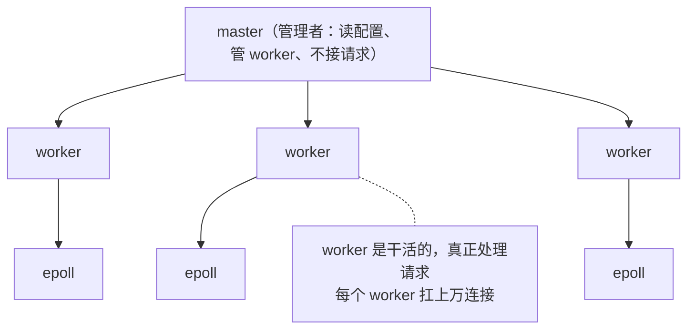
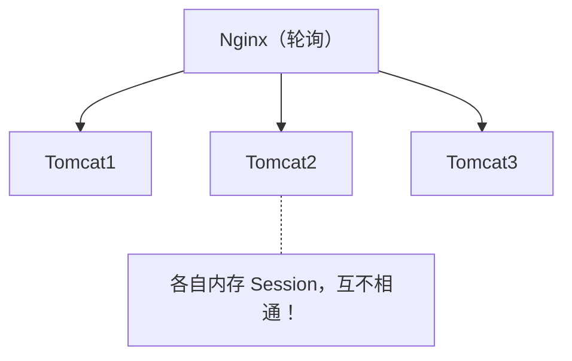
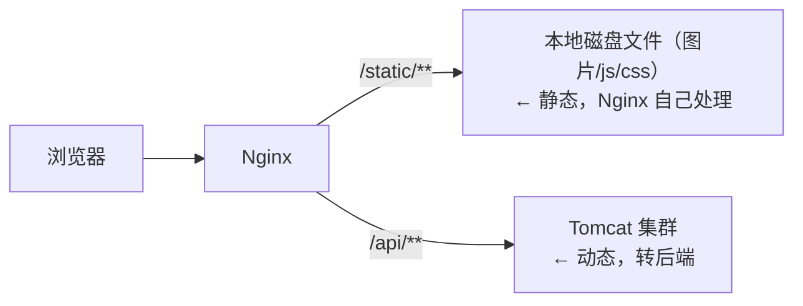

# Nginx

> Nginx 是 Java 后端面试高频考点。作为后端工程师，几乎不会直接用 Nginx 写业务，但生产环境里它几乎一定挡在你的应用前面。本章精简讲清"它是什么、为什么快、能干嘛、怎么配"。

---

## 一、核心概念

### 1.1 Nginx 是什么

- 一句话：**高性能的 HTTP 服务器 + 反向代理服务器**，C 语言开发，以"轻量、能扛高并发"著称。
- 通俗理解：放在你的应用服务器（Tomcat / SpringBoot）前面的"门卫 / 调度员"，所有外部请求先到它这里。
- 作者：俄罗斯 Igor Sysoev，2004 年开源。
- 官网：https://nginx.org/

**四大核心能力**

| 能力 | 通俗理解 | 典型场景 |
|---|---|---|
| **HTTP 服务器** | 直接把静态文件返回给浏览器 | 网站首页、图片、js/css 由 Nginx 直接返回 |
| **反向代理** | 用户以为在访问 Nginx，它偷偷转发给后端 | `www.xxx.com` → Nginx → Tomcat:8080 |
| **负载均衡** | 后端有多台服务器，Nginx 决定这次给谁 | 3 台 Tomcat，Nginx 轮流分发 |
| **动静分离** | 静态资源自己处理，动态请求转后端 | 图片/js 走 Nginx，`/api/**` 转后端 |

---

### 1.2 正向代理 vs 反向代理（高频易混）

| | 正向代理 | 反向代理 |
|---|---|---|
| 代理谁 | 代理**客户端** | 代理**服务端** |
| 客户端知不知道目标 | 知道 | 不知道（以为 Nginx 就是目标）|
| 作用 | 替客户端出去访问 | 替服务端接收并转发 |
| 例子 | VPN、公司翻墙 | Nginx、负载均衡器 |

- **正向代理**：客户端的小弟，替你出去拿东西。
- **反向代理**：服务端的前台，对外只露它一个，后面藏多少台机器用户不知道。

> 💡 记忆：**"正"是替客户端正大光明出去，"反"是替服务端藏在后面"**。Nginx 的核心身份是**反向代理**。

---

### 1.3 Nginx 为什么这么快（必答）

**1. 事件驱动 + 异步非阻塞（最关键）**
- 用 Linux 的 `epoll`（I/O 多路复用），**一个 worker 进程能同时处理几万个连接**。
- 某个连接慢（比如等数据库）不会卡住其他连接，worker 会去处理别的就绪连接。

> **epoll 通俗解释（服务员比喻）**：服务员要管很多桌客人（每桌=一个网络连接）。
> - **BIO**：一桌配一个服务员盯着，客人不点菜就傻站 → 传统 Tomcat 模式，一个请求一个线程，连接多线程就爆。
> - **select/poll**：一个服务员轮询挨桌问"要点吗"，1024 桌哪怕只有 1 桌有事也得全问一遍 → 傻且累，还有数量上限。
> - **epoll**：给每桌装呼叫器，谁有事按铃，服务员只去响铃的桌 → **事件驱动，只管就绪的**，无上限。
>
> 对比 select/poll：①内核自己维护就绪列表，只返回有事件的连接，不全扫；②连接只注册一次，不用每次重复传；③无数量上限。**Redis / Netty 的高并发同样建立在此之上。**

**2. master-worker 架构**



- master 不接请求，只负责管理、读配置、重启。
- worker 之间相互独立，各自处理自己的连接。

**3. 轻量级**：C 语言写的，内存占用小，启动快，不像 Tomcat 那么重。

**4. 无锁设计**：worker 之间不共享连接，减少锁竞争。

**5. 内存池**：自己管理内存分配，减少内存碎片和系统调用开销。

---

### 1.4 怎么控制 worker 进程数量（面试延伸）

**核心指令**：`worker_processes`，写在 `nginx.conf` 顶层（main 上下文，不在 http/events 里）。

```nginx
worker_processes auto;       # 推荐：自动等于 CPU 核心数
# 或写死：worker_processes 4;
```

| 取值 | 说明 |
|---|---|
| `auto` | 自动等于 **CPU 核心数**（推荐）|
| 数字 | 直接指定数量，如 `4` |
| 不配置 | 默认 `1` |

**为什么 `auto` 最优？**

每个 worker 是**单进程单线程 + epoll 异步非阻塞**，一个 worker 就能榨干一个 CPU 核：

> **worker 数 = CPU 核心数** 是最优解，多了反而因进程切换浪费，少了浪费多核。

- 4 核机器 -> `worker_processes 4` 或 `auto`
- ⚠️ 不是越多越好！配 16 个 worker 在 4 核机器上，频繁进程切换反而拖性能。

**配套：控制每个 worker 的连接数** `worker_connections`

worker 数量管"几个进程"，**每个进程能接多少连接**是另一个指令（在 `events` 块）：

```nginx
events {
    worker_connections 1024;   # 每个 worker 最多 1024 个连接
}
```

**最大并发连接数怎么算（面试考点）**

```
最大并发 = worker_processes × worker_connections
```

⚠️ **反向代理有个坑**：
- **纯静态 HTTP 服务器**：1 个客户端 = 1 个连接 -> 并发 = `worker数 × worker_connections`
- **反向代理**：1 个客户端要占 **2 个连接**（一个对客户端，一个对后端 Tomcat）-> 并发 = `worker数 × worker_connections / 2`

> 💡 面试问"Nginx 最大并发多少"，先问清楚是静态服务器还是反向代理，答案差一倍。

**进阶：CPU 亲和性 `worker_cpu_affinity`**

光设数量还不够，可把每个 worker **绑定到固定 CPU 核**，避免它在核心间漂移（漂移导致 CPU 缓存失效，性能下降）：

```nginx
worker_processes 4;
worker_cpu_affinity 0001 0010 0100 1000;   # 4核：worker0绑核0，worker1绑核1...
```

**完整示例**

```nginx
worker_processes auto;            # worker数 = CPU核数
worker_cpu_affinity auto;         # 自动绑定CPU亲和性（新版本支持）

events {
    worker_connections 1024;      # 每个worker最大连接数
}
```

> 💡 一句话总结：`worker_processes` 管进程数（推荐 `auto`），`worker_connections` 管单进程连接数，两者相乘（反向代理再除 2）= Nginx 最大并发能力。

---

### 1.5 负载均衡策略（常考）

假设后端有 3 台 Tomcat，Nginx 怎么决定这次请求给谁：

| 策略 | 说明 | 配置关键字 |
|---|---|---|
| **轮询**（默认）| 按顺序 A→B→C→A→B→C | 无需额外配置 |
| **权重** | 配置 weight，强机器多分 | `weight=3` |
| **ip_hash** | 同一 IP 固定访问同一台 | `ip_hash;` |
| **fair**（第三方）| 按后端响应速度智能分配 | `fair;` |
| **url_hash**（第三方）| 相同 URL 固定到同一台 | `hash $request_uri` |

**配置示例**（核心：`upstream` 定义后端组 + `proxy_pass` 引用，策略由 upstream 内指令决定）

```nginx
http {
    upstream backend {              # 定义后端服务器组
        server 192.168.1.11:8080;   # 默认轮询：11->12->13->11...
        server 192.168.1.12:8080;
        server 192.168.1.13:8080;
    }

    server {
        listen 80;
        server_name www.example.com;
        location / {
            proxy_pass http://backend;   # 引用 upstream 组做转发
        }
    }
}
```

各策略只需改 `upstream` 内部：

```nginx
# 1) 权重：按 3:2:1 比例分发
upstream backend {
    server 192.168.1.11:8080 weight=3;
    server 192.168.1.12:8080 weight=2;
    server 192.168.1.13:8080 weight=1;
}

# 2) ip_hash：同一 IP 固定打同一台（解决未上 Redis 的 Session 问题）
upstream backend {
    ip_hash;
    server 192.168.1.11:8080;
    server 192.168.1.12:8080;
    server 192.168.1.13:8080;
}

# 3) url_hash：相同 URL 固定打同一台（提升后端本地缓存命中）
upstream backend {
    hash $request_uri;
    server 192.168.1.11:8080;
    server 192.168.1.12:8080;
    server 192.168.1.13:8080;
}
```

**server 指令常用附加参数（实战必备）**

```nginx
upstream backend {
    server 192.168.1.11:8080 weight=3 max_fails=3 fail_timeout=30s;
    server 192.168.1.12:8080 max_fails=3 fail_timeout=30s;
    server 192.168.1.13:8080 backup;      # 备用：其他全挂才启用
    server 192.168.1.14:8080 down;        # 下线：暂时不参与
}
```

| 参数 | 作用 |
|---|---|
| `weight=N` | 权重 |
| `max_fails=N` | 失败 N 次判定该机器故障 |
| `fail_timeout=T` | 故障后 T 秒内不再分发请求给它 |
| `backup` | 备用机，正常机器全挂才启用 |
| `down` | 标记下线，不参与负载 |

> 💡 **实战最常用组合**：权重 + `max_fails`/`fail_timeout` 做自动健康检查（剔除故障机器）+ `backup` 留备用机。

**重点理解 ip_hash 的意义**：
- 解决 **Session 共享问题**：如果后端用 Tomcat 内存 Session（没上 Redis），同一用户的请求必须打到同一台机器，否则登录态丢失。
- 代价：一旦某台机器挂了，分到它的用户全断；负载不均。
- 💡 现代架构更推荐：**Session 放 Redis**，不用 ip_hash，Nginx 纯轮询即可，更灵活。

**为什么 ip_hash 能解决未上 Redis 的 Session 问题**

先理清 Session 存哪：HTTP 无状态，**Session** 是服务器"记住你登录了"的机制。Tomcat 默认把 Session 存在**本机内存**里，登录后返回 sessionId 给你，下次请求带 Cookie 回来，服务器拿 sessionId 在内存里查。

问题出在多台 Tomcat 各存各的（默认轮询）：



翻车场景：
1. 你登录，请求打到 **Tomcat1**，Session 存进 Tomcat1 内存，返回 sessionId 给你
2. 你点下一页，请求被轮询打到 **Tomcat2**，你带着 sessionId
3. 但 Tomcat2 内存里**没有这个 Session** -> 查不到 -> 认为你没登录 -> 踢回登录页
4. 用户感受：反复登录、登录态丢失

ip_hash 怎么解决：按客户端 IP 哈希，**把同一用户固定路由到同一台 Tomcat**（如永远 Tomcat1）。Session 存在 Tomcat1 内存，后续请求都还打到 Tomcat1 -> Session 一直能查到 -> 登录态保持。

> 💡 一句话：ip_hash 不是"共享"Session，而是"躲避"了不共享问题--让同一用户永远粘在同一台机器上，那台机器的本地 Session 就够用。

| 方案 | Session 存哪 | 要不要 ip_hash | 优缺点 |
|---|---|---|---|
| 各 Tomcat 本机内存 | 不共享 | **需要** | 简单但机器挂用户断、负载不均 |
| Redis | 共享 | 不需要 | 灵活均衡，但多一个依赖 |

所以：没上 Redis 才需要 ip_hash 兜底；上了 Redis 共享后，纯轮询更优，ip_hash 的缺点反而成累赘。

---

### 1.6 核心配置速览（看得懂即可）

Nginx 配置文件 `nginx.conf` 的层级结构：

```
events {        # worker 连接数配置
    worker_connections  1024;
}

http {          # HTTP 服务器配置
    upstream backend {        # 负载均衡：定义后端服务器组
        server 192.168.1.11:8080 weight=3;
        server 192.168.1.12:8080;
    }

    server {                 # 虚拟主机：一个域名/端口一套配置
        listen 80;
        server_name www.example.com;

        location / {         # 路由规则：匹配 URL 路径
            proxy_pass http://backend;   # 反向代理到 upstream
        }

        location /static/ {  # 动静分离：静态资源自己处理
            root /data/www;
        }
    }
}
```

**层级关系**：`http` → `server`（虚拟主机）→ `location`（URL 路由）。

**关键指令**：
- `proxy_pass`：反向代理，把请求转发给后端
- `root` / `alias`：静态资源根目录
- `upstream`：定义后端服务器组，配合 `proxy_pass` 做负载均衡
- `listen` / `server_name`：监听端口 / 域名

---

### 1.7 动静分离（典型架构）



- **好处**：静态资源由 Nginx 直接返回（它擅长干这个，快），Tomcat 只处理动态业务，减轻后端压力。
- **本质**：让专业的工具干专业的事--Nginx 扛并发和静态，Tomcat 跑业务。

---

### 1.8 Nginx 与 Tomcat 的关系（Java 面试常问）

| | Nginx | Tomcat |
|---|---|---|
| 角色 | HTTP 服务器 / 反向代理 | 应用服务器 |
| 擅长 | 静态资源、高并发转发、负载均衡 | 跑 Java Web 应用（Servlet/SpringBoot）|
| 重量 | 轻 | 重 |
| 语言 | C | Java |

- 两者是**配合关系**，不是替代关系。
- 生产典型架构：`用户 → Nginx → 多台 Tomcat`，Nginx 做反向代理 + 负载均衡 + 动静分离。

---

### 1.9 常用命令

```bash
nginx              # 启动
nginx -s stop      # 快速停止
nginx -s quit      # 优雅停止（处理完当前请求再停）
nginx -s reload    # 重新加载配置（改配置后不重启，热加载）
nginx -t           # 检查配置文件语法是否正确
nginx -v           # 查看版本
```

> 💡 `nginx -s reload` 是热加载，改完配置不停机就能生效，这是生产常用操作。改配置前先用 `nginx -t` 检查语法。

---

## 二、常见面试题

1. **Nginx 是什么？有什么用？**
   - 高性能 HTTP 服务器 + 反向代理服务器。四大用途：HTTP 服务器、反向代理、负载均衡、动静分离。

2. **正向代理和反向代理的区别？**
   - 正向代理客户端（替你出去访问），反向代理服务端（替它接收转发）。Nginx 主要是反向代理。

3. **Nginx 为什么能扛高并发？**
   - 事件驱动 + epoll 异步非阻塞（单 worker 扛上万连接）+ master-worker 架构 + 无锁设计 + C 语言轻量。

4. **Nginx 负载均衡有哪些策略？**
   - 轮询（默认）、权重、ip_hash、fair、url_hash。重点掌握 ip_hash 解决 Session 的问题及其局限。

5. **ip_hash 解决什么问题？有什么缺点？**
   - 解决后端未用 Redis 共享 Session 时，同一用户必须打到同一台机器的问题。缺点：机器宕机用户断、负载不均。现代更推荐 Session 入 Redis + 纯轮询。

6. **Nginx 和 Tomcat 的区别？生产环境怎么配合？**
   - Nginx 轻、擅长静态和高并发转发；Tomcat 重、擅长跑 Java 应用。生产架构：用户 → Nginx → 多台 Tomcat，Nginx 做反向代理 + 负载均衡 + 动静分离。

7. **什么是动静分离？**
   - 静态资源（图片/js/css）由 Nginx 直接返回，动态请求转后端。减轻 Tomcat 压力，各司其职。

8. **改了 Nginx 配置如何不重启生效？**
   - `nginx -t` 检查语法 → `nginx -s reload` 热加载，不停机生效。

---

> 📌 Nginx 对 Java 后端而言"不写但必懂"。重点掌握：反向代理概念、为什么快（epoll）、负载均衡策略（尤其 ip_hash）、动静分离、与 Tomcat 的配合架构。
