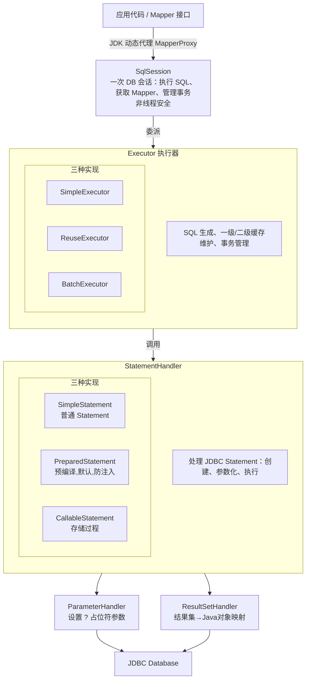
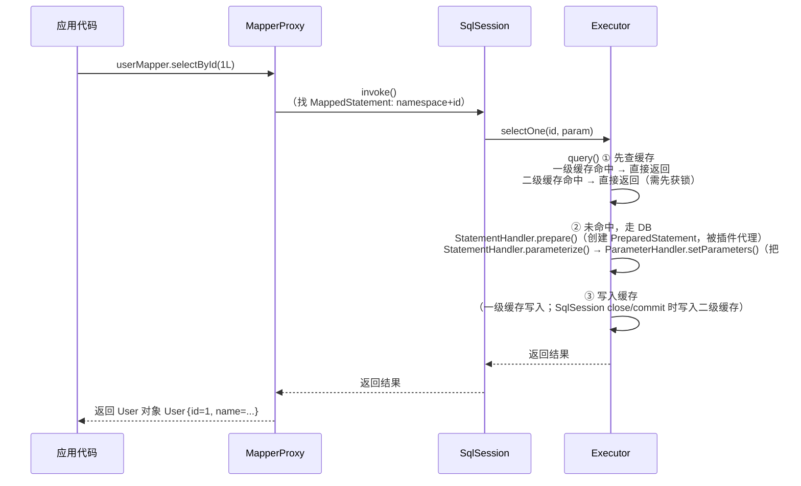
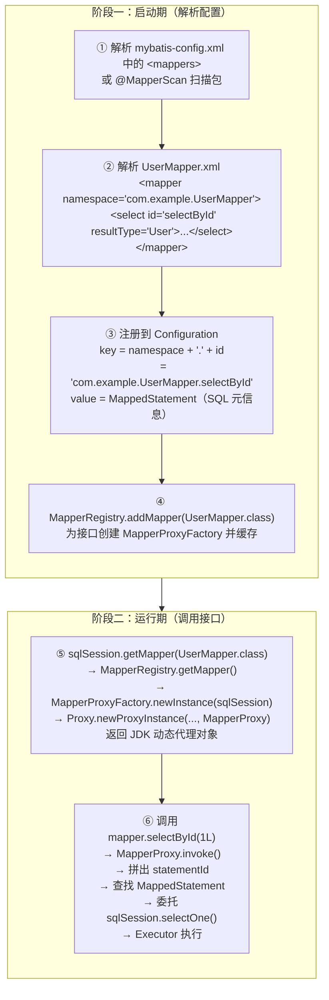
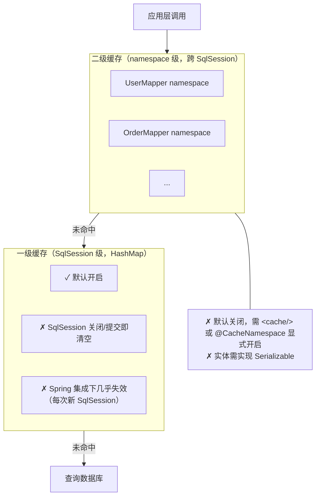
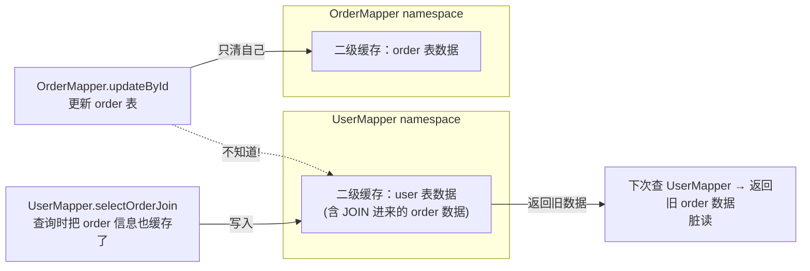
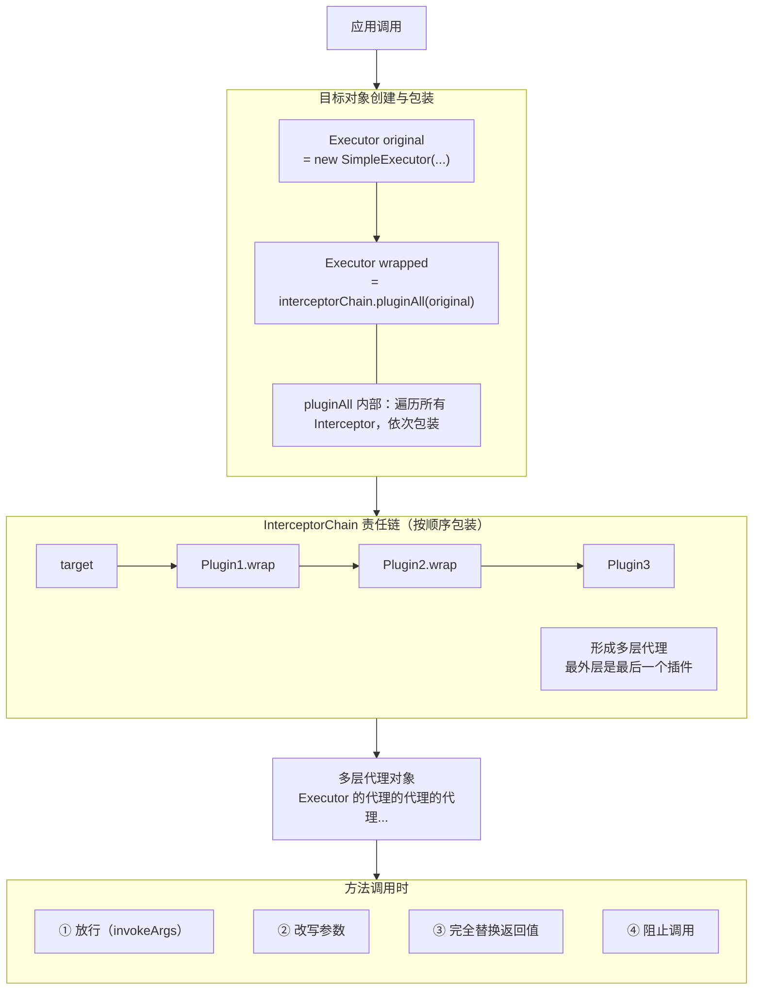
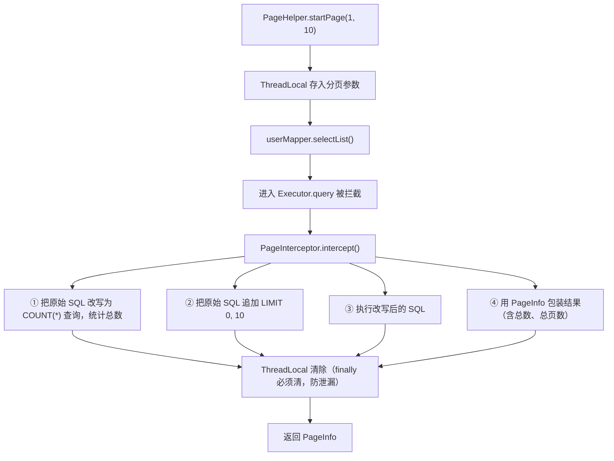
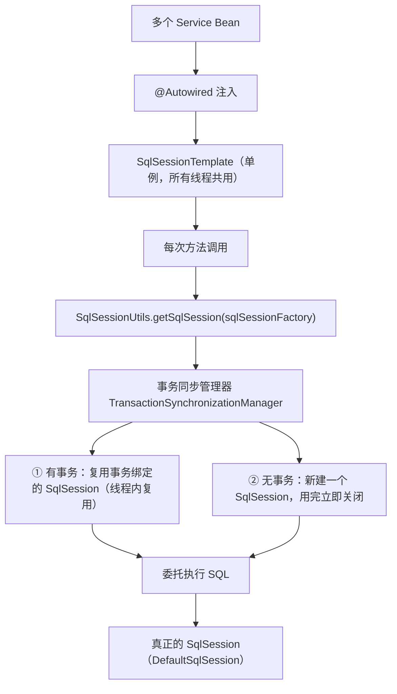
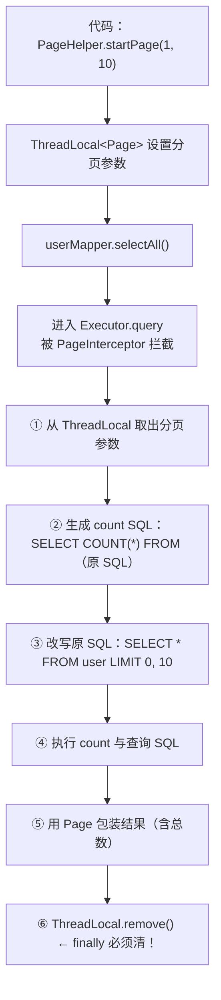

# MyBatis

> 📌 **一句话理解**：MyBatis 是半自动 ORM 框架——它把 SQL 与 Java 对象之间的映射帮你做掉，但 SQL 仍由你自己写，灵活可控、优化空间大。

---

## 核心概念

### 一、MyBatis 是什么 & 与 JDBC/Hibernate 对比 ⭐⭐

#### 1.1 一句话定位

- **MyBatis 是一款半自动的 ORM（对象关系映射）框架**。
- "半自动"的含义：**对象 ↔ SQL 的映射**它帮你做，但 **SQL 本身仍由你手写**。
- 而全自动 ORM（如 Hibernate/JPA）连 SQL 都帮你生成，写一句 `em.persist(user)` 它自己拼出 INSERT 语句。

> 🎯 **类比理解**：
> - **JDBC**：徒手揉面，从和面到下锅都得自己干（加载驱动、拿连接、Statement、设参数、执行、关资源、ResultSet 一个个 get）。
> - **Hibernate**：自动面条机，往里倒面和水，机器自己出面条——省事，但想加点花式形状很费劲（SQL 不可控）。
> - **MyBatis**：半自动压面机——面条怎么切、加什么料（SQL）你自己决定，机器负责压制成型（参数填充、结果映射、资源管理）。

#### 1.2 MyBatis 相对 JDBC 解决了什么

JDBC 写一条查询，样板代码一大坨：

```java
// 传统 JDBC
Connection conn = null;
PreparedStatement ps = null;
ResultSet rs = null;
try {
    Class.forName("com.mysql.cj.jdbc.Driver");
    conn = DriverManager.getConnection(url, user, pwd);
    ps = conn.prepareStatement("SELECT id, name FROM user WHERE id = ?");
    ps.setLong(1, 1L);
    rs = ps.executeQuery();
    while (rs.next()) {
        User u = new User();
        u.setId(rs.getLong("id"));
        u.setName(rs.getString("name"));
        // 一堆字段逐个 set...
    }
} finally {
    // 倒着关，逐个 try-catch
    if (rs != null) rs.close();
    if (ps != null) ps.close();
    if (conn != null) conn.close();
}
```

MyBatis 同样的事：

```xml
<select id="selectById" parameterType="long" resultType="User">
    SELECT id, name FROM user WHERE id = #{id}
</select>
```

```java
User u = userMapper.selectById(1L);
```

**MyBatis 替你做了**：
1. 消除样板代码：加载驱动、获取连接、关闭资源全部封装
2. 参数自动设置：`#{id}` 自动映射为 `?` 并调用 `PreparedStatement.setXxx`
3. 结果集自动映射：`ResultSet` 的列直接映射到 Java 对象字段（按列名/驼峰）
4. SQL 与代码分离：SQL 写在 XML，Java 代码只调接口
5. 动态 SQL：条件拼接不再用一堆 `if` 字符串累加

#### 1.3 三者对比表

| 维度 | JDBC | MyBatis | Hibernate/JPA |
|---|---|---|---|
| 自动化程度 | 全手工 | **半自动**（SQL 自己写） | 全自动（SQL 自动生成） |
| SQL 控制力 | 完全可控 | **完全可控** | 较弱（HQL/Criteria 抽象走样） |
| 样板代码 | 极多 | 少（接口+XML） | 极少（一个注解/方法） |
| 学习曲线 | 低（基础 API） | 中 | 高（HQL、Session、缓存、级联策略复杂） |
| 性能优化空间 | 高 | **高**（SQL 自己写自己调） | 中（受自动 SQL 限制） |
| DB 移植性 | 高（标准 API） | 中（SQL 可能方言相关） | 高（方言自动适配） |
| 适合场景 | 学习底层、特殊定制 | **业务复杂、SQL 性能敏感** | 业务简单、模型规整、跨库需求 |
| 国内主流程度 | 教学用 | **绝对主流** | 早期流行，现已式微 |

> 💡 **国内现状**：互联网公司普遍选 MyBatis（含 MyBatis-Plus），原因就是 SQL 可控、性能可调、贴近业务复杂查询；Hibernate 在传统行业、Spring Data JPA 场景仍有一席之地。

---

### 二、MyBatis 核心组件与架构 ⭐⭐⭐

#### 2.1 核心组件总览（架构图）



#### 2.2 各组件职责速记

| 组件 | 类比 | 职责 |
|---|---|---|
| `SqlSessionFactoryBuilder` | 建厂工程师 | 解析配置，建完 `SqlSessionFactory` 即丢弃（局部变量） |
| `SqlSessionFactory` | 工厂 | 重量级、单例，生产 `SqlSession` |
| `SqlSession` | 一次开工的工单 | 一次 DB 会话，执行 SQL、获取 Mapper、管事务；**非线程安全** |
| `Executor` | 车间主任 | 核心执行器：SQL 生成、缓存维护、事务管理 |
| `StatementHandler` | 操作车床的工人 | 处理 JDBC `Statement`，包括创建、参数化、执行 |
| `ParameterHandler` | 给车床上料的助手 | 把 Java 参数填到 `?` 占位符 |
| `ResultSetHandler` | 检验员 | 把 `ResultSet` 行映射到 Java 对象 |
| `Configuration` | 工厂的图纸 | 全局配置（解析自 `mybatis-config.xml` 与 Mapper XML），贯穿整个生命周期 |
| `MappedStatement` | 一份工艺卡 | 一条 SQL 的完整定义（id、SQL、参数类型、结果映射、缓存配置等） |

> 🎯 **记忆顺序**：Builder 建工厂 → 工厂生产工单 → 工单找车间主任 → 主任派工人 → 工人配助手（参数）+ 检验员（结果）。每一层都是"委托"关系，下一层只负责自己的事。

#### 2.3 Executor 的三种实现 ⭐⭐

| 类型 | 行为 | 适用场景 |
|---|---|---|
| `SimpleExecutor` | **默认**。每次执行都新建一个 Statement，用完立即关闭 | 通用场景 |
| `ReuseExecutor` | 缓存 `Statement`（按 SQL 字符串做 key），相同 SQL 复用 | 同一 SqlSession 内大量重复 SQL |
| `BatchExecutor` | 批量操作：`addBatch()` 累积，统一 `executeBatch()` | 批量插入/更新（性能远高于循环单条） |

⚠️ **常被忽略的细节**：`BatchExecutor` 在 JDBC 层做批处理，**需要数据库驱动支持 `rewriteBatchedStatements=true`（MySQL）才真正合并 SQL**，否则仍是逐条发送。MySQL 配置：

```properties
jdbc:mysql://host/db?rewriteBatchedStatements=true
```

另外，Spring 集成下 `SqlSessionTemplate` 默认用的是 `SimpleExecutor`；要批量操作建议直接用 `SqlSessionFactory.openSession(ExecutorType.BATCH)` 或 `@Batch` 注解（MyBatis-Plus）。

#### 2.4 一次查询的完整执行流程（时序图）⭐⭐⭐



**关键点提炼**：

1. **Mapper 接口调用本质是 JDK 动态代理**：你调的是 `MapperProxy`，它解析方法名找到对应 `MappedStatement`，委托 `SqlSession` 执行。
2. **缓存先于 DB**：`Executor.query` 先查一级缓存（SqlSession 级），命中即返回，根本不走 DB。开启二级缓存后，再先查二级缓存（namespace 级）。
3. **三大 Handler 各司其职**：`StatementHandler` 负责创建并执行 `Statement`，`ParameterHandler` 填参数，`ResultSetHandler` 转结果。
4. **四大对象全部可被插件拦截**：这就是 MyBatis 插件机制的核心（见第七章）。

---

### 三、Mapper 接口绑定原理 ⭐⭐⭐（高频，重点讲透）

#### 3.1 问题：写个接口，没有实现类，凭什么能用？

```java
public interface UserMapper {
    User selectById(Long id);
}

// 直接用，没有任何 new UserMapper()
UserMapper mapper = sqlSession.getMapper(UserMapper.class);
User u = mapper.selectById(1L);
```

答案：**JDK 动态代理**。MyBatis 在背后生成了一个代理对象 `MapperProxy`，它实现了 `UserMapper` 接口，所有方法调用都被转发到 `InvocationHandler.invoke()`。

#### 3.2 绑定流程（图）



#### 3.3 接口与 XML 的绑定规则（最核心一句话）

> **接口的全限定名 = XML 的 namespace，方法名 = SQL 的 id。**

```java
// 接口
package com.example;
public interface UserMapper {                // 全限定名 com.example.UserMapper
    User selectById(Long id);                 // 方法名 selectById
}
```

```xml
<!-- XML -->
<mapper namespace="com.example.UserMapper">   <!-- 对应接口全限定名 -->
    <select id="selectById"                   <!-- 对应方法名 -->
            parameterType="long"
            resultType="com.example.User">
        SELECT * FROM user WHERE id = #{id}
    </select>
</mapper>
```

拼起来：`com.example.UserMapper.selectById` 就是 Configuration 里 `MappedStatement` 的 key。这就是"接口能找到 SQL"的本质。

#### 3.4 Spring 集成下的扫描 ⭐⭐

- **`@Mapper`**：标注在接口上，配合 `@MapperScan` 使用更彻底。
- **`@MapperScan("com.example.mapper")`**：放在启动类或配置类上，扫描该包下所有接口，全部注册为 Bean。
- **底层是 `MapperScannerConfigurer`**：它实现了 Spring 的 `BeanDefinitionRegistryPostProcessor`，扫描到接口后用 `MapperFactoryBean` 包装成 Spring Bean。

```java
@Configuration
@MapperScan("com.example.mapper")   // 扫描 mapper 包
public class MyBatisConfig { }
```

> ⚠️ **易错点**：`@MapperScan` 扫描的是**接口包**，不是 XML 文件路径。XML 路径由 `mybatis.mapper-locations` 配置（Spring Boot `application.yml`）。

#### 3.5 没有 XML 行不行？

行。两种方式：
1. **注解 SQL**：直接写在接口方法上，`@Select("SELECT * FROM user WHERE id = #{id}")`。简单 SQL 适合，复杂动态 SQL 不推荐。
2. **MyBatis-Plus**：连 SQL 都不写，继承 `BaseMapper<T>` 就有 `selectById`、`insert`、`updateById` 等通用方法（底层仍走动态 SQL 模板）。

> 💡 **生产建议**：复杂业务 SQL 写在 XML（清晰、可优化、便于 review）；简单单表 CRUD 可用注解或 MyBatis-Plus。

---

### 四、#{} 与 ${} 的区别 ⭐⭐⭐（超高频，务必准确）

#### 4.1 一句话对比

| | `#{}` | `${}` |
|---|---|---|
| 处理方式 | **预编译**，替换为 `?` 后用 `PreparedStatement.setXxx()` 设值 | **字符串拼接**，直接把值替换进 SQL 字符串 |
| 防注入 | ✅ 防注入 | ❌ 有 SQL 注入风险 |
| 类型安全 | 自动按 Java 类型调用 setInt/setString 等 | 全是字符串拼接，无类型 |
| 适用场景 | 99% 场景（传值） | 只能用于"不能预编译"的位置：表名、列名、`ORDER BY` 字段、`IN` 列表（必要时） |

#### 4.2 #{} 的底层原理

```xml
<select id="selectById">
    SELECT * FROM user WHERE id = #{id} AND name = #{name}
</select>
```

MyBatis 解析时，将 `#{id}` 替换为 `?`，得到：

```sql
SELECT * FROM user WHERE id = ? AND name = ?
```

执行时调用 `PreparedStatement`：

```java
ps.setLong(1, 1L);       // #{id} -> ?
ps.setString(2, "Tom");  // #{name} -> ?
```

**JDBC 预编译防注入的本质**：`?` 占位符的内容被数据库当作"纯数据"对待，**永远不会被解析为 SQL 语法**。即使传入 `' OR '1'='1`，也只是个普通字符串值，不会被当成 `OR` 条件。

#### 4.3 ${} 的危险示例

```xml
<select id="selectByName">
    SELECT * FROM user WHERE name = '${name}'
</select>
```

如果 `name = "Tom' OR '1'='1"`，最终 SQL 变成：

```sql
SELECT * FROM user WHERE name = 'Tom' OR '1'='1'
```

→ 全表数据泄露。这就是经典的 SQL 注入。

#### 4.4 什么时候必须用 ${}

`?` 占位符**不能出现在 SQL 的语法位置**（表名、列名、关键字等），只能用于值。所以这些场景只能用 `${}`，但**必须做白名单校验**：

```xml
<!-- 动态表名 -->
<select id="selectByTable">
    SELECT * FROM ${tableName} WHERE id = #{id}
</select>

<!-- 动态排序字段 -->
<select id="selectByOrder">
    SELECT * FROM user
    ORDER BY ${orderBy} ${orderDir}
</select>
```

⚠️ **安全原则**：
1. **能用 `#{}` 就不用 `${}`**，永远是首选。
2. **必须用 `${}` 时做白名单校验**：例如 `orderBy` 只允许 `id/name/create_time` 等预设列名，`tableName` 校验是否在允许的表集合内。
3. MyBatis-Plus 的 `QueryWrapper` 用 `orderByDesc("name")` 传字符串，**底层也是直接拼，仍有注入风险**，要校验列名。

> 💡 **面试金句**：`#{}` 是预编译防注入，`${}` 是字符串拼接有风险；只有表名、列名、`ORDER BY` 字段这种不能预编译的位置才用 `${}`，并且必须做白名单校验。

---

### 五、动态 SQL ⭐⭐⭐（高频）

#### 5.1 标签速查表

| 标签 | 作用 | 典型场景 |
|---|---|---|
| `<if test="...">` | 条件成立则拼入 SQL | 多条件可选查询 |
| `<choose>` + `<when>` + `<otherwise>` | 类似 if-else if-else | 互斥条件 |
| `<where>` | 自动加 `WHERE`，去掉首个 `AND/OR`，无条件时不生成 WHERE | 拼接 WHERE 子句 |
| `<set>` | 自动加 `SET`，去掉末尾逗号 | UPDATE 动态字段 |
| `<trim prefix/suffix/prefixOverrides/suffixOverrides>` | 自定义前后缀与去除规则 | `<where>` `<set>` 的底层 |
| `<foreach collection item index open close separator>` | 遍历集合拼字符串 | `IN` 查询、批量插入 |
| `<bind>` | 定义 OGNL 变量 | 模糊查询统一处理 |

#### 5.2 `<if>` + `<where>`：多条件可选查询

```xml
<select id="selectByCondition" resultType="User">
    SELECT * FROM user
    <where>
        <if test="name != null and name != ''">
            AND name = #{name}
        </if>
        <if test="age != null">
            AND age = #{age}
        </if>
        <if test="status != null">
            AND status = #{status}
        </if>
    </where>
</select>
```

**`<where>` 的两个魔法**：
1. 自动加 `WHERE` 关键字（条件都不成立则不生成 WHERE）
2. 自动去掉首个 `AND` 或 `OR`（所以即便你每个 `<if>` 都写 `AND`，拼出来也合法）

> 💡 **底层原理**：`<where>` 其实是 `<trim prefix="WHERE" prefixOverrides="AND |OR ">` 的语法糖。`<trim>` 是动态 SQL 的瑞士军刀，能任意定制。

#### 5.3 `<choose>`：互斥条件

```xml
<select id="selectByPriority" resultType="User">
    SELECT * FROM user
    <where>
        <choose>
            <when test="id != null">
                id = #{id}
            </when>
            <when test="phone != null">
                phone = #{phone}
            </when>
            <otherwise>
                status = 'ACTIVE'
            </otherwise>
        </choose>
    </where>
</select>
```

逻辑：有 id 用 id，否则有 phone 用 phone，都没就只查 ACTIVE。

#### 5.4 `<set>`：动态更新

```xml
<update id="updateSelective">
    UPDATE user
    <set>
        <if test="name != null">name = #{name},</if>
        <if test="age != null">age = #{age},</if>
        <if test="status != null">status = #{status},</if>
    </set>
    WHERE id = #{id}
</update>
```

`<set>` 自动去掉末尾多余的逗号，避免 `name = ?,` 后跟 `WHERE` 报语法错误。

> ⚠️ 注意：每个 `<if>` 内 SQL 末尾要保留逗号，`<set>` 才能去掉。如果你不写逗号，`<set>` 帮不了你。

#### 5.5 `<foreach>`：批量查询与批量插入 ⭐⭐⭐

**批量查询（IN 列表）**

```xml
<select id="selectByIds" resultType="User">
    SELECT * FROM user
    WHERE id IN
    <foreach collection="ids" item="id" open="(" close=")" separator=",">
        #{id}
    </foreach>
</select>
```

`ids = [1, 2, 3]` → 生成 `id IN ( ? , ? , ? )`，参数依次填充。

**批量插入**

```xml
<insert id="batchInsert">
    INSERT INTO user (id, name, age) VALUES
    <foreach collection="list" item="u" separator=",">
        (#{u.id}, #{u.name}, #{u.age})
    </foreach>
</insert>
```

生成：`INSERT INTO user (...) VALUES (?, ?, ?), (?, ?, ?), (?, ?, ?)`，一条 SQL 插入多行，性能远高于循环单条插入。

**`<foreach>` 属性速记**

| 属性 | 含义 |
|---|---|
| `collection` | 集合名：List 默认 `list`，数组默认 `array`，Map 默认 `_parameter`；也可通过 `@Param("xxx")` 自定义 |
| `item` | 每个元素的变量名 |
| `index` | 索引变量名（List 是下标，Map 是 key） |
| `open` | 整段开头字符 |
| `close` | 整段结尾字符 |
| `separator` | 元素间分隔符 |

> ⚠️ **MySQL 批量插入的"长度坑"**：MySQL 对单条 SQL 长度有限制（默认 `max_allowed_packet=4MB`），批量插入几千行没问题，几万行可能要分批。Oracle 不支持这种 VALUES 多行写法，要用 `INSERT ALL` 或 `UNION ALL`。

#### 5.6 `<bind>`：模糊查询统一处理

```xml
<select id="selectByNameLike" resultType="User">
    <bind name="pattern" value="'%' + name + '%'" />
    SELECT * FROM user WHERE name LIKE #{pattern}
</select>
```

避免在 Java 代码里手动拼 `%`，且能防止 `CONCAT` 函数跨库差异。

#### 5.7 OGNL 表达式小结

`test` 属性使用 OGNL 表达式，常见用法：
- `name != null` — 判空
- `name != null and name != ''` — 判非空且非空串（字符串必查两个）
- `age > 18` — 数值比较
- `ids != null and ids.size() > 0` — 集合非空判断
- `@com.example.Constants@ACTIVE` — 访问静态常量

> 💡 **字符串必须双重判断**：`name != null and name != ''`。只判 `null` 不判空串，遇到 `name=""` 会拼出 `AND name = ''`，结果把所有 name 为空字符串的查出来，是典型 bug。

---

### 六、MyBatis 缓存机制 ⭐⭐⭐（核心，画缓存层级图）

#### 6.1 缓存层级总览



**查询顺序**：二级缓存 → 一级缓存 → 数据库。
**写入顺序**：数据库结果 → 一级缓存 → （SqlSession 关闭/提交时）→ 二级缓存。

#### 6.2 一级缓存（Local Cache）⭐⭐⭐

**特点**：
- **默认开启**，无需任何配置。
- **作用域 = SqlSession**，内部用一个 `HashMap` 存（key 是 statementId + 参数 + 分页等组合，value 是查询结果）。
- 同一个 SqlSession 内，**相同查询**（同 SQL + 同参数）只查一次 DB，后续命中缓存。

**缓存 key 的构成**：
- `MappedStatement.getId()`（哪条 SQL）
- 参数对象（RowBounds 分页范围）
- 生成的 SQL 字符串（BoundSql）

→ 任何一个不同都会错过缓存。

**失效场景（必背）**：

| 场景 | 是否失效 | 原因 |
|---|---|---|
| 同一 SqlSession 内相同查询 | ✅ 命中 | 缓存有效 |
| 执行 `insert/update/delete` | ❌ 失效 | 防止读到旧数据，会清空整个 SqlSession 的缓存 |
| 调用 `sqlSession.clearCache()` | ❌ 失效 | 手动清空 |
| `sqlSession.commit()` / `close()` | ❌ 失效 | 生命周期结束 |
| 不同 SqlSession 的查询 | ❌ 不共享 | 各自一份缓存 |
| `localCacheScope = STATEMENT` | ❌ 永不缓存 | 关闭一级缓存（每次查询都清） |

**Spring 集成下"一级缓存几乎失效"**（重要）⭐⭐⭐

Spring 集成 MyBatis 时用 `SqlSessionTemplate`，它**每次方法调用都新建/复用一个 SqlSession**，方法返回前关闭。这意味着：

- 默认情况下，**同一 Service 方法内的多个 Mapper 调用并不共享 SqlSession**，一级缓存命中率为零。
- **例外**：在 `@Transactional` 事务方法内，Spring 会把同一个 Connection 绑定到当前线程，MyBatis 的 SqlSession 也会复用，**此时一级缓存才会短暂生效**（事务结束就清）。

```java
@Service
@Transactional
public class UserService {
    @Autowired UserMapper userMapper;

    public void doSomething() {
        User u1 = userMapper.selectById(1L);   // 查 DB，写入一级缓存
        User u2 = userMapper.selectById(1L);   // 同事务内，命中一级缓存
    }
}
```

⚠️ **没 `@Transactional` 时 u2 又得查 DB**——这是面试常考的高频考点。

**关闭一级缓存**：
```xml
<setting name="localCacheScope" value="STATEMENT"/>
```
设为 `STATEMENT` 后，每条 SQL 执行完即清缓存（Statement 级），等同于关闭。生产场景如对数据一致性敏感、不在事务内复用结果，建议关闭。

#### 6.3 二级缓存 ⭐⭐⭐

**特点**：
- **作用域 = namespace（Mapper 级）**，跨 SqlSession 共享。
- **需显式开启**：
  - 全局开关：`mybatis-config.xml` 设 `<setting name="cacheEnabled" value="true"/>`（Spring Boot 默认就是 true）
  - 单 namespace 开启：`UserMapper.xml` 加 `<cache/>`，或接口加 `@CacheNamespace`
- **实体类需实现 `Serializable`**（默认序列化存储策略 `SerializedCache`，深拷贝防共享引用）
- **写入时机**：SqlSession `close` 或 `commit` 时，一级缓存的数据才写到二级缓存。

```xml
<!-- UserMapper.xml -->
<mapper namespace="com.example.UserMapper">
    <cache/>
    <!-- 或细化配置 -->
    <cache
      eviction="LRU"           <!-- 淘汰策略：LRU/FIFO/SOFT/WEAK -->
      flushInterval="60000"    <!-- 60 秒自动刷新 -->
      size="512"               <!-- 最多缓存 512 个对象引用 -->
      readOnly="false"/>       <!-- false=可读写（默认，深拷贝），true=只读（性能高但有共享风险） -->
</mapper>
```

**多表查询的脏读问题（高频考点）**⭐⭐⭐



**问题本质**：二级缓存按 namespace 隔离，而多表 JOIN 查询时，A namespace 的缓存里包含了 B 表的数据。B 表更新时只会清 B 自己的 namespace 缓存，**A 不会感知，下次查 A 仍返回旧的 JOIN 结果 = 脏读**。

**解决方案**：

| 方案 | 做法 | 适用 |
|---|---|---|
| `<cache-ref>` 引用同一 namespace | 让 A 的 namespace 引用 B 的 namespace，共享缓存 | A 强依赖 B 时 |
| 关闭二级缓存 | 干脆不用 MyBatis 二级缓存，业务层用 Redis | 大多数生产场景 |
| 拆分查询 | 不用 JOIN，分别查后业务层组装 | 强一致性要求 |

```xml
<!-- UserMapper 引用 OrderMapper 的缓存 -->
<cache-ref namespace="com.example.OrderMapper"/>
```

**分布式环境下的二级缓存问题**：

- 二级缓存是进程内缓存，**多机不共享**：A 机器更新 user 表，只清 A 机器的二级缓存；B 机器的二级缓存仍返回旧数据 → 跨机脏读。
- **生产建议**：分布式环境下**直接关闭 MyBatis 二级缓存**，缓存逻辑下沉到 Redis/业务层。
- 也可对接 Ehcache + Redis 实现 MyBatis 二级缓存的分布式版本，但复杂度上升，收益有限。

#### 6.4 一级 vs 二级对比表

| 维度 | 一级缓存 | 二级缓存 |
|---|---|---|
| 作用域 | SqlSession | namespace（Mapper） |
| 默认状态 | **默认开启** | **默认关闭** |
| 跨 SqlSession 共享 | ❌ | ✅ |
| 失效时机 | insert/update/delete、clearCache、commit、close | 整个 namespace 的任何 insert/update/delete |
| 数据结构 | HashMap | HashMap（默认 SerializedCache 包装） |
| 实体要求 | 无 | 需 `Serializable` |
| 多表脏读风险 | 无（生命周期短） | **有**（namespace 隔离导致） |
| 分布式可用 | — | ❌（默认实现进程内） |
| Spring 下是否生效 | 几乎失效（除非 `@Transactional`） | 生效（但跨机不一致） |
| 生产建议 | 保留默认或按需关 | 谨慎，分布式场景应关闭 |

---

### 七、MyBatis 插件（拦截器）原理 ⭐⭐⭐（核心，画拦截链图）

#### 7.1 一句话本质

> MyBatis 插件 = **JDK 动态代理 + 责任链模式**，拦截四大对象的方法调用。

#### 7.2 四大可拦截对象

| 对象 | 拦截时机 | 典型应用 |
|---|---|---|
| `Executor` | SQL 执行、缓存管理、事务 | 二级缓存、分页（PageHelper）、慢 SQL 监控 |
| `StatementHandler` | Statement 创建、参数化、执行 | SQL 改写、SQL 日志、分表路由 |
| `ParameterHandler` | 参数设置 | 参数加密、租户 ID 自动注入 |
| `ResultSetHandler` | 结果集映射 | 字段解密、结果转换、自动填充字段 |

#### 7.3 拦截链结构图



#### 7.4 自定义插件示例

```java
@Intercepts({
    @Signature(
        type = Executor.class,            // 拦截哪个对象
        method = "query",                  // 拦截哪个方法
        args = {MappedStatement.class, Object.class, RowBounds.class, ResultHandler.class}
    )
})
public class SlowSqlInterceptor implements Interceptor {

    @Override
    public Object intercept(Invocation invocation) throws Throwable {
        long start = System.currentTimeMillis();
        Object result = invocation.proceed();        // 放行
        long cost = System.currentTimeMillis() - start;
        if (cost > 1000) {
            MappedStatement ms = (MappedStatement) invocation.getArgs()[0];
            log.warn("慢 SQL: {} ms, id={}", cost, ms.getId());
        }
        return result;
    }

    @Override
    public Object plugin(Object target) {
        return Plugin.wrap(target, this);   // 只代理目标对象是 Executor 的
    }

    @Override
    public void setProperties(Properties properties) {
        // 读取配置（可在 <plugin> 节点配 <property> 传入）
    }
}
```

注册：

```xml
<!-- mybatis-config.xml -->
<plugins>
    <plugin interceptor="com.example.SlowSqlInterceptor">
        <property name="threshold" value="1000"/>
    </plugin>
</plugins>
```

Spring Boot：

```java
@Configuration
public class MyBatisConfig {
    @Bean
    public ConfigurationCustomizer config() {
        return c -> c.addInterceptor(new SlowSqlInterceptor());
    }
}
```

#### 7.5 `InterceptorChain` 关键源码

```java
public class InterceptorChain {
    private final List<Interceptor> interceptors = new ArrayList<>();

    public Object pluginAll(Object target) {
        for (Interceptor interceptor : interceptors) {
            target = interceptor.plugin(target);  // 层层包装
        }
        return target;
    }
    // ...
}
```

**关键点**：
1. 包装顺序就是注册顺序，**最后注册的插件在最外层**（最先执行）。
2. `Plugin.wrap()` 内部用 `Proxy.newProxyInstance()`，**只有当 target 是 `@Signature` 声明的类型时才代理**，否则原样返回。
3. 四大对象在 `Configuration` 创建时都被 `pluginAll()` 包装一次：`newExecutor`、`newStatementHandler`、`newParameterHandler`、`newResultSetHandler`。

#### 7.6 典型插件应用 ⭐⭐

**1. PageHelper 分页插件**（最经典）
- 拦截 `Executor.query`，在 SQL 后追加 `LIMIT ?, ?`（MySQL）或对应方言
- 还会自动生成 count 查询统计总数
- 详见第八章

**2. SQL 性能监控 / 慢 SQL 记录**
- 拦截 `StatementHandler.prepare` 或 `Executor.query`，统计耗时
- 阿里 Druid、p6spy 都是类似思路

**3. 分表路由**
- 拦截 `StatementHandler.prepare`，解析 SQL 中的表名，按分片规则改成 `order_2024_01`

**4. 自动填充字段**
- MyBatis-Plus 的 `MetaObjectHandler`：插入时自动填充 `create_time`、`update_time`、`create_by`

**5. 多租户隔离**
- 拦截 `Executor.query` / `update`，自动追加 `tenant_id = ?` 条件
- MyBatis-Plus 的 `TenantLineInnerInterceptor`

#### 7.7 PageHelper 原理简述



> ⚠️ **PageHelper 的坑**：`startPage` 用 ThreadLocal 传参，**必须紧跟一个 Mapper 查询**才会被消费。如果中间隔了别的代码（比如先查了 Redis 再查 DB），ThreadLocal 可能没被消费，下一次查询被错误地分页。MyBatis-Plus 的 `Page<T>` 显式传参对象更安全。

---

### 八、Spring 与 MyBatis 集成 ⭐⭐

#### 8.1 mybatis-spring 干了什么

**核心职责**：把 MyBatis 的核心组件注册为 Spring Bean，让 Mapper 接口也能被 `@Autowired` 注入。

| Spring Bean | 来源 | 作用 |
|---|---|---|
| `SqlSessionFactoryBean` | `mybatis-spring` | 创建单例 `SqlSessionFactory`，加载 `mybatis-config.xml` + Mapper XML |
| `MapperScannerConfigurer` / `@MapperScan` | `mybatis-spring` | 扫描 Mapper 接口包，每个接口注册成 `MapperFactoryBean` |
| `MapperFactoryBean` | `mybatis-spring` | `FactoryBean<T>` 实现，`getObject()` 返回 Mapper 代理对象 |
| `SqlSessionTemplate` | `mybatis-spring` | 线程安全的 SqlSession，内部委托给代理 |

#### 8.2 SqlSessionTemplate 为什么线程安全

`DefaultSqlSession` 是**非线程安全**的，多个线程共用会出问题。`SqlSessionTemplate` 通过 **动态代理 + ThreadLocal** 解决：



**关键点**：`SqlSessionTemplate` 自身是个代理，每次调用都会从 `SqlSessionUtils` 获取当前线程对应的真实 `SqlSession`，**Spring 事务开启时复用、否则新建即关**。这也是为什么一级缓存"几乎失效"——非事务场景下每次都是新的 SqlSession。

#### 8.3 事务管理

```java
@Service
public class UserService {
    @Autowired UserMapper userMapper;
    @Autowired OrderMapper orderMapper;

    @Transactional
    public void createUserAndOrder(User u, Order o) {
        userMapper.insert(u);       // 用同一个 Connection
        orderMapper.insert(o);      // 同一个 Connection，同事务
        // 抛异常一起回滚
    }
}
```

**原理**：Spring 的 `DataSourceTransactionManager` 把 Connection 绑定到当前线程，MyBatis 的 `Executor` 通过 `DataSourceUtils.getConnection()` 拿到的就是这个事务 Connection。所以两个 Mapper 调用共用一个 Connection，事务一起提交或回滚。

#### 8.4 Spring Boot 集成（最常用）

**依赖**：

```xml
<dependency>
    <groupId>org.mybatis.spring.boot</groupId>
    <artifactId>mybatis-spring-boot-starter</artifactId>
    <version>3.0.3</version>
</dependency>
```

**配置**：

```yaml
mybatis:
  mapper-locations: classpath:mapper/*.xml   # Mapper XML 路径
  type-aliases-package: com.example.entity   # 实体类包（别名）
  configuration:
    map-underscore-to-camel-case: true       # 下划线转驼峰
    cache-enabled: true                       # 二级缓存总开关
    local-cache-scope: session               # 一级缓存作用域
```

**启动类**：

```java
@SpringBootApplication
@MapperScan("com.example.mapper")
public class App { }
```

> 💡 **自动配置做了什么**：`MybatisAutoConfiguration` 自动创建 `SqlSessionFactoryBean`、`SqlSessionTemplate`，扫描 `@MapperScan` 指定包。`mapper-locations` 指定 XML 路径，`configuration` 直接对应 `mybatis-config.xml` 的 `<settings>`。

---

### 九、分页 ⭐⭐

#### 9.1 逻辑分页 vs 物理分页

| 维度 | 逻辑分页（RowBounds） | 物理分页（LIMIT / PageHelper） |
|---|---|---|
| 实现方式 | 查出全部数据，ResultSet 跳过 offset 后取 pageSize 行 | SQL 层面加 `LIMIT offset, size` |
| 性能 | 差（数据量大时全表查） | 好（数据库只返回需要的数据） |
| 准确性 | 数据可能不是实时的（查询后修改） | 实时 |
| 适用 | 数据量小、特殊场景 | **生产推荐** |

**逻辑分页示例（不推荐）**：

```java
// MyBatis 内部会把 RowBounds 转成 ResultSet 跳过
List<User> list = userMapper.selectAll(new RowBounds(10, 20));
```

⚠️ **坑**：`RowBounds` 看起来像分页，**实际是查出所有数据后内存截取**。表数据几百万时直接 OOM。MyBatis 3.5+ 引入 `RowBounds` 的 `DEFAULT` 模式仍走 ResultSet 跳过，**不要用于大数据量**。

#### 9.2 物理分页实现

**方式一：手写 SQL（最直接）**

```xml
<select id="selectPage" resultType="User">
    SELECT * FROM user LIMIT #{offset}, #{size}
</select>
```

```java
List<User> list = userMapper.selectPage(0, 10);
```

**方式二：PageHelper（最常用）**

```java
PageHelper.startPage(1, 10);                // 紧跟一个查询
List<User> list = userMapper.selectAll();   // 这个查询会被改写为 LIMIT 0, 10
PageInfo<User> pageInfo = new PageInfo<>(list);  // 包装总数、总页数等
```

**方式三：MyBatis-Plus 分页**

```java
Page<User> page = new Page<>(1, 10);
userMapper.selectPage(page, null);   // 自动分页，结果写入 page
```

> 💡 **生产推荐**：MyBatis-Plus 自带分页插件（`PaginationInnerInterceptor`），显式传 `Page` 对象，比 PageHelper 的 ThreadLocal 更安全，避免忘记清除导致下次查询被错误分页。

#### 9.3 PageHelper 的工作机制



**两个常踩的坑**：
1. **`startPage` 后必须紧跟一个 Mapper 调用**，否则分页参数残留在 ThreadLocal，下一次查询会被错误分页。
2. **多线程场景**：ThreadLocal 在线程池中可能被复用，更要用 `PageHelper.clearPage()` 主动清除。

---

### 十、常见坑与最佳实践 ⭐⭐

#### 10.1 多表查询的 resultMap 配置 ⭐⭐

**一对一：`<association>`**

```xml
<resultMap id="orderResultMap" type="Order">
    <id property="id" column="order_id"/>
    <result property="orderNo" column="order_no"/>
    <!-- 一对一：订单关联用户 -->
    <association property="user" javaType="User">
        <id property="id" column="user_id"/>
        <result property="name" column="user_name"/>
    </association>
</resultMap>

<select id="selectOrderWithUser" resultMap="orderResultMap">
    SELECT o.id order_id, o.order_no, u.id user_id, u.name user_name
    FROM orders o
    LEFT JOIN user u ON o.user_id = u.id
    WHERE o.id = #{id}
</select>
```

**一对多：`<collection>`**

```xml
<resultMap id="userWithOrders" type="User">
    <id property="id" column="id"/>
    <result property="name" column="name"/>
    <!-- 一对多：用户关联多个订单 -->
    <collection property="orders" ofType="Order">
        <id property="id" column="order_id"/>
        <result property="orderNo" column="order_no"/>
    </collection>
</resultMap>

<select id="selectUserWithOrders" resultMap="userWithOrders">
    SELECT u.id, u.name, o.id order_id, o.order_no
    FROM user u
    LEFT JOIN orders o ON o.user_id = u.id
    WHERE u.id = #{id}
</select>
```

**关键点**：
- `<id>` 标签用于标识主键，MyBatis 用它来"合并"一对多查询的多行结果。**漏写 `<id>`，一对多会出现重复对象**。
- `<association>` 一对一用 `javaType`，`<collection>` 一对多用 `ofType`。

#### 10.2 N+1 问题 ⭐⭐⭐

**什么是 N+1**：查 N 条主记录，每条再触发 1 次关联查询 → 总共 N+1 次 SQL。

```java
List<User> users = userMapper.selectAll();  // 1 次查询
for (User u : users) {
    System.out.println(u.getOrders().size());  // 每个用户的 orders 触发 1 次查询
}
// 100 个用户 → 1 + 100 = 101 次查询！
```

**成因**：使用 `select` 属性懒加载关联对象时（见下文）：

```xml
<association property="user" column="user_id"
             select="com.example.UserMapper.selectById"/>
```

每次访问外层结果时，对每行单独再执行 `selectById`。

**解决方案**：

| 方案 | 做法 | 优缺点 |
|---|---|---|
| JOIN + resultMap | 一条 SQL 用 JOIN 查出，结果集用 `<association>`/`<collection>` 映射 | **推荐**，1 次 SQL |
| 批量 fetch | 先查出所有 user_id，再 `WHERE id IN (...)` 一次性查所有订单 | 适合不能用 JOIN 的场景 |
| 关闭懒加载 | `lazyLoadingEnabled=false` | 不推荐，治标不治本 |
| 提前 join 写死 | 业务侧用 DTO 一次查完 | 简单直接 |

#### 10.3 延迟加载（懒加载）

```xml
<settings>
    <setting name="lazyLoadingEnabled" value="true"/>        <!-- 全局开启 -->
    <setting name="aggressiveLazyLoading" value="false"/>   <!-- false=按需加载，true=任一方法触发全加载 -->
</settings>

<resultMap id="userWithOrders" type="User">
    <id property="id" column="id"/>
    <association property="profile" column="id"
                 select="selectProfile" fetchType="lazy"/>   <!-- 单独指定 lazy -->
</resultMap>
```

**原理**：返回的对象是 CGLIB 代理（继承原类），方法被调用时才触发 SQL 查询。

**坑**：
- 懒加载触发时 SqlSession 必须还活着，关闭后再访问会报错（已合并到 Spring 事务管理的可重连机制，但有性能开销）
- `aggressiveLazyLoading=true`（旧默认）会导致调用 `toString`、`equals`、`hashCode` 都触发全部关联加载，性能炸裂，务必设为 `false`（3.4.1+ 默认就是 false）

#### 10.4 MyBatis-Plus 简述（重要区分）⭐

**MyBatis-Plus ≠ MyBatis**，它是 MyBatis 的增强工具，**只增强不做改变**（兼容 MyBatis 配置与 XML）。

**主要特性**：
- `BaseMapper<T>`：单表 CRUD 不用写 SQL，`selectById`、`insert`、`updateById`、`deleteById` 自带
- `QueryWrapper` / `LambdaQueryWrapper`：链式条件构造，避免手写动态 SQL
- 内置分页插件、逻辑删除、自动填充、多租户插件
- 代码生成器：根据表生成 Entity/Mapper/Service/Controller

**与原生 MyBatis 的边界**：
- 简单单表 CRUD：用 MP 的 `BaseMapper` + `Wrapper`
- 复杂多表 JOIN、统计 SQL：仍写 Mapper XML，更清晰可控
- 不要把 MP 当成"什么都能干"，复杂业务 SQL 用 XML 更易维护

```java
// MP 单表查询
User u = userMapper.selectOne(
    new LambdaQueryWrapper<User>()
        .eq(User::getName, "Tom")
        .ge(User::getAge, 18)
);
```

#### 10.5 逆向工程简介

- **MyBatis Generator (MBG)**：根据数据库表生成 Entity、Mapper、XML
- **MyBatis-Plus 代码生成器**：基于模板，可生成全套（Controller/Service/Mapper/Entity）
- 用途：快速搭建项目脚手架，省去手写单表 CRUD

> 💡 **生产建议**：MBG/MP 生成器**只生成初始代码**，后续业务复杂查询仍需手写 XML，不要全靠生成器。

#### 10.6 类型处理器（TypeHandler）

Java 类型与 JDBC 类型转换的桥梁，MyBatis 内置几十种（String、Integer、Date、BigDecimal、Enum 等）。自定义 TypeHandler 处理特殊类型：

```java
@MappedTypes(String[].class)
@MappedJdbcTypes(JdbcType.VARCHAR)
public class StringArrayTypeHandler extends BaseTypeHandler<String[]> {
    @Override
    public void setNonNullParameter(PreparedStatement ps, int i,
                                   String[] parameter, JdbcType jdbcType) throws SQLException {
        ps.setString(i, String.join(",", parameter));
    }
    // 略...
}
```

典型应用：把 List/数组字段转成逗号分隔字符串存数据库，或处理 JSON 字段（如 `JsonTypeHandler` 处理 MySQL JSON 列）。

---

## 常见面试题

### 1. #{} 和 ${} 的区别？为什么 #{} 能防 SQL 注入？

**回答思路**：从处理方式、防注入原理、适用场景三方面答。

> - `#{}` 是**预编译占位符**：MyBatis 解析时把它替换为 `?`，执行时通过 `PreparedStatement.setXxx()` 设值。数据库把 `?` 内容当作纯数据，不会被解析为 SQL 语法，所以 `' OR '1'='1` 也只是个字符串值，注入失效。
> - `${}` 是**字符串拼接**：直接把值替换进 SQL 字符串，会被解析为 SQL 语法，有注入风险。
> - 适用：99% 场景用 `#{}`；只有表名、列名、`ORDER BY` 字段这种不能预编译的位置才用 `${}`，且必须做白名单校验。
> - JDBC 预编译防注入的本质是 `?` 与 SQL 语法解析分离。

### 2. MyBatis 的一级缓存和二级缓存？作用域？失效场景？

**回答思路**：作用域、默认状态、失效时机、Spring 集成下表现。

> - **一级缓存**：默认开启，SqlSession 级别，HashMap 存储。同一 SqlSession 相同查询命中缓存。失效：insert/update/delete、clearCache、commit/close、不同 SqlSession、`localCacheScope=STATEMENT`。Spring 集成下几乎失效——非事务场景每次新建 SqlSession，**只有 `@Transactional` 方法内才会短暂生效**。
> - **二级缓存**：namespace 级，跨 SqlSession 共享，需显式开启（`<cache/>` 或 `@CacheNamespace`），实体需 `Serializable`。SqlSession close/commit 时才从一级缓存写入二级缓存。失效：该 namespace 任何 insert/update/delete。多表脏读、分布式不一致是痛点，生产环境通常关闭。

### 3. MyBatis 的接口为什么不需要实现类就能用？（动态代理原理）⭐高频

**回答思路**：JDK 动态代理 + 绑定规则。

> - Mapper 接口调用本质是 **JDK 动态代理**。MyBatis 启动时把接口注册到 `MapperRegistry`，并为每个接口建一个 `MapperProxyFactory`。
> - `sqlSession.getMapper(UserMapper.class)` 调用时，工厂用 `Proxy.newProxyInstance()` 生成代理对象，`InvocationHandler` 是 `MapperProxy`。
> - 调用接口方法时进入 `MapperProxy.invoke()`，**根据"接口全限定名 + 方法名"拼出 `namespace.id`**，在 `Configuration` 中找到对应的 `MappedStatement`，委托 `SqlSession.selectOne/selectList` 执行。
> - **绑定规则**：接口全限定名 = XML namespace，方法名 = SQL id。

### 4. MyBatis 的插件原理？拦截哪些对象？

**回答思路**：JDK 动态代理 + 责任链 + 四大对象。

> - 插件本质是 **JDK 动态代理 + 责任链模式**，拦截四大对象：`Executor`、`StatementHandler`、`ParameterHandler`、`ResultSetHandler`。
> - 用 `@Intercepts` + `@Signature` 声明拦截哪个对象的哪个方法。
> - `Configuration` 创建四大对象时调用 `InterceptorChain.pluginAll()` 依次包装，形成多层代理链。最后注册的插件在最外层，最先执行。
> - 典型应用：PageHelper 分页（拦截 `Executor.query` 改写 SQL）、慢 SQL 监控、分表路由、多租户隔离、自动填充字段。

### 5. MyBatis 动态 SQL 有哪些标签？foreach 怎么用？

**回答思路**：列标签 + foreach 属性 + 示例。

> - 标签：`<if>`、`<choose>/<when>/<otherwise>`、`<where>`、`<set>`、`<trim>`、`<foreach>`、`<bind>`。
> - `<foreach>` 属性：`collection`（集合名，List 默认 `list`、数组默认 `array`，可用 `@Param` 自定义）、`item`（元素变量）、`index`（索引/key）、`open`、`close`、`separator`。
> - 批量查询：`WHERE id IN <foreach collection="ids" item="id" open="(" close=")" separator=",">#{id}</foreach>`
> - 批量插入：`INSERT INTO user VALUES <foreach collection="list" item="u" separator=",">(#{u.id}, #{u.name})</foreach>`
> - `<where>` 自动加 WHERE 并去掉首个 AND/OR；`<set>` 自动去掉末尾逗号；二者底层都是 `<trim>`。

### 6. MyBatis 一对一、一对多怎么映射？（association/collection）

**回答思路**：标签 + 属性 + 注意点。

> - 一对一用 `<association property="..." javaType="...">`，一对多用 `<collection property="..." ofType="...">`。
> - 都需在 `<resultMap>` 中配置，且**必须配 `<id>` 标签**标识主键，否则一对多查询会产生重复主对象。
> - 推荐用 JOIN + resultMap 一次查出，避免 N+1。

### 7. 什么是 N+1 问题？怎么解决？

**回答思路**：定义 + 成因 + 三种解决方案。

> - **N+1 问题**：查 N 条主记录时，每条触发 1 次关联查询，总共 N+1 次 SQL。例如查 100 个用户再访问各自的订单列表，就是 1+100=101 次 SQL。
> - 成因：使用 `select` 属性懒加载关联对象，每行单独发 SQL。
> - 解决：① JOIN + resultMap 一次查出（推荐）；② 业务层先查主记录的 id 集合，再用 `WHERE id IN (...)` 批量查关联，业务侧组装；③ 关闭懒加载（治标不治本）。

### 8. PageHelper 分页原理？逻辑分页和物理分页区别？

**回答思路**：拦截器 + ThreadLocal + 物理/逻辑对比。

> - **物理分页**：SQL 层面加 `LIMIT offset, size`，数据库只返回需要的行，性能好、数据实时，生产推荐。
> - **逻辑分页**：`RowBounds`，查出全部数据后 ResultSet 跳过 offset 取 size 行，数据量大时 OOM、数据非实时，不推荐。
> - PageHelper 是基于 MyBatis 拦截器（拦截 `Executor.query`）：`startPage(pageNum, pageSize)` 把分页参数放入 **ThreadLocal**，下一个 Mapper 查询被拦截后改写 SQL 追加 `LIMIT`，并执行 count 查询统计总数，最后用 `PageInfo` 包装结果。
> - 注意：`startPage` 必须紧跟一个查询才生效，否则 ThreadLocal 残留污染下次查询。MyBatis-Plus 的 `Page` 对象显式传参更安全。

### 9. MyBatis 和 Hibernate 的区别？各自适用场景？

**回答思路**：自动化程度、SQL 控制、适用场景。

> - MyBatis 是**半自动 ORM**，SQL 自己写，灵活可控、优化空间大；Hibernate 是**全自动 ORM**，SQL 自动生成，开发效率高但不够灵活。
> - MyBatis 学习曲线平缓、贴近业务复杂查询；Hibernate 学习曲线陡、抽象层级多（Session、HQL、Criteria、级联策略）。
> - MyBatis 适合业务复杂、SQL 性能敏感、互联网公司；Hibernate 适合业务模型规整、跨库需求、传统行业。
> - 国内互联网公司主流选 MyBatis（含 MyBatis-Plus）；Spring Data JPA 在轻量场景仍有市场。

### 10. MyBatis 的一次查询执行流程？

**回答思路**：从接口调用到返回结果的完整链路。

> 1. 调用 Mapper 接口方法 → 进入 `MapperProxy.invoke()`
> 2. 根据"接口全限定名 + 方法名"找到对应的 `MappedStatement`
> 3. 委托 `SqlSession.selectOne/selectList`
> 4. 进入 `Executor.query`：**先查二级缓存（若开启）→ 再查一级缓存 → 都未命中才走 DB**
> 5. `StatementHandler.prepare()` 创建 `PreparedStatement`（被插件代理）
> 6. `StatementHandler.parameterize()` → `ParameterHandler.setParameters()` 把 `#{}` 对应的值填入 `?`
> 7. `StatementHandler.query()` 执行 `ps.execute()`
> 8. `ResultSetHandler.handleResultSets()` 把 `ResultSet` 行映射到 Java 对象
> 9. 结果写入一级缓存；SqlSession close/commit 时写入二级缓存
> 10. 返回结果

### 11. 二级缓存的多表脏读问题怎么解决？

**回答思路**：成因 + 三种方案。

> - **成因**：二级缓存按 namespace 隔离。A namespace 的 JOIN 查询缓存里包含 B 表数据，B 表更新只清 B 的 namespace 缓存，A 的缓存不感知，下次查 A 仍返回旧 JOIN 结果 → 脏读。
> - 解决方案：
>   1. **`<cache-ref>`**：让 A 引用 B 的 namespace，共享同一份缓存，任一更新都清。
>   2. **拆分查询**：不用 JOIN，分别查后业务层组装。
>   3. **关闭二级缓存**：分布式环境下进程内缓存多机不一致，建议直接关闭，缓存下沉到 Redis / 业务层（生产推荐）。

---

## 本章学习建议

1. **从 JDBC 开始理解**：先写一次 JDBC 的样板代码，再写一次 MyBatis 的对应版本，对比之下能深刻体会"半自动 ORM"消除了什么样板。
2. **抓两条主线**：
   - 调用链：Mapper 接口 → MapperProxy → SqlSession → Executor → StatementHandler → ParameterHandler/ResultSetHandler → DB
   - 配置链：mybatis-config.xml → Configuration → MappedStatement（每条 SQL 的元数据）
3. **重点突破三个"超高频"**：`#{}` vs `${}`、动态 SQL 标签、一级/二级缓存。这三个几乎每次面试必问。
4. **接口绑定 + 插件原理**：都涉及 JDK 动态代理，理解一个就理解另一个。能手写一个简单的 `Interceptor` 拦截 SQL 是加分项。
5. **结合 Spring 一起看**：`@MapperScan`、`SqlSessionTemplate`、`@Transactional` 下的事务绑定——这是实际项目里 MyBatis 的真实运行形态，纯原生 MyBatis 几乎没人用。
6. **实战对比 PageHelper 与 MyBatis-Plus 分页**：体会 ThreadLocal 传参的隐患，以及为什么 MP 显式 `Page` 对象更受推荐。
7. **缓存章节要会画图**：一级/二级缓存层级、查询/写入顺序、Spring 集成下"几乎失效"的成因，画图比纯文字更直观。
8. **MyBatis-Plus 与 MyBatis 要区分清楚**：MP 是增强工具，不替代 MyBatis。简单 CRUD 用 MP，复杂业务 SQL 写 XML——这是生产最佳实践。

> 💡 **学习心法**：MyBatis 的所有"魔法"都建立在两件事上——**JDK 动态代理**（接口绑定、插件拦截）+ **XML/注解的元数据解析**（MappedStatement）。抓住这两条主线，所有概念都能串起来：Executor 是执行入口，四大对象各自干活，插件层层代理。面试时不要堆术语，按"用户调用 → 代理转发 → 执行器调度 → 工人干活 → 缓存命中"这条故事线讲，逻辑清晰、印象深刻。

---

## 资料勘误与重点提醒

> 本章内容依据 MyBatis 官方文档（3.5.x 版本）与业界共识撰写，撰写过程中主动校验并修正了以下常见资料中的不准确或易忽略之处：

1. **一级缓存的 Spring 失效问题**：很多资料简单写"Spring 集成下一级缓存失效"，**不严谨**。准确表述是：**非事务场景下失效（每次新建 SqlSession）**；在 `@Transactional` 事务方法内，Spring 复用同一 SqlSession，**一级缓存会短暂生效**（事务结束才清）。
2. **二级缓存的写入时机**：部分资料写"查询结果直接进入二级缓存"是错的。正确：**SqlSession close 或 commit 时，一级缓存数据才会被写入二级缓存**。这也是为什么没 close 时二级缓存拿不到数据。
3. **`aggressiveLazyLoading` 默认值**：旧版本默认 `true`（任一方法触发全加载），3.4.1 起改为 `false`（按需加载）。资料若写默认 true 已过时。
4. **`<set>` 标签使用**：资料示例常漏掉每个 `<if>` 内 SQL 末尾的逗号。正确写法是每个 `<if>` 末尾留逗号，`<set>` 才能去掉末尾多余逗号。
5. **二级缓存实体序列化**：默认 `SerializedCache` 包装器要求实体实现 `Serializable`，否则运行时报错。若设置 `readOnly=true` 则不序列化，但有对象共享引用风险，慎用。
6. **PageHelper 的 ThreadLocal 坑**：`startPage` 必须紧跟一个 Mapper 查询，否则 ThreadLocal 残留导致下一次查询被错误分页。生产推荐用 MyBatis-Plus 的 `Page` 显式传参对象规避此问题。
7. **`BatchExecutor` 的 `rewriteBatchedStatements`**：MySQL 驱动必须加 `rewriteBatchedStatements=true` 才真正合并批处理，否则仍逐条发送。这是大批量插入性能的关键开关。
8. **MyBatis-Plus 与 MyBatis 的关系**：MP 是**增强工具**，不是替代品；底层仍是 MyBatis，所有原生配置和 XML 都兼容。复杂业务 SQL 仍写 XML，单表 CRUD 用 MP 的 `BaseMapper`。不要把 MP 当作"MyBatis 的进化版"混淆概念。
9. **逻辑分页（RowBounds）的坑**：很多人误以为 RowBounds 是物理分页，实际是 ResultSet 跳过的**内存分页**，大数据量场景会 OOM。生产场景禁用，统一用物理分页（PageHelper 或 MyBatis-Plus 分页插件）。
10. **多表脏读的本质**：是 namespace 隔离导致 A namespace 的缓存包含了 B 表数据，B 更新不通知 A。解决方案 `<cache-ref>` 会让多个 namespace 共享一份缓存，**粒度变粗，命中率下降**，生产场景更多直接关闭二级缓存下沉到 Redis。
