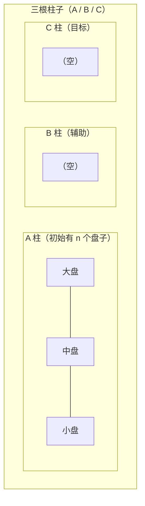

# 分治算法 (Divide and Conquer)

> 📌 **一句话理解**：分治就是「分而治之」——把一个大问题拆成若干个相似的小问题，递归解决小问题，再合并结果。排序中的归并排序、快速排序，搜索中的二分查找，都是分治思想的典型应用。

---

## 一、分治思想

### 1.1 什么是分治法

分治法（Divide and Conquer）是一种算法设计范式，核心是三步骤：

```mermaid
flowchart TD
    A["大问题"]
    B["多个独立的小问题<br/>（与原问题形式相同，规模更小）"]
    C["小问题的解<br/>（递归求解，小到一定程度直接解）"]
    D["原问题的解"]

    A -->|① 分解 (Divide)| B
    B -->|② 解决 (Conquer)| C
    C -->|③ 合并 (Merge)| D
```

**三步详解：**

| 步骤 | 英文 | 作用 |
|------|------|------|
| **分解** | Divide | 把原问题分解为若干个规模较小、相互独立、与原问题形式相同的子问题 |
| **解决** | Conquer | 子问题规模小到可以直接解决时直接解；否则递归求解各子问题 |
| **合并** | Merge | 将各子问题的解合并，得到原问题的解 |

### 1.2 分治的适用条件

什么样的问题适合用分治？

1. **问题可以分解**：能分解成若干个规模较小的相同问题（最优子结构）
2. **子问题独立**：子问题之间不相互依赖（和动态规划的关键区别）
3. **分解合并成本可接受**：分解和合并的代价不能太高，否则得不偿失
4. **子问题可以重复**：子问题可以重复出现（这样递归才有意义，或者可以用记忆化）

### 1.3 分治 vs 其他算法思想

| 思想 | 核心 | 是否重叠子问题 | 典型例子 |
|------|------|--------------|---------|
| **分治** | 分解→解决→合并 | 子问题独立，不重叠 | 归并排序、快速排序、二分查找 |
| **动态规划** | 分解 + 记忆化（避免重复计算） | 子问题重叠，有重复 | 斐波那契、背包问题、最长公共子序列 |
| **贪心** | 每步选局部最优，期望全局最优 | —— | 哈夫曼树、活动选择、最小生成树 |
| **回溯** | 尝试所有可能，不行就回退 | —— | N皇后、全排列、组合总和 |

> ⚠️ 分治和动态规划的最大区别：**分治的子问题是独立的**，解完子问题直接合并就行；**动态规划的子问题是重叠的**，后面的子问题依赖前面的结果，需要记录子问题的解避免重复计算。

---

## 二、分治经典算法

### 2.1 归并排序（Merge Sort）

最经典的分治应用。

```
                6 2 8 1 4 3 7 5
                   /            \
              6 2 8 1         4 3 7 5      ← 分解
              /   \           /   \
            6 2   8 1      4 3   7 5
            / \    / \     / \    / \
           6   2  8   1   4   3  7   5   ← 小到可以直接解
           \ /    \ /     \ /    \ /
           2 6   1 8     3 4   5 7   ← 合并
              \  /          \  /
            1 2 6 8       3 4 5 7
                  \        /
               1 2 3 4 5 6 7 8       ← 最终合并
```

- **分解**：数组从中间分成两半
- **解决**：递归排序左右两半
- **合并**：把两个有序数组合并成一个有序数组
- 时间复杂度：O(n log n)
- 空间复杂度：O(n)

详细代码见 `01-排序算法.md`。

### 2.2 快速排序（Quick Sort）

也是分治，但和归并的分治方式不同——归并是"从中间切，分别排序，再合并"，快排是"选基准，分大小，各自递归"。

```
数组： 6  2  8  1  4  3  7  5
           选 5 做 pivot
           
分解后： 2  1  4  3 | 5 | 8  7  6
        小于5的     ↑   大于5的
                   pivot在正确位置
                   
递归左边： 2 1 4 3 → 继续分
递归右边： 8 7 6  → 继续分
```

- **分解**：选一个 pivot，把数组分成小于 pivot 和大于 pivot 两部分（partition）
- **解决**：递归排序左右两部分
- **合并**：不需要显式合并（原地排序，左右两部分排好后整个数组就有序了）
- 平均时间复杂度：O(n log n)

详细代码见 `01-排序算法.md`。

### 2.3 二分查找（Binary Search）

二分查找也是分治思想的体现，不过它比较特殊——**只需要在一半里继续找，另一半直接扔掉**。

```
有序数组： 1  3  5  7  9  11  13  15
找 target = 13

第1次：  mid = 第4位(7)  → 13 > 7 → 去右半边找
第2次：        9 11 13 15
               mid=11   → 13 > 11 → 去右半边
第3次：           13 15
                 mid=13 → 命中！
```

- **分解**：取中间元素，和 target 比较，一次排除一半
- **解决**：在可能的那一半继续二分查找
- **合并**：不需要合并（找到就是结果，没找到就是不存在）
- 时间复杂度：O(log n)

**模板代码：**
```java
// 标准二分查找
public int binarySearch(int[] arr, int target) {
    int left = 0, right = arr.length - 1;
    while (left <= right) {
        int mid = left + (right - left) / 2; // 防溢出，不用 (l+r)/2
        if (arr[mid] == target) return mid;
        else if (arr[mid] < target) left = mid + 1;
        else right = mid - 1;
    }
    return -1; // 没找到
}
```

> ⚠️ 注意点：
> 1. `mid = left + (right - left) / 2` 而不是 `(left + right) / 2`，防止 left + right 溢出 int 范围
> 2. 循环条件是 `left <= right` 还是 `left < right`，取决于你的边界定义，两种写法都可以但要统一
> 3. 二分查找的前提是**数组有序**

### 2.4 汉诺塔（Tower of Hanoi）

经典递归/分治问题。

**问题**：有 3 根柱子 A、B、C，A 上有 n 个盘子（从上到下从小到大），把所有盘子从 A 移到 C，每次只能移一个盘子，大盘不能放在小盘上。



**分治思路：**
要把 n 个盘子从 A → C：
1. 先把 n-1 个盘子从 A → B（借助 C）
2. 把第 n 个（最大的）盘子从 A → C
3. 再把 n-1 个盘子从 B → C（借助 A）

```java
public void hanoi(int n, char from, char to, char aux) {
    if (n == 1) {
        System.out.println("移动盘子 1 从 " + from + " 到 " + to);
        return;
    }
    hanoi(n - 1, from, aux, to);  // 第1步：n-1个从 from → aux
    System.out.println("移动盘子 " + n + " 从 " + from + " 到 " + to); // 第2步
    hanoi(n - 1, aux, to, from);  // 第3步：n-1个从 aux → to
}
```

- 时间复杂度：O(2^n)（指数级，这也是为什么传说中 64 个盘子要移到世界末日）
- 空间复杂度：O(n)（递归栈）

### 2.5 最大子数组和（Maximum Subarray）

**问题**：给定一个整数数组，找到和最大的连续子数组，返回最大和。

**分治解法：**
把数组分成左右两半，最大子数组有三种情况：
1. 完全在左半边
2. 完全在右半边
3. 跨越中间（包含中间元素）

分别计算这三种情况，取最大值。

```
数组：  -2  1  -3  4  -1  2  1  -5  4
            中间位置 ↑
            
情况1：左半边最大 → [-2, 1, -3, 4, -1] 的最大子数组
情况2：右半边最大 → [2, 1, -5, 4] 的最大子数组
情况3：跨越中间 → 从中间往左找最大前缀 + 从中间往右找最大后缀
```

**代码：**
```java
public int maxSubArray(int[] nums) {
    return maxSubArray(nums, 0, nums.length - 1);
}
private int maxSubArray(int[] nums, int left, int right) {
    if (left == right) return nums[left];
    
    int mid = left + (right - left) / 2;
    
    int leftMax = maxSubArray(nums, left, mid);       // 左半边最大
    int rightMax = maxSubArray(nums, mid + 1, right); // 右半边最大
    int crossMax = crossMax(nums, left, mid, right);  // 跨越中间的最大
    
    return Math.max(Math.max(leftMax, rightMax), crossMax);
}
// 跨越中间的最大子数组和
private int crossMax(int[] nums, int left, int mid, int right) {
    // 从 mid 往左找最大前缀和
    int leftSum = Integer.MIN_VALUE, sum = 0;
    for (int i = mid; i >= left; i--) {
        sum += nums[i];
        leftSum = Math.max(leftSum, sum);
    }
    // 从 mid+1 往右找最大后缀和
    int rightSum = Integer.MIN_VALUE; sum = 0;
    for (int i = mid + 1; i <= right; i++) {
        sum += nums[i];
        rightSum = Math.max(rightSum, sum);
    }
    return leftSum + rightSum;
}
```

- 时间复杂度：O(n log n)（类似归并排序）
- 空间复杂度：O(log n)
- 注：这题还有更优的 O(n) 动态规划解法（Kadane 算法），分治是用来练习分治思想的

### 2.6 逆序对（Inversion Pair）

**问题**：给定数组，求逆序对的个数。逆序对：i < j 且 a[i] > a[j]。

**分治解法**（基于归并排序）：
和归并排序一模一样的流程，只是在合并两个有序数组时，顺便统计跨左右两部分的逆序对数量。

```
左半边：2  4  6        右半边：1  3  5
                      
合并时：左指针 i，右指针 j
  i=0(2) > j=0(1) → 左半边从 i 开始所有元素都 > a[j] → 逆序对 + 3
  j++，i=0(2) < j=1(3) → 放入 2，i++
  i=1(4) > j=1(3) → 逆序对 + 2
  j++，i=1(4) < j=2(5) → 放入 4，i++
  i=2(6) > j=2(5) → 逆序对 + 1
  ...
共 3 + 2 + 1 = 6 个跨左右的逆序对
```

**代码：**
```java
public int reversePairs(int[] nums) {
    return mergeSort(nums, 0, nums.length - 1, new int[nums.length]);
}
private int mergeSort(int[] nums, int left, int right, int[] temp) {
    if (left >= right) return 0;
    int mid = left + (right - left) / 2;
    // 左半边逆序对 + 右半边逆序对 + 跨左右的逆序对
    int count = mergeSort(nums, left, mid, temp)
              + mergeSort(nums, mid + 1, right, temp)
              + merge(nums, left, mid, right, temp);
    return count;
}
private int merge(int[] nums, int left, int mid, int right, int[] temp) {
    int i = left, j = mid + 1, k = left;
    int count = 0;
    while (i <= mid && j <= right) {
        if (nums[i] <= nums[j]) {
            temp[k++] = nums[i++];
        } else {
            temp[k++] = nums[j++];
            count += mid - i + 1; // 关键：左半边剩下的都比 a[j] 大
        }
    }
    while (i <= mid) temp[k++] = nums[i++];
    while (j <= right) temp[k++] = nums[j++];
    for (int m = left; m <= right; m++) nums[m] = temp[m];
    return count;
}
```

- 时间复杂度：O(n log n)（暴力法 O(n²) 会超时）
- 空间复杂度：O(n)

### 2.7 快速幂（快速幂）

**问题**：求 x 的 n 次方（x^n），要求比 O(n) 快。

**分治思路**：
- 如果 n 是偶数：x^n = x^(n/2) × x^(n/2)
- 如果 n 是奇数：x^n = x^(n/2) × x^(n/2) × x
- 基底：n = 0 时，x^0 = 1

```
比如求 3^10：
3^10 = 3^5 × 3^5
3^5  = 3^2 × 3^2 × 3
3^2  = 3^1 × 3^1
3^1  = 3^0 × 3^0 × 3
3^0  = 1
```

**代码（递归版）：**
```java
public double myPow(double x, int n) {
    long N = n; // 防溢出（n = -2^31 时 -n 会溢出）
    return N >= 0 ? pow(x, N) : 1.0 / pow(x, -N);
}
private double pow(double x, long n) {
    if (n == 0) return 1.0;
    double half = pow(x, n / 2);
    if (n % 2 == 0) return half * half;
    else return half * half * x;
}
```

**迭代版（也叫快速幂）：**
```java
public double myPow(double x, int n) {
    long N = n;
    if (N < 0) { x = 1 / x; N = -N; }
    double res = 1.0;
    double base = x;
    while (N > 0) {
        if (N % 2 == 1) res *= base; // 这一位是 1，乘进去
        base *= base;                // base 平方
        N /= 2;                      // 右移一位
    }
    return res;
}
```

- 时间复杂度：O(log n)（暴力法是 O(n)）
- 空间复杂度：递归 O(log n)，迭代 O(1)

---

## 三、分治解题模板

### 3.1 通用模板

```java
返回值 divideConquer(问题参数) {
    // 终止条件：问题小到可以直接解决
    if (最小问题条件) {
        return 直接解;
    }
    
    // ① 分解：分成若干个子问题
    子问题1 = 分解出的第一个子问题
    子问题2 = 分解出的第二个子问题
    ...
    
    // ② 解决：递归求解子问题
    子结果1 = divideConquer(子问题1);
    子结果2 = divideConquer(子问题2);
    ...
    
    // ③ 合并：组合子问题的解
    原问题结果 = 合并(子结果1, 子结果2, ...);
    
    return 原问题结果;
}
```

### 3.2 判断能不能用分治的小技巧

看到问题时，问自己三个问题：
1. 能不能**分成相似的小问题**？（比如数组对半分、树的左右子树）
2. 子问题的解能不能**合并成原问题的解**？
3. 合并的代价大不大？会不会比暴力法还贵？

如果三个答案都是「是」，那分治大概率可行。

### 3.3 时间复杂度分析（主定理 Master Theorem）

分治算法的时间复杂度通常可以用**主定理**（Master Theorem）来分析。

对于递推式：T(n) = a·T(n/b) + f(n)
- a：子问题个数
- n/b：每个子问题的规模
- f(n)：分解和合并的代价

| 情况 | 条件 | 时间复杂度 |
|------|------|-----------|
| 情况1 | f(n) < n^(log_b a) | T(n) = O(n^(log_b a)) |
| 情况2 | f(n) = n^(log_b a) | T(n) = O(n^(log_b a) · log n) |
| 情况3 | f(n) > n^(log_b a) | T(n) = O(f(n)) |

**举例：**
- 归并排序：T(n) = 2T(n/2) + O(n) → a=2, b=2, log₂2=1 → f(n)=n = n^1 → **情况2** → O(n log n)
- 二分查找：T(n) = T(n/2) + O(1) → a=1, b=2, log₂1=0 → f(n)=1 = n^0 → **情况2** → O(log n)
- 快速排序（平均）：T(n) = 2T(n/2) + O(n) → 同归并 → O(n log n)

> 💡 主定理不用死记硬背，理解即可。面试时分析分治复杂度，直接说"递归深度 log n，每层 O(n)，所以 O(n log n)"也行。

---

## 四、经典 LeetCode 题

| 题号 | 题目 | 方法 |
|------|------|------|
| 50 | Pow(x, n) | 快速幂（分治/迭代） |
| 53 | 最大子数组和 | 分治 / DP |
| 912 | 排序数组 | 归并 / 快排 / 堆排（练手分治） |
| 面试题 51 | 数组中的逆序对 | 归并排序分治 |
| 23 | 合并 K 个升序链表 | 分治（两两合并） |
| 215 | 数组中的第 K 个最大元素 | 快速选择（快排思想分治） |
| 4 | 寻找两个正序数组的中位数 | 二分 + 分治 |
| 169 | 多数元素 | 分治（Boyer-Moore 更优） |
| 240 | 搜索二维矩阵 II | 分治 / 指针 |
| 95 | 不同的二叉搜索树 II | 分治（枚举根，左右子树分别构造） |

---

> 📌 **复习建议**：
> 1. 先理解分治的核心三步骤（分解→解决→合并），以及和 DP 的区别
> 2. 能手写归并排序、快速排序、二分查找（分治最基础的三个应用）
> 3. 掌握逆序对、最大子数组和、快速幂这几道经典题
> 4. 理解主定理（知道怎么分析分治的时间复杂度）
