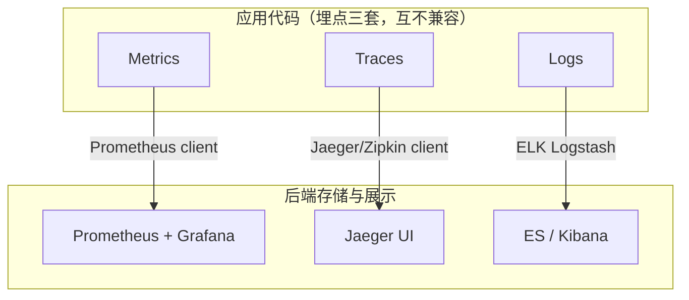
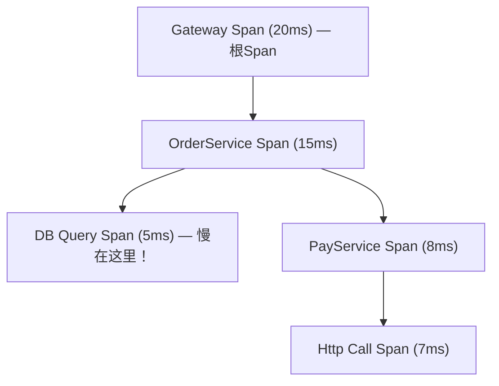
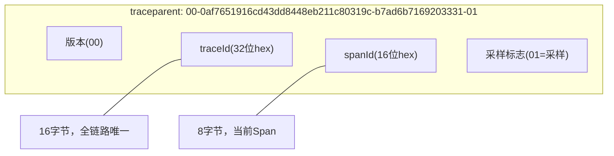
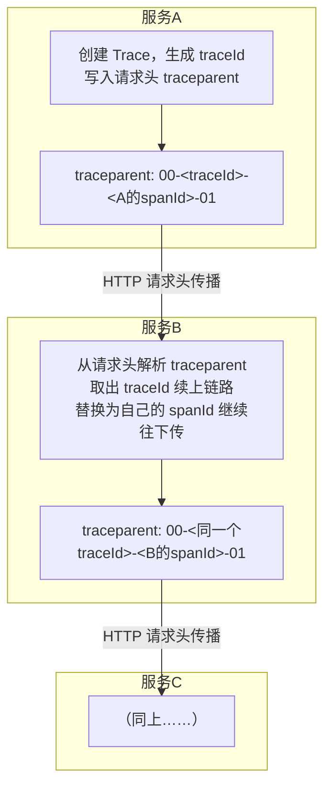
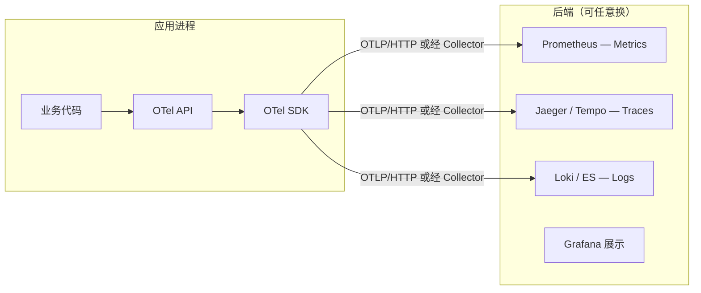
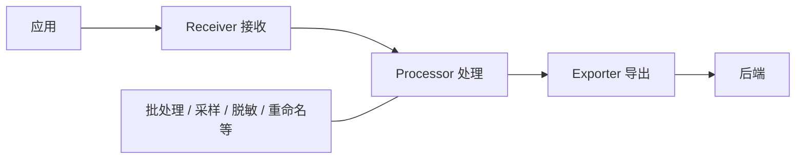

# OpenTelemetry

## 核心概念

**OpenTelemetry（简称 OTel）是可观测性领域的统一标准**：一套规范 + API + SDK + Collector，用来统一采集应用的 Traces（链路）、Metrics（指标）、Logs（日志）三大数据。

- 由 OpenTracing 和 OpenCensus 两个项目合并而来，2019 年成为 **CNCF 第二个毕业项目**（仅次于 Kubernetes）--你说"OTel 属于云原生"判断完全正确，它是云原生可观测性的事实标准。
- **本质**：解决"监控厂商各自为政、埋点代码与后端强绑定"的问题，把**数据采集**这一层标准化，与后端存储解耦。

> 💡 一句话：**OTel 是可观测性的"USB-C 接口"**--你按标准采集一次，数据能发给任意后端（Prometheus / Jaeger / ES / 商业 APM），换后端不用改业务埋点代码。

---

## 一、为什么需要 OpenTelemetry（痛点）

**可观测性三大支柱**原本各自为政，每家用自己的 SDK：

**痛点**：
1. **厂商锁定**：埋点代码和后端强绑定。今天用 Jaeger，明天想换 SkyWalking，Traces 的埋点代码全得重写。
2. **三套 SDK**：Metrics、Traces、Logs 各一套客户端，配置繁琐，资源浪费。
3. **数据割裂**：链路、指标、日志之间没有统一关联（比如 traceId 在日志里对不上）。

**OTel 怎么解决**：统一一套 API/SDK 采集三大支柱，数据格式标准化（OTLP 协议），后端可任意切换。

---

## 二、可观测性三大支柱

| 支柱 | 看什么 | 通俗比喻 | 典型数据 |
|---|---|---|---|
| **Traces（链路）** | 一个请求穿过哪些服务、每段耗时 | 快递物流轨迹 | traceId、span、耗时 |
| **Metrics（指标）** | 系统的聚合数值状态 | 仪表盘（转速、油量） | QPS、CPU、P99 延迟 |
| **Logs（日志）** | 离散的事件记录 | 日记本 | 错误堆栈、业务日志 |

> 💡 三者配合定位问题：**Metrics 告诉你"出问题了"**（QPS 飙升/P99 变慢）-> **Traces 告诉你"问题在哪"**（哪个服务哪段慢）-> **Logs 告诉你"具体啥错"**（异常堆栈）。三者通过 `traceId` 串联。

---

## 三、核心概念

### Trace 与 Span（链路与跨度）

- **Trace**：一个请求从头到尾穿过所有服务的**完整路径**。像快递的物流轨迹。
- **Span**：链路里的**一段操作**（一次 RPC、一次 DB 查询）。像物流的每个中转站。
- 一个 Trace 由多个 Span 组成，Span 之间有父子关系。

**Span 包含的信息**：操作名、起止时间、状态码、属性（http.method、db.statement）、事件、父 SpanId、traceId。

### Context Propagation（上下文传播）

- 把 `traceId` 跨服务、跨进程透传下去的机制，是**链路能串起来的关键**。
- 没有它：A 调 B，A 和 B 各自产生独立的 Span，**连不成一条链**，分布式追踪就失效了。

**传播靠什么？--W3C Trace Context 规范**

上下文传播不是 OTel 自己发明的，它遵循 **W3C Trace Context 标准**，让不同语言、不同厂商的系统能互相识别链路上下文。核心是约定两个 HTTP 请求头：

| 头 | 作用 |
|---|---|
| `traceparent` | 传链路核心信息（traceId / spanId / 采样标志），OTel 默认用它 |
| `tracestate` | 传厂商扩展信息（多厂商并存时，允许多套链路系统共存） |

**`traceparent` 格式**（面试可能要会读）：

- **traceId**：16 字节（32 位十六进制），全链路唯一，整条 Trace 不变。
- **spanId**：8 字节（16 位十六进制），当前这一跳的 Span 标识，每跳不同。
- **采样标志（trace-flags）**：`01` 表示该链路被采样（要上报），`00` 表示不采样。

**传播载体**：HTTP 用请求头，RPC/gRPC 用 metadata，消息队列（Kafka/RabbitMQ）用消息 header。OTel 的各种 instrumenter 自动注入和解析这些头，业务代码通常无感。

> ⚠️ **关键认知**：W3C Trace Context 是行业共识标准，正因如此，OTel 采集的链路能被 Jaeger/Zipkin/SkyWalking 等任意遵循该标准的后端识别。这是 OTel"标准化、解耦"理念的底层体现。

**与 Baggage 的区别**：`traceparent` 传的是 OTel 内部的 traceId（用于串联链路）；`Baggage` 用独立的 `baggage` 请求头传业务自定义 KV（如 userId、租户ID），各服务可读写，详见下文 Baggage 一节。

### Resource（资源）

- 描述**被监控对象是谁**的静态属性：`service.name`、`host.name`、`env`、`version` 等。
- 所有该应用产生的数据都带上这个 Resource，方便在后端按服务/环境筛选。

### Instrumentation（埋点）

| 方式 | 原理 | 优缺点 |
|---|---|---|
| **自动埋点** | JVM Agent（javaagent）无侵入拦截常用库（HTTP/JDBC/Kafka） | 零代码改动，覆盖广；但精细业务需补充 |
| **手动埋点** | 用 OTel API 在代码里显式创建 Span | 精准控制业务逻辑；有侵入 |

> 💡 实战：**Java Agent 自动埋点 + 关键业务手动埋点**结合。Agent 装上就自动追踪框架调用，业务关键节点再手动加 Span。

### Baggage（行李）

- 跨进程传递的**业务上下文**（如 userId、租户ID），随链路一起传播。
- 和 Context Propagation 区别：Context 传的是 traceId（OTel 内部用）；Baggage 传的是**业务自定义 KV**，各服务可读写。

### 语义约定（Semantic Conventions）

- 标准化的属性命名规范，保证跨语言跨后端一致。
- 如 `http.method`、`http.status_code`、`db.system`、`messaging.system`。
- 好处：后端不用猜各团队自定义的属性名，统一按规范查询。

---

## 四、OTel 架构（API + SDK + Collector）

**三层分工**：
- **API**：厂商无关的接口规范，业务代码只依赖它（不绑定具体实现）。
- **SDK**：API 的实现，负责真正的采集、批处理、导出，可配置采样率、导出目标。
- **Collector**：独立部署的数据中转中间件（见下）。

### OTel Collector（数据中转站）

像"快递分拣中心"：接收各应用发来的数据，处理后转发给不同后端。

| 组件 | 作用 | 例子 |
|---|---|---|
| **Receiver** | 接收数据 | OTLP、Jaeger、Prometheus |
| **Processor** | 处理转换 | 采样、批处理、属性重命名、脱敏 |
| **Exporter** | 导出到后端 | Prometheus、Jaeger、ES、OTLP |
| **Extension** | 辅助功能 | 健康检查、性能监控 |

**为什么要 Collector**：
1. **解耦**：应用只管发给 Collector，换后端只改 Collector 配置，应用无感。
2. **卸载**：批处理、重试、采样在 Collector 做，减轻应用负担。
3. **协议转换**：收 OTLP，发 Prometheus 格式 / Jaeger 格式，适配多后端。

---

## 五、与 Prometheus / Jaeger / SkyWalking 的关系

> **核心认知：OTel 是采集层标准，不是后端。它不替代这些产品，而是统一了喂给它们的数据入口。**

| 产品 | 定位 | 和 OTel 关系 |
|---|---|---|
| **Prometheus** | 指标存储+查询后端 | OTel 采集 Metrics -> Collector -> Prometheus 存 |
| **Jaeger** | 链路存储+展示后端 | OTel 采集 Traces -> Collector -> Jaeger 存；Jaeger 原生 client 已转向 OTel SDK |
| **SkyWalking** | APM 全家桶(自带采集+后端) | 与 OTel 是竞合关系；SkyWalking 现也支持接收 OTel 数据 |
| **Tempo/Loki** | Grafana 系后端 | 原生接收 OTel/OTLP 数据 |

> ⚠️ 常见误区：不要说"OTel 替代了 Prometheus"。正确说法是 **OTel 替代了各家自己的 client SDK（如 Prometheus client、Jaeger client）**，Prometheus 作为后端依然在用。

---

## 常见面试题

### 1. OpenTelemetry 是什么？解决什么问题？
- CNCF 第二个毕业项目，可观测性的统一采集标准（规范+API+SDK+Collector）。
- 解决厂商锁定：统一采集 Traces/Metrics/Logs，数据格式与后端解耦，换后端不改埋点。

### 2. 可观测性三大支柱是什么？
- Traces（链路）、Metrics（指标）、Logs（日志）。三者通过 traceId 串联，配合定位问题：Metrics 报警 -> Traces 定位 -> Logs 查错。

### 3. OTel 和 Prometheus、Jaeger 是什么关系？
- OTel 是采集层标准，Prometheus/Jaeger 是存储展示后端。OTel 不替代它们，而是统一了喂给它们的数据采集入口。OTel 替代的是各家自带的 client SDK。

### 4. Trace 和 Span 的关系？Span 包含哪些信息？
- Trace 是完整链路，Span 是其中一段操作，多个 Span 组成一个 Trace，有父子关系。
- Span 含：操作名、起止时间、状态码、属性、事件、父SpanId、traceId。

### 5. Context Propagation 是什么？为什么重要？W3C 规范？
- 跨服务透传 traceId 的机制，是链路能串联的关键。
- 遵循 **W3C Trace Context 标准**，核心是 `traceparent` 请求头，格式为 `版本-traceId-spanId-采样标志`。traceId 全链路唯一，spanId 每跳变化，采样标志位决定是否上报。
- 传播载体：HTTP 用请求头、gRPC 用 metadata、消息队列用消息 header。
- 没有它各服务 Span 各自孤立，连不成完整链路；正因为是 W3C 行业共识，OTel 采集的链路能被任意遵循该标准的后端识别。

### 6. OTel Collector 为什么要用？
- 解耦（换后端只改 Collector 配置）、卸载（批处理/重试/采样减轻应用负担）、协议转换（收 OTLP 发多格式）。

### 7. 自动埋点和手动埋点的区别？
- 自动埋点用 JVM Agent 无侵入拦截框架，覆盖广但不够细；手动埋点用 API 精准控制业务逻辑但有侵入。实战两者结合。

### 8. 为什么 OTel 能解决厂商锁定？
- 业务代码只依赖厂商无关的 API，SDK 和 Collector 负责导出。换后端只需改 Collector 的 Exporter 配置，应用代码和埋点逻辑完全不动。

---

## 一句话记忆法

| 概念 | 一句话 | 口诀 |
|---|---|---|
| OTel | 可观测性的统一采集标准 | **采集标准化** |
| 三大支柱 | Traces/Metrics/Logs | **链路指标日志** |
| Trace/Span | 链路是轨迹，Span 是中转站 | **轨迹分段** |
| Context Propagation | 透传 traceId 串联链路 | **上下串联** |
| Collector | 数据中转分拣站 | **中转解耦** |
| 与后端关系 | OTel 采集，Prom/Jaeger 存储 | **采集非替代** |

---

**总结**：OTel 之于可观测性，就像 SQL 之于数据库、HTTP 之于 Web--一个让生态统一的标准。面试重点抓住"为什么需要它（厂商锁定）、三大支柱、Trace/Span、Context Propagation、Collector 作用、与后端的关系"这条线。
