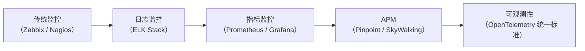
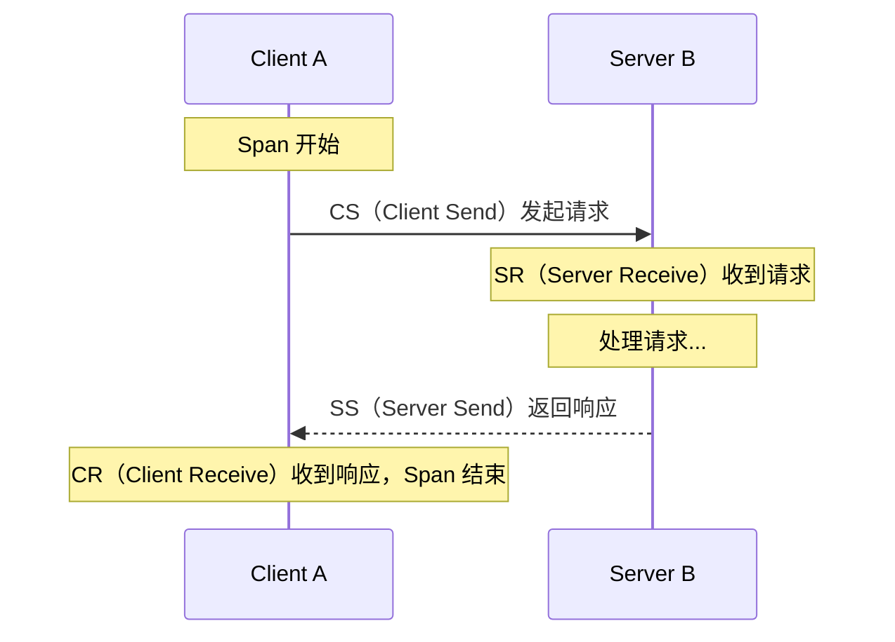
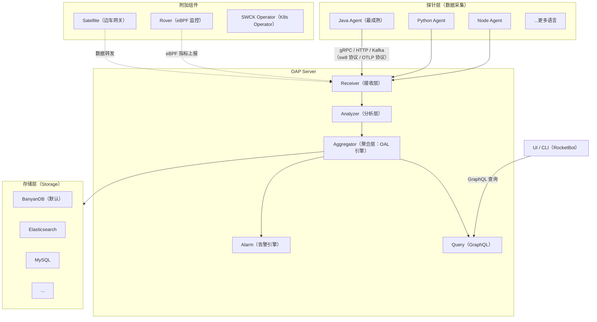
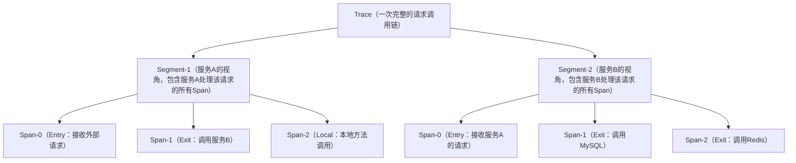

# 03 - SkyWalking 初识：APM 与分布式链路追踪

## 核心概念

### 1. 什么是 APM？

**APM（Application Performance Monitoring，应用性能监控）** 是一套用于监控和管理软件应用程序性能与可用性的技术体系。Gartner 将 APM 定义为包含以下五个维度的能力：

1. **最终用户体验监控（EUM）**：真实用户和模拟用户的体验数据
2. **运行时应用架构发现（Topology Discovery）**：自动发现应用拓扑和依赖关系
3. **用户自定义事务分析（Business Transaction Profiling）**：业务级的事务追踪和性能分析
4. **深度应用诊断（Deep Dive Diagnostics）**：深入到代码级别的调用链分析
5. **分析与报告（Analytics & Reporting）**：聚合分析、趋势预测和告警

#### APM 的演进历程

- **传统监控**：关注主机层面（CPU、内存、磁盘、网络），无法感知应用内部状态
- **日志监控**：通过日志分析定位问题，但日志与业务上下文割裂
- **指标监控**：时序数据 + 告警，但缺少请求级的调用链上下文
- **APM**：以 Trace 为核心，串联指标和日志，提供端到端的请求视图
- **可观测性**：统一 Trace、Metrics、Logs 三大支柱，建立标准化数据模型

### 2. 分布式链路追踪的核心概念

在微服务架构中，一个用户请求可能经过几十个服务节点。**分布式链路追踪**解决的核心问题是：**如何在分散的系统中还原一个请求的完整调用链路？**

#### 2.1 Google Dapper 论文——分布式追踪的理论基础

2010年 Google 发表 Dapper 论文，奠定了分布式追踪的理论基础，核心概念：

| 概念 | 说明 |
|------|------|
| **Trace** | 一次完整的请求调用链，由一组 Span 组成的有向无环图（DAG） |
| **Span** | 一个基本的调用单元，代表一次 RPC 调用、数据库查询或方法执行 |
| **SpanContext** | 跨进程传播的上下文信息（TraceId + SpanId + 采样标志） |
| **Annotation** | 附着在 Span 上的事件标注（如 CS/CR/SS/SR） |
| **Sampling** | 采样策略，决定哪些 Trace 被记录和上报 |

#### 2.2 Span 的生命周期（Dapper 模型）

- **CS（Client Send）**：客户端发起请求
- **SR（Server Receive）**：服务端收到请求
- **SS（Server Send）**：服务端返回响应
- **CR（Client Receive）**：客户端收到响应

**延迟计算**：
- 网络延迟 = SR - CS（客户端到服务端的网络传输时间）
- 服务端处理耗时 = SS - SR（服务端业务逻辑处理时间）
- 网络回程 = CR - SS（响应从服务端回到客户端的时间）
- 客户端总耗时 = CR - CS（客户端视角的完整调用耗时）

### 3. SkyWalking 是什么？

**Apache SkyWalking** 是一个开源的可观测性平台（APM），专为微服务、云原生和容器化架构设计。它提供：

- **分布式追踪（Distributed Tracing）**：跨服务、跨进程的调用链追踪
- **服务网格（Service Mesh）**：Istio/Envoy 遥测数据分析
- **指标聚合（Metrics Aggregation）**：服务/实例/端点级别的多维度指标
- **告警（Alerting）**：基于指标的告警规则引擎
- **日志关联（Log Correlation）**：Trace 与日志的无缝关联
- **性能剖析（Profiling）**：线程级 CPU 采样和火焰图
- **浏览器监控（Browser Monitoring）**：前端页面性能和错误监控
- **基础设施监控**：eBPF Rover 无侵入内核级监控

#### 3.1 发展历程

| 时间 | 里程碑 |
|------|--------|
| 2015 | 吴晟（Sheng Wu）在 GitHub 上开源 SkyWalking v1，基于 Java Agent + 内存存储 |
| 2017 | 加入 Apache 孵化器（Incubator），v5 版本重构了后端架构 |
| 2019 | 毕业成为 Apache 顶级项目（Top-Level Project），v6 引入 OAP 架构 |
| 2020 | v8 发布，引入 MAL（Meter Analysis Language）、LAL（Log Analysis Language） |
| 2022 | v9 发布，UI 重构、原生 OpenTelemetry 支持、移除 H2 集群模式 |
| 2024 | v10 发布，BanyanDB 成为默认存储引擎、分层拓扑、Helm Charts 简化部署 |

### 4. SkyWalking 架构全景

**三大核心组件**：

| 组件 | 职责 | 技术栈 |
|------|------|--------|
| **Probe（探针）** | 数据采集：字节码注入拦截请求，生成 Trace 数据 | Java Agent(ByteBuddy)、Python、Node.js、Go、C++ |
| **OAP（Observability Analysis Platform）** | 数据接收、分析、聚合、告警、查询 | Java 11+，模块化架构，gRPC/HTTP通信 |
| **UI（RocketBot）** | 数据可视化：仪表盘、拓扑图、追踪详情、告警面板 | React + Ant Design，GraphQL 查询 |

### 5. 主流 APM 工具对比

| 维度 | SkyWalking | Pinpoint | Jaeger | Zipkin | CAT（大众点评） |
|------|-----------|----------|--------|--------|----------------|
| **所属组织** | Apache 基金会 | Naver（韩国） | CNCF | CNCF | 美团/大众点评 |
| **开发语言** | Java | Java | Go | Java | Java |
| **探针方式** | 字节码注入（ByteBuddy）| 字节码注入（ASM）| SDK 埋点 | SDK 埋点 | 代码埋点 |
| **存储后端** | BanyanDB/ES/MySQL/H2 | HBase | ES/Cassandra/Memory | ES/MySQL/Cassandra | MySQL/HDFS |
| **UI 质量** | ★★★★★ 优秀 | ★★★★★ 优秀 | ★★★☆☆ 一般 | ★★★☆☆ 一般 | ★★★★☆ 良好 |
| **侵入性** | 极低（Agent自动）| 极低（Agent自动）| 高（需引入SDK）| 高（需引入SDK）| 中（需埋点）|
| **性能损耗** | 低（异步上报）| 低（UDP上报）| 中 | 中 | 低 |
| **JVM监控** | ✅ 内置 | ✅ 内置 | ❌ 需额外组件 | ❌ 需额外组件 | ❌ |
| **告警** | ✅ 内置引擎 | ✅ 内置 | ❌ 无 | ❌ 无 | ✅ 内置 |
| **OpenTelemetry** | ✅ 原生支持 | ⚠️ 部分支持 | ✅ 原生支持 | ✅ 兼容 | ❌ |
| **服务拓扑** | ★★★★★ | ★★★★★ | ★★★☆☆ | ★★★☆☆ | ★★★★☆ |
| **社区活跃度** | ★★★★★ 高 | ★★★☆☆ 中 | ★★★★★ 高 | ★★★★☆ 较高 | ★★★☆☆ 中 |
| **中文文档** | ★★★★★ 丰富 | ★★★☆☆ 一般 | ★★★☆☆ 一般 | ★★☆☆☆ 少 | ★★★★★ 丰富 |
| **适用场景** | 微服务全链路 + 指标 + 告警 | 微服务全链路 | 纯链路追踪 | 纯链路追踪 | 实时监控告警 |

**选型建议**：

1. **微服务全栈监控** → SkyWalking：Agent 自动探针 + 指标 + 告警一站式
2. **与 Istio/Envoy 深度集成** → SkyWalking：原生支持 Service Mesh 遥测
3. **纯链路追踪（轻量级）** → Jaeger：与 OpenTelemetry 生态最深
4. **详细调用树展示** → Pinpoint：调用树可视化最详细
5. **实时业务监控** → CAT：美团场景，海量事务实时统计分析

### 6. SkyWalking 的核心优势

1. **零侵入性**：Java 应用只需添加 `-javaagent` 启动参数，无需修改一行代码
2. **性能友好**：Agent 端异步上报，OAP 端流式处理，对业务应用影响极小（< 5% CPU overhead）
3. **多语言支持**：Java（最成熟）、Python、Node.js、Go、C++、Rust、PHP 等
4. **生态兼容**：原生支持 OpenTelemetry 协议（OTLP），与 Prometheus/Grafana 集成
5. **指标丰富**：内置 100+ 指标（Apdex、Cpm、RT、SLA、JVM 全套指标），支持自定义指标
6. **大规模验证**：华为、腾讯、阿里、滴滴、字节跳动等大型企业生产环境验证

---

## 常见面试题

### Q1: APM 和传统监控（如 Zabbix、Prometheus）有什么区别？

**核心区别**：APM 关注**应用内部**的性能和调用链，传统监控关注**基础设施**（主机、网络）的状态。

| 对比维度 | APM（SkyWalking） | 传统监控（Prometheus） | 传统监控（Zabbix） |
|----------|-------------------|----------------------|-------------------|
| 监控对象 | 应用（方法级/请求级） | 基础设施指标 | 主机/网络设备 |
| 数据粒度 | 单次请求级别的 Trace | 秒级时序指标 | 分钟级采集 |
| 链路追踪 | ✅ 核心能力 | ❌ | ❌ |
| 自动发现 | ✅ 服务拓扑自动发现 | ⚠️ 需配置服务发现 | ❌ 手动配置 |
| 侵入性 | 极低（Agent自动） | 低（Exporter） | 低（Agent） |

**实际配合使用**：APM + 传统监控 = 完整可观测性（SkyWalking 看应用内部，Prometheus 看基础设施，Grafana 统一展示）。

### Q2: 分布式链路追踪能解决哪些问题？

1. **慢请求定位**：快速找到是哪个服务节点、哪个方法导致的延迟
2. **依赖分析**：自动生成服务依赖拓扑图，识别循环依赖和关键路径
3. **故障定位**：错误发生时，追踪到具体服务、具体方法、具体代码行
4. **性能瓶颈分析**：通过百分位延迟（P95/P99）识别长尾请求
5. **容量规划**：基于调用量和响应时间，评估服务扩容需求

### Q3: Span、Segment、Trace 三者是什么关系？

这是 SkyWalking 特有的数据模型（有别于 Dapper 论文）：

- **Span**：最小调用单元，代表一次具体的操作（RPC/DB/Cache/MQ）
- **Segment**：一个服务实例在一次请求中产生的所有 Span 的集合（一个 Segment = 一次请求在一个服务内的完整处理过程）
- **Trace**：跨服务的完整调用链，由多个 Segment 通过 `TraceId` + `ParentSegmentId` 串联而成

### Q4: 为什么 SkyWalking 选择 Java Agent + ByteBuddy 而不是 SDK 埋点？

1. **零侵入**：不改代码，不改配置，启动参数加 `-javaagent` 即可
2. **覆盖全面**：自动拦截主流框架（Spring、Dubbo、MySQL、Redis、Kafka 等）
3. **升级方便**：升级 Agent 无需修改业务代码
4. **ByteBuddy 优势**：相比 ASM（Pinpoint 使用），ByteBuddy API 更友好，重新定义类更安全

**代价**：需要理解字节码增强原理，自定义插件开发有一定学习成本。

### Q5: SkyWalking 的 sw8 协议和 OpenTelemetry 的 OTLP 协议是什么关系？

- **sw8**：SkyWalking 自研的跨进程传播协议，历史悠久（v1 到 v8），生态局限
- **OTLP**：OpenTelemetry 定义的统一协议，CNCF 标准，生态广泛
- **关系**：SkyWalking v9+ 同时支持两种协议，OAP 内置 OTLP Receiver，可以接收任何 OTel SDK 的数据
- **趋势**：长期来看，sw8 会逐步被 OTLP 取代，但为了保证兼容性，两种协议会长期共存

---

## 延伸阅读

- Google Dapper 论文（2010）：[_Dapper, a Large-Scale Distributed Systems Tracing Infrastructure_](https://research.google/pubs/dapper-a-large-scale-distributed-systems-tracing-infrastructure/)
- OpenTelemetry 官方文档：[https://opentelemetry.io/docs/](https://opentelemetry.io/docs/)
- Apache SkyWalking 官方文档：[https://skywalking.apache.org/docs/](https://skywalking.apache.org/docs/)