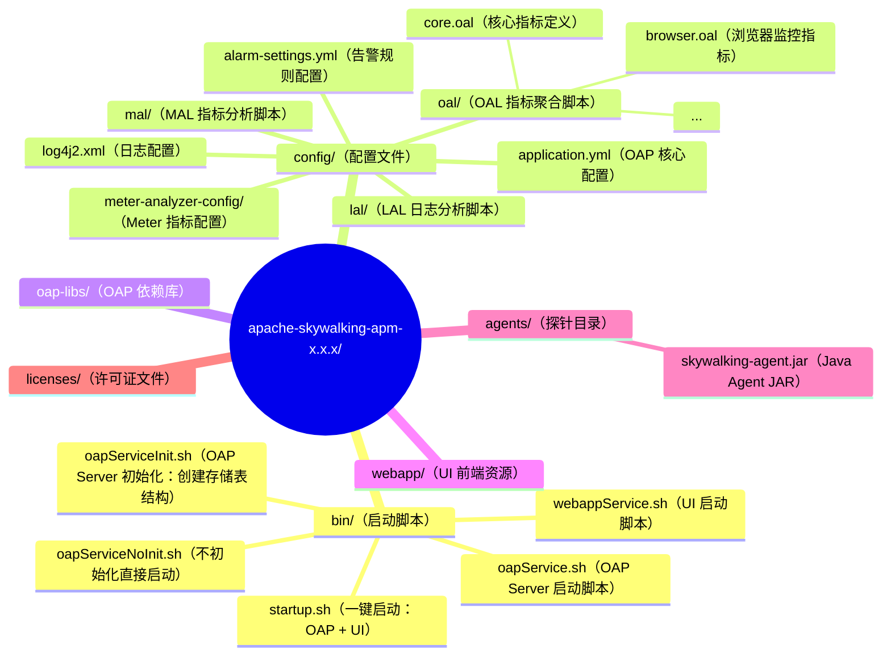
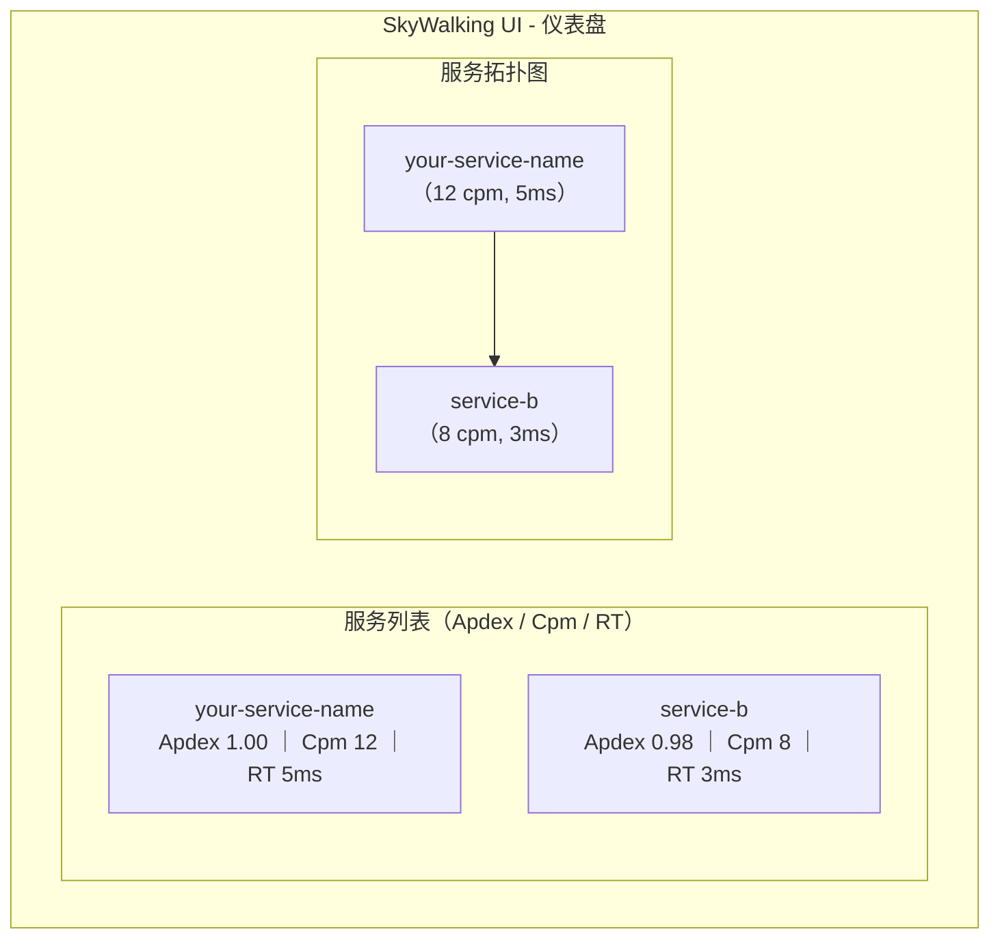
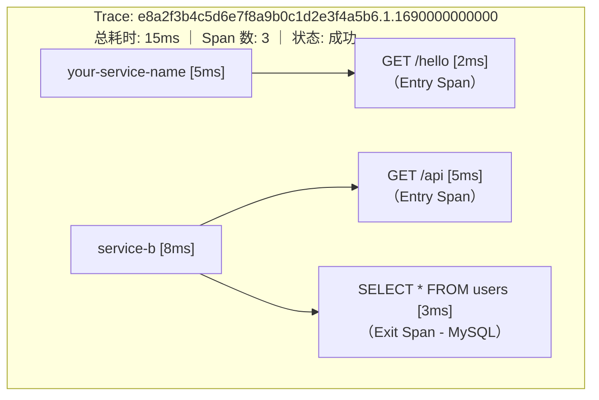
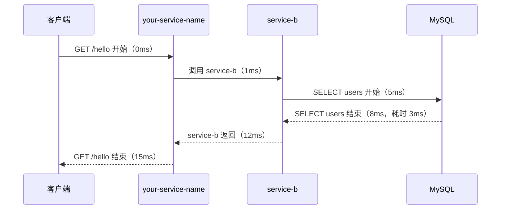
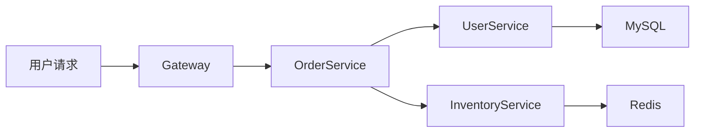
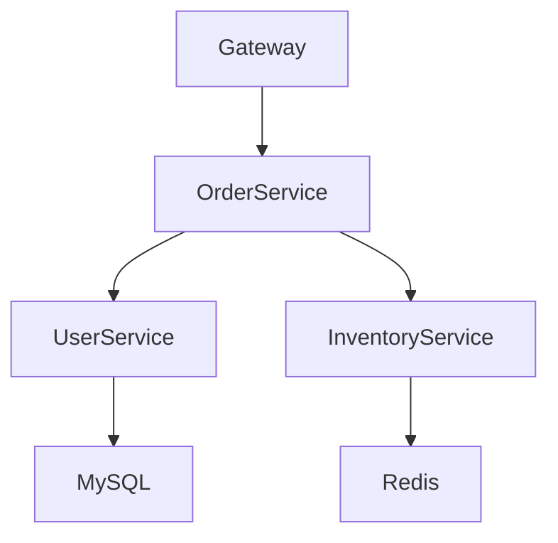
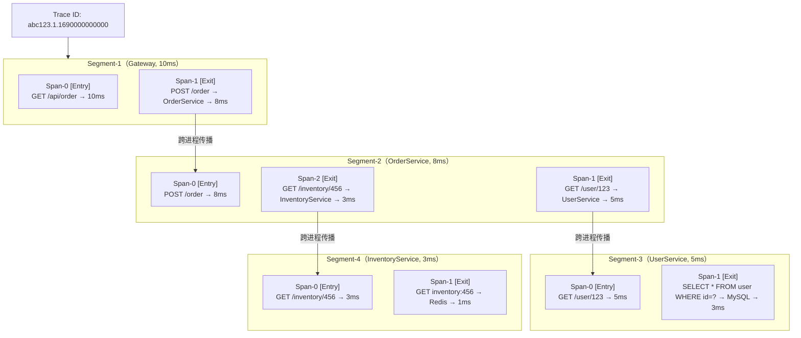

# 04 - SkyWalking 快速上手

## 核心概念

### 1. 环境准备

| 组件 | 要求 | 说明 |
|------|------|------|
| JDK | 11 / 17 / 21 | OAP Server 基于 Java 开发 |
| 操作系统 | Linux / macOS / Windows | 生产环境推荐 Linux |
| 内存 | OAP ≥ 2GB，整体 ≥ 4GB | 根据 Agent 数量调整 |
| 存储 | 默认 H2（Demo），生产用 BanyanDB/ES | H2 仅用于测试 |

### 2. 下载与目录结构

**下载地址**：[https://skywalking.apache.org/downloads/](https://skywalking.apache.org/downloads/)



### 3. 启动流程

#### 3.1 单机部署（开发/测试）

**方式一：一键启动**

```bash
# 进入 SkyWalking 目录
cd apache-skywalking-apm-bin/

# 一键启动 OAP + UI
bin/startup.sh
```

**方式二：分步启动（推荐调试时使用）**

```bash
# 1. 启动 OAP Server（默认端口：11800 gRPC，12800 HTTP）
bin/oapService.sh

# 2. 启动 UI（默认端口：8080）
bin/webappService.sh
```

#### 3.2 核心配置（config/application.yml）

```yaml
# config/application.yml
cluster:
  # 集群模式：standalone（单机）、zookeeper、kubernetes、nacos
  selector: ${SW_CLUSTER:standalone}
  standalone: {}

core:
  # 数据存储选择
  selector: ${SW_STORAGE:h2}
  # 其他存储类型：elasticsearch、banyandb、mysql、opensearch

storage:
  # H2（默认，仅用于测试）
  h2:
    driver: org.h2.jdbcx.JdbcDataSource
    url: jdbc:h2:mem:skywalking-oap-db
    # 生产环境可改为文件模式：
    # url: jdbc:h2:file:~/skywalking-data

  # Elasticsearch（生产推荐）
  # elasticsearch:
  #   namespace: ${SW_NAMESPACE:""}
  #   clusterNodes: ${SW_STORAGE_ES_CLUSTER_NODES:localhost:9200}
  #   protocol: ${SW_STORAGE_ES_HTTP_PROTOCOL:"http"}
  #   dayStep: ${SW_STORAGE_DAY_STEP:1}       # 按天分索引
  #   indexReplicas: ${SW_STORAGE_ES_INDEX_REPLICAS:1}
  #   indexShards: ${SW_STORAGE_ES_INDEX_SHARDS:1}
  #   # TTL 配置
  #   recordDataTTL: ${SW_STORAGE_ES_RECORD_DATA_TTL:3}     # 记录数据保留3天
  #   metricsDataTTL: ${SW_STORAGE_ES_METRICS_DATA_TTL:7}    # 指标数据保留7天

receiver-sharing-server:
  # 默认 gRPC 接收端口
  selector: ${SW_RECEIVER_SHARING_SERVER:default}
  default:
    restHost: ${SW_RECEIVER_SHARING_REST_HOST:0.0.0.0}
    restPort: ${SW_RECEIVER_SHARING_REST_PORT:12800}
    gRPCHost: ${SW_RECEIVER_SHARING_GRPC_HOST:0.0.0.0}
    gRPCPort: ${SW_RECEIVER_SHARING_GRPC_PORT:11800}
```

**关键端口说明**：

| 端口 | 协议 | 用途 |
|------|------|------|
| 11800 | gRPC | Agent 向 OAP 上报 Trace/Metrics/Logs 数据 |
| 12800 | HTTP | UI 查询 OAP 数据（GraphQL API） |
| 8080 | HTTP | SkyWalking UI 前端页面 |

### 4. Java Agent 接入

#### 4.1 下载 Agent

```bash
# 从官方下载页面获取最新版 skywalking-agent.jar
# 或者从 SkyWalking 发行包中复制 agents/skywalking-agent.jar
```

#### 4.2 启动应用时挂载 Agent

```bash
# 方式一：直接指定 JVM 参数
java -javaagent:/path/to/skywalking-agent.jar \
     -DSW_AGENT_NAME=your-service-name \
     -DSW_AGENT_COLLECTOR_BACKEND_SERVICES=127.0.0.1:11800 \
     -jar your-app.jar

# 方式二：IDEA 中配置 VM options
# Run → Edit Configurations → VM options:
# -javaagent:/path/to/skywalking-agent.jar
# -DSW_AGENT_NAME=your-service-name
# -DSW_AGENT_COLLECTOR_BACKEND_SERVICES=127.0.0.1:11800
```

#### 4.3 Agent 核心配置项

Agent 配置文件位于 `skywalking-agent.jar` 同级目录的 `agent.config` 或 `config/agent.config`：

```properties
# 服务名称（必填，Agent 以此标识服务）
agent.service_name=${SW_AGENT_NAME:your-service-name}

# OAP 后端地址（必填，Agent 上报数据的目标）
collector.backend_service=${SW_AGENT_COLLECTOR_BACKEND_SERVICES:127.0.0.1:11800}

# 日志级别
logging.level=${SW_LOGGING_LEVEL:INFO}

# 采样率：-1 全采样，0 不采样，1-10000 采样 N 个 Trace 中的一个
agent.sample_n_per_3_secs=${SW_AGENT_SAMPLE:-1}

# 忽略的端点（URL 后缀）
agent.ignore_suffix=${SW_AGENT_IGNORE_SUFFIX:.jpg,.jpeg,.js,.css,.png,.bmp,.gif,.ico,.woff,.woff2}

# 跨线程传播的最大深度
agent.span_limit_per_segment=${SW_AGENT_SPAN_LIMIT:300}

# 是否上报 JVM 指标
agent.jvm_metrics.enabled=${SW_AGENT_JVM_METRICS_ENABLED:true}
```

#### 4.4 Spring Boot 项目接入示例

```java
// 不需要任何代码改动！只需在启动参数中添加 -javaagent

@SpringBootApplication
@RestController
public class DemoApplication {

    @GetMapping("/hello")
    public String hello() {
        // 这个请求会被 SkyWalking Agent 自动拦截
        // 生成 Entry Span，并上报到 OAP
        return "Hello SkyWalking!";
    }

    @GetMapping("/call-downstream")
    public String callDownstream() {
        // 调用下游服务，Agent 自动生成 Exit Span
        // 并在 HTTP Header 中注入 sw8 上下文
        restTemplate.getForObject("http://service-b/api", String.class);
        return "OK";
    }

    public static void main(String[] args) {
        SpringApplication.run(DemoApplication.class, args);
    }
}
```

### 5. 第一个 Trace

#### 5.1 验证 Agent 接入成功

1. 启动应用后，查看应用日志：

```
INFO  - SkyWalking agent 9.x.x starting...
INFO  - Service name: your-service-name
INFO  - Backend service: 127.0.0.1:11800
INFO  - Agent registered successfully.
```

2. 访问 SkyWalking UI（http://localhost:8080），查看「服务」列表：



#### 5.2 查看 Trace 详情

1. 点击「追踪」菜单，可以看到最近的 Trace 列表
2. 点击一个 Trace，查看调用链详情：



时间线视图：



### 6. 多服务调用链路示例

#### 6.1 场景说明



#### 6.2 在 SkyWalking UI 中看到的拓扑



#### 6.3 对应的完整 Trace



---

## 常见面试题

### Q1: SkyWalking Agent 是如何做到零侵入的？

Java Agent 依赖 **JVM 的 Instrumentation 机制**：

1. `-javaagent:skywalking-agent.jar` 启动时，JVM 在加载 `main` 类之前，先加载 Agent 的 `premain` 方法
2. `premain` 中向 JVM 注册 `ClassFileTransformer`
3. 当业务类被加载时，JVM 调用 `ClassFileTransformer.transform()` 方法
4. SkyWalking 使用 **ByteBuddy** 修改字节码，在目标方法前后插入拦截逻辑
5. 整个过程不修改源码，不修改编译后的 class 文件，只在运行时动态修改

### Q2: Agent 上报数据失败怎么办？

SkyWalking Agent 有完善的重试和容错机制：

1. **异步上报**：Agent 使用独立线程池异步上报，不阻塞业务线程
2. **重连机制**：gRPC 连接断开后自动重连（指数退避）
3. **数据缓冲**：内存中缓冲未上报的 Trace 数据，超出上限时丢弃最旧数据
4. **业务不中断**：Agent 上报失败不会影响业务请求的处理

### Q3: SkyWalking 对应用性能有多少影响？

| 操作 | 性能影响 | 说明 |
|------|---------|------|
| Span 创建 | < 1μs | 纯内存操作 |
| 上下文注入/提取 | < 1μs | Header 编解码 |
| 数据上报 | 异步 | 独立线程池，不阻塞业务 |
| 整体 CPU 开销 | < 5% | 正常负载下 |
| 整体内存开销 | ≈ 50MB | Agent 自身内存占用 |

**关键设计**：SkyWalking 将 Span 数据先放入内存缓冲区（队列），异步批量上报，确保业务线程不会被 I/O 阻塞。

---

## 延伸阅读

- SkyWalking 官方 Quick Start：[https://skywalking.apache.org/docs/main/latest/en/setup/quick-start/](https://skywalking.apache.org/docs/main/latest/en/setup/quick-start/)
- Java Agent 规范：JSR-163（Java Platform Profiling Architecture）