# 08 - SkyWalking 探针原理（Java Agent）

## 核心概念

### 1. Java Agent 机制概述

SkyWalking Java Agent 是整个 SkyWalking 生态中最核心的组件之一，它利用 JVM 提供的 **Instrumentation 机制**，在运行时动态修改字节码，实现对业务代码的零侵入监控。

#### 1.1 JVM Instrumentation 基础

Java 从 JDK 1.5 开始提供 `java.lang.instrument` 包，支持两种 Agent 加载方式：

| 加载方式 | 入口方法 | 时机 | 使用场景 |
|---------|---------|------|---------|
| **静态加载** | `premain(String agentArgs, Instrumentation inst)` | JVM 启动时，main 方法执行前 | SkyWalking 的默认方式 |
| **动态加载** | `agentmain(String agentArgs, Instrumentation inst)` | JVM 运行中，通过 Attach API 动态附加 | Arthas 热诊断工具 |

**SkyWalking 使用静态加载方式**，通过 `-javaagent` 启动参数指定。

#### 1.2 Agent 的 MANIFEST.MF

```properties
# skywalking-agent.jar 的 META-INF/MANIFEST.MF
Manifest-Version: 1.0
Premain-Class: org.apache.skywalking.apm.agent.SkyWalkingAgent
Can-Redefine-Classes: true
Can-Retransform-Classes: true
```

- `Premain-Class`：指定 Agent 入口类
- `Can-Redefine-Classes`：允许重新定义类
- `Can-Retransform-Classes`：允许重新转换类（SkyWalking 使用 `retransform` 而非 `redefine`）

### 2. Agent 启动流程

#### 2.1 整体启动流程

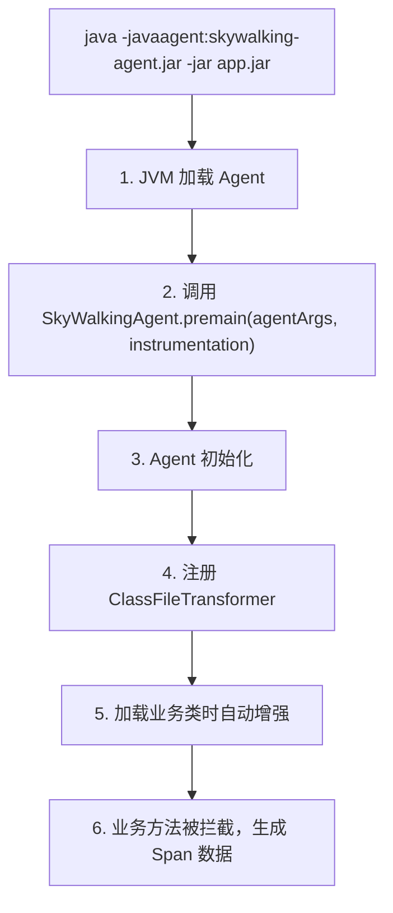

#### 2.2 详细启动流程（源码分析）

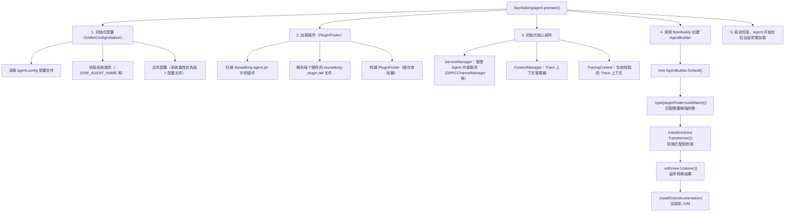

### 3. 类加载隔离

#### 3.1 为什么需要类加载隔离？

类加载隔离是所有 APM 探针的**核心技术难题**，不做隔离的 Agent 在生产环境中 100% 会出问题。

**场景 1：依赖版本冲突（最常见）**

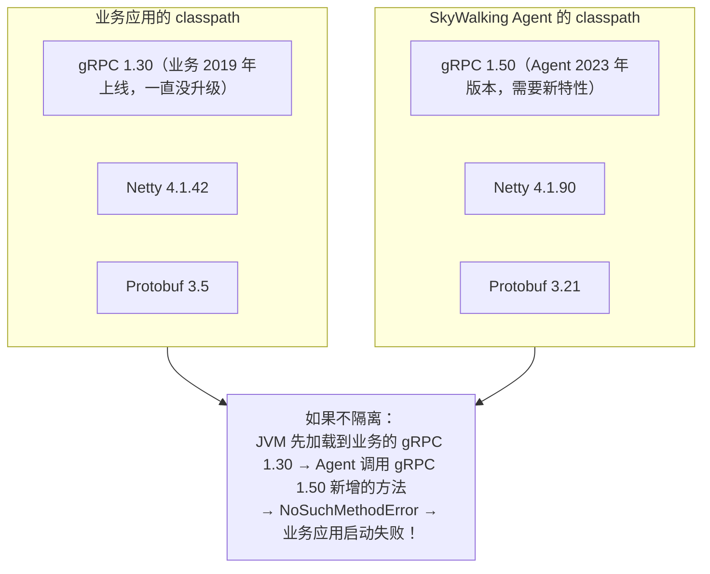

**场景 2：类重复加载问题**

Agent 会增强很多业务类（如 `@RestController`、`@Service`），如果 Agent 和业务用同一个 ClassLoader：

```
同一个类被加载两次：
  1. AppClassLoader 加载业务类 UserController
  2. Agent 增强后，ByteBuddy 又生成一个 UserController$Enhanced

结果：
  instanceof 判断失效 → UserController.class != UserController$Enhanced.class
  强转失败 → ClassCastException
  Spring 依赖注入失败 → 应用启动崩溃
```

**场景 3：SPI 服务发现污染**

很多框架用 Java SPI 机制（如 JDBC Driver、SLF4J），如果不隔离：

```
Agent 的 SLF4J binding ←→ 业务的 SLF4J binding
  ↓
SPI 服务发现时，两个 binding 都被加载
  ↓
SLF4J 报 "multiple bindings" 警告，随机选一个
  ↓
Agent 的日志打到业务的日志文件里，或者反过来
```

**类加载隔离的本质**：让 Agent 的依赖和业务的依赖分别放在不同的「命名空间」里，互不干扰。

#### 3.2 AgentClassLoader 设计

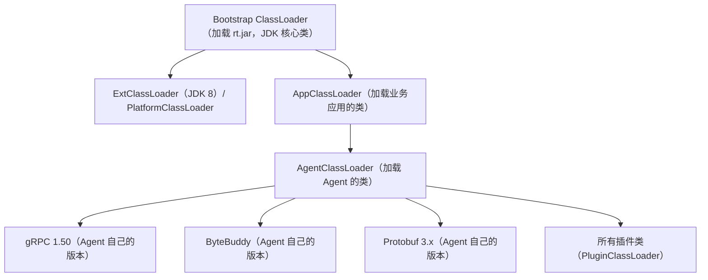

**关键设计**：
1. AgentClassLoader 以 AppClassLoader 为父加载器（可以访问业务类）
2. Agent 的第三方依赖放在 AgentClassLoader 中（与业务依赖隔离）
3. 插件类使用独立的 PluginClassLoader（插件之间隔离）

#### 3.3 Pinpoint 也用了类加载隔离吗？

**用了，而且比 SkyWalking 更复杂**。

Pinpoint 作为最早开源的 APM 探针（2014 年），在类加载隔离上踩了很多坑，它的隔离方案比 SkyWalking 更激进：

| 对比维度 | SkyWalking | Pinpoint |
|---------|-----------|---------|
| **核心类加载器 | AgentClassLoader | IsolatedClassLoader |
| **插件隔离** | PluginClassLoader（每个插件独立） | BootstrapPlugin + AgentPluginClassLoader |
| **Bootstrap 类注入 | ✅ 用 Instrumentation.appendToBootstrapClassLoaderSearch | ✅ 同样用 Bootstrap 注入 |
| **类加载顺序** | 双亲委派（先查自己，再查父加载器 | 完全打破双亲委派（**先自己加载，找不到再问父要**） |
| **隔离粒度** | Agent vs 业务 | Agent vs 业务 vs 插件之间 |

**Pinpoint 为什么要打破双亲委派？**

Pinpoint 诞生于 2014 年，当时 ByteBuddy 还不成熟，Pinpoint 选择了 ASM 做字节码增强，同时遇到了更极端的类加载冲突问题：

```
问题：某些中间件自己有类加载器（如 Tomcat 的 WebAppClassLoader）

  Tomcat WebAppClassLoader
    ├── 每个 WebApp 有自己的 classpath
    └── 不遵循双亲委派（先查自己，再查父）

如果 Agent 用正常的双亲委派：
  Agent 的类放在父加载器里 → WebApp 里的类看不到 Agent 的类
  → 插件无法增强 WebApp 里的类

Pinpoint 的解决方案：
  把 Agent 的核心类注入到 Bootstrap ClassLoader 里
  → 所有类加载器都能看到
  → 不管中间件的自定义类加载器也能访问 Agent 的类
```

**代价**：把 Agent 的类注入 Bootstrap 后，优先级极高，一旦出问题就是 JVM 直接 crash。所以 Pinpoint 的 Agent 稳定性问题一度是社区吐槽的重点。

#### 3.4 OpenTelemetry Java Agent 的类加载隔离方案

OTel 走了第三条路：**不做 ClassLoader 级别的隔离，而是用 Maven Shade 插件把所有依赖「重命名打包」**。

**OTel 的做法：影子类（Shaded Classes）**

```
OTel Agent 构建时：
  ├── 把 gRPC 1.50 的包名从 io.grpc → io.opentelemetry.shaded.grpc
  ├── 把 Netty 4.1.90 的包名从 io.netty → io.opentelemetry.shaded.netty
  ├── 把 Protobuf 3.21 的包名从 com.google.protobuf → io.opentelemetry.shaded.protobuf
  └── 所有内部依赖全部重命名

结果：
  业务的 io.grpc 1.30 和 OTel 的 io.opentelemetry.shaded.grpc 1.50
  是完全不同的两个类，不存在版本冲突！
```

#### 3.5 灵魂拷问：为什么 Pinpoint 必须打破双亲委派，而 SkyWalking 只局部打破、OTel 不打破？

**根本原因：三者对「类可见性」的要求不同，增强策略不同。**

| 对比维度 | Pinpoint | SkyWalking | OpenTelemetry |
|---------|---------|-----------|--------------|
| **增强范围** | 一切方法调用（大范围增强 JDK 核心类） | 绝大多数框架入口点（极少数 JDK 核心类） | 中间增强（比 SW 多，比 Pinpoint 少） |
| **增强 JDK 核心类** | ✅ 大范围（如 `java.net.Socket`） | ⚠️ 极少数（几个 Bootstrap 插件，如 `HttpURLConnection`） | ⚠️ 部分（可选） |
| **对类可见性的要求** | 极高（Bootstrap 也要能看到拦截器） | 中等（绝大多数走 AppClassLoader 即可） | 高（但用影子类绕过去） |
| **Bootstrap 注入** | ✅ 必须（大范围） | ⚠️ 极少数场景（Bootstrap 插件） | ⚠️ 部分（Agent 核心类） |
| **打破双亲委派** | ✅ 大范围打破（自定义加载顺序 + 大量 Bootstrap 注入） | ✅ **局部打破**（AgentClassLoader 用 child-first 子优先策略，见下文说明） | ❌ 不打破（用影子类绕过） |

---

**① Pinpoint 为什么必须打破双亲委派？**

**核心诉求：要增强 JDK 核心类，还要适配 Tomcat 的反双亲委派。**

场景 1：增强 JDK 核心类（如 `java.net.Socket`）

```
java.net.Socket 由 Bootstrap ClassLoader 加载

  如果 Pinpoint 的拦截器放在 AgentClassLoader：
    Bootstrap 是父加载器，看不到子加载器（AgentClassLoader）的类
    → Socket 增强后调用拦截器 → ClassNotFoundException
    → 增强失败！

  唯一解：
    把拦截器核心类注入 Bootstrap ClassLoader
    → Bootstrap 能看到拦截器 → 增强成功
```

场景 2：适配 Tomcat WebAppClassLoader

```
Tomcat WebAppClassLoader 故意打破双亲委派：
  1. 先在自己的 WebApp classpath 里找
  2. 找不到再问父加载器要

  如果 Agent 的类放在父加载器（AgentClassLoader）：
    WebApp 里的 Servlet 类看不到父加载器的类
    → 插件无法增强 Servlet

  Pinpoint 的解决方案：
    把核心类注入 Bootstrap
    → Bootstrap 是所有类加载器的根
    → 所有类加载器都能看到
```

结果：**Pinpoint 能增强任何类，兼容性最强，但代价是风险最高**。

---

**② SkyWalking 打破双亲委派了吗？打破了，但是"局部、受控"地打破！**

> ⚠️ **重要修正**：之前说"SkyWalking 不需要打破双亲委派"是**不准确**的。准确的说法是：**SkyWalking 也打破了双亲委派，但只在 AgentClassLoader 内部局部打破，不像 Pinpoint 那样全局打破**。

**SkyWalking 打破双亲委派的方式：AgentClassLoader 采用 child-first（子优先）策略**

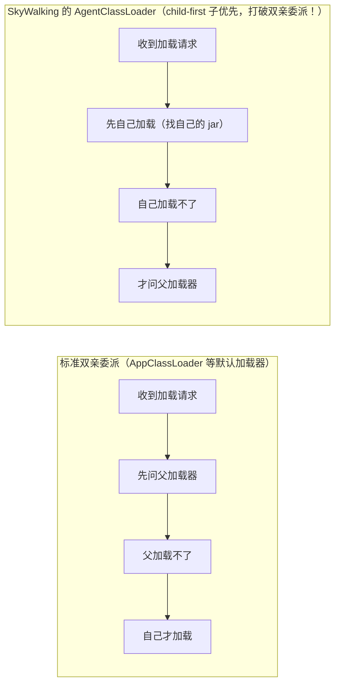

**为什么要这样打破？为了 Agent 和业务的依赖隔离：**

```
业务应用用了 gRPC 1.30
SkyWalking Agent 用了 gRPC 1.50

如果 AgentClassLoader 遵循双亲委派（先问父）：
  -> 加载 gRPC 类时，先问 AppClassLoader
  -> AppClassLoader 加载到了业务的 gRPC 1.30
  -> Agent 拿到 1.30，调用 1.50 的新方法 -> NoSuchMethodError！

所以 AgentClassLoader 必须 child-first（先自己加载）：
  -> 加载 gRPC 类时，先在自己的 jar 里找
  -> 找到 Agent 自己的 gRPC 1.50 -> 用这个！
  -> 业务的 gRPC 1.30 和 Agent 的 1.50 完全隔离！
```

**核心诉求：增强"框架入口点"，只在极少数场景增强 JDK 核心类。**

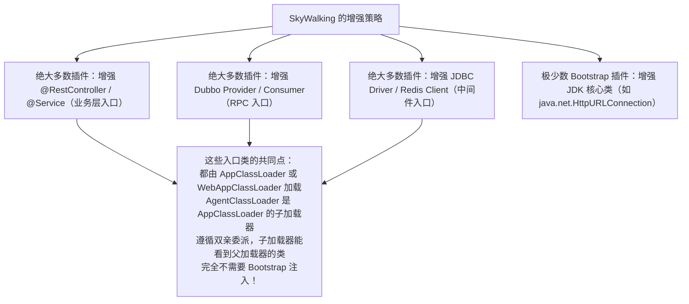

结果：**SkyWalking 的插件数量比 Pinpoint 少，但稳定性更好**——Pinpoint 追求"全链路无死角"，SkyWalking 追求"覆盖 99% 场景，牺牲 1% 换稳定性"。

> ⚠️ **澄清一个常见误解**：说"SkyWalking 完全不增强 JDK 核心类"是**过度简化**。准确的说法是：SkyWalking 增强极少数 JDK 核心类（几个 Bootstrap 插件，如拦截 `HttpURLConnection`），绝大多数是第三方框架；Pinpoint 大范围增强 JDK 核心类。两者是**"量"的区别，不是"有/无"的区别**。但因为 SkyWalking 增强 JDK 核心类的场景极少，核心结论仍成立：**Pinpoint 必须大范围注入 Bootstrap，SkyWalking 只在极少数场景注入 Bootstrap**。详见第 9 章 2.3 节 Bootstrap 插件、Q2 的详细说明。

---

**③ OTel 为什么不需要打破双亲委派？**

**核心诉求：我根本不玩类加载器这套，我用影子类绕过去。**

```
OTel 的思路：
  我不管你是 Bootstrap 还是 WebAppClassLoader
  我把所有依赖全部重命名（io.grpc → io.opentelemetry.shaded.grpc）
  我把核心类全部打在 Agent JAR 里
  我用 ByteBuddy 的 ClassInjector 把拦截器注入到正确的类加载器
  → 根本不需要关心双亲委派的问题
```

结果：**OTel 的兼容性最好，不需要搞类加载器黑科技，但代价是 JAR 包最大**。

---

**一句话总结三种设计哲学**：

| APM | 路线 | 一句话总结 |
|------|------|----------|
| **Pinpoint** | 打破双亲委派 + Bootstrap 注入 | 我爬到最高的地方，所有人都能看到我，我也能看到所有人 |
| **SkyWalking** | 自定义 ClassLoader + child-first 局部打破 | 我建一堵墙，你在那边，我在这边，互不干扰（但墙里我按自己的规矩来） |
| **OpenTelemetry** | Maven Shade 影子类 | 我改个名字，你认不出我，就不会和我冲突了 |

---

#### 3.6 三种隔离方案的性能对比：OTel的影子类会影响性能吗？ ⭐⭐⭐

这是一个非常好的工程trade-off问题。答案是：**有影响，但影响很小，且主要体现在启动阶段，运行时几乎无影响**。

让我们从六个维度详细对比：

| 性能维度 | 自定义ClassLoader（SkyWalking） | Bootstrap注入（Pinpoint） | Maven Shade影子类（OTel） |
|---------|-------------------------------|-------------------------|-------------------------|
| **Jar包大小** | ✅ 小（~10MB） | ✅ 小（~15MB） | ❌ 大（~25-30MB） |
| **类加载时间** | ✅ 正常 | ⚠️ 较慢（Bootstrap搜索路径长） | ⚠️ 稍慢（Jar大，IO时间长） |
| **运行时性能** | ✅ 几乎无影响 | ✅ 几乎无影响 | ✅ 几乎无影响 |
| **内存占用** | ✅ 正常 | ⚠️ 略高（Bootstrap元空间） | ⚠️ 略高（重复依赖占两份） |
| **JIT编译** | ✅ 无影响 | ✅ 无影响 | ✅ 无影响 |
| **GC影响** | ✅ 无影响 | ✅ 无影响 | ✅ 无影响 |

---

##### ① 为什么运行时几乎没有影响？

因为Maven Shade做的事情非常"纯粹"——**只是把字节码里的包名字符串替换了**，字节码本身的逻辑完全没变！

```
Shade之前的字节码：
  com.google.common.cache.CacheBuilder.newBuilder()
  
Shade之后的字节码：
  io.opentelemetry.shaded.com.google.common.cache.CacheBuilder.newBuilder()
```

**包名改了，但方法里的每一条字节码指令都一模一样！** JVM执行的时候，根本不关心你包名叫什么，只关心指令本身。所以运行时性能是完全一样的！

---

##### ② 性能影响主要体现在哪里？

**影响1：Jar包变大，下载和启动时的IO时间变长**
- OTel Agent：~25MB
- SkyWalking Agent：~10MB
- Pinpoint Agent：~15MB

这15MB的差距，在千兆网络下也就是多100毫秒，普通硬盘IO下多0.1秒，完全感知不到。

**影响2：如果业务也用了同一个库，内存里会有两份**

```
业务用了Guava 31.1（在AppClassLoader里）
  ↓
OTel也shade了Guava 31.1（在AgentClassLoader里）
  ↓
方法区里有两份一模一样的Guava类，只是包名不同
  ↓
多占用了 ~5-10MB 的元空间内存
```

对于现在动辄几GB内存的服务器来说，多10MB根本不算事。

**影响3：类加载时的字符串匹配稍微慢一点点**
- 类加载器需要做更多的字符串匹配（长包名）
- 这个影响是纳秒级别的，完全可以忽略

---

##### ③ 横向对比：三种方案的性能开销排序

**性能开销从低到高排序：**
```
1. 自定义ClassLoader（SkyWalking） → 几乎零开销
     ↓ 几乎一样
2. Maven Shade影子类（OTel） → 启动慢几毫秒，内存多几MB
     ↓ 差距开始拉大
3. Bootstrap注入（Pinpoint） → 类搜索路径变长，全局影响所有类加载
```

**为什么Pinpoint开销最大？**
因为Bootstrap ClassLoader的搜索路径是全局的，**每一个类加载的时候都要先扫一遍Bootstrap的路径**。把大量Agent类注入Bootstrap后，所有类的加载速度都会变慢一点点——这是全局影响，不是只影响Agent自己的类！

---

##### ④ OTel为什么明知有开销还要选影子类？

**因为兼容性的优先级远高于那几毫秒的启动开销！**

现实世界的Java应用有多混乱，你永远想象不到：
- 有的老应用还用着Log4j 1.2（2015年就EOL了）
- 有的应用把自定义类加载器玩出花来（OSGi、JBoss Modules）
- 有的应用同时依赖了5个版本的Guava

对于OTel来说：
- **99%的应用**：那几毫秒的启动开销，用户根本感知不到
- **1%的极端应用**：如果不用影子类，直接就冲突了，Agent根本跑不起来

**这是一个非常聪明的工程trade-off：用99%用户感知不到的微小性能损失，换取了100%的兼容性覆盖。**

---

##### ⑤ 面试延伸：三种方案的选型决策树

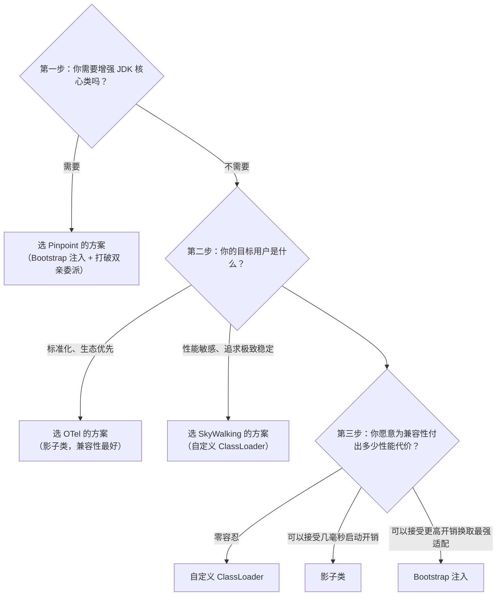

#### 3.7 灵魂拷问：方向搞反了！到底是谁看不到谁？ ⭐⭐⭐⭐⭐

这是90%的人都会搞混的问题，也是理解类加载器可见性的关键！

---

##### 你的问题：方向搞反了！

你问的是：**"我的APM通过AgentClassLoader加载，属于Bootstrap的子加载器，为什么看不到JDK的核心方法和类呢？"**

**答案是：AgentClassLoader 完全能看到 JDK 核心类！** 子加载器能看到父/祖先加载器的类，这是双亲委派的基本规则，从来没有被打破过。

**你真正想问的是（你自己都没意识到方向搞反了）：**
> "为什么被增强的 JDK 核心类（由 Bootstrap 加载），看不到 AgentClassLoader 里的拦截器类？"

**这才是真正的问题！方向完全反了！**

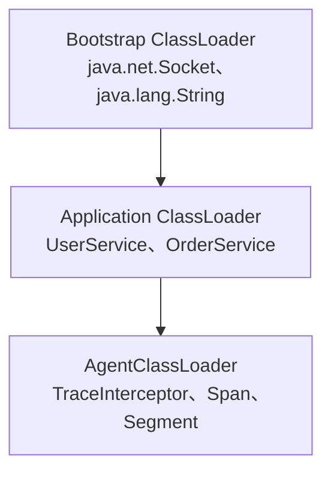

**✅ 能看到：子 → 父（下 → 上）**
- AgentClassLoader（最下层）能看到 Bootstrap 加载的 java.net.Socket
- 子加载器能看到所有祖先加载器的类，这是双亲委派的基本规则

**❌ 看不到：父 → 子（上 → 下）**
- Bootstrap 加载的 java.net.Socket，看不到 AgentClassLoader 里的 TraceInterceptor！
- **这才是Pinpoint必须把拦截器注入到Bootstrap的根本原因！**

---

##### 场景还原：增强 java.net.Socket 时到底发生了什么？

让我们一步步拆解增强过程中到底发生了什么：

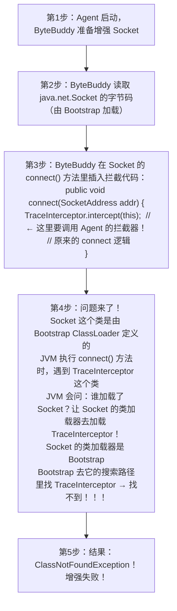

**这就是问题的本质：不是 Agent 看不到 JDK 的类，而是 JDK 的类看不到 Agent 的类！**

---

##### 一个生活化的类比（看完这辈子都不会忘）

想象一下公司组织架构：
- **Bootstrap ClassLoader** = 董事长（在顶楼办公）
- **AgentClassLoader** = 外包团队（在公司外面的办公楼办公）

**✅ 能看到的情况（子 → 父）：**
- 外包员工（AgentClassLoader）来公司开会，当然能见到董事长（Bootstrap）
- 子加载器当然能看到父加载器的类，这是天经地义的

**❌ 看不到的情况（父 → 子）：**
- 董事长（Bootstrap）在自己的办公室开会，想找一个外包员工（TraceInterceptor）
- 董事长根本不知道外面还有个外包办公楼！去哪里找？
- 结果：找不到人（ClassNotFoundException）

**Pinpoint 的解决方案是什么？**
- 把外包员工的工号注册到公司总部的通讯录里（把 TraceInterceptor 注入到 Bootstrap ClassLoader 的搜索路径）
- 这样董事长找人的时候，一翻通讯录就找到了！

---

##### 延伸思考：为什么普通 Spring 应用不会遇到这个问题？

```
场景：你想增强 UserController（由 Application ClassLoader 加载）
  ↓
UserController 的类加载器 = Application ClassLoader
  ↓
AgentClassLoader 是 ApplicationClassLoader 的子加载器吗？
不！恰恰相反！AgentClassLoader 的父加载器是 ApplicationClassLoader！
  ↓
等等，这不是又搞反了吗？
  ↓
不！ByteBuddy 会把拦截器注入到被增强类的同一个类加载器里！
  ↓
UserController 是 ApplicationClassLoader 加载的
ByteBuddy 把拦截器也注入到 ApplicationClassLoader 里
  ↓
UserController 当然能看到同一个类加载器里的拦截器了！
  ↓
所以增强业务类/框架类根本不需要 Bootstrap 注入！
```

**这就是 SkyWalking 增强业务类时为什么不需要 Bootstrap 注入的第二个原因：** ByteBuddy 会把拦截器注入到目标类的同一个类加载器里，从根源上避免了可见性问题！
>
> ⚠️ 注意：这里说的"不需要 Bootstrap 注入"是针对**增强业务类/框架类**而言的。SkyWalking 整体上仍然通过 AgentClassLoader 的 child-first 策略**局部打破了双亲委派**（见 3.5 节②），只是这个"打破"发生在 AgentClassLoader 内部，不需要像 Pinpoint 那样大范围注入 Bootstrap。

---

##### 终极总结表（面试可以直接说）

| 问题 | 答案 |
|------|------|
| AgentClassLoader 能看到 JDK 核心类吗？ | ✅ 能！子加载器能看到祖先的类 |
| JDK 核心类能看到 Agent 的拦截器吗？ | ❌ 不能！父加载器看不到子加载器的类 |
| 为什么增强业务类不需要 Bootstrap 注入？ | ByteBuddy 把拦截器注入到目标类的同一个类加载器里 |
| 为什么增强 JDK 核心类必须 Bootstrap 注入？ | 目标类由 Bootstrap 加载，拦截器必须也放在 Bootstrap 里 |
| 到底是谁看不到谁？ | 父看不到子，不是子看不到父！ |

> **🔥 面试必杀句：** 很多人搞反了类加载器的可见性方向，问题的本质不是Agent看不到JDK的类，而是JDK的类看不到Agent的类——因为类加载器的可见性是单向的，子能看到父，父看不到子。

---

#### 3.8 灵魂拷问进阶：Agent 能直接 new Socket()，为什么非要增强它？ ⭐⭐⭐⭐⭐

这是上一节的进阶问题，也是99%的人学完可见性后的下一个困惑：

> **"既然子加载器（AgentClassLoader）能看到父加载器（Bootstrap）的 Socket，那 Agent 代码里直接 `new Socket()` 用 Socket 不就行了？为什么非要把拦截器注入到 Bootstrap？"**

**答案：你混淆了两个完全不同的场景--主动调用 vs 被动回调！**

---

##### 两个场景的对比

| 场景 | 谁调用谁 | 方向 | 能不能行？ | 例子 |
|------|---------|------|----------|------|
| **A. Agent 主动用 Socket** | Agent代码里 `new Socket()` | 子调父（下->上） | ✅ 完全可以 | Agent 想发个 HTTP 请求，用 Socket |
| **B. Socket 回调 Agent 拦截器** | 增强 Socket 后，Socket 执行时通知 Agent | 父调子（上->下） | ❌ 不行 | APM 想监控业务怎么用 Socket |

**APM 增强的本质是场景B，不是场景A！**

---

##### 生活化类比：明星和粉丝

- **Socket** = 明星（Bootstrap加载的，公众人物，大家都认识）
- **Agent 拦截器** = 你这个粉丝（AgentClassLoader加载的，明星不认识你）

**✅ 场景A：你看明星（Agent主动调用Socket）**
- 你（粉丝）看电视、刷微博看明星 -> 你能看到明星 ✅
- Agent代码里 `new Socket()` 调用Socket -> 完全可以 ✅
- **这就是"子加载器能看到父加载器"！**

**❌ 场景B：明星感谢你（Socket回调Agent拦截器）**
- 明星在演唱会上想感谢你这个粉丝 -> 但明星根本不知道你是谁！❌
- Socket被增强后，connect()时想通知拦截器 -> Socket看不到拦截器！❌
- **这就是"父加载器看不到子加载器"！**

**Pinpoint的解决方案：** 把你这个粉丝的名字加到演唱会的嘉宾名单里（把拦截器注入到Bootstrap的搜索路径），这样明星一翻嘉宾名单就能找到你了 ✅

---

##### 关键追问：那为什么不直接用场景A？非要搞场景B？

你可能会想：**"那我Agent代码里直接 `new Socket()` 不就行了，干嘛非要增强Socket？"**

这个问题非常深刻！答案在于 **APM的核心价值 = 无侵入监控**：

```
方案1：包装Socket（场景A的思路）
  ┌──────────────────┐
  │ MySocketWrapper   │  ← 你写的包装类
  │  - 持有 Socket    │
  │  - connect() {    │
  │      记日志       │
  │      socket.connect()│
  │    }              │
  └──────────────────┘

  问题1：业务代码用的是 Socket，不是 MySocketWrapper！
         你得让所有业务代码都改成用 MySocketWrapper -> 侵入式！要改代码！
  问题2：业务可能通过 HttpClient 间接用 Socket，你包不住所有的入口！

方案2：增强Socket（场景B，APM的真正做法）
  ┌──────────────────┐
  │ Socket           │  ← Bootstrap加载的，所有业务都在用
  │  connect() {      │
  │    拦截器.通知()   │  ← 插入钩子，监控所有业务对Socket的使用
  │    原来的connect逻辑│
  │  }                │
  └──────────────────┘

  优势：业务代码完全不用改！所有用Socket的地方都被监控了！
  代价：Socket要回调拦截器，Socket看不到拦截器 -> 必须注入Bootstrap
```

**APM的核心价值是"我监控你，但你不用改代码"--这就注定了必须走增强（场景B）这条路，而不是包装（场景A）这条路！**

---

##### 终极总结：为什么APM必须搞这么复杂？

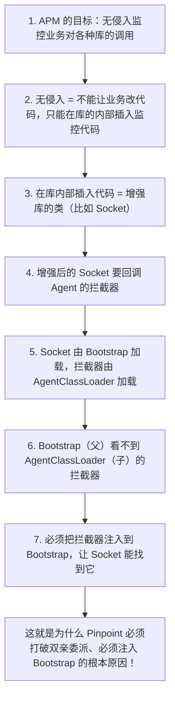

> **🔥 终极面试必杀句：** APM要监控的不是"Agent怎么用Socket"，而是"业务怎么用Socket"。前者是Agent主动调用（子调父，可以），后者是Socket被动通知Agent（父调子，不行）。无侵入监控的要求，注定了APM必须走"增强Socket让它回调拦截器"这条路，也就注定了必须解决"父看不到子"的可见性问题--这就是Pinpoint注入Bootstrap、SkyWalking用ByteBuddy把拦截器注入到目标类加载器的根本原因。

---

### 4. 字节码增强（ByteBuddy）

#### 4.1 为什么选择 ByteBuddy？

| 对比维度 | ByteBuddy（SkyWalking） | ASM（Pinpoint） | Javassist |
|---------|------------------------|-----------------|-----------|
| API 易用性 | ★★★★★ 流式 API | ★★☆☆☆ 需理解字节码指令 | ★★★★☆ 源码级 API |
| 性能 | ★★★★☆ 好 | ★★★★★ 最好 | ★★★☆☆ 一般 |
| 类型安全 | ✅ 编译期检查 | ❌ 运行时错误 | ❌ 运行时错误 |
| 社区活跃度 | ★★★★★ 高 | ★★★☆☆ 中 | ★★★☆☆ 中 |
| 学习曲线 | 低 | 高 | 中 |

**ByteBuddy vs ASM 深度对比**：

| 维度 | ByteBuddy | ASM |
|------|-----------|-----|
| **抽象层级** | 高级 API，面向"类/方法"语义 | 低级 API，面向"字节码指令" |
| **编程模型** | 声明式（DSL 链式调用，描述"做什么"） | 命令式（Visitor 模式，手动操作字节码） |
| **代码示例** | `new ByteBuddy().subclass(Foo.class).method(named("bar")).intercept(...)` | `mv.visitVarInsn(ALOAD, 0); mv.visitMethodInsn(INVOKESTATIC, ...);` |
| **类型安全** | 编译期类型检查，重命名/重构友好 | 字符串常量拼字节码，重构易出错 |
| **字节码知识要求** | 几乎不需要 | 需要深入理解 JVM 字节码指令集、栈帧、常量池 |
| **性能差异** | 接近 ASM（底层也生成字节码），略慢 5-10% | 最接近手写字节码，零开销 |
| **调试难度** | 生成的代码可读，断点调试友好 | 字节码级错误难排查，`VerifyError` 常见 |
| **代表用户** | SkyWalking、Mockito、Hibernate | Pinpoint、CGLIB、Groovy |
| **适用场景** | 业务逻辑拦截、AOP、APM 探针 | 底层框架、字节码分析工具、性能极致场景 |

**选型结论**：
- 选 **ByteBuddy**：大多数场景，特别是 APM 探针（需要快速开发插件、团队不需要字节码专家）
- 选 **ASM**：极致性能场景、字节码分析工具（如 FindBugs/SpotBugs）、需要精确控制字节码的场景

> ⚠️ Pinpoint 选择 ASM 有其历史原因——Pinpoint 诞生于 2014 年，当时 ByteBuddy 还不够成熟（v1.0 于 2014 年发布）。SkyWalking 在 2017 年重构时选用了已经成熟的 ByteBuddy，代表了业界的趋势。

#### 4.2 增强流程

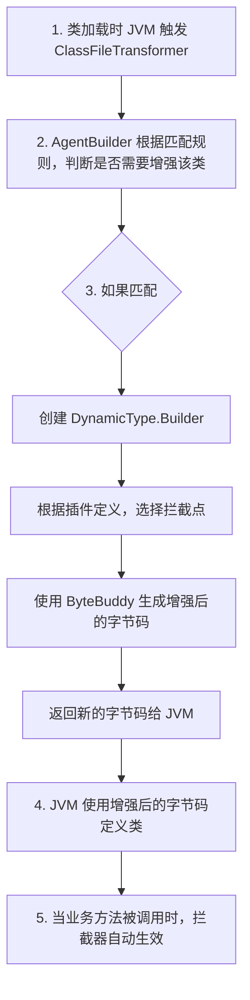

#### 4.3 增强示例

```java
// 原始类（Spring MVC Controller）
@RestController
public class UserController {
    @GetMapping("/user/{id}")
    public User getUser(@PathVariable Long id) {
        return userService.findById(id);  // ← 需要被拦截
    }
}

// 增强后（等价于）
@RestController
public class UserController {
    @GetMapping("/user/{id}")
    public User getUser(@PathVariable Long id) {
        // === Agent 注入的拦截逻辑 ===
        Span span = ContextManager.createEntrySpan(
            "GET:/user/{id}",     // operationName
            null,                 // carrier
            ContextCarrier        // 从请求中提取
        );
        span.setComponent(ComponentsDefine.SPRING_MVC);
        span.setLayer(SpanLayer.HTTP);
        span.setTag("http.method", "GET");
        // === 拦截逻辑结束 ===

        try {
            User user = userService.findById(id);  // 原始业务逻辑
            span.setTag("http.status_code", "200");
            return user;
        } catch (Exception e) {
            span.errorOccurred();
            span.log(e);
            throw e;
        } finally {
            ContextManager.stopSpan();  // 结束 Span
        }
    }
}
```

### 5. 拦截点定义（AbstractClassEnhancePluginDefine）

#### 5.1 插件定义结构

每个插件都继承自 `AbstractClassEnhancePluginDefine`，需要定义以下四个关键要素：

```java
public class SpringMVCInstrumentation extends AbstractClassEnhancePluginDefine {

    // 1. 需要增强的类匹配规则
    @Override
    protected ClassMatch enhanceClass() {
        return ClassMatch.byAnnotation("org.springframework.stereotype.Controller")
            .or(ClassMatch.byAnnotation("org.springframework.web.bind.annotation.RestController"));
    }

    // 2. 拦截的方法匹配规则
    @Override
    protected InstanceMethodsInterceptPoint[] getInstanceMethodsInterceptPoint() {
        return new InstanceMethodsInterceptPoint[] {
            new DeclaredInstanceMethodsInterceptPoint() {
                @Override
                public ElementMatcher<MethodDescription> getMethodsMatcher() {
                    // 匹配带有 @RequestMapping / @GetMapping 等注解的方法
                    return isAnnotatedWith(
                        named("org.springframework.web.bind.annotation.RequestMapping")
                        .or(named("org.springframework.web.bind.annotation.GetMapping"))
                        .or(named("org.springframework.web.bind.annotation.PostMapping"))
                        // ...
                    );
                }

                @Override
                public String getMethodsInterceptor() {
                    return "org.apache.skywalking.apm.plugin.spring.mvc.SpringMVCInterceptor";
                }

                @Override
                public boolean isOverrideArgs() {
                    return false;
                }
            }
        };
    }

    // 3. 验证类是否存在（witness classes）
    @Override
    protected String[] witnessClasses() {
        return new String[] {
            "org.springframework.web.servlet.DispatcherServlet"
        };
    }

    // 4. 插件名称
    @Override
    public String getPluginName() {
        return "spring-mvc";
    }
}
```

#### 5.2 四个关键要素

| 要素 | 方法 | 作用 |
|------|------|------|
| **类匹配** | `enhanceClass()` | 指定哪些类需要增强（按名称、注解、父类、接口） |
| **方法匹配** | `getInstanceMethodsInterceptPoint()` / `getStaticMethodsInterceptPoint()` | 指定类中哪些方法需要拦截 |
| **拦截器** | `getMethodsInterceptor()` | 指定拦截逻辑的实现类 |
| **见证类** | `witnessClasses()` | 可选，验证依赖是否存在（避免类找不到异常） |

#### 5.3 方法拦截器

```java
public class SpringMVCInterceptor implements InstanceMethodsAroundInterceptor {

    @Override
    public void beforeMethod(EnhancedInstance objInst, Method method,
                             Object[] allArguments, Class<?>[] argumentsTypes,
                             MethodInterceptResult result) {
        // 1. 从 HTTP 请求中提取 sw8 上下文
        HttpServletRequest request = (HttpServletRequest) allArguments[0];
        ContextCarrier carrier = new ContextCarrier();
        CarrierItem items = carrier.items();
        while (items.hasNext()) {
            CarrierItem item = items.next();
            item.setHeadValue(request.getHeader(item.getHeadKey()));
        }

        // 2. 创建 Entry Span
        Span span = ContextManager.createEntrySpan(
            request.getMethod() + ":" + request.getRequestURI(),
            carrier
        );

        // 3. 设置 Span 属性
        span.setComponent(ComponentsDefine.SPRING_MVC);
        span.setLayer(SpanLayer.HTTP);
        span.setTag("http.method", request.getMethod());
        span.setTag("url", request.getRequestURL().toString());
    }

    @Override
    public Object afterMethod(EnhancedInstance objInst, Method method,
                              Object[] allArguments, Class<?>[] argumentsTypes,
                              Object ret) {
        // 1. 设置 HTTP 状态码
        HttpServletResponse response = (HttpServletResponse) allArguments[1];
        ContextManager.getActiveSpan()
            .setTag("http.status_code", String.valueOf(response.getStatus()));

        // 2. 判断是否有错误
        if (response.getStatus() >= 500) {
            ContextManager.getActiveSpan().errorOccurred();
        }

        return ret;
    }

    @Override
    public void handleMethodException(EnhancedInstance objInst, Method method,
                                       Object[] allArguments, Class<?>[] argumentsTypes,
                                       Throwable t) {
        // 记录异常
        ContextManager.activeSpan().log(t);
    }
}
```

### 6. 上下文管理（ContextManager）

#### 6.1 核心类图

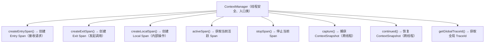

#### 6.2 TracingContext 状态机

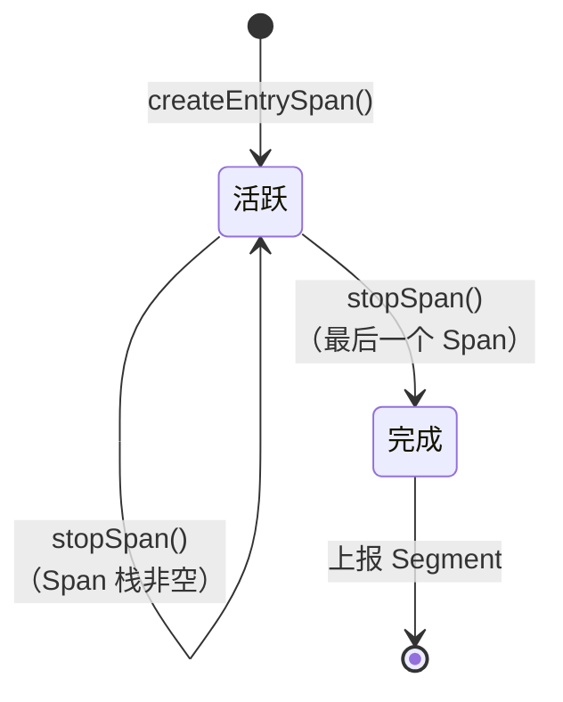

**关键规则**：
1. 每个线程有独立的 `TracingContext`（通过 ThreadLocal 管理）
2. Span 以栈的方式管理（先进后出），`stopSpan()` 关闭当前栈顶的 Span
3. 当所有 Span 都关闭后，整个 Segment 完成，异步上报到 OAP

---

## 常见面试题

### Q1: SkyWalking Agent 是如何做到"零侵入"的？

核心技术：**JVM Instrumentation + ByteBuddy 字节码增强**

1. `-javaagent` 启动时，JVM 在加载 `main` 类之前先加载 Agent 的 `premain` 方法
2. `premain` 中注册 `ClassFileTransformer`
3. 当业务类被类加载器加载时，JVM 触发 `ClassFileTransformer.transform()`
4. ByteBuddy 根据插件定义修改字节码，在目标方法前后插入拦截逻辑
5. 整个过程**不修改源码、不修改 class 文件、不修改类加载器**，只在运行时动态修改字节码

### Q2: 为什么 Agent 需要类加载隔离？如何实现的？

**原因**：Agent 依赖的第三方库（gRPC、ByteBuddy、Protobuf）可能与业务应用版本冲突。例如业务使用 gRPC 1.30，Agent 使用 gRPC 1.50，如果共用类加载器会导致 `NoSuchMethodError`。

**实现**：
- Agent 的核心类和第三方依赖放在 `AgentClassLoader` 中
- `AgentClassLoader` 以 `AppClassLoader` 为父加载器（可以访问业务类）
- 插件类使用独立的 `PluginClassLoader`（插件之间隔离）
- **打破双亲委派**：`AgentClassLoader` 采用 **child-first（子优先）** 策略，加载类时先从自己的 jar 里找，找不到才委派给父加载器（AppClassLoader）。这样 Agent 的依赖（如 gRPC 1.50）和业务的依赖（如 gRPC 1.30）完全隔离，互不干扰
- 插件类使用独立的 `PluginClassLoader`（插件之间也隔离）

### Q3: premain 和 agentmain 有什么区别？

| 对比维度 | premain（静态加载） | agentmain（动态加载） |
|---------|-------------------|---------------------|
| 加载时机 | JVM 启动时，main 之前 | JVM 运行中任意时刻 |
| 启动方式 | `-javaagent:xxx.jar` | Attach API 动态附加 |
| 使用场景 | APM 探针（SkyWalking） | 热诊断工具（Arthas） |
| 类增强 | `retransform`（推荐） | `retransform` |
| 限制 | 无 | 已经加载的类需要 retransform |

SkyWalking 使用 premain 方式，确保在业务类加载之前就注册好 Transformer。

### Q4: 所有 APM 探针都要做类加载隔离吗？三种主流方案有什么区别？

**是的，所有生产级 APM 都必须做类加载隔离**，否则一定会遇到依赖版本冲突、类重复加载、SPI 污染等问题。但实现思路有三种完全不同的路线：

| APM | 隔离方案 | 核心原理 | 设计哲学 | 风险等级 |
|------|---------|---------|---------|---------|
| SkyWalking | **自定义 ClassLoader + child-first 局部打破** | AgentClassLoader 子优先加载，隔离 Agent 依赖与业务依赖 | 局部打破、受控 | ★★☆☆☆ |
| Pinpoint | **全局打破双亲委派 + 大量 Bootstrap 注入** | 核心类注入 Bootstrap ClassLoader，插件独立加载器 | 全局打破、激进 | ★★★★☆ |
| OpenTelemetry | **Maven Shade 影子类** | 构建时重命名所有依赖包名，从根源避免冲突 | 不打破、兼容 | ★☆☆☆☆ |

**一句话总结三种路线：

- **SkyWalking**：我建一堵墙（ClassLoader），墙里我按自己的规矩来（child-first 先自己加载），但不动外面的世界
- **Pinpoint**：我爬到最高的地方（Bootstrap），所有人都能看到我，我也能看到所有人
- **OTel**：我改个名字（shaded），你认不出我，就不会和我冲突了

> ⚠️ OTel 的影子类方案风险最低（完全不碰类加载器），但代价是 Agent JAR 包变大（20MB+），且堆栈可读性差。SkyWalking 的 child-first 方案是局部打破、风险可控、依赖隔离干净，是大多数 APM 的主流选择。Pinpoint 的方案兼容性最强（能增强任何类），但全局打破双亲委派 + 大量 Bootstrap 注入，风险最高。

### Q5: 如果 Agent 配置错误，会不会导致业务应用启动失败？

**不会**。SkyWalking Agent 的设计原则是**"Agent 失败不影响业务"**：

1. 所有 Agent 初始化代码都有 try-catch 保护
2. 如果 Agent 配置错误（如 OAP 地址不可达），Agent 会降级运行（不创建 Span）
3. 业务线程不会因为 Agent 异常而中断
4. Span 创建和上报都是异步的，不会阻塞业务线程

---

## 延伸阅读

- Java Agent 官方规范：[java.lang.instrument (Java SE 11)](https://docs.oracle.com/en/java/javase/11/docs/api/java.instrument/java/lang/instrument/package-summary.html)
- ByteBuddy 官方文档：[https://bytebuddy.net/](https://bytebuddy.net/)
- SkyWalking Agent 源码入口：`apm-agent-core/src/main/java/org/apache/skywalking/apm/agent/SkyWalkingAgent.java`