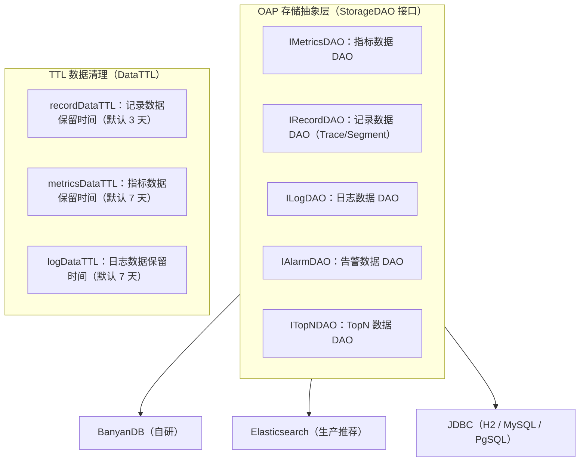
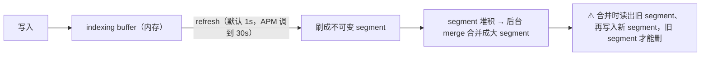
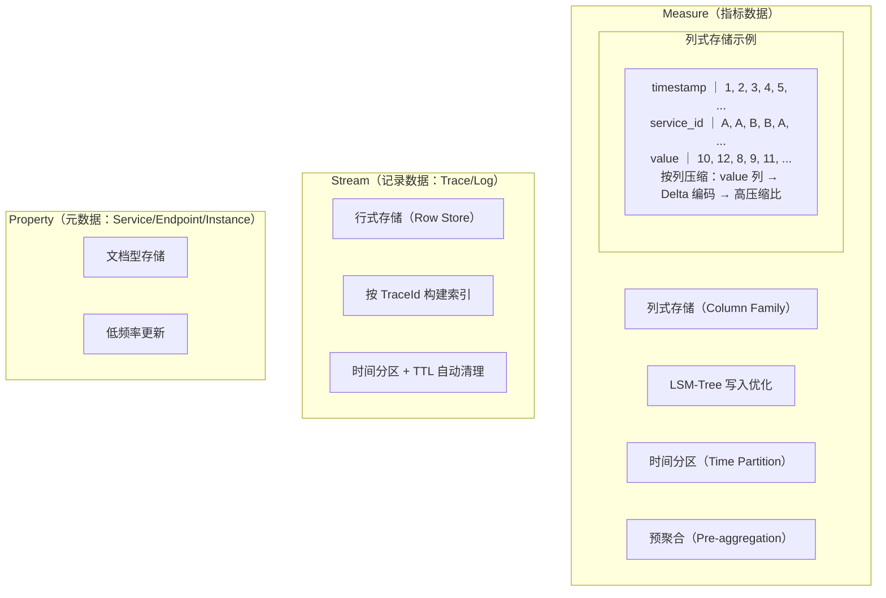
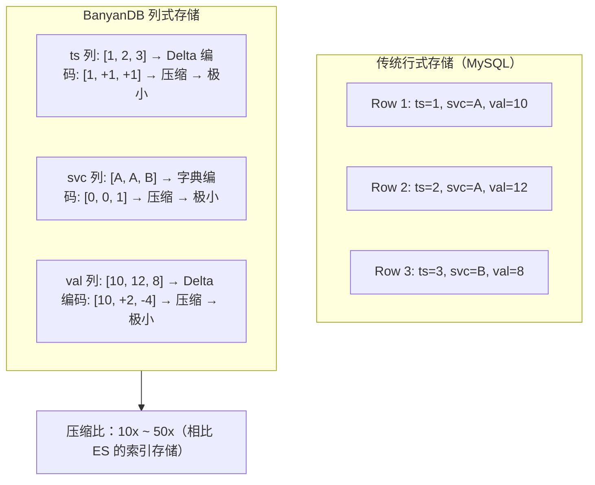
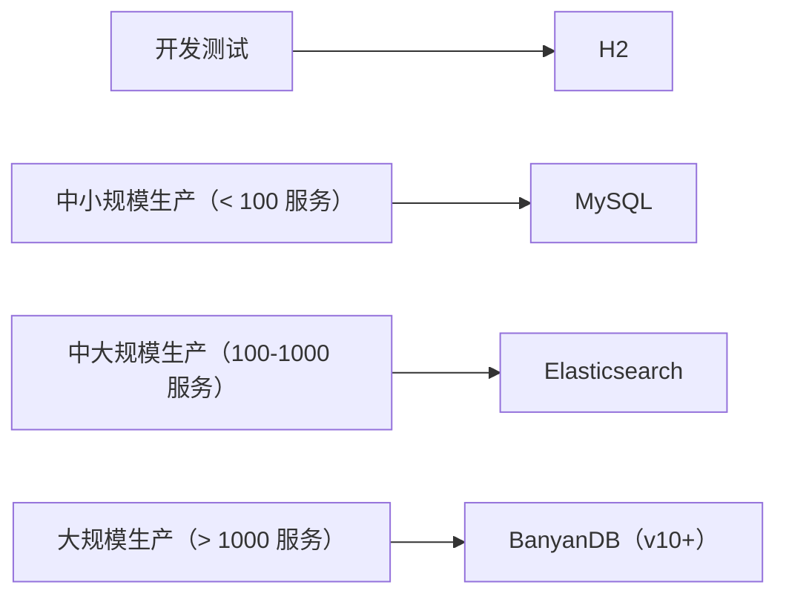
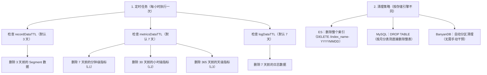

# 13 - SkyWalking 存储引擎

## 核心概念

### 1. 存储引擎全景

SkyWalking OAP 支持多种存储后端，通过 **ModuleProvider 机制** 实现可插拔：



### 2. H2（内存/文件数据库）

#### 2.1 适用场景

- 本地开发测试
- 快速 Demo 演示
- 单机小规模使用

#### 2.2 配置

```yaml
storage:
  selector: ${SW_STORAGE:h2}
  h2:
    driver: org.h2.jdbcx.JdbcDataSource
    url: jdbc:h2:mem:skywalking-oap-db  # 内存模式（重启丢失）
    # url: jdbc:h2:file:~/skywalking-data  # 文件模式（持久化）
    user: ${SW_STORAGE_H2_USER:sa}
    metadataQueryMaxSize: ${SW_STORAGE_H2_QUERY_MAX_SIZE:5000}
    maxSizeOfBatchSql: ${SW_STORAGE_MAX_SIZE_OF_BATCH_SQL:2000}
    asyncBatchPersistentPoolSize: ${SW_STORAGE_ASYNC_BATCH_PERSISTENT_POOL_SIZE:4}
```

#### 2.3 优缺点

| 优点 | 缺点 |
|------|------|
| 零依赖，开箱即用 | 不支持集群 |
| 配置简单 | 内存模式重启丢失数据 |
| 适合快速验证 | 不适合生产环境 |
| 文件模式可持久化 | 并发性能差 |

### 3. MySQL / PostgreSQL（JDBC）

#### 3.1 适用场景

- 中小规模生产环境
- 已有 MySQL 运维经验
- 不想引入 Elasticsearch 的团队
- 数据量 < 亿级

#### 3.2 配置

```yaml
storage:
  selector: ${SW_STORAGE:mysql}
  jdbc:
    # MySQL 配置
    driver: com.mysql.cj.jdbc.Driver
    url: ${SW_JDBC_URL:jdbc:mysql://localhost:3306/sw?rewriteBatchedStatements=true}
    user: ${SW_JDBC_USER:root}
    password: ${SW_JDBC_PASSWORD:root}
    # 连接池配置（HikariCP）
    maxPoolSize: ${SW_JDBC_MAX_POOL_SIZE:20}
    minPoolSize: ${SW_JDBC_MIN_POOL_SIZE:2}
    # 批量写入
    maxSizeOfBatchSql: ${SW_STORAGE_MAX_SIZE_OF_BATCH_SQL:2000}
    asyncBatchPersistentPoolSize: ${SW_STORAGE_ASYNC_BATCH_PERSISTENT_POOL_SIZE:4}
```

#### 3.3 表结构设计

MySQL 存储中，指标数据按时间分表：

```
表命名规则：{metric_name}_{timestamp_suffix}

示例：
- service_cpm_202407             # 2024年7月的 service_cpm 指标
- service_resp_time_202407       # 2024年7月的 service_resp_time 指标
- segment_20240717               # 2024年7月17日的 Segment 记录
```

**为什么按时间分表？**
- 按月分表，避免单表过大
- TTL 清理时直接 DROP 整张表，比 DELETE 高效
- 查询时可以精确路由到具体的表，减少扫描范围

#### 3.4 优缺点

| 优点 | 缺点 |
|------|------|
| 运维团队熟悉 | 写入吞吐量有限（~10K QPS） |
| 生态成熟，工具丰富 | 全文搜索能力弱 |
| 支持事务，数据一致性好 | 水平扩展困难 |
| 成本可控 | 不适合海量数据场景 |

### 4. Elasticsearch（大数据量生产推荐）

#### 4.1 适用场景

- 中大规模生产环境
- 数据量 > 亿级
- 需要全文搜索能力
- 需要高可用部署

#### 4.2 配置

```yaml
storage:
  selector: ${SW_STORAGE:elasticsearch}
  elasticsearch:
    namespace: ${SW_NAMESPACE:""}
    clusterNodes: ${SW_STORAGE_ES_CLUSTER_NODES:localhost:9200}
    protocol: ${SW_STORAGE_ES_HTTP_PROTOCOL:"http"}
    user: ${SW_ES_USER:""}
    password: ${SW_ES_PASSWORD:""}
    # 索引策略
    dayStep: ${SW_STORAGE_DAY_STEP:1}           # 按天分索引
    indexReplicas: ${SW_STORAGE_ES_INDEX_REPLICAS:1}
    indexShards: ${SW_STORAGE_ES_INDEX_SHARDS:1}
    # 滚动索引（逐步淘汰旧索引）
    indexRollingPeriod: ${SW_STORAGE_ES_INDEX_ROLLING_PERIOD:1}
    # 批量写入
    bulkActions: ${SW_STORAGE_ES_BULK_ACTIONS:5000}
    flushInterval: ${SW_STORAGE_ES_FLUSH_INTERVAL:15}
    concurrentRequests: ${SW_STORAGE_ES_CONCURRENT_REQUESTS:2}
    # TTL
    recordDataTTL: ${SW_STORAGE_ES_RECORD_DATA_TTL:3}
    metricsDataTTL: ${SW_STORAGE_ES_METRICS_DATA_TTL:7}
    logDataTTL: ${SW_STORAGE_ES_LOG_DATA_TTL:7}
```

#### 4.3 索引策略

```
ES 索引命名规则：{namespace}_{metric_name}-{YYYYMMDD}

示例：
- sw_service_cpm-20240717
- sw_endpoint_cpm-20240717
- sw_segment-20240717

索引模板：
- 每个指标类型一个索引模板
- 按天滚动索引（每日一个索引）
- TTL 过期后，自动删除旧索引
```

**为什么按天滚动？**
1. 避免单索引过大（影响查询和写入性能）
2. 方便 TTL 清理（删除整个索引比删除文档快得多）
3. 冷热数据分离（热数据在 SSD，冷数据可以迁移到 HDD）

#### 4.4 ES 调优建议

| 参数 | 建议值 | 理由 |
|------|--------|------|
| `indexShards` | 1-3 | 分片过多增加协调开销 |
| `indexReplicas` | 0-1 | 高可用时设为 1，追求性能时设为 0 |
| `refresh_interval` | 30s | 降低刷新频率，减少磁盘 I/O |
| `bulkActions` | 5000 | 批量提交，减少网络开销 |
| `concurrentRequests` | 2 | 控制并发写入，避免 ES 过载 |

#### 4.5 写入放大：为什么 ES 在 APM 场景下"写"得吃力

对比表里提到「索引 + 倒排 -> 10x 写入放大」，这里展开讲清楚放大从哪来。两层叠加：

**第一层：同一份数据存成多个结构**

ES 基于 Lucene，一条文档落盘时不是只写一次，而是同时存成好几种数据结构：

| 数据结构 | 作用 | 说明 |
|------|------|------|
| `_source` | 原始 JSON 全文 | 用于 GET 返回原文，1 份冗余 |
| 倒排索引（Inverted Index） | 每个 `index:true` 字段各建一份 | 全文搜索的基础，**放大主源** |
| `doc_values` | 列式正排 | 排序、聚合用，默认非 text 字段都开 |
| BKD-Tree | 数值/地理/IP 范围查询 | 数值类型有 |
| `translog` | 预写日志 WAL | 先落盘再入内存 buffer |

一个文档有 N 个索引字段，就要建 **N 份倒排**，再加上 `_source`、`doc_values`，同一条数据在磁盘上存了 3~5 遍。

**第二层（更隐蔽、更致命）：Lucene Segment 合并重写**



一次数据在它的生命周期里可能被**重写 3~5 次**，这部分磁盘 I/O 是"白干"的——业务只写一份，磁盘实际写了好多份。

**放大系数粗算：**

```
_source(1x) + 倒排(2~4x) + doc_values(0.5~1x) + merge重写(2~3x) + translog(0.1~0.5x) + replica(1x)
≈ 5~10x，字段多、索引多的 APM 场景偏 10x
```

**为什么 APM 场景尤其痛：**

- APM 是**写密集**型（trace/log 海量写入），写放大直接放大磁盘 I/O、CPU、GC 压力
- SkyWalking 默认大量字段建索引（`searchableTracesTags`、`searchableLogsTags` 一堆 tag），倒排开销巨大
- APM 查询模式是「按时间范围 + 维度聚合」，**根本用不到全文搜索**，等于为不需要的能力付写入代价
- 这正是 BanyanDB 的出发点：列式存储不建倒排、不重复存 `_source`、LSM-Tree 顺序写 + 可控合并，写放大压到 1~2x

> 💡 **面试答"ES 写放大"三要点**：① 多数据结构并存（`_source`/倒排/`doc_values`/BKD）② Lucene segment merge 重写 ③ APM 写密集 + 字段多索引多，三因叠加到 10x。

#### 4.6 优缺点

| 优点 | 缺点 |
|------|------|
| 海量数据存储和查询 | 运维成本高 |
| 全文搜索能力 | 内存消耗大 |
| 高可用和水平扩展 | 延迟较高（最终一致性） |
| 丰富的聚合查询 | 写入性能受集群规模影响 |

### 5. BanyanDB（SkyWalking 自研时序数据库）

#### 5.1 设计目标

BanyanDB 是 SkyWalking 为 APM 场景**自研的时序数据库**，从 v10 开始成为默认存储引擎。

**为什么自研数据库？**

| 痛点 | Elasticsearch | BanyanDB 解决方案 |
|------|--------------|------------------|
| 写入放大 | 索引 + 倒排 → 10x 写入放大 | 列式存储 → 低写入放大 |
| 存储成本 | 索引占用大量磁盘 | 列压缩 → 更高压缩比 |
| 查询性能 | 全文搜索能力强，但 APM 不需要 | 针对 APM 查询模式优化 |
| 运维复杂度 | 需要专业的 ES 运维团队 | 开箱即用，零运维 |

#### 5.2 核心设计

BanyanDB 存储引擎设计：



#### 5.3 数据模型

| 数据类型 | 存储模型 | 特点 |
|---------|---------|------|
| **Measure** | 列式存储 | 指标数据（如 service_cpm），按时间戳 + 标签分组，支持压缩 |
| **Stream** | 行式存储 | 记录数据（日志/Trace/Segment/告警），按 TraceId 等维度建 tag 索引 |
| **Property** | 文档型存储 | 元数据（如 Service 信息），低频率更新 |

> ⚠️ **日志存哪里（高频追问点）**：用 BanyanDB 时，**日志仍存在 BanyanDB 里**，但走的是 **Stream 模型（行式存储）**，而不是存指标的 Measure 模型（列式）。这是 BanyanDB 与 ES 最大的架构差异--ES 一切皆倒排索引，BanyanDB 按**访问模式分两套模型**：指标按列聚合（Measure），日志/Trace 整条存取（Stream）。源码 `BanyanDBLogQueryDAO` 注释直接写明 `LogRecord is a stream`。
>
> **能检索正文 ≠ ES 级全文搜索**：BanyanDB 把日志正文 `CONTENT` 也作为 tag，支持关键词检索，但实现是 tag 精确/前缀匹配，**不是 ES 那种分词 + 倒排 + 相关性打分**。复杂日志搜索场景仍需配 ES 或专门日志栈。这是用 BanyanDB 替代 ES 时必须评估的取舍。
>
> 日志 Stream 的可索引 tag：`service_id / service_instance_id / endpoint_id / trace_id / timestamp / content_type / content / tags`，写入走 `StreamBulkWriteProcessor`，查询走 `BanyanDBLogQueryDAO`。

#### 5.4 列式存储的优势



#### 5.5 配置

```yaml
storage:
  selector: ${SW_STORAGE:banyandb}
  banyandb:
    target: ${SW_STORAGE_BANYANDB_TARGET:127.0.0.1:17912}
    # 记录数据 TTL
    recordDataTTL: ${SW_STORAGE_BANYANDB_RECORD_DATA_TTL:3}
    # 指标数据 TTL
    metricsDataTTL: ${SW_STORAGE_BANYANDB_METRICS_DATA_TTL:7}
    # 日志数据 TTL
    logDataTTL: ${SW_STORAGE_BANYANDB_LOG_DATA_TTL:7}
    # 批量写入配置
    flushTimeout: ${SW_STORAGE_BANYANDB_FLUSH_TIMEOUT:15}
    concurrentRequests: ${SW_STORAGE_BANYANDB_CONCURRENT_REQUESTS:2}
```

#### 5.6 优缺点

| 优点 | 缺点 |
|------|------|
| 专为 APM 场景优化 | 生态较新，工具链不成熟 |
| 极高的写入性能（列式） | 部署运维需要学习成本 |
| 极高的压缩比（10x-50x） | 不适合全文搜索场景 |
| 零运维（自动分区、自动清理） | 社区规模小于 ES |
| 与 SkyWalking 深度集成 | 备份恢复工具不完善 |

### 6. 存储引擎选型对比

| 维度 | H2 | MySQL | Elasticsearch | BanyanDB |
|------|----|-------|---------------|----------|
| **适用场景** | 开发测试 | 中小规模生产 | 中大规模生产 | 大规模生产 |
| **数据规模** | < 百万 | < 亿级 | > 亿级 | > 亿级 |
| **写入性能** | ★☆☆☆☆ | ★★★☆☆ | ★★★★☆ | ★★★★★ |
| **查询性能** | ★★☆☆☆ | ★★★☆☆ | ★★★★★ | ★★★★☆ |
| **存储成本** | ★★★★★（免费） | ★★★★☆ | ★★★☆☆ | ★★★★★ |
| **运维成本** | ★★★★★（零运维） | ★★★★☆ | ★★☆☆☆ | ★★★★☆ |
| **高可用** | ❌ | ✅（主从） | ✅（集群） | ✅（集群） |
| **水平扩展** | ❌ | ❌ | ✅ | ✅ |
| **压缩比** | 无 | 无 | 中等 | 极高 |
| **推荐版本** | — | v9.x | v9.x | v10+ |

**选型建议**：



### 7. TTL 数据清理机制



**为什么用 DROP 而不是 DELETE？**

- DROP TABLE/INDEX 是元数据操作，O(1) 时间
- DELETE 是数据操作，O(n) 时间，且产生大量日志
- MySQL 中 DELETE 不释放磁盘空间，需要 OPTIMIZE TABLE

---

## 常见面试题

### Q1: SkyWalking 支持哪些存储引擎？如何选型？

见上文对比表。核心选型逻辑：
- 开发测试 → H2
- 小规模生产 → MySQL
- 中大规模生产 → Elasticsearch
- 大规模生产（v10+）→ BanyanDB（推荐）

### Q2: BanyanDB 相比 Elasticsearch 有什么优势？

1. **写入性能**：列式存储 + LSM-Tree，写入放大远小于 ES
2. **存储成本**：列压缩 + Delta 编码，压缩比 10x-50x
3. **运维成本**：开箱即用，自动分区和清理，无需 ES 运维团队
4. **针对性优化**：专门为 APM 场景设计，不需要 ES 的全文搜索能力

⚠️ 注意：BanyanDB 是 v10 引入的，v9 之前的版本默认使用 ES。

### Q3: TTL 数据清理是怎么实现的？为什么用 DROP 而不是 DELETE？

**实现方式**：定时任务每小时检查数据是否过期，过期数据按表/索引删除。

**为什么用 DROP**：
- DROP TABLE/INDEX 是元数据操作，瞬间完成
- DELETE 是逐行删除，大数据量下非常慢
- MySQL DELETE 不释放磁盘空间（需要 OPTIMIZE TABLE）
- ES DELETE 删除文档后需要等待 merge 才能释放磁盘空间

**前提条件**：数据按时间分表/分索引，才能用 DROP 方式清理。

### Q4: 如何保证存储引擎切换时数据不丢失？

SkyWalking 的存储引擎是**可插拔**的，切换存储引擎时：
1. 不同存储引擎之间**不共享数据**
2. 切换存储引擎后，新数据写入新引擎，旧数据留在旧引擎
3. 如果需要迁移历史数据，需要自行开发迁移工具
4. 建议在切换存储引擎前，保留旧引擎运行一段时间，确保数据完整

---

## 延伸阅读

- BanyanDB 设计文档：[https://skywalking.apache.org/docs/skywalking-banyandb/latest/readme/](https://skywalking.apache.org/docs/skywalking-banyandb/latest/readme/)
- Elasticsearch 调优指南：[https://www.elastic.co/guide/en/elasticsearch/reference/current/tune-for-indexing-speed.html](https://www.elastic.co/guide/en/elasticsearch/reference/current/tune-for-indexing-speed.html)