# 14 - SkyWalking UI 与可视化

## 核心概念

### 1. UI 架构概览

SkyWalking UI（RocketBot）是基于 React + Ant Design 构建的单页应用（SPA），通过 **GraphQL API** 与 OAP 通信。

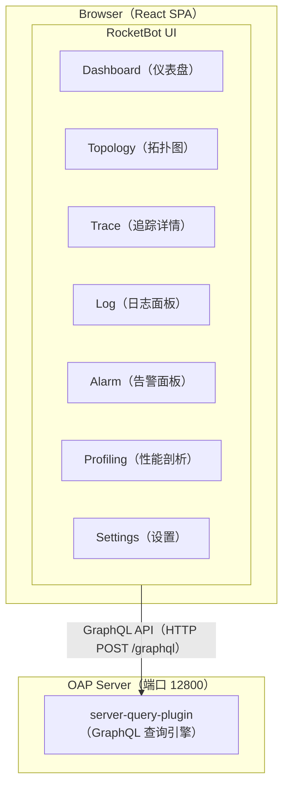

### 2. Dashboard（仪表盘）

#### 2.1 全局仪表盘

展示所有服务的整体健康状态：

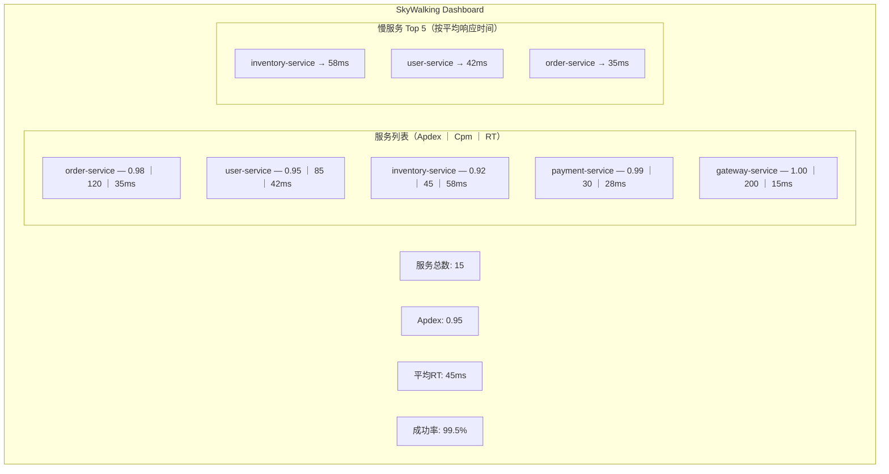

#### 2.2 服务仪表盘

选定一个服务后，展示该服务的详细指标：

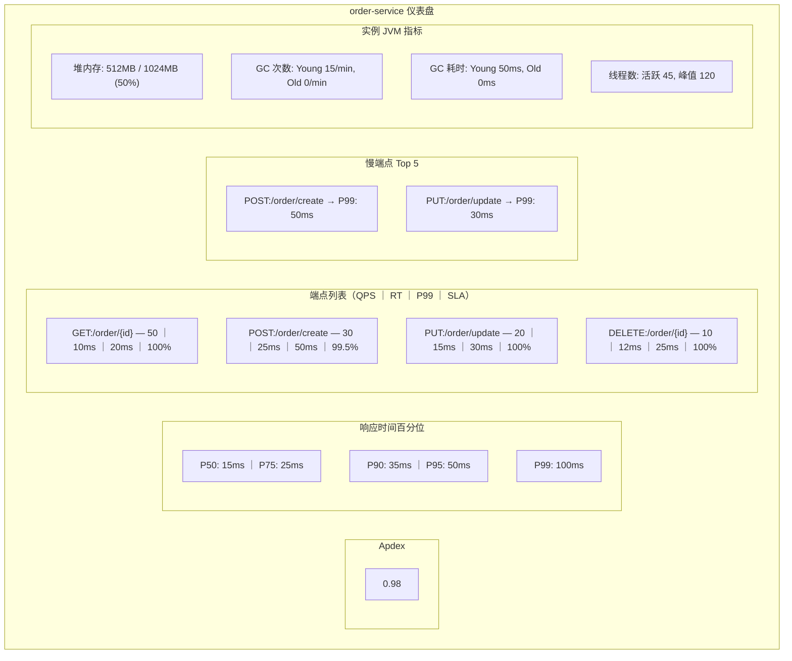

### 3. Topology（拓扑图）

#### 3.1 服务拓扑图

自动发现和展示服务之间的调用关系：

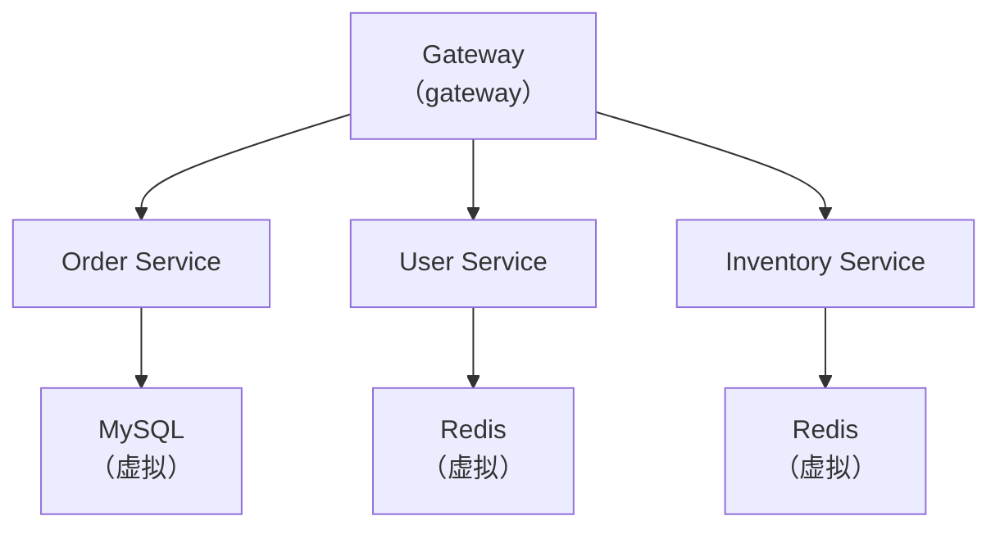

**拓扑图展示的信息**：
- 节点大小 → 调用量（Cpm）
- 连线粗细 → 调用频率
- 节点颜色 → 健康状态（绿=正常，黄=警告，红=异常）
- 连线标注 → 平均响应时间 + 调用量

#### 3.2 拓扑图交互

- **点击节点**：查看该服务的详细指标
- **点击连线**：查看两个服务间的调用指标（Client/Server 双向视角）
- **拖拽节点**：手动调整布局
- **时间范围选择**：查看不同时间段的拓扑
- **层级筛选**：只显示特定 Layer 的服务（GENERAL/DB/CACHE/MQ）

### 4. Trace（追踪详情）

#### 4.1 Trace 列表

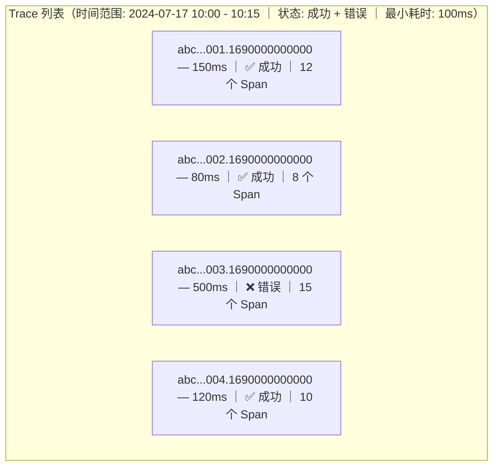

#### 4.2 Trace 详情——调用树

Trace: abc...001.1690000000000 ｜ 总耗时: 150ms

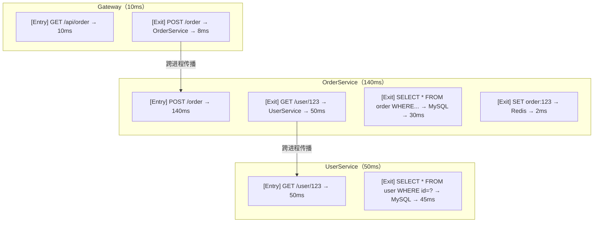

时间线视图（0ms - 150ms）：

```mermaid
gantt
    title Trace 时间线视图
    dateFormat x
    axisFormat %L ms
    section 调用链
    Gateway（10ms）: 0, 10
    OrderService（140ms）: 10, 150
    UserService（50ms）: 20, 70
    MySQL（30ms）: 20, 50
    Redis（2ms）: 20, 22
```

#### 4.3 Span 详情

点击一个 Span，可以查看详细信息：

Span 详情：

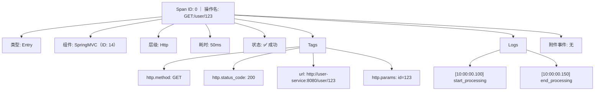

### 5. Log（日志面板）

#### 5.1 Trace-Log 关联

SkyWalking 支持将 Trace 与日志关联。点击一个 Span，可以查看该 Span 关联的日志：

Trace-Log 关联原理：

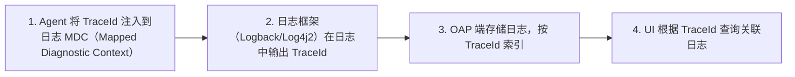

**Logback 配置示例**：
```xml
<!-- logback.xml -->
<appender name="CONSOLE" class="ch.qos.logback.core.ConsoleAppender">
    <encoder>
        <!-- %tid 是 SkyWalking 注入的 TraceId -->
        <pattern>[%tid] %d{yyyy-MM-dd HH:mm:ss} [%thread] %-5level %logger{36} - %msg%n</pattern>
    </encoder>
</appender>
```

#### 5.2 日志查询

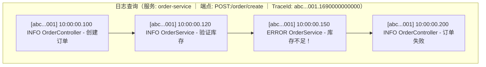

### 6. Profiling（性能剖析）

#### 6.1 线程栈采样

SkyWalking Profiling 通过定期采样线程栈，生成火焰图：

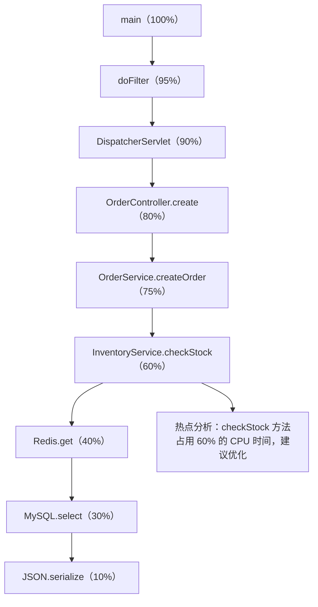

order-service 线程栈火焰图（采样 100 次，持续 5 分钟），自上而下为调用栈，宽度对应 CPU 时间占比。

### 7. Custom Dashboard（自定义仪表盘）

SkyWalking v9+ 支持自定义仪表盘，通过 Widget 配置：

```yaml
# 自定义仪表盘配置
dashboard:
  name: "我的仪表盘"
  widgets:
    - name: "订单服务 QPS"
      type: "line"
      metrics: "service_cpm"
      conditions:
        - service: "order-service"
    - name: "订单服务 P99 延迟"
      type: "line"
      metrics: "endpoint_p99"
      conditions:
        - service: "order-service"
        - endpoint: "POST:/order/create"
```

---

## 常见面试题

### Q1: SkyWalking 的拓扑图是如何生成的？

拓扑图通过分析 **Exit Span 和 Entry Span 的匹配关系** 自动生成：

1. 服务 A 创建一个 Exit Span（调用服务 B）
2. 服务 B 创建一个 Entry Span（接收服务 A 的请求）
3. OAP 通过 traceId 匹配 A 的 Exit Span 和 B 的 Entry Span
4. 统计 A → B 的调用量、延迟、成功率
5. UI 根据这些关系数据渲染拓扑图

### Q2: Trace-Log 关联是如何实现的？

通过 **TraceId 注入日志 MDC** 实现：

1. SkyWalking Agent 在创建 Span 时，将 TraceId 注入到 SLF4J 的 MDC 中
2. 日志框架（Logback/Log4j2）在输出日志时，自动包含 TraceId
3. Agent 或 OAP 收集日志，按 TraceId 索引
4. UI 中点击一个 Span，根据 TraceId 查询关联的日志

### Q3: 性能剖析（Profiling）的原理是什么？

SkyWalking Profiling 使用 **On-CPU 线程栈采样**：

1. OAP 下发 Profiling 任务到 Agent（指定目标服务、持续时间）
2. Agent 在指定时间内，定期（如每 10ms）采样目标线程的调用栈
3. 采样数据上报到 OAP
4. OAP 聚合所有采样数据，生成火焰图
5. 火焰图中宽度越大的方法，占用的 CPU 时间越多

**优势**：相比传统 Profiler（如 JProfiler），SkyWalking Profiling 对生产环境影响极小（< 1% CPU 开销）。

---

## 延伸阅读

- SkyWalking UI 源码：[https://github.com/apache/skywalking-booster-ui](https://github.com/apache/skywalking-booster-ui)
- GraphQL API 文档：[https://skywalking.apache.org/docs/main/latest/en/api/query-protocol/](https://skywalking.apache.org/docs/main/latest/en/api/query-protocol/)