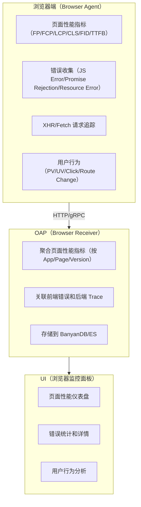
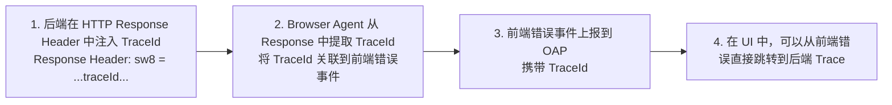
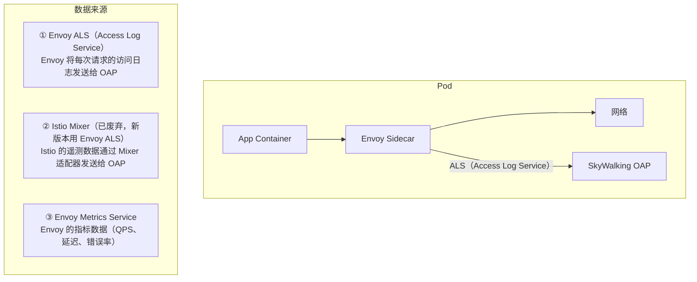
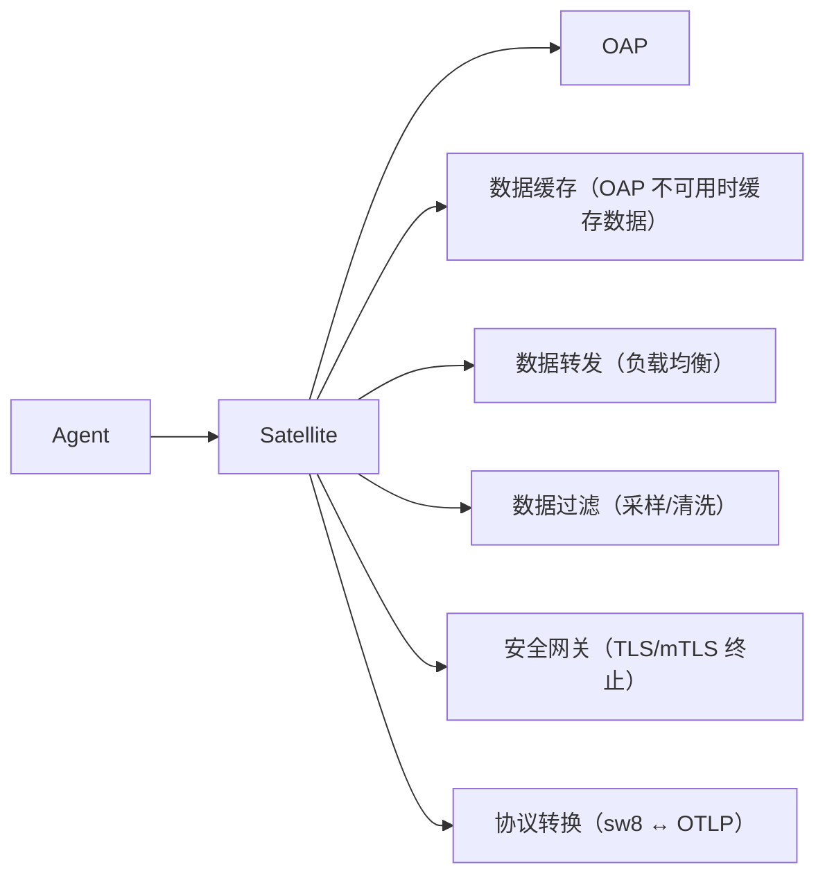
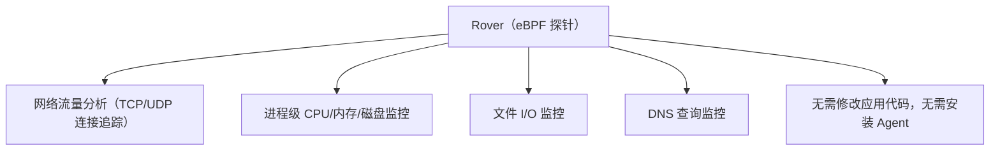

# 17 - SkyWalking 浏览器监控与 Service Mesh

## 核心概念

### 1. 浏览器监控（Browser Monitoring）

#### 1.1 是什么？

SkyWalking Browser Agent 是一个**前端 JavaScript 探针**，部署在 Web 页面中，用于监控前端性能和用户行为。



#### 1.2 Web Vitals 核心指标

| 指标 | 全称 | 含义 | 良好阈值 | 测量什么 |
|------|------|------|---------|---------|
| **FP** | First Paint | 首次绘制（任何像素出现） | < 1s | 视觉反馈 |
| **FCP** | First Contentful Paint | 首次内容绘制 | < 1.8s | 内容可见性 |
| **LCP** | Largest Contentful Paint | 最大内容绘制 | < 2.5s | 加载性能 |
| **FID** | First Input Delay | 首次输入延迟 | < 100ms | 交互性 |
| **CLS** | Cumulative Layout Shift | 累积布局偏移 | < 0.1 | 视觉稳定性 |
| **TTFB** | Time to First Byte | 首字节时间 | < 800ms | 服务器响应 |
| **INP** | Interaction to Next Paint | 交互到下次绘制 | < 200ms | 整体响应性 |

#### 1.3 接入方式

```html
<!-- 在 HTML 页面中引入 SkyWalking Browser Agent -->
<script src="https://your-cdn/skywalking-browser-agent.js"></script>
<script>
  // 注册 Browser Agent
  ClientMonitor.register({
    // OAP 地址
    collector: 'http://skywalking-oap:12800',
    // 应用名称
    service: 'web-app',
    // 页面路径
    pagePath: '/home',
    // 版本号
    serviceVersion: 'v1.0.0',
    // 采样率
    sampleRate: 1.0,
    // 启用错误收集
    jsErrors: true,
    // 启用 API 追踪
    apiTracking: true,
    // 启用资源追踪
    resourceTracking: true,
    // 启用用户行为
    userBehavior: true
  });
</script>
```

#### 1.4 前端错误与后端 Trace 关联

前端错误 → 后端 Trace 关联流程：



### 2. Service Mesh 集成

#### 2.1 什么是 Service Mesh？

Service Mesh（服务网格）是云原生架构中的**基础设施层**，用于处理服务间通信。它通过 Sidecar 代理（Envoy）接管所有流量，实现流量管理、安全、可观测性。

#### 2.2 SkyWalking + Istio/Envoy 集成



#### 2.3 Access Log Service（ALS）分析

Envoy ALS 会将每次请求的访问日志发送给 SkyWalking OAP，OAP 从中解析出：

- **服务拓扑**：谁调用了谁
- **调用延迟**：请求耗时
- **状态码**：成功/失败
- **协议**：HTTP/gRPC

**优势**：无需在应用容器中安装 Agent，完全无侵入。

### 3. Kubernetes 集成（SWCK Operator）

SWCK（SkyWalking Cloud on Kubernetes）Operator 简化了 SkyWalking 在 Kubernetes 上的部署：

```yaml
# 通过 SWCK Operator 部署 SkyWalking
apiVersion: operator.skywalking.apache.org/v1alpha1
kind: OAPServer
metadata:
  name: skywalking
spec:
  version: 10.0.0
  instances: 3
  storage:
    type: elasticsearch
    elasticsearch:
      host: es-cluster:9200

---
apiVersion: operator.skywalking.apache.org/v1alpha1
kind: UI
metadata:
  name: skywalking-ui
spec:
  version: 10.0.0
  instances: 2
  oapServer: skywalking
```

### 4. Satellite（边车网关）

Satellite 是 SkyWalking 的**边车网关**，部署在 Agent 和 OAP 之间：



### 5. eBPF Rover（无侵入内核级监控）

Rover 是 SkyWalking 的 **eBPF 探针**，通过 eBPF 技术在内核层面监控网络流量和系统指标：

Rover 的监控能力：



---

## 常见面试题

### Q1: Web Vitals 的 LCP、FID、CLS 分别代表什么？

| 指标 | 全称 | 含义 | 用户体验 |
|------|------|------|---------|
| LCP | Largest Contentful Paint | 最大内容渲染时间 | 页面加载速度 |
| FID | First Input Delay | 首次输入延迟 | 页面交互响应 |
| CLS | Cumulative Layout Shift | 累积布局偏移 | 页面视觉稳定性 |

这三个指标是 Google Core Web Vitals 的核心，直接影响 SEO 排名。

### Q2: Service Mesh 中 SkyWalking 如何获取可观测性数据？

通过 Envoy 的 **ALS（Access Log Service）**：

1. Envoy Sidecar 拦截所有进出 Pod 的流量
2. Envoy 将每次请求的访问日志发送给 SkyWalking OAP
3. OAP 解析 ALS 数据，生成服务拓扑、调用指标
4. 无需在应用容器中安装 Agent

**优势**：完全无侵入，适合不能修改应用代码的场景。

### Q3: Satellite 的作用是什么？

Satellite 是 Agent 和 OAP 之间的**边车网关**：

1. **数据缓存**：OAP 不可用时缓存数据，恢复后转发
2. **负载均衡**：将 Agent 上报请求分发到多个 OAP 实例
3. **安全网关**：TLS/mTLS 终止，保护后端 OAP
4. **协议转换**：sw8 ↔ OTLP 协议转换

---

## 延伸阅读

- SkyWalking Browser Agent：[https://skywalking.apache.org/docs/main/latest/en/setup/service-agent/browser-agent/](https://skywalking.apache.org/docs/main/latest/en/setup/service-agent/browser-agent/)
- SWCK Operator：[https://skywalking.apache.org/docs/main/latest/en/setup/swck/](https://skywalking.apache.org/docs/main/latest/en/setup/swck/)
- Web Vitals：[https://web.dev/vitals/](https://web.dev/vitals/)