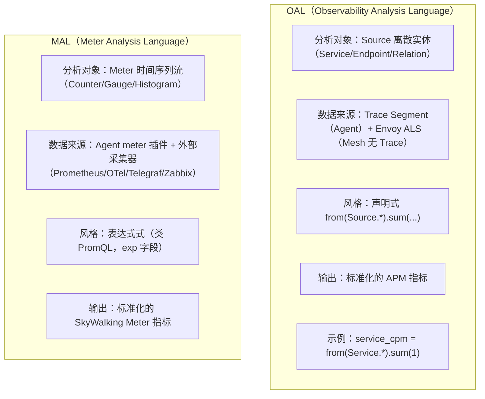
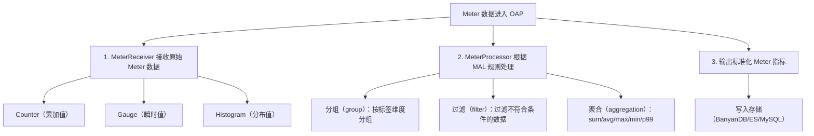
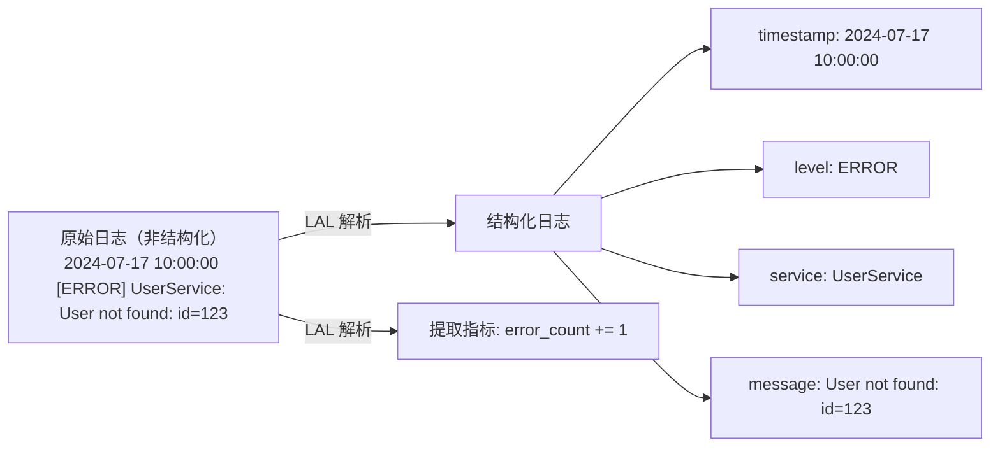
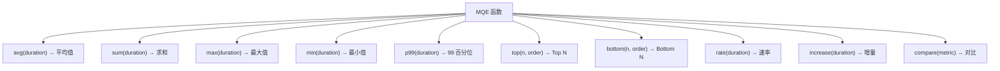

# 18 - SkyWalking MAL 与日志分析

## 核心概念

### 1. MAL（Meter Analysis Language）

#### 1.1 MAL 是什么？

**MAL（Meter Analysis Language）** 是 SkyWalking 用于分析 **Meter（计量器）指标** 的 DSL。与 OAL（分析 Source 对象）不同，MAL 专注于分析 **Meter 时间序列指标流**。

> ⚠️ **资料勘误**：常见说法称"MAL 专注分析从外部系统接入的 Meter 数据"，这是不准确的。MAL 处理的是所有 Meter 格式的指标，来源既包括**外部采集器**（Prometheus/OTel/Telegraf/Zabbix），也包括 **SkyWalking Agent 自身的 meter 插件**（micrometer/spring-sleuth）。本文 1.2 的 `spring-sleuth.yaml` 示例正是 Agent 内部上报的 JVM 指标，并非外部系统。OAL 与 MAL 的真正分界线是**数据范式**——OAL 处理离散的 Source 实体，MAL 处理时间序列指标流，而非"内部 vs 外部"。详见文末「资料勘误与重点提醒」。

OAL vs MAL 对比：



#### 1.2 MAL 配置示例

```yaml
# config/meter-analyzer-config/spring-sleuth.yaml
metricsRules:
  # 示例 1：分析 HTTP 请求指标
  - name: http_server_requests
    # 指标表达式（Prometheus 指标名）
    exp: http_server_requests_seconds_sum
    # 聚合维度（标签）
    group: ['service', 'uri', 'method']
    # 过滤条件
    filter: "tagEqual('status', '200')"
    # 聚合函数
    aggregation: sum

  # 示例 2：分析 JVM 指标
  - name: jvm_memory_used
    exp: jvm_memory_used_bytes
    group: ['service', 'area']  # area: heap/nonheap
    aggregation: avg

  # 示例 3：分析业务指标
  - name: order_count
    exp: order_created_total
    group: ['service', 'type']
    aggregation: sum
```

#### 1.3 MAL 处理流程



### 2. LAL（Log Analysis Language）

#### 2.1 LAL 是什么？

**LAL（Log Analysis Language）** 是 SkyWalking 用于**分析日志**的 DSL。它可以从原始日志中提取结构化信息，并与 Trace 关联。

LAL 的作用：



#### 2.2 LAL 脚本示例

```groovy
// config/lal/lal.yaml
rules:
  - name: "nginx-access-log"
    dsl: |
      // 定义过滤条件
      filter {
        // 提取日志内容
        text {
          // 正则匹配
          regexp "(?<remoteIp>\\S+) - (?<user>\\S+) \\[(?<timestamp>[^\\]]+)\\] \"(?<method>\\S+) (?<path>\\S+) [^\"]*\" (?<status>\\d+) (?<bodyBytes>\\d+)"
        }
        // 解析器链
        parser {
          // 解析 JSON 日志
          json {
          }
        }
        // 提取器
        extractor {
          // 提取标签
          tag 'level': parsed.level
          tag 'service': parsed.service
          // 提取指标
          metrics {
            // 错误计数
            counter 'error_count': 1
            // 响应时间
            histogram 'response_time': parsed.responseTime
          }
        }
        // 采样策略
        sampler {
          // 每 10 条采样 1 条
          rate 10
        }
      }
```

#### 2.3 LAL 与 Trace 关联

LAL 支持将日志与 Trace 关联：

```groovy
// 从日志中提取 TraceId，与 Trace 关联
filter {
  extractor {
    // 如果日志中包含 TraceId
    if (parsed.traceId != null) {
      // 设置 Trace 上下文
      traceContext {
        traceId: parsed.traceId
        spanId: parsed.spanId
      }
    }
  }
}
```

### 3. 日志桥接（Logback/Log4j2 → SkyWalking）

#### 3.1 TraceId 注入 MDC

SkyWalking Java Agent 自动将 TraceId 注入到 SLF4J 的 **MDC（Mapped Diagnostic Context）**：

```java
// 无需任何代码改动，Agent 自动注入
// Logback 配置中使用 %tid 即可输出 TraceId
```

```xml
<!-- logback.xml -->
<appender name="FILE" class="ch.qos.logback.core.rolling.RollingFileAppender">
    <encoder>
        <!-- %tid 是 SkyWalking 自动注入的 TraceId -->
        <pattern>[%tid] %d{yyyy-MM-dd HH:mm:ss.SSS} [%thread] %-5level %logger{36} - %msg%n</pattern>
    </encoder>
</appender>
```

#### 3.2 gRPC Log Reporter

SkyWalking Agent 支持通过 gRPC 将日志直接上报到 OAP：

```properties
# agent.config
plugin.toolkit.log.grpc.reporter.server_host=${SW_GRPC_LOG_SERVER_HOST:127.0.0.1}
plugin.toolkit.log.grpc.reporter.server_port=${SW_GRPC_LOG_SERVER_PORT:11800}
plugin.toolkit.log.grpc.reporter.max_message_size=${SW_GRPC_LOG_MAX_MESSAGE_SIZE:10485760}
plugin.toolkit.log.grpc.reporter.upstream_timeout=${SW_GRPC_LOG_GRPC_UPSTREAM_TIMEOUT:30}
```

### 4. MQE（Metrics Query Engine）

#### 4.1 MQE 是什么？

**MQE（Metrics Query Engine）** 是 SkyWalking v9+ 引入的**指标查询引擎**，提供类 SQL 的查询语法。

```
MQE 查询示例：

// 查询 order-service 最近 5 分钟的平均响应时间
service_resp_time{service='order-service'}.avg(5m)

// 查询 Top 10 端点（按 P99 延迟）
endpoint_p99{service='order-service'}.top(10, desc)

// 查询两个服务的指标对比
service_cpm{service='order-service'}.compare(service_cpm{service='user-service'})
```

#### 4.2 MQE 语法

基本语法：`<metric_name>{<label_selector>}.<function>(<args>)`

支持的函数：



---

## 常见面试题

### Q1: OAL、MAL、LAL 三者有什么区别？

| 语言 | 全称 | 分析对象 / 数据来源 | 作用 |
|------|------|---------|------|
| **OAL** | Observability Analysis Language | Source 离散实体（来自 Trace Segment，或 Mesh 模式下 Envoy ALS） | 分析 Source 数据，生成 APM 指标 |
| **MAL** | Meter Analysis Language | Meter 时间序列流（来自 Agent meter 插件 + 外部采集器） | 分析 Meter 指标 |
| **LAL** | Log Analysis Language | 原始日志 | 解析日志，提取结构化信息和指标 |

**三者关系**：OAL 处理 Source 来源的指标，MAL 处理 Meter 来源的指标，LAL 处理日志来源的指标。三者互补，覆盖可观测性三大支柱（Traces、Metrics、Logs）。

### Q2: 如何将 TraceId 关联到日志中？

1. **Agent 自动注入**：SkyWalking Agent 自动将 TraceId 注入到 SLF4J MDC
2. **日志配置**：在 Logback/Log4j2 配置中使用 `%tid` 占位符输出 TraceId
3. **日志上报**：通过 gRPC Log Reporter 将日志上报到 OAP
4. **UI 关联**：在 SkyWalking UI 中，可以从 Trace 详情直接跳转到关联的日志

### Q3: MQE 和 GraphQL 查询有什么区别？

| 对比维度 | GraphQL 查询 | MQE 查询 |
|---------|-------------|---------|
| 查询方式 | 结构化的 API 查询 | 类 SQL 的表达式查询 |
| 复杂度 | 需要指定完整的查询结构 | 灵活的表达式 |
| 学习成本 | 需要理解 GraphQL Schema | 接近 SQL 语法 |
| 使用场景 | UI 查询、程序化查询 | 命令行查询、临时分析 |
| 聚合能力 | 有限 | 强大的聚合函数 |

---

## 延伸阅读

- MAL 配置文档：[https://skywalking.apache.org/docs/main/latest/en/setup/backend/meter-analyzer/](https://skywalking.apache.org/docs/main/latest/en/setup/backend/meter-analyzer/)
- LAL 配置文档：[https://skywalking.apache.org/docs/main/latest/en/setup/backend/log-analyzer/](https://skywalking.apache.org/docs/main/latest/en/setup/backend/log-analyzer/)
- MQE 语法文档：[https://skywalking.apache.org/docs/main/latest/en/api/metrics-query-expression/](https://skywalking.apache.org/docs/main/latest/en/api/metrics-query-expression/)

---

## 资料勘误与重点提醒

### 1. MAL 的数据来源不是"仅限外部系统"

**资料原表述**："MAL 专注于分析从外部系统接入的 Meter 数据。"

**问题**：把 MAL 限定为"外部"会让人误以为它不处理 Agent 自己上报的指标，而事实恰好相反。MAL 处理的是**所有 Meter 格式的时间序列指标流**，数据来源分两类：

| 来源 | 具体渠道 | 是否"外部" |
|------|---------|-----------|
| **Agent meter 插件** | Java Agent 的 `micrometer`、`spring-sleuth` 插件；通过 meter 协议（OTLP meter）上报的 JVM/业务指标 | ❌ 内部 |
| **外部采集器** | Prometheus（OpenFetcher / VM）、OTel Collector、Telegraf、Zabbix | ✅ 外部 |

**判别依据**：本文 1.2 配置示例的文件名 `spring-sleuth.yaml` 对应 SkyWalking Java Agent 的 `spring-sleuth` meter 插件，示例中的 `jvm_memory_used_bytes` 是 Agent 内部上报的 JVM 指标--这本身就否定了"MAL 只接外部"的说法。

### 2. OAL 与 MAL 的真正分界线是"数据范式"，不是"内外"

| 维度 | OAL | MAL |
|------|-----|-----|
| **数据范式** | 离散实体（Source 对象） | 时间序列（指标流） |
| **分析对象** | Service / Endpoint / Instance / Relation 等 Source | Counter / Gauge / Histogram 等 Meter |
| **语法风格** | 声明式 `from(Source.*).sum(...)` | 表达式式（类 PromQL，`exp` 字段） |
| **输出** | APM 聚合指标（CPM/P99/SLA） | 标准化 Meter 指标 |

记住一句话：**"OAL 管'实体'，MAL 管'指标流'"**，比"OAL 管 Trace，MAL 管外部 Meter"更准确。

### 3. OAL 也不只是"分析 Trace 数据"

**资料原表述**："OAL（分析 Trace 数据）"。

**问题**：OAL 分析的是 **Source 对象**，Source 的数据来源不止 Trace：

- **普通 Agent 模式**：来自 Trace Segment ✅
- **Service Mesh 模式**：来自 Envoy **ALS 访问日志**，根本没有 Trace（参见第 17 章 ALS 章节），OAL 照样能跑

所以严谨说法是「OAL 分析 Source 对象（主要来自 Trace，也来自 ALS 等）」，而非"分析 Trace 数据"。

### 4. LAL 的语法说明（避免被资料误导）

资料中 LAL 脚本以 Groovy 风格展示（`filter { text { regexp ... } }`），仅作为**结构示意**。实际 LAL 的 DSL 语法以官方文档为准（见延伸阅读第 2 条），不同版本语法差异较大，面试时不必纠结具体关键字拼写，把握"过滤 → 解析（regexp/json）→ 提取（tag/metrics）→ 采样（sampler）"四个阶段即可。

### 5. 面试高频补充：四套 DSL 速记

| DSL | 处理的"东西" | 一句话记忆 |
|-----|-------------|-----------|
| OAL | Source 实体 | "从调用链实体聚出 APM 指标" |
| MAL | Meter 时间序列 | "把外部/Agent 的指标流接入并标准化" |
| LAL | 原始日志 | "把非结构化日志解析成结构化数据 + 指标" |
| MQE | 查询 | "查指标时的类 SQL 表达式引擎" |

> 注：MQE 是**查询侧**的语言（读），OAL/MAL/LAL 是**采集/分析侧**的语言（写）。面试时点出这个"读写分离"的定位，能体现对架构的理解深度。