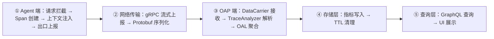
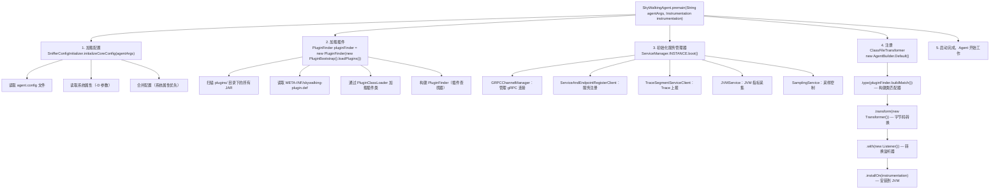
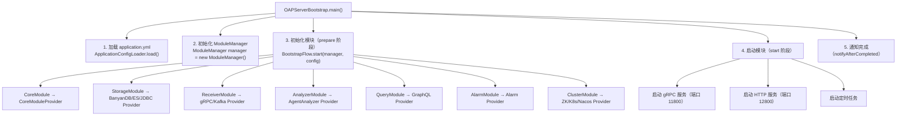
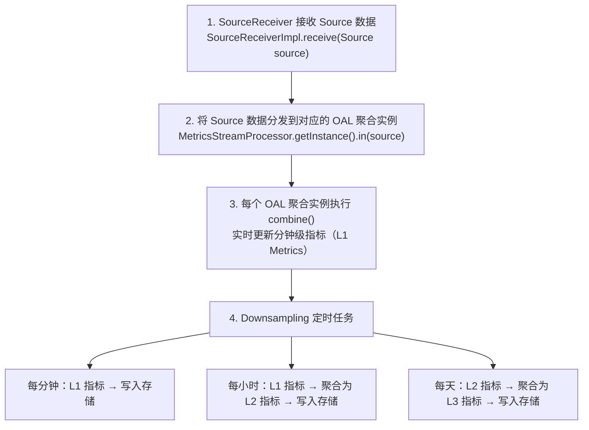
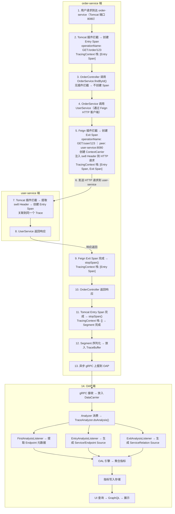

# 19 - SkyWalking 源码分析

## 核心概念

### 1. 源码分析路线图

本章从**端到端**的角度，追踪一次 HTTP 请求在 SkyWalking 中的完整链路：



源码分析路线图：一次 HTTP 请求的完整生命

### 2. Agent 端源码分析

#### 2.1 启动流程



#### 2.2 请求拦截与 Span 创建

当一个 HTTP 请求到达时，Tomcat 插件（或 SpringMVC 插件）拦截处理流程：

```
// 简化版源码流程（Tomcat 插件拦截器）

// ① beforeMethod：请求到达时
public void beforeMethod(EnhancedInstance objInst, Method method,
                         Object[] allArguments, ...) {
    HttpServletRequest request = (HttpServletRequest) allArguments[0];

    // 从 HTTP Header 中提取上下文
    ContextCarrier carrier = new ContextCarrier();
    CarrierItem items = carrier.items();
    while (items.hasNext()) {
        items.next().setHeadValue(
            request.getHeader(items.getHeadKey())  // 提取 sw8 或 traceparent
        );
    }

    // 创建 Entry Span
    AbstractSpan span = ContextManager.createEntrySpan(
        request.getMethod() + ":" + request.getRequestURI(),  // operationName
        carrier                                                 // 上下文
    );

    // 设置 Span 属性
    span.setComponent(ComponentsDefine.TOMCAT);
    span.setLayer(SpanLayer.HTTP);
    Tags.HTTP.METHOD.set(span, request.getMethod());
    Tags.URL.set(span, request.getRequestURL().toString());
}

// ② afterMethod：请求处理完成时
public Object afterMethod(EnhancedInstance objInst, Method method,
                          Object[] allArguments, ..., Object ret) {
    HttpServletResponse response = (HttpServletResponse) allArguments[1];

    // 设置状态码
    AbstractSpan span = ContextManager.activeSpan();
    Tags.HTTP_RESPONSE_STATUS_CODE.set(span, response.getStatus());

    // 判断是否有错误
    if (response.getStatus() >= 400) {
        span.errorOccurred();
    }

    // 停止 Span（Span 出栈）
    ContextManager.stopSpan();

    return ret;
}

// ③ handleMethodException：请求处理异常时
public void handleMethodException(EnhancedInstance objInst, Method method,
                                   Object[] allArguments, ..., Throwable t) {
    AbstractSpan span = ContextManager.activeSpan();
    span.errorOccurred();
    span.log(t);  // 记录异常到 Span Logs
}
```

#### 2.3 Span 出口与上报

当所有 Span 完成（Span 栈为空）后，Segment 自动完成并上报：

```
// ContextManager.stopSpan() 内部逻辑
public static void stopSpan() {
    AbstractTracerContext context = get();
    context.stopSpan(activeSpan);

    // 如果 Span 栈为空，说明 Segment 完成
    if (context.finish()) {
        // 序列化 Segment 为 Protobuf
        SegmentObject segment = context.toSegmentObject();

        // 放入 TraceBuffer（异步上报队列）
        TraceSegmentServiceClient.INSTANCE.send(segment);
    }
}
```

### 3. OAP 端源码分析

#### 3.1 模块启动流程



#### 3.2 TraceAnalyzer：Segment 解析

```java
// 源码：TraceAnalyzer.java（简化版）
public void doAnalysis(SegmentObject segmentObject) {
    // 1. 创建 Span 监听器
    createSpanListeners();

    // 2. 通知 Segment 级别监听器
    notifySegmentListener(segmentObject);

    // 3. 遍历每个 Span，根据类型分发
    segmentObject.getSpansList().forEach(spanObject -> {
        if (spanObject.getSpanId() == 0) {
            notifyFirstListener(spanObject, segmentObject);  // 第一个 Span
        }
        if (SpanType.Exit.equals(spanObject.getSpanType())) {
            notifyExitListener(spanObject, segmentObject);   // Exit Span
        } else if (SpanType.Entry.equals(spanObject.getSpanType())) {
            notifyEntryListener(spanObject, segmentObject);  // Entry Span
        } else if (SpanType.Local.equals(spanObject.getSpanType())) {
            notifyLocalListener(spanObject, segmentObject);  // Local Span
        }
    });

    // 4. 所有监听器完成分析后，触发 build（生成 Source → 聚合指标）
    notifyListenerToBuild();
}
```

**监听器链**（源码中的实际监听器）：

| 监听器 | 触发点 | 生成的 Source |
|--------|--------|--------------|
| `FirstAnalysisListener` | 每个 Segment 的第一个 Span | EndpointMeta |
| `EntryAnalysisListener` | Entry Span | Service, Endpoint |
| `ExitAnalysisListener` | Exit Span | ServiceRelation |
| `LocalAnalysisListener` | Local Span | 附加分析 |
| `RPCAnalysisListener` | RPC 类型 Span | ServiceRelation（RPC） |
| `DatabaseSlowStatementBuilder` | DB 慢查询 Exit Span | DatabaseSlowStatement |
| `EndpointDependencyBuilder` | 端点间调用 | EndpointRelation |
| `VirtualDatabaseProcessor` | DB 类型 Exit Span | 虚拟数据库服务 |
| `VirtualCacheProcessor` | Cache 类型 Exit Span | 虚拟缓存服务 |
| `VirtualMQProcessor` | MQ 类型 Exit Span | 虚拟 MQ 服务 |
| `SampledTraceBuilder` | 被采样的 Segment | 完整 Trace 记录 |

#### 3.3 OAL 引擎执行

OAL 指标聚合流程：



### 4. 端到端代码走读

以下是一次 HTTP 请求（`GET /order/123`）的完整代码追踪：



---

## 常见面试题

### Q1: 如果让你设计一个 APM 系统，你会怎么设计？

可以从 SkyWalking 的架构中总结出核心设计思路：

1. **数据采集层**：通过 Agent 字节码增强实现零侵入，覆盖主流框架
2. **数据传输层**：gRPC 流式上报 + Kafka 桥接，支持高吞吐
3. **数据分析层**：DSL 驱动的指标聚合（OAL/MAL/LAL），灵活可扩展
4. **数据存储层**：可插拔存储引擎，按场景选择（H2/MySQL/ES/BanyanDB）
5. **数据查询层**：GraphQL + MQE 灵活查询
6. **可视化层**：仪表盘 + 拓扑图 + 追踪详情 + 火焰图

### Q2: SkyWalking Agent 的 Span 栈管理是如何实现的？

通过 **TracingContext + ThreadLocal + Span 栈** 实现：

1. 每个线程有独立的 `TracingContext`（通过 ThreadLocal 管理）
2. `TracingContext` 内部维护一个 Span 栈（Stack）
3. `createEntrySpan()` / `createExitSpan()` → 压栈
4. `stopSpan()` → 出栈
5. 栈为空时 → Segment 完成 → 上报

**为什么用栈**：因为方法调用是嵌套的（先进后出），Span 的生命周期也是嵌套的。

### Q3: SkyWalking 源码中的 Compile 阶段做了什么？

OAL 脚本（.oal 文件）不是直接解释执行的，而是**编译为 Java 类**：

1. ANTLR4 解析 OAL 语法 → AST（抽象语法树）
2. AST → Java 源代码（`OALClassGenerator` 生成）
3. Java 源代码 → .class 字节码（`javac` 编译）
4. 运行时加载 .class 文件 → 反射创建聚合实例

**好处**：编译后的代码性能接近原生 Java 代码，远高于解释执行。

---

## 延伸阅读

- SkyWalking 源码仓库：[https://github.com/apache/skywalking](https://github.com/apache/skywalking)
- SkyWalking Java Agent 源码：[https://github.com/apache/skywalking-java](https://github.com/apache/skywalking-java)
- 核心类浏览入口：
  - Agent: `SkyWalkingAgent.java`
  - OAP Entry: `OAPServerBootstrap.java`
  - Analyzer: `TraceAnalyzer.java`
  - OAL: `OALParser.g4`