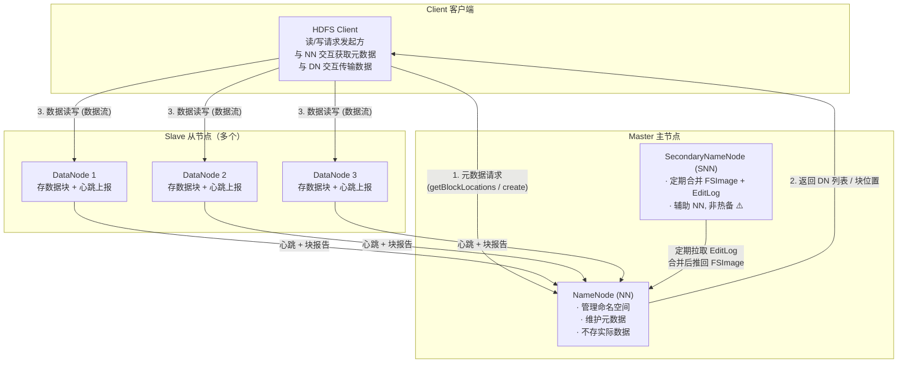
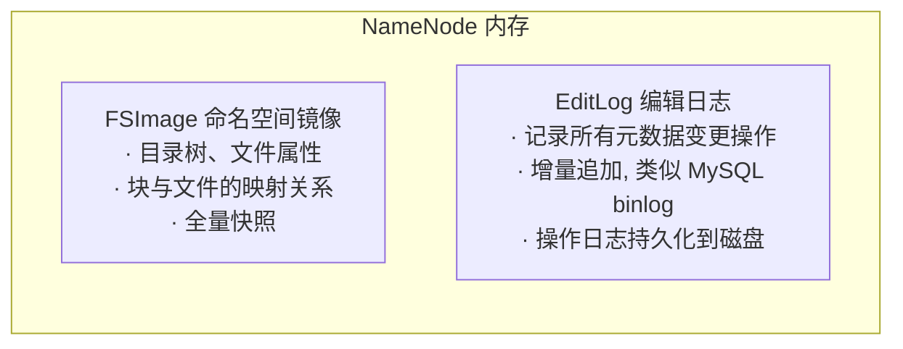
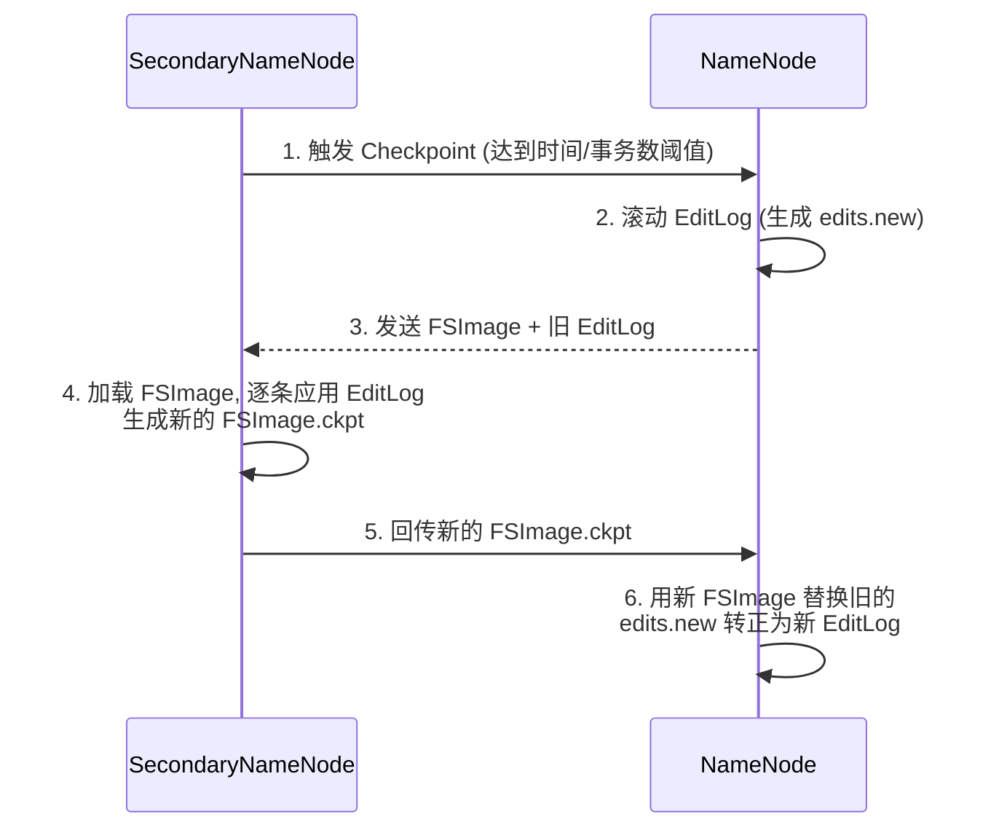
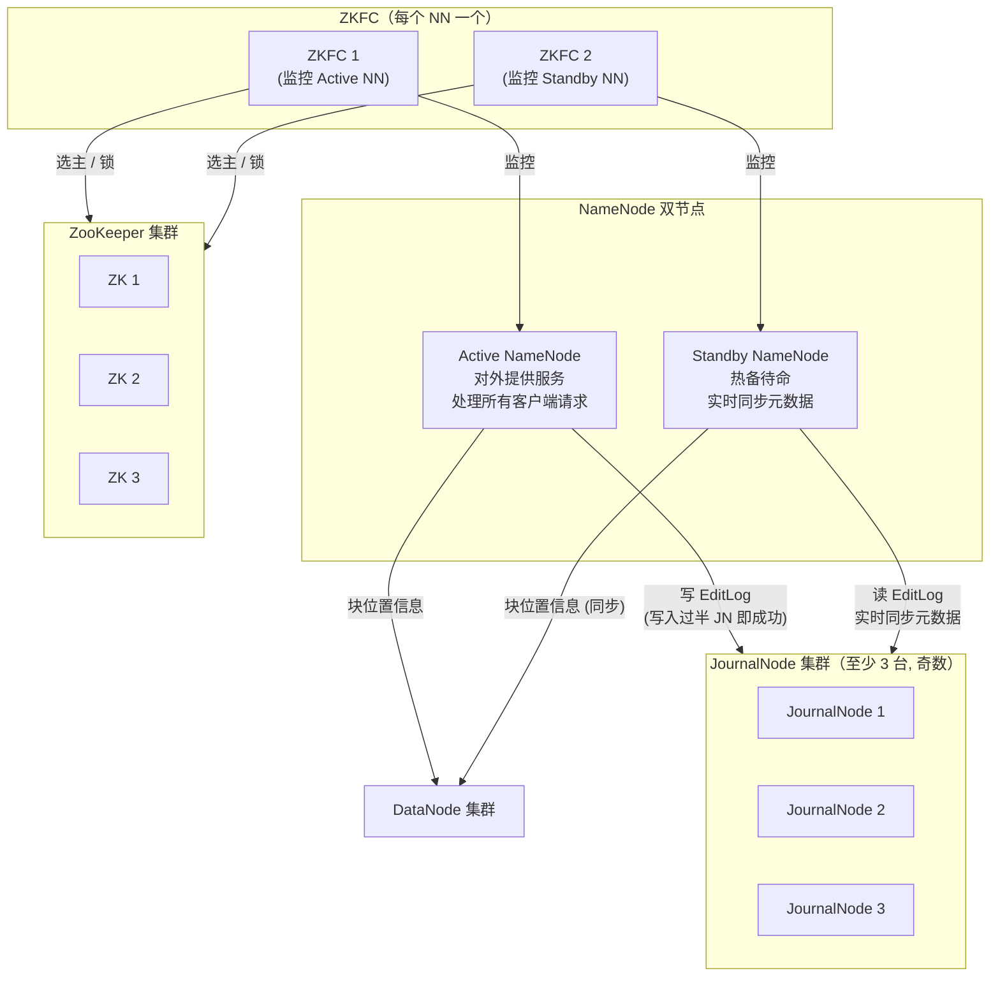
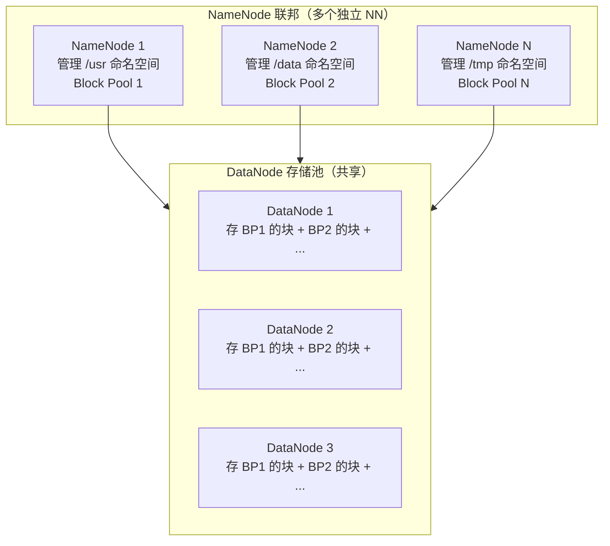
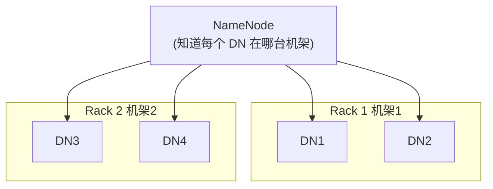
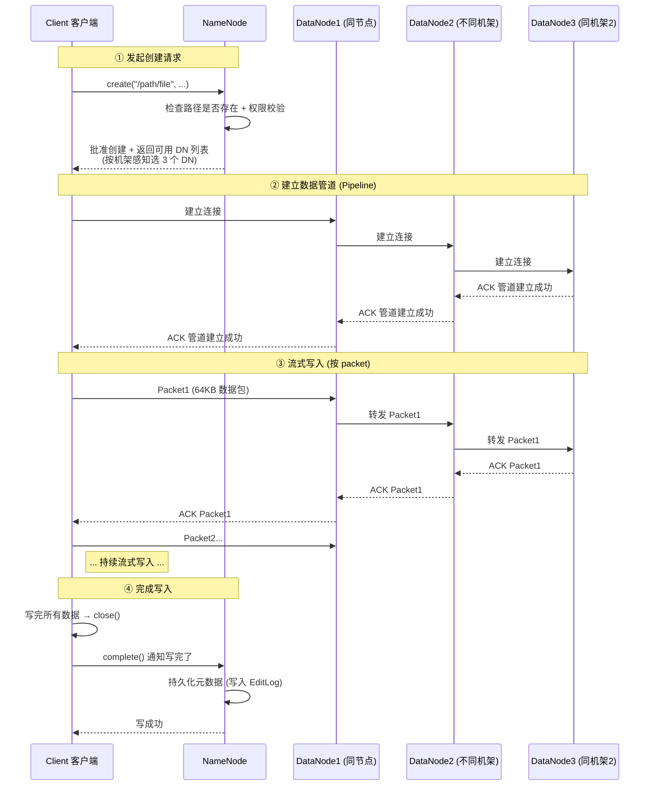
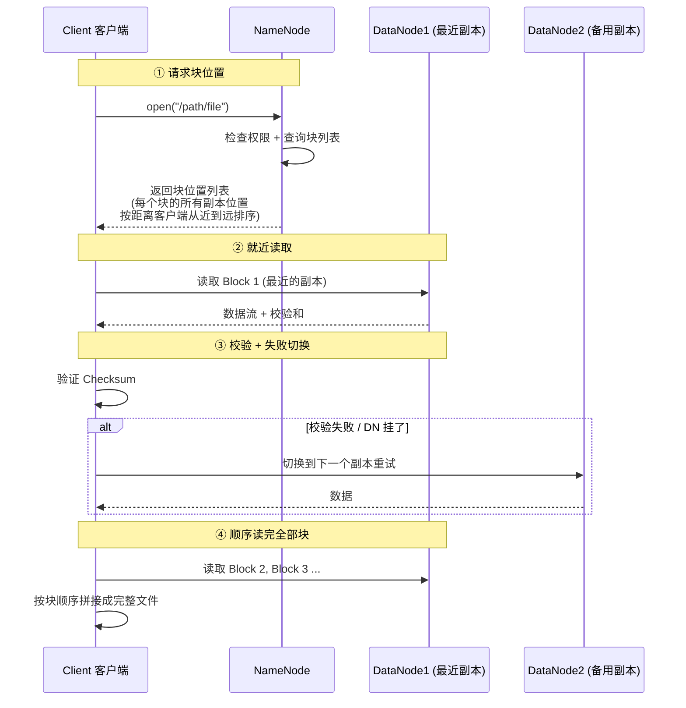
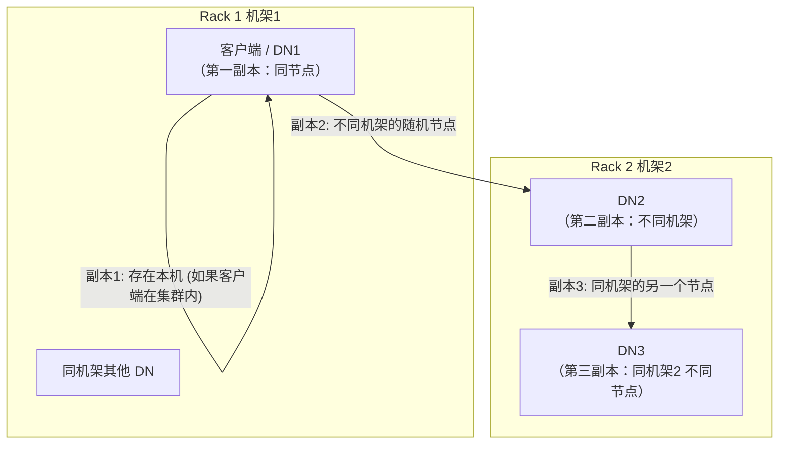

# 第1章 HDFS 分布式文件系统 ⭐⭐

> 本文面向 Java 后端面试复习，系统梳理 HDFS（Hadoop Distributed File System）的核心架构、读写流程、高可用机制与高频考点。对常见资料中的表述不准或易混淆之处已就地用 ⚠️ 标注，本章末「资料勘误与重点提醒」集中说明。
>
> 一句话理解 HDFS：**HDFS 是 Hadoop 生态的底层分布式文件系统，把大文件切成固定大小的数据块（默认 128MB），多副本分散存到集群各节点上，由 NameNode 统一管理元数据；牺牲低延迟和随机写，换取高容错、高吞吐、低成本的大数据存储能力。**

---

## 一、HDFS 概述

### 1.1 什么是 HDFS

HDFS（Hadoop Distributed File System）是 Apache Hadoop 项目下的**分布式文件系统**，是整个 Hadoop 生态的存储基石。它的设计灵感来自 Google File System（GFS）论文，目标是在普通廉价硬件构成的集群上，存储和管理 PB 级别的大数据。

> 💡 面试金句：HDFS 不是一个普通的文件系统，它是为**大文件、高吞吐、批量读写**场景设计的分布式存储；它牺牲了 POSIX 的部分语义（如随机写、低延迟），来换取分布式环境下的容错能力和水平扩展能力。

### 1.2 设计目标

| 设计目标 | 说明 |
|---|---|
| **高容错性** | 数据多副本（默认 3 副本），节点故障时自动切换副本，保证数据不丢 |
| **高吞吐量** | 面向批量数据处理，强调数据的整体吞吐率而非单条访问延迟 |
| **大数据量** | 支持 PB 级数据、亿级文件，集群可水平扩展到数千节点 |
| **低成本硬件** | 运行在普通商用服务器上，不依赖高端存储设备 |
| **流式读写** | 一次写入、多次读取（Write-Once-Read-Many），支持数据追加 |

### 1.3 适用场景 vs 不适用场景

| 维度 | 适用场景 | 不适用场景 |
|---|---|---|
| **文件大小** | 大文件（GB、TB 级） | 大量小文件（NN 内存瓶颈） |
| **读写模式** | 一次写入、多次读取、流式读 | 随机写入、频繁修改 |
| **延迟要求** | 高吞吐批处理（秒/分钟级） | 低延迟实时访问（毫秒级） |
| **数据量** | TB/PB 级海量数据 | GB 级以下小规模数据 |
| **并发特性** | 高吞吐顺序读写 | 大量随机元数据操作 |

> ⚠️ **常见误区**：HDFS 不是万能存储。很多初学者把 HDFS 当作"分布式网盘"用，存海量小文件、做随机读写——这恰恰是 HDFS 最不擅长的场景。面试时被问到"HDFS 的局限"，能从**小文件、低延迟、随机写、元数据压力**这四个角度展开，就是加分项。

---

## 二、HDFS 核心架构 ⭐⭐

### 2.1 架构总览

HDFS 采用**主从（Master/Slave）架构**，核心组件有四个：NameNode（NN）、DataNode（DN）、SecondaryNameNode（SNN）和 Client。



### 2.2 NameNode（NN）—— 大脑

NameNode 是 HDFS 的**主节点**，负责整个文件系统的元数据管理。它**不存储任何实际数据**，只存"文件长什么样、数据块在哪"这些描述信息。

**核心职责：**

| 职责 | 说明 |
|---|---|
| **命名空间管理** | 维护目录树结构、文件/目录的创建/删除/重命名 |
| **块映射管理** | 记录每个文件由哪些数据块（Block）组成，以及块的副本位置 |
| **副本管理** | 根据 DN 上报的块信息，确保副本数达到配置值（默认 3），副本不足时触发复制 |
| **客户端请求处理** | 响应 Client 的元数据请求（如 open、create、getBlockLocations） |

**内存中的两份数据：**



| 数据 | 作用 | 特点 |
|---|---|---|
| **FSImage** | 命名空间的**全量镜像**，包含目录树、文件属性、块与文件的映射 | 一次性加载到内存，启动时读取 |
| **EditLog** | 元数据操作的**增量日志**，每次元数据变更都追加写入 | 顺序写、高性能，持久化到本地磁盘 |

> ⚠️ **关键点**：NameNode 的所有元数据都放在**内存**中，因此 NN 能管理的文件数受内存大小限制——这也是小文件问题的根源（每个文件/目录/块约占 150 字节内存）。

### 2.3 DataNode（DN）—— 干活的

DataNode 是 HDFS 的**从节点**，负责实际存储数据块和处理数据读写。

**核心职责：**

| 职责 | 说明 |
|---|---|
| **存储数据块** | 文件被切分成固定大小的 Block（默认 128MB），实际存储在 DN 本地磁盘 |
| **心跳上报** | 定期（默认 3 秒）向 NN 发送心跳，告知自己存活和磁盘使用情况 |
| **块报告（Block Report）** | 定期（默认 6 小时）向 NN 上报自己存储的所有块的完整列表 |
| **处理读写请求** | 接收 Client 的读写数据流，与其他 DN 协作完成数据复制 |

> 💡 面试金句：NN 是"大脑"管账本，DN 是"仓库"存货物。大脑不存货，仓库不管账——各司其职，这就是主从架构的核心思想。

**DN 与 NN 的通信机制：**

| 通信类型 | 频率 | 作用 |
|---|---|---|
| **心跳（Heartbeat）** | 默认 3 秒/次 | 告诉 NN 我还活着，带磁盘容量、数据块数量等信息 |
| **块报告（Block Report）** | 默认 6 小时/次 | 全量上报本节点所有块列表，NN 据此更新块映射 |
| **增量块报告** | 块增减时即时 | 新增/删除块时立即通知 NN |

> ⚠️ **超时时长**：NN 超过 10 分钟 30 秒（`dfs.namenode.heartbeat.recheck-interval` + 10 × 心跳间隔）没收到 DN 心跳，就认为该 DN 失效，会把它上面的块在其他 DN 上重新复制补齐。

### 2.4 SecondaryNameNode（SNN）—— 打杂的助手

SecondaryNameNode 从名字看很容易被误解为"第二个 NameNode"，**但它不是 NN 的热备，也不能在 NN 故障时接管服务**。

**SNN 的核心职责——Checkpoint 合并：**



| 步骤 | 动作 | 说明 |
|---|---|---|
| 1 | SNN 触发 Checkpoint | 条件：距离上次合并时间达到 1 小时，或 EditLog 事务数达到 100 万 |
| 2 | NN 滚动 EditLog | 当前 EditLog 封存，新操作写入 edits.new |
| 3 | NN 把旧 FSImage + 旧 EditLog 发给 SNN | 通过 HTTP 传输 |
| 4 | SNN 在内存中合并 | 加载 FSImage → 逐条应用 EditLog → 生成新 FSImage |
| 5 | SNN 把新 FSImage 发回 NN | 压缩后的新镜像 |
| 6 | NN 替换旧 FSImage | 新镜像生效，edits.new 成为新 EditLog |

> ⚠️ **面试高频陷阱**：SNN 是"Secondary"不是"Standby"。面试官问"SNN 是做什么的"，如果你说"它是 NN 的备份，NN 挂了它顶上"——直接扣分。正确答案：**SNN 的唯一作用是定期合并 FSImage 和 EditLog，防止 EditLog 过大导致 NN 启动慢；它不提供故障转移能力。** 真正的 NN 热备是 HA 架构中的 Standby NN（见第三章）。

### 2.5 各组件协作关系总表

| 组件 | 角色 | 数量 | 存什么 | 核心作用 |
|---|---|---|---|---|
| **NameNode** | Master | 1（HA 下 2） | 元数据（内存） | 命名空间管理、块映射、副本控制 |
| **DataNode** | Slave | N 个 | 数据块（磁盘） | 实际存储 + 心跳/块报告 |
| **SecondaryNameNode** | 辅助 | 1 | 合并用的临时数据 | 定期合并 FSImage + EditLog |
| **Client** | 客户端 | 任意 | - | 读写请求发起、数据管道建立 |

---

## 三、HDFS HA（高可用）⭐⭐

### 3.1 为什么需要 HA

在 HDFS 1.x 时代，NameNode 是**单点故障（SPOF, Single Point of Failure）**：

- NN 挂了 → 整个集群不可用，读写全停
- NN 机器磁盘损坏 → 元数据可能丢失（虽然有本地 + 远程 NFS 备份，但恢复慢）
- 升级/维护 NN 必须停机 → 影响业务

为了解决单点故障问题，Hadoop 2.x 引入了 **HDFS HA（High Availability）** 架构。

### 3.2 HA 架构组成

HA 架构包含以下核心组件：



### 3.3 各组件职责

| 组件 | 作用 | 数量要求 |
|---|---|---|
| **Active NN** | 主 NN，对外提供正常服务，处理所有读写请求的元数据部分 | 同一时刻只有 1 个 |
| **Standby NN** | 备 NN，实时从 JN 拉取 EditLog 并应用，保持元数据与 Active 同步；随时可切换为 Active | 1 个 |
| **JournalNode（JN）** | 共享 EditLog 的存储集群。Active NN 写 EditLog 到 JN 集群，Standby NN 从 JN 读 | 至少 3 台（奇数），过半写入成功才算成功 |
| **ZKFC** | ZKFailoverController，每个 NN 旁部署一个，监控 NN 健康状态，基于 ZK 做自动选主切换 | 每个 NN 配 1 个 |
| **ZooKeeper** | 提供分布式锁和选主能力，确保同一时间只有一个 Active NN | 独立的 ZK 集群 |

> 💡 面试金句：HA 的核心思想就是——**Active 写、Standby 读，中间靠 JournalNode 同步日志，ZKFC 盯着谁挂了就切到另一个**。

### 3.4 JournalNode 的写入机制 —— QJM

**QJM（Quorum Journal Manager）** 是 HA 中 EditLog 的共享存储方案：

- Active NN 把 EditLog 写入**所有** JournalNode
- 只要**过半（Majority）** JN 写入成功，就认为这次写操作成功
- 类似 ZooKeeper 的 ZAB 协议、Raft 的多数派思想

> 为什么 JN 必须是奇数台？因为"过半"的机制要求总数为奇数才能明确地形成多数派。3 台容忍 1 台挂，5 台容忍 2 台挂——**2N+1 台最多容忍 N 台故障**。

### 3.5 ZKFC 与自动 Failover

**ZKFC（ZKFailoverController）** 是一个独立的进程，部署在每个 NN 所在节点上，职责有三：

1. **健康监控**：定期检查本地 NN 是否正常响应
2. **ZK 选主**：在 ZooKeeper 中抢锁，抢到锁的那个 NN 成为 Active
3. **故障切换**：发现本地 NN 故障时，主动放弃锁，触发主备切换

**Failover（故障切换）流程：**

| 阶段 | 动作 |
|---|---|
| 1. 故障检测 | Active ZKFC 发现本地 NN 无响应（健康检查失败） |
| 2. 释放锁 | Active ZKFC 在 ZK 中释放锁节点 |
| 3. 选举 | Standby ZKFC 抢到锁，通知本地 Standby NN 准备切换 |
| 4. Fencing | 确保旧 Active 真正"死透"（见下节），防止脑裂 |
| 5. 切换 | Standby NN 从 JN 同步最后一批 EditLog → 转为 Active → 对外提供服务 |

### 3.6 脑裂防护 —— Fencing

**什么是脑裂（Split-Brain）**？在分布式系统中，因为网络分区等原因，两个节点都认为自己是"主"，同时对外提供服务，导致数据不一致。

HDFS HA 通过 **Fencing（隔离/ fencing 机制）** 防止脑裂，确保任何时候只有一个 Active NN：

| Fencing 方式 | 原理 | 适用场景 |
|---|---|---|
| **sshfence** | 通过 SSH 登录到旧 Active 节点，执行 `kill -9` 杀掉 NN 进程 | 需要节点间 SSH 免密登录 |
| **shellfence** | 执行自定义 Shell 脚本完成隔离（如调用 IPMI 断电、交换机端口禁用等） | 更灵活的物理隔离 |

> ⚠️ **为什么需要 Fencing？** 举个例子：Active NN 因为 GC 停顿没有响应，ZKFC 以为它挂了，把 Standby 切为 Active。但 GC 结束后旧 Active 又"活"过来了——这时候就有两个 Active，就是脑裂。Fencing 确保旧 Active 一定被"干掉"才能让新的上台。

---

## 四、HDFS Federation（联邦）⭐

### 4.1 为什么需要联邦

单 NameNode 架构有两个无法回避的瓶颈：

| 瓶颈 | 说明 |
|---|---|
| **内存瓶颈** | 所有元数据存在 NN 内存中，文件越多内存越大，单台机器内存有上限（一般几百万到几千万文件就是极限了） |
| **命名空间不隔离** | 所有业务共用一个目录树，一个业务的大量小文件会挤占其他业务的 NN 内存资源，互相影响 |
| **性能瓶颈** | 所有元数据请求都打在一个 NN 上，QPS 有上限 |

**Federation（联邦）** 就是为了解决单 NN 的水平扩展问题。

### 4.2 联邦架构原理

联邦的核心思想：**多个 NameNode 独立管理各自的命名空间，所有 DataNode 被所有 NN 共享**。



### 4.3 核心概念 —— 块池（Block Pool）

**块池（Block Pool）** 是属于同一个命名空间的一组数据块的集合。每个 NN 管理自己独立的块池：

- 每个 NN 有独立的命名空间（Namespace）和独立的块池（Block Pool）
- 不同 NN 的块池相互独立，互不感知
- 每个 DN 上存储了**所有**块池的数据块（DN 是共享的）
- 每个块由「块池 ID + 块 ID」唯一标识

> 💡 可以这样理解：Federation 相当于把一个大文件系统按目录前缀切成了多个独立的小文件系统，它们共享同一批 DN 的存储空间，但元数据和管理权完全独立。

### 4.4 联邦的特点

| 特性 | 说明 |
|---|---|
| **命名空间水平扩展** | 增加 NN 就能扩展命名空间容量，不再受单机内存限制 |
| **命名空间隔离** | 不同业务用不同 NN，互不影响（一个业务的小文件不会拖垮其他业务） |
| **性能提升** | 元数据请求分散到多个 NN，整体 QPS 提升 |
| **DN 共享** | 存储空间共用，利用率高 |
| **无单点** | 一个 NN 挂了，只影响它管的那部分命名空间，其他 NN 不受影响 |

> ⚠️ **联邦 ≠ HA**：很多人会混淆这两个概念。
> - **HA** 解决的是**高可用**问题——同一套元数据搞个备份，主挂了备顶上
> - **联邦** 解决的是**水平扩展**问题——搞多套元数据，各自管不同目录，分担压力
>
> 两者可以组合使用：每个命名空间内部可以配置 Active + Standby 的 HA 架构。

---

## 五、核心概念

### 5.1 Block（数据块）

HDFS 将文件切分成固定大小的**数据块（Block）** 进行存储，Block 是 HDFS 存储的基本单位。

| 属性 | 值（Hadoop 2.x+） | 说明 |
|---|---|---|
| **默认块大小** | 128 MB | Hadoop 1.x 是 64 MB ⚠️ |
| **块不足 128MB 怎么办** | 按实际大小存 | 一个 10MB 的文件只占 10MB 磁盘空间，不是 128MB |
| **为什么不更大也不更小** | 见下文分析 | 这是一个寻址时间与传输时间的权衡 |

**为什么块大小是 128MB？**

HDFS 的块大小设计，核心是**寻址时间 / 传输时间**的权衡：

| 块太小 | 块太大 |
|---|---|
| 块数多 → NN 内存压力大 | 一个块的传输时间长 → Map 任务数少 → 并行度低 |
| 寻址时间占比高（找块花的时间比读数据还长） | 并发度不够，任务处理慢 |
| 磁盘碎片多 | 故障恢复粒度粗，一个块坏了要重传 128MB |

> 💡 面试金句：HDFS 块大小设为 128MB 的本质是**让寻址时间远小于传输时间（通常目标是寻址时间占比 ≤ 1%）**。寻址时间大概是 10ms 左右，按磁盘传输速率 100MB/s 算，100MB 数据传输约 1 秒，寻址时间占比约 1%，这就是 128MB（近似值）的由来。固态硬盘普及后，有些公司会调到 256MB 甚至更大。

### 5.2 副本机制

HDFS 为每个数据块保存多个**副本（Replica）**，默认 **3 副本**。

| 维度 | 说明 |
|---|---|
| **默认副本数** | 3（可通过 `dfs.replication` 配置，也可单文件指定） |
| **容错性** | 只要还有 1 个副本存活，数据就不丢 |
| **读负载均衡** | 读请求可以分散到不同副本，提升读吞吐 |
| **副本放置策略** | 机架感知策略（见第八章） |

### 5.3 机架感知（Rack Awareness）

**什么是机架感知**：HDFS 知道每个 DN 属于哪个机架（Rack），在放置副本时会考虑机架因素，以平衡容错性和网络性能。



**机架感知的作用：**

| 作用 | 说明 |
|---|---|
| **提升容错性** | 副本跨机架存放，整个机架断电/断网时数据不丢 |
| **减少跨机架流量** | 写数据时，同一机架的 DN 之间传输数据走机架内交换机，不占骨干网带宽 |
| **就近读** | 读数据时优先读取同节点 → 同机架 → 同数据中心的副本，减少网络延迟 |

> HDFS 默认的"距离"计算：同节点（距离 0）< 同机架（距离 2）< 同数据中心不同机架（距离 4）。客户端读数据时，NN 返回的块位置列表就是按距离从近到远排序的。

---

## 六、HDFS 写文件流程 ⭐⭐⭐

> 面试超高频考点，几乎必考。六步记牢，能画流程图就是加分项。

### 6.1 写流程详解



**六步详解：**

| 步骤 | 动作 | 关键细节 |
|---|---|---|
| **① 客户端请求创建文件** | Client 调用 `create()`，向 NN 发送创建文件请求 | NN 检查路径是否已存在、客户端是否有权限；检查通过后在 EditLog 中记录创建操作 |
| **② NN 返回 DN 列表** | NN 按**机架感知策略**选出 3 个 DN 返回给客户端 | 返回的 DN 列表按距离客户端远近排序；3 个 DN 的选择遵循"1 副本本机 + 1 副本异机架 + 1 副本同机架异节点"策略 |
| **③ 建立数据管道（Pipeline）** | Client 与第一个 DN 建立连接，第一个 DN 连第二个，第二个连第三个，形成串联管道 | 管道是单向的，数据只从 Client → DN1 → DN2 → DN3 方向流动 |
| **④ 流式写入数据** | Client 把数据拆成 **packet（默认 64KB）**，依次写入管道 | 每个 packet 内部又分为多个 **chunk（512 字节 + 4 字节校验和）**；DN1 收到后先存本地，再转发给 DN2，DN2 转发给 DN3 |
| **⑤ ACK 反向确认** | 每个 DN 写入成功后向下游（反向）发送 ACK | ACK 从 DN3 → DN2 → DN1 → Client 反向传递；Client 维护一个 ACK 队列，收到 ACK 才认为该 packet 写入成功 |
| **⑥ close + complete** | Client 写完数据后调用 `close()`，向 NN 发送 `complete()` 请求 | NN 确认所有副本都已写入后，把文件从"构建中"标记为"已完成"，持久化元数据，写操作完成 |

### 6.2 写过程中的关键概念

| 概念 | 大小 | 作用 |
|---|---|---|
| **Block（块）** | 默认 128MB | HDFS 存储的基本单位，文件被切成块存储 |
| **Packet（数据包）** | 默认 64KB | 写入管道时的传输单位，比块小很多，用于流式传输 |
| **Chunk（数据块）** | 512 字节数据 + 4 字节 CRC 校验和 | 管道内数据校验的最小单位 |

> 从大到小：**Block（128MB） > Packet（64KB） > Chunk（512B）**。Block 是存储单位，Packet 是传输单位，Chunk 是校验单位。

### 6.3 写失败处理

写过程中如果某个 DN 挂了怎么办？

| 步骤 | 处理 |
|---|---|
| 1 | Pipeline 中断，当前正在写的 block 的 ACK 队列重置 |
| 2 | Client 通知 NN 该 DN 故障 |
| 3 | NN 从可用 DN 中选一个新的节点替代故障节点 |
| 4 | 重新建立 Pipeline，从已确认写入的位置继续写 |
| 5 | 写完后 NN 会触发副本复制，确保副本数达到配置值 |

---

## 七、HDFS 读文件流程 ⭐⭐

### 7.1 读流程详解



**四步详解：**

| 步骤 | 动作 | 关键细节 |
|---|---|---|
| **① 客户端请求块位置** | Client 调用 `open()`，向 NN 请求文件的块位置列表 | NN 返回按距离排序的副本列表（同节点 → 同机架 → 同数据中心） |
| **② 就近读取数据** | Client 按顺序读取每个块，优先从最近的 DN 读取 | 读是**直连 DN** 的，NN 不参与数据传输（NN 只指路，不送货） |
| **③ 校验数据完整性** | Client 读取数据时同时获取 Checksum，验证数据完整性 | 校验不通过 → 记录该副本为坏副本 → 切换到下一个副本重试 → 通知 NN 该块损坏 |
| **④ 读完所有块** | 按顺序读完所有块后，Client 关闭流 | 整个过程 NN 只参与第一步（查位置），不参与数据传输 |

> 💡 面试金句：HDFS 读数据的时候，**NameNode 只负责"指路"（告诉你块在哪），不负责"送货"（不参与数据传输）**——所以 NN 不会成为数据传输的瓶颈，读吞吐可以随 DN 数量线性扩展。

### 7.2 校验和（Checksum）机制

| 要点 | 说明 |
|---|---|
| **算法** | CRC32（循环冗余校验） |
| **粒度** | 每 512 字节数据生成 4 字节校验和 |
| **存储** | 每个数据块对应一个 `.meta` 文件，存储该校验和 |
| **校验时机** | 读数据时 Client 端验证；DN 定期扫描也会验证 |
| **校验失败** | 标记坏副本，Client 自动切换到其他副本；NN 会重新复制新副本补齐 |

---

## 八、副本存放策略（3 副本）⭐⭐

HDFS 默认 3 副本的存放策略是面试高频考点，核心是**机架感知**下的"容错 + 性能"权衡。

### 8.1 三副本放置规则



| 副本 | 存放位置 | 原因 |
|---|---|---|
| **第一个副本** | 客户端所在节点（如果客户端在集群内）；否则随机选一个 DN | 减少网络传输，写入性能最优 |
| **第二个副本** | 与第一个副本**不同机架**的随机节点 | 保证机架级容错，整个机架挂了数据还在 |
| **第三个副本** | 与第二个副本**同机架的不同节点** | 同机架传输快（不占骨干网），同时保证节点级容错 |

### 8.2 为什么这样放

| 策略设计 | 收益 | 代价 |
|---|---|---|
| 第一副本放本机 | 写入速度最快，零网络开销 | 占用客户端节点磁盘 |
| 第二副本跨机架 | 机架级容错，单机架断电/断网不丢数据 | 一次跨机架传输（有一定网络开销） |
| 第三副本同机架 | 写入速度快（机架内传输），节点级容错 | 同机架挂了会同时丢两个副本 |

> 💡 面试金句：三副本策略是"**一个放本机、一个放异机架、一个放同机架异节点**"——本质是容错和性能的折中：跨机架保证了机架级容错（1 次跨机架传输），同机架副本保证了写入性能（不占骨干网带宽）。如果三个副本都放不同机架，容错是更高了，但每次写数据要两次跨机架传输，骨干网带宽压力翻倍。

> ⚠️ **常见误区**：很多资料说"3 副本分别放在 3 个不同机架"——这是**错误**的。正确的是 2 个副本在同一机架，1 个在另一机架。面试官常在这里挖坑。

---

## 九、数据完整性校验

HDFS 通过**校验和（Checksum）**机制保证数据完整性，防止磁盘位翻转、网络传输错误等导致的数据损坏。

### 9.1 校验和机制

| 维度 | 说明 |
|---|---|
| **算法** | CRC32（Cyclic Redundancy Check 32 位） |
| **校验粒度** | 每 512 字节数据生成 4 字节校验和（chunk 级别） |
| **写入时** | Client 生成校验和，随数据一起写入 DN |
| **读取时** | Client 读取数据 + 校验和，在本地验证 |
| **DN 侧** | DataTransferProtocol 传输时也会验证；DN 后台有定期扫描校验任务 |

### 9.2 校验和文件

每个数据块文件对应一个 `.meta` 校验和文件：

```
blk_1073741825           # 数据块文件 (128MB)
blk_1073741825_1001.meta # 校验和文件
```

.meta 文件存储了该块所有 chunk 的 CRC32 校验值，文件很小（128MB 的块对应的 .meta 文件约 1MB）。

### 9.3 校验失败处理

| 场景 | 处理方式 |
|---|---|
| **客户端读时校验失败** | 标记该副本为坏副本 → 抛出 ChecksumException → 自动切换到下一个副本重试 → 通知 NN 该副本损坏 |
| **DN 扫描发现坏块** | 主动向 NN 报告该块损坏 → NN 从其他副本复制新的补齐 |
| **传输过程中损坏** | 接收端发现校验不通过 → 拒绝写入 → 管道重建重试 |

---

## 十、安全模式（SafeMode）⭐

### 10.1 什么是安全模式

**安全模式**是 NameNode 的一种**只读状态**，此时 HDFS 只接受读请求，不接受写、删除、修改等会改变元数据的操作。

> 安全模式就像 NN 的"启动自检模式"——先确认数据都安好，再对外提供完整服务。

### 10.2 为什么需要安全模式

NameNode 启动时：

1. NN 从磁盘加载 FSImage 到内存，回放 EditLog
2. 此时 NN 只知道"每个文件有哪些块"，但**不知道这些块在哪些 DN 上**
3. DN 陆续向 NN 上报块报告（Block Report），NN 逐步恢复块映射信息
4. 等大部分块的副本数都达到最小值后，NN 才会离开安全模式

> 如果没有安全模式，NN 刚启动就接收写请求，可能因为不知道块的真实位置而做出错误的副本管理决策（比如以为块丢了就乱复制）。

### 10.3 离开安全模式的条件

| 条件 | 默认值 | 说明 |
|---|---|---|
| **最小副本水平** | `dfs.namenode.replication.min` = 1 | 一个块至少有几个副本才算"可用" |
| **可用块比例阈值** | `dfs.safemode.threshold.pct` = 0.999f | 达到最小副本水平的块占总块数的比例达到 99.9% |
| **扩展等待时间** | `dfs.safemode.extension` = 30000 ms | 达到阈值后还要再等 30 秒，确认稳定 |

> 简单说：**99.9% 的块至少有 1 个副本，再稳定 30 秒，就离开安全模式。**

### 10.4 手动操作安全模式

```bash
# 查看当前安全模式状态
hdfs dfsadmin -safemode get

# 手动进入安全模式
hdfs dfsadmin -safemode enter

# 手动离开安全模式
hdfs dfsadmin -safemode leave

# 等待安全模式结束（阻塞直到离开）
hdfs dfsadmin -safemode wait
```

> ⚠️ **常见误区**：安全模式不是只有 NN 启动时才有。
> - 集群运行中副本大量丢失（比如很多 DN 同时挂了），NN 检测到可用块比例低于阈值时，也会**自动进入**安全模式
> - 运维人员可以手动进入安全模式（比如做集群维护前）
> - 面试被问到"什么情况下会进入安全模式"，要答出**启动时 + 副本不足自动触发 + 手动进入**三种情况

---

## 十一、小文件问题 ⭐⭐⭐

> 面试超高频，HDFS 最经典的痛点问题之一。

### 11.1 什么是小文件

**小文件**是指远小于 HDFS 默认块大小（128MB）的文件，比如几 KB、几 MB 的文件。

一个 10KB 的文件在 HDFS 中也是一个独立的文件，占用一个 Block（但实际磁盘只占 10KB），同时在 NN 中占有一条元数据记录。

### 11.2 小文件的危害

| 危害 | 说明 |
|---|---|
| **NN 内存压力大** | 每个文件、目录、块在 NN 内存里约占 **150 字节**。1000 万个小文件就占约 3GB NN 内存。NN 内存有上限，文件数受限 |
| **寻址时间长** | 读大量小文件时，大部分时间花在"找文件 + 建立连接"上，真正读数据的时间占比低，吞吐差 |
| **MapReduce 效率低** | 默认一个文件一个 Map 任务，小文件多 → Map 任务数爆炸 → 任务调度开销大 → 整体执行慢 |
| **DN 压力也大** | 每个 DN 上报块报告的量和块数成正比，块太多导致块报告体积大、NN 处理慢 |

> 💡 量化记忆：**1 个文件 ≈ 150 字节 NN 内存**。100 万个文件约 150MB，1000 万约 1.5GB，1 亿约 15GB。生产环境 NN 内存一般配置 32GB~64GB，能管理的文件数也就是几千万到一两亿的量级。

### 11.3 解决方案

小文件问题要从**写入端、存储端、计算端**多层综合治理：

| 层面 | 方案 | 原理 | 适用场景 |
|---|---|---|---|
| **写入端** | 合并后再写入 | 在写入 HDFS 之前，先把小文件合并成大文件（如按小时/天合并） | 数据写入链路可控的场景（最推荐） |
| **HDFS 端** | **HAR 归档**（Hadoop Archive） | 把多个小文件打包成一个 .har 归档文件，减少 NN 中元数据数量 | 冷数据归档、历史小文件治理 |
| **HDFS 端** | **SequenceFile / MapFile** | 以 key-value 形式把小文件内容存到大文件中，key 是原文件名，value 是文件内容 | 小文件内容适合做 value 的场景 |
| **计算端** | **CombineFileInputFormat** | MapReduce / Spark 中使用，把多个小文件合并到一个 InputSplit 中，由一个 Map 任务处理 | 计算层优化，不改存储 |
| **架构层** | 用 **HBase** 存小文件 | HBase 适合存海量小对象（KeyValue），LSM 树结构天然处理小写入 | 随机读写需求、低延迟访问 |
| **架构层** | 用 **对象存储**（S3/OSS/MinIO） | 对象存储的元数据管理能力比 HDFS 强得多，天生适合海量小文件 | 云原生环境、非 Hadoop 生态绑定场景 |

> 💡 面试金句：小文件问题不能只靠 HDFS 本身解决，要从**写入端合并（治本）+ 计算端优化（治标）+ 架构选型（换存储）**三个层面综合治理。能说出这个思路，说明你有实战经验。

---

## 十二、高级特性

### 12.1 回收站（Trash）

| 特性 | 说明 |
|---|---|
| **作用** | 删除文件时不立即删除，而是移动到 `.Trash` 目录，过期后才真正删除 |
| **过期时间** | 默认 6 小时（`fs.trash.interval` = 360 分钟），0 表示禁用 |
| **恢复** | 从 `.Trash/Current/` 下把文件 mv 回去即可 |
| **跳过回收站** | `hdfs dfs -rm -skipTrash` 直接删除，不进回收站 |
| **检查点** | 每 `fs.trash.checkpoint.interval` 时间，Current 目录重命名为带时间戳的检查点目录，过期的检查点被清空 |

### 12.2 快照（Snapshot）

| 特性 | 说明 |
|---|---|
| **作用** | 对某个目录创建**只读的时间点快照**，用于数据备份、测试、灾难恢复 |
| **原理** | 快照不是全量复制，而是**记录差异**（COW 思想），只存变更的数据 |
| **开销** | 创建快照是 O(1) 的（只记录一个时间点），不影响正常读写 |
| **使用** | 先对目录开启快照：`hdfs dfsadmin -allowSnapshot /path`；创建：`hdfs dfs -createSnapshot /path snap_name` |
| **查看/恢复** | 快照存在 `.snapshot/snap_name/` 下，可用 `cp` 或 `mv` 恢复 |

### 12.3 配额（Quota）

HDFS 支持两种配额：

| 配额类型 | 作用 | 命令示例 |
|---|---|---|
| **名称配额（Name Quota）** | 限制目录下文件 + 目录的总数 | `hdfs dfsadmin -setQuota 10000 /path` |
| **空间配额（Space Quota）** | 限制目录占用的总磁盘空间（含所有副本） | `hdfs dfsadmin -setSpaceQuota 100g /path` |

> 空间配额是按**所有副本的总大小**计算的。比如一个 128MB 的文件 3 副本，占用的配额空间是 384MB。

### 12.4 均衡器（Balancer）

随着集群运行，各 DN 的磁盘使用率可能出现严重不均衡（有的节点 90%，有的只有 30%），导致：
- 磁盘利用率低的 DN 浪费资源
- 磁盘利用率高的 DN 容易写满

**Balancer** 是 HDFS 提供的自动均衡工具：

```bash
# 启动均衡器 (默认阈值 10%)
hdfs balancer

# 指定均衡阈值 (各 DN 使用率与集群平均使用率的差值不超过该值)
hdfs balancer -threshold 5

# 限制均衡带宽, 避免影响业务
hdfs dfsadmin -setBalancerBandwidth 104857600  # 100MB/s
```

| 要点 | 说明 |
|---|---|
| **均衡策略** | 从高使用率的 DN 搬块到低使用率的 DN |
| **数据移动** | 块级移动，移动过程中保证副本数不变 |
| **带宽限制** | 必须限速，否则会影响正常业务读写 |
| **均衡阈值** | 默认 10%，即各节点使用率和集群平均值相差不超过 10% 就算均衡 |

---

## 十三、HDFS Shell 常用命令速查

### 13.1 目录操作

| 命令 | 作用 | 示例 |
|---|---|---|
| `hdfs dfs -ls` | 列出目录内容 | `hdfs dfs -ls /user` |
| `hdfs dfs -mkdir` | 创建目录 | `hdfs dfs -mkdir /user/data` |
| `hdfs dfs -mkdir -p` | 递归创建目录 | `hdfs dfs -mkdir -p /user/data/2024/01` |
| `hdfs dfs -rm` | 删除文件 | `hdfs dfs -rm /user/file.txt` |
| `hdfs dfs -rm -r` | 递归删除目录 | `hdfs dfs -rm -r /user/data` |
| `hdfs dfs -rm -skipTrash` | 跳过回收站直接删 | `hdfs dfs -rm -skipTrash /user/file.txt` |
| `hdfs dfs -mv` | 移动/重命名 | `hdfs dfs -mv /a.txt /b.txt` |
| `hdfs dfs -cp` | 复制 | `hdfs dfs -cp /a.txt /dir/` |
| `hdfs dfs -du` | 目录/文件大小 | `hdfs dfs -du -h /user` |
| `hdfs dfs -count` | 统计目录下文件数 | `hdfs dfs -count /user` |

### 13.2 文件操作

| 命令 | 作用 | 示例 |
|---|---|---|
| `hdfs dfs -put` | 本地文件上传到 HDFS | `hdfs dfs -put local.txt /user/` |
| `hdfs dfs -get` | 从 HDFS 下载到本地 | `hdfs dfs -get /user/file.txt ./` |
| `hdfs dfs -cat` | 查看文件内容 | `hdfs dfs -cat /user/file.txt` |
| `hdfs dfs -tail` | 查看文件末尾 | `hdfs dfs -tail -f /user/log.txt` |
| `hdfs dfs -getmerge` | 合并下载多个文件 | `hdfs dfs -getmerge /user/dir/ merged.txt` |
| `hdfs dfs -appendToFile` | 追加内容到文件末尾 | `hdfs dfs -appendToFile add.txt /user/big.txt` |
| `hdfs dfs -chmod` | 修改权限 | `hdfs dfs -chmod 755 /user/file.txt` |
| `hdfs dfs -chown` | 修改所有者 | `hdfs dfs -chown user:group /user/` |
| `hdfs dfs -text` | 以文本格式查看（支持压缩） | `hdfs dfs -text /user/file.gz` |

### 13.3 管理命令

| 命令 | 作用 | 示例 |
|---|---|---|
| `hdfs dfsadmin -report` | 查看集群报告（DN 数量、容量等） | `hdfs dfsadmin -report` |
| `hdfs dfsadmin -safemode` | 安全模式操作 | `hdfs dfsadmin -safemode get` |
| `hdfs fsck` | 文件系统检查（检查坏块、副本数） | `hdfs fsck /user -files -blocks` |
| `hdfs balancer` | 启动均衡器 | `hdfs balancer -threshold 5` |
| `hdfs dfsadmin -setBalancerBandwidth` | 设置均衡器带宽 | `hdfs dfsadmin -setBalancerBandwidth 104857600` |
| `hdfs dfsadmin -refreshNodes` | 刷新节点列表（上下线节点） | `hdfs dfsadmin -refreshNodes` |
| `hdfs namenode -format` | 格式化 NN（仅初始化时用！） | 谨慎使用 |

> ⚠️ **面试提醒**：Shell 命令一般不会让你默写，但常见命令的区别要知道，比如 `-put` 和 `-copyFromLocal` 是一样的，`-get` 和 `-copyToLocal` 是一样的；`-getmerge` 是 HDFS 独有的（合并下载）；`-appendToFile` 对应 HDFS 的追加写能力。

---

## 十四、常见面试题

**Q1：HDFS 的架构组成？各组件的作用？**

HDFS 采用主从架构，核心组件有 NameNode、DataNode、SecondaryNameNode 和 Client。NameNode 是主节点，管理元数据（命名空间、块映射、副本控制），不存实际数据。DataNode 是从节点，实际存储数据块，定期向 NN 发送心跳和块报告。SecondaryNameNode 辅助 NN 定期合并 FSImage 和 EditLog，不是 NN 的热备。Client 是客户端，发起读写请求、建立数据管道。

**Q2：HDFS 写文件的流程？**（六步，参考第六章详细描述）

1. Client 调用 `create()` 请求 NN 创建文件，NN 做权限和路径检查
2. NN 检查通过后返回按机架感知选择的 DN 列表
3. Client 与 DN 建立数据管道（Pipeline）
4. Client 按 packet 流式写入，数据沿 DN1→DN2→DN3 流动
5. 每个 DN 写入成功后反向发送 ACK，Client 收到 ACK 才算成功
6. Client 写完调用 `close()`，通知 NN `complete()`，NN 持久化元数据

**Q3：HDFS 读文件的流程？**

1. Client 调用 `open()` 请求 NN 返回文件块位置列表
2. NN 返回按距离客户端从近到远排序的副本位置
3. Client 就近读取数据块，读取时验证 Checksum
4. 校验失败或 DN 故障时自动切换到其他副本；读完所有块后关闭

**Q4：SecondaryNameNode 的作用？它是 NameNode 的备份吗？**

**不是备份。** SNN 的唯一作用是定期合并 FSImage 和 EditLog（Checkpoint 过程），防止 EditLog 过大导致 NN 启动变慢。它不保存实时的元数据，也不能在 NN 故障时接管服务。真正的 NN 热备是 HA 架构中的 Standby NameNode。

> 💡 面试金句：Secondary 是"次要的、辅助的"，不是"第二个"。名字是 HDFS 设计上最大的误导之一。

**Q5：HDFS 的 HA 架构是怎样的？**

HA 架构包含 Active NN + Standby NN + JournalNode 集群 + ZKFC + ZooKeeper。Active NN 对外提供服务，把 EditLog 写入 JournalNode 集群（过半写入成功）。Standby NN 从 JN 实时读取 EditLog 同步元数据，保持热备。ZKFC 监控 NN 健康状态，通过 ZooKeeper 做选主和自动故障切换。Fencing 机制防止脑裂。

**Q6：JournalNode 为什么至少 3 台？为什么是奇数？**

因为 JN 采用**过半写入（Quorum）**机制，写入操作需要过半 JN 确认成功才算成功。奇数台是为了明确形成多数派：3 台容忍 1 台故障，5 台容忍 2 台故障，2N+1 台最多容忍 N 台故障。如果是偶数台（如 4 台），过半是 3 台，也只能容忍 1 台故障，和 3 台容错能力一样但多了一台机器，浪费资源。

**Q7：什么是机架感知？三副本怎么放？**

机架感知是 HDFS 根据 DN 所在机架信息来优化副本放置和读写的策略。三副本放置规则：第一个副本放在客户端所在节点（客户端不在集群内则随机），第二个副本放在不同机架的随机节点，第三个副本放在第二个副本同机架的不同节点。这样既保证了机架级容错（一个机架挂了还有另一机架的副本），又兼顾了写入性能（同机架副本传输快）。

**Q8：HDFS 块大小为什么是 128MB？可以更大或更小吗？**

块大小是寻址时间和传输时间的权衡。寻址时间（约 10ms）远小于传输时间（按 100MB/s 磁盘速率，128MB 约 1.28s），寻址时间占比约 1%，这是合理的目标。块太小：块数多导致 NN 内存压力大、寻址占比高。块太大：并行度不够（Map 任务数 = 块数）、故障恢复慢。实际生产中可以根据业务调整（如 256MB），SSD 盘普及后可以适当调大。

**Q9：什么是小文件问题？有什么危害？怎么解决？**

小文件是指远小于块大小的文件。危害：① NN 内存压力大（每个文件约 150 字节元数据）；② 读小文件寻址时间占比高，吞吐差；③ MapReduce 处理效率低（一个文件一个 Map）。解决方案：写入端先合并再写入（治本）；HDFS 端用 HAR 归档或 SequenceFile；计算端用 CombineFileInputFormat；架构层考虑用 HBase 或对象存储替代。

**Q10：什么是安全模式？什么情况下会进入安全模式？**

安全模式是 NameNode 的只读状态，此时 HDFS 只接受读请求，不接受修改操作。进入安全模式的情况：① NN 启动时（DN 上报块信息的过程中）；② 运行中副本大量丢失，可用块比例低于阈值时自动进入；③ 手动执行 `hdfs dfsadmin -safemode enter`。离开条件：99.9% 的块达到最小副本数（默认 1），并稳定 30 秒。

**Q11：HDFS Federation 和 HA 有什么区别？**

两者解决的问题完全不同：HA 解决的是**高可用**问题（同一套元数据搞主备，主挂了备顶上）；Federation 解决的是**水平扩展**问题（多套独立的元数据，各自管理不同的命名空间，共享 DN 存储池）。两者可以组合使用，每个命名空间内部都可以配置 HA。

**Q12：HDFS 数据完整性怎么保证？**

通过 Checksum（CRC32）机制。写入时 Client 按 512 字节 chunk 生成校验和，随数据一起写入 DN，每个数据块对应一个 `.meta` 文件存校验和。读取时 Client 边读边验证。校验失败：标记坏副本、自动切换到其他副本、通知 NN 该副本损坏，NN 会重新复制补齐。DN 也有后台定期扫描校验任务。

**Q13：HDFS 适合什么场景？不适合什么场景？**

适合：大文件存储（GB/TB/PB 级）、高吞吐批量读写、一次写入多次读取的离线分析、廉价硬件集群。不适合：低延迟访问（毫秒级）、大量小文件、随机写入/修改、大量元数据操作（如频繁列出目录）、需要 POSIX 完全兼容的场景。

**Q14：HDFS 的副本数默认是多少？可以修改吗？怎么改？**

默认 3 副本。可以修改：① 全局修改配置文件 `hdfs-site.xml` 中的 `dfs.replication`；② 单个文件创建时指定（API 或命令行 `-D dfs.replication=N`）；③ 修改已有文件的副本数：`hdfs dfs -setrep -R N /path/`。

**Q15：写数据过程中某个 DataNode 挂了怎么办？**

处理流程：① Pipeline 中断，Client 的 ACK 队列重置；② Client 通知 NN 该 DN 故障；③ NN 从可用 DN 中重新选一个节点替代；④ 重建 Pipeline，从已确认写入的位置继续写；⑤ 整个文件写完后，NN 会检测到副本数不足，触发后台复制补齐。

**Q16：HDFS 怎么做到数据不丢的？**

多层容错机制：① **多副本**：默认 3 副本，节点/机架故障时还有其他副本；② **机架感知**：副本跨机架存放，机架级故障不丢数据；③ **校验和**：数据损坏能及时发现并切换副本；④ **心跳检测**：DN 故障时 NN 及时感知并复制副本；⑤ **HA + JournalNode**：元数据通过多副本 JN 持久化，NN 故障时有 Standby 接管。

**Q17：NameNode 内存满了怎么办？**

这本质上是元数据过多的问题。方案：① **治理小文件**（合并、归档、用 HBase/对象存储替代）；② **Federation 联邦**：拆分成多个命名空间，分散 NN 内存压力；③ **升级 NN 机器内存**（纵向扩展，有上限）；④ **清理无用文件**（回收站、过期数据）。

---

## 十五、资料勘误与重点提醒

1. ⚠️ **SecondaryNameNode 不是"第二 NN"，不能做备份/故障转移**：这是 HDFS 最经典的名字误导。SNN 只做 FSImage + EditLog 的定期合并（Checkpoint），不保存实时元数据，也不能在 NN 故障时接管。真正的热备是 HA 架构中的 Standby NN。

2. ⚠️ **HDFS 不支持随机写，只支持追加（append）**：很多资料表述为"HDFS 支持写操作"，但要注意——这里的写是**顺序写入/尾部追加**，不支持在文件中间修改（没有 `seek + write` 的能力）。如果需要随机修改，应该用 HBase 等数据库存储。

3. ⚠️ **HDFS 2.x 默认块大小是 128MB，1.x 是 64MB**：别搞混版本。面试被问到时先确认版本，答"Hadoop 2.x 及以后默认 128MB，1.x 是 64MB"更严谨。

4. ⚠️ **"3 副本都在不同机架"是错误的**：正确的默认策略是 2 副本在同一机架、1 副本在另一机架。如果三个副本在三个不同机架，每次写入需要两次跨机架传输，骨干网带宽压力大，而且容错收益边际递减。

5. ⚠️ **安全模式不是只有启动时才有**：除了 NN 启动时的自检阶段，运行中副本大量丢失（可用块比例低于 99.9% 阈值）时 NN 也会自动进入安全模式；运维人员也可以手动进入。面试答出三种触发场景更完整。

6. ⚠️ **HDFS 适合大文件高吞吐，不适合低延迟场景**：HDFS 是为批量处理设计的，寻址时间 + 建立连接的开销决定了它做不到毫秒级延迟。如果需要低延迟随机读写，应该用 HBase、Redis 或对象存储，而不是 HDFS。

7. ⚠️ **Federation 和 HA 是两回事，不要混淆**：HA 是高可用（主备切换），解决单点故障；联邦是水平扩展（多个独立 NN 分管不同命名空间），解决 NN 内存瓶颈。两者解决的问题不同，可以组合使用。

8. ⚠️ **小文件问题不能全靠 HDFS 本身解决**：HAR 归档、SequenceFile 都是治标不治本的方案。最根本的是从**写入端**控制——合并小文件后再写入 HDFS。如果业务就是海量小文件的场景，应该考虑换存储（HBase、对象存储），而不是硬扛 HDFS 的小文件问题。

9. ⚠️ **块大小 ≠ 文件实际占用磁盘空间**：一个 10MB 的文件存到 HDFS，虽然是一个 Block（逻辑单位 128MB），但实际磁盘占用只有 10MB（加上 .meta 校验和文件）。块大小是切分的上限，不是最小分配单位。

10. ⚠️ **读数据时 NN 不参与数据传输**：NN 只返回块位置列表（"指路"），Client 直连 DN 读数据（"自己去取货"）。这是 HDFS 读吞吐能线性扩展的关键——NN 不会成为数据传输的瓶颈。
