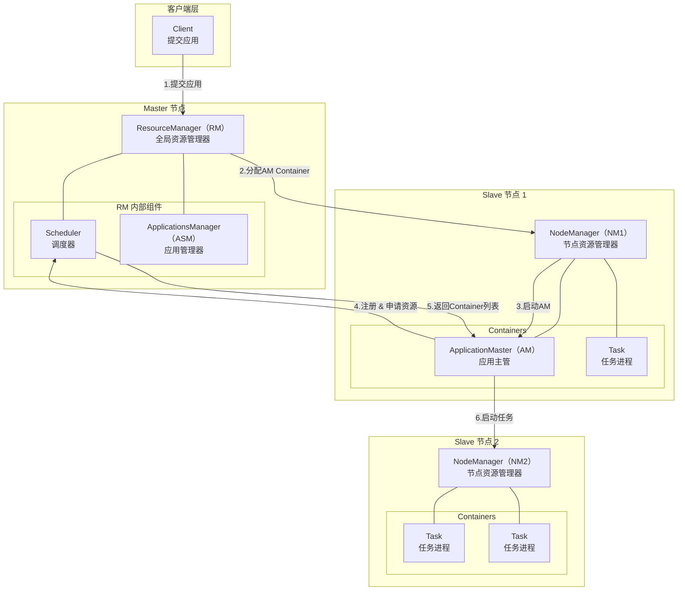
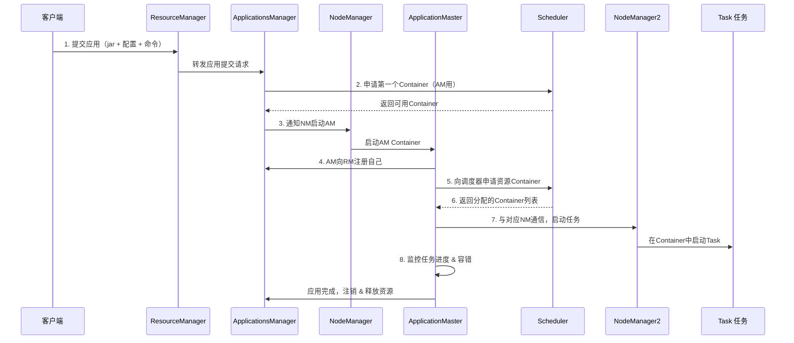
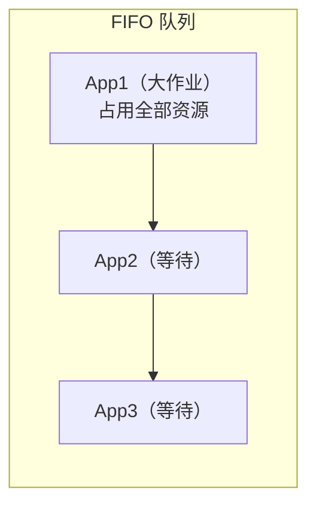
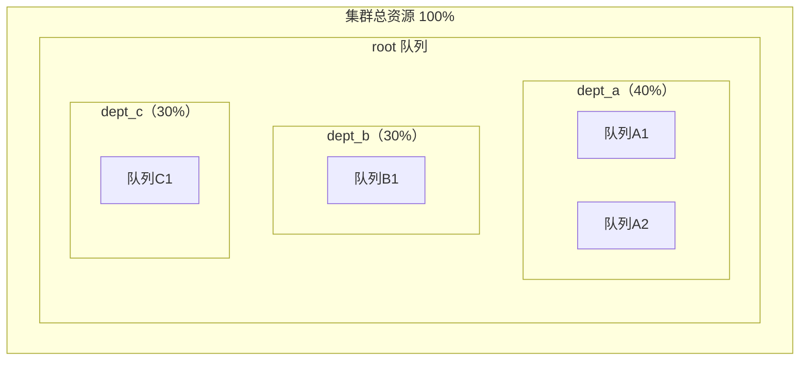
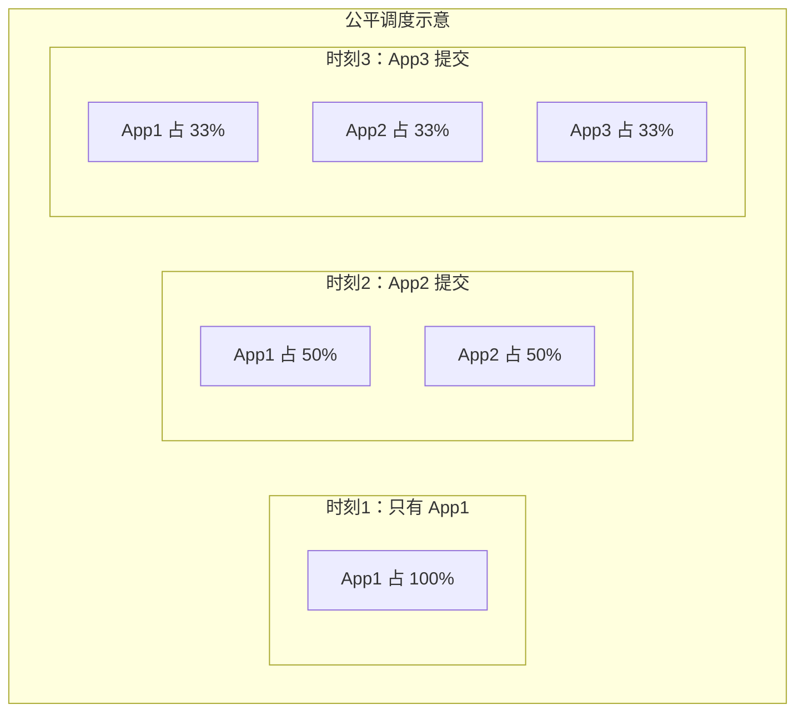

# 第2章 YARN 资源调度框架

> 本文面向 Java 后端面试复习，聚焦 YARN 的核心架构、调度机制与高频考点。对常见表述不准或易混淆之处已就地用 ⚠️ 标注，本章末「资料勘误与重点提醒」集中说明。
>
> 一句话理解 YARN：**YARN（Yet Another Resource Negotiator）是 Hadoop 2.x 引入的通用资源调度框架，核心思想是把「资源调度」和「应用管理」拆成两层——ResourceManager 管全集群资源分配，ApplicationMaster 管单个应用的任务调度，从而支持 MapReduce、Spark、Flink 等多种计算引擎共享同一套集群资源。**

---

## 一、YARN 概述

### 1.1 YARN 是什么

YARN 全称 **Yet Another Resource Negotiator**，直译为"又一个资源协调器"。它是 Hadoop 2.0 从 MapReduce 中剥离出来的**集群资源管理与调度系统**，负责整个集群的资源统一管理和分配，上层可以跑各种计算框架。

> 💡 面试金句：YARN 是大数据生态的"操作系统"，ResourceManager 是"操作系统内核"，Container 是"进程"，各种计算引擎是跑在上面的"应用程序"。

### 1.2 为什么从 MRv1 拆分出来

Hadoop 1.x 时代的 MapReduce（MRv1）采用** JobTracker + TaskTracker **两级架构，存在三大痛点：

| 痛点 | 具体表现 |
|------|---------|
| **JobTracker 单点瓶颈** | 全局只有一个 JobTracker，同时负责资源调度和任务监控，集群规模一大（几千节点）就扛不住 |
| **紧耦合** | 资源调度和应用管理绑在一起，扩展性差，难以支持其他计算模型 |
| **只能跑 MapReduce** | 框架绑定死，想跑流式计算、DAG 计算都不行，资源利用率低 |

YARN 的诞生就是为了解决这些问题：**把 JobTracker 的两大职责拆开来——资源调度交给 ResourceManager，应用管理交给 ApplicationMaster**，从而实现解耦和通用化。

### 1.3 YARN 的核心思想

**「资源调度」与「应用管理」分离**：

- **ResourceManager（RM）**：只关心集群有多少资源、把资源分给谁，不关心应用怎么跑
- **ApplicationMaster（AM）**：每个应用自己管自己的任务调度、容错、监控，不关心资源从哪来

这种分离带来的好处：

1. **通用性**：RM 只管资源，上层可以跑任意计算框架
2. **扩展性**：RM 职责单一，集群可以做到万级节点
3. **多租户共享**：不同团队的不同计算框架共享一套集群资源，提高利用率

### 1.4 YARN 之上可以跑什么

YARN 是通用资源调度层，上层计算引擎百花齐放：

| 计算引擎 | 类型 | 说明 |
|---------|------|------|
| **MapReduce** | 批处理 | YARN 的"原配"，Hadoop 自带 |
| **Spark** | 流批一体 | Spark on YARN 是最常见的部署模式之一 |
| **Flink** | 流批一体 | Flink on YARN 是生产环境主流部署方式 |
| **Storm** | 流处理 | 早期流式引擎，现已逐渐被 Flink 替代 |
| **Tez** | DAG 批处理 | Hive/ Pig 的底层执行引擎，比 MR 更快 |
| **HBase / Hive** | 存储/数仓 | 部分服务也可运行在 YARN 上 |

> ⚠️ 误区提醒：「YARN 只能跑 MapReduce」是错的。YARN 从设计之初就是通用资源调度框架，MapReduce 只是跑在 YARN 上的应用之一。

---

## 二、YARN 核心架构

YARN 采用**主从（Master/Slave）架构**，核心由四大组件构成：

### 2.1 ResourceManager（RM）

**全局资源管理器**，整个集群只有一个 Active 节点（HA 模式下有一个 Standby 待命）。它是 YARN 的"大脑"，负责整个集群的资源管理和分配。

RM 内部包含两个核心组件：

| 组件 | 全称 | 职责 | 特点 |
|------|------|------|------|
| **Scheduler** | 调度器 | 根据容量、队列等约束，将资源分配给各个应用 | 纯调度，不关心应用状态、不做任务监控和容错 |
| **ApplicationsManager（ASM）** | 应用管理器 | 管理所有 ApplicationMaster 的生命周期 | 负责接收应用提交、分配 AM 所需的第一个 Container、监控 AM 存活 |

> 💡 面试金句：Scheduler 是"分蛋糕的人"，只负责切蛋糕、分蛋糕，不管吃蛋糕的人怎么吃。

### 2.2 NodeManager（NM）

**每个工作节点一个**，是该节点的资源和任务管理器。它是 YARN 的"手脚"，负责本节点的资源管理和任务执行。

NM 的核心职责：

1. **心跳上报**：定期向 RM 汇报本节点的资源使用情况和健康状态
2. **Container 管理**：接收 RM/AM 的指令，启动和停止 Container
3. **资源监控**：监控本节点 Container 的资源使用（内存、CPU），防止超限
4. **日志管理**：管理 Container 产生的日志，可聚合到 HDFS

### 2.3 ApplicationMaster（AM）

**每个应用（Application）一个 AM**，是该应用的"大管家"。它负责应用层面的任务调度和容错。

AM 的核心职责：

1. **注册自己**：启动后向 RM/ASM 注册，表明自己活了
2. **申请资源**：根据应用需要，向 RM Scheduler 申请资源（Container）
3. **启动任务**：与 NM 通信，在分配到的 Container 中启动具体任务
4. **任务监控**：监控任务运行进度和状态
5. **容错处理**：任务失败时重新申请资源、重试任务
6. **注销释放**：应用完成后，向 RM 注销自己并释放资源

> ⚠️ 高频易错点：**AM 不是运行在 RM 里的**，AM 和普通任务一样，跑在 NM 的 Container 中。AM 本身就是一个 Container，只是角色特殊——它是应用的"包工头"。

### 2.4 Container（容器）

**YARN 资源的抽象单位**，是 YARN 中资源分配的最小单元。

- 封装了节点上的**多维度资源**：内存（Memory）+ CPU（vcore）+ 磁盘 + 网络等
- 任务（包括 AM 和普通 Task）都运行在 Container 中
- 一个节点上可以有多个 Container
- Container 是**动态分配**的，用完即归还

> 💡 面试金句：Container 不是虚拟机也不是 Docker 容器，它是 YARN 自己定义的「资源配额 + 进程运行环境」的抽象。默认用 Linux 进程 + cgroups 做资源限制，隔离性比 Docker 弱。

### 2.5 四大组件对比

| 组件 | 数量 | 所在位置 | 核心职责 | 给谁打工 |
|------|------|---------|---------|---------|
| **ResourceManager** | 全局 1 个（HA 下 2 个） | Master 节点 | 集群资源分配、AM 管理 | 整个集群 |
| **NodeManager** | 每个节点 1 个 | Slave 节点 | 节点资源管理、Container 启停 | RM + 本节点 |
| **ApplicationMaster** | 每个应用 1 个 | NM 的 Container 中 | 应用任务调度、监控、容错 | 所属应用 |
| **Container** | 多个，动态增减 | NM 管理下 | 资源抽象单位，任务运行载体 | 运行在其中的任务 |

---

## 三、YARN 应用提交流程

这是面试**最高频考点**，必须能完整说出 8 步流程。

### 3.1 八步详解

**第 1 步：客户端提交应用**

客户端（Client）向 ResourceManager 提交应用，内容包括：jar 包、配置信息、启动命令、所需资源等。

**第 2 步：RM 分配 AM Container**

RM 的 ApplicationsManager 接收请求，向 Scheduler 申请第一个 Container——这个 Container 是用来跑 ApplicationMaster 的。

**第 3 步：RM 通知 NM 启动 AM**

Scheduler 分配好 Container 后，ASM 通知对应节点的 NodeManager："在这个 Container 里启动 AM"。

**第 4 步：AM 向 RM 注册**

AM 启动完成后，第一件事就是向 RM/ASM 注册自己。注册成功后，客户端就可以通过 RM 查询到应用状态了。

**第 5 步：AM 申请资源**

AM 根据应用的实际需要（比如 MapReduce 的 Map 任务数、Reduce 任务数），向 RM Scheduler 申请一批 Container 资源。

**第 6 步：RM 返回 Container 列表**

Scheduler 根据调度策略（FIFO / Capacity / Fair）分配资源，返回可用的 Container 列表给 AM。

**第 7 步：AM 启动任务**

AM 拿到 Container 列表后，与对应的 NodeManager 通信，在每个 Container 中启动具体的任务进程（比如 MapTask、ReduceTask）。

**第 8 步：监控与注销**

- 任务运行期间，AM 持续监控任务进度和状态
- 任务失败时，AM 负责重试（重新申请资源、重新启动）
- 应用全部完成后，AM 向 RM 注销自己，释放所有 Container 资源

> 💡 面试金句：**RM 管整个集群的资源分配，AM 管单个应用的任务调度。RM 不管应用怎么跑，AM 不管资源从哪来。分工明确，解耦彻底。**

### 3.2 MRv1 vs YARN 提交流程对比

| 对比项 | MRv1（JobTracker/TaskTracker） | YARN（RM/NM/AM） |
|--------|-------------------------------|------------------|
| 资源调度 + 任务监控 | 都由 JobTracker 负责 | 资源调度由 RM 负责，任务监控由 AM 负责 |
| 单点瓶颈 | JobTracker 单点，集群上限几千节点 | RM 职责单一，支持万级节点 |
| 扩展性 | 差，只能跑 MR | 好，支持任意计算框架 |
| 容错 | TaskTracker 失败由 JobTracker 处理 | AM 失败由 RM/ASM 重启，任务失败由 AM 处理 |

---

## 四、资源调度器详解

YARN 的调度器是**可插拔**的，通过 `yarn.resourcemanager.scheduler.class` 配置切换。核心有三种：FIFO Scheduler、Capacity Scheduler、Fair Scheduler。

### 4.1 FIFO Scheduler（先进先出调度器）

**原理**：所有应用按提交顺序排成一个队列，先来先服务。第一个应用用完所有资源，跑完了第二个再上。

| 维度 | 说明 |
|------|------|
| **优点** | 简单，实现成本低，调度开销小 |
| **缺点** | 大作业占满资源，小作业饿死；不支持多用户；资源利用率可能不高 |
| **适用场景** | 测试环境、单用户、学习演示 |
| **生产使用** | 几乎不用 |

### 4.2 Capacity Scheduler（容量调度器）

CDH（Cloudera Distribution Hadoop）**默认调度器**，是企业级最常用的调度器之一。

**核心思想**：把集群资源分成多个队列，每个队列分配一定容量，队列之间资源隔离，队列内部再做调度。

**核心特点**：

| 特点 | 说明 |
|------|------|
| **容量保证** | 每个队列至少拿到配置的容量，不会被其他队列完全挤占 |
| **弹性共享** | 队列空闲资源可以"借"给其他队列，本队列有任务时再逐步收回 |
| **队列内调度** | 默认队列内 FIFO，也可配置为 DRF 或多层级 capacity |
| **多租户** | 每个队列有 ACL 访问控制，限定哪些用户/组可以提交 |
| **用户限制** | 单个用户不能占满整个队列，防止资源垄断 |
| **优先级** | 支持应用优先级（需开启），高优先级应用优先分配 |

> 💡 容量调度器的精髓：**保底 + 弹性**。每个部门有保底容量，忙时不被抢；闲时资源不浪费，可以借给别人用。

### 4.3 Fair Scheduler（公平调度器）

HDP（Hortonworks Data Platform）**默认调度器**，在对公平性要求高的场景使用广泛。

**核心思想**：所有应用（或队列）**公平分配**集群资源。

**核心特点**：

| 特点 | 说明 |
|------|------|
| **公平共享** | 默认同一队列内所有作业平均分配资源 |
| **多队列** | 支持多个队列，队列间按权重分配资源 |
| **最小共享保证** | 可以配置每个队列的最小资源量，保证关键业务 |
| **抢占（Preemption）** | 队列资源不够时，可以从空闲队列"抢"回资源 |
| **自动放置** | 可根据提交用户自动放入对应队列，无需用户指定 |
| **权重配置** | 支持按权重分配，不是绝对平均 |

> ⚠️ 常见误解：「Fair Scheduler 就是绝对公平」不准确。公平是相对的，可以通过配置权重、最小资源、队列上限等来调整分配策略。

### 4.4 DRF（主导资源公平）

Dominant Resource Fairness，**主导资源公平算法**。

**为什么需要 DRF**：单资源（只看内存）的公平很简单——每个人分一样多的内存。但 YARN 的 Container 是多资源的（内存 + CPU），两个用户一个 CPU 密集、一个内存密集，怎么算"公平"？

**核心思想**：看每个用户的**「主导资源」**（最缺、最紧张的那个资源）的使用率，按主导资源来分配，使得各用户的主导资源使用率相等。

**举例说明**：

假设集群总资源：100 CPU + 100 GB 内存

| 用户 | 任务类型 | 每个任务消耗 | 主导资源 | 公平分配结果 |
|------|---------|-------------|---------|------------|
| 用户 A | CPU 密集型 | 2 CPU + 1 GB | CPU | 50 个任务（用 100 CPU + 50 GB） |
| 用户 B | 内存密集型 | 1 CPU + 4 GB | 内存 | 25 个任务（用 25 CPU + 100 GB） |

两个用户的主导资源使用率都是 **100%**（A 用满 CPU，B 用满内存），这就是 DRF 的公平——**让每个用户最稀缺的那种资源的使用率相等**。

> 💡 面试金句：DRF 是多资源场景下的公平算法——不看你用了多少资源总量，看你最缺的那种资源用了多少，让大家的"最紧张资源"使用率一样。

### 4.5 三种调度器对比

| 维度 | FIFO Scheduler | Capacity Scheduler | Fair Scheduler |
|------|---------------|--------------------|----------------|
| **队列数量** | 单队列 | 多队列 | 多队列 |
| **调度策略** | 先进先出 | 容量保证 + 弹性共享 | 公平分配 + 最小保证 |
| **多租户** | 不支持 | 支持（ACL 控制） | 支持（自动放置） |
| **资源抢占** | 不支持 | 部分支持（弹性收回） | 支持（强制抢占） |
| **实现复杂度** | 低 | 中 | 高 |
| **适用场景** | 测试、单用户 | 企业多部门共享 | 多用户公平共享 |
| **默认发行版** | - | CDH | HDP |
| **生产使用** | 极少 | 最广泛 | 较广泛 |

---

## 五、YARN 资源隔离

### 5.1 为什么需要资源隔离

多个 Container 跑在同一个节点上，如果不做隔离，一个任务的内存泄漏或 CPU 飙高可能把整台节点的资源吃光，导致该节点上所有任务都受影响，甚至节点挂掉。

### 5.2 默认隔离机制

| 隔离维度 | 实现方式 | 原理 | 效果 |
|---------|---------|------|------|
| **内存隔离** | 进程树监控 + 杀死超限进程 | NM 定期检查 Container 的进程树内存使用量（物理内存 + 虚拟内存），超过阈值就 kill 整个 Container | 硬性，超了直接杀 |
| **CPU 隔离** | Linux cgroups（默认不严格限制） | 通过 cgroups 的 cpu 子系统限制 Container 的 CPU 使用份额 | 软性，超了会被限制但不会杀 |

> ⚠️ 重点提醒：YARN 的资源隔离是**轻量级**的，不如 Docker 等容器技术的隔离性强。
>
> - 内存超了直接 kill（比较暴力）
> - CPU 默认只是"软限制"，不一定严格按 vcore 数限制
> - 磁盘 IO、网络等维度基本不隔离
> - 进程之间可以看到彼此（共享操作系统内核）
>
> 生产环境中，越来越多的场景使用 **YARN + Docker** 的组合来增强隔离性。

### 5.3 vcore 的概念

| 概念 | 说明 |
|------|------|
| **vcore** | 虚拟 CPU 核心（virtual core），是 YARN 对 CPU 资源的逻辑抽象，不等于物理核心 |
| **配置比率** | 通过 `yarn.nodemanager.resource.cpu-vcores` 配置每个节点的 vcore 总数，可以大于物理核数（超卖） |
| **为什么用虚拟** | 不同机器 CPU 型号不同，用虚拟核心统一计量，方便调度 |

> 💡 面试金句：vcore 是逻辑概念不是物理核，一个物理核可以对应多个 vcore（超卖），具体比率根据业务场景配置。

---

## 六、常见配置参数

### 6.1 内存相关

| 参数名 | 默认值 | 说明 |
|--------|--------|------|
| `yarn.nodemanager.resource.memory-mb` | 8192 | NM 可分配的总物理内存（MB），即该节点总共能分给 Container 的内存 |
| `yarn.scheduler.minimum-allocation-mb` | 1024 | 调度器分配的最小内存（MB），每次申请的内存必须是这个值的整数倍 |
| `yarn.scheduler.maximum-allocation-mb` | 8192 | 调度器分配的最大内存（MB），单个 Container 最多能申请的内存 |

### 6.2 CPU 相关

| 参数名 | 默认值 | 说明 |
|--------|--------|------|
| `yarn.nodemanager.resource.cpu-vcores` | 8 | NM 可分配的总 vcore 数 |
| `yarn.scheduler.minimum-allocation-vcores` | 1 | 调度器分配的最小 vcore 数 |
| `yarn.scheduler.maximum-allocation-vcores` | 4 | 调度器分配的最大 vcore 数 |

### 6.3 调度器与 AM 相关

| 参数名 | 默认值 | 说明 |
|--------|--------|------|
| `yarn.resourcemanager.scheduler.class` | CapacityScheduler | 调度器实现类，可选 FIFO / Capacity / Fair |
| `yarn.am.liveness-monitor.expiry-interval-ms` | 600000（10分钟） | AM 心跳超时时间，超过这个时间没心跳就认为 AM 挂了，会重启 |
| `yarn.resourcemanager.am.max-attempts` | 2 | AM 最大重试次数 |
| `yarn.nodemanager.pmem-check-enabled` | true | 是否启用物理内存检查，超了 kill |
| `yarn.nodemanager.vmem-check-enabled` | true | 是否启用虚拟内存检查，超了 kill |

---

## 七、YARN 常用命令

### 7.1 应用管理

| 命令 | 说明 |
|------|------|
| `yarn application -list` | 列出所有正在运行的应用 |
| `yarn application -list -appStates ALL` | 列出所有状态的应用（包括已完成的） |
| `yarn application -kill <ApplicationId>` | 杀死指定应用 |
| `yarn application -status <ApplicationId>` | 查看应用状态详情 |

### 7.2 节点管理

| 命令 | 说明 |
|------|------|
| `yarn node -list` | 列出所有节点及状态 |
| `yarn node -list -states RUNNING` | 只列出运行中的节点 |
| `yarn node -status <NodeId>` | 查看指定节点的详细状态 |

### 7.3 队列管理

| 命令 | 说明 |
|------|------|
| `yarn queue -status <QueueName>` | 查看指定队列的状态和资源使用情况 |

### 7.4 日志查看

| 命令 | 说明 |
|------|------|
| `yarn logs -applicationId <ApplicationId>` | 查看指定应用的所有日志 |
| `yarn logs -applicationId <appId> -appOwner <user>` | 查看指定用户应用的日志 |

---

## 八、常见面试题

**Q1：YARN 的核心思想是什么？为什么要从 MRv1 演进到 YARN？**

YARN 的核心思想是**「资源调度」和「应用管理」分离**。MRv1 中 JobTracker 同时负责资源调度和任务监控，存在单点瓶颈、紧耦合、只能跑 MapReduce 三大问题。YARN 把 JobTracker 的职责拆开：ResourceManager 专门负责全局资源调度，ApplicationMaster 负责每个应用的任务管理。这样既解决了单点瓶颈（RM 职责变轻），又实现了通用化（上层可跑任意计算框架）。

**Q2：YARN 的四大核心组件是什么？各自职责是什么？**

1. **ResourceManager（RM）**：全局资源管理器，负责整个集群的资源分配。内部有 Scheduler（纯调度）和 ApplicationsManager（管理 AM 生命周期）。
2. **NodeManager（NM）**：每个节点一个，负责本节点的资源管理、Container 启停、资源监控、日志管理。
3. **ApplicationMaster（AM）**：每个应用一个，负责向 RM 申请资源、与 NM 通信启动任务、监控任务进度和容错。
4. **Container**：YARN 资源的抽象单位，封装了内存、CPU 等资源，任务运行在 Container 中。

**Q3：简述 YARN 应用提交流程。**

八步流程：① 客户端向 RM 提交应用 → ② RM 的 ASM 分配第一个 Container 给 AM → ③ RM 通知对应 NM 启动 AM → ④ AM 启动后向 RM 注册 → ⑤ AM 向 RM Scheduler 申请资源 → ⑥ Scheduler 返回 Container 列表 → ⑦ AM 与 NM 通信，在 Container 中启动任务 → ⑧ AM 监控任务进度和容错，应用完成后向 RM 注销并释放资源。

**Q4：MRv1 和 YARN 的区别是什么？**

| 维度 | MRv1 | YARN |
|------|------|------|
| 架构 | JobTracker + TaskTracker 两级 | RM + NM + AM 三级 |
| 资源调度 + 任务管理 | 都由 JobTracker 负责 | 资源调度由 RM 负责，任务管理由 AM 负责 |
| 扩展性 | 差，几千节点上限 | 好，支持万级节点 |
| 通用性 | 只能跑 MapReduce | 通用，支持各种计算框架 |
| 容错 | JobTracker 单点故障 | RM HA + AM 重启 |

**Q5：YARN 的三种调度器有什么区别？适用什么场景？**

- **FIFO**：单队列、先进先出，简单但不适合多用户，只用于测试。
- **Capacity Scheduler**：多队列、容量保证 + 弹性共享，企业多部门共享集群首选，CDH 默认。
- **Fair Scheduler**：多队列、公平分配、支持抢占，追求公平性的多用户场景，HDP 默认。

**Q6：Capacity Scheduler 和 Fair Scheduler 的核心区别是什么？**

Capacity Scheduler 以**容量保证**为核心——每个队列有保底容量，闲时可借出，核心是"资源不浪费 + 各部门有保障"。Fair Scheduler 以**公平性**为核心——所有应用/队列公平分配资源，支持抢占，核心是"大家分得一样多"。实际生产中，Capacity Scheduler 使用更广泛，因为企业更关注"我的保底资源能不能拿到"，而不是"绝对公平"。

**Q7：什么是 DRF？为什么需要它？**

DRF（Dominant Resource Fairness，主导资源公平）是多资源场景下的公平调度算法。单资源（只看内存）的公平很简单，每人分一样多。但 YARN 是多资源（内存 + CPU），有的任务 CPU 密集、有的内存密集，无法用单一维度衡量公平。DRF 的做法是找出每个用户的"主导资源"（最紧张的那个），让各用户的主导资源使用率相等，从而实现多资源下的公平。

**Q8：Container 是什么？和 Docker 容器有什么区别？**

Container 是 YARN 中资源的抽象单位，封装了内存、CPU 等资源，任务运行在 Container 中。和 Docker 容器的区别：

| 维度 | YARN Container | Docker 容器 |
|------|---------------|------------|
| 隔离级别 | 进程级（共享内核） | 容器级（namespace + cgroups） |
| 隔离强度 | 轻量级，较弱 | 较强，接近虚拟机 |
| 隔离维度 | 主要是内存和 CPU | 内存、CPU、磁盘、网络、PID 等 |
| 镜像 | 无镜像概念 | 有完整镜像机制 |
| 便携性 | 差，依赖节点环境 | 好，一次构建到处运行 |

**Q9：ApplicationMaster 的作用是什么？它运行在哪里？**

ApplicationMaster 是每个应用的"大管家"，负责：向 RM 申请资源、与 NM 通信启动任务、监控任务进度、任务失败重试、应用完成后注销释放资源。**AM 运行在 NM 的 Container 中**，和普通任务一样——它本身就是一个 Container，只是角色特殊。它不是运行在 RM 里的，这是高频易错点。

**Q10：YARN 的资源隔离是怎么做的？**

YARN 做的是**轻量级资源隔离**：
- **内存隔离**：通过监控进程树的内存使用量（物理 + 虚拟），超过阈值就 kill 整个 Container，是硬性限制。
- **CPU 隔离**：通过 Linux cgroups 限制 CPU 使用份额，是软性限制，超了不会 kill 只是被限制。
- 磁盘 IO、网络等基本不隔离。
- 总体隔离性弱于 Docker 等容器技术。

**Q11：vcore 是什么？和物理核有什么关系？**

vcore（virtual core，虚拟核心）是 YARN 对 CPU 资源的逻辑抽象，不等于物理核心。一个物理核可以配置对应多个 vcore（即 CPU 超卖），具体通过 `yarn.nodemanager.resource.cpu-vcores` 配置。vcore 是统一计量单位，方便不同硬件配置的节点统一调度。

**Q12：YARN 的 HA 是怎么做的？**

ResourceManager 有单点问题，HA 方案通过 **ZooKeeper + 多个 RM 节点**实现：
- 集群中启动多个 RM 节点，一个 Active，其余 Standby
- 通过 ZooKeeper 做 leader 选举和状态同步
- Active RM 挂掉后，ZooKeeper 自动从 Standby 中选一个切换为 Active
- 切换时，应用状态（如 AM 信息）存储在 ZooKeeper 或 HDFS 的 RM StateStore 中，新 Active RM 可以恢复

NodeManager 和 ApplicationMaster 不需要 HA，因为 NM 挂了只是节点失效，AM 挂了 RM 会自动重启。

**Q13：如果一个 Task 失败了，YARN 会怎么处理？**

任务失败的处理主要由 **ApplicationMaster** 负责：
1. AM 检测到任务失败（通过心跳超时或 NM 上报）
2. AM 向 RM 重新申请资源（如果需要的话）
3. AM 选择另一个节点，重新启动失败的任务
4. 每个任务有最大重试次数（MapReduce 默认 4 次 Map、4 次 Reduce）
5. 超过重试次数仍失败，则整个应用失败

> ⚠️ 注意：任务失败的容错是 AM 负责的，不是 RM 负责的。RM 只管资源分配，不管任务成功失败。

**Q14：如果 AM 挂了怎么办？**

AM 挂了由 **RM 的 ApplicationsManager** 负责处理：
1. RM 检测到 AM 超时没心跳（默认 10 分钟）
2. RM 重新分配一个 Container，在新的节点上重启 AM
3. AM 最大重试次数通过 `yarn.resourcemanager.am.max-attempts` 配置（默认 2 次）
4. 超过次数后，整个应用标记为失败
5. 新启动的 AM 需要自己恢复应用状态（各框架自己实现，如 MapReduce 从之前的进度恢复）

**Q15：节点（NodeManager）挂了会怎样？**

1. NM 心跳超时后，RM 将该节点标记为失效
2. 该节点上所有 Container（包括 AM 和普通 Task）都被视为丢失
3. 如果某个应用的 AM 恰好在这个节点上，RM 会在其他节点重启 AM（见 Q14）
4. 普通 Task 丢失后，由各自的 AM 负责重新申请资源和重启任务
5. 节点恢复后，重新向 RM 注册，加入集群

**Q16：YARN 中 Container 的资源是怎么分配的？有最小粒度吗？**

Container 的资源分配有最小粒度和最大限制：
- **最小分配内存**：`yarn.scheduler.minimum-allocation-mb`（默认 1024 MB）
- **最大分配内存**：`yarn.scheduler.maximum-allocation-mb`（默认 8192 MB）
- **最小分配 vcore**：`yarn.scheduler.minimum-allocation-vcores`（默认 1）
- **最大分配 vcore**：`yarn.scheduler.maximum-allocation-vcores`（默认 4）

申请的资源必须是最小值的整数倍，小于最小值的按最小值算。这是为了方便调度器管理和减少资源碎片。

---

## 九、资料勘误与重点提醒

1. ⚠️ **「YARN 只能跑 MapReduce」是错的**。YARN 从设计之初就是通用资源调度框架，MapReduce 只是跑在 YARN 上的应用之一。YARN 上还能跑 Spark、Flink、Storm、Tez 等各种计算引擎。

2. ⚠️ **ResourceManager 只管资源调度，不管应用怎么跑**。很多人以为 RM 管任务调度，实际上应用层面的任务分配、监控、容错全是 ApplicationMaster 负责的。RM 的 Scheduler 只做一件事：根据策略把 Container 分给谁，分完就不管了。

3. ⚠️ **ApplicationMaster 是每个应用一个，不是全局一个**。常有人把 AM 和 RM 搞混。RM 是全局唯一的资源大管家，AM 是每个应用自己的包工头——每个应用都有自己的 AM，彼此独立。

4. ⚠️ **「ApplicationMaster 跑在 RM 里」是错的**。AM 跑在 NM 的 Container 里，和普通任务一样，只是角色不同。AM 本身就是一个 Container，是应用启动后 RM 分配的第一个 Container。

5. ⚠️ **「Capacity Scheduler 队列内一定是 FIFO」不严谨**。Capacity Scheduler 的队列内默认是 FIFO，但也可以配置为 DRF（主导资源公平）或多层级 capacity 调度。实际生产中 FIFO 用得最多，但不是唯一选择。

6. ⚠️ **YARN 的资源隔离是轻量级的，不是强隔离**。YARN 的 Container 只是"进程 + 资源配额"的概念，内存超了 kill、CPU 软限制，磁盘 IO 和网络基本不隔离。隔离性远弱于 Docker/Kubernetes 等容器技术。生产环境常用 YARN + Docker 组合增强隔离。

7. ⚠️ **vcore 不是物理核**。vcore 是虚拟核心（virtual core），是 YARN 定义的逻辑概念，一个物理核可以配置对应多个 vcore（超卖），具体比率由 `yarn.nodemanager.resource.cpu-vcores` 控制。

8. ⚠️ **「Fair Scheduler 就是绝对公平」不准确**。Fair Scheduler 的"公平"是相对的，可以配置权重、最小资源、队列上限、用户上限等。实际使用中，通常会配置各种限制来防止某些用户/队列过度使用资源，公平是在约束条件下的公平。

9. ⚠️ **任务失败的容错是 AM 负责，不是 RM 负责**。这是 YARN 架构的核心设计——RM 只做资源调度，应用的所有状态管理（监控、容错、重试）都下放到 AM。这个职责划分必须搞清楚，是面试常考点。

10. ⚠️ **YARN 的 Scheduler 是可插拔的**，不是固定的。通过 `yarn.resourcemanager.scheduler.class` 配置可以切换 FIFO、Capacity、Fair 三种调度器，甚至可以自定义调度器。这体现了 YARN 的良好扩展性。
