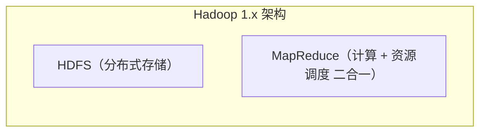
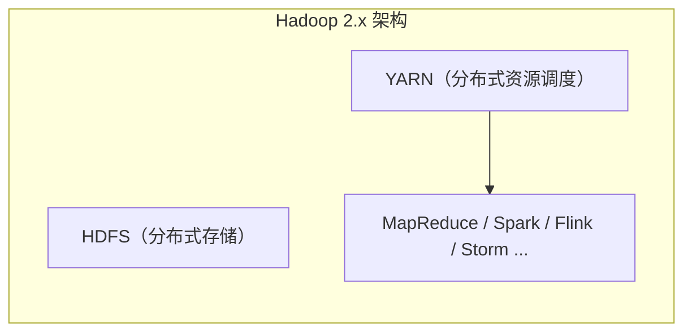
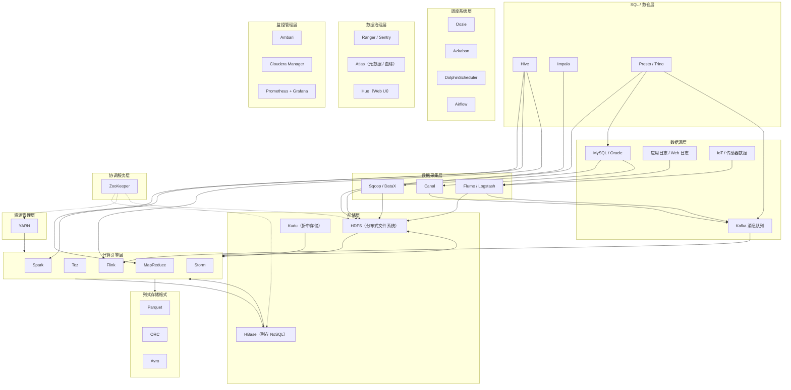
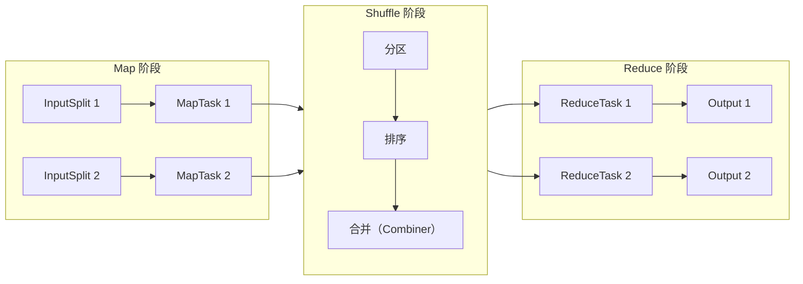

# 第3章 Hadoop 生态全景

> 本文面向 Java 后端面试复习，聚焦 Hadoop 生态的整体认知与组件选型。广度优先、深度次之——每个组件讲清定位、核心特点与面试答法，底层原理留给各组件专门篇章。
>
> 一句话理解 Hadoop 生态：**Hadoop 是大数据时代的"操作系统"——HDFS 是分布式硬盘、YARN 是分布式 CPU 调度器、MapReduce 是第一代计算程序；围绕这三大核心，长出了存储、计算、SQL、采集、调度、治理等一整套分布式数据处理工具链。**

---

## 一、Hadoop 是什么

**Hadoop 是 Apache 开源的分布式计算平台**，核心能力是**分布式存储 + 分布式计算**，解决的是单台机器存不下、算不动海量数据的问题。

它起源于 Google 的三篇奠基性论文（"三驾马车"）：

| Google 论文 | Hadoop 对应实现 | 解决的问题 |
|---|---|---|
| **GFS**（Google File System, 2003） | **HDFS** | 海量数据怎么存 |
| **MapReduce**（2004） | **MapReduce** | 海量数据怎么算 |
| **BigTable**（2006） | **HBase** | 海量结构化数据怎么随机读写 |

> 💡 面试金句：Hadoop 不是一个软件，而是 Google 三篇论文的开源实践。Doug Cutting（Lucene/Nutch 之父）照着论文把它实现了，名字来自他儿子的黄色玩具大象。

---

## 二、Hadoop 发展历程

### 2.1 Hadoop 1.x 时代（2008 ~ 2014）

**构成**：HDFS + MapReduce 两块板。

**架构**：JobTracker（主节点，负责任务调度和资源管理）+ TaskTracker（从节点，执行任务）。

**三大致命问题**：

1. **JobTracker 单点瓶颈**：所有任务的调度都由一个 JobTracker 管，集群大了压力巨大。
2. **资源管理与计算框架紧耦合**：MapReduce 既当爹又当妈——既要管 CPU/内存分配，又要跑计算逻辑。
3. **只能跑 MapReduce**：想跑别的计算框架（如 Storm、Spark）？没门，资源不共享。

### 2.2 Hadoop 2.x 时代（2013 至今）

**构成**：HDFS + YARN + MapReduce 三块板。

最核心的变化是引入了 **YARN**（Yet Another Resource Negotiator），把**资源调度**从 MapReduce 中抽离出来，变成通用的资源管理平台。

**YARN 的意义**：计算引擎可以百花齐放——MR、Spark、Flink、Storm 都能跑在 YARN 上，共享集群资源。这是 Hadoop 生态繁荣的基础。

同时 HDFS 也升级了：
- **HA（High Availability）**：NameNode 从 1 个变 2 个（Active + Standby），解决单点故障。
- **Federation（联邦）**：多个 NameNode 分管不同目录，解决单个 NN 内存瓶颈。

### 2.3 Hadoop 3.x 时代（2017 至今）

| 新特性 | 说明 |
|---|---|
| **HDFS 纠删码（Erasure Coding）** | 替代 3 副本策略，同样的容错能力下存储开销从 3x 降到 1.5x 左右，节省大量存储空间 |
| **多 NameNode 支持** | HA 从 2 个 NN 扩展到支持多个 NN 的联邦 + HA，更大规模集群 |
| **容器化支持** | 原生支持 Docker，YARN 可以调度 Docker 容器 |
| **JDK 8+ 基线** | 去掉 32 位和 JDK 7 支持 |
| **MapReduce 任务级别的 Native 优化** | 性能提升 |
| **Shell 脚本重写** | 修复大量脚本 bug |
| **DataNode 数据平衡工具优化** | 数据均衡效率提升 |

> 💡 面试金句：Hadoop 1.x 是两块板（HDFS+MR），2.x 是三块板（HDFS+YARN+MR），YARN 的加入让计算引擎可替换——这是 Hadoop 生态繁荣的转折点。3.x 最大的亮点是纠删码，省存储空间。

---

## 三、Hadoop 三大核心组件

### 3.1 HDFS：分布式文件系统

**定位**：Hadoop 的存储底座，解决"海量数据存不下"的问题。

**核心架构**：NameNode（存元数据）+ DataNode（存实际数据）+ SecondaryNameNode（辅助合并元数据，**⚠️ 不是热备**）。

**特点**：
- 大文件存储，支持 GB/ TB/PB 级
- 一次写入、多次读取（WORM）
- 高容错（默认 3 副本）
- 不适合小文件、不适合随机修改、不适合低延迟访问

> ⚠️ 很多初学者以为 SecondaryNameNode 是 NameNode 的热备，错！它只是定期合并 fsimage 和 edits，防止 edits 过大。真正的热备是 2.x 的 HA 机制（Active/Standby NN）。

### 3.2 YARN：分布式资源调度框架

**定位**：Hadoop 的"操作系统内核"，管理集群的 CPU、内存资源，为各种计算框架分配资源。

**核心架构**：ResourceManager（全局资源管理）+ NodeManager（单节点资源管理）+ ApplicationMaster（单应用的任务调度）。

**特点**：
- 资源调度与计算框架解耦
- 支持多种计算引擎（MR/Spark/Flink/...）
- 可插拔调度器（FIFO / Capacity / Fair Scheduler）

### 3.3 MapReduce：分布式计算框架

**定位**：Hadoop 原生的离线批处理计算引擎，解决"海量数据算不动"的问题。

**核心思想**：分而治之——Map 阶段并行处理，Reduce 阶段聚合结果。

**特点**：
- 编程简单，只需要实现 Map 和 Reduce 两个函数
- 高容错，任务失败自动重试
- 缺点：慢！中间结果落盘，磁盘 IO 多，迭代计算尤其慢
- 适合：一次性离线批处理、对实时性要求不高的场景

> 💡 面试金句：Hadoop 1.x 是"两块板"（HDFS + MR），2.x 是"三块板"（HDFS + YARN + MR）。YARN 的加入让计算引擎可以替换，这是 Hadoop 生态繁荣的基础。

---

## 四、Hadoop 生态全景

Hadoop 早已不是 HDFS + MapReduce 两个组件那么简单，它已经形成了一个庞大的技术生态。下面用分层架构图整体认识一下：

### 4.1 存储层

| 组件 | 定位 | 核心特点 | 典型场景 |
|---|---|---|---|
| **HDFS** | 分布式文件系统 | 大文件、高吞吐、3 副本容错、不支持随机修改 | 海量数据存储底座 |
| **HBase** | 分布式列存 NoSQL | 基于 HDFS、支持随机读写、海量数据、按 RowKey 查询 | 海量数据的实时查询（如订单明细、用户画像标签） |
| **Kudu** | 折中存储引擎 | 介于 HDFS 和 HBase 之间，既支持快速扫描又支持随机更新 | 实时数仓（Lambda 架构的 Serving 层） |

### 4.2 计算引擎层

| 引擎 | 类型 | 速度 | 核心特点 | 现状 |
|---|---|---|---|---|
| **MapReduce** | 离线批处理 | 慢（磁盘 IO 多） | Hadoop 原生、编程简单、高容错 | 传统企业存量多，新项目少用 |
| **Tez** | 离线批处理（DAG） | 比 MR 快 2~10 倍 | 基于 MR 优化、DAG 执行、减少落盘 | Hive on Tez 是常见组合 |
| **Spark** | 内存计算（批为主） | 比 MR 快 10~100 倍 | 内存计算、DAG、RDD、支持 SQL/流/图/ML | ⭐ 主流离线计算引擎 |
| **Flink** | 流批一体 | 毫秒级（流）/ 与 Spark 相当（批） | 原生流处理、有状态计算、事件时间、exactly-once | ⭐ 主流实时计算引擎 |
| **Storm** | 实时流处理 | 毫秒级 | 第一代流引擎、无状态（需要自己管）、at-least-once | 逐渐被 Flink 替代 |

### 4.3 SQL / 数仓层

| 组件 | 定位 | 核心特点 | 底层引擎 |
|---|---|---|---|
| **Hive** | 数据仓库工具 | HQL 类 SQL、元数据管理、适合离线批处理 | MR / Tez / Spark / Flink |
| **Impala** | 实时 SQL 查询 | MPP 架构、内存计算、低延迟查询 | 自研引擎（与 Hive 共用元数据） |
| **Presto / Trino** | 分布式 SQL 查询 | 多数据源联邦查询、不存数据、纯计算 | 自研（MPP 架构） |
| **Pig** | 脚本式数据分析 | Pig Latin 语言、偏过程式 | MR |

> ⚠️ 注意：Hive 本身**不是数据库**，它不存数据，数据存在 HDFS 上，Hive 只存元数据（表结构、分区信息等）。HQL 最终被翻译成计算任务去跑。

### 4.4 列式存储格式

| 格式 | 类型 | 特点 | 最佳搭档 |
|---|---|---|---|
| **Parquet** | 列式存储 | 嵌套结构友好（Google Dremel 思想）、语言无关、Spark 默认 | Spark / Impala / Presto |
| **ORC** | 列式存储 | 压缩率更高、ACID 支持更好、Hive 默认 | Hive |
| **Avro** | 行式存储 + Schema | Schema 随数据走、序列化友好、RPC 常用 | Kafka / Flume / 数据交换 |

> 💡 面试金句：行存适合 OLTP（查整行），列存适合 OLAP（聚合分析少数字段）。Parquet 和 ORC 是大数据 OLAP 的两大主流列存格式。

### 4.5 协调服务

| 组件 | 定位 | 在 Hadoop 生态中的作用 |
|---|---|---|
| **ZooKeeper** | 分布式协调服务 | 配置管理、命名服务、分布式锁、选主、服务发现 |

**Hadoop 生态重度依赖 ZK 的组件**：
- HDFS HA：Active / Standby NameNode 选主
- YARN HA：ResourceManager 选主
- HBase：HMaster 选主 + RegionServer 状态管理
- Kafka：Broker 注册 + Controller 选举 + 消费者 offset（0.8 版本前）
- Storm / Flink on YARN：协调

> ⚠️ ZooKeeper 不是 Hadoop 的子项目，它是独立的 Apache 顶级项目，只是 Hadoop 生态很多组件都依赖它。

### 4.6 数据采集层

| 组件 | 定位 | 核心特点 | 典型场景 |
|---|---|---|---|
| **Sqoop** | RDBMS ↔ Hadoop 数据同步 | 基于 JDBC、并行导入导出、支持增量 | MySQL ↔ HDFS / Hive 批量同步 |
| **Flume** | 日志采集系统 | Agent → Collector → 存储、基于事件流、多种 Source/Sink | 服务器日志实时采集入 HDFS / Kafka |
| **DataX** | 异构数据源同步 | 阿里开源、框架 + 插件模式、支持 20+ 数据源 | 各种数据库 / 文件 / ES 之间同步 |
| **Canal** | MySQL 增量数据采集 | 模拟 MySQL Slave、解析 binlog、准实时 | MySQL 数据实时同步到下游 |
| **Kafka** | 分布式消息队列 | 高吞吐、持久化、多消费者组 | 解耦、削峰、实时数据管道 |

### 4.7 调度系统层

| 组件 | 定位 | 特点 | 技术栈 |
|---|---|---|---|
| **Oozie** | Hadoop 官方工作流调度 | XML 配置、功能强但重、学习曲线陡 | Java |
| **Azkaban** | 轻量级工作流调度 | LinkedIn 开源、Web 界面友好、properties 配置 | Java |
| **DolphinScheduler** | 分布式工作流调度 | 易观开源、可视化 DAG 拖拽、多租户、国内很火 | Java |
| **Airflow** | 工作流调度 | Python 写的、代码定义工作流（DAG as Code）、生态丰富 | Python |

### 4.8 数据治理层

| 组件 | 定位 | 核心功能 |
|---|---|---|
| **Hive Metastore** | 元数据中心 | 存储表结构、分区、位置等元数据，被 Hive/Spark/Presto/Impala 共用 |
| **Ranger / Sentry** | 权限管理 | 细粒度权限控制（表/列/行级）、统一授权 |
| **Atlas** | 元数据管理 + 数据血缘 | 数据资产目录、血缘追踪、分类标签 |
| **Hue** | Web UI 工具 | 统一 Web 界面，管理 HDFS / Hive / HBase / YARN 等 |

### 4.9 监控与管理层

| 组件 | 定位 | 所属发行版 |
|---|---|---|
| **Ambari** | 集群安装部署 + 监控 + 告警 | HDP（Hortonworks Data Platform） |
| **Cloudera Manager** | 集群管理工具（功能更全） | CDH（Cloudera Distribution Hadoop） |
| **Prometheus + Grafana** | 通用监控方案 | 独立，现在越来越多大数据组件暴露 Prometheus 指标 |

> ⚠️ HDP 和 Cloudera 已经合并（CDP），Ambari 交给 Apache 了。CDH 商业版收费，很多国内公司转向自建 + 开源组件。

---

## 五、MapReduce 原理简述

MapReduce 是 Hadoop 原生的计算框架，核心思想是**分而治之**，整个流程分三个阶段：**Map → Shuffle → Reduce**。

### 5.1 各阶段说明

| 阶段 | 做什么 | 关键概念 |
|---|---|---|
| **Map 阶段** | 每个 InputSplit 对应一个 MapTask，逐行读取数据，输出 `<k,v>` 键值对 | InputSplit（逻辑分片）、RecordReader、map() 函数 |
| **Shuffle 阶段** | 分区 → 排序 → 合并 → 拉取到 Reduce 端 | Partitioner、Combiner、Sort、Spill、Merge |
| **Reduce 阶段** | 按 key 分组聚合，输出最终结果 | reduce() 函数、OutputFormat |

### 5.2 两个重要概念

- **Combiner（Map 端局部聚合）**：在 Map 输出后先做一次 reduce，减少网络传输量。**前提是满足交换律和结合律**（求和、求 max 可以，求平均值不行）。
- **Partitioner（分区器）**：决定 Map 的输出记录进入哪个 ReduceTask。默认 HashPartitioner（`key.hashCode() % numReduceTasks`）。

### 5.3 MapReduce 为什么慢？

1. **中间结果落盘**：Map 输出写本地磁盘，Reduce 拉取后也要溢写磁盘，磁盘 IO 是瓶颈。
2. **只有 Map 和 Reduce 两个阶段**：复杂逻辑需要多次 MR 串联，中间结果反复读写 HDFS。
3. **任务启动开销大**：每个 Task 都是独立 JVM 进程，启动慢。
4. **没有内存计算模型**：迭代计算（如机器学习）每轮都要重新读数据。

> 💡 面试金句：Spark 快的核心原因是**内存计算 + DAG 执行**——中间结果放内存不落盘，多阶段任务组成 DAG 整体优化，避免了 MR 每轮都读 HDFS 的开销。

---

## 六、核心组件选型对比

### 6.1 Hive vs HBase vs MySQL

| 维度 | MySQL（RDBMS） | Hive | HBase |
|---|---|---|---|
| 类型 | 关系型数据库 | 数据仓库工具 | 列存 NoSQL 数据库 |
| 数据量 | GB ~ TB 级 | PB 级 | PB 级 |
| 查询语言 | SQL | HQL（类 SQL） | 原生不支持 SQL（Phoenix 可加） |
| 延迟 | 毫秒级 | 分钟 ~ 小时级 | 毫秒级（按 RowKey 查询） |
| 事务 | 完整 ACID | 有限支持（ORC + ACID） | 行级 ACID |
| 索引 | B+ 树索引 | 分区 + 分桶 + 索引 | RowKey 顺序存储 |
| 适用场景 | OLTP 业务系统 | 离线数仓、报表分析 | 海量数据随机读写 |
| 存储位置 | 本地磁盘 | HDFS | HDFS |

### 6.2 MapReduce vs Spark vs Flink

| 维度 | MapReduce | Spark | Flink |
|---|---|---|---|
| 计算模型 | Map + Reduce 两阶段 | DAG + 内存计算 | 原生流（事件驱动） |
| 世界观 | 批 | 批（微批模拟流） | 流（批是流的特例） |
| 延迟 | 分钟 ~ 小时 | 秒 ~ 分钟 | 毫秒级 |
| 速度基准 | 1x | 10 ~ 100x（内存中） | 流处理更快，批处理相当 |
| 状态管理 | 无（自己管） | DStream 有状态/Structured Streaming | 内置状态后端（Memory / RocksDB） |
| 容错 | 任务重试 | RDD 血统 + Checkpoint | Checkpoint + Savepoint |
| 适合场景 | 简单离线批处理 | 离线批处理 + SQL + ML | 实时流处理 + 流批一体 |

### 6.3 Parquet vs ORC

| 维度 | Parquet | ORC |
|---|---|---|
| 起源 | Google Dremel 思想 + Twitter/Cloudera | Facebook / Hortonworks |
| 嵌套结构 | ⭐ 优秀（Dremel 论文实现） | 一般 |
| 压缩率 | 高 | ⭐ 更高（通常比 Parquet 高 5~10%） |
| ACID 支持 | 不原生支持 | ⭐ 支持（Hive ACID） |
| 语言无关 | ⭐ 是（Java / C++ / Python / Go ...） | Java 为主 |
| 默认搭档 | Spark / Impala / Presto | Hive |
| 索引 | 块级 min/max 统计 | ⭐ 更丰富（Stripe级 + 行组索引 + 布隆过滤器） |

### 6.4 Oozie vs Azkaban vs DolphinScheduler

| 维度 | Oozie | Azkaban | DolphinScheduler |
|---|---|---|---|
| 来源 | Apache 官方 | LinkedIn | 易观（已进 Apache） |
| 配置方式 | XML（复杂） | properties 文件 + zip | ⭐ 可视化 DAG 拖拽 |
| 学习成本 | 高 | 中 | 低 |
| 分布式架构 | 是 | 弱（主从） | ⭐ 去中心化多 Worker |
| 多租户 | 弱 | 弱 | ⭐ 完善 |
| 国内使用 | 少 | 中等 | ⭐ 很火 |
| 适用规模 | 中大型 | 中小 | 大 / 超大规模 |

### 6.5 HDFS vs HBase

| 维度 | HDFS | HBase |
|---|---|---|
| 本质 | 分布式文件系统 | 分布式 NoSQL 数据库（基于 HDFS） |
| 数据模型 | 文件（按块存储） | Key-Value / 列族 |
| 访问方式 | 流式读写（整个文件） | 随机读写（按 RowKey） |
| 延迟 | 高（适合大文件顺序读） | 低（毫秒级随机读） |
| 写入 | 追加写（不可修改） | 可更新、可删除 |
| 适合场景 | 文件存储、数仓底层 | 海量数据的实时查询 |
| 关系 | — | HBase 底层数据存在 HDFS 上 |

---

## 七、经典面试题

### 基础认知题

**Q1：Hadoop 1.0 和 2.0 的区别？**
核心区别是 2.0 引入了 **YARN**，把资源调度从 MapReduce 中解耦出来。1.0 是 HDFS + MapReduce 两块板，JobTracker 既管资源又管任务调度，有单点瓶颈且只能跑 MR。2.0 是 HDFS + YARN + MR 三块板，YARN 做通用资源管理，支持 MR / Spark / Flink / Storm 等多种计算框架。另外 HDFS 在 2.0 增加了 HA 和 Federation。

**Q2：说一下你了解的 Hadoop 生态组件。（开放题，考察知识广度）**
答题思路：**分层回答**——存储层（HDFS / HBase / Kudu）、计算引擎层（MR / Spark / Flink）、SQL 层（Hive / Impala / Presto）、采集层（Sqoop / Flume / DataX / Kafka）、调度层（Oozie / Azkaban / DolphinScheduler）、治理层（Ranger / Atlas）、协调服务（ZooKeeper）。每个说一句话定位 + 核心特点，突出广度和条理。

> 💡 面试金句：回答生态题一定要分层说，不要东一榔头西一棒子。从"数据怎么进来 → 怎么存 → 怎么算 → 怎么调 → 怎么管"的数据流讲，逻辑清晰。

### 存储相关题

**Q3：HDFS 小文件问题是什么？有哪些解决方案？**
小文件问题：大量小文件会导致 NameNode 内存压力大（每个文件元数据约 150 字节，1 亿个文件就占 15GB 内存），而且 MapTask 数量多、每个处理数据少，效率低。
解决方案：
- **HDFS 端**：HAR 归档、SequenceFile / CombineFileInputFormat
- **计算端**：用 CombineTextInputFormat 合并小文件输入
- **Hive 端**：合并小文件（`hive.merge.mapfiles`）、动态分区调整
- **架构层**：引入 HBase / 对象存储，减少小文件数量

**Q4：HDFS 和 HBase 怎么选？**
如果是**文件级存储、顺序读写、大文件为主**，选 HDFS；如果需要**随机读写、按 key 快速查询、海量结构化数据**，选 HBase。HBase 底层基于 HDFS，两者是互补关系。

### 计算引擎题

**Q5：MapReduce 的 Shuffle 过程详细解释一下。**
Shuffle 是 Map 输出到 Reduce 输入之间的过程，分 Map 端和 Reduce 端：
- **Map 端**：Map 输出先写入环形缓冲区（默认 100MB），达到 80% 阈值时开始 spill（溢写）到磁盘。溢写前按分区排序、可选执行 Combiner。多个 spill 文件最后合并成一个有序文件。
- **Reduce 端**：ReduceTask 从各个 MapTask 拉取属于自己分区的数据，存入内存缓冲区，满了溢写到磁盘。所有数据拉完后做归并排序，然后分组调用 reduce() 函数。

> 💡 面试金句：Shuffle 的本质是**"按 key 分桶 + 排序"**，目的是让相同 key 的数据到同一个 Reduce 上聚合。

**Q6：MapReduce 有哪些优化手段？**
- **输入优化**：CombineFileInputFormat 合并小文件，减少 MapTask 数量
- **Map 端优化**：调大环形缓冲区、使用 Combiner（满足结合律时）、Snappy 压缩 Map 输出
- **Reduce 端优化**：合理设置 ReduceTask 数量、调大 reduce 端缓冲区
- **数据倾斜优化**：对倾斜 key 加随机前缀打散
- **JVM 优化**：重用 JVM（`mapreduce.job.jvm.numtasks=-1`）

**Q7：MapReduce 为什么慢？Spark 为什么比 MR 快？**
MR 慢的原因：① 中间结果落盘，磁盘 IO 多；② 只有 Map+Reduce 两阶段，复杂逻辑需要多次 MR 串联，中间结果写 HDFS；③ 每个 Task 独立 JVM，启动开销大。
Spark 快的原因：① **内存计算**，中间结果放内存不落盘；② **DAG 执行**，多阶段任务组成 DAG 整体优化，阶段间只做 shuffle；③ **RDD 血统**，容错不需要回滚整个作业。

### Hive 相关题

**Q8：Hive 的架构是什么？HQL 转 MR 的过程？**
Hive 架构：用户接口（CLI / JDBC / WebUI）→ Driver（解析器 / 编译器 / 优化器 / 执行器）→ Metastore（元数据）→ HDFS / MapReduce。
HQL → MR 的过程：① SQL 解析（Antlr 语法解析，生成 AST）→ ② 语义分析（从 Metastore 取元数据，生成 OperatorTree）→ ③ 逻辑优化（如谓词下推、列裁剪）→ ④ 物理计划（生成 MapReduce 任务树）→ ⑤ 物理优化（如合并 MapReduce 任务）→ ⑥ 执行（提交到 YARN 运行）。

**Q9：Hive 内部表和外部表的区别？**

| 维度 | 内部表（Managed Table） | 外部表（External Table） |
|---|---|---|
| 关键字 | `CREATE TABLE ...` | `CREATE EXTERNAL TABLE ...` |
| 数据管理 | Hive 管理 | HDFS 管理 |
| DROP TABLE | 元数据 + 数据**都删** | **只删元数据**，数据保留 |
| 数据共享 | 不适合多引擎共享 | 适合（Spark / Presto 直接读数据） |
| 典型场景 | 中间表、临时表 | ODS 层原始数据、多引擎共享表 |

**Q10：Hive 分区和分桶的区别？**

| 维度 | 分区（Partition） | 分桶（Bucket） |
|---|---|---|
| 粒度 | 目录级别（每个分区一个子目录） | 文件级别（每个桶一个文件） |
| 划分依据 | 按列值分区（如日期、地区） | 按列 hash 分桶 |
| 作用 | 数据剪枝，查询时跳过不需要的分区 | 提升 join 效率、采样更高效 |
| 数量 | 可以很多（几千甚至更多） | 不宜过多（一般几十到几百） |
| 典型用法 | `PARTITIONED BY (dt STRING)` | `CLUSTERED BY (user_id) INTO 32 BUCKETS` |

### HBase 相关题

**Q11：HBase 的架构？**
HMaster + HRegionServer + ZooKeeper + HDFS。
- **HMaster**：管理 RegionServer、分配 Region、处理 DDL（建表删表）
- **HRegionServer**：负责数据读写、管理 Region
- **Region**：表按 RowKey 范围切分成的分片，一个 Region 包含多个 Store（每个列族一个 Store），Store 包含一个 MemStore + 多个 HFile
- **HFile**：HBase 在 HDFS 上的存储文件，有序的 Key-Value 结构
- **ZooKeeper**：HMaster 选主、RegionServer 注册、Root 表位置

**Q12：HBase RowKey 设计原则？**
1. **热点问题**：避免顺序递增的 RowKey（如时间戳直接做 key），可以用**反转 / 哈希 / 加盐（加随机前缀）**打散
2. **长度原则**：越短越好，建议不超过 100 字节，因为每个 Cell 都带 RowKey，长了浪费存储
3. **唯一原则**：RowKey 必须唯一
4. **散列原则**：数据均匀分布到各个 Region，避免热点 Region
5. **查询友好**：RowKey 的前缀应该是最常用的查询条件（利用字典序范围扫描）

### 数据倾斜与性能优化题

**Q13：什么是数据倾斜？产生原因？怎么解决？**
数据倾斜：某个 key 的数据量远大于其他 key，导致对应的 ReduceTask 执行极慢，成为整个作业的瓶颈。
**常见原因**：
- key 分布不均匀（如 null 值、空字符串、热点 key）
- 业务数据本身就有热点（如大卖家、大 V）
- join 时某个 key 数据量特别大

**解决方案**：
1. **过滤异常 key**：如果是 null / 空值导致的，直接过滤掉
2. **加盐打散**：给倾斜 key 加随机前缀，分散到多个 Reduce，再做二次聚合
3. **MapJoin / 广播 Join**：大小表 join 时，把小表广播到每个 Map 端，避免走 Reduce
4. **动态调整 Reduce 数量**：合理设置并行度
5. **开启推测执行**：`mapreduce.map.speculative=true`（但可能加重倾斜，慎用）

**Q14：大小表 Join 的优化手段有哪些？**
- **MapJoin（广播 Join）**：小表加载到内存，大表流式读取，在 Map 端完成 join，没有 shuffle。Hive 0.11+ 自动优化（`hive.auto.convert.join=true`）
- **ReduceJoin（Common Join）**：按 join key 分区，在 Reduce 端 join。通用但有 shuffle 开销
- **SMB Join（Sort-Merge-Bucket Join）**：两张表都按相同 key 分桶且排序，join 时直接归并，不需要全量 shuffle。前提是两张表分桶数是倍数关系且都排序了

### 生态组件题

**Q15：ZooKeeper 在 Hadoop 生态中有什么作用？**
核心是做**分布式协调**：① HDFS HA 的 NameNode 选主；② YARN HA 的 ResourceManager 选主；③ HBase 的 HMaster 选主 + RegionServer 状态管理；④ Kafka 的 Broker 注册 + Controller 选举；⑤ 各种组件的配置管理、分布式锁。

**Q16：为什么 Hadoop 3.0 引入纠删码？和 3 副本比有什么优缺点？**
纠删码（Erasure Coding）用**数据块 + 校验块**的方式实现容错。比如 6+3 方案：6 个数据块 + 3 个校验块，任意 3 个块丢失都能恢复。
vs 3 副本：
- **优点**：存储开销从 3x 降到 1.5x 左右，**节省一半存储空间**
- **缺点**：① 读数据时如果有块损坏，需要读多个数据块 + 校验块计算恢复，**读性能下降**；② 写入时要计算校验码，**写性能略降**；③ **CPU 消耗增加**
所以纠删码适合**冷数据**（读少存多），热数据还是用 3 副本。

**Q17：Hadoop HA 怎么实现的？**
HDFS HA：两个 NameNode（Active + Standby），共享 edits log（通过 QJM 或 NFS），DataNode 同时向两个 NN 汇报块信息，ZKFC 通过 ZooKeeper 做选主和自动故障转移。
YARN HA：类似，两个 ResourceManager，ZK 选主。

**Q18：Flume 和 Kafka 怎么选？**
Flume 是**日志采集工具**，侧重数据搬运（Source → Channel → Sink），适合把日志从服务器搬到 HDFS / Kafka。Kafka 是**分布式消息队列**，侧重数据缓存和解耦，支持多消费者组、持久化、高吞吐。
实际项目中常常**配合使用**：Flume 采集日志 → 发送到 Kafka → 下游消费者（Flink / Spark / HDFS）读取。

**Q19：Sqoop 和 DataX 的区别？**

| 维度 | Sqoop | DataX |
|---|---|---|
| 来源 | Apache | 阿里巴巴（已开源） |
| 架构 | 基于 MR，依赖 Hadoop | 独立框架 + 插件体系，不依赖 Hadoop |
| 数据源 | RDBMS ↔ HDFS / Hive / HBase | 支持 20+ 数据源（RDBMS / HDFS / Hive / HBase / ES / Redis / OSS ...） |
| 性能 | 依赖 MR，启动慢 | 框架轻，速度快 |
| 活跃度 | 基本不维护了 | ⭐ 国内很活跃，社区活跃 |
| 适用场景 | 纯 Hadoop 生态内同步 | 异构数据源之间的离线同步 |

**Q20：Parquet 和 ORC 怎么选？**
- 如果主要用 **Spark / Impala / Presto**，选 Parquet（兼容性更好、嵌套结构更优）
- 如果主要用 **Hive**，选 ORC（压缩率更高、ACID 支持好）
- 如果有多语言读写需求，选 Parquet（语言无关性更好）

### 综合选型题

**Q21：大数据生态选型思路是什么？**
答题思路：从**数据流量、实时性要求、团队技术栈、运维能力**四个维度考虑。
- **实时性**：实时用 Flink，准实时用 Spark Streaming，离线用 Spark SQL / Hive
- **存储**：文件存 HDFS，随机读写用 HBase，对象存储可选 OSS / S3
- **采集**：日志用 Flume / Filebeat，DB 同步用 DataX / Canal，消息用 Kafka
- **调度**：中小团队 Azkaban，大规模 + 多租户 DolphinScheduler，Python 栈 Airflow
- 核心原则：**够用就好，不要为了技术而技术**。传统企业用 Hive + MR 也能跑，互联网公司标配 Spark + Flink + Kafka。

---

## 八、资料勘误与重点提醒

1. ⚠️ **「Hadoop 就是 HDFS + MapReduce」是过时认知**：Hadoop 1.x 确实只有这两块，但 2.x 以后核心是 HDFS + YARN + MR，而且围绕 YARN 长出了庞大的生态系统。面试时如果还只说 HDFS + MR，会显得知识面窄。

2. ⚠️ **「Hive 是数据库」是误解**：Hive 是数据仓库工具，本身**不存数据**，数据存在 HDFS 上，Hive 只存元数据（表结构、分区信息等）。HQL 最终被翻译成 MapReduce / Spark / Flink 任务去执行。正确表述是"**Hive 是基于 Hadoop 的数据仓库基础设施**"。

3. ⚠️ **「HBase 是 SQL 数据库」不对**：HBase 是 NoSQL 列存数据库，原生不支持 SQL。如果需要 SQL 接口，可以在上面加 **Apache Phoenix**（一个 HBase 的 SQL 层），但 Phoenix 的 SQL 支持也很有限，不能和关系型数据库相提并论。

4. ⚠️ **「MapReduce 已经淘汰了」太绝对**：很多传统企业、金融机构的老系统还在大量使用 MR，只是**新项目很少用 MR 直接开发**了，更多用 Spark / Flink / Hive 这些更高层的抽象。但 MR 作为底层引擎，在 Hive on MR 等场景中仍然存在。

5. ⚠️ **「ZooKeeper 是 Hadoop 的组件」不准确**：ZK 是独立的 Apache 顶级项目，诞生于雅虎，只是 Hadoop 生态的很多组件（HBase、Kafka、Storm、Hadoop HA 等）都重度依赖它。严格来说 ZK 不属于 Hadoop。

6. ⚠️ **「Kafka 属于 Hadoop 生态」有争议**：Kafka 最初是 LinkedIn 开发的，现在是独立的 Apache 顶级项目。它确实常和 Hadoop 配合使用（作为数据管道的入口），但 Kafka 的应用范围远超 Hadoop 生态（微服务、日志、IoT 都在用）。可以说"Kafka 是大数据生态的核心组件"，但说"Kafka 是 Hadoop 的组件"不严谨。

7. ⚠️ **「Sqoop 还在更新」不对**：Sqoop 已经基本停止维护了（最后一个大版本是 1.4.6 / 1.99.7，更新停在 2021 年左右）。新项目推荐用 **DataX**（阿里开源，社区活跃）或 **Flink CDC** 等替代方案。

8. ⚠️ **「大数据技术栈只会 Hadoop 就够了」不对**：现在企业实际用的更多是 **Spark + Flink + Kafka + Hive** 这套组合，Hadoop（HDFS + YARN）是底层基础设施但不是全部。面试中如果只会 HDFS + MR，而对 Spark / Flink / Kafka 不了解，竞争力很弱。

9. ⚠️ **「Hadoop 3.0 比 2.0 快很多」不对**：3.0 主要是新特性（纠删码、多 NameNode、容器化支持、Shell 重写），**计算性能没有数量级提升**。升级 3.0 的主要动力是存储空间优化（纠删码）和运维便利性，不是计算速度。

10. ⚠️ **「Pig 很重要、需要深入学习」不对**：Pig 在国内用得非常少，面试基本不问。可以了解它的定位（脚本式数据分析、过程式语言），但不用深入。在 SQL 层，Hive 是绝对主流。

11. ⚠️ **「大数据就是 Hadoop」是早期认知**：现在大数据技术栈非常广——实时计算（Flink）、消息队列（Kafka）、数据湖（Iceberg / Hudi）、OLAP（ClickHouse / Doris / StarRocks）、数据同步（Flink CDC / Debezium）……Hadoop 只是其中的基础设施部分。

12. ⚠️ **「SecondaryNameNode 是 NameNode 的热备」是常见误解**：SecondaryNameNode 只是定期从 NameNode 拉取 fsimage 和 edits 进行合并（checkpoint），防止 edits 文件过大。它**不提供故障转移**，NameNode 挂了它顶上没用。真正的热备是 Hadoop 2.x 的 HA 机制（Active/Standby NN + ZooKeeper + ZKFC）。

13. ⚠️ **「Hadoop 只能跑 Java 写的程序」不对**：Hadoop 原生是 Java 写的，但支持 **Hadoop Streaming**（用任何语言写 MR，通过标准输入输出交互）和 **Pipes**（C++ 接口）。而且生态里的 Spark（Scala）、Flink（Java/Scala）、Presto（Java）都不限于 Java。

14. ⚠️ **「Cloudera Manager / Ambari 还在主导市场」不准确**：Cloudera 和 Hortonworks 合并成 Cloudera 后，CDH 商业版收费越来越贵，HDP 停更。国内很多公司转向**自建集群 + 开源组件 + Prometheus/Grafana 监控**的模式，DolphinScheduler 等国产调度工具也越来越火。
