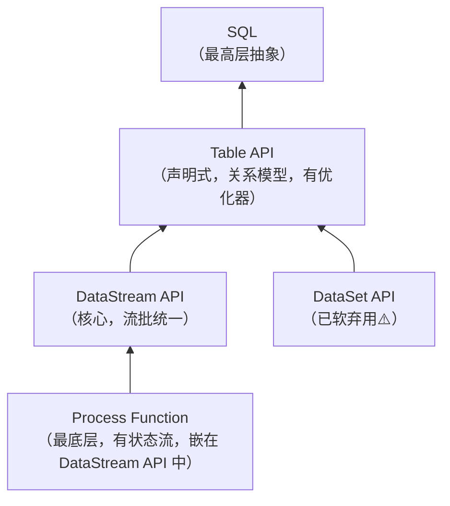

# 第1章 初识 Flink

> 本文基于《尚硅谷大数据技术之Flink（Java）》整理，面向 Java 后端面试。对原资料表述不准或过时之处已就地用 ⚠️ 标注，本章末「资料勘误」集中说明。
>
> 一句话理解 Flink：**Flink 是一个分布式"流处理"引擎，世界观是"万物皆流"--实时数据是无界流，离线数据是有界流（批是流的特例）；它把计算所需的中间状态放在本地内存里（有状态计算），来一条数据就处理一条，做到毫秒级低延迟 + 任意规模扩展 + 结果精确一次。**

---

## 1.1 核心概念

**Flink 是什么**

Apache Flink 是分布式流处理引擎，官网一句话定位：**数据流上的有状态计算（Stateful Computations over Data Streams）**。用于对无界和有界数据流进行有状态计算，能跑在所有常见集群环境，以内存速度和任意规模执行。两大能力：**速度快**（毫秒级延迟）、**可扩展**（任意规模）。

> 通俗类比：传统数据库像"仓库管理员"--每次来料都先翻远程账本再处理；Flink 像"流水线工人"--把中间状态直接放在手边内存（本地状态），来一条处理一条，不用反复查远程库。

**无界流 vs 有界流**

| | 无界数据流 | 有界数据流 |
|---|---|---|
| 特点 | 有头无尾、持续不断 | 有明确起止 |
| 处理 | 来一条处理一条，需保证顺序 | 可等齐再处理 |
| 对应 | 流处理（实时） | 批处理（离线） |

Flink 世界观：**万物皆流**，批是流的特例。

**数据处理架构演变（4 代）**

1. **传统事务处理**：应用直接读写远程数据库，数据量大时表重构和 SQL 调优痛苦。
2. **有状态流处理（Storm）**：状态存本地内存、检查点持久化。速度快但 ⚠️ 无法保证 exactly-once、吞吐低。
3. **Lambda 架构**：批层 + 速度层双管齐下，流算近似、批修正。**致命缺点**：要维护两套语义等价的代码（批/流 API 完全不同），运维成本翻倍。
4. **新一代流处理器（Flink）**：单套系统搞定 Lambda 两套的活，解决乱序 + exactly-once + 高吞吐低延迟。

**Lambda 架构图解（高频考点）**

Lambda 架构由 Nathan Marz 提出，核心思想是「批处理 + 流处理」双管齐下：批层保准确性、速度层保低延迟、服务层合并结果对外查询。

```mermaid
graph TB
    query["Query / 业务查询"]
    subgraph serving["Serving Layer 服务层"]
        serving_node["Druid / HBase / Redis<br/>合并 批视图 + 实时视图"]
    end
    batch_view["批视图 Batch View"]
    realtime_view["实时视图 Realtime View"]
    subgraph batch_layer["Batch Layer 批处理层"]
        batch_node["MapReduce / Spark<br/>全量重算, 准确<br/>延迟: 分钟~小时"]
    end
    subgraph speed_layer["Speed Layer 速度层"]
        speed_node["Storm / Flink<br/>增量计算, 低延迟<br/>延迟: 毫秒~秒"]
    end
    source["Data Source 数据源<br/>(Kafka / 日志)"]
    query --> serving
    serving --> batch_view
    serving --> realtime_view
    batch_view --> batch_layer
    realtime_view --> speed_layer
    batch_layer --> source
    speed_layer --> source
```

三层职责：

| 层 | 职责 | 特点 |
|---|---|---|
| **Batch Layer（批处理层）** | 存储全量原始数据，定期跑批重算出批视图 | 准确、高吞吐，但延迟高 |
| **Speed Layer（速度层）** | 处理最近增量数据，补偿批处理延迟 | 低延迟，但结果近似、会被批视图覆盖 |
| **Serving Layer（服务层）** | 合并批视图与实时视图，对外提供随机查询 | 高可用、低延迟读 |

> 关键点：**实时视图只是临时补丁**。批处理追上来后，批视图覆盖实时视图，结果"自愈"为准确值。

**Lambda 致命缺点 → 演进到 Kappa**：同一段业务逻辑要写两遍（Spark 批版 + Flink/Storm 流版），批流 API 不同导致结果易不一致、运维成本翻倍。Flink 推动 **Kappa 架构**——用一套流式引擎 + Kafka 回放历史数据，把批当作流的回放，只写一份代码同时满足实时与回算，从根本上消除双写问题。

**Flink 核心特性**

高吞吐低延迟（每秒百万事件、毫秒级）、事件时间处理乱序、exactly-once 一致性、丰富 connector、高可用、可热更新迁移作业。

**Flink vs Spark（高频考点）**

| 维度 | Spark | Flink |
|---|---|---|
| 世界观 | 万物皆批，流 = 微批次（micro-batch） | 万物皆流，批 = 有界流 |
| 数据模型 | RDD / DStream（小批集合） | DataFlow 事件流（Google DataFlow 模型） |
| 执行 | DAG 划 Stage，stage 间 shuffle | 标准流式，事件直接发往下游 |
| 流延迟 | 秒级（微批） | 毫秒级 |

⚠️ **常见误区修正**：
- 「Spark 不能做流处理」--不准确。Spark 2.x 的 **Structured Streaming** 已支持低延迟和 exactly-once；Spark 2.3 的 **Continuous Processing** 模式在 at-least-once 下可达 1ms 延迟。正确表述：「传统 Spark Streaming(DStream) 是微批、秒级延迟，Flink 在原生流式 + 状态管理 + 事件时间上更优」。
- 「Flink 不能做批」--错误。Flink 1.12 起流批一体，DataSet API 软弃用，用 DataStream API + `execution.runtime-mode=BATCH` 即可批处理。

**分层 API（从下到上）**

⚠️ 资料仍以 DataSet API 教批处理，但 **Flink 1.12+ 起 DataSet 处于 soft deprecated**，推荐 DataStream API 一套代码处理流和批。

## 1.2 常见面试题

**Q1：Flink 和 Spark 最本质的区别？**
世界观相反--Spark 以批为本，流是微批次；Flink 以流为本，批是有界流。底层 Spark 数据模型是 RDD/DStream（小批集合），Flink 是 DataFlow 事件流。Spark 流处理秒级延迟，Flink 毫秒级。

**Q2：什么是 Lambda 架构？它有什么问题？Flink 怎么解决？**
Lambda = 批层 + 速度层，流算近似、批修正。问题是要维护两套语义等价的代码、API 不同、运维复杂。Flink 单套系统同时保证低延迟和准确性（事件时间 + exactly-once），替代两套系统。

**Q3：Flink 的"有状态计算"是什么意思？为什么重要？**
状态是处理中需保存的中间数据（累加器、窗口数据等）。有状态计算把这些状态存本地内存而非远程库，每来一条读取/更新本地状态。重要性：避免每条查远程库的 IO 开销，大幅提升吞吐和延迟；通过 checkpoint 持久化保证容错。

**Q4：无界流和有界流的区别？**
无界流有头无尾、持续不断，必须连续处理且保证顺序；有界流有明确起止，可等齐再处理、不严格保序。无界对应流处理，有界对应批处理。

---

## 资料勘误与重点提醒

1. ⚠️ **DataSet API 已软弃用**：资料基于 Flink 1.13 仍用 DataSet 教批处理。Flink 1.12+ 推荐用 DataStream API + `execution.runtime-mode=BATCH` 实现流批一体。
2. ⚠️ **Spark vs Flink 对比不要绝对化**：Spark 2.3+ 的 Continuous Processing 模式在 at-least-once 下可达 1ms 延迟。应表述为"传统 Spark Streaming(DStream) 微批延迟秒级，Flink 原生流式 + 状态管理 + 事件时间更优"。
