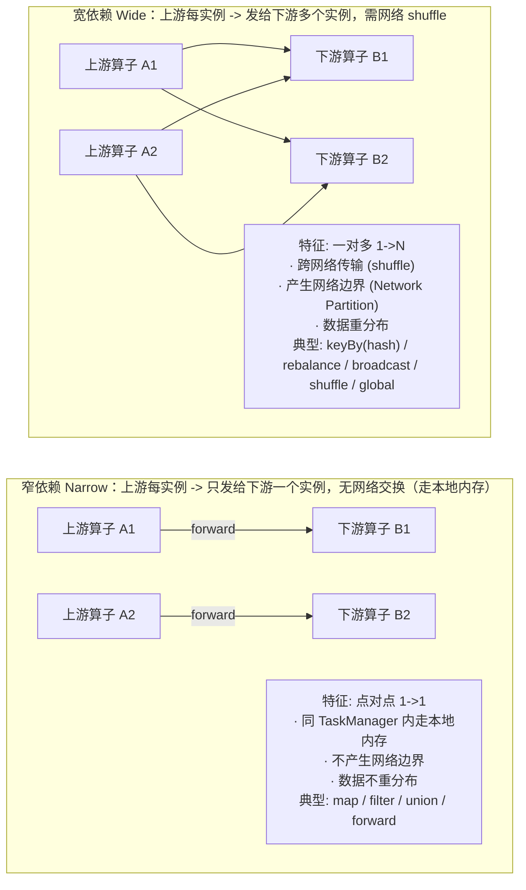
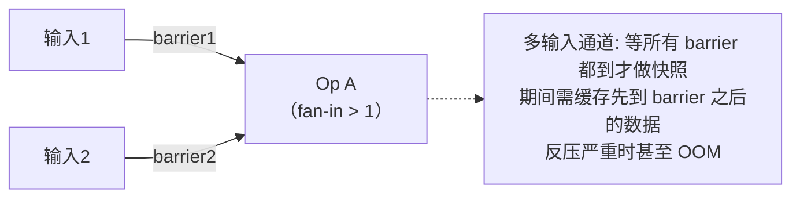

# 第4章 运行时架构 ⭐

> 本文基于《尚硅谷大数据技术之Flink（Java）》整理，面向 Java 后端面试。本章是 Flink 架构核心，面试高频。

---

## 4.1 核心概念

**整体架构**：两大核心组件 + 客户端。

- **JobManager（Master）**：管理调度，一个集群一个（HA 下有主备）
- **TaskManager（Worker）**：执行任务，一个或多个
- **Client**：不算处理系统一部分，只负责提交作业（调用 main、生成数据流图、发给 JM）

**JobManager 的四个组件（高频考点）**

| 组件 | 职责 | 数量 |
|---|---|---|
| **JobMaster** | 处理单个作业（与 Job 一一对应）；接收 JobGraph -> 转 ExecutionGraph -> 向 RM 申请资源 -> 分发任务给 TM；运行中协调 checkpoint | 每作业一个 |
| **ResourceManager** | 管理 task slots 分配/回收；资源不够时向 YARN/K8s 申请新 TM；停掉空闲 TM | 集群一个 |
| **Dispatcher** | 提供 REST 接口接收作业提交；为每个新作业启动 JobMaster | 可选 |
| **WebMonitorEndpoint** | 提供 Web UI 和 REST 监控接口 | - |

⚠️ **资料勘误**：书中 JobManager 只讲 3 个组件，Web UI 实际由 WebMonitorEndpoint 提供，面试答到 4 个更完整。
⚠️ **区分两个 ResourceManager**：Flink 内置的管 task slots；YARN 的管容器。名字一样但层级不同。

**数据流图（Dataflow Graph）**

程序 = 一连串「算子」构成的管道，数据如水流过。三部分：Source（源）-> Transformation（转换）-> Sink（输出）。

⚠️ **易错点**：不是每个方法都是算子。`keyBy` **不是算子**，是数据分区操作（返回 KeyedStream 而非 SingleOutputStreamOperator），所以**不能对 keyBy 设并行度**，且会断开算子链。

**并行度（Parallelism）**

算子可拆成多个并行「子任务」，子任务数 = 并行度。程序并行度 = 所有算子并行度的最大值。

**并行度设置优先级（从高到低）**：
1. 代码中算子单独 `setParallelism()` -- 最高
2. 代码中 `env.setParallelism()` 全局
3. 提交时 `-p` 参数
4. 配置文件 `parallelism.default` -- 最低

⚠️ 实践：代码中只针对算子设并行度，**不要硬编码全局并行度**，否则无法动态扩容。⚠️ `socketTextStream` 是非并行 Source，无论怎么设并行度都是 1。

**算子链 Operator Chain（核心考点）**

**算子间数据传输两种方式**：
- **一对一（forwarding）/ 窄依赖**：上游一个实例只发给下游一个实例，分区和顺序不变，走本地内存、无网络交换。如 source->map。
- **重分区（Redistributing）/ 宽依赖**：上游一个实例发给下游多个实例，需网络 shuffle。如 keyBy、rebalance。

**窄依赖 vs 宽依赖图解（高频考点）**

**分布模式完整对照**：

| Distribution | 类型 | 数据流向 | 是否网络 |
|---|---|---|---|
| **Forward** | 窄 | 上游实例 -> 对应下游实例（同分区） | 否（本地） |
| **Rescale** | 窄* | 上游实例 -> 部分下游实例（轮询子集） | TM 内否，跨 TM 是 |
| **Hash**（keyBy） | 宽 | 按 key 哈希分发到下游所有实例 | 是 |
| **Rebalance** | 宽 | 轮询发给下游所有实例 | 是 |
| **Shuffle** | 宽 | 随机发给下游所有实例 | 是 |
| **Broadcast** | 宽 | 上游每个 -> 下游每个（全量复制） | 是 |
| **Global** | 宽 | 所有数据 -> 下游第一个实例 | 是 |

> *Rescale 是"窄"的边界情况：不产生全量网络 shuffle，但上下游跨 TM 时仍需少量网络。

**为什么重要 -> Barrier 对齐取决于输入通道数，而非窄/宽依赖**（⚠️ 易错点）

⚠️ 纠正常见误区：barrier 对齐**不是由"窄/宽依赖"决定的**，而是由**算子（子任务）有几个输入通道（fan-in）决定**。对齐发生在 fan-in > 1 的算子上。

多输入通道的来源（两种，别只记 shuffle 这一种）：

| 来源 | 是否 shuffle | 举例 | 需对齐? |
|---|---|---|---|
| 扇入型 shuffle | 是 | keyBy/rebalance 后，下游每个子任务接收所有上游子任务的数据 | 是 |
| 多流汇合 | 否（属"窄"） | union / connect / join / coGroup，算子本身有多个输入 | **是** |
| 单输入 forward | 否 | source->map，下游子任务只有 1 个输入通道 | 否 |

关键结论：
- forward（窄、1 输入）→ 不对齐 ✓
- union（窄、多输入）→ **要对齐**（"窄依赖无需对齐"是错的，union 就是反例）
- keyBy（宽、多输入）→ 要对齐 ✓

宽依赖不是"多对一"而是**多对多**：每个上游子任务发给所有下游子任务，同时每个下游子任务的 fan-in = 上游并行度，这才是要对齐的根因。这正是 **Unaligned Checkpoint**（非对齐检查点）要解决的痛点——反压时对齐会缓存大量数据甚至 OOM，非对齐模式让 barrier 直接穿过算子、把待处理数据纳入状态。

**算子链合并条件（面试必背）**：

⚠️ 资料只说「并行度相同的一对一算子可链接」不够完整，**完整 4 条件**：
1. **并行度相同**
2. **数据传输是一对一（forwarding）**，非重分区（keyBy/rebalance/rescale 会断链）
3. **同一 slot 共享组**（默认所有算子在 "default" 组）
4. 算子 chaining 策略允许（未被 `disableChaining` 禁用）

**举例**：source(P2)->flatMap(P2)->keyBy->sum(P2)->sink(P2)
- source->flatMap：一对一 + 并行度同 -> **合并**
- flatMap->keyBy：keyBy 是重分区 -> **断链**
- sum->sink：一对一 + 并行度同 -> **合并**

⚠️ **为什么合并**：减少线程切换和缓冲区数据交换，降低延迟、提升吞吐。控制：`disableChaining()`（当前算子不参与链）、`startNewChain()`（从当前算子起新链）。

**四层调度图**

| 层级 | 生成位置 | 内容 |
|---|---|---|
| **StreamGraph（逻辑流图）** | 客户端 | 代码直接映射的 DAG，节点=算子 |
| **JobGraph（作业图）** | 客户端 | StreamGraph 优化版，**合并算子链**为任务节点 |
| **ExecutionGraph（执行图）** | JobMaster | JobGraph 并行化版，**按并行度拆子任务**，调度核心数据结构 |
| **PhysicalGraph（物理图）** | TaskManager | 部署后的物理执行情况 |

⚠️ **口诀**：客户端生成 StreamGraph + JobGraph（算子链优化）；JobMaster 生成 ExecutionGraph（并行化）；TaskManager 形成 PhysicalGraph（物理执行）。

**任务槽 Task Slots 与槽共享 Slot Sharing（核心考点）**

**任务槽**：
- TM 是 JVM 进程，可多线程并行执行多个子任务
- slot = TM 计算资源的固定大小子集，**每个 slot 独占一份内存**
- slot 数量 = TM 能并行执行任务数上限
- ⚠️ **slot 只隔离内存，不隔离 CPU**（高频考点）

**槽共享**：
- 默认开启：**同一作业不同算子节点的子任务可共享同一 slot**
- 但**同一算子节点的并行子任务不能共享**（必须分到不同 slot 才能数据并行）
- 结果：一个 slot 可放整个作业的完整 pipeline（source->...->sink 各一个子任务）

**为什么允许槽共享**：不同算子资源占用差异大（source/map 轻量、window 重），不共享时轻量算子 slot 空闲、重算子 slot 忙死，资源浪费；共享后重活平均分到所有 slot，负载均衡。

⚠️ **关键结论**：开启槽共享后，**作业所需 slot 数 = 所有算子并行度的最大值**（不是子任务总数）。

**slot vs 并行度**：slot 是静态概念（TM 并发能力，`taskmanager.numberOfTaskSlots`）；parallelism 是动态概念（实际使用的并发，`parallelism.default`）。

## 4.2 常见面试题

**Q1：JobManager 包含哪些组件？各自职责？**
① JobMaster--处理单个作业，接收 JobGraph 转 ExecutionGraph、申请资源、分发任务、协调 checkpoint；② ResourceManager--管理 task slots 分配回收、资源不足申请新 TM；③ Dispatcher--提供 REST 接口接收作业、启动 JobMaster；④ WebMonitorEndpoint--提供 Web UI 和 REST 监控。

**Q2：算子链什么条件下合并？什么情况下断开？**
合并条件：① 并行度相同；② 一对一（forwarding）非重分区；③ 同一 slot 共享组；④ 未被 disableChaining。断开：遇到 keyBy/rebalance 等重分区、并行度变化、主动 disableChaining 或 startNewChain。

**Q3：JobGraph 和 ExecutionGraph 的区别？分别在哪生成？**
JobGraph 是 StreamGraph 优化（合并算子链）后的版本，在**客户端**生成；ExecutionGraph 是 JobGraph 并行化版本（按并行度拆子任务、明确数据传输），在 **JobMaster** 生成，是调度核心数据结构。

**Q4：task slot 和并行度有什么区别和关系？**
slot 是静态概念（TM 并发能力）；并行度是动态概念（实际使用的并发）。并行度 ≤ slot 总数才能正常执行。开启槽共享后，作业所需 slot 数 = 所有算子并行度的最大值。

**Q5：为什么 Flink 要做槽共享？**
不同算子资源占用差异大，不共享时轻量算子 slot 空闲、重算子 slot 忙死。共享后重活平均分配、负载均衡，一个 slot 保存完整 pipeline，单 TM 故障不影响其他。注意同一算子的并行子任务不能共享 slot。

---

## 资料勘误与重点提醒

1. ⚠️ **WebMonitorEndpoint**：书中 JobManager 只讲 3 个组件，Web UI 实际由 WebMonitorEndpoint 提供，答到 4 个更完整。
2. ⚠️ **算子链合并条件不完整**：资料只说"并行度相同的一对一算子"，遗漏「同一 slot 共享组」条件。完整 4 条件见 4.1。
3. ⚠️ **slot 只隔离内存不隔离 CPU**：高频考点，资料提到但易被忽略。
4. ⚠️ **keyBy 不是算子**：是数据分区操作，返回 KeyedStream，不能设并行度，会断开算子链。
5. ⚠️ **四层图生成位置**：客户端(StreamGraph+JobGraph) -> JobMaster(ExecutionGraph) -> TaskManager(PhysicalGraph)，口诀必背。
