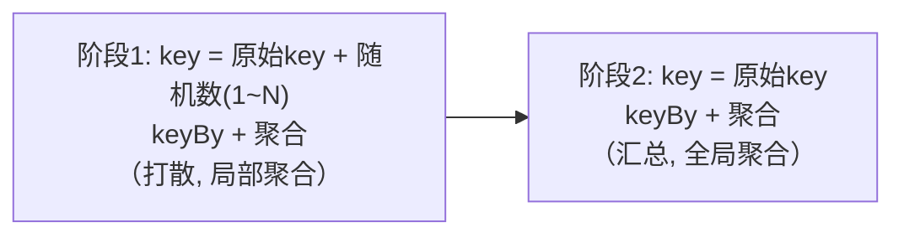

# 第13章 性能与调优

> 本节内容原 PDF 未专门成章，但属 Flink 面试高频考点（反压、内存模型、数据倾斜），特此补充。文末附 Flink 面试核心知识地图速记。

---

## 13.1 核心概念

**反压机制（Backpressure）⭐**

什么是反压：流处理中，当下游算子处理速度跟不上上游发送速度时，会反向"压迫"上游减速，这种机制叫反压。类似水管堵塞--下游堵了，水（数据）向上游倒灌积压。

为什么需要：如果没有反压，上游不断发数据、下游来不及处理，会在下游缓冲区堆积最终 OOM。反压让上游自动降速，是流系统的"流量控制安全阀"。

**Flink 反压的演进**：
- **Flink 1.5 之前**：基于 TCP 滑动窗口的反压。当 socket 缓冲区满，TCP 自然反压。问题：反压粒度粗，会影响整个 TaskManager 的网络栈，一个作业的反压可能波及同 TM 上的其他作业。
- **Flink 1.5+：Credit-Based 流控机制**。Flink 在应用层实现了精细化反压，不再完全依赖 TCP。

---

### 【深度】Flink 1.5 之前的反压机制详解 ⭐⭐⭐

> 很多老的生产集群还在跑 Flink 1.4 / 1.3 甚至更早版本，面试问到的概率不低。理解老机制的痛点，才能真正理解 Credit-Based 为什么被发明出来。

#### 1. 老版反压的核心：完全依赖 TCP 滑动窗口

Flink 1.5 之前，**应用层没有自己的反压机制**，全靠底层 TCP 协议天然的流量控制来实现反压。

**工作流程：**

```
上游 TaskManager                          下游 TaskManager
+------------------+                      +------------------+
|  ResultPartition | --- TCP 连接 --->  |  InputChannel     |
|  (写数据到socket)|                      |  (从socket读数据)  |
+------------------+                      +------------------+
         |                                          |
         ↓                                          ↓
   TCP 发送缓冲区                             TCP 接收缓冲区
   (send buffer)                             (receive buffer)
```

1. 上游算子把数据写到 `ResultPartition`，最终写入 TCP 的 send buffer。
2. TCP 把数据发到下游，下游把数据读到 receive buffer。
3. 下游算子处理不过来 → InputChannel 消费慢 → **TCP receive buffer 被填满**。
4. TCP 滑动窗口机制生效：接收方窗口大小（rwnd）减到 0 → 发送方停止发送。
5. 上游 TCP send buffer 也被填满 → 上游写入 socket 的操作被阻塞 → 上游算子写不出去 → 上游自然降速。
6. 反压就这样从下往上，沿着 TCP 连接逐级传递，直到 Source。

**一句话总结：老版 Flink 反压就是「TCP 缓冲区塞满了，写不进去，上游自然就慢了」。**

---

#### 2. 老版反压的实现细节：Netty + 水位线

Flink 底层网络通信基于 Netty，老版本的反压传递路径其实是：

```
下游算子处理慢
  → InputChannel 满
    → Netty 的 inbound buffer 满
      → TCP receive buffer 满
        → TCP 滑动窗口 rwnd = 0
          → 上游 TCP 停止发送
            → 上游 Netty outbound buffer 满
              → ResultPartition 写不出去
                → 上游算子被阻塞
                  → 更上游继续传下去...
```

整个链路中，**任何一环的缓冲被填满，都会反向传导**。Flink 本身不做任何控制，全靠 Netty + TCP 的天然机制。

---

#### 3. 老版反压的四大致命问题

这也是 Flink 社区一定要自研 Credit-Based 的根本原因。

**问题一：反压粒度太粗——一个算子反压，整个 TaskManager 网络都受影响**

这是最核心的问题。

同一个 TaskManager 上可能跑了很多算子的多个子任务，它们**共享同一个 TCP 连接**（Flink 老版本是 TaskManager 之间建一条多路复用的 TCP 连接）。当其中一个子任务出现反压，TCP 缓冲区被占满，**同一条连接上的其他所有子任务也一起被卡住**。

```
同一条 TCP 连接（TaskManager A → TaskManager B）
├── 算子1 subtask0 数据流 → ✅ 正常，不需要反压
├── 算子2 subtask1 数据流 → ❌ 反压，TCP 缓冲区满了
├── 算子3 subtask2 数据流 → ⚠️ 被连带卡住了！（无辜躺枪）
└── 算子4 subtask3 数据流 → ⚠️ 被连带卡住了！
```

更严重的是，如果同一个 TM 上跑了**多个作业**，一个作业反压会波及其他作业。这在多租户环境下是不可接受的。

**问题二：反压定位困难——你不知道具体是哪个输入通道反压了**

老版本 Flink 的反压检测是怎么做的？——**通过采样**。

JobManager 定期触发对 TaskManager 的反压采样：往被测算子的输入栈上打点，如果采样时线程卡在网络写入上，就认为反压了。根据卡在网络上的比例，判断是 OK / LOW / HIGH。

这种方式的问题：
- 只能告诉你「这个算子反压了」，但你不知道**具体是哪个输出通道、哪个下游反压的**
- 采样有延迟，不是实时的
- 只能定位到算子级，定位不到通道级

**问题三：Checkpoint Barrier 被阻塞——反压时 Checkpoint 必超时**

反压时数据写不出去，Barrier 也跟着数据一起堵在缓冲区里。本来 Barrier 应该快速传到下游触发对齐快照，结果堵在路上半天到不了，Checkpoint 超时就失败了。

而且由于 TCP 缓冲区是 FIFO 的，你没法让 Barrier "插队"跑到数据前面去——这也是后来非对齐检查点（Unaligned Checkpoint）要解决的问题，但在老版本里根本没有办法。

**问题四：无法做精细化流量控制**

TCP 反压是「要么发、要么停」的二元状态——窗口有空间就发，窗口满了就停。你没法在应用层做更精细的控制，比如：
- 不同通道设置不同的发送速率
- 某些高优先级数据优先发送
- 动态调整缓冲大小

---

#### 4. 老版反压的生产环境经验

如果你在维护 Flink 1.5 以下版本的老集群，以下几点是踩坑总结：

| 场景 | 现象 | 应对 |
|------|------|------|
| 一个作业反压 | 同 TM 上其他作业吞吐也掉了 | 把关键作业和非关键作业分到不同 TaskManager / 不同 YARN 队列 |
| 反压排查 | UI 只显示 HIGH，不知道哪堵了 | 看各子任务的 records sent / received 速率对比，从 sink 往 source 方向逐级定位 |
| Checkpoint 频繁超时 | 反压时 CP 对齐时间长 | 减小状态大小、调大 CP 超时时间、降低 CP 频率（老版本没有非对齐 CP） |
| 网络缓冲区满 | 监控看到 Netty 出入队队列积压 | 调大 `taskmanager.network.memory.buffers-per-channel`（但只是治标） |
| 生产升级建议 | 老版本反压问题多 | 有条件尽量升级到 1.10+，享受 Credit-Based + 非对齐 CP 等特性 |

---

#### 5. 老版 vs 新版（Credit-Based）对比总结

| 维度 | Flink 1.5 之前（TCP 反压） | Flink 1.5+（Credit-Based） |
|------|--------------------------|---------------------------|
| **实现层级** | 传输层（TCP 滑动窗口） | **应用层**（Flink 自己的协议） |
| **反压粒度** | 粗：TaskManager 级，一条 TCP 连接 | **细：通道级**，每个 InputChannel 独立 credit |
| **互相影响** | 同 TM 上其他作业/子任务会被波及 | 互不影响，反压只在对应通道传递 |
| **反压定位** | 采样判断，只能定位到算子 | 实时精确，每个通道都有 backlog 指标 |
| **Checkpoint 影响** | Barrier 堵在 TCP 缓冲，CP 易超时 | Barrier 传递更快，且支持非对齐 CP |
| **流量控制** | 二元（发/停），不可控 | 精细：credit 数量、backlog 反馈、动态调整 |
| **通俗类比** | 一根水管连多个水龙头，一个龙头堵了，整根水管都停水 | 每个水龙头独立一根细管 + 独立阀门，互不干扰 |

---

**Credit-Based 流控原理**：
1. 下游 TaskManager 为每个输入通道分配一定数量的 **credit（信用/缓冲凭证）**，告诉上游"我能接收多少数据"。
2. 上游按下游给的 credit 数量发送对应数量的数据 + **backlog（积压量，表示上游还有多少未发数据）**。
3. 下游根据上游的 backlog 决定下次分配多少 credit：上游积压多 -> 下游多分配 credit（如果自己还有余力）；下游自己忙不过来 -> 减少 credit 分配。
4. credit 耗尽后上游停止向该下游发数据，实现精准反压。

> 通俗类比：上游是供货商、下游是零售商。下游每次告诉上游"我能再进 N 货"（credit=N），上游就发 N 货并告知"我仓库还堆着 M 货"（backlog=M）。下游看自己货架空、上游积压多就多要货；下游卖不动就少要货，上游自然就发得少了。

**反压的定位与排查**：
- Flink Web UI 的 **BackPressure** 面板显示每个算子反压状态：OK（正常）/ LOW / HIGH（高反压）。基于采样判断算子是否在等待网络缓冲。
- 常见反压原因：① 下游算子处理慢（复杂计算、外部 IO 慢）；② 数据倾斜导致某子任务过载；③ GC 停顿；④ 下游 sink（Kafka/DB）慢。

⚠️ **反压与 Checkpoint 的关系**：反压严重时 Barrier 对齐变慢、Checkpoint 超时失败（这正是非对齐检查点要解决的问题）。两者关联紧密，常一起考察。

**Flink 内存模型 ⭐**

为什么 Flink 自己管理内存：JVM 管理 GB 级以上堆内存时 GC 停顿严重（STW），对流处理的低延迟是致命的。Flink 把大量数据（如状态、排序缓冲）放在 JVM 堆外的**托管内存（Managed Memory）**中，自己以 segment 为单位管理，避开 GC，实现稳定低延迟。

**TaskManager 进程内存组成**（Flink 1.10+ 新内存模型）：

| 内存区域 | 说明 | 用途 |
|---|---|---|
| **JVM 堆内存** | TaskManager 的 JVM 堆 | 用户代码对象、HashMapStateBackend 的状态 |
| **托管内存** | Flink 管理的堆外内存 | RocksDB StateBackend、排序、批处理中间结果 |
| **网络内存** | 堆外 | 网络数据收发缓冲（shuffle、反压 credit 缓冲） |
| **框架堆内存** | Flink 框架自身堆内存，与用户代码隔离 | 框架运行 |
| **任务堆外内存** | 用户代码的堆外内存 | 用户直接 ByteBuffer 等 |
| **JVM Metaspace** | 类元数据 | 加载类 |
| **JVM 开销** | JVM 自身开销 | 线程栈、直接内存等 |

> 通俗类比：Flink 把内存分成几个独立"账户"--框架用框架的、网络用网络的、状态用托管的、用户代码用堆的。互不挪用、各管各的，避免一个作业把内存吃光拖垮其他作业，也便于精确调优。

关键点：
- **托管内存是堆外**，不受 GC 影响，RocksDB StateBackend 就用它存数据。
- 流处理主要关注：堆内存（HashMap 状态、用户对象）、托管内存（RocksDB 状态）、网络内存（数据传输）。

**数据倾斜与调优要点**

数据倾斜表现：某个 subtask 处理的数据量远超其他，成为瓶颈，拖慢整个作业且易 OOM。Web UI 上表现为某算子各 subtask 处理记录数严重不均。

**常见原因与解决**：

| 原因 | 解决方案 |
|---|---|
| keyBy 后 key 分布不均（如某大 V 用户行为占比极高） | **两阶段聚合**：先加随机前缀打散 key 聚合，再去前缀二次聚合 |
| keyBy 的 key 选择不当 | 换更均匀的 key，或预聚合 |
| 某分区数据天然多（Kafka 分区不均） | `rebalance()` 重新轮询均衡 |
| 窗口内某 key 数据量巨大 | 开窗 + 增量聚合，避免全缓存 |
| 状态膨胀（RocksDB 大 key） | 配状态 TTL，清理过期状态 |

**两阶段聚合思路**（高频）：

把大 key 的负载分散到 N 个子任务局部聚合，再汇总，缓解单点热点。类似 MapReduce 的 combiner + reduce。

**其他调优要点**：
- **并行度**：与 Kafka 分区数匹配（避免某分区空闲），与 slot 总数匹配。
- **状态后端选择**：大状态用 RocksDB + 增量 Checkpoint。
- **Checkpoint 间隔**：不宜过短（影响吞吐），不宜过长（故障重算多），通常秒到分钟级。
- **异步 I/O**：外部查询用 AsyncFunction 并发请求，避免阻塞主流程。
- **算子链**：默认开启减少序列化与线程切换开销。

## 13.2 常见面试题

**Q1：Flink 的反压机制是什么？Credit-Based 流控怎么工作？**
反压是下游处理不过来时让上游减速的机制。Flink 1.5+ 采用 Credit-Based 流控：下游给上游分配 credit（可接收数据量）并告知缓冲余量，上游按 credit 发数据并回报 backlog（积压量），下游根据 backlog 和自身能力动态调整 credit。credit 耗尽上游停止发送。相比老的 TCP 反压，粒度更细、不波及同 TM 的其他作业。

**Q2：反压和 Checkpoint 有什么关系？**
反压严重时 Barrier 对齐变慢（下游缓存大量 in-flight data），导致 Checkpoint 超时失败。这是非对齐检查点（Unaligned Checkpoint）要解决的痛点：直接保存 in-flight data，不再依赖 barrier 对齐，缓解反压下 checkpoint 失败。

**Q3：如何排查 Flink 反压？**
Web UI BackPressure 面板看各算子反压状态（OK/LOW/HIGH）。定位到高反压算子后排查原因：下游算子处理慢（复杂计算、外部 IO）、数据倾斜、GC、下游 sink 慢。对症解决：优化算子逻辑、解决倾斜、调大并行度、异步 IO。

**Q4：Flink 为什么自己管理内存而不全用 JVM 堆？**
JVM 管理 GB 级堆内存时 GC 停顿严重，对流处理低延迟致命。Flink 把状态、排序缓冲等放在堆外托管内存，以 segment 为单位自管理，避开 GC，保证稳定低延迟。

**Q5：Flink TaskManager 内存由哪几部分组成？**
JVM 堆（用户对象、HashMap 状态）、托管内存（堆外，RocksDB 状态、排序、批中间结果）、网络内存（堆外，数据传输与反压缓冲）、框架堆/堆外、任务堆外、JVM Metaspace 和开销。各区域独立配置，互不挪用。

**Q6：Flink 数据倾斜怎么处理？两阶段聚合的原理？**
先 Web UI 定位（看各 subtask 处理量是否不均）。若是 keyBy 后 key 分布不均，用**两阶段聚合**：阶段1 给 key 加随机前缀打散做局部聚合，阶段2 去前缀做全局聚合，相当于先 combiner 后 reducer，把单点热点负载分散开。若是 Kafka 分区不均用 rebalance 重新均衡；状态膨胀配 TTL；外部 IO 用异步。

---

## 附录：Flink 面试核心知识地图（速记）

```mermaid
graph TB
    root["Flink 核心 = 流处理 + 有状态 + 容错"]
    subgraph sg_arch["架构"]
        arch1["JobManager(JobMaster/ResourceManager/Dispatcher/WebMonitorEndpoint) + TaskManager(slot)"]
        arch2["四层图: StreamGraph(客户端) -> JobGraph(客户端, 合并算子链) -> ExecutionGraph(JM, 并行化) -> PhysicalGraph(TM)"]
    end
    subgraph sg_api["API"]
        api1["SQL > Table API > DataStream API > ProcessFunction"]
        api2["程序: env -> source -> transform -> sink -> execute()"]
    end
    subgraph sg_time["时间"]
        time1["事件时间(默认,1.12+) > 处理时间 > 摄入时间(已弱化)"]
    end
    subgraph sg_wm["水位线"]
        wm1["= maxTimestamp - delay - 1ms; 传递取所有上游最小(木桶原理); 周期是处理时间"]
    end
    subgraph sg_win["窗口"]
        win1["滚动(无重叠)/滑动(可重叠)/会话(动态,仅时间); 增量聚合 vs 全窗口(最佳:结合)"]
    end
    subgraph sg_late["迟到"]
        late1["三道防线: 水位线延迟(全局) -> allowedLateness(窗口级,先近似再修正) -> 侧输出流(兜底)"]
    end
    subgraph sg_state["状态"]
        st1["Keyed State(按key,5种类型) vs Operator State(算子级,List/UnionList/Broadcast)"]
        st2["状态后端: HashMap(堆,快,小状态) vs RocksDB(磁盘,大状态,唯一支持增量CP)"]
    end
    subgraph sg_ft["容错"]
        ft1["Checkpoint = Chandy-Lamport + Barrier 对齐; Savepoint = 手动备份(需.uid())"]
        ft2["一致性: at-most-once / at-least-once / exactly-once(对状态影响只一次)"]
        ft3["端到端EO: 输入可重放(Kafka offset) + Flink CP + 输出幂等或2PC事务"]
        ft4["Flink+Kafka EO: offset存CP + Sink两阶段提交 + 下游read_committed + 事务超时配置"]
    end
    subgraph sg_stream["多流"]
        ms1["Union(同类型,多条) vs Connect(不同类型,两条,CoProcessFunction)"]
        ms2["双流Join: Window Join(笛卡尔积) / Interval Join(动态区间,仅事件时间) / CoGroup(可外连接)"]
    end
    subgraph sg_pf["处理函数"]
        pf1["KeyedProcessFunction 可注册定时器(key+时间戳去重,容错); 侧输出流分流"]
    end
    subgraph sg_table["Table/SQL"]
        tb1["动态表 + 持续查询(流->表->查询->流); 更新查询(toChangelogStream) vs 追加查询(toDataStream)"]
        tb2["Append/Retract/Upsert 三种编码; 窗口用 TVF(新)替代分组窗口(旧,已弃用)"]
    end
    subgraph sg_cep["CEP"]
        cep1["复杂事件处理,底层NFA状态机; next严格/followedBy宽松/followedByAny非确定; 超时+迟到走侧输出流"]
    end
    subgraph sg_tune["调优"]
        tune1["反压=Credit-Based流控(1.5+,下游给credit+backlog,不波及同TM); 严重反压致CP对齐慢->非对齐CP"]
        tune2["内存=自管理堆外托管内存避GC; 堆/托管/网络/框架独立账户"]
        tune3["倾斜=两阶段聚合(随机前缀打散+去前缀全局聚合); 空闲源withIdleness; 状态TTL"]
    end
    root --> sg_arch
    root --> sg_api
    root --> sg_time
    root --> sg_wm
    root --> sg_win
    root --> sg_late
    root --> sg_state
    root --> sg_ft
    root --> sg_stream
    root --> sg_pf
    root --> sg_table
    root --> sg_cep
    root --> sg_tune
```


