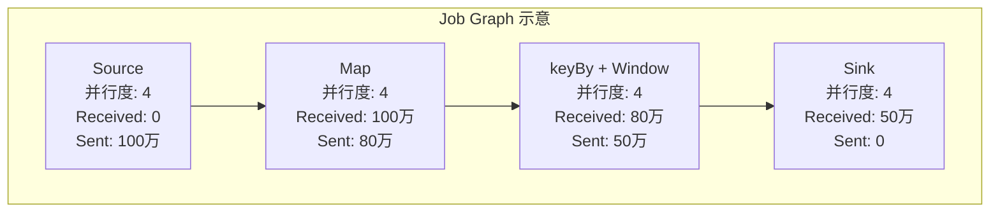
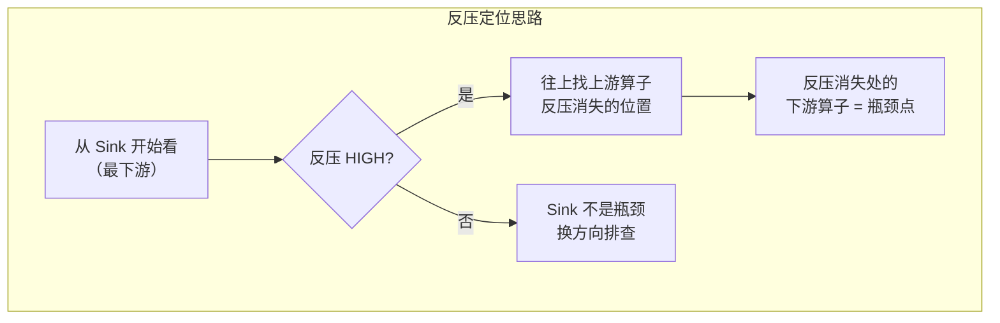

# 第14章 Flink UI 与故障排查

> 本章聚焦 Flink Web Dashboard 的实战使用与线上故障排查方法论，是 Flink 面试"场景题"的高频方向。不同于操作手册式讲解，本章从"出了问题怎么查"的视角组织内容，建议结合第4章运行时架构、第13章性能调优一起复习。

---

## 一、Flink Web Dashboard 概览

### 1.1 访问方式

- **默认地址**：`http://<jobmanager-host>:8081`
- **配置项**：`rest.port`（默认 8081），`rest.address`
- **Session 模式**：直接访问 JobManager 的 Web UI
- **Per-Job / Application 模式**：启动后日志中会打印 Web UI 地址

> 💡 面试金句：Flink Web UI 的底层是 **WebMonitorEndpoint**，它是 JobManager 内部提供 REST 接口和 Web 界面的组件，不是独立于 JM 的"第4个组件"，而是 Dispatcher 或 JobMaster 启动时初始化的一个 REST 端点。

### 1.2 首页四大 Tab

| Tab | 功能 | 关键信息 |
|---|---|---|
| **Overview** | 集群总览 | 可用 TaskManager 数、总 Slot 数、运行作业数、完成作业数 |
| **Jobs** | 作业列表 | Running（运行中）/ Completed（已完成/失败/取消）两类 |
| **Task Managers** | TM 列表 | 每个 TM 的内存、CPU、Slot、日志入口 |
| **Job Manager** | JM 信息 | 配置、日志、类加载、JobManager 指标 |

### 1.3 Submit New Job 功能

- **上传 Jar 包**：支持本地 jar 上传
- **提交参数**：入口类、并行度、程序参数、Savepoint 路径
- **注意**：Jar 包必须包含所有用户依赖（Flink 依赖除外），否则提交后报 `ClassNotFoundException`

> ⚠️ 生产环境通常不通过 UI 提交作业，而是用命令行或 CI/CD 流水线，UI 主要用于监控和排查。

### 1.4 Overview 面板核心指标

| 指标 | 含义 | 异常信号 |
|---|---|---|
| Available TaskManagers | 当前存活的 TM 数量 | 低于预期 = TM 丢失 |
| Total Slots | 集群总 Slot 数 | 骤降 = 多个 TM 失联 |
| Available Slots | 空闲 Slot 数 | 长期为 0 = 资源紧张 |
| Running Jobs | 正在运行的作业数 | 异常减少 = 作业挂了 |

---

## 二、作业详情页详解

点击 Running Jobs 中的作业进入详情页，这是排查单个作业问题的主战场。

### 2.1 顶部概览区

| 字段 | 含义 | 排查价值 |
|---|---|---|
| **Status** | 作业状态：CREATED / RUNNING / FAILING / FAILED / CANCELED / FINISHED | 第一眼判断作业生死 |
| **Parallelism** | 作业并行度 | 与 Slot 数是否匹配 |
| **Start Time / Duration** | 开始时间 / 已运行时长 | 何时挂的、跑了多久 |
| **End Time** | 结束时间（失败/完成时显示） | 定位故障发生时间点 |
| **Checkpoints** | Checkpoint 配置（间隔、超时、模式） | 与 CP 失败关联分析 |

### 2.2 Job Graph（作业逻辑图）

展示作业的 DAG 拓扑，每个节点是一个算子（或算子链），边上是数据流向。

**每个算子节点显示**：
- 并行度
- **Records Sent / Received**：发送/接收记录数
- **Bytes Sent / Received**：发送/接收字节数
- 颜色表示反压状态（绿/黄/红）

> 💡 面试金句：从 Job Graph 能快速看出三件事——**数据量是否合理**（各节点收发量是否符合预期）、**是否有数据倾斜**（点开看各 subtask 差异）、**反压在哪个节点**（颜色变红）。

### 2.3 TaskManager 分配

在作业详情的 **TaskManagers** Tab 中，可以看到子任务分布在哪些 TM 上。

- 排查思路：某 TM 上的所有子任务都异常 → 可能是该 TM 本身有问题（GC、网络、磁盘）

### 2.4 子任务列表（Subtasks）

点开某个算子节点，下方会显示所有 subtask 的详细信息：

| 列 | 含义 | 异常信号 |
|---|---|---|
| Subtask | 子任务编号（0 ~ n-1） | - |
| Status | RUNNING / FAILED / CANCELED | FAILED = 子任务挂了 |
| Host | 所在 TM | 集中在某 TM 出问题 = TM 故障 |
| Records Sent / Received | 该 subtask 收发记录数 | 某 subtask 远高于其他 = 数据倾斜 |
| **Busy Time** | 繁忙时间占比 | 持续 100% = 该子任务是瓶颈 |
| Backpressured Time | 反压时间占比 | 高反压 = 下游处理不过来 |
| Idle Time | 空闲时间占比 | 全空闲 = 上游没数据 |

> ⚠️ 易错点：不要只看"Records Received = 0"就断言上游没数据，可能是该 subtask 分配到的 key 本身就没有数据（数据倾斜的另一种表现）。

---

## 三、核心排查入口

作业详情页左侧有一排 Tab，每个都是一个专项排查入口。

### 3.1 Checkpoints 面板

这是排查状态一致性问题最核心的面板。

| 子Tab | 内容 | 排查价值 |
|---|---|---|
| **History** | 历史 Checkpoint 列表 | 每次 CP 的触发时间、耗时、状态大小、失败原因 |
| **Summary** | 统计概览 | 最近 N 次 CP 的平均大小、平均耗时、失败次数 |
| **Configuration** | CP 配置 | 间隔、超时时间、模式、状态后端 |
| **Savepoints** | 手动触发 Savepoint | 升级/迁移前保存状态 |

**History 列表关键字段**：

| 字段 | 含义 | 危险信号 |
|---|---|---|
| Checkpoint ID | 递增编号 | 跳号 = 中间有失败 |
| Trigger Time | 触发时间 | - |
| Latest Acknowledgement | 最后确认时间 | - |
| **State Size** | 状态总大小 | 持续暴涨 = 状态泄漏/窗口未触发 |
| **End-to-End Duration** | 端到端耗时 | 接近超时阈值 = 有风险 |
| **Alignment Time** | Barrier 对齐时间 | 过长 = 反压严重 |
| Sync Duration | 同步阶段耗时 | 长 = 状态快照同步慢 |
| Status | Completed / Failed / In Progress | Failed 需看失败原因 |

> 💡 面试金句：Checkpoint 失败第一眼看两个指标——**Alignment Time**（对齐时间，反压导致）和 **State Size**（状态大小，状态膨胀导致）。

### 3.2 Backpressure 反压面板

对每个算子采样，判断其是否处于反压状态。

| 状态 | 含义 | 说明 |
|---|---|---|
| **OK** | 正常 | 算子不在等待网络缓冲 |
| **LOW** | 低反压 | 偶尔等待，< 10% 时间阻塞 |
| **HIGH** | 高反压 | 经常等待网络缓冲，> 50% 时间阻塞 |

> ⚠️ 重要：反压面板显示 HIGH 的算子**不一定是瓶颈**，反压是"结果"不是"原因"。反压从下游往上游传播，显示 HIGH 最严重的往往是最上游（被下游憋住了），真正的瓶颈在**反压从 OK 变 HIGH 的交界点的下游算子**。

### 3.3 TaskManagers 面板

集群级别的 TaskManager 列表，查看每个 TM 的健康状态。

| 字段 | 含义 | 排查价值 |
|---|---|---|
| Path | TM 地址 | - |
| Slots | 可用/总 Slot | - |
| **Heap Used** | 堆内存使用量 | 持续走高接近上限 = 堆 OOM 风险 |
| **Non-Heap Used** | 非堆内存 | Metaspace 是否溢出 |
| Threads Count | 线程数 | 异常增长 = 线程泄漏 |
| GC Time / Count | GC 次数和时间 | GC 频繁 = 内存压力大 |
| Log / Stdout | 日志入口 | 点进去看详细错误 |

> 💡 排查技巧：作业失败但 Exception 面板信息不足时，去对应 TaskManager 的 Log 里搜 `ERROR` 或 `OutOfMemoryError`，常常能找到根因。

### 3.4 Exceptions 面板

展示作业运行中抛出的异常栈。

- **最顶部异常**：直接导致作业失败的异常
- **Root Cause**：点击展开查看完整异常链，找到 Caused by 最底层
- **发生时间**：与 Checkpoint 失败、TM 失联时间做关联分析

> ⚠️ 注意：有些异常是"被打断"型异常（如 `InterruptedException`），往往不是根因而是其他故障的连锁反应，要顺着 Caused by 找最底层异常。

---

## 四、故障排查方法论

### 4.1 四步法

| 步骤 | 核心动作 | 产出 |
|---|---|---|
| ① 现象确认 | 看作业状态、失败时间、异常信息、影响范围 | 明确"出了什么问题" |
| ② 指标定位 | Checkpoints / Backpressure / TM 指标 / 日志 | 缩小到"哪个模块/算子/TM" |
| ③ 根因分析 | 结合原理推导，从 UI 指标反推底层机制 | 找到"为什么" |
| ④ 解决验证 | 调参/改代码/扩容后观察 | 确认"修好了" |

### 4.2 排查工具箱

| 工具 | 场景 | 入口 |
|---|---|---|
| **Job Graph** | 拓扑是否正确、数据量是否正常 | 作业详情页 |
| **Subtasks 列表** | 数据倾斜、子任务失败 | 点算子节点展开 |
| **Checkpoints 面板** | CP 失败/超时、状态膨胀 | 作业详情 → Checkpoints |
| **Backpressure 面板** | 反压定位、找瓶颈算子 | 作业详情 → Backpressure |
| **TaskManagers 面板** | TM 内存/GC/线程问题 | 作业详情 → TaskManagers |
| **Exceptions 面板** | 异常栈分析 | 作业详情 → Exceptions |
| **TM Log / Stdout** | 详细错误、GC 日志、OOM | TaskManagers → 点 Log |
| **Metrics 系统** | 细粒度指标监控（需接入 Prometheus/Grafana） | 外置监控系统 |

---

## 五、常见故障场景排查

### 5.1 作业提交失败

| 现象 | 可能原因 | 排查方向 |
|---|---|---|
| `ClassNotFoundException` / `NoClassDefFoundError` | Jar 包缺少依赖 | 检查 fat-jar 是否打好、是否漏 scope |
| `NoResourceAvailableException` | Slot 不够 | 看 Overview 可用 Slot 数，调并行度或扩容 TM |
| `InvalidProgramException` | 代码逻辑错误 | 看异常信息，本地调试 |
| 类冲突 `LinkageError` / `NoSuchMethodError` | 依赖版本冲突 | 用 maven-shade  relocation，或检查 classpath |
| 并行度超 Slot 总数 | `Could not allocate all slots` | 调小并行度或增加 TM/Slot |

> 💡 面试金句：提交失败优先看 **Exception 面板和 Client 端日志**，通常是 Jar 包或资源问题，与运行期故障不同，提交失败作业甚至还没开始执行。

### 5.2 Checkpoint 失败 / 超时

**最常见的几类原因**：

| 原因 | UI 表现 | 解决方向 |
|---|---|---|
| **反压导致对齐超时** | Alignment Time 很长，接近/超过超时阈值 | 先解决反压问题，或开非对齐 CP |
| **状态过大** | State Size 很大，同步/异步阶段都慢 | 状态 TTL、增量 CP、RocksDB、调大并行度 |
| **大状态 + 全量 CP** | 每次 CP 都要写全量数据，耗时久 | 切 RocksDB + 增量 Checkpoint |
| **RocksDB 性能瓶颈** | 同步阶段慢、磁盘 IO 高 | 调 RocksDB 配置、用 SSD、开并发写 |
| **网络瓶颈** | 端到端时间长，但各算子确认快 | 检查 TM 间网络带宽 |
| **TM 失联** | CP 一直等某个 TM 的 ACK | 查对应 TM 日志、是否 OOM/GC |

### 5.3 反压定位

**排查步骤**：
1. 打开 Backpressure 面板，看各算子反压状态
2. 从**最下游（Sink）**开始往上游找
3. 找到反压从 OK 变 HIGH 的**交界点**
4. 交界点的**下游算子**就是瓶颈算子
5. 对瓶颈算子做进一步排查：
   - 看 Subtasks 列表：是否某个 subtask 特别忙（数据倾斜）
   - 看 Busy Time：是否 100% 繁忙（计算密集）
   - 看 TM 指标：GC 是否频繁（内存问题）
   - 看代码：是否有阻塞 IO、复杂计算

> ⚠️ 再次强调：反压是**结果**，不是**原因**。反压面板全红不代表所有算子都有问题，只是下游一个算子慢把整个上游都憋住了。

### 5.4 内存溢出 OOM

Flink 的 OOM 分多种，UI 和日志表现不同：

| OOM 类型 | UI 表现 | 日志特征 | 常见原因 |
|---|---|---|---|
| **堆内 OOM**（Java heap space） | TM 失联、Heap Used 飙升 | `java.lang.OutOfMemoryError: Java heap space` | 用户代码大对象、HashMap 状态后端大状态、窗口全量聚合 |
| **堆外 OOM**（Direct buffer memory） | TM 失联、网络内存不足 | `OutOfMemoryError: Direct buffer memory` | 网络内存配小了、并行度高但网络缓冲不够 |
| **Metaspace OOM** | TM 启动失败或运行中挂 | `OutOfMemoryError: Metaspace` | 动态类加载过多、作业多 classloader 不释放 |
| **Native OOM**（RocksDB） | TM 进程被 kill、托管内存不足 | `std::bad_alloc` 或 system OOM killer | RocksDB 状态太大、block cache 配大了、托管内存不够 |

**排查要点**：
1. 看 TaskManagers 面板的 Heap / Non-Heap 使用趋势
2. 看 TM 日志中 OOM 的具体类型（关键字不同）
3. 结合状态后端判断：HashMap → 堆内 OOM；RocksDB → 托管/堆外 OOM
4. GC 时间/次数异常高 → 堆内存压力大

### 5.5 数据倾斜

**UI 表现**：
- 某算子各 subtask 的 Records Received/Sent 差异巨大（一个顶十个）
- 某 subtask 的 Busy Time 远高于其他
- 该 subtask 所在 TM 的内存、CPU 偏高
- 反压从倾斜的 subtask 所在位置开始向上传播

**常见倾斜场景与解决方向**：

| 场景 | UI 特征 | 解决方向 |
|---|---|---|
| keyBy 后 key 分布不均 | 某 subtask 处理量是其他 N 倍 | 两阶段聚合（加随机前缀打散） |
| 大 key 窗口 | 倾斜 subtask 的状态远大于其他 | 状态 TTL、增量聚合、热点 key 拆分 |
| Kafka 分区不均 | Source 各 subtask 消费速率差大 | `rebalance()` 重分区或调整 Kafka 分区 |
| 维表 Join 热点 | 某 key Join 次数极高 | 本地缓存 + 批量处理、热点 key 特殊路径 |

### 5.6 TaskManager 丢失

**现象**：Overview 中 TM 数减少、Running 作业状态异常（失败或重启）。

| 可能原因 | 排查方式 |
|---|---|
| **心跳超时** | JM 日志搜 "lost task manager"，看网络是否抖动 |
| **Full GC 导致心跳中断** | TM 日志看 GC 日志，GC pause > 心跳超时阈值 |
| **OOM 进程退出** | TM 日志搜 OOM，看系统日志是否被 OOM Killer 杀掉 |
| **磁盘满** | TM 日志搜 "No space left on device"，RocksDB 写满磁盘 |
| **容器被回收（K8s/YARN）** | 看 K8s event 或 YARN 日志，资源不足被驱逐 |
| **网络分区** | 多 TM 同时失联，检查网络设备/安全组 |

> 💡 排查口诀：**先看日志、再看指标、最后查基础设施**。TM 丢失时，第一时间拿到该 TM 的日志是关键。

---

## 六、Flink UI 常用指标速查表

### 6.1 算子级别指标

| 指标名 | 含义 | 排查场景 |
|---|---|---|
| `numRecordsIn / numRecordsOut` | 接收/发送记录数 | 数据倾斜、数据流量是否正常 |
| `numBytesIn / numBytesOut` | 接收/发送字节数 | 数据量估算、网络压力 |
| `currentInputWatermark` | 当前输入水位线 | 水位线是否正常推进、是否有空闲源 |
| `currentOutputWatermark` | 当前输出水位线 | 下游水位是否被拖住 |
| `numLateRecordsDropped` | 迟到丢弃记录数 | 迟到数据是否过多、水位延迟是否合理 |

### 6.2 TaskManager 级别指标

| 指标名 | 含义 | 排查场景 |
|---|---|---|
| `Heap / Non-Heap` | 堆/非堆内存使用 | OOM 排查、内存泄漏 |
| `Threads Count` | 活跃线程数 | 线程泄漏 |
| `GC Count / GC Time` | GC 次数和耗时 | GC 调优、内存压力判断 |
| `Network Input/Output` | 网络入/出流量 | 网络瓶颈排查 |
| `CPU Load / CPU Time` | CPU 使用率 | 计算密集型瓶颈 |
| `Available / Used Memory Segments` | 内存段使用 | 托管内存是否足够 |

### 6.3 Checkpoint 级别指标

| 指标名 | 含义 | 排查场景 |
|---|---|---|
| `checkpointSize` | Checkpoint 大小 | 状态膨胀趋势监控 |
| `alignmentTime` | Barrier 对齐时间 | 反压对 CP 的影响 |
| `syncDuration` | 同步阶段耗时 | RocksDB 快照速度 |
| `asyncDuration` | 异步阶段耗时 | 异步写入 HDFS/S3 速度 |
| `endToEndDuration` | 端到端总耗时 | 是否接近超时阈值 |
| `numberOfFailedCheckpoints` | 失败次数 | CP 稳定性监控 |

---

## 七、常见面试题

**Q1：Flink 作业出现反压，怎么从 UI 定位瓶颈算子？**
打开 Backpressure 面板看各算子状态（OK/LOW/HIGH）。反压是从下游往上游传播的，所以从最下游 Sink 开始往上游找，找到反压从 OK 变为 HIGH 的交界点，交界点的下游算子就是瓶颈。找到后再看该算子各 subtask 的处理量（是否倾斜）、繁忙时间、所在 TM 的 GC/内存等指标，进一步确认根因。

**Q2：Checkpoint 失败怎么排查？从 UI 看哪些信息？**
看 Checkpoints 面板的 History 列表：① 状态大小是否异常膨胀（状态泄漏/窗口未触发）；② 对齐时间是否过长（反压导致）；③ 同步/异步阶段耗时（RocksDB 性能或存储IO问题）；④ 失败原因列（直接给出错误信息）。同时配合 Backpressure 面板看反压情况、TaskManagers 面板看 TM 是否正常。

**Q3：数据倾斜怎么从 UI 看出来？有哪些解决思路？**
打开某算子的 Subtasks 列表，如果某个 subtask 的 Records Received/Sent 和 Busy Time 远高于其他 subtask，就是数据倾斜。解决思路：① keyBy 分布不均用两阶段聚合（加随机前缀打散再去前缀全局聚合）；② Kafka 分区不均用 rebalance 重分区；③ 窗口大 key 用状态 TTL 和增量聚合；④ 热点 key 走特殊路径处理。

**Q4：TaskManager 挂了怎么排查？从哪几个角度入手？**
① 先看 TaskManagers 面板该 TM 何时失联；② 点进该 TM 的 Log 搜 OOM、Error、GC 相关日志，判断是 OOM 还是 GC 停顿还是其他异常；③ 如果 OOM，看是堆内（HashMap 状态/大对象）、堆外（网络内存/直接内存）还是 RocksDB native 内存；④ 如果进程直接消失，查系统日志是否被 OOM Killer 杀掉，或 K8s/YARN 是否驱逐了容器；⑤ 看是否网络分区或心跳超时。

**Q5：作业提交失败可能有哪些原因？怎么排查？**
① Jar 包问题：缺依赖报 ClassNotFoundException，依赖冲突报 NoSuchMethodError/LinkageError；② 资源不足：Slot 不够报 NoResourceAvailableException；③ 并行度设置过高，超过集群总 Slot 数；④ 代码逻辑错误，提交时就抛异常。排查：看 Exception 面板和 Client 端日志，根据异常类型对号入座。

**Q6：Flink OOM 有哪些类型？分别怎么从 UI 和日志区分？**
① 堆内 OOM：日志报 Java heap space，UI 上 Heap Used 飙升，常见于 HashMap 状态后端或大对象；② 堆外 OOM：日志报 Direct buffer memory，网络缓冲不足；③ Metaspace OOM：日志报 Metaspace，类元数据不足；④ RocksDB Native OOM：日志报 bad_alloc 或系统 OOM killer 杀进程，托管内存不足。

**Q7：反压和 Checkpoint 是什么关系？UI 上怎么看关联？**
反压严重时 Barrier 对齐变慢（下游积压大量 in-flight 数据，barrier 要等所有通道到齐才能对齐），导致 Checkpoint 对齐时间过长，最终超时失败。UI 上的关联表现：Backpressure 面板显示高反压的算子，其 Checkpoint 面板的 Alignment Time 也会显著变长。非对齐检查点（Unaligned Checkpoint）就是为了解决这个问题。

**Q8：Flink Web UI 的四大 Tab 是什么？各自作用？**
① Overview：集群总览，看可用 TM、Slot、运行作业数；② Jobs：作业列表，分 Running 和 Completed 两类，点进去看作业详情；③ Task Managers：所有 TM 列表，看内存、CPU、Slot、日志入口；④ Job Manager：JM 自身信息，配置、日志、指标。

**Q9：如何判断一个作业的状态是否在持续膨胀？**
看 Checkpoints 面板的 State Size 趋势，如果每次 Checkpoint 的大小都在增长且没有回落，说明状态在持续膨胀。可能原因：状态没配 TTL 导致过期状态不清理、窗口未触发（如会话窗口一直不关闭）、状态后端配置问题。注意窗口触发前状态正常累积不算泄漏，要看窗口周期内的增减趋势。

---

## 八、资料勘误与重点提醒

1. ⚠️ **反压 HIGH 的算子不一定是瓶颈**：反压从下游往上游传播，全红的反压面板不代表所有算子都慢。真正的瓶颈在反压从 OK 变 HIGH 的交界点的下游。定位时一定要从 Sink 往上找，不能从上往下找。

2. ⚠️ **WebMonitorEndpoint 不是 JM 内部的"第4个独立组件"**：它是 JobManager 提供 REST 接口和 Web UI 的端点，由 Dispatcher 或 JobMaster 在启动时初始化。准确表述是"JM 的 REST/Web UI 层由 WebMonitorEndpoint 提供"，而不是并列的第4个组件。严格来说 JobManager 的核心内部组件是 JobMaster + ResourceManager + Dispatcher，Web 端点是服务层能力。

3. ⚠️ **UI 上 records 数不包含"空闲 subtask 收0条数据"的误读**：某 subtask 的 Records Received = 0 不一定是上游没数据，可能是该 subtask 负责的 key 范围本身就没有数据（极端倾斜的表现）。要结合所有 subtask 的分布一起判断。

4. ⚠️ **Checkpoint 大小暴涨不一定是状态泄漏**：窗口作业在窗口触发前状态会持续累积，这是正常的。要看窗口周期内的大小变化——如果窗口触发后大小回落就是正常累积，如果只增不减才是泄漏。另外状态 TTL 未配置、大状态 key 未清理也是常见原因。

5. ⚠️ **不要在生产 UI 上直接 Cancel 作业**：直接 Cancel 会丢失状态，下次重启要从头消费。正确做法是先触发 Savepoint（Checkpoints 面板的 Savepoint 功能），拿到 Savepoint 路径后再 Cancel，重启时从 Savepoint 恢复。

6. ⚠️ **Completed 作业列表只保留最近 N 个**：由 `jobstore.max-retention-count` 和 `historyserver.archive.max-count` 控制。历史作业的信息（已完成/失败很久的）要去 **Flink HistoryServer** 查，UI 的 Completed 列表里翻不到太久远的作业。

7. ⚠️ **Subtasks 列表的 Busy Time 是百分比**：0%~100%，反映子任务实际处理数据的时间占比。Busy Time 持续 100% 说明该子任务是瓶颈；一直 0% 说明上游没数据或子任务空闲。不能只看 Records 数，要看时间占比。
