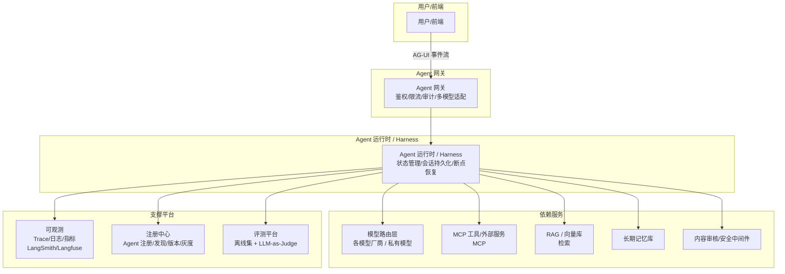

# Agent 工程化与生产部署

> 把一个能跑的 Demo 变成可上线、可运维、可合规的 Agent 系统，靠的是工程化能力。本章覆盖：可视化编排、监控日志、评测、API 网关、多模型路由、注册发布、安全合规。对应「03」Agent 能力体系里的「工程与部署能力」和「安全合规能力」两层。

---

## 一、核心概念

### 1.1 从 Demo 到生产，要补的课

| Demo 阶段够用 | 生产必须补 |
|--------------|-----------|
| 单轮跑通 | 高可用、并发、状态持久化、会话恢复 |
| 没监控 | 全链路 Trace、Token 成本、延迟、错误率 |
| 手工评测 | 自动化评测集 + LLM-as-Judge（用 LLM 当裁判打分） + 在线 A/B |
| 硬编码模型 | 多模型路由、降级、成本优化 |
| 无安全 | 内容审核、Prompt 注入防护、权限、PII（Personally Identifiable Information，个人身份信息）脱敏 |
| 无版本 | Agent 注册中心、版本管理、灰度发布 |

---

## 二、可视化编排（低代码 Agent 平台）

> 让非开发者（产品/业务）也能搭 Agent，是企业落地的关键。

### 2.1 主流平台

| 平台 | 出身 | 特点 |
|------|------|------|
| **Dify** | 开源 | 开源、可私有化、工作流+Agent+RAG 一体、生态活跃 |
| **Coze（扣子）** | 字节 | 托管、插件生态丰富、Bot 市场、国内友好 |
| **FastGPT** | 开源 | 偏知识库问答、工作流编排 |
| **LangFlow** | DataStax | LangChain 的可视化版、拖拽编排 |
| **Flowise** | 开源 | LangChain 可视化、轻量 |
| **n8n / Coze Studio** | - | 通用自动化工作流 + AI 节点 |

### 2.2 可视化编排的核心抽象
- **节点（Node）**：LLM 调用、工具、检索、条件分支、代码执行等。
- **边（Edge）**：节点间数据流，含条件路由。
- **变量/状态**：节点间传递的数据。
- **本质**：把「Workflow + Agent」图形化，复杂分支/循环也支持。对应「04-多Agent架构」的编排流水线模式的低代码化。

---

## 三、监控与日志（LLM 可观测）

> LLM 应用非确定性，传统 APM（Application Performance Monitoring，应用性能监控）不够，需专门的 LLM 可观测。

### 3.1 要观测什么

| 维度 | 指标 | 意义 |
|------|------|------|
| **Trace 追踪** | 一次调用展开成树（LLM/工具/检索每步输入输出） | 定位是哪步出问题 |
| **Token 成本** | 每次/每天 token 消耗与费用 | 成本控制 |
| **延迟** | TTFT（Time To First Token，首 token 时间）、总时延 | 用户体验 |
| **错误率** | 工具失败、超时、被审核拦截 | 稳定性 |
| **质量** | 幻觉率、回答相关度 | 效果 |
| **业务** | 任务完成率、人工接管率 | 真实价值 |

### 3.2 Trace 工具

| 工具 | 定位 |
|------|------|
| **LangSmith** | LangChain 官方，Trace+Eval+Prompt 管理（商业） |
| **Langfuse** | 开源 LLM 可观测，可私有化，主流选择 |
| **Arize Phoenix** | 开源，Trace+Eval，LLM 专用 |
| **Helicone** | 代理层 Trace + 成本 + 缓存 |
| **OpenTelemetry GenAI 语义约定** | 标准化 OTel（OpenTelemetry）对 LLM 的埋点规范（跨厂商） |

> 与「10-监控与可观测性」章节呼应：传统 APM（Prometheus/SkyWalking）管服务指标和链路，LLM 可观测管「调用内容、token、prompt 质量」。二者常共存。

### 3.3 日志要点
- 结构化记录每轮的输入、输出、工具调用、模型参数。
- 敏感内容脱敏后存储（合规）。
- 支持按会话/TraceId 串联回放，便于复现 bug。

---

## 四、评测（Eval）

> 没有评测就没有改进。Agent 评测比传统软件难（非确定性）。

### 4.1 评测层次

| 层次 | 方法 | 说明 |
|------|------|------|
| **离线评测** | 评测集 + 指标 | 改动前先离线验证不退化 |
| **LLM-as-a-Judge** | 用强模型当裁判打分 | 自动化、规模大、但有偏见 |
| **规则/程序校验** | 断言、正则、测试通过率 | 客观可验证（如代码 Agent） |
| **人工评测** | 标注员评分 | 金标准但慢贵 |
| **在线 A/B** | 灰度对比真实指标 | 最终真相 |

### 4.2 RAG/Agent 专项指标
- **RAG**：RAGAS（RAG 评测框架）四指标（Faithfulness/Answer Relevancy/Context Precision/Recall，见「02」）。
- **Agent**：任务完成率、工具调用准确率、平均步数、Token 消耗、人工接管率。
- **代码 Agent**：测试通过率、编译通过率（可客观验证，最靠谱）。

### 4.3 评测工程实践
- 建评测数据集（黄金集），每次改动跑回归防退化。
- 评测要区分「能力」和「对齐」：模型升级可能能力涨但对齐变（更啰嗦/不安全）。
- 对比版本时固定 seed/温度，减少随机性干扰。

---

## 五、API 接口与网关

### 5.1 Agent as a Service
- 把 Agent 封装成 API 对外提供：`POST /agent/run`，支持同步/流式（SSE）。
- 会话状态用 `session_id` 关联，支持多轮。

### 5.2 Agent 网关（类比 API 网关）
统一入口承担：
- **鉴权**：API Key / OAuth（开放授权）/ JWT（JSON Web Token，JSON 令牌）。
- **限流熔断**：按租户/用户限流，防滥用和成本失控。
- **路由**：按任务路由到不同 Agent。
- **审计**：记录谁调了什么、输入输出（脱敏）。
- **多模型适配**：屏蔽不同模型厂商 API 差异，统一对内接口。

---

## 六、多模型支持与路由

### 6.1 为什么需要多模型
- **成本**：简单任务用小模型（便宜快），复杂任务用大模型（贵但强）。
- **能力互补**：不同模型各有所长（代码/推理/多模态/中文）。
- **容灾降级**：主力模型挂了自动切备用。
- **合规**：部分场景必须私有化部署的模型。

### 6.2 模型路由策略
- **按任务路由**：分类器/路由模型判断任务难度，分发到合适模型。
- **级联（Cascade）**：先用小模型试，不确定/失败再升级大模型（省钱）。
- **降级**：主模型超时/限流自动切备用。
- **成本优化**：缓存（相似请求复用）、Prompt 压缩、批处理 API。

---

## 七、Agent 注册与发布

> 用户重点。类比微服务注册中心。

### 7.1 Agent 注册中心
- **注册**：Agent 上线时把自己的元信息（名称、能力、版本、端点、Schema、依赖模型/工具）注册到中心。
- **发现**：调用方（或编排 Agent）从中心发现可用 Agent。类比 A2A 的 Agent Card 集中化。
- **版本管理**：多版本共存、灰度、回滚。
- **依赖管理**：记录 Agent 依赖哪些模型/工具/MCP Server/数据源。

### 7.2 发布流程
1. **开发**：在编排平台/代码开发，离线评测通过。
2. **注册**：注册到中心，打版本。
3. **灰度**：小流量上线，监控指标。
4. **全量**：指标达标后全量。
5. **可回滚**：出问题一键切回旧版本。

### 7.3 运维
- 配置中心动态调整 Prompt/参数/工具，不重启。
- 能力下线/迁移的平滑过渡。
- 配额与计费（按 token/按调用）。

---

## 八、安全与合规（关键）

> 对应 Agent 能力体系的「安全与合规能力」：内容审核、权限管理、数据隐私。Agent 能行动，风险也更大，安全是上线红线。

### 8.1 内容审核
- **输入审核**：拦截违规/有害输入（涉政、暴恐、Prompt 注入）。
- **输出审核**：生成内容过审后再返回，拦截违规输出。
- **工具调用审核**：危险工具调用前审核意图。
- **实现**：规则 + 小分类模型 + LLM 审核模型，多层防护。

### 8.2 权限管理
- **RBAC（Role-Based Access Control，基于角色的访问控制） / ABAC（Attribute-Based Access Control，基于属性的访问控制）**：谁能用哪个 Agent、调哪个工具、访问哪些数据，按角色/属性控制。
- **最小权限**：Agent 只拿到完成任务所需的最小工具和数据权限。
- **人在环（Human-in-the-Loop）**：高危操作（删除、外发、付款）必须人工确认。
- **操作审计**：所有工具调用留痕可追溯。

### 8.3 数据隐私
- **PII 脱敏**：把姓名/手机/身份证/邮箱等敏感信息在送入模型前脱敏或替换。
- **数据不出域**：敏感场景用私有化部署模型，数据不外传。
- **会话隔离**：多租户数据严格隔离，禁止串户。
- **记忆管控**：长期记忆里的敏感数据加密、可清理、可遗忘（合规要求「被遗忘权」）。
- **Prompt 注入防护**：指令与数据隔离、输入清洗、限定输出格式、输出审核。

### 8.4 Agent 特有风险

| 风险 | 说明 | 防护 |
|------|------|------|
| **Prompt 注入** | 输入里藏指令劫持 Agent | 指令/数据隔离、输入审核、最小权限 |
| **过度自主** | Agent 执行未预期的危险操作 | 人在环、危险操作确认、沙箱 |
| **数据泄露** | Agent 把私有数据带进对话外发 | PII 脱敏、外发确认、数据不出域 |
| **工具滥用** | 滥调工具/越权 | 权限、配额、审计 |
| **幻觉行动** | 基于错误信息执行了真实操作 | 关键操作前校验、自我反思 |

---

## 九、生产部署架构参考

要点：
- **无状态运行时 + 有状态存储**：会话状态/记忆外置到 DB/向量库，运行时可水平扩展。
- **缓存层**：相似请求缓存，省成本降延迟。
- **异步/队列**：长任务走异步，避免阻塞。
- **高可用**：多副本、降级、限流熔断。

---

## 十、常见面试题

1. **LLM 应用为什么需要专门的可观测？观测什么？**
   非确定性 + 内容驱动，传统指标不够。需 Trace（每步输入输出）、Token 成本、延迟、错误率、质量（幻觉率）、业务指标（任务完成率）。工具：LangSmith/Langfuse/Phoenix。

2. **Agent 怎么评测？**
   离线评测集 + LLM-as-Judge 自动打分 + 规则/程序校验（代码 Agent 看测试通过率）+ 人工评测 + 在线 A/B。RAG 用 RAGAS 四指标，Agent 看任务完成率/工具准确率/平均步数。

3. **多模型路由解决什么？怎么路由？**
   成本、能力互补、容灾、合规。按任务路由（难度分流）、级联（小模型先试再升级大模型）、降级（主挂切备）、缓存/压缩降本。

4. **Agent 注册中心是干什么的？**
   Agent 元信息（能力/版本/端点/Schema/依赖）注册与发现，支持版本管理、灰度、回滚。类比微服务注册中心，A2A 的 Agent Card 是其去中心化形式。

5. **Agent 安全有哪些特有风险？怎么防？**
   Prompt 注入（指令数据隔离+审核）、过度自主（人在环+确认+沙箱）、数据泄露（PII 脱敏+外发确认+不出域）、工具滥用（权限+配额+审计）、幻觉行动（关键操作前校验）。

6. **怎么做 Agent 的灰度发布？**
   评测通过 -> 注册新版本 -> 小流量灰度 -> 监控指标（完成率/成本/接管率）-> 达标全量，可一键回滚。

7. **内容审核和权限管理分别管什么？**
   内容审核管「内容对不对」（输入输出是否违规）；权限管理管「能不能做」（谁能用哪个 Agent/工具/数据）。前者防有害内容，后者防越权操作。

8. **生产部署 Agent 的架构要点？**
   无状态运行时+有状态存储（状态/记忆外置）、Agent 网关（鉴权限流审计多模型）、缓存降本、异步长任务、多副本高可用降级限流。

---

> 本章是 AI 专题的收尾工程篇。建议结合「10-监控与可观测性」传统可观测、「11-云原生」部署、「05-分布式系统」网关/限流 一起看，AI Agent 的工程化本质仍是分布式系统工程。
