# AI 记忆机制全景解析（一）：全景与三层架构

> 记忆是 AI 从「一次性工具」走向「持续进化智能体」的核心能力。
> 本系列从 LLM 内核层、Agent 系统层、全局生态层三个维度，系统拆解 AI 记忆的 What / When / How / Which。
> 本章为总览篇，建立全局认知框架。

---

## 一、为什么 AI 需要记忆

### 1.1 没有记忆的 AI 是什么样

原生 LLM 本质上是**无状态函数**：每次调用都是独立的，输入即输出，调用结束状态清零。

```
输入 Prompt → LLM 推理 → 输出结果 → （状态归零）
```

这导致三个核心问题：

| 问题 | 表现 | 影响 |
|------|------|------|
| **遗忘** | 每次对话都像第一次，记不住用户偏好、历史决策 | 用户体验差，每次都要重新交代背景 |
| **重复** | 同一个问题反复思考、同一个错误反复犯 | 效率低、成本高（重复消耗 Token） |
| **不可持续** | 无法在多次交互中积累经验、持续进化 | 永远停留在「工具」层面，达不到「助手」甚至「伙伴」 |

### 1.2 记忆的价值：从工具到伙伴

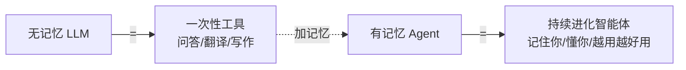

记忆让 AI 从「**你每次都要告诉它一切**」变成「**它越来越懂你**」。这也是 2025 年 AI 工程化的核心议题之一。

---

## 二、AI 记忆的三层架构 ★

> 这是本章最重要的框架。很多人谈到「AI 记忆」时混淆了不同层级，导致讨论不在一个频道上。

AI 记忆可以从下到上分为三层：**LLM 记忆（计算内核层）→ Agent 记忆（系统层）→ AI 全局记忆（生态层）**。

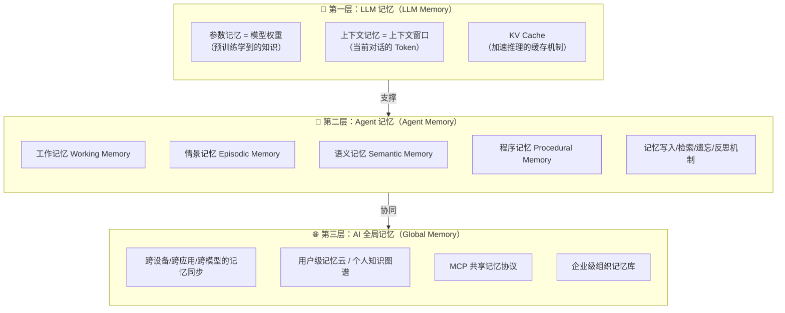

### 2.1 第一层：LLM 记忆（计算内核层）

LLM 自身的「记忆」，是模型层面的能力。

#### 2.1.1 参数记忆（Parametric Memory）

- **是什么**：模型训练完成后，**权重（Weights）**中编码的知识。就是模型「本来就知道」的东西。
- **来源**：预训练 + SFT + RLHF 等训练过程中，把语料知识「压缩」进参数里。
- **特点**：
  - 容量大（数十亿到数万亿参数对应海量知识）。
  - **只读**：推理时不改权重，知识固化在参数里。
  - 有截止日期：训练数据有 cutoff，之后的事不知道。
  - 可能产生幻觉：参数记忆是概率性的，会编造不存在的事实。
- **类比**：人的「常识 / 知识库」，是出生+学习后装进大脑的东西。

#### 2.1.2 上下文记忆（Context Memory）

- **是什么**：**上下文窗口（Context Window）**里的 Token。就是「当前这次对话还记得什么」。
- **工作原理**：LLM 每生成一个 Token，都会把前面所有 Token 作为输入。所以上下文窗口里的内容，模型「都记得」。
- **特点**：
  - 容量有限：从 4K 到 200K 甚至 1M+，但终归有上限。
  - 读写快：直接参与计算，无需额外检索。
  - 会丢失：窗口满了会被截断 / 压缩；会话结束就没了。
  - **位置效应**：中间内容容易被忽略（Lost in the Middle），首尾更清晰。
- **类比**：人的「工作记忆 / 短时记忆」，当前正在想的事。

#### 2.1.3 KV Cache（键值缓存）

- **是什么**：推理过程中，把前面 Token 的 Key 和 Value 向量缓存下来，避免重复计算。
- **本质**：这是**工程优化手段**，不是「认知意义上的记忆」，但它是上下文记忆能高效工作的基础。
- **作用**：让长上下文推理的每一步只计算新 Token，而不是从头算一遍——否则 1M 上下文根本跑不动。

> ⚠️ **面试辨析**：很多人把 KV Cache 也叫「记忆」，但要区分层次：参数记忆和上下文记忆是「认知意义上的记忆」，KV Cache 是「工程实现上的缓存」。面试时提到三层架构要把 KV Cache 归为 LLM 内核层的**工程支撑**，而非独立记忆类型。

### 2.2 第二层：Agent 记忆（系统层）

> Agent 在 LLM 之上构建的**结构化记忆系统**，让 Agent 能跨会话、长期、有组织地记住东西。
> 详细展开见后续章节，本章先建立框架。

Agent 记忆借鉴了**认知科学**的分类，通常分为四类：

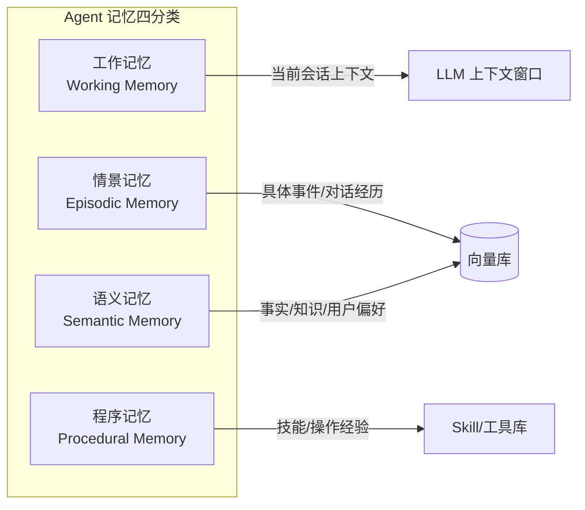

| 记忆类型 | 存什么 | 存储载体 | 生命周期 | 认知类比 |
|---------|--------|---------|---------|---------|
| **工作记忆** | 当前任务的上下文、正在处理的信息 | 上下文窗口 | 单次会话 | 你正在想的事 |
| **情景记忆** | 具体事件、对话历史、「什么时候发生了什么」 | 向量库 / 日志 | 长期，按场景检索 | 你记得昨天吃了什么 |
| **语义记忆** | 事实、知识、用户偏好、抽象规律 | 向量库 / 知识图谱 / KV | 长期稳定 | 你知道北京是中国首都 |
| **程序记忆** | 技能、操作流程、做事方法 | Skill 库 / 工具集 / Prompt 模板 | 长期可复用 | 你会骑自行车 |

> **核心洞察**：Agent 记忆 = **在 LLM 上下文窗口之外**，用外部存储 + 检索机制，**扩展 LLM 的记忆能力**。
> 记忆要起作用，最终还是要被**检索并注入上下文窗口**——LLM 只能「看到」窗口里的东西。

### 2.3 第三层：AI 全局记忆（生态层）

> 2025 年开始兴起的新层级：当 AI 不再是单一产品，而是跨设备、跨应用、跨模型的生态时，记忆需要在生态层面流动。

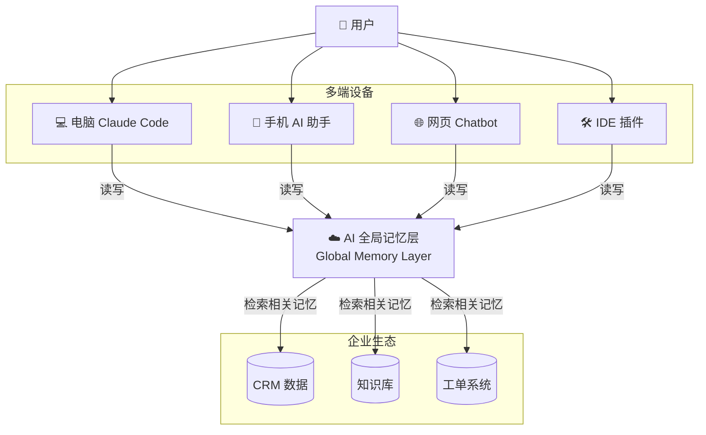

全局记忆的核心命题：

| 问题 | 说明 |
|------|------|
| **跨端同步** | 在电脑上聊过的事，手机上的 AI 也知道 |
| **跨应用共享** | 笔记 App 里的内容，对话助手也能引用 |
| **跨模型迁移** | 换了模型（Claude → GPT → 国产模型），记忆不丢 |
| **组织级记忆** | 企业里所有员工的 AI 共享组织知识库、最佳实践 |
| **隐私与权限** | 哪些记忆能被哪些 AI 用？如何保证数据安全？ |

> 目前（2025-2026）全局记忆还处于早期阶段，MCP（Model Context Protocol）、A2A 等协议正在探索记忆的标准化交互。这是一个有前景的方向，但工程落地尚早。

---

## 三、记忆的四大维度（4W 框架）★

> 理解任何记忆系统，都可以从四个维度切入：**When（什么时候记）、What（记什么）、How（怎么存）、Which（用什么模态处理）**。

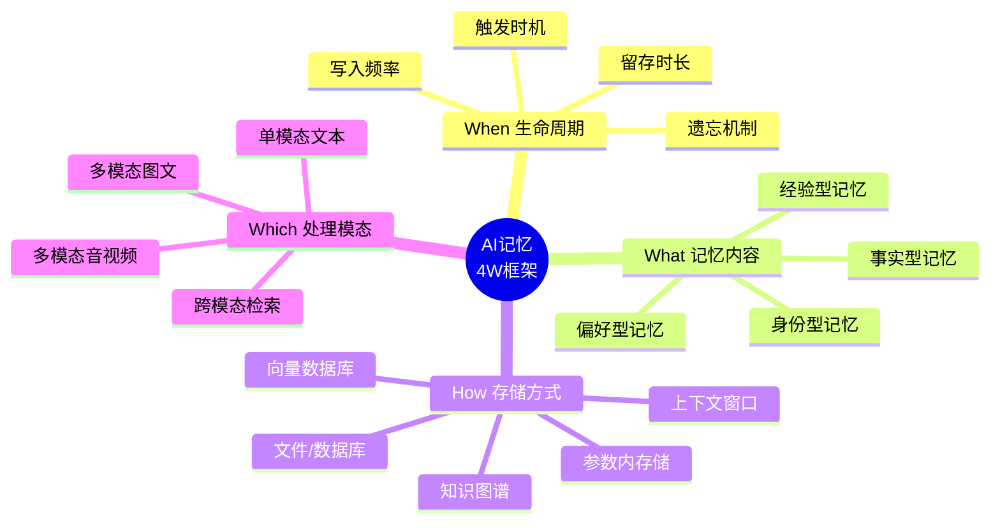

下面逐一展开。

---

## 四、When：记忆的生命周期

### 4.1 生命周期全景

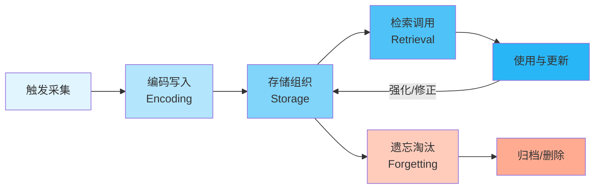

### 4.2 各阶段详解

#### 4.2.1 触发采集：什么时候开始记？

记忆不是什么都记，需要触发条件：

| 触发策略 | 说明 | 适用场景 |
|---------|------|---------|
| **显式触发** | 用户明确说「记住这个」 | 用户偏好、重要决策 |
| **隐式推断** | 系统自动判断「这值得记」 | 对话中的关键信息、用户习惯 |
| **事件触发** | 特定事件发生时记录 | 任务完成、错误发生、里程碑 |
| **定时采集** | 周期性地总结并写入记忆 | 每日总结、每周反思 |
| **全量记录** | 记录所有交互，后续筛选 | 日志型记忆（成本高） |

> **工程难点**：记多了→噪声大、检索不准、成本高；记少了→关键时刻想不起来。**「选择性记忆」是记忆系统的核心艺术**。

#### 4.2.2 编码写入：怎么把信息变成记忆？

原始信息不能直接存，需要处理：

- **向量化**：把文本转成 Embedding 向量，支持语义检索。
- **结构化**：提取关键实体、关系，存成知识图谱或 JSON。
- **摘要化**：长内容先做摘要，只存要点（省空间、降噪声）。
- **打标签**：添加元数据（时间、来源、场景、重要度、关联任务）。

#### 4.2.3 存储组织：记忆怎么放？

不是堆在一起就完了，需要组织结构：

- **时序组织**：按时间线排列，天然对应情景记忆。
- **语义聚类**：按主题/语义相似度分组，相关记忆放在一起。
- **层级组织**：从具体事实 → 抽象规律 → 核心原则，层层提炼。
- **关联网络**：记忆之间有链接（类似维基百科的超链接），形成知识图谱。

#### 4.2.4 检索调用：怎么找到需要的记忆？

> 记忆的价值 = **被检索到的概率 × 检索到的内容质量**。存了但搜不到 = 白存。

常见检索策略：

| 策略 | 原理 | 优点 | 缺点 |
|------|------|------|------|
| **关键词检索** | 字面匹配 | 精确、快 | 同义词/语义关联查不到 |
| **向量检索** | 语义相似度匹配 | 能搜到语义相关的 | 可能不精确、有幻觉 |
| **混合检索** | 关键词 + 向量 + Rerank | 兼顾精确和语义 | 实现复杂 |
| **结构化查询** | 按元数据过滤（时间/类型/来源） | 可控、精确 | 需要先有结构化数据 |
| **关联检索** | 从一条记忆出发，沿关联网络扩展 | 能发现间接相关的 | 容易跑偏 |

> 详见「02-RAG与向量检索」——记忆检索本质上就是 RAG 技术在「记忆」这个数据集上的应用。

#### 4.2.5 遗忘淘汰：什么时候忘掉？

记忆不只是存，**学会遗忘同样重要**。没有遗忘的记忆系统会被噪声淹没。

| 遗忘机制 | 说明 | 类比 |
|---------|------|------|
| **TTL 过期** | 给记忆设有效期，过期自动删 | 你记不住一周前的闲聊 |
| **使用频率淘汰** | 长期不用的记忆优先级降低，最终淘汰 | 用进废退 |
| **合并/摘要** | 多条相关记忆合并成一条抽象总结 | 从「我周一吃了面、周二吃了面」→「我常吃面」 |
| **重要度排序** | 重要的记久一点，不重要的很快忘 | 你记得生日但记不得上周三午饭吃了啥 |
| **主动修正** | 发现记忆错误/过时，主动更新或删除 | 纠正错误认知 |

> **Generative Agents 中的 Reflection 机制**就是一种主动的「记忆加工」：定期让 LLM 对近期记忆做反思，提炼出更高层的洞察，存入语义记忆。这是「记忆不仅存，还会发酵」的典型实现。

---

## 五、What：记忆包含什么

> 「记什么」是比「怎么记」更前置的问题。记错了东西，再好的存储也没用。

### 5.1 按内容类型分类

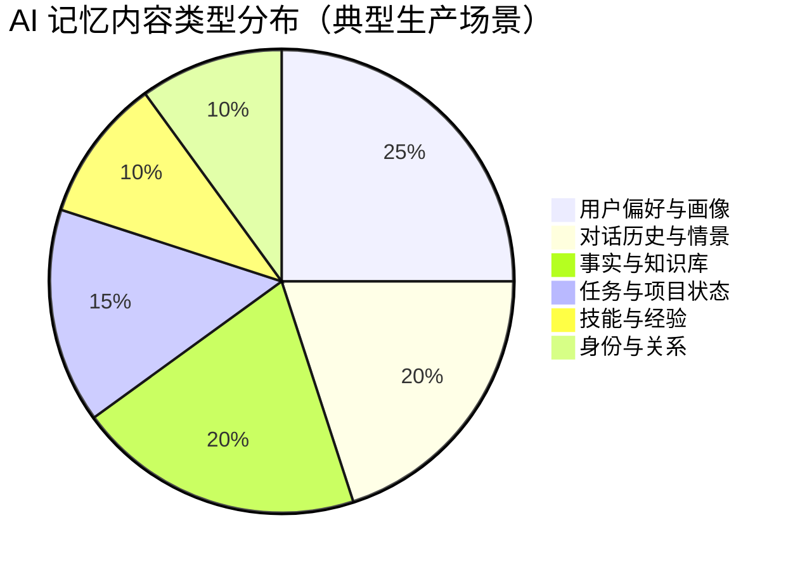

#### 5.1.1 用户偏好型记忆

- **存什么**：用户的习惯、喜好、禁忌、常用配置、沟通风格。
  - 「用户喜欢用 Java，不用 Python」
  - 「用户对代码风格有严格要求：用中文注释、变量名用小驼峰」
  - 「用户不喜欢冗长解释，要直接给答案」
- **价值**：让 AI 越来越「懂」用户，个性化体验的核心。
- **挑战**：偏好可能变化，需要动态更新；有些偏好是场景相关的。

#### 5.1.2 事实知识型记忆

- **存什么**：客观事实、领域知识、业务规则。
  - 「项目使用的 JDK 版本是 17」
  - 「我们的订单号规则是：时间戳 + 机器ID + 序列号」
- **价值**：把私有知识「喂」给 AI，弥补参数记忆的不足。
- **挑战**：事实可能过时，需要版本管理；要区分事实和观点。

#### 5.1.3 情景经验型记忆

- **存什么**：发生过的事、对话历史、任务过程、成功/失败经验。
  - 「上次处理类似的数据库迁移问题时，我们用了方案 B，因为……」
  - 「这个用户之前踩过 A 坑，这次要提醒他们」
- **价值**：从经验中学习，避免重复犯错，持续改进。
- **挑战**：数量大、噪声多，需要筛选和提炼。

#### 5.1.4 任务状态型记忆

- **存什么**：当前进行中的任务、待办、进度、上下文。
  - 「用户正在做 XX 项目的数据库迁移，进度 60%，下一步是……」
  - 「有 3 个待办事项：① ② ③」
- **价值**：跨会话、跨设备继续任务的基础。
- **挑战**：状态更新频繁，要保持一致性；多任务并行时不能串。

#### 5.1.5 身份关系型记忆

- **存什么**：用户是谁、他们的角色、他们的社交/工作关系。
  - 「用户是后端架构师，6 年 Java 经验」
  - 「张三是技术负责人，李四负责前端」
- **价值**：提供个性化、相关的帮助，理解组织上下文。
- **挑战**：隐私敏感；关系可能变化。

#### 5.1.6 程序技能型记忆

- **存什么**：做事的方法、流程、模板、最佳实践。
  - 「写 SQL 优化的标准流程是……」
  - 「排查 OOM 的标准步骤是……」
- **价值**：让 AI 掌握「怎么做」的能力，而不只是「知道什么」。
- **挑战**：技能需要验证有效性；不同场景可能需要不同技能。

### 5.2 按抽象层级分类

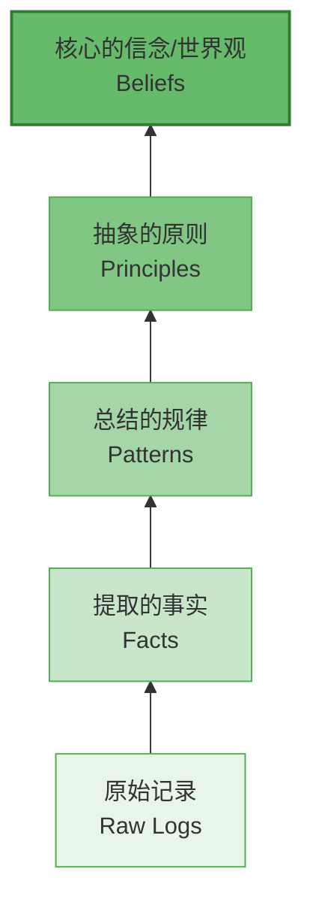

| 层级 | 内容 | 数量 | 稳定性 | 形成方式 |
|------|------|------|--------|---------|
| 原始记录 | 对话日志、事件流水 | 最多 | 一次性 | 直接记录 |
| 提取的事实 | 从记录中抽出的具体事实 | 多 | 较稳定 | 信息抽取 |
| 总结的规律 | 从多个事实中归纳的模式 | 中 | 较稳定 | 聚类/归纳 |
| 抽象的原则 | 更高层的方法论、准则 | 少 | 稳定 | 反思/提炼 |
| 核心信念 | 最根本的假设和价值观 | 极少 | 很难变 | 长期积累 |

> 这个金字塔结构非常重要：**好的记忆系统不是存得越多越好，而是能从原始数据不断提炼，越往上越精华**。
> 底层是「记了什么」，顶层是「学到了什么」。

---

## 六、How：记忆怎么存储

> 从存储介质和数据结构的角度，梳理 AI 记忆的主要存储方式。

### 6.1 存储方式全景图

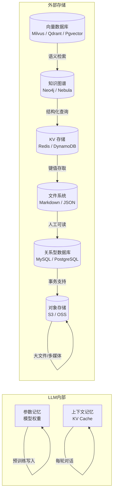

### 6.2 各存储方式对比

| 存储方式 | 存什么 | 优点 | 缺点 | 适用场景 |
|---------|--------|------|------|---------|
| **模型参数** | 通用世界知识 | 推理时直接可用、无需检索 | 只读、有截止日期、可能幻觉 | 基础知识 |
| **上下文窗口** | 当前对话/任务 | 最快、最直接、LLM 天然理解 | 容量有限、会丢、成本高 | 工作记忆 |
| **向量数据库** | 非结构化文本/多模态 | 语义检索、相似度匹配 | 不精确、需要 Embedding | 情景记忆、语义记忆 |
| **知识图谱** | 实体+关系 | 精确查询、可解释、可推理 | 构建成本高、schema 难定 | 结构化知识、关系网络 |
| **KV 存储** | 键值对、配置、偏好 | 快、简单、精确 | 只能按键查 | 用户偏好、配置 |
| **文件系统** | Markdown / JSON / 笔记 | 人可读、易编辑、版本管理 | 检索慢、不适合海量数据 | 文档型记忆（如 Claude Code memory） |
| **关系数据库** | 结构化数据 | 事务、SQL 查询、一致性 | schema 不灵活 | 业务数据型记忆 |
| **对象存储** | 大文件、图片、音视频 | 成本低、容量大 | 检索靠元数据 | 多模态原始数据 |

### 6.3 混合存储架构

生产级记忆系统通常不是单一存储，而是**多层混合**：

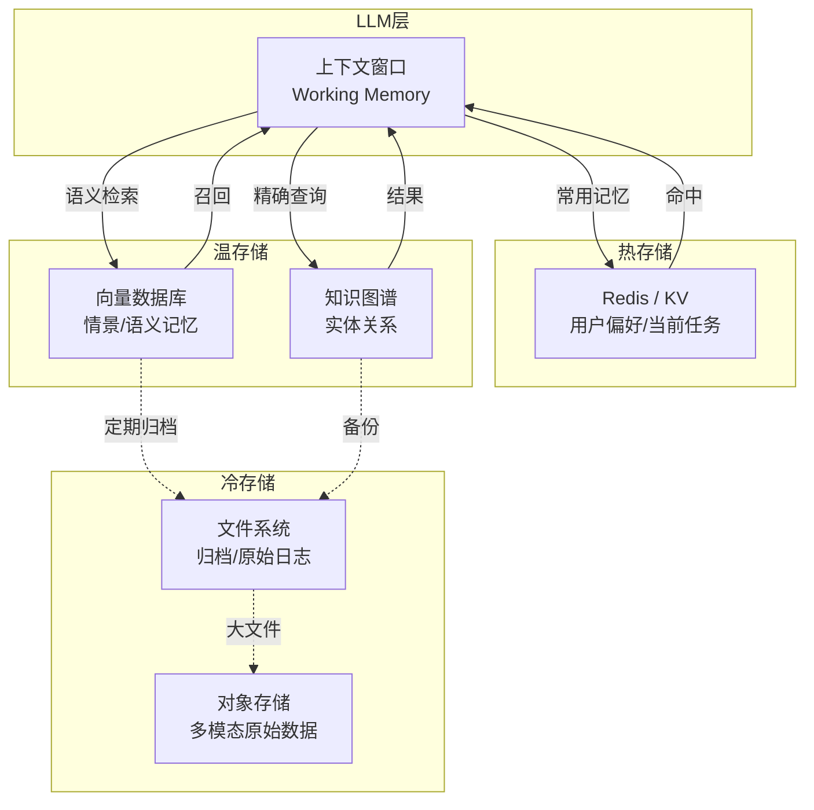

**记忆金字塔（从热到冷）**：

1. **热记忆（Hot）**：在上下文窗口里，当前正在用 → 最快，容量最小
2. **温记忆（Warm）**：在 Redis / 向量库中，可快速检索 → 较快，容量中等
3. **冷记忆（Cold）**：在文件 / 对象存储里，不常用 → 慢，容量最大

> 这和 CPU 缓存（L1/L2/L3/内存/磁盘）的层级设计思想异曲同工——**越常用的放越快的存储，越不常用的放越大容量的存储**。

---

## 七、Which：记忆的模态处理

> 单模态还是多模态？图像、音频、视频怎么记？跨模态怎么检索？

### 7.1 模态演进路径

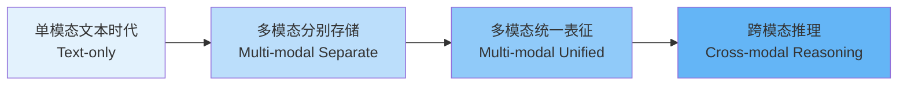

#### 7.1.1 阶段一：单模态文本记忆

- **特点**：只存文本，所有记忆都以文字形式存在。
- **技术栈**：文本 Embedding + 向量检索。
- **局限**：图像、音频等信息必须先转成文字描述才能存，丢失大量细节。
- **现状**：大部分现有 Agent 还在这个阶段。

#### 7.1.2 阶段二：多模态分别存储

- **特点**：不同模态分开存、分开索引。
  - 文本 → 文本向量库
  - 图片 → 图片向量库（用 CLIP 等视觉模型编码）
  - 音频 → 转文字后存文本 + 存音频特征
- **检索方式**：按模态分别检索，再融合结果。
- **局限**：模态之间是「分离」的，不能真正理解跨模态关联。

#### 7.1.3 阶段三：多模态统一表征

- **特点**：用统一的多模态 Embedding 模型（如 CLIP、多模态 Encoder），把不同模态编码到**同一个向量空间**。
- **优势**：
  - 「文搜图」「图搜文」「音频搜视频」——任意模态互搜。
  - 不需要为每种模态单独建索引。
- **代表技术**：CLIP、ImageBind、Qwen-VL、GPT-4o Embedding 等。

#### 7.1.4 阶段四：跨模态推理记忆

- **特点**：不仅能跨模态检索，还能在记忆层面进行多模态融合推理。
  - 比如看到一张架构图，能关联到对应的代码实现文档。
  - 听到一段会议录音，能关联到相关的项目文档和待办事项。
- **现状**：前沿研究方向，工程落地尚早。

### 7.2 多模态记忆的技术挑战

| 挑战 | 说明 |
|------|------|
| **存储成本** | 图片/音视频比文本大得多，存储成本指数级上升 |
| **检索精度** | 多模态检索的精度目前还不如纯文本检索 |
| **Embedding 质量** | 多模态向量空间的语义一致性还不够好 |
| **隐私安全** | 图像/音频中可能包含人脸、声纹等敏感生物信息 |
| **压缩与摘要** | 多模态内容怎么做「摘要」？视频摘要、图像要点提取还是难题 |

---

## 八、记忆效能衡量（Memory Evaluation）★

> 记忆系统不是「做了就好」，得能衡量它有没有用、好不好用。没有度量就没有优化。
> 本节从五个维度建立记忆效能的评估框架。

### 8.1 为什么需要衡量记忆效能

很多团队做记忆系统容易陷入「技术自嗨」：上了向量库、加了 Rerank、存了几万条记忆，然后呢？——不知道这些记忆到底帮没帮上忙。

记忆系统的核心价值只有一个：**让 AI 的输出更准确、更相关、更高效**。如果记了一堆东西但检索不准、干扰推理、甚至引入错误，那还不如不记。

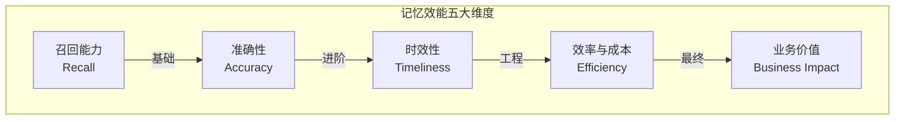

### 8.2 维度一：召回能力（Recall）—— 该想起来的能不能想起来？

> 存了 1 万条记忆，但用户问的问题对应的记忆搜不到 = 白存。

#### 8.2.1 核心指标

| 指标 | 含义 | 计算方式 |
|------|------|---------|
| **记忆召回率（Memory Recall@K）** | 给定一个查询，Top-K 结果中包含相关记忆的比例 | 相关记忆出现在 Top-K 中的次数 / 总查询次数 |
| **平均倒数排名（MRR）** | 第一条相关记忆的排名的倒数的平均值，衡量「第一个对的排第几」 | 1 / rank（第一条正确结果的位置）的平均 |
| **NDCG@K** | 考虑排名位置的加权指标，位置越靠前权重越高 | 归一化折损累计增益 |

#### 8.2.2 怎么测

1. **构建黄金数据集**：人工标注 N 组「查询 → 应该召回哪些记忆」的标准答案。
2. **跑检索测试**：用记忆系统的检索器对每个查询跑一遍。
3. **算指标**：对比系统结果和标准答案，算 Recall@K / MRR / NDCG。

> 💡 **面试金句**：衡量记忆召回能力和衡量 RAG 检索能力的方法是一样的，因为记忆检索本质就是对「记忆数据集」做 RAG。区别在于数据集的性质不同——记忆是时间序列的、高度个性化的，而知识库通常是静态的、通用的。

### 8.3 维度二：准确性（Accuracy）—— 想起来的对不对？

> 召回来了，但记忆是错的、过时的、或者被错误解读了，反而帮倒忙。

#### 8.3.1 核心指标

| 指标 | 含义 | 测量方法 |
|------|------|---------|
| **记忆正确率** | 召回的记忆中，内容是正确/不过时的比例 | 人工标注或自动校验（如时间戳检查） |
| **精准率（Precision@K）** | Top-K 结果中，真正相关的记忆占多少 | 相关且在 Top-K 中的数量 / K |
| **记忆污染率** | 错误/过时/虚假记忆在全部记忆中的比例 | 定期抽样审计 |
| **幻觉率（由记忆引起的）** | 因为记忆不准确导致 LLM 输出错误答案的比例 | 对比「有记忆」和「无记忆」的答案正确率 |

#### 8.3.2 记忆错误的常见来源

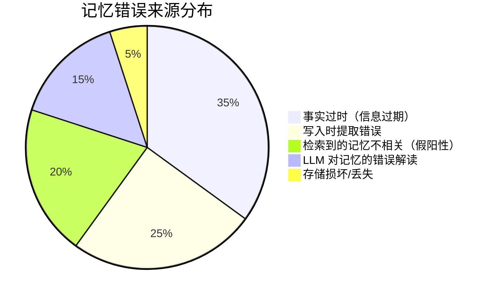

#### 8.3.3 怎么保证准确性

- **来源溯源**：每条记忆带来源（哪次对话、哪个文档），可以追溯和验证。
- **时效标记**：给记忆打上时间戳和有效期，过期的自动降级或删除。
- **置信度**：每条记忆有置信度分数，低置信度的谨慎使用。
- **冲突检测**：新写入的记忆如果和已有记忆矛盾，触发校验机制。
- **人工审核**：高价值的记忆（如企业知识库）定期人工审核。

### 8.4 维度三：时效性（Timeliness）—— 该多快想起来？

> 记忆不是存在那儿就行，得在**需要的时候**、**足够快地**被想起来。太晚了，黄花菜都凉了。

#### 8.4.1 核心指标

| 指标 | 含义 | 典型目标 |
|------|------|---------|
| **检索延迟（P50 / P95 / P99）** | 从查询到返回记忆结果的时间 | P95 < 200ms（交互式场景） |
| **记忆新鲜度** | 事件发生后，多久能被检索到（写入到可查的延迟） | 近实时 < 5s，批量 < 1h |
| **上下文命中率** | 在 LLM 真正需要某条记忆的那一轮，它是否已经被注入到了上下文 | 越高越好 |

#### 8.4.2 上下文命中率：最容易被忽视的指标

很多人只看「检索准不准」，但其实**「有没有在正确的时机被注入上下文」**同样关键。

举个例子：用户在第 5 轮对话时提到了一个关键偏好，但记忆系统到第 10 轮才把它检索出来——中间 5 轮都没用到，这就是「上下文命中率低」。

**影响上下文命中率的因素**：
1. **检索触发时机**：是每轮都检索，还是只在特定时机检索？
2. **查询构造质量**：用当前轮的用户输入直接搜，还是构造更精准的查询？
3. **记忆粒度**：记忆太大/太小，都会导致「相关但不全中」。

### 8.5 维度四：效率与成本（Efficiency & Cost）

> 记忆系统不是不计成本的。每存一条、每搜一次，都要花钱（Token 费、存储费、算力费）。

#### 8.5.1 成本构成

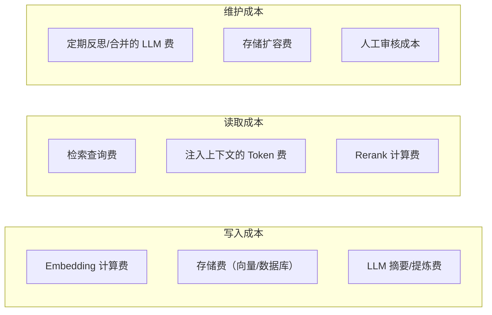

#### 8.5.2 核心成本指标

| 指标 | 含义 | 优化方向 |
|------|------|---------|
| **单条记忆写入成本** | 从原始内容到存入记忆库的平均成本 | 减少不必要的写入、批量 Embedding |
| **单次检索成本** | 每次查询 + Rerank 的费用 | 缓存常用查询、减少 Rerank 次数 |
| **记忆 Token 占比** | 每轮对话中，记忆内容占总 Token 的比例 | 控制注入量、压缩记忆 |
| **ROI（投入产出比）** | 记忆系统带来的收益 ÷ 记忆系统的成本 | 提升收益、降低成本 |

#### 8.5.3 成本优化的核心思路

> ⚠️ **记忆系统最大的浪费不是多花了钱，而是花了钱的记忆根本没被用到。**

- **少写比优化存储更重要**：先优化「什么值得记」，减少写入量，这是比优化存储性价比高得多的事。
- **冷记忆降级存储**：长期不用的记忆从热存储移到冷存储，甚至归档删除。
- **记忆压缩**：多条相关记忆合并成摘要，减少 Token 占用。
- **检索缓存**：相似查询直接命中缓存，不用每次都去向量库搜。

### 8.6 维度五：业务价值（Business Impact）—— 记忆到底有没有用？

> 前面四个都是技术指标，最终要落到业务价值上。记忆系统的存在是为了什么？

#### 8.6.1 业务价值的衡量维度

| 价值维度 | 具体指标 | 怎么测 |
|---------|---------|--------|
| **用户体验提升** | 用户满意度、复访率、对话轮数 | A/B 测试：有记忆 vs 无记忆 |
| **效率提升** | 完成同一个任务所需的对话轮数、用户重复输入的比例 | 统计对比 |
| **错误率降低** | 因为有记忆而减少的错误回答比例 | 人工评估 |
| **个性化程度** | 用户感知到「它懂我」的程度 | 用户调研 / NPS |
| **成本节约** | 因为记住了而减少的重复计算/重复检索/重复人工 | 成本核算 |

#### 8.6.2 A/B 测试：记忆系统的「终极审判」

最可靠的评估方法是 **A/B 测试**：

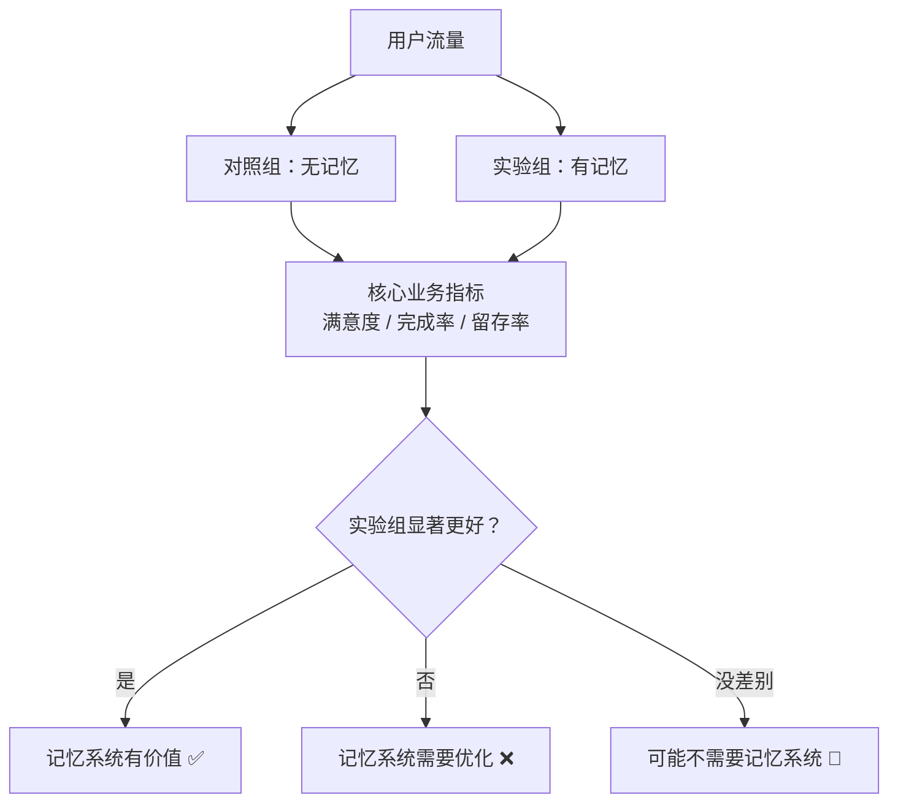

> **真实案例**：很多团队上线记忆系统后做 A/B 测试，发现核心指标没提升甚至下降了——因为检索不准、注入了噪声记忆，反而干扰了 LLM 的判断。这就是「有记忆还不如没记忆」的典型情况。

### 8.7 记忆系统成熟度模型

> 用来评估一个记忆系统处在什么水平，以及下一步该往哪走。

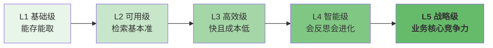

| 等级 | 名称 | 关键特征 | 衡量标准 |
|------|------|---------|---------|
| **L1 基础级** | 能存能取 | 有基本的写入和读取功能，记忆能持久化 | 能存、能取、不丢 |
| **L2 可用级** | 检索基本准 | Recall@5 > 70%，大部分情况下能召回到相关记忆 | 检索指标达标 |
| **L3 高效级** | 快且成本低 | 延迟低、成本可控，上下文命中率高 | 性能/成本指标达标 |
| **L4 智能级** | 会反思会进化 | 有遗忘机制、有反思提炼、记忆质量持续提升 | 记忆质量随时间提升 |
| **L5 战略级** | 核心竞争力 | 记忆系统是产品的差异化优势，用户因为「它懂我」而选择它 | 业务指标显著提升 |

---

## 九、本章核心面试要点

### 9.1 三层架构（必背）

```
LLM 记忆（内核层）
  ├── 参数记忆（模型权重，只读，预训练知识）
  ├── 上下文记忆（上下文窗口，读写快，容量有限）
  └── KV Cache（工程优化，加速推理）

Agent 记忆（系统层）
  ├── 工作记忆（当前上下文）
  ├── 情景记忆（事件/对话，向量库）
  ├── 语义记忆（事实/知识，向量库/图谱）
  └── 程序记忆（技能/方法，Skill 库）

AI 全局记忆（生态层）
  ├── 跨端/跨应用/跨模型共享
  ├── 个人记忆云 / 组织记忆库
  └── MCP / A2A 等协议标准化
```

### 9.2 4W + 1E 框架

- **When**：触发采集 → 编码写入 → 存储组织 → 检索调用 → 遗忘淘汰
- **What**：偏好型 / 事实型 / 情景型 / 任务型 / 身份型 / 技能型
- **How**：参数内 / 上下文 / 向量库 / 知识图谱 / KV / 文件 / 关系库 / 对象存储
- **Which**：单模态文本 → 多模态分离 → 多模态统一表征 → 跨模态推理
- **Evaluate（效能衡量）**：召回能力 / 准确性 / 时效性 / 效率成本 / 业务价值

### 9.3 高频面试题速答

**Q1：LLM 的参数记忆和 Agent 的外部记忆有什么区别？**

> 参数记忆在模型权重里，是预训练学到的通用知识，只读，有截止日期；外部记忆是 Agent 在上下文窗口之外用向量库等存储的个性化/私有知识，可读写，能持续更新。二者互补：参数记忆提供通用能力，外部记忆提供个性化和私有知识。

**Q2：为什么记忆系统需要遗忘机制？**

> 没有遗忘会导致三个问题：① 记忆爆炸，存储和检索成本越来越高；② 噪声累积，旧的/错误的/无关的记忆会干扰当前任务；③ 过时信息产生误导。好的记忆系统要像人一样，既能记住重要的，也能忘掉不重要的。

**Q3：记忆检索和 RAG 是什么关系？**

> 记忆检索本质上就是 RAG（检索增强生成）技术在「记忆数据集」上的应用。RAG 通常检索的是外部知识库，记忆检索检索的是历史交互和用户相关信息。底层技术（Embedding、向量库、混合检索、Rerank）是共用的。

**Q4：怎么衡量一个记忆系统好不好？**

> 看五个维度：① 召回能力（该想起来的能不能想起来，用 Recall@K / MRR / NDCG）；② 准确性（想起来的对不对，用 Precision / 记忆正确率 / 幻觉率）；③ 时效性（多快能想起来，用检索延迟 / 上下文命中率）；④ 效率与成本（花了多少钱，用单条写入成本 / 记忆 Token 占比 / ROI）；⑤ 业务价值（到底有没有用，用 A/B 测试看核心业务指标是否提升）。最终还是要落到业务价值上，技术指标再好，业务没提升就是白做。

---

## 十、已发布章节

> 本系列已完成前五章，覆盖从底层原理到业界趋势的完整全景。

| 章节 | 主题 | 核心内容 |
|------|------|---------|
| **第一章（本章）** | 全景与三层架构 | LLM/Agent/全局记忆三层、4W+1E 框架、记忆效能五维评估、成熟度模型 L1-L5 |
| **第二章** | LLM 记忆原理与 KV Cache | 参数记忆与激活记忆、自注意力机制、KV Cache 原理与公式、四大挑战、单机+分布式优化 |
| **第三章** | Agent 记忆原理与工程实践 | 四型记忆、五层记忆金字塔、路径加载、写入三原则、共享复用、设计陷阱 |
| **第四章** | 记忆检索效率提升技术 | LLM 端优化、混合检索、QMD 机制、查询改写、语义缓存、Claude Code 与开源实现 |
| **第五章** | 业界趋势与未来展望 | 三波浪潮、六大趋势、短中长期路线图、技术选型建议 |

---

## 资料勘误与重点提醒

> ⚠️ 本章为原创整理，以下是容易混淆的概念澄清：

1. **「上下文窗口」不是「短期记忆」的全部**——很多文章把上下文窗口等同于短期记忆，但 Agent 层的「工作记忆」不止上下文窗口，还包括当前任务状态、变量等结构化状态。上下文窗口是 LLM 层面的短期记忆，工作记忆是 Agent 层面的短期记忆，前者是后者的子集。

2. **「向量库 = 长期记忆」是过度简化**——长期记忆可以用向量库、知识图谱、KV、文件系统等多种存储，甚至还可以是另一个 LLM（通过问答的方式提取记忆）。向量库只是最常见的实现方式之一。

3. **记忆不是越多越好**——很多人做记忆系统的第一反应是「全记下来」，但实际生产中，**记忆的质量比数量重要得多**。100 条精准的记忆远胜于 10000 条噪声记忆。选择性记忆 + 定期反思提纯，是更有效的策略。

4. **KV Cache 不是记忆类型**——有些科普文把 KV Cache 列为第三种记忆类型，严格来说它是**工程优化手段**，服务于上下文记忆，本身不存储「新的信息」，只是存储了已经计算过的中间结果。

5. **「全局记忆」≠「把所有数据上传云端」**——全局记忆的核心是**可访问性和一致性**，不是集中存储。可以是本地优先、云端同步，可以是端侧加密、云端只存密文，也可以是联邦学习式的分布式记忆。隐私和安全是全局记忆的核心挑战。

6. **「记忆效能五维框架」是整合性框架，非单一来源标准答案**——本章第八节的五维评估（召回/准确/时效/成本/业务价值）是我基于 RAG 评测体系、推荐系统评估方法、信息检索经典指标、软件工程成熟度模型等多领域知识**整合推导**出来的分析框架，不是某篇论文或某个权威机构的标准定义。各指标（Recall@K / MRR / NDCG / Precision 等）本身是信息检索和 RAG 领域的通用指标，但把它们组织成「记忆效能五维框架」以及「L1-L5 成熟度模型」属于**分析性归纳**，用于帮助理解和落地，面试时可以说「这是我从工程实践角度总结的评估维度」，不要说「行业标准就是这五维」。
