# AI 记忆机制全景解析（二）：LLM 记忆的原理与检索过程

> 第一章讲了 AI 记忆的三层架构，本章深入最底层——**LLM 内核层的记忆**。
> 搞懂参数记忆和激活记忆（KV Cache）的原理，才能理解为什么上下文窗口是 LLM 的「工作记忆」，以及它为什么有各种限制。

---

## 一、LLM 记忆的分类

### 1.1 两种记忆：参数记忆 vs 激活记忆

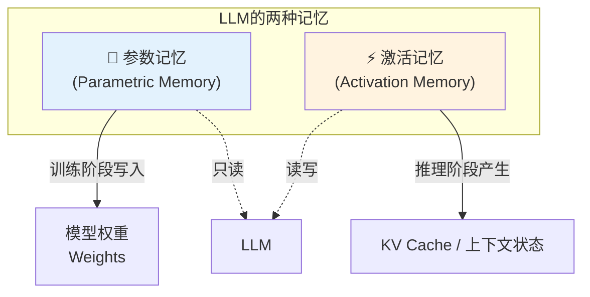

| 维度 | 参数记忆（Parametric Memory） | 激活记忆（Activation Memory） |
|------|-----------------------------|-----------------------------|
| **载体** | 模型权重（Parameters / Weights） | 推理过程中的中间激活值（KV Cache） |
| **写入时机** | 训练阶段（预训练+SFT+RLHF） | 推理阶段，每生成一个 Token 产生新的 K/V |
| **读取方式** | 每轮推理都从权重中「提取知识」 | 每轮推理直接读取缓存的 K/V |
| **可修改性** | 推理时只读，改需要微调/训练 | 可读写，每步追加新的 K/V |
| **容量** | 固定，由参数量决定 | 动态增长，直到上下文窗口上限 |
| **对应认知概念** | 长期记忆 / 常识 / 知识库 | 工作记忆 / 短期记忆 / 当前上下文 |
| **数据类型** | 通常 FP16 / BF16 / INT8 / INT4 | FP16 / BF16 / FP8（推理加速） |

### 1.2 一个直观的类比

想象 LLM 是一个人在做阅读题：

- **参数记忆** = 这个人**从小到大积累的知识**（词汇、语法、常识、逻辑推理能力）。这些知识刻在脑子里，答题时会用到，但你**没法现场改它**。
- **激活记忆** = 这个人**刚刚读过的文章内容**，都还在眼前（工作记忆里）。每读一个新句子，就往工作记忆里追加一点。文章越长，工作记忆越吃力，甚至会忘中间的内容。

> 💡 **核心洞察**：LLM 每次生成下一个 Token，都需要「回顾」前面所有 Token 的信息——这个「回顾」的动作就是**自注意力机制（Self-Attention）**，而「回顾」的内容存在哪里？就是 **KV Cache**。

---

## 二、激活参数的原理：自注意力机制 ★

> 要理解 KV Cache，必须先理解自注意力。这是 LLM 「记住上下文」的根本机制。

### 2.1 自注意力是怎么「记住」的

自注意力的核心思想是：**每个 Token 在生成下一个词时，都要去「看一眼」前面所有 Token，根据相关程度决定从每个 Token 那里「取多少信息」。**

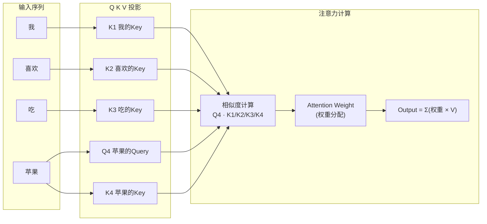

### 2.2 完整公式（用最简单的话讲）

自注意力的计算过程分三步：

**Step 1：每个 Token 生成三个向量 Q、K、V**

```
对于第 i 个 Token：
  Q_i = x_i × W_Q   （Query：我要查什么）
  K_i = x_i × W_K   （Key：我有什么信息）
  V_i = x_i × W_V   （Value：我的具体内容）
```

- **W_Q、W_K、W_V** 是训练好的**投影矩阵**——这就是参数记忆的一部分！
- 每个 Token 输入后，先乘上这三个矩阵，得到 Q/K/V 三个向量。

**Step 2：计算注意力权重（相关度）**

```
Attention(Q, K, V) = softmax( Q × K^T / √d_k ) × V
```

- `Q × K^T`：当前 Token 的 Q 和**所有** Token 的 K 做点积，得到相似度分数
- `/ √d_k`：缩放因子，防止点积太大导致 softmax 饱和
- `softmax`：把分数变成 0~1 之间、加起来等于 1 的权重
- `× V`：用权重对每个 Token 的 V 加权求和，得到输出

**Step 3：输出 = 加权融合所有 Token 的信息**

最终输出向量是**前面所有 Token 的 V 向量按注意力权重加权求和的结果**。

> 💡 **这就是 LLM 「记住上下文」的本质**：生成第 N 个 Token 时，输出里融合了前 N 个 Token 的信息，融合的权重由自注意力动态计算。这就是为什么 LLM 能「记住」前面说过的话——不是它真的「记」住了，而是每一步都把前面的信息重新加权融合了一遍。

### 2.3 多注意力头（Multi-Head Attention）

实际中不是只有一组 Q/K/V，而是有多组（比如 GPT-3 有 96 个头），每组关注不同的「角度」：

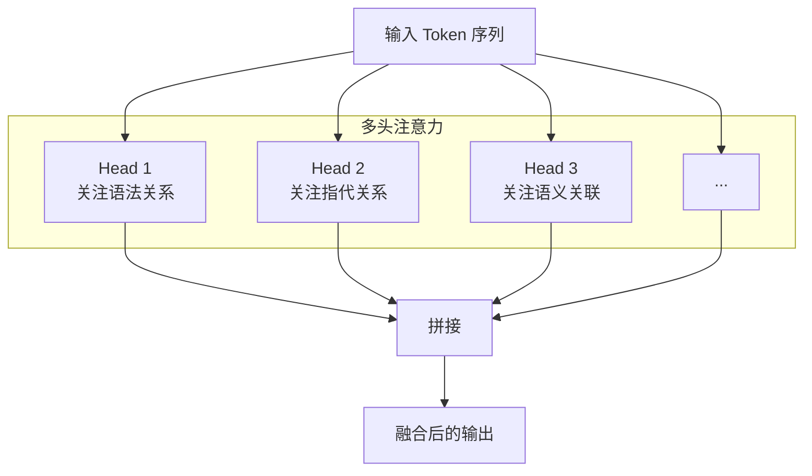

- 每个头有自己独立的 W_Q / W_K / W_V，学到不同的注意力模式。
- 最后把所有头的输出拼接起来，再过一个线性层，得到最终结果。
- **KV Cache 的总大小 = 层数 × 头数 × 序列长度 × 向量维度**——后面讲存储挑战时会用到。

---

## 三、LLM 记忆的存储与解析过程

### 3.1 朴素推理：没有 KV Cache 时是怎样的

假设我们有一句话：**「我喜欢吃苹果」**，要让 LLM 接下去生成。

```
输入：「我 喜欢 吃 苹果」
输出：「因为」（假设第一个生成的词是「因为」）
```

**没有 KV Cache 的朴素推理过程：**

| 步骤 | 输入 | 发生了什么 | 计算量 |
|------|------|-----------|--------|
| 1 | 「我」 | 计算「我」的 Q1/K1/V1，自注意力 | O(1²) |
| 2 | 「我 喜欢」 | 重新计算「我」和「喜欢」的 Q/K/V，自注意力 | O(2²) |
| 3 | 「我 喜欢 吃」 | 重新计算全部 3 个的 Q/K/V | O(3²) |
| 4 | 「我 喜欢 吃 苹果」 | 重新计算全部 4 个的 Q/K/V | O(4²) |
| 5 | 生成「因为」 | 重新计算全部 5 个的 Q/K/V | O(5²) |
| ... | ... | ... | ... |
| 第 N 步 | N 个 Token | 重新计算全部 N 个的 Q/K/V | O(N²) |

⚠️ **问题很明显**：每生成一个新 Token，前面所有 Token 的 K/V 都要**重新算一遍**——而它们其实从来没变过！每次算出来都是一模一样的。这是巨大的浪费。

总计算量是 O(N²)，当上下文窗口很大（比如 128K）时，这根本不可行。

### 3.2 有了 KV Cache 之后

**核心思想**：前面 Token 的 K 和 V 一旦算出来就不会变了，把它们**缓存**起来，下次直接用，不用重算。

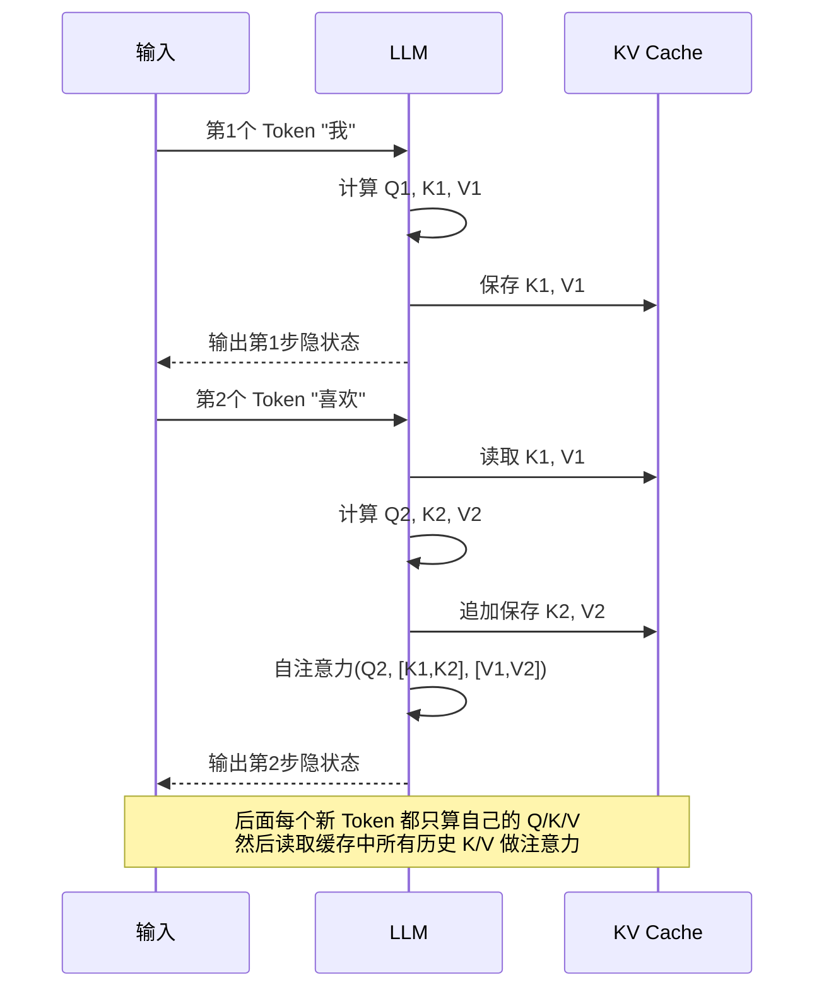

**有 KV Cache 的推理过程：**

| 步骤 | 需要重新计算的 | 直接从缓存读取的 | 每步计算量 |
|------|---------------|-----------------|-----------|
| 1 | Q1, K1, V1 | 无 | O(1) |
| 2 | Q2, K2, V2 | K1, V1 | O(2) （注意力是 O(N)，因为新 Q 对所有旧 K） |
| 3 | Q3, K3, V3 | K1,K2, V1,V2 | O(3) |
| ... | ... | ... | ... |
| 第 N 步 | Q_N, K_N, V_N | K1~K_{N-1}, V1~V_{N-1} | O(N) |

总计算量从 **O(N²) 降到 O(N)**——这就是为什么 KV Cache 是 LLM 推理的**基础标配**，没有它长上下文根本跑不动。

### 3.3 一个具体的数值例子（以 LLaMA-2 7B 为例）

让我们用真实的模型参数来算一算，建立直观感受。

**LLaMA-2 7B 的关键参数：**
- 层数 L = 32 层
- 注意力头数 n_head = 32 个
- 每个头的维度 head_dim = 128
- 隐藏层维度 = n_head × head_dim = 4096
- 每个 K/V 向量大小 = n_head × head_dim = 4096（其实是每层存 K 和 V 各一份）

**KV Cache 的大小公式：**
```
KV_Cache_Size = 2 × L × N × d_model × sizeof(dtype)

其中：
  2 = K 和 V 各一份
  L = 层数
  N = 序列长度（上下文 Token 数）
  d_model = 隐藏层维度（即 head_dim × n_heads）
  sizeof(dtype) = 每个元素的字节数（FP16=2, BF16=2, FP8=1, INT8=1, INT4=0.5）
```

**代入 LLaMA-2 7B + FP16 + 4096 上下文：**

```
KV_Cache_Size = 2 × 32 × 4096 × 4096 × 2 bytes
              = 2,147,483,648 bytes
              = 2 GB
```

也就是说，**LLaMA-2 7B 在 4K 上下文下，光 KV Cache 就要占 2GB 显存**。

如果上下文拉到 128K 呢？

```
KV_Cache_Size = 2 × 32 × 131072 × 4096 × 2 bytes
              = 68,719,476,736 bytes
              = 64 GB  ← 这就夸张了
```

> ⚠️ **这就是为什么长上下文推理这么吃显存**——模型权重本身只有 14GB（7B × 2 bytes FP16），但 128K 上下文的 KV Cache 就要 64GB，是权重的 4 倍多。**上下文越长，KV Cache 占显存的比例越高，甚至成为主要瓶颈。**

---

## 四、为什么必须有 KV Cache

### 4.1 三个层面的必要性

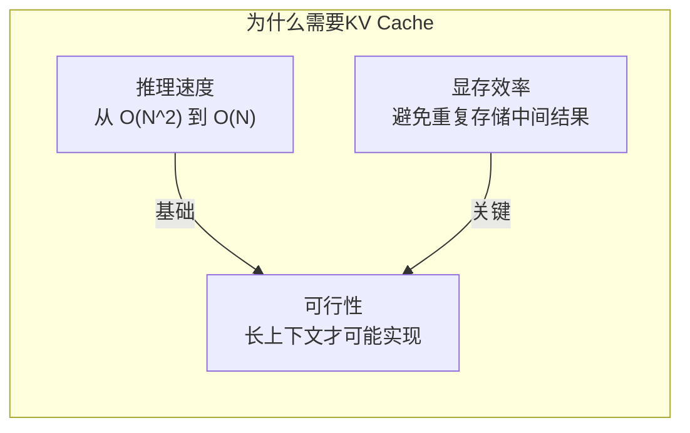

#### 4.1.1 推理速度：从不可用到可用

- 没有 KV Cache：每个新 Token 都要重算前面所有 Token 的 K/V，时间复杂度 O(N²)
- 有 KV Cache：只算新 Token 的 K/V，直接读旧的，时间复杂度 O(N)
- **差距**：128K 上下文下，朴素推理每步需要重算 128K 个 Token 的 K/V，有缓存只算 1 个——差了三个数量级。

#### 4.1.2 显存效率：空间换时间，但也省空间

- 虽然 KV Cache 本身占显存，但如果没有缓存，每步推理都要把所有 Token 的中间激活值保留在计算图里，**峰值显存可能更高**。
- KV Cache 是「有计划地存有用的」，而不是「全量保留中间结果」。

#### 4.1.3 长上下文的可行性基础

- 没有 KV Cache，128K / 1M 上下文的推理在工程上完全不可行。
- KV Cache 是所有长上下文优化技术（包括后面要讲的各种压缩/分页/分布式方案）的基础——那些优化都是在 KV Cache 之上做的。

### 4.2 KV Cache 为什么叫「激活记忆」

回到记忆的视角：

- **参数记忆**是训练时写好的、固定的、「死」的知识。
- **激活记忆（KV Cache）**是推理时动态产生的、实时更新的、「活」的当前上下文。

每来一个新 Token，KV Cache 就**追加**一对新的 K/V——这就是 LLM 「记住新信息」的方式。所有「前面说过的话」，都以 KV 向量的形式存在缓存里，等着自注意力去「回忆」。

> 💡 **面试金句**：LLM 的「上下文记忆」本质上不是它真的「记住了」，而是每一步生成时，自注意力机制都会去 KV Cache 里把前面所有 Token 的 Key/Value 读出来做加权融合——**所谓记忆，就是随时能被重新读取的激活状态。**

---

## 五、KV Cache 带来的存储挑战 ★

> KV Cache 虽然解决了计算问题，但带来了新的问题：**它太占显存了**。
> 随着上下文窗口从 4K → 32K → 128K → 1M，KV Cache 成了推理系统的主要显存瓶颈。

### 5.1 挑战全景

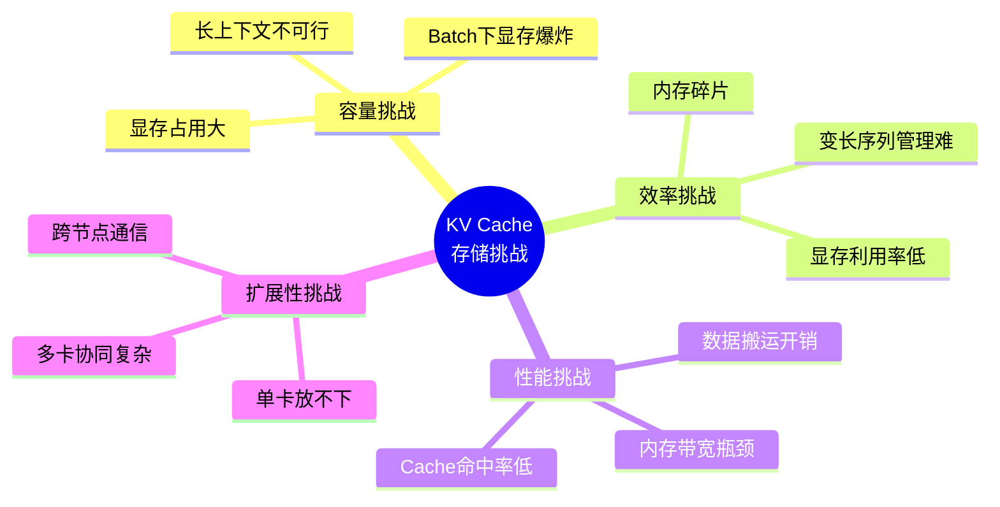

### 5.2 挑战一：显存占用过大

这是最直观的挑战。我们用一张表来感受不同模型、不同上下文长度下 KV Cache 的规模（FP16）：

| 模型 | 参数量 | 层数 | 隐藏维度 | 4K 上下文 | 32K 上下文 | 128K 上下文 | 1M 上下文 |
|------|--------|------|---------|-----------|------------|-------------|-----------|
| LLaMA-2 7B | 7B | 32 | 4096 | 2 GB | 16 GB | 64 GB | **512 GB** |
| LLaMA-2 13B | 13B | 40 | 5120 | 3.2 GB | 25.6 GB | 102 GB | **819 GB** |
| LLaMA-2 70B | 70B | 80 | 8192 | 16 GB | 128 GB | **512 GB** | **4 TB** |
| GPT-3 级别 | 175B | 96 | 12288 | 36 GB | 288 GB | **1.15 TB** | **9 TB** |

> 🔴 **恐怖的事实**：175B 模型 + 1M 上下文的 KV Cache，理论上需要 **9 TB 显存**——这还只是一条序列！如果同时服务 10 个用户呢？90 TB？这显然不可能。

再加上**批量推理（Batch Inference）**的维度：假设同时服务 batch_size = 32 个用户，KV Cache 显存需求还要 × 32。

### 5.3 挑战二：内存碎片与低利用率

实际部署中，KV Cache 的管理比想象中复杂：

- **序列长度不一**：有的用户只问一句话（几十个 Token），有的用户写篇长文（几千 Token）。如果给每个用户都分配最大上下文的空间，大部分都浪费了。
- **动态增长**：对话是逐步变长的，KV Cache 需要动态扩容。如果管理不好，会产生大量内存碎片。
- **提前终止**：有的对话提前结束，释放的空间如果不规整，很难被新对话利用。

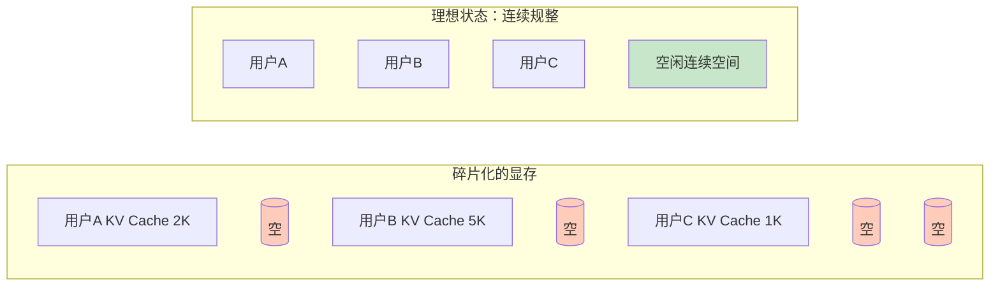

显存碎片的后果：**明明总剩余显存够，但没有连续的大块空间，放不下新的 KV Cache——就像磁盘碎片一样。**

### 5.4 挑战三：内存带宽瓶颈

KV Cache 不仅是存储问题，也是**带宽问题**。

每生成一个 Token，都要把**整个 KV Cache**读一遍（因为自注意力要访问所有历史 K/V）。

以 LLaMA-2 7B + 128K 上下文为例：
- 每步要读取 64 GB 的 KV 数据
- A100 显存带宽约 2 TB/s
- 光是读 KV Cache 就要花 **64 / 2048 ≈ 31 ms**
- 再加上计算时间，每生成一个 Token 要几十毫秒——这就是长上下文推理慢的重要原因。

> 💡 **关键洞察**：当上下文很长时，**内存带宽而不是计算成为瓶颈**。GPU 的计算单元（Tensor Core）大部分时间在等数据从显存过来——这叫「内存受限（Memory-Bound）」。

### 5.5 挑战四：分布式部署的复杂度

当单卡放不下 KV Cache 时，就要用多张卡甚至多台机器。这带来新的问题：

- **切分策略**：KV Cache 按什么维度切分到多张卡？按层切？按头切？按序列切？
- **通信开销**：自注意力需要跨卡的 K/V 数据，卡之间要通信——NVLink 还好，跨节点走网络就慢了。
- **负载均衡**：不同序列长度不同，怎么分配才能让各卡显存占用均衡？
- **容错**：一张卡挂了，整个 KV Cache 会不会全丢？

---

## 六、架构优化：单机部署方案 ★

> 面对 KV Cache 的存储挑战，工业界发展出了一系列优化技术。先看单卡/单机场景。

### 6.1 优化技术全景图

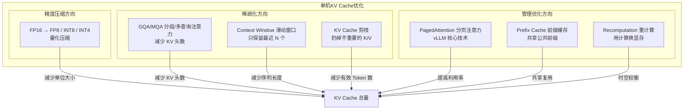

### 6.2 精度压缩：量化

**思路**：把 KV Cache 的数据精度降下来，比如从 FP16（2 字节）降到 INT8（1 字节）甚至 INT4（0.5 字节），直接把显存占用砍半甚至砍到 1/4。

| 量化方式 | 每个元素大小 | 显存节省 | 精度损失 | 适用场景 |
|---------|-------------|---------|---------|---------|
| FP16 / BF16 | 2 bytes | 0% | 几乎无 | 所有场景（默认） |
| FP8 | 1 byte | 50% | 很小 | 大多数场景（主流方向） |
| INT8 | 1 byte | 50% | 较小 | 对精度要求不高的场景 |
| INT4 | 0.5 bytes | 75% | 较明显 | 极致显存压缩 |

**技术要点**：
- **FP8** 是目前的主流方向（NVIDIA H100 原生支持 FP8 算力），精度损失极小，显存直接减半。
- **INT8 量化**需要考虑量化误差的累积——长上下文下误差可能逐层放大。
- 量化不仅省显存，还能提升有效内存带宽（同样带宽下，数据读得更快了）。

### 6.3 GQA / MQA：减少 KV 头数

**思路**：多头注意力中，每个头都有自己独立的 K/V——但其实不需要那么多。能不能让多个 Q 头共享同一组 K/V？

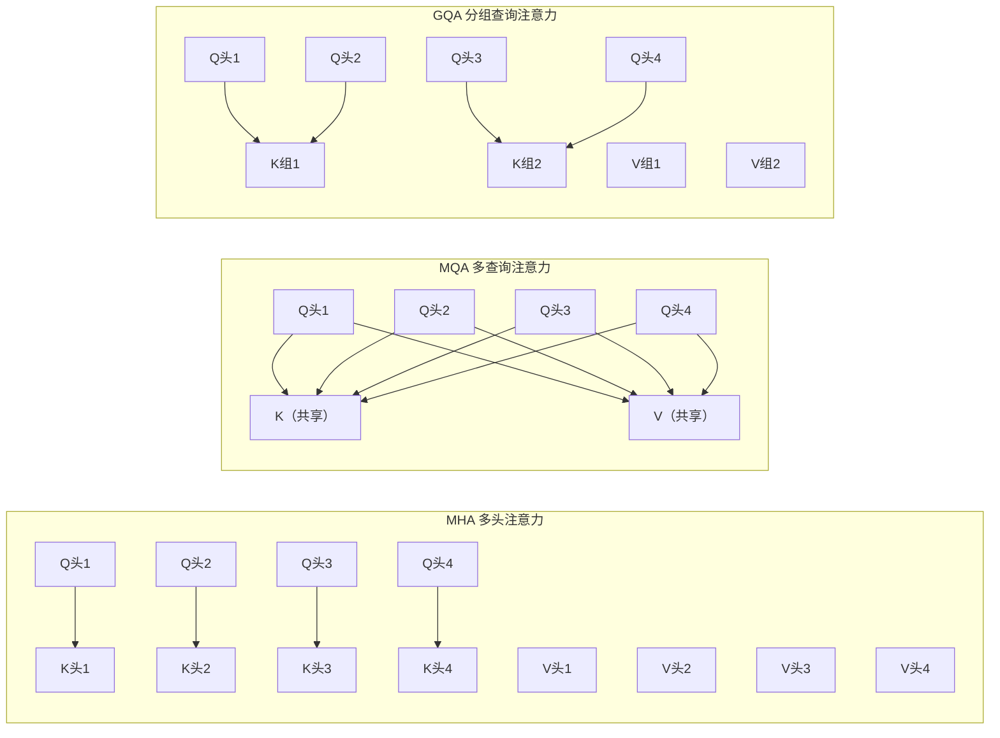

| 方案 | KV 头数 | 显存 | 效果 | 代表模型 |
|------|---------|------|------|---------|
| **MHA**（标准多头） | 同 Q 头数（如 32） | 100% | 效果最好 | GPT-3、LLaMA-1 |
| **GQA**（分组查询） | 分组数（如 8 组 = 每 4 个 Q 头共享一组 KV） | 25% | 效果接近 MHA | LLaMA-2、GPT-3.5 |
| **MQA**（多查询） | 1 组（所有 Q 头共享） | ~3% | 效果略有下降 | PaLM、StarCoder |

> 💡 **LLaMA-2 的选择**：从 LLaMA-1 的 MHA 改成了 GQA（8 组），KV Cache 显存直接降到原来的 1/4，效果几乎没降——这是一个非常划算的 trade-off。

### 6.4 PagedAttention：分页注意力（vLLM 核心创新）

**思路**：借鉴操作系统的**虚拟内存 + 分页**思想，把 KV Cache 分成固定大小的「页（Block/Page）」，不要求连续存储。

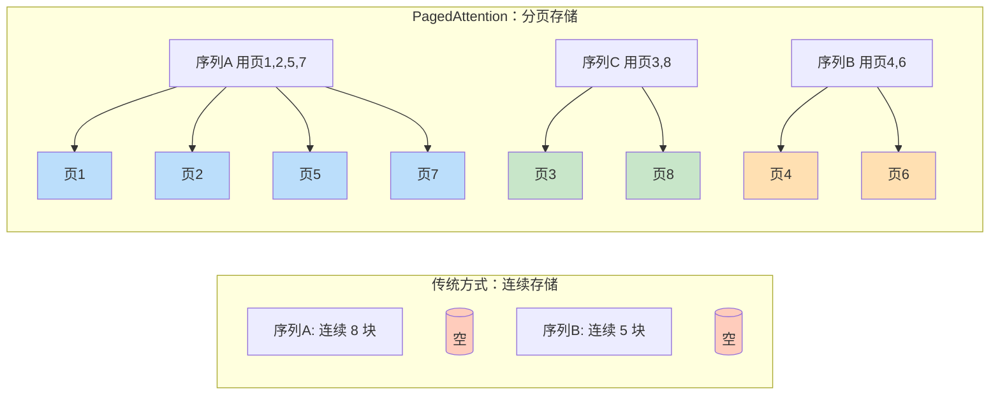

**PagedAttention 的核心优势：**

| 优势 | 说明 |
|------|------|
| **几乎零碎片** | 页是固定大小的，释放后可被任意序列复用，不会有外部碎片 |
| **显存利用率高** | 内部碎片只有最后一页的尾部（页大小 16  Token 的话，平均浪费 8 个 Token = 0.5%） |
| **动态扩缩容** | 序列变长时申请新页挂上就行，不需要整块连续空间 |
| **灵活共享** | 多序列可以共享某些页（比如相同的系统提示前缀），通过页表指向同一物理页 |
| **更高并发** | 显存利用率从 ~40% 提升到 ~95%，同样的显存能同时服务更多用户 |

> 🔑 **vLLM 为什么快**：核心就是 PagedAttention + 连续批处理（Continuous Batching）。PagedAttention 解决了 KV Cache 的管理问题，让连续批处理成为可能——用户来了就加进去，用户走了就释放页，不用等整个 batch 都完成。

### 6.5 Prefix Cache：前缀缓存

**思路**：很多请求有相同的前缀（比如系统提示词、Few-shot 示例、RAG 检索到的文档），这些相同部分的 KV Cache 可以**共享**，不用每个请求都存一份。

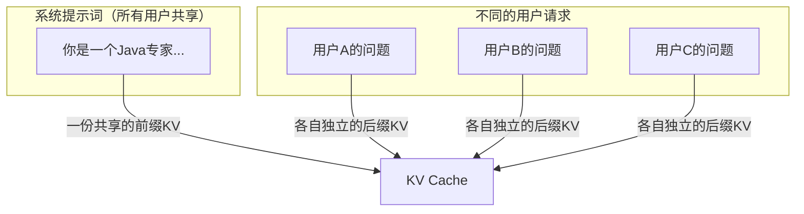

**典型场景**：
- **系统提示词**：所有对话都有同一段 System Prompt，它的 KV Cache 只需要算一次、存一份。
- **Few-shot 示例**：相同的示例给所有用户用。
- **RAG 文档**：同一个知识库文档被多个用户查询时，文档部分的 KV 可以共享。
- **多轮对话中的历史**：同一个用户的多轮对话，历史部分的 KV 不用每次重算。

**效果**：如果公共前缀占总长度的 50%，那 KV Cache 总显存就省了将近一半（乘以并发数的话更可观）。

### 6.6 滑动窗口 / 上下文裁剪

**思路**：不是所有历史 Token 都同等重要，越远的相关性越低。干脆只保留最近的 N 个 Token，更远的丢掉。

| 方案 | 做法 | 优点 | 缺点 |
|------|------|------|------|
| **固定滑动窗口** | 只保留最近 K 个 Token | 简单、显存固定 | 会丢重要的早期信息 |
| **重要性保留** | 保留重要的 Token（如问题、关键事实），其余裁剪 | 保留关键信息 | 需要判断什么是「重要」 |
| **渐进式压缩** | 越远的内容压缩得越厉害（摘要化） | 兼顾容量和信息密度 | 实现复杂 |

代表模型：**Mistral** 使用了滑动窗口注意力（Sliding Window Attention），窗口大小 4096，但总上下文可以做到 32K——窗口内是精确注意力，窗口外靠其他机制补充。

### 6.7 重计算（Recomputation）

**思路**：显存不够用时，干脆不存那么多 KV Cache，需要的时候再重新计算。用计算换显存。

- 这和训练时的「梯度检查点（Gradient Checkpointing）」思路一样——不存中间激活，需要时重算。
- 在推理场景用得较少，因为推理对延迟敏感，但在**极端长上下文 + 显存极度受限**的场景下会用到。

---

## 七、架构优化：分布式部署方案 ★

> 当单卡甚至单机都放不下 KV Cache 时（比如 70B 模型 + 128K 上下文），就要上分布式了。

### 7.1 分布式 KV Cache 的核心问题

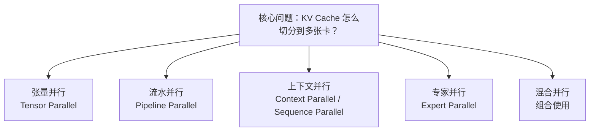

### 7.2 方案一：张量并行（Tensor Parallelism）

**思路**：把每层的 K/V 矩阵按「头」的维度切分到多张卡上。每张卡存一部分头的 KV Cache。

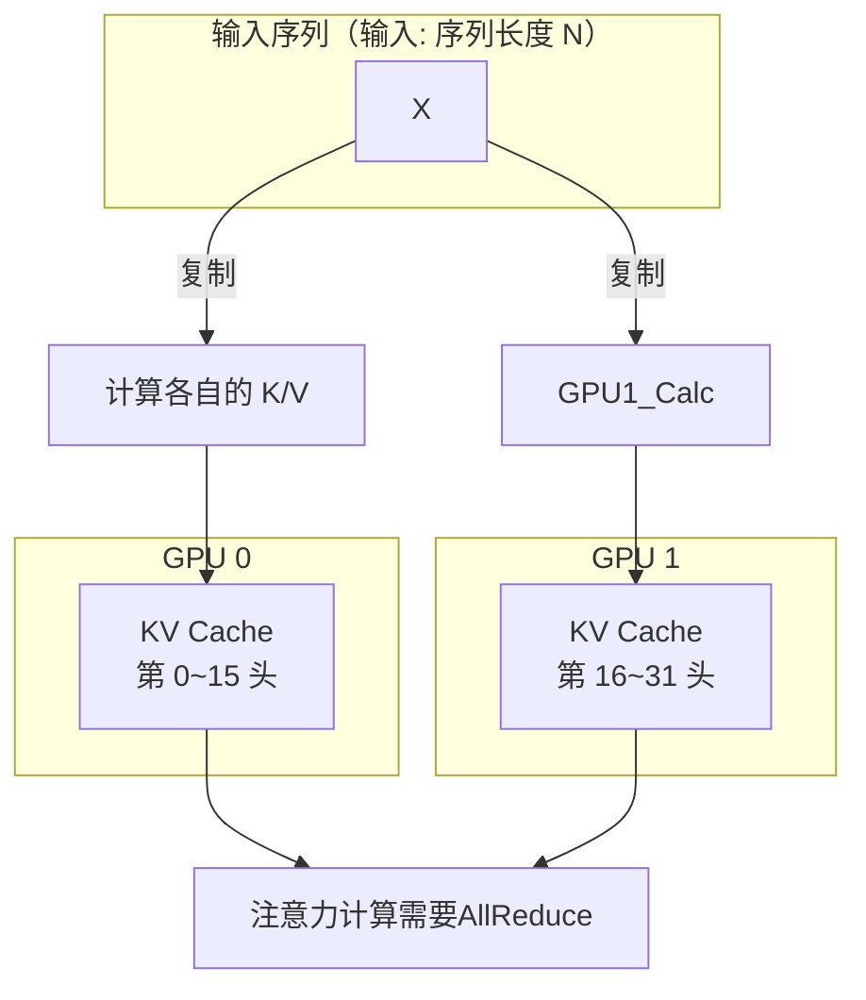

**特点**：
- **切分维度**：按注意力头的维度切（head 维度）
- **通信**：每一步注意力都需要 AllReduce 来汇总各卡的结果
- **显存效果**：KV Cache 显存线性降低（8 卡就是 1/8）
- **缺点**：卡之间通信量大，需要高速互联（NVLink），跨节点不行
- **适用**：单节点内多卡（如 8 卡 A100）

### 7.3 方案二：流水并行（Pipeline Parallelism）

**思路**：按「层」的维度切分——第 0~15 层在 GPU 0，第 16~31 层在 GPU 1，以此类推。每张卡存对应层的 KV Cache。

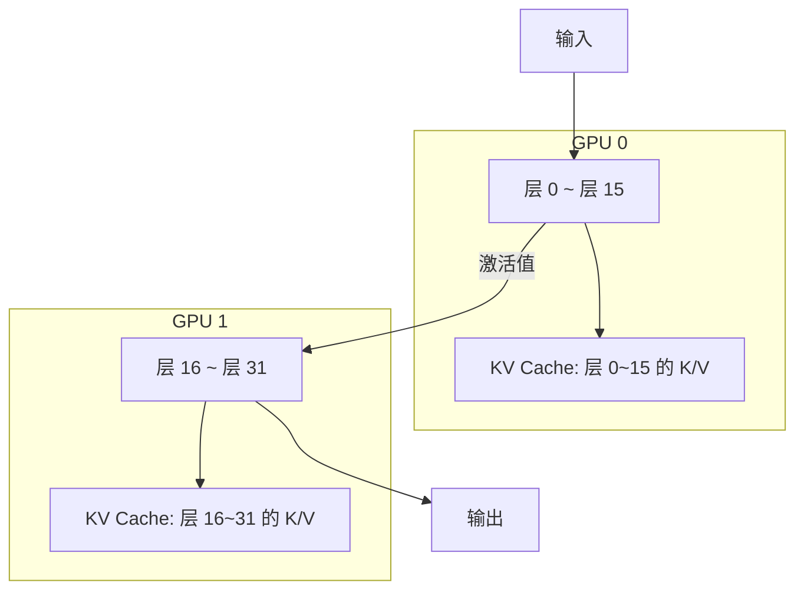

**特点**：
- **切分维度**：按层（layer 维度）
- **通信**：只有相邻层之间传递激活值，通信量较小
- **显存效果**：KV Cache 显存按层数比例降低
- **缺点**：有「流水线气泡」（各卡不同时满负载），需要微批次（micro-batch）填充
- **适用**：模型很大（70B+）、层数很多的场景

> 实际生产中，**张量并行 + 流水并行通常组合使用**（TP + PP），这也是 Megatron-LM 等框架的标准做法。

### 7.4 方案三：上下文并行（Context Parallelism / Sequence Parallelism）

**思路**：按「序列长度」的维度切分——每张卡只存一部分 Token 的 KV Cache。这是长上下文场景下最直接的优化。

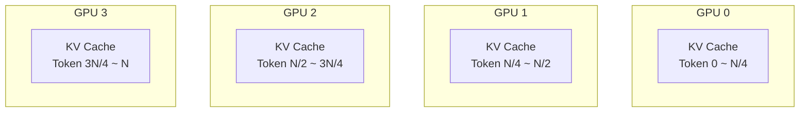

**核心挑战**：自注意力需要「每个 Token 都能看到所有历史 Token」——但如果 KV 被切到不同卡上，每张卡只有一部分 KV，怎么办？

答案是需要**通信**：
- **Ring Attention**：用 Ring All-Reduce 的思路，每张卡把自己的 KV 沿着环传下去，每张卡逐步计算，完成整个注意力。
- **DeepSpeed-Ulysses**：另一种序列并行实现，在序列维度做 All-to-All 通信。

| 方案 | 切分方式 | 通信模式 | 适用场景 |
|------|---------|---------|---------|
| **Ring Attention** | 沿序列切分 | Ring 传递 KV | 超长上下文（1M+） |
| **DeepSpeed-Ulysses** | 沿序列切分 | All-to-All | 中等长度序列 |
| **FlashAttention-2 + SP** | 结合计算优化 | 按需通信 | 通用长上下文 |

**效果**：
- 4 卡上下文并行 → KV Cache 显存降为 1/4（每张卡只存 1/4 序列的 KV）
- 理论上可以支持**任意长的上下文**——只要加足够多的卡（实际受限于通信开销）

> 🔥 **前沿方向**：上下文并行是 2024-2025 年长上下文推理的热门方向。Blockwise Parallel Transformer、Ring Attention、DeepSpeed-Ulysses 等技术，让 1M 甚至更长的上下文推理成为可能。

### 7.5 方案四：专家并行 + KV 卸载（MoE & Offloading）

**MoE（混合专家模型）** 本身不是 KV Cache 优化，但它间接缓解了问题：
- MoE 模型虽然总参数量大，但每次推理只激活一小部分专家（如 8/56）。
- 激活的专家少，需要的 KV Cache 层数/维度也少。

**KV Offloading（KV 卸载）**：
- 把不常用的 KV Cache 从显存搬到 CPU 内存甚至磁盘上。
- 需要的时候再加载回显存。
- 典型策略：滑动窗口内的 KV 放显存，窗口外的卸载到 CPU。
- 优点是显存省很多，缺点是加载延迟高——适合对延迟不敏感的离线场景。

### 7.6 分布式部署的选型指南

```mermaid
graph LR
    A[长上下文 KV Cache 不够放？] --> B{模型大小?}
    B -->|小模型(7B)| C[量化 + PagedAttention<br/>基本够用]
    B -->|中模型(13-34B)| D[量化 + GQA + 张量并行]
    B -->|大模型(70B+)| E{上下文长度?}
    E -->|32K以内| F[TP + PP 混合并行]
    E -->|128K+| G[上下文并行<br/>Ring Attention / DeepSpeed Ulysses]
    E -->|1M+| H[上下文并行 + 卸载 + 重计算<br/>多级存储架构]
```

| 场景 | 推荐方案 | 典型配置 |
|------|---------|---------|
| 7B + 4K | PagedAttention + FP8 | 单卡即可 |
| 7B + 128K | PagedAttention + FP8 + 滑动窗口 | 1-2 卡 |
| 70B + 32K | 张量并行(TP=8) + 流水并行(PP=2) | 16 卡 A100 |
| 70B + 128K | TP + PP + 上下文并行 | 32+ 卡 |
| 超长上下文(1M+) | Ring Attention + 多级存储 | 多节点集群 |

---

## 八、本章核心面试要点

### 8.1 LLM 两种记忆对比

| 维度 | 参数记忆 | 激活记忆（KV Cache） |
|------|---------|---------------------|
| 载体 | 模型权重 | 中间激活值 |
| 写入时机 | 训练阶段 | 推理阶段动态追加 |
| 可修改性 | 推理只读 | 可读写（追加） |
| 容量 | 固定（参数量决定） | 动态（直到上下文上限） |
| 认知类比 | 长期记忆/常识 | 工作记忆/当前上下文 |

### 8.2 KV Cache 的本质

> KV Cache 是 LLM 推理的基础优化：把前面 Token 已经算好的 K/V 缓存起来，避免每步重算——把时间复杂度从 O(N²) 降到 O(N)。没有它，长上下文推理根本不可行。

### 8.3 KV Cache 大小计算

```
KV_Cache_Size = 2 × L × N × d_model × sizeof(dtype)
  2 = K 和 V 各一份
  L = 层数
  N = 序列长度
  d_model = 隐藏层维度
```

例子：LLaMA-2 7B + 128K + FP16 = 2 × 32 × 131072 × 4096 × 2 ≈ 64 GB

### 8.4 单机优化技术速记

| 技术 | 核心思想 | 效果 |
|------|---------|------|
| 量化（FP8/INT8） | 降低每个元素的字节数 | 显存 ×1/2 ~ ×1/4 |
| GQA/MQA | 减少 KV 头数 | 显存 ×1/4 ~ ×1/32 |
| PagedAttention | 分页管理，消除碎片 | 利用率 40% → 95%+ |
| Prefix Cache | 共享公共前缀 KV | 前缀部分省 N 倍 |
| 滑动窗口 | 只保留最近的 Token | 显存固定 |

### 8.5 分布式优化技术速记

| 技术 | 切分维度 | 显存效果 | 通信 |
|------|---------|---------|------|
| 张量并行（TP） | 按注意力头 | 线性降低 | 大（每步 AllReduce） |
| 流水并行（PP） | 按层 | 按层数比例降 | 较小（层间） |
| 上下文并行（CP） | 按序列长度 | 线性降低 | 大（注意力需要全局 KV） |

### 8.6 高频面试题速答

**Q1：LLM 的「上下文记忆」到底是什么？它是怎么记住前面说过的话的？**

> LLM 的上下文记忆本质是 **KV Cache**——每来一个 Token，就计算出它的 Key 和 Value 向量，缓存起来。生成下一个 Token 时，自注意力机制会把当前 Token 的 Query 和所有历史 Key 做匹配，算出注意力权重，然后用权重把所有历史 Value 加权求和——这就是「回忆」的过程。所以 LLM 不是真的「记住了」，而是每一步都把前面的信息拿出来重新融合一遍。

**Q2：为什么长上下文推理那么吃显存？**

> 主要是 KV Cache 随上下文长度线性增长。比如 70B 模型跑 128K 上下文，KV Cache 就要 512GB（FP16），是模型权重的好几倍。上下文越长，KV Cache 占显存的比例越高，甚至成为主要瓶颈。再加上批量推理要乘以 batch size，显存需求爆炸。

**Q3：PagedAttention 是什么？它为什么能提升显存利用率？**

> PagedAttention 是 vLLM 的核心技术，借鉴操作系统的虚拟内存分页思想：把 KV Cache 分成固定大小的页（Block），通过页表逻辑上连续、物理上不连续。好处是：① 几乎消除外部碎片（固定大小的页可以任意复用）；② 显存利用率从 40% 左右提升到 95% 以上；③ 支持动态扩缩容和灵活共享。同样的显存能服务更多并发用户。

**Q4：张量并行和上下文并行有什么区别？**

> 都是分布式 KV Cache 方案，但切分维度不同：
> - **张量并行**按「注意力头」切分——每张卡存一部分头的 KV。好处是计算也能并行，缺点是每步注意力需要 AllReduce 通信，对带宽要求高。
> - **上下文并行**按「序列长度」切分——每张卡存一部分 Token 的 KV。好处是对长上下文特别有效，缺点是自注意力需要跨卡获取 KV，通信模式更复杂（如 Ring Attention）。
> 实际中常常组合使用：张量并行 + 流水并行 + 上下文并行。

---

## 资料勘误与重点提醒

> ⚠️ 以下是容易混淆或经常讲错的点：

1. **「KV Cache 是一个缓存，可有可无」** —— 错。KV Cache 不是「锦上添花」的优化，而是**长上下文推理的必要条件**。没有它，每步 O(N²) 的计算量会让 128K 上下文的推理慢到不可用。它是「地基」级别的技术。

2. **「KV Cache 越大越好」** —— 错。KV Cache 大 = 上下文长，但长上下文不代表效果好。有研究表明，上下文窗口开到一定程度后，有效信息增益递减，而且中间内容容易被忽略（Lost in the Middle）。更重要的是上下文**质量**和**管理策略**，而不是单纯堆长度。

3. **「量化 KV Cache 不会影响效果」** —— 不一定。FP8 通常影响很小，但 INT4 可能有明显精度损失，而且长上下文下误差会逐层累积。关键任务场景下要做精度验证，不能盲目上 INT4。

4. **「PagedAttention 是免费的优化」** —— 不是完全免费。分页管理有少量开销（页表查找、页分配），而且如果页大小设得不好，内部碎片也会浪费显存（页太小→管理开销大；页太大→内部碎片多）。通常页大小取 16~64 个 Token 是比较均衡的选择。

5. **「上下文并行可以无限扩展上下文长度」** —— 理论上可以，但实际受限于通信开销。卡越多，通信占比越高，加速比会递减。而且超长上下文不仅是存储问题，还有注意力计算本身的 O(N²) 问题（虽然 KV Cache 把推理每步降到了 O(N)，但 Prefill 阶段仍然是 O(N²)）。1M 上下文的 Prefill 本身就很慢。

6. **数值例子的参数假设** —— 本章中的 KV Cache 计算公式和数值例子基于标准 Transformer 解码器架构（LLaMA 风格）。不同模型的具体参数（层数、隐藏维度、头数、是否用 GQA/MQA）不同，实际数值会有差异，但公式的形式是通用的。面试时可以用这个公式来推导和估算，展现你的工程思维。
