# AI 记忆机制全景解析（三）：Agent 记忆原理与工程实践

> 第二章讲了 LLM 内核层的记忆——参数记忆和 KV Cache。
> 本章上移一层，讲 **Agent 系统层的记忆**：Agent 为什么需要记忆、记忆怎么分类、以及在工程上怎么正确设计和使用记忆机制。

---

## 一、Agent 为什么需要记忆

### 1.1 原生 LLM 的三个根本局限

原生 LLM（没有记忆系统加持的纯 LLM）有三个和「记忆」相关的根本缺陷：

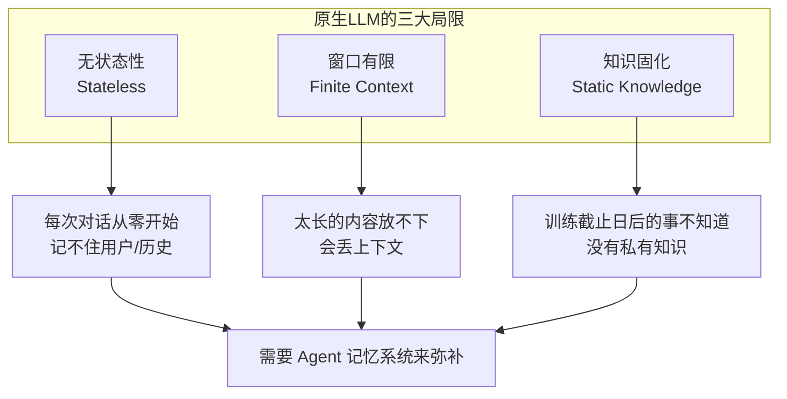

| 局限 | 表现 | Agent 记忆的解法 |
|------|------|-----------------|
| **无状态性** | 每次调用都是独立的，模型不知道「你是谁」「之前聊过什么」 | 跨会话持久化记忆，下次对话自动加载 |
| **窗口有限** | 上下文再大也有上限，内容多了会被截断或压缩 | 外部记忆库 + 按需检索，只把相关的注入上下文 |
| **知识固化** | 参数里的知识是训练时的，不懂你的业务、你的项目、你的偏好 | 注入私有知识、用户画像、项目上下文 |

### 1.2 Agent 记忆的核心价值

**价值一：个性化——让 AI 「懂你」**

> 同样一个问题，对新手讲要深入浅出，对专家讲可以直接上公式。没有记忆的 AI 每次都要你重新交代背景；有记忆的 AI 知道你的水平、偏好、习惯，给出的回答自然更精准。

**价值二：连续性——让对话「有下文」**

> 第一天讨论了方案 A，第二天接着聊时，AI 记得昨天的结论和遗留问题，不用你从头复述。这是「助手」和「工具」的核心区别。

**价值三：积累性——让 Agent 「越用越好用」**

> 每一次交互都是一次学习机会：你纠正了它的错误、补充了新的知识、确认了某个偏好——这些都可以沉淀为记忆，下次直接用。用得越久，匹配度越高。

### 1.3 记忆 ≠ 对话历史

很多人以为「Agent 记忆 = 保存所有对话历史」，这是最常见的误区。

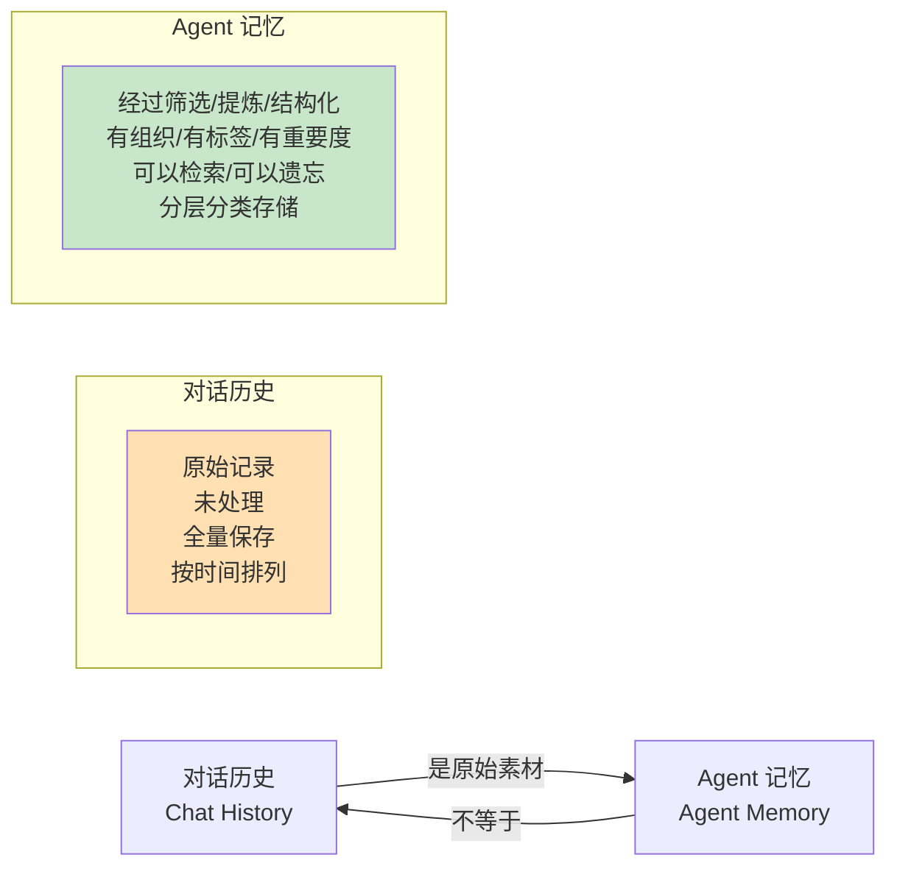

| 维度 | 对话历史 | Agent 记忆 |
|------|---------|-----------|
| **内容** | 用户和 AI 的全部原始对话 | 经过筛选、提取、提炼后的有用信息 |
| **结构** | 纯时序流水账 | 分层分类、有标签、有元数据 |
| **用途** | 追溯、审计 | 支撑 Agent 的推理和决策 |
| **容量观** | 能存多少存多少（日志思维） | 质量比数量重要（认知思维） |
| **处理方式** | 直接存储 | 写入时加工、检索时筛选、定期反思 |

> 💡 **关键洞察**：对话历史是记忆的**原料**之一，但不是记忆本身。好的记忆系统会从对话历史中「提炼」出有价值的信息，结构化存储，而不是把所有聊天记录一股脑儿塞进去。这就像人不会记住每一次对话的每一句话，但会记住重要的信息和结论。

---

## 二、Agent 记忆的分类体系

### 2.1 经典四分类（认知科学视角）

借鉴认知心理学的记忆分类，Agent 记忆通常分为四类：

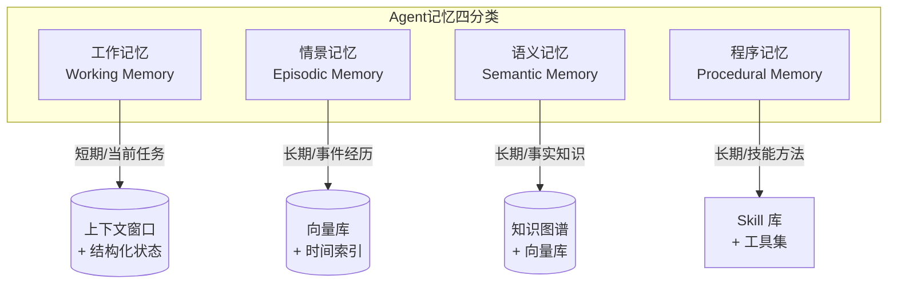

#### 2.1.1 工作记忆（Working Memory）

- **是什么**：Agent 当前正在处理的任务的上下文信息。
- **包含**：当前的对话历史、任务目标、中间变量、待办事项、工具调用结果。
- **载体**：LLM 上下文窗口 + Agent 框架维护的结构化状态（如 LangGraph 的 State）。
- **特点**：
  - 容量有限（受上下文窗口限制）。
  - 读写最快（直接参与推理）。
  - 随任务结束而清空（或归档到长期记忆）。
- **类比**：你现在脑子里正在想的事。

#### 2.1.2 情景记忆（Episodic Memory）

- **是什么**：Agent 经历过的具体「事件」——某段对话、某次任务执行、某个交互场景。
- **包含**：对话片段、任务执行记录、成功/失败的经验、时间戳和场景标签。
- **载体**：向量数据库（按语义检索）+ 时间索引（按时序回溯）。
- **特点**：
  - 有时序性和场景性：「什么时候、什么情况下发生了什么」。
  - 通常是原始素材，需要检索和提炼才能发挥作用。
  - 数量大、噪声多。
- **类比**：你记得「上周三开会时，张三提出了方案 B，大家讨论后觉得可行」。

#### 2.1.3 语义记忆（Semantic Memory）

- **是什么**：Agent 「知道」的事实、知识、规律、偏好——不记得具体是哪次经历中学到的，但「就是知道」。
- **包含**：用户偏好、业务规则、领域知识、抽象规律、事实断言。
- **载体**：知识图谱（结构化关系）、向量库（非结构化文本）、KV 存储（键值对）。
- **特点**：
  - 结构化程度高，查询精确。
  - 从情景记忆中提炼、抽象而来（通过反思/归纳机制）。
  - 相对稳定，更新频率低。
- **类比**：你知道「北京是中国首都」「Java 是编译型语言」——你不记得具体哪天学到的，但你就是知道。

#### 2.1.4 程序记忆（Procedural Memory）

- **是什么**：Agent 「会做」的事——技能、流程、方法、操作步骤。
- **包含**：工具使用方法、任务执行流程、Prompt 模板、最佳实践、操作规范。
- **载体**：Skill 库、工具集、Prompt 模板库、工作流定义。
- **特点**：
  - 通常是「隐式」的：知道怎么做，但不一定能说清楚原理。
  - 通过反复练习（执行任务）习得和精进。
  - 复用性最高：同一个 Skill 可以在很多场景下用。
- **类比**：你会骑自行车、会用键盘打字——你不需要每次都想怎么操作，手自动就会了。

### 2.2 工程视角的另一种分类

从工程实现的角度，记忆也可以按「存储形态」和「读写模式」来分：

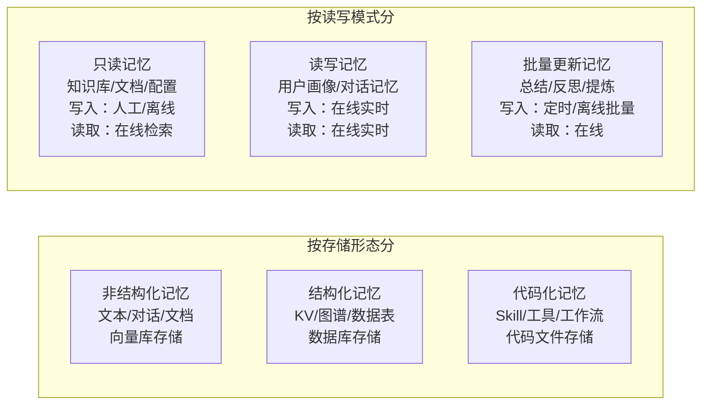

### 2.3 两类分类的对应关系

| 认知科学分类 | 工程实现分类 | 典型存储 |
|-------------|-------------|---------|
| 工作记忆 | 结构化 + 读写 + 实时 | 上下文窗口 + 内存 State |
| 情景记忆 | 非结构化 + 读写 + 近实时 | 向量库 + 时间索引 |
| 语义记忆 | 结构化 + 批量更新 | 知识图谱 / KV / 向量库 |
| 程序记忆 | 代码化 + 只读（或低频更新） | Skill 库 / 工具定义文件 |

---

## 三、Agent 记忆的分层架构 ★

> 单层记忆不够用，工业级 Agent 通常采用**多层记忆架构**——不同层次的记忆有不同的容量、速度、用途。

### 3.1 五层记忆金字塔

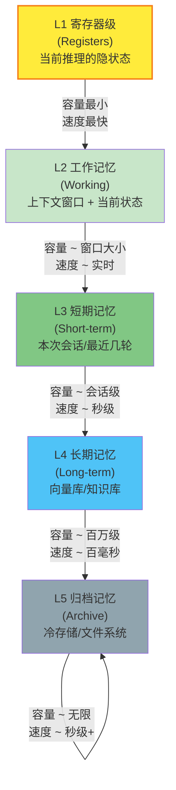

| 层级 | 名称 | 容量 | 访问延迟 | 存储介质 | 典型内容 |
|------|------|------|---------|---------|---------|
| **L1** | 寄存器级 | 极小（当前 Token） | 纳秒级 | GPU 显存 / 寄存器 | 当前 Token 的隐状态、KV |
| **L2** | 工作记忆 | 几千到几万 Token | 实时 | 上下文窗口 + 内存 | 当前对话、任务状态、工具结果 |
| **L3** | 短期记忆 | 几十万到几百万 Token | 秒级 | Redis / 本地文件 / 内存 | 本次会话历史、最近几轮对话 |
| **L4** | 长期记忆 | 百万到亿级 Token | 百毫秒级 | 向量库 / 知识图谱 / 数据库 | 用户偏好、历史经验、知识库 |
| **L5** | 归档记忆 | 理论无限 | 秒级以上 | 对象存储 / 冷存储 / 文件 | 历史日志、不常用的旧记忆 |

> 🔑 **核心思想**：和 CPU 缓存架构（寄存器 → L1 → L2 → L3 → 内存 → 磁盘）的设计哲学完全一致——**越常用的放越快的存储，越不常用的放越大容量的存储，层级之间按需调度。**

### 3.2 记忆在各层之间的流动

记忆不是固定在某一层的，而是会**流动**：

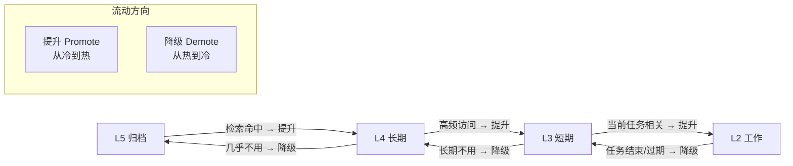

**提升（Promotion）**：
- 当一条长期记忆被频繁检索、反复出现在上下文中，说明它很重要，可以提升到更热的层级。
- 比如某个用户偏好在多次对话中被用到，就可以从长期记忆提升到短期记忆，下次直接加载。

**降级（Demotion）**：
- 当一条记忆长期不用、或者已经过时，就降级到更冷的层级，甚至删除。
- 比如某个项目完成后，相关的工作记忆可以归档到长期记忆，腾出空间给新任务。

> 💡 **这就是 LRU（Least Recently Used）缓存策略的思路**——只不过从单一缓存扩展到了多层记忆体系。

---

## 四、记忆的路径加载机制 ★

> 记忆不是全量加载的——那会撑爆上下文窗口。Agent 需要根据「当前场景」按需加载相关记忆。
> 「路径加载」就是一种结构化的按需加载策略。

### 4.1 什么是路径加载

不是所有记忆都放在一个大池子里随机捞，而是**按「路径」组织，按路径加载**。

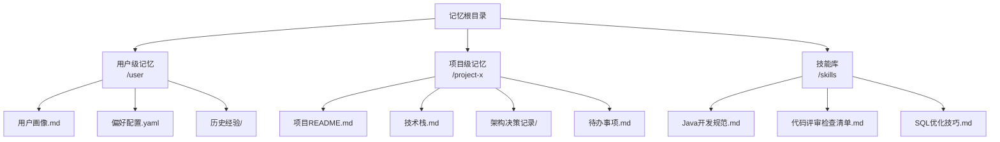

### 4.2 为什么需要路径加载

| 问题 | 路径加载的解法 |
|------|---------------|
| **记忆太多，全加载塞不下** | 只加载当前路径下的记忆，数量可控 |
| **检索不准，噪声大** | 路径本身就是强过滤，缩小搜索范围 |
| **记忆组织混乱** | 目录结构天然提供了组织方式 |
| **权限和隔离** | 不同路径可以有不同的访问权限 |

### 4.3 路径加载的实现方式

#### 方式一：固定路径加载（最简单）

- **做法**：启动时根据当前场景（用户+项目），加载固定路径下的所有记忆文件。
- **优点**：简单、可靠、可预测。
- **缺点**：不够灵活，路径下的记忆可能不全相关。
- **典型代表**：Claude Code 的 `memory/` 目录 + 项目级 `.claude/` 目录，启动时自动加载。

#### 方式二：动态路径导航（智能但复杂）

- **做法**：Agent 根据当前任务，动态决定去哪些路径下找记忆。相当于 Agent 自己「逛」记忆目录树。
- **优点**：灵活，能发现相关但不在预期路径下的记忆。
- **缺点**：实现复杂，可能跑偏，浪费 Token。
- **典型代表**：Mem0 的分层记忆 + 自动关联。

#### 方式三：混合策略（推荐）

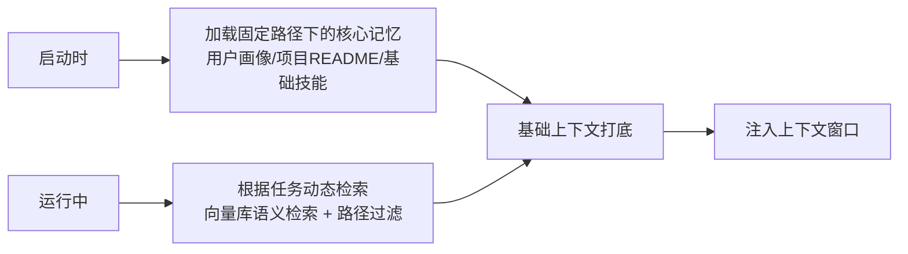

- **启动加载**：固定路径的核心记忆，保证基础认知到位。
- **动态检索**：运行中根据需要，从更大的记忆库中检索相关内容。
- 二者结合：既有确定性，又有灵活性。

### 4.4 工程实践中的路径设计原则

1. **按作用域分层**：全局 / 组织 / 团队 / 项目 / 个人——每层有自己的记忆路径。
2. **高内聚低耦合**：同一路径下的记忆高度相关，不同路径之间尽量独立。
3. **命名清晰**：路径和文件名要能直观反映内容，方便检索和理解。
4. **有版本控制**：记忆文件（特别是 Skill 和规范）应该有版本管理，可回溯可回滚。
5. **访问控制**：敏感路径的记忆需要权限校验，不是所有 Agent 都能读所有记忆。

---

## 五、记忆的写入策略 ★

> 「记什么、什么时候记、怎么记」——写入策略是记忆系统的核心艺术。
> 记多了噪声大，记少了不够用。

### 5.1 写入的三大原则

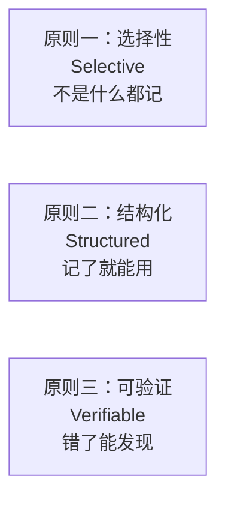

#### 原则一：选择性（Selective）

**宁少毋滥**。一条错误的记忆比十条缺失的记忆危害更大——缺失了大不了说「我不知道」，错误的记忆会误导推理。

**什么值得记：**
- ✅ 用户明确表达的偏好和要求
- ✅ 关键决策和结论
- ✅ 重要的事实和知识
- ✅ 反复出现的模式和规律
- ✅ 失败的教训和成功的经验

**什么不值得记：**
- ❌ 闲聊和客套话
- ❌ 一次性的临时信息（如「今天天气不错」）
- ❌ 已经知道的常识
- ❌ 不确定真假的信息（先打标「待验证」）

#### 原则二：结构化（Structured）

记忆不是大段的自由文本，应该有结构、有标签、有元数据，这样才能被高效检索和使用。

**一条好的记忆应该包含：**
```yaml
---
id: memo-001
type: user_preference      # 类型：偏好/事实/经验/技能
topic: 代码风格            # 主题标签
importance: high           # 重要度：high/medium/low
source: conversation-123   # 来源
created_at: 2025-07-15     # 创建时间
expires_at: null           # 过期时间（null 表示不过期）
confidence: 0.9            # 置信度
---

用户偏好使用 Java 语言进行后端开发，不喜欢 Python。
代码风格要求：中文注释、小驼峰变量名、每段代码不超过 50 行。
```

#### 原则三：可验证（Verifiable）

记忆可能出错、可能过时，要有机制发现和纠正。

- **来源可追溯**：每条记忆都能找到它是从哪来的。
- **冲突可检测**：新写入的记忆如果和已有记忆矛盾，要能发现并处理。
- **定期可审计**：定期检查记忆的准确性和时效性。

### 5.2 写入触发方式

| 触发方式 | 说明 | 优点 | 缺点 | 适用场景 |
|---------|------|------|------|---------|
| **显式写入** | 用户明确说「记住这个」 | 精准、高质量 | 需要用户主动操作 | 重要偏好、关键知识 |
| **隐式提取** | Agent 自动从对话中提取有价值的信息 | 自动化、用户无感 | 可能提取错、可能记了没用的 | 通用对话场景 |
| **事件触发** | 特定事件发生时自动记录（如任务完成、错误发生） | 针对性强、时机准确 | 需要定义事件体系 | 任务型 Agent |
| **定时反思** | 定期（如每天结束时）对近期对话做总结提炼 | 能从经验中学习、升华 | 批量处理有延迟 | 长期记忆的形成 |
| **人工编辑** | 人直接修改记忆文件 | 质量最高、最可靠 | 费人力 | 核心知识、规范、Skill |

> 💡 **最佳实践**：混合使用。核心记忆靠人工编辑保证质量，日常交互靠隐式提取+显式写入积累，定期靠反思机制提炼升华。

### 5.3 写入时的加工处理

原始信息不能直接存，需要「加工」成合格的记忆：

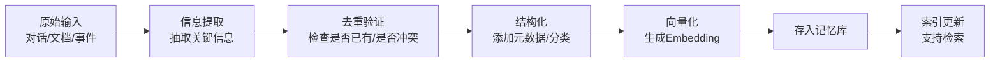

各步骤的作用：
1. **信息提取**：从原始内容中抽取出「值得记」的片段。可以用 LLM 来做（如让 LLM 从对话中提取用户偏好）。
2. **去重验证**：看看这条记忆是不是已经有了，有没有和现有记忆矛盾。
3. **结构化**：加标签、分类、重要度、时间戳等元数据。
4. **向量化**：生成 Embedding 向量，支持语义检索。
5. **入库+索引**：存入存储系统，更新索引。

---

## 六、记忆的共享与复用

> 记忆如果只能在一个 Agent、一个场景里用，价值就有限。好的记忆系统应该支持共享和复用。

### 6.1 共享的维度

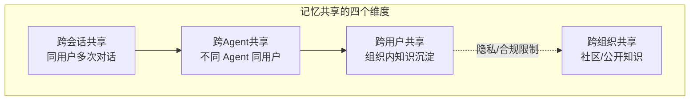

#### 6.1.1 跨会话共享（最基础）

- **是什么**：同一个用户的不同对话之间共享记忆。
- **价值**：让用户感觉 AI 「记得我」，不用每次重新交代。
- **实现**：用用户 ID 关联记忆，每次对话加载该用户的记忆。
- **挑战**：记忆的时效性——上个月的偏好现在还适用吗？

#### 6.1.2 跨 Agent 共享

- **是什么**：同一个用户的不同 Agent（如代码助手、写作助手、数据分析助手）共享记忆。
- **价值**：统一的用户画像，一个 Agent 学到的用户偏好，另一个也能用。
- **实现**：共享用户级记忆路径，每个 Agent 有自己的专用记忆，也能访问公共记忆。
- **挑战**：不同 Agent 需要的记忆类型不同，不能全量灌——需要按 Agent 角色筛选。

#### 6.1.3 跨用户共享（组织级）

- **是什么**：团队/组织内的多个用户共享记忆——通常是组织知识、最佳实践、公共规范。
- **价值**：一个人的经验变成整个组织的能力，新人上手更快，大家水平更一致。
- **实现**：组织级记忆库（如团队知识库、公共 Skill 库），所有成员的 Agent 都能读取。
- **挑战**：质量控制（谁来保证共享记忆的准确性？）、权限管理（哪些人能读/写？）。

#### 6.1.4 跨组织共享（社区级）

- **是什么**：不同组织之间共享记忆，如开源社区的公共 Skill、公开知识库。
- **价值**：站在全人类的肩膀上，不用重复造轮子。
- **现状**：还在早期，Prompt 库、Agent 模板社区是初级形态。
- **挑战**：质量参差不齐、知识产权、信任问题。

### 6.2 复用的模式

#### 模式一：模板化复用

把最佳实践做成模板，直接复用：
- **Prompt 模板**：经过验证的高质量 Prompt，直接拿来用。
- **Skill 模板**：通用技能（如代码评审、文档润色），稍加配置就能用。
- **工作流模板**：常见任务的标准流程（如发布流程、故障排查流程）。

#### 模式二：迁移学习式复用

- 在一个场景中学到的记忆，经过适配后用到另一个场景。
- 比如从「Java 代码评审」Skill 中提炼出通用的「代码评审方法论」，可以迁移到 Python 代码评审。

#### 模式三：组合式复用

- 多个小的记忆单元组合起来，形成更大的能力。
- 比如「SQL 优化」+ 「MySQL 调优」+「慢查询排查」三个 Skill 组合起来，就是一个完整的「数据库性能优化」能力。

### 6.3 共享与复用的工程原则

1. **分层共享**：全局层 / 组织层 / 团队层 / 项目层 / 个人层——每层共享范围不同。
2. **权限管控**：读权限和写权限分开，敏感记忆加密存储。
3. **版本管理**：记忆更新有版本号，可回滚、可追溯变更历史。
4. **质量门控**：共享到更高层级的记忆需要经过审核（人工或自动）。
5. **隐私保护**：个人级记忆默认不共享，组织级记忆要做脱敏。

---

## 七、常见的记忆设计陷阱

> ⚠️ 很多团队做记忆系统时容易踩的坑。

### 陷阱一：记忆越多越好

- **表现**：什么都往里存，追求「记忆库越大越牛」。
- **后果**：噪声大、检索不准、反而干扰推理。A/B 测试发现加了记忆效果还不如不加。
- **正确做法**：质量优先于数量。100 条精准记忆 > 10000 条噪声记忆。

### 陷阱二：全量加载到上下文

- **表现**：把用户所有记忆都塞进系统提示词里。
- **后果**：上下文爆炸、浪费 Token、关键信息被淹没在大量文本里。
- **正确做法**：分层 + 按需加载 + 检索注入。

### 陷阱三：只有向量检索一种方式

- **表现**：所有记忆都向量化存向量库，搜的时候就做语义检索。
- **后果**：精确信息（如用户名、配置项）用向量搜可能不准；结构化查询做不了。
- **正确做法**：混合存储 + 混合检索——结构化的用 KV/图谱查，非结构化的用向量搜。

### 陷阱四：没有遗忘机制

- **表现**：只增不删，记忆库越来越大。
- **后果**：过时信息误导、检索变慢、成本上升。
- **正确做法**：TTL 过期 + 重要度排序 + 定期反思合并 + 冷数据归档。

### 陷阱五：记忆不会错的幻觉

- **表现**：默认记忆都是对的，不加验证就用。
- **后果**：一条错误的记忆会导致一连串错误，而且很难排查——你不知道是模型的问题还是记忆的问题。
- **正确做法**：记忆有置信度、有来源、可验证、可纠错。

---

## 八、本章核心面试要点

### 8.1 Agent 为什么需要记忆

原生 LLM 三大局限：**无状态性**、**窗口有限**、**知识固化**。
记忆系统对应解决：**跨会话个性化**、**长上下文外部扩展**、**私有知识注入**。

### 8.2 记忆四分类（认知科学视角）

| 类型 | 内容 | 存储 | 生命周期 |
|------|------|------|---------|
| 工作记忆 | 当前任务上下文 | 上下文窗口 + State | 单次任务 |
| 情景记忆 | 事件/对话/经历 | 向量库 + 时间索引 | 长期可检索 |
| 语义记忆 | 事实/知识/偏好 | 知识图谱 + 向量库 + KV | 长期稳定 |
| 程序记忆 | 技能/流程/方法 | Skill 库 / 工具集 | 长期可复用 |

### 8.3 五层记忆金字塔

```
L1 寄存器级  → 当前 Token 隐状态（纳秒级）
L2 工作记忆  → 上下文窗口 + 当前状态（实时）
L3 短期记忆  → 会话级 / 最近几轮（秒级）
L4 长期记忆  → 向量库 / 知识库（百毫秒级）
L5 归档记忆  → 冷存储 / 文件（秒级以上）
```
核心思想：**越常用的放越快的存储，各层之间按需提升/降级**——和 CPU 缓存架构同理。

### 8.4 写入三原则

- **选择性（Selective）**：宁少毋滥，不是什么都记
- **结构化（Structured）**：有元数据、有标签、有分类
- **可验证（Verifiable）**：有来源、可追溯、可纠错

### 8.5 高频面试题速答

**Q1：Agent 记忆和对话历史有什么区别？**

> 对话历史是原始的流水账记录，Agent 记忆是经过筛选、提炼、结构化的有用信息。对话历史是记忆的原料之一，但不是记忆本身。好的记忆系统会从对话中提取有价值的信息，按主题/类型/重要度组织存储，而不是全量堆在一起。

**Q2：什么是路径加载？为什么需要它？**

> 路径加载是把记忆按目录/路径组织起来，根据当前场景（用户、项目、任务）只加载相关路径下的记忆，而不是全量加载。好处是：① 控制记忆数量，不撑爆上下文；② 路径本身就是强过滤，减少检索噪声；③ 天然支持权限和隔离。Claude Code 的项目级 `.claude` 目录和全局 `memory/` 目录就是典型的路径加载实现。

**Q3：记忆写入时为什么要做信息提取？直接存原始对话不行吗？**

> 直接存原始对话有三个问题：① 噪声大，大量没用的内容（寒暄、试错过程）混在里面；② 检索不准，关键信息被冗余文本稀释；③ 占空间，Token 成本高。信息提取就是把「值得记」的内容从原始素材中抽出来，去伪存真，结构化存储——用更少的空间存更高密度的有效信息。

---

## 资料勘误与重点提醒

> ⚠️ 以下是容易混淆或被误导的点：

1. **「Agent 记忆 = 向量库」是严重的简化**——很多入门教程说「Agent 记忆就是用向量库存对话历史」，这是非常片面的。向量库只是情景记忆的一种存储方式。完整的 Agent 记忆系统包括工作记忆（上下文+State）、情景记忆、语义记忆（可能用图谱）、程序记忆（Skill 库），是一个多层多形态的体系，不是单一向量库能搞定的。

2. **「认知科学的四分类是工程标准」——不是**——把记忆分成工作/情景/语义/程序四类，是借鉴认知心理学的分类框架，便于理解和讨论。但工程实现中不一定严格按这四类来划分存储，很多系统是混合的（比如向量库里既存情景也存语义）。面试时可以说「借鉴认知科学的分类，通常分为四类」，不要说「Agent 记忆标准就是这四类」。

3. **路径加载 vs 语义检索不是非此即彼**——有些讨论把「路径加载」和「语义检索」对立起来，说哪个更好。实际上二者是互补的：路径加载负责「粗筛」，快速缩小范围；语义检索负责「精搜」，在小范围内找最相关的内容。生产系统通常两者结合使用。

4. **记忆共享不是越多越好**——跨用户、跨组织共享记忆听起来很美，但有质量控制、隐私合规、知识产权等一大堆问题。从「个人记忆」到「团队共享」再到「全社区共享」，每一步的难度和风险都指数级上升。建议从个人级开始，逐步扩大共享范围，而不是上来就做「全球记忆库」。

5. **本章的「五层记忆金字塔」和「写入三原则」是工程实践的经验总结，不是某个权威标准**——五层架构借鉴了计算机体系结构的缓存层级思想，写入三原则是从多个记忆系统项目的实践中归纳出来的。它们是实用的分析框架，但不是行业统一标准，不同团队可能有不同的分层方式和原则表述。
