# AI 记忆机制全景解析（四）：记忆检索效率提升技术

> 第三章讲了 Agent 记忆的分类、分层和写入。记忆存下来是为了用，而「用」的关键是**检索**——
> 存了 1 万条记忆，但需要的时候搜不到 = 白存。
> 本章系统讲解提升记忆检索效率的技术，从 LLM 端到 Agent 端，再到具体产品的实现。

---

## 一、检索效率为什么重要

### 1.1 检索是记忆系统的「咽喉」

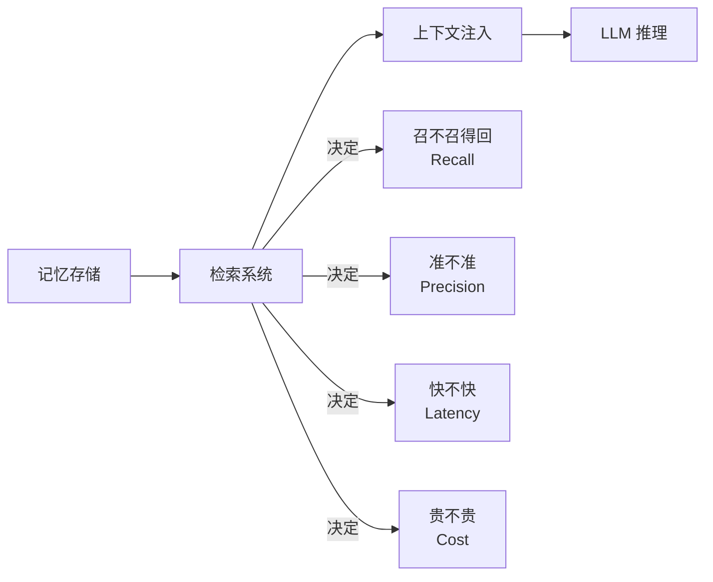

记忆系统的价值 = 检索到正确记忆的概率 × 正确记忆的价值。
检索不行，存再多再好的记忆都白搭。

### 1.2 检索面临的三大挑战

| 挑战 | 说明 | 影响 |
|------|------|------|
| **语义鸿沟** | 用户的查询表述和记忆中的表述不一样，字面对不上 | 该召回的召不回（漏召） |
| **噪声干扰** | 记忆库里有大量不相关的内容，检索时混入 | 不该召回的召回了（误召） |
| **效率瓶颈** | 记忆库越来越大，检索越来越慢、越来越贵 | 延迟高、成本高、体验差 |

> 🔑 **核心矛盾**：检索的三个核心指标——**召回率、准确率、效率**——通常不可能同时最优。
> 提高召回率可能降低准确率（放宽阈值），提高准确率可能降低召回率（收紧阈值），两者都要的话效率又跟不上。
> 好的检索系统是在这三者之间找到合适的平衡点。

---

## 二、LLM 端的检索优化

> 首先从「使用记忆的那个东西」——LLM 本身出发，看 LLM 端有哪些技术可以提升记忆的利用效率。

### 2.1 注意力机制优化

#### 2.1.1 滑动窗口注意力（Sliding Window Attention）

**思路**：不是每个 Token 都要看到所有历史 Token，大部分情况下只需要看最近的一部分。

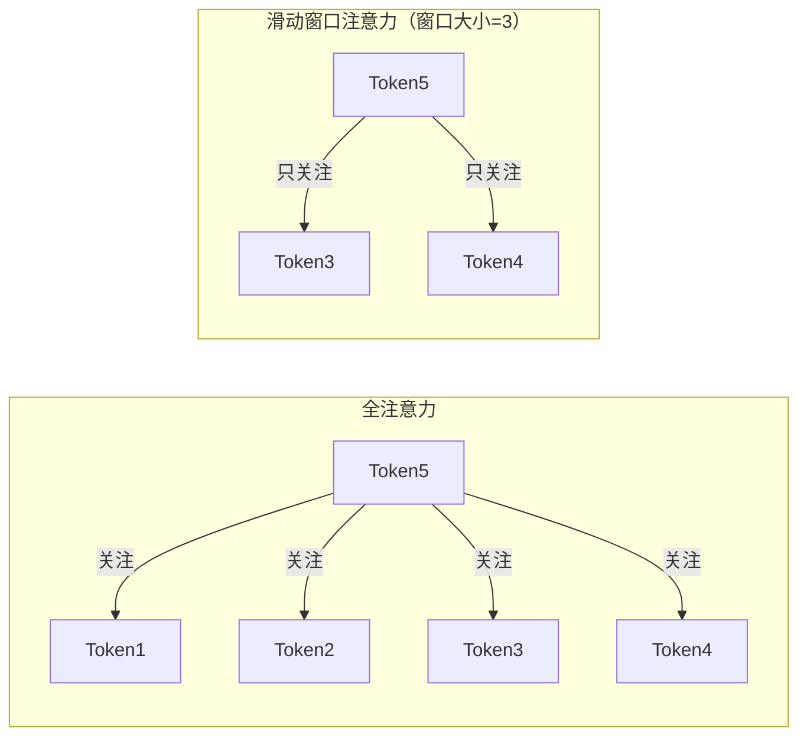

- **原理**：每个 Token 只关注窗口内的前 N 个 Token，窗口外的忽略。
- **效果**：KV Cache 大小从 O(N) 降到 O(W)（W 是窗口大小），计算量也相应减少。
- **代表**：Mistral 系列模型（窗口大小 4096，总上下文 32K+）。
- **适用场景**：对话、流式数据等「最近的信息最重要」的场景。
- **局限**：窗口外的信息完全看不到，需要其他机制（如全局注意力标记）来补充关键信息。

#### 2.1.2 稀疏注意力（Sparse Attention）

**思路**：不是所有 Token 之间都需要交互，只在「重要的」Token 对之间做注意力。

常见模式：
- **固定模式**：每个 Token 只关注局部窗口 + 每隔固定步长的 Token（如 Longformer 的滑动窗口 + 空洞注意力）。
- **可学习模式**：让模型自己学哪些 Token 之间需要注意力（如 Reformer 的 Locality Sensitive Hashing Attention）。
- **效果**：注意力计算量从 O(N²) 降到接近 O(N)。

#### 2.1.3 FlashAttention：计算层面的加速

**思路**：不是算法层面减少计算，而是从工程层面优化计算顺序，让数据更多地待在 GPU  SRAM（高速缓存）里，减少和显存（HBM）之间的搬运。

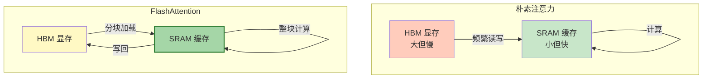

- **核心技术**：Tiling（分块计算）+ Recomputation（反向传播时重算，不用存中间结果）。
- **效果**：速度提升 2-4 倍，显存占用大幅降低。
- **意义**：FlashAttention 不是减少了计算量，而是**让计算单元不再等数据**——把内存受限（Memory-Bound）变成了计算受限（Compute-Bound），从而提升了实际吞吐量。
- **现状**：FlashAttention-2/3 已成为主流 LLM 推理框架的标配。

### 2.2 位置编码优化

上下文变长后，位置编码的效果也会影响「记忆检索」的质量——LLM 能不能正确理解「哪条信息在什么位置」。

| 位置编码方案 | 原理 | 长上下文效果 | 代表模型 |
|------------|------|-------------|---------|
| **绝对位置编码** | 每个位置一个固定向量 | 差，超出训练长度直接崩 | GPT-2 |
| **正弦位置编码** | 用正弦函数生成位置向量 | 一般，外推能力有限 | Transformer 原论文 |
| **RoPE（旋转位置编码）** | 在 Query 和 Key 上施加旋转来编码位置 | 好，支持线性内插外推 | LLaMA 系列 |
| **ALiBi** | 不加位置编码，用注意力偏置来体现距离 | 很好，长上下文外推能力强 | MPT、BLOOM |

> **为什么位置编码和记忆检索有关？**
> 因为记忆检索本质上就是「在上下文序列中找到相关的信息」——而位置编码决定了 LLM 能不能正确理解「信息在序列中的位置和距离」。位置编码外推能力差的模型，长上下文下检索效率会显著下降。

### 2.3 Prompt 结构优化

> 同样的记忆内容，放在 Prompt 的不同位置、用不同的格式组织，LLM 的利用效率天差地别。

#### 2.3.1 位置效应（Lost in the Middle）

LLM 对上下文开头和结尾的内容记忆最好，中间的内容容易被忽略。

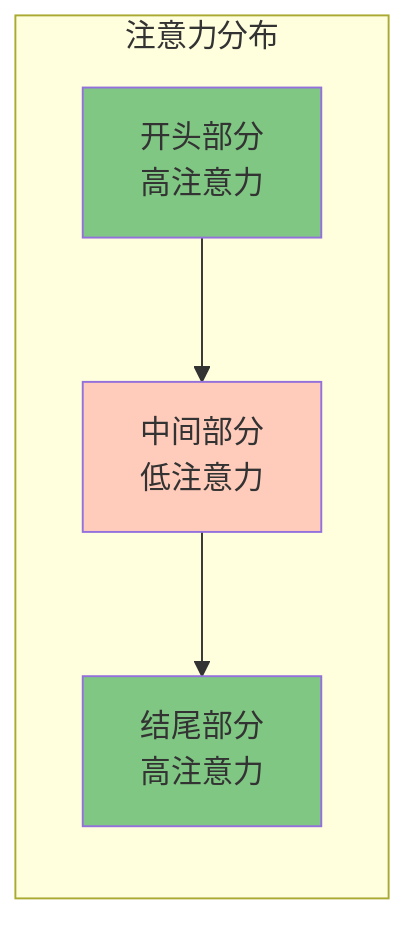

**应对策略**：
- 把最重要的记忆（如关键指令、核心事实）放在开头或结尾。
- 重要信息重复出现（开头提一次、结尾再提一次）。
- 检索排序时，最相关的内容不一定放最前面，可以考虑分布在首尾。

#### 2.3.2 结构化组织

把记忆以结构化的方式呈现（XML 标签、Markdown 表格、编号列表），比大段纯文本更容易被 LLM 准确利用。

```
<!-- 差：大段纯文本 -->
记忆1: 用户喜欢Java，不喜欢Python，代码风格要求中文注释，小驼峰...
记忆2: 项目使用JDK17，Spring Boot 3.2，数据库MySQL 8.0...

<!-- 好：结构化标签 -->
<memory id="1" type="preference">
  <language>Java</language>
  <code_style>中文注释，小驼峰变量名</code_style>
</memory>
<memory id="2" type="project_info">
  <jdk>17</jdk>
  <spring_boot>3.2</spring_boot>
  <database>MySQL 8.0</database>
</memory>
```

#### 2.3.3 引用 + 溯源

给每条记忆加上编号或来源标记，让 LLM 可以精确引用，也方便事后验证：
- LLM 回答时可以说「根据记忆 #3，……」
- 如果回答错了，可以追溯是哪条记忆的问题，而不是一锅粥。

---

## 三、Agent 端的检索优化 ★

> LLM 端的优化是「地基」，Agent 端的检索系统是「建筑」——这一层决定了记忆检索的实际效果。

### 3.1 检索架构的演进

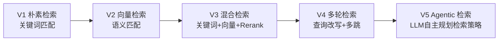

| 阶段 | 技术 | 召回率 | 准确率 | 复杂度 |
|------|------|--------|--------|--------|
| V1 关键词 | TF-IDF / BM25 | 低（同义词搜不到） | 中（精确匹配） | 低 |
| V2 向量检索 | Dense Embedding | 中（语义相关） | 中低（可能不精确） | 中 |
| V3 混合检索 | 稀疏 + 稠密 + Rerank | 高 | 高 | 高 |
| V4 多轮检索 | 查询改写 / 多跳 / HyDE | 很高 | 高 | 很高 |
| V5 Agentic | LLM 自主检索 | 最高 | 取决于 LLM | 最高 |

### 3.2 混合检索（Hybrid Search）

**思路**：单一检索方式各有优劣，组合起来取长补短。

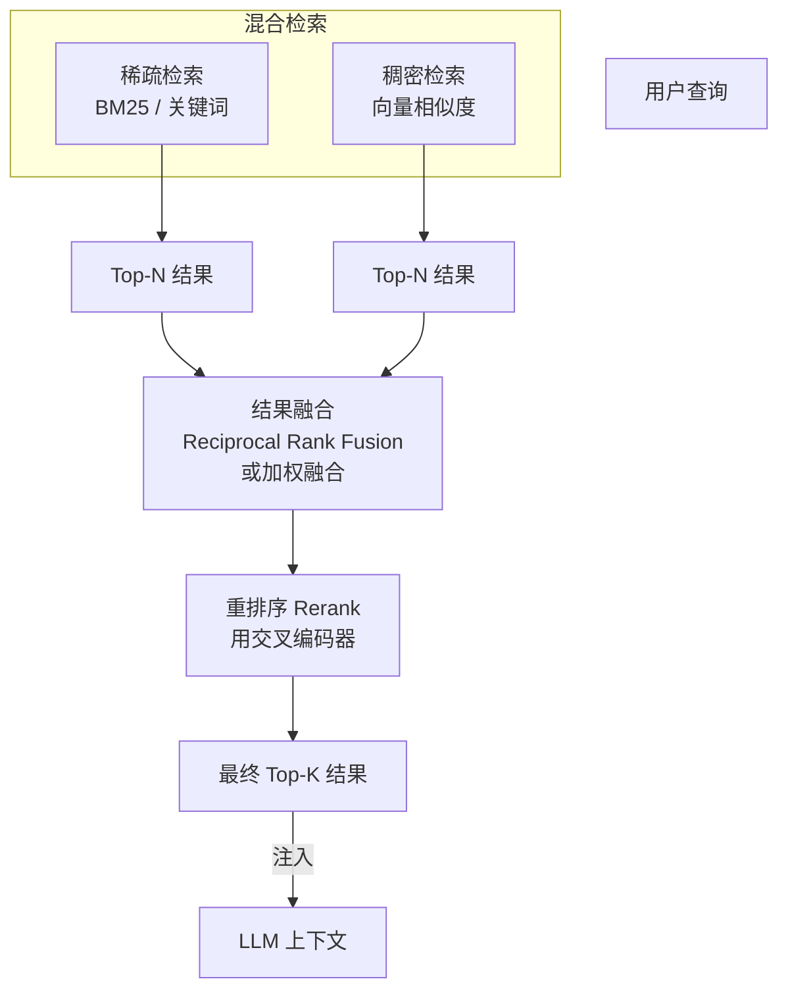

各组件的作用：

| 组件 | 作用 | 为什么需要 |
|------|------|-----------|
| **稀疏检索（BM25）** | 关键词字面匹配 | 精确术语、专有名词、代码标识符等字面匹配更准 |
| **稠密检索（向量）** | 语义相似度匹配 | 同义词、改写、语义相关的内容能搜到 |
| **结果融合** | 把两路结果合并排序 | 兼顾精确性和语义相关性 |
| **Rerank（重排序）** | 用更强大的模型重新排序 | 粗召回的排序不够准，用更精细的模型精排 |

> 💡 **经典比例**：通常先召回 50~100 条候选（稀疏+稠密各取一部分），然后用 Rerank 精排到 Top 5~10 条注入上下文。
> 召回阶段要「全」（宁可多召一些，不能漏），精排阶段要「准」（只要最相关的）。

### 3.3 查询改写（Query Transformation）

用户的原始查询不一定是最优的检索查询——可能太短、太口语、太模糊。在检索前先改写一下，效果会好很多。

| 改写技术 | 做法 | 适用场景 |
|---------|------|---------|
| **查询扩展** | 给原查询补充同义词、相关术语 | 查询太短、术语太偏 |
| **HyDE（Hypothetical Document Embedding）** | 先用 LLM 生成一个「假设的理想答案」，用这个答案去检索 | 查询和文档差异大的场景 |
| **Step-Back Prompting** | 先把具体问题抽象成更高层的问题，先检索高层原理 | 复杂问题需要先找基础原理 |
| **子问题分解** | 把复杂问题拆成几个子问题，分别检索再综合 | 多跳、多维度的复杂问题 |
| **查询重构** | 用 LLM 把口语化/模糊的查询改写成更规范的检索查询 | 自然语言查询 |

### 3.4 长短期记忆协同

> 短期记忆和长期记忆不是两个独立系统，而是协同工作的。

#### 3.4.1 QMD 机制（Query-Memory-Decision）

这是一种结构化的记忆-检索-决策闭环：

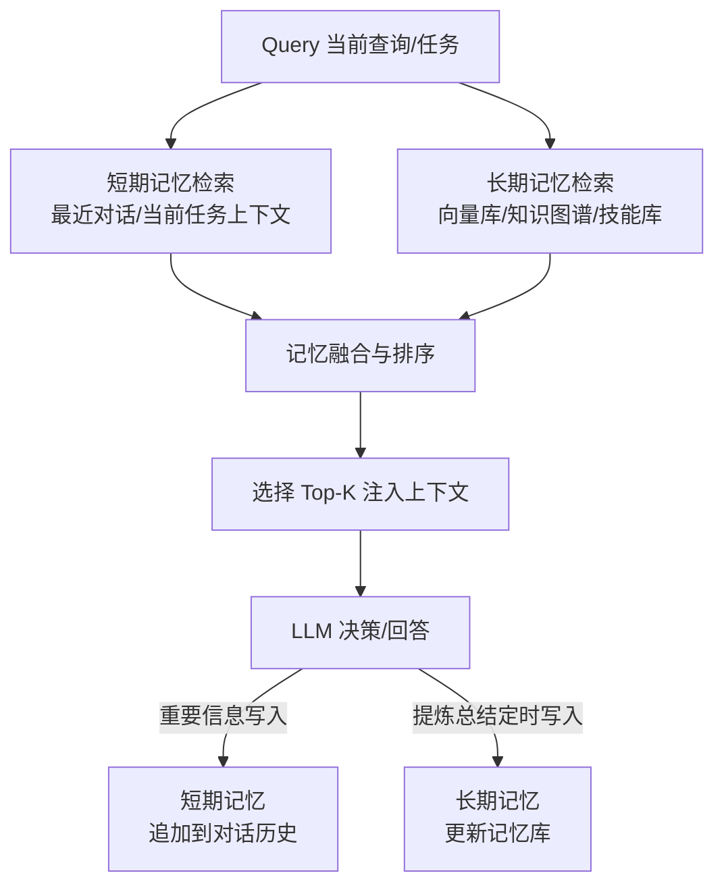

**QMD 循环的要点：**

1. **双通道检索**：短期记忆和长期记忆并行检索，然后融合。
2. **上下文感知**：短期记忆（最近的对话）提供上下文，让检索更精准。
3. **闭环写入**：不仅从记忆中读，还要把新产生的重要信息写回记忆。
4. **动态调整**：根据任务复杂度动态调整检索的深度和广度——简单问题少搜点，复杂问题多搜点。

#### 3.4.2 短期记忆作为「检索上下文」

短期记忆（当前对话历史）的一个重要作用是**帮助理解用户的当前查询**，从而更好地检索长期记忆。

举个例子：
- 用户说：「刚才那个方案的性能怎么样？」
- 如果只有这一句话，去长期记忆里搜「那个方案」根本搜不到——因为不知道「那个」指哪个。
- 但有了短期记忆（前面的对话），就知道「那个方案」指的是上一轮讨论的方案 A，然后用「方案 A 的性能」去检索长期记忆。

> 💡 **这就是为什么很多 RAG 系统要先做「查询理解」——结合对话历史把指代消解、补全，再去检索知识库。**

### 3.5 元数据过滤 + 检索

语义检索不是盲搜，先按元数据过滤，缩小范围再搜，又快又准。

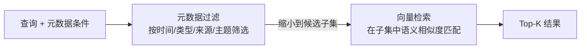

**常用的元数据维度：**

| 元数据 | 作用 | 过滤示例 |
|--------|------|---------|
| **记忆类型** | 只搜某类记忆 | 「只在用户偏好中搜」 |
| **时间范围** | 时效性强的信息只搜近期 | 「只看最近 30 天的」 |
| **来源** | 按可信度或场景筛选 | 「只看人工审核过的」 |
| **重要度** | 只看高优先级的记忆 | 「只返回高重要度的」 |
| **主题标签** | 按主题域筛选 | 「只在 Java 相关记忆中搜」 |
| **用户/项目** | 按作用域隔离 | 「只搜这个项目的记忆」 |

元数据过滤和向量检索的组合（也叫「结构化过滤 + 语义检索」）是生产环境的标配——纯向量检索在大规模记忆库上既慢又不准。

### 3.6 记忆检索的缓存

> 相似的查询会反复出现。如果每次都全流程跑一遍检索，既慢又贵。加上缓存可以显著提升效率。

| 缓存层级 | 缓存什么 | 触发条件 | 效果 |
|---------|---------|---------|------|
| **查询结果缓存** | 完全相同的查询 → 直接返回结果 | 查询完全一致 | 最快，但命中率低 |
| **语义缓存** | 相似查询 → 缓存命中直接返回 | Embedding 相似度高于阈值 | 命中率较高，实现稍复杂 |
| **记忆片段缓存** | 常用的记忆片段（如用户画像）预加载 | 启动时/会话开始时 | 减少检索次数 |
| **Embedding 缓存** | 相同文本的 Embedding 向量 | 文本完全一致 | 省 Embedding 计算费 |

> 🔑 **语义缓存（Semantic Cache）** 是 2024-2025 年的热门方向：
> 不只是缓存相同查询的结果，而是缓存「语义相似」的查询结果——用 Embedding 相似度判断是否命中。
> 对于对话系统这种用户问题重复性高的场景，命中率可以到 30~60%，大幅降低检索和 LLM 调用成本。

---

## 四、Claude Code 的记忆实现 ★

> 从产品视角看一个真实的 Agent 记忆系统是怎么设计的。
> 注意：以下内容基于公开文档和可观察到的行为分析，不是官方源码级实现细节。

### 4.1 三层记忆结构

Claude Code 的记忆体系大致可以分为三层：

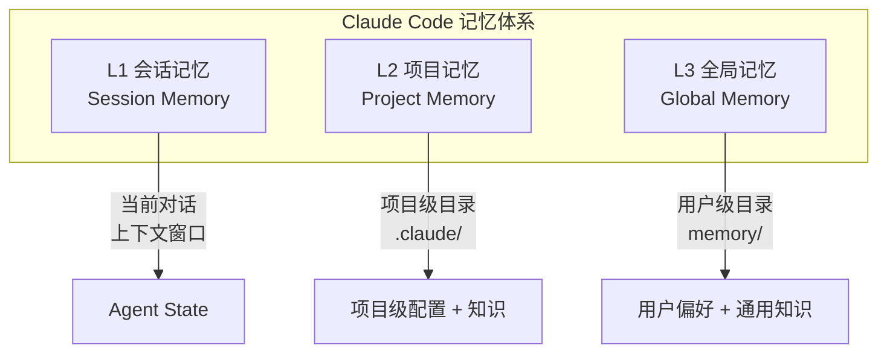

### 4.2 L1：会话记忆（Session Memory）

- **载体**：上下文窗口 + Harness 维护的会话状态。
- **内容**：当前对话的所有历史、工具调用结果、任务列表（/todo）。
- **管理策略**：
  - **自动压缩（Auto-Compact）**：上下文快满了就把旧内容总结成摘要，腾出空间。
  - **关键信息锚定**：系统提示、CLAUDE.md 等关键内容始终保留，不被压缩掉。
  - **子 Agent 隔离**：子任务派给子 Agent，子 Agent 的中间细节不污染主对话上下文。
- **特点**：快、实时，但容量有限、会话结束就没了。

### 4.3 L2：项目记忆（Project Memory）

- **载体**：项目目录下的 `.claude/` 目录（以及仓库中的 Markdown 文档）。
- **内容**：
  - `CLAUDE.md`：项目指令和知识（项目介绍、代码规范、常用命令等）。
  - `settings.json`：项目级配置。
  - 仓库中的 README、文档文件：Agent 可以读取并作为项目知识的一部分。
- **加载时机**：进入项目目录时自动加载 CLAUDE.md 和相关配置。
- **特点**：
  - 按项目隔离，每个项目有自己的记忆。
  - 人可读、可编辑，版本控制友好（Git 管理）。
  - 「路径加载」的典型实现——在哪个项目目录下，就加载哪个项目的记忆。

### 4.4 L3：全局记忆（Global Memory）

- **载体**：用户目录下的 `memory/` 文件夹（如 `~/.claude/projects/xxx/memory/`）。
- **内容**：
  - 以 Markdown 文件形式存储的记忆条目。
  - 每条记忆有 frontmatter（名称、描述、元数据）。
  - 有 `MEMORY.md` 作为索引文件。
- **加载时机**：每次启动时加载（或者按需读取）。
- **特点**：
  - 跨项目、跨会话共享。
  - 文件系统存储，人可读，可手动编辑。
  - 写入不频繁（通常是人手动添加，或者 Agent 在用户同意后添加）。
  - 数量不会太大（几十到几百条），不需要向量检索，靠文件名和索引就能管理。

### 4.5 设计哲学：简洁优先

Claude Code 的记忆设计有几个鲜明的特点：

1. **文件系统优先**——不用向量库，不用数据库，就是纯 Markdown 文件。
   - 优点：人可读、可 Git 管理、简单可靠、零依赖。
   - 代价：不适合大规模记忆（几千条以上就不好管了）。

2. **人工参与记忆质量控制**——记忆主要靠人写（或 AI 写人审核），而不是自动从对话中提取。
   - 优点：记忆质量高，没有噪声。
   - 代价：需要人主动维护，积累慢。

3. **路径加载 + 上下文隔离**——项目级和用户级分层，不同层级各司其职。
   - 优点：可预测、可控制、不会乱塞记忆。
   - 代价：灵活性稍差，不能自动发现跨项目的相关记忆。

> 💡 **为什么这么设计？**
> Claude Code 是面向开发者的代码 Agent，开发者对「可控性」和「可预测性」要求很高——你不希望 AI 突然从不知道哪条记忆里蹦出一个奇怪的结论。
> 用文件系统 + 人工维护，虽然「不智能」，但**可靠、可解释、可控制**——这在代码场景下比「全自动但不可靠」更重要。
> 不同场景的记忆系统设计思路不同，没有万能方案。

---

## 五、OpenClaw / 开源 Agent 框架的记忆实现

> 对比看看开源框架是怎么做记忆的。以 LangChain / LangGraph、Mem0、OpenClaw 等为代表。

### 5.1 LangChain / LangGraph 的记忆体系

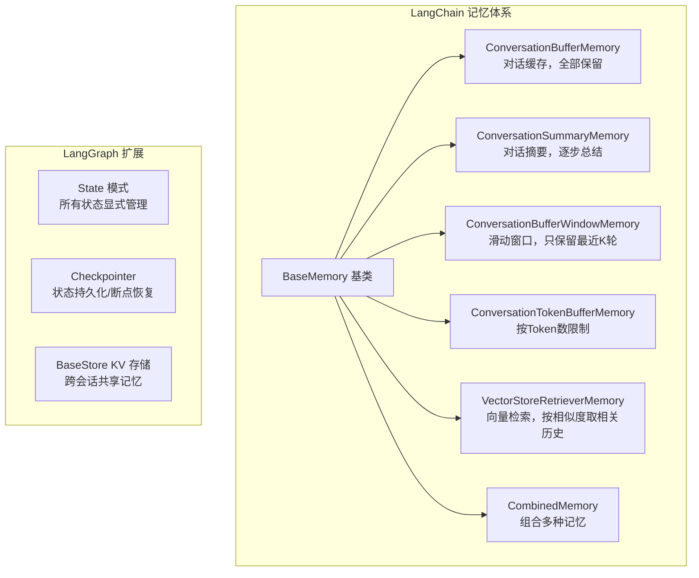

**核心设计思想：**

1. **记忆 = 上下文管理工具**：LangChain 的 Memory 本质上是帮你管理「往 LLM 输入里塞什么历史」。
2. **策略模式**：不同的记忆策略是不同的类，可以根据场景选择。
3. **LangGraph 升级为 State**：从「隐式的 Memory」变成「显式的 State」——所有状态（包括记忆）都在 Graph 的 State 里，更可控、更可追踪。
4. **持久化通过 Checkpointer**：LangGraph 用 Checkpointer 来持久化状态，支持断点恢复和跨会话。

### 5.2 Mem0 的分层记忆架构

Mem0 是一个专注于 AI 记忆的开源项目，它的架构更接近「独立记忆层」的思路：

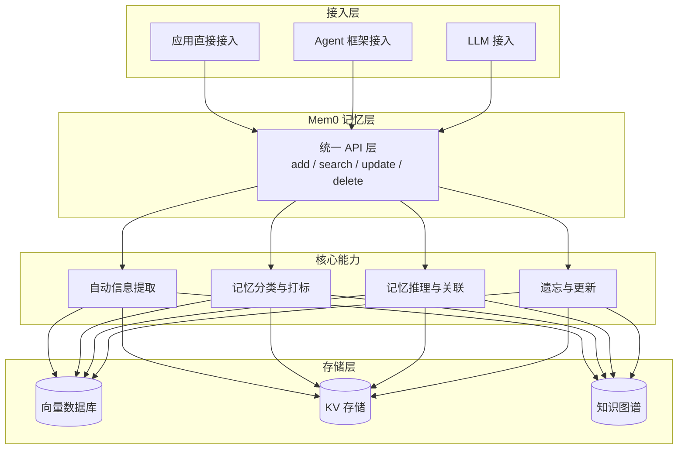

**特点：**
- **LLM 原生**：用 LLM 来做记忆的提取、分类、推理、合并。
- **多租户**：支持用户级、Agent 级、会话级的记忆隔离。
- **自动维护**：自动检测冲突、合并相似记忆、删除过时记忆。
- **多存储后端**：支持 Qdrant、Chroma、PGVector、Redis 等。

> Mem0 更像一个「记忆中间件」——你的应用或 Agent 通过它的 API 来读写记忆，它帮你搞定提取、检索、维护等所有脏活累活。

### 5.3 对比总结

| 维度 | Claude Code 式 | LangChain 式 | Mem0 式 |
|------|---------------|-------------|---------|
| **设计理念** | 简洁可控，文件优先 | 灵活组件，策略模式 | 独立记忆中间件 |
| **核心存储** | 文件系统（Markdown） | 内存 + 可选持久化 | 向量库 + KV + 图谱 |
| **记忆质量** | 高（人工编辑为主） | 中（取决于实现） | 中高（自动提取+维护） |
| **扩展性** | 低（适合百级记忆） | 中（可自定义） | 高（适合万级以上） |
| **可控性** | 很高（完全透明） | 中高（代码可见） | 中（自动处理较多） |
| **适用场景** | 开发者工具、项目级 | 定制化 Agent 开发 | 大规模、多用户、产品级 |

> 💡 **没有最好的方案，只有最适合的方案**：
> - 小团队 / 个人用 → 简单的文件式记忆就够了，可控可靠。
> - 做产品 / 多用户 → 需要独立的记忆层，支持大规模、自动维护。
> - 定制化 Agent → 用 LangChain/LangGraph 自己搭，灵活可控。

---

## 六、本章核心面试要点

### 6.1 检索优化的三层视角

```mermaid
graph TD
    subgraph llm_opt["LLM 端优化（计算与利用效率）"]
        L1[注意力优化<br/>滑动窗口 / 稀疏注意力 / FlashAttention]
        L2[位置编码优化<br/>RoPE / ALiBi 提升长上下文效果]
        L3[Prompt 结构优化<br/>位置效应 / 结构化组织 / 引用溯源]
    end

    subgraph agent_opt["Agent 端优化（检索系统效率）"]
        A1[检索架构演进<br/>关键词 → 向量 → 混合 → 多轮 → Agentic]
        A2[混合检索<br/>稀疏(BM25) + 稠密(向量) + 融合 + Rerank]
        A3[查询改写<br/>扩展 / HyDE / Step-Back / 子问题分解]
        A4[长短期协同<br/>QMD 机制（查询→记忆→决策闭环）]
        A5[元数据过滤<br/>先筛选再检索，又快又准]
        A6[语义缓存<br/>相似查询直接命中，省时间省成本]
    end

    subgraph product_impl["产品实现"]
        P1[Claude Code<br/>三层记忆（会话/项目/全局）+ 文件优先]
        P2[开源框架<br/>LangChain(策略模式) / Mem0(记忆中间件)]
    end
```

### 6.2 混合检索的经典流程

1. **粗召回**：BM25 + 向量检索各召 50~100 条
2. **融合**：RRF 或加权融合，得到候选集
3. **精排**：用 Reranker 重排序到 Top 5~10
4. **注入**：把 Top-K 结果注入 LLM 上下文

> 一句话口诀：**召回求全，精排求准。**

### 6.3 高频面试题速答

**Q1：为什么需要混合检索？只用向量检索不行吗？**

> 纯向量检索有几个问题：① 对精确术语、专有名词、代码标识符的匹配不如关键词准；② 语义相近但不是正确答案的内容容易混进来（假阳性）；③ 完全相同的内容可能因为 Embedding 的微小差异而排不到最前面。混合检索结合了关键词检索的「精确性」和向量检索的「语义相关性」，再加上 Rerank 精排，召回率和准确率都比单一方式高。

**Q2：什么是 QMD 机制？**

> QMD（Query-Memory-Decision）是一种记忆-检索-决策的闭环机制：当前查询（Query）同时触发短期记忆和长期记忆检索（Memory），结果融合排序后选择 Top-K 注入上下文，LLM 基于完整上下文做出决策（Decision），决策过程中新产生的重要信息又写回记忆（短期直接追加，长期定期提炼更新）。核心是「读-用-写」形成闭环，记忆越用越好用。

**Q3：Claude Code 的记忆系统为什么用文件系统而不是向量库？**

> 主要是三个考虑：① **可控性**——开发者场景下，可预测、可解释比「全自动」更重要，文件式记忆完全透明，不会出现「AI 从不知道哪条记忆里蹦出奇怪结论」的情况；② **质量**——人工编辑的记忆质量高、无噪声，比自动从对话中提取的靠谱；③ **简单**——零依赖、Git 可管理、上手成本低。当然代价是不适合超大规模记忆，但对于代码 Agent 这种场景（几十到几百条核心记忆）完全够用。

---

## 资料勘误与重点提醒

> ⚠️ 以下是需要注意的点：

1. **「FlashAttention 减少了计算量」——错**。FlashAttention 没有减少 FLOPs（计算量），它减少的是**内存访问量**。通过分块计算和重计算策略，让数据更多地待在高速 SRAM 里，减少和 HBM 的数据搬运，从而提升实际吞吐量。是工程优化，不是算法优化。

2. **「混合检索 = 关键词 + 向量」是简化说法**。完整的混合检索通常包括：稀疏检索 + 稠密检索 + 结果融合 + Rerank 精排，有时还包括元数据过滤。面试时说清楚「先粗召回，再精排」的两阶段思路，比只说「混合检索」更专业。

3. **Claude Code 的记忆实现细节是基于公开文档和行为推断的**。不是反编译或读源码得到的，具体实现可能有差异。核心设计理念（三层结构、文件优先、人工质量控制、路径加载）是可观察到的，但内部具体机制（如压缩算法、检索策略）可能不是完全准确的。面试时可以说「从产品行为和公开文档来看，大致是这样设计的」。

4. **Mem0 等开源记忆框架的分类是产品视角的总结，不是官方定义的标准架构**。不同的记忆框架（Mem0 / Zep / LanceDB 等）各有特色，本章的对比是从功能视角做的归纳，方便理解不同路线的差异，不是说它们「一定就是这样分类的」。

5. **语义缓存的命中率高度依赖场景**。不要以为上了语义缓存就一定能省 50%。对于问答型、重复性高的场景（客服、FAQ）命中率可能很高；对于创造性、每次都不一样的场景（写代码、头脑风暴）命中率可能很低。要不要做语义缓存、怎么做，要先分析查询模式。
