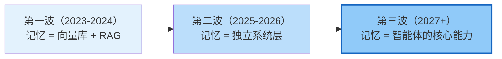
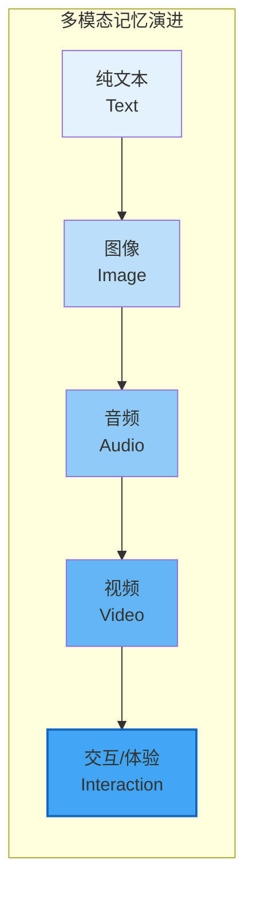
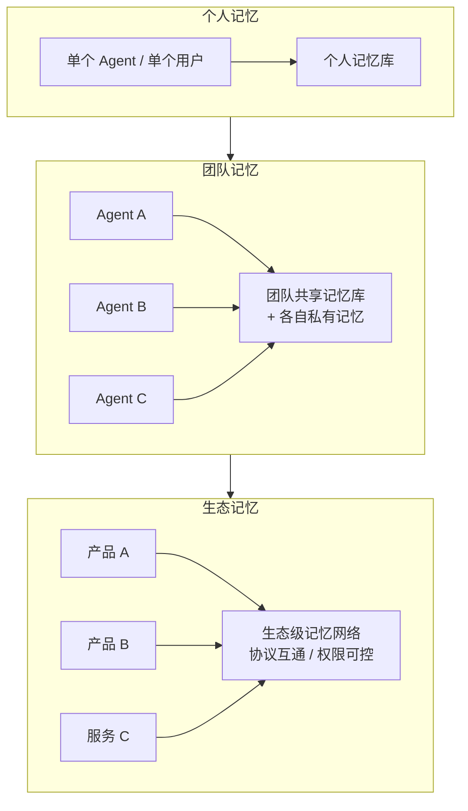
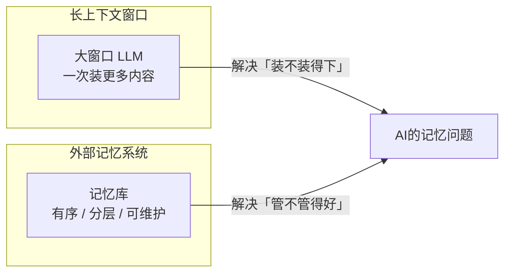
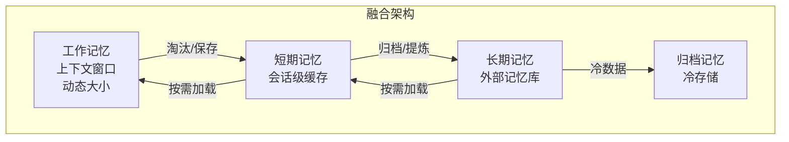
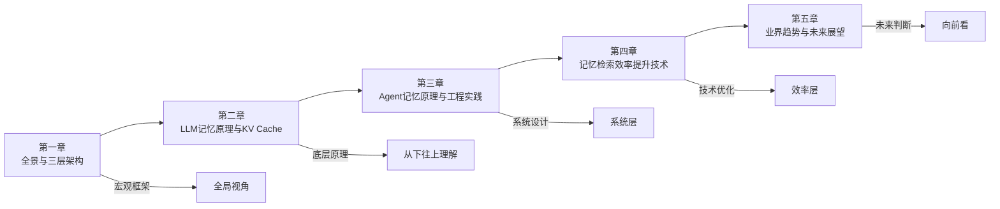

# AI 记忆机制全景解析（五）：业界趋势与未来展望

> 前面四章从原理到工程系统讲解了 AI 记忆的现状。
> 本章抬头看路，梳理业界正在发生的趋势和未来可能的发展方向。
> 内容基于 2024-2026 年公开的技术动态、产品发布和研究方向综合分析，供参考和判断。

---

## 一、趋势总览：AI 记忆的三波浪潮



| 阶段 | 时间 | 核心认知 | 代表形态 |
|------|------|---------|---------|
| **第一波** | 2023-2024 | 记忆 = 向量检索，是 RAG 的附属功能 | RAG 插件、对话历史向量库 |
| **第二波** | 2025-2026 | 记忆是独立的系统层，有自己的架构和产品 | 记忆中间件、个人记忆云、组织记忆库 |
| **第三波** | 2027+ | 记忆是智能体的核心能力，能自主学习和进化 | 持续学习 Agent、终身学习系统 |

> 我们现在（2026 年中）正处在**第一波的成熟期和第二波的早期**——向量库 + RAG 已经是标配，而独立记忆层、记忆中间件、个人记忆云等概念正在快速产品化。

---

## 二、趋势一：从「附属功能」到「独立记忆层」★

### 2.1 正在发生的变化

过去：记忆是 RAG 的一部分，RAG 是 Agent 的一部分 → 「记忆 = 向量库存对话历史」

现在：记忆逐渐成为一个**独立的层级**，有自己的 API、自己的架构、自己的产品形态。

```mermaid
graph TB
    subgraph 旧架构：记忆是附属
        App[应用]
        Agent[Agent]
        RAG[RAG 模块]
        Vec[(向量库)]

        App --> Agent
        Agent --> RAG
        RAG --> Vec
    end

    subgraph 新架构：记忆是独立层
        App2[应用 A]
        App3[应用 B]
        Agent2[Agent A]
        Agent3[Agent B]
        Mem[🧠 独立记忆层<br/>统一 API / 多模态 / 自动维护]

        App2 & App3 & Agent2 & Agent3 --> Mem
    end

    style Mem fill:#c8e6c9,stroke:#2e7d32,stroke-width:2px
```

### 2.2 为什么记忆要独立成层

1. **跨应用共享**：用户在不同 App 中的 AI 体验应该是连续的——不能在 App A 里教过 AI 的事，到 App B 里它又忘了。独立记忆层是实现「统一 AI 记忆」的前提。
2. **专业的事情专业做**：记忆系统有自己的技术栈（提取、检索、维护、安全、合规），让专业团队做专业产品，比每个应用自己搞一套效率高。
3. **数据飞轮**：记忆系统积累的数据越多，效果越好——独立出来可以汇聚更多数据，形成飞轮效应。
4. **隐私与合规**：集中管理用户记忆，更容易做权限控制、数据脱敏、合规审计。

### 2.3 独立记忆层的产品形态

| 形态 | 定位 | 典型玩家方向 |
|------|------|-------------|
| **记忆 SDK / 中间件** | 给开发者用的记忆组件，集成到自己的应用里 | Mem0、Zep、LanceDB 等开源项目 |
| **个人记忆云服务** | 面向个人用户的「AI 记忆管家」，跨设备跨应用同步 | 各 AI 厂商的个人助手生态 |
| **企业记忆平台** | 面向企业的组织级记忆管理，整合企业知识库、文档、员工经验 | 企业 AI 平台厂商 |
| **记忆协议标准** | 定义记忆的读写格式、互通协议 | MCP 扩展、A2A 协议扩展 |

---

## 三、趋势二：从「纯文本」到「多模态记忆」

### 3.1 为什么多模态记忆是必然

人的记忆天然是多模态的：你记得一个人的长相（视觉）、声音（听觉）、一起吃过的味道（味觉/嗅觉）、甚至当时的情绪。单一模态的记忆是不完整的。

AI 记忆也在朝这个方向走：从「只能记文字」到「能记图像、音频、视频、甚至交互过程」。



### 3.2 各模态的技术成熟度

| 模态 | 技术现状 | 存储方式 | 典型场景 |
|------|---------|---------|---------|
| **文本** | 成熟 | 向量库 + 关键词索引 | 对话、文档、笔记 |
| **图像** | 快速成熟 | CLIP 等多模态 Embedding + 向量库 | 截图、设计稿、图表 |
| **音频** | 早期 | Whisper 转文本 + 音频特征向量 | 语音对话、会议录音 |
| **视频** | 早期实验 | 关键帧提取 + 语音转写 + 摘要 | 教学视频、会议录像 |
| **交互/3D** | 研究阶段 | 状态序列 + 环境表征 | 机器人、游戏 Agent |

### 3.3 多模态记忆的核心难点

1. **统一表征**：不同模态怎么映射到同一个语义空间？——多模态 Embedding 模型（ImageBind、GPT-4o Embedding 等）在解决这个问题，但效果还有提升空间。
2. **存储成本**：一张图片的 Embedding 可能和一段文本差不多，但图片本身的存储和处理成本高得多。视频更是指数级上升。
3. **检索精度**：「以文搜图」「以图搜视频」的精度目前还不如纯文本检索。
4. **摘要与提炼**：视频怎么「摘要」？是提取关键帧，还是生成文字描述？还是保留时序结构？——目前还没有标准答案。
5. **隐私风险**：图像/音频中可能包含人脸、声纹等敏感生物信息，存储和使用有合规风险。

---

## 四、趋势三：从「被动检索」到「主动记忆管理」

### 4.1 什么是主动记忆管理

现在的记忆系统大多是「被动」的：你问它，它才去搜；你让它记，它才记。

未来的记忆系统会更「主动」：

```mermaid
graph TB
    subgraph 被动记忆（当前）
        Q[查询] --> R[检索]
        R --> O[返回结果]
        W[写入指令] --> S[存储]
    end

    subgraph 主动记忆（未来）
        OBS[持续观察交互]
        OBS -->|自动提取| AUTO[自动写入有价值的信息]
        OBS -->|主动预测| PRED[预测需要什么记忆<br/>提前准备好]
        AUTO --> REFLECT[定期反思<br/>合并/提炼/遗忘]
        REFLECT --> EVOLVE[记忆持续进化]
        PRED --> RETRIEVE[检索并注入]
    end
```

### 4.2 主动记忆的四个能力方向

#### 4.2.1 自动提取（Auto-Extraction）

- **是什么**：不用用户说「记住这个」，系统自动从交互中识别并提取值得记忆的信息。
- **技术路径**：用 LLM 做信息抽取——每轮对话结束后，让 LLM 判断「这次对话里有没有需要记住的信息？如果有，提取出来结构化存储。」
- **挑战**：准确率——提取多了噪声大，提取少了漏关键信息。需要在「精确率」和「召回率」之间找平衡。
- **现状**：已经有不少产品在做（如 Mem0 的自动记忆提取），但效果还比较依赖场景和调优。

#### 4.2.2 主动预测（Proactive Retrieval）

- **是什么**：不等用户问，系统根据当前上下文**预测**用户可能需要什么记忆，主动准备好。
- **例子**：
  - 用户打开一个项目文件，自动加载这个项目相关的记忆。
  - 用户开始写代码，自动加载相关的编码规范和历史经验。
  - 用户提到一个客户名字，自动调出这个客户的历史交互记录。
- **技术路径**：上下文感知 + 预检索 + 预加载。
- **挑战**：预测不准反而会引入噪声。需要较高的预测准确率才有价值。

#### 4.2.3 定期反思（Reflection & Consolidation）

- **是什么**：像人睡觉「做梦」一样，系统定期对近期记忆做回顾、整理、提炼、合并。
- **来源灵感**：Generative Agents 论文中的 Reflection 机制——定期让 Agent 对近期记忆做反思，抽象出更高层的洞察。
- **具体操作**：
  - 合并相似记忆，减少冗余。
  - 从具体事件中提炼规律和原则。
  - 发现记忆中的矛盾，触发验证或修正。
  - 遗忘过时或不重要的记忆。
- **价值**：记忆不是越堆越多，而是**越用越精华**——从「记得多」到「学得深」。

#### 4.2.4 自我进化（Self-Evolution）

- **是什么**：记忆系统自己从使用反馈中学习，不断提升检索和管理效果。
- **例子**：
  - 某条记忆被检索了但 LLM 没用过 → 可能相关性不够，降低权重或调整标签。
  - 某条记忆被反复引用 → 说明很重要，提升优先级，放到更热的存储层。
  - 用户纠正了基于某条记忆的错误回答 → 标记这条记忆有问题，触发复核。
- **本质**：把记忆系统从「静态存储」变成「动态学习系统」。

---

## 五、趋势四：从「单 Agent 记忆」到「集体记忆」

### 5.1 从个人记忆到集体记忆



### 5.2 集体记忆的层次

| 层次 | 范围 | 核心问题 | 成熟度 |
|------|------|---------|--------|
| **个人级** | 单个用户的多个 Agent/应用 | 跨端同步、隐私保护 | 正在产品化 |
| **团队级** | 一个团队/组织内的所有人 | 质量控制、权限管理、知识沉淀 | 早期探索 |
| **生态级** | 多个产品/服务之间互通 | 协议标准、信任机制、知识产权 | 概念阶段 |

### 5.3 协议是关键：MCP / A2A 与记忆互通

记忆要跨 Agent、跨应用共享，**协议标准**是前提。

| 协议 | 与记忆的关系 | 作用 |
|------|-------------|------|
| **MCP（Model Context Protocol）** | Resources 可以承载记忆数据，Prompts 可以定义记忆的使用方式 | 让记忆可以像工具一样被标准化地「挂载」和「调用」 |
| **A2A（Agent-to-Agent）** | Agent Card 可以携带记忆能力描述，Task 可以携带记忆上下文 | Agent 之间协作时可以传递和共享记忆 |
| **记忆协议（未来）** | 专门定义记忆的读写格式、权限模型、同步机制 | 标准化记忆的互操作 |

> 🔑 **判断**：短期内 MCP 和 A2A 会先承担记忆互通的角色（用现有机制承载记忆功能）；长期来看，可能会出现专门的「记忆协议」层，定义记忆的标准格式、权限模型和同步机制——就像 HTTP 之于网页、SMTP 之于邮件。

### 5.4 集体记忆的挑战

1. **质量控制**：一个人记错了，会不会传染给所有人？——需要审核机制、置信度标记、来源追溯。
2. **权限边界**：哪些记忆能共享、哪些不能？共享给谁？——需要细粒度的权限模型。
3. **隐私合规**：用户数据跨组织共享有严格的法律限制（GDPR、个人信息保护法等）。
4. **知识产权**：记忆中可能包含受版权保护的内容，共享会有法律风险。
5. **信任问题**：其他 Agent/组织传来的记忆，我能信吗？——需要记忆的「签名」和「可信度评级」。

---

## 六、趋势五：长上下文与记忆的融合 ★

### 6.1 一个有争议的问题：上下文越长，还需要外部记忆吗？

有一种观点认为：随着 LLM 上下文窗口越来越大（128K → 1M → 10M），直接把所有内容都塞进上下文就行了，不需要外部记忆系统了。

**这个观点对吗？** 答案是：**不对，二者是互补关系，不是替代关系。**



### 6.2 为什么长上下文替代不了外部记忆

| 维度 | 长上下文窗口 | 外部记忆系统 |
|------|-------------|-------------|
| **容量** | 再大也有上限（1M Token 看起来多，但跟人的一生经历比起来微不足道） | 理论上可以无限扩展 |
| **组织性** | 平铺直叙，内容越多注意力越分散（Lost in the Middle） | 分层分类、有索引、有结构 |
| **持久性** | 会话结束就没了，不能跨会话保留 | 持久化存储，跨会话跨应用 |
| **可维护性** | 改不了、删不掉、不能主动管理 | 可以更新、删除、合并、提炼 |
| **成本** | Token 成本随上下文长度线性增长，全量塞进去很贵 | 按需检索，只取相关的，成本可控 |
| **隐私** | 所有内容都暴露给 LLM，敏感信息控制难 | 按权限过滤，只放该放的 |

> 💡 **更准确的理解**：长上下文窗口就像「更大的办公桌」——桌子大一点，能摊开更多文件，工作起来方便。但你不会把所有文件都摊在桌子上，你需要「文件柜」「档案库」来系统地管理所有资料，需要的时候再取出来放到桌子上。
>
> **长上下文 = 更大的办公桌（工作记忆）**
> **外部记忆 = 文件柜/档案库（长期记忆）**
> 二者互补，不是替代。

### 6.3 融合趋势：分层记忆 + 动态窗口

未来的方向不是「谁替代谁」，而是**深度融合**：



**特点：**
- **上下文窗口动态调整**：不是固定 128K，而是根据任务需要和成本预算动态伸缩——简单问题用小窗口，复杂问题用大窗口。
- **记忆按需流动**：需要的记忆从长期记忆提升到短期记忆再进入上下文窗口，不用的就降级回去。
- **检索与注意力协同**：检索系统负责「找什么」，上下文窗口的注意力负责「怎么用」，二者协同优化。

---

## 七、趋势六：记忆安全与隐私

> 随着记忆系统收集的个人信息越来越多、越来越敏感，安全和隐私会成为核心议题。

### 7.1 记忆系统的特殊安全风险

记忆系统和普通数据库不一样，它的安全风险有特殊性：

| 风险 | 说明 |
|------|------|
| **记忆泄露** | 记忆里可能有用户的隐私、偏好、习惯、健康信息等——比普通用户数据更敏感 |
| **记忆投毒** | 攻击者故意给 AI 灌输错误记忆，影响它的判断和行为 |
| **记忆提取攻击** | 通过精心设计的提问，从 AI 的回答中反推出它「记住」了哪些敏感信息 |
| **被遗忘权** | 用户要求删除自己的记忆，怎么确保真的删干净了？（向量库、备份、缓存中都要删） |
| **记忆所有权** | AI 从对话中学到的经验，属于用户还是 AI 厂商？可以拿来训练模型吗？ |

### 7.2 隐私增强技术在记忆中的应用

| 技术 | 在记忆系统中的应用 |
|------|------------------|
| **差分隐私** | 写入记忆时加入噪声，防止记忆被反推出具体个人信息 |
| **联邦学习** | 记忆留在本地，只共享「学到的模式」，不共享原始数据 |
| **同态加密** | 加密状态下也能做记忆检索，不用解密 |
| **本地优先** | 记忆默认存在本地设备，不上传云端；需要同步时端到端加密 |
| **细粒度权限** | 每条记忆有独立的权限控制，不同 Agent/应用能访问的记忆范围不同 |
| **记忆审计** | 记录谁什么时候访问了哪些记忆，可追溯、可审计 |

> 🔑 **判断**：记忆安全和隐私会从「附加功能」变成「基础能力」——就像今天的 HTTPS、数据加密一样，是产品的标配而不是加分项。
> 尤其是 To C 的 AI 记忆产品，隐私保护会是用户选择时的核心考量因素。

---

## 八、记忆技术路线图

### 8.1 短期（1-2 年，2025-2026）

```mermaid
graph LR
    subgraph 短期趋势（正在发生）
        A[混合检索成标配]
        B[记忆中间件兴起]
        C[多模态记忆初体验]
        D[自动记忆提取普及]
        E[MCP/A2A 承载记忆互通]
    end

    style A fill:#c8e6c9
    style B fill:#c8e6c9
    style C fill:#fff9c4
    style D fill:#fff9c4
    style E fill:#fff9c4
```

- **混合检索（稀疏+稠密+Rerank）**成为记忆检索的标准配置。
- **记忆 SDK / 中间件** 快速发展，从「每个应用自己做」到「用专业的记忆组件」。
- **多模态记忆**从纯文本扩展到图像，音频转文字+文本记忆是主流做法。
- **自动记忆提取** 广泛应用，但准确率和可用性还需提升。
- **MCP/A2A 等协议** 开始承载记忆互通的功能，但还没有专门的记忆协议标准。

### 8.2 中期（3-5 年，2027-2029）

```mermaid
graph LR
    subgraph 中期趋势（即将到来）
        F[主动记忆管理普及]
        G[个人记忆云成标配]
        H[多模态记忆成熟]
        I[组织级记忆平台兴起]
        J[记忆安全成刚需]
    end

    style F fill:#bbdefb
    style G fill:#bbdefb
    style H fill:#bbdefb
    style I fill:#bbdefb
    style J fill:#bbdefb
```

- **主动记忆管理**：反思、提炼、主动预测等能力成熟，记忆系统从「存储库」变成「学习系统」。
- **个人记忆云**成为主流 AI 产品的标配功能——用户有自己的 AI 记忆，跨设备跨应用同步。
- **多模态记忆** 覆盖图文音视频，统一表征技术成熟，检索精度大幅提升。
- **企业级记忆平台** 兴起——组织知识沉淀、员工经验传承、团队协作增强。
- **记忆安全与隐私** 成为刚需和产品核心竞争力，相关法规逐步完善。

### 8.3 长期（5 年以上，2030+）

```mermaid
graph LR
    subgraph 长期趋势（展望）
        K[终身学习Agent]
        L[集体智能与共享记忆]
        M[记忆即服务MaaS]
        N[脑机接口与生物记忆]
    end

    style K fill:#e1bee7
    style L fill:#e1bee7
    style M fill:#e1bee7
    style N fill:#e1bee7,stroke:#4a148c,stroke-width:2px
```

- **终身学习 Agent**：AI 能持续学习、持续进化，记忆系统像人的大脑一样不断成长和更新。
- **集体智能**：大规模的共享记忆网络让 AI 群体的能力超过任何单个 AI。
- **记忆即服务（Memory-as-a-Service）**：记忆成为像云计算一样的基础设施，按需取用。
- **更远期**：脑机接口等技术可能让「生物记忆」和「AI 记忆」产生交互——这还是科幻级别的想象，但值得关注。

---

## 九、给开发者和技术决策者的建议

### 9.1 技术选型建议

| 场景 | 建议方案 | 不要做什么 |
|------|---------|-----------|
| **个人 / 小团队** | 文件式记忆 + 简单检索，先跑起来再说 | 不要上来就搞分布式向量库、做全自动化记忆——过度设计 |
| **中型产品** | 向量库 + 混合检索 + 基本的记忆管理 | 不要自研向量数据库——用成熟的开源或云服务 |
| **大型 / 企业级** | 独立记忆层 + 多模态 + 安全合规体系 | 不要每个业务线各搞一套——统一记忆平台，避免重复建设 |
| **新立项** | 从第一天就考虑记忆的架构和数据模型 | 不要先做了再说——记忆数据一旦积累了，迁移成本很高 |

### 9.2 值得关注的技术方向

1. **记忆中间件**：Mem0 类的独立记忆层，会是未来 1-2 年的热点。
2. **多模态 Embedding**：统一的多模态表征是多模态记忆的基础。
3. **MCP 的记忆扩展**：MCP 会不会演化出专门的记忆资源类型？值得关注。
4. **记忆评测体系**：记忆效果怎么量化评估？目前还没有统一标准，谁先做出靠谱的评测体系，谁就有话语权。
5. **记忆安全与隐私**：法规会越来越严，早做准备早受益。

### 9.3 核心判断

> AI 记忆的价值，短期看「能不能提升用户体验」，中期看「能不能形成数据飞轮」，长期看「能不能支撑持续进化的智能」。
>
> 现在还在早期，机会很多，但坑也很多。**从小处着手，快速迭代，边做边学**，是比较稳妥的策略。

---

## 资料勘误与重点提醒

> ⚠️ 本章是趋势分析和展望，性质和前面几章（讲已确立的原理和技术）不同。

1. **本章内容是基于行业动态的分析和判断，不是既定事实**。趋势预测天然带有不确定性，实际发展可能和预测有偏差。具体的时间节点（短期/中期/长期）是大致估计，不是精确预测。面试时如果聊到趋势，可以说「我观察到的几个方向是……」，不要说「未来一定会怎样」。

2. **「三波浪潮」的划分是分析框架，不是行业公认的标准分期**——是为了方便理解而做的归纳。不同的人可能有不同的划分方式。

3. **技术成熟度判断基于公开信息**——关于各技术方向的成熟度（如多模态记忆、主动记忆管理），是基于公开的论文、产品发布和行业讨论综合判断的，可能滞后于最新进展。建议面试前查一下最新的行业动态。

4. **关于具体产品的描述是功能视角的归纳**——提到的产品（如 Mem0）是该类别的代表，不是说只有它一家，也不代表对其产品质量的背书。具体的产品选型建议做实际调研和对比测试。

5. **「长上下文替代不了外部记忆」是主流观点但不是唯一观点**——也有研究者认为，随着上下文窗口进一步增大（比如到 1 亿 Token），加上更好的注意力机制，外部记忆可能不再必要。目前还没有定论。面试时可以两种观点都提一下，然后说清楚你倾向哪一种、为什么——展现你的思考过程比给出「标准答案」更重要。

---

## 系列总结

> 到这里，AI 记忆机制全景解析系列（前五章）就告一段落了。回顾一下我们走过的路：



| 章节 | 核心收获 |
|------|---------|
| **第一章 全景** | 建立三层架构（LLM/Agent/全局）和 4W+1E 框架，知道记忆系统有哪些组成部分 |
| **第二章 LLM 层** | 搞懂 LLM 自己的记忆——参数记忆和 KV Cache，理解上下文记忆的底层机制 |
| **第三章 Agent 层** | 掌握 Agent 记忆的分类、分层、写入策略、共享复用，知道怎么设计一个记忆系统 |
| **第四章 检索优化** | 理解记忆检索的技术体系——从 LLM 端到 Agent 端，从混合检索到 QMD 机制 |
| **第五章 趋势** | 看清行业方向，把握技术脉搏，知道未来该往哪走、关注什么 |

**记忆是 AI 从「工具」走向「伙伴」的关键一步。**
理解记忆机制，不只是理解一项技术，更是理解 AI 演进的核心方向。
