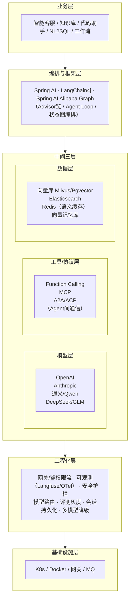

# Agent 开发面试实战 · 总览与学习路径

> 本系列是 **Java 工程师视角的 AI Agent 开发面试指南**。起因是真实面试反馈：现在 Java 后端岗位面试里，AI/Agent 相关问题占比常达一半。本系列把 Agent 开发从「听过概念」带到「能写能讲能上线」，全程以 **Java 生态（Spring AI / LangChain4j）实战 + 高频面试题** 为双主线。

---

## 一、为什么写这个系列

- **市场变了**：2025 年起，「会调大模型 API + 会做 RAG + 会搭 Agent」已成 Java 后端的中高级能力要求，尤其业务向、平台向岗位。面试官不再只问 JVM/并发/MySQL，而会问「你们知识库怎么做的」「RAG 检索不准怎么优化」「Agent 怎么防死循环」。
- **Java 工程师的独特优势**：分布式系统、Spring 生态、工程化经验，正是把 AI Demo 推到生产的关键。Python 生态做原型快，但企业级落地（会话管理、可观测、限流灰度、安全合规）往往回到 Java。所以 Java 工程师学 Agent，不是去和算法工程师拼模型，而是拼 **AI 工程化**。
- **面试痛点**：很多候选人能说概念，但一被追问「你项目里具体怎么实现的」「踩过什么坑」「为什么这么选」就答不上。本系列每章都配 **Java 实战代码 + 生产踩坑 + 面试话术**，目标是让你能讲出「我做过」。

---

## 二、与「13-AI与大模型」的关系（互补不重复）

| 维度 | 13-AI与大模型（已存在） | 本系列 14-Agent开发面试实战 |
|------|----------------------|--------------------------|
| **定位** | AI/Agent 原理科普 | Agent 开发面试实战 |
| **视角** | 通用、语言无关 | Java 工程师视角 |
| **风格** | 概念+原理+对比 | 代码+踩坑+面试题+话术 |
| **深度** | 讲清楚「是什么、为什么」 | 讲清楚「怎么做、怎么调、怎么答」 |
| **独有** | ClaudeCode/Harness、协议生态 | Spring AI、LangChain4j、API调用、系统设计题、面试题精讲 |

> 同一主题（如 RAG、Agent 核心、工程化）两边都会出现，但侧重不同：13 章讲原理，本系列讲 Java 实现与面试答法。建议**先读 13 章建认知，再用本系列练实战和答题**。

---

## 三、28 章大纲（6 篇）

### 第一篇 · 入门与认知
| 章 | 主题 |
|----|------|
| 01 | Agent 开发全景与面试能力地图 |
| 02 | 大模型 API 调用与参数调优 |
| 03 | 提示工程实战与工程化 |
| 04 | 结构化输出与函数调用（Function Calling） |

### 第二篇 · RAG 检索增强
| 章 | 主题 |
|----|------|
| 05 | RAG 基础与离线建库 |
| 06 | RAG 检索与召回优化 |
| 07 | RAG 进阶架构（Self-RAG/GraphRAG/Agentic RAG） |
| 08 | RAG 评测与生产实战 |

### 第三篇 · Agent 核心
| 章 | 主题 |
|----|------|
| 09 | Agent 运行循环与 ReAct 范式 |
| 10 | 上下文工程实战 |
| 11 | 记忆系统设计 |
| 12 | 工具调用工程化 |
| 13 | 自我反思与评估体系 |

### 第四篇 · 框架与编排
| 章 | 主题 |
|----|------|
| 14 | LangChain4j 详解 |
| 15 | Spring AI 详解 |
| 16 | Spring AI Alibaba 与国内生态 |
| 17 | 复杂流程编排（LangGraph 思想 + Java 方案） |
| 18 | 多 Agent 系统实战 |

### 第五篇 · 工程化与生产
| 章 | 主题 |
|----|------|
| 19 | Agent 工程化架构 |
| 20 | 可观测性实战 |
| 21 | 安全与护栏 |
| 22 | 模型路由与降级 |
| 23 | Agent 评测与灰度发布 |
| 24 | 性能与成本优化 |

### 第六篇 · 场景与面试冲刺
| 章 | 主题 |
|----|------|
| 25 | 经典场景实战（客服/知识库/NL2SQL/系统设计） |
| 26 | AI 编码助手与开发提效 |
| 27 | 高频面试题精讲（上）：LLM/RAG/Prompt/Tool |
| 28 | 高频面试题精讲（下）：Agent/MCP/工程化/系统设计 |

---

## 四、学习路径（从入门到精通，建议 6-8 周）

```
第 1 周  入门篇(01-04)        —— 能调 API、写 Prompt、做 Function Calling
         ↓ 你能：用 Spring AI 写一个会调工具的 Demo
第 2-3 周 RAG 篇(05-08)       —— 能搭企业知识库问答
         ↓ 你能：做一个能溯源、可评测的 RAG 系统
第 4 周  Agent 核心(09-13)     —— 理解 Agent 为什么能跑、怎么跑得好
         ↓ 你能：手写 Agent Loop、设计记忆、做反思
第 5 周  框架篇(14-18)        —— 选对框架、编排复杂流程
         ↓ 你能：用 Spring AI / LangChain4j 落地生产 Agent
第 6-7 周 工程化(19-24)       —— 能上线、能运维、能合规
         ↓ 你能：设计 Agent 生产架构、做可观测和安全
第 8 周  冲刺(25-28)          —— 场景 + 面试题突击
         ↓ 你能：答透 AI 面试、做系统设计题
```

- **时间紧（面试在即）**：直接跳 27/28 看面试题，再按薄弱点回查对应章节。
- **想系统学**：按顺序通读，每章的 Java 实战代码动手跑一遍。
- **有 Python 经验**：重点看 14-16（Java 框架）和 19-24（工程化，Java 强项）。

---

## 五、面试能力地图（高频考点分布）

> 面试官最爱问的，按出现频率分层。

### 🔴 必考（几乎每次都问）
- RAG 全流程 + 检索不准怎么优化（05、06）
- Function Calling / 工具调用流程（04、12）
- Agent 是什么、Agent Loop 怎么转（09）
- 大模型幻觉怎么缓解（13 章 01）
- Prompt 怎么写、CoT 是什么（03）
- 你项目里 RAG/Agent 怎么落地的（25）

### 🟠 高频
- 向量数据库选型（05）
- Rerank 为什么需要（06）
- 上下文快满了怎么办（10）
- Agent 记忆怎么实现（11）
- MCP 是什么（04、12、26）
- 多模型路由/降级/成本（22、24）
- Prompt 注入防御（21）
- Agent 怎么评测（13、23）

### 🟡 中频（区分度题，答上来加分）
- GraphRAG / Agentic RAG（07）
- 多 Agent 架构（18）
- 可观测性/Trace（20）
- 安全合规/PII 脱敏（21）
- 灰度发布/回滚（23）
- LangChain4j vs Spring AI 选型（14、15）
- 推理加速 vLLM/量化（24）
- 系统设计：设计一个企业知识库/智能客服（25）

---

## 六、Java Agent 开发技术栈全景



- **模型层**：闭源（OpenAI/Claude/Gemini）+ 开源/国产（Qwen/DeepSeek/GLM/Llama）。国内首选通义/DeepSeek/GLM，合规可私有化。
- **框架层**：Java 两强是 **Spring AI**（Spring 官方，抽象优雅、Advisor 链）和 **LangChain4j**（LangChain 的 Java 版，社区活跃、轻量）。国内场景加 **Spring AI Alibaba**。
- **工具/协议层**：Function Calling 是模型能力，MCP 是工具标准协议。MCP Server 让工具即插即用。
- **数据层**：向量库存 Embedding，Redis 做语义缓存和会话。
- **工程化层**：这是 Java 工程师的主场--网关、限流、可观测、灰度、安全，全是后端老本行。

---

## 七、怎么用这份文档

1. **日常学习**：按学习路径顺序读，每章的 Java 代码动手跑。
2. **面试突击**：直接看 27/28 面试题精讲，按薄弱点回查。
3. **项目落地**：按场景查第二篇（RAG）和第五篇（工程化）。
4. **每章结构统一**：核心概念（通俗）→ Java 实战代码 → 生产踩坑 → 高频面试题（带答案）→ 面试话术。

> ⚠️ AI 生态变化极快（模型版本、框架 API、协议 spec 每月都在变）。本系列聚焦**原理和工程思想**（稳定），具体 API 细节以官方最新文档为准。代码示例基于 2026 年中的主流版本，使用前请核对最新 API。

---

## 八、名词约定（全系列统一）

- **LLM**：大语言模型（Large Language Model）。
- **Agent**：能自主感知-规划-调工具-执行的 AI 系统。
- **RAG**：检索增强生成（Retrieval-Augmented Generation）。
- **MCP**：模型上下文协议（Model Context Protocol），Agent 接工具的标准协议。
- **Function Calling**：模型输出结构化函数调用的能力（模型层），MCP 是协议层。
- **Token**：模型处理的最小单位，计费和上下文长度都按它算。
- **NRT**：近实时（Near Real-Time）。
- **Spring AI**：Spring 官方的 AI 应用框架（本系列主力）。
- **LangChain4j**：LangChain 的 Java 实现（本系列副力）。

---

> 接下来从 01 开始。建议即使有基础也别跳过 01--它建立的是「面试官视角的能力地图」，决定你后面学什么、怎么答。
