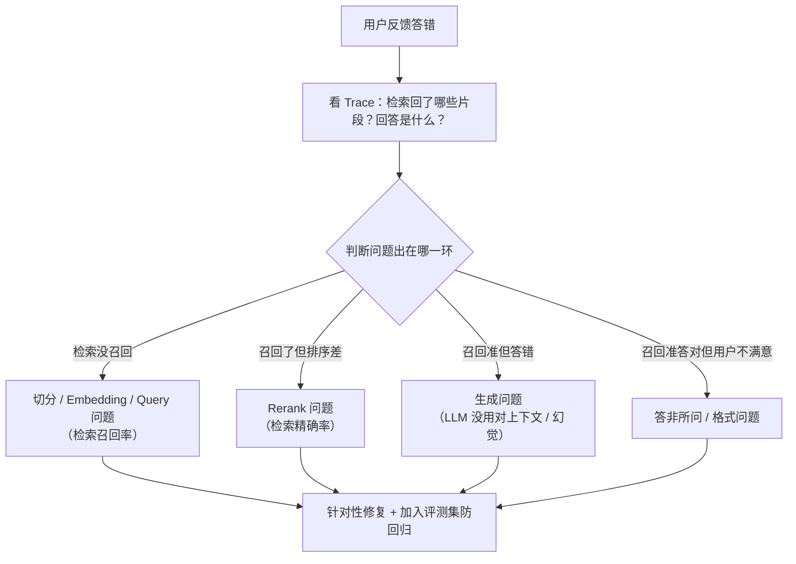

# 08 - RAG 评测与生产实战

> RAG 不是搭完就完，要能评测「好不好」、能定位「为什么差」、能持续优化。本章讲 RAGAS 指标、Bad case 分析、知识库更新、生产踩坑全集。RAG 篇收尾，面试「你项目里 RAG 怎么落地」的弹药库。

---

## 一、RAG 评测：RAGAS 四维指标 ★ 必考

> 不能只靠感觉说「效果好」，要量化。RAGAS（RAG 评测框架）提出四维指标。

### 1.1 四维指标

| 指标 | 含义 | 衡量阶段 | 越高/低 |
|------|------|---------|--------|
| **Context Precision（上下文精确率）** | 检索的片段是否都相关 | 检索 | 越高检索越准 |
| **Context Recall（上下文召回率）** | 所需信息是否都被检索到 | 检索 | 越高检索越全 |
| **Faithfulness（忠实度）** | 回答是否忠于检索内容（不编造） | 生成 | 越高越少幻觉 |
| **Answer Relevancy（答案相关性）** | 回答是否切题 | 生成 | 越高越切题 |

### 1.2 分阶段记忆

- **检索阶段**看 Context Precision / Recall（检索得准不准、全不全）。
- **生成阶段**看 Faithfulness / Answer Relevancy（答得忠不忠、切不切题）。

> 💡 **面试金句**：RAG 瓶颈往往在检索。RAGAS 分两阶段：检索看 Context Precision/Recall，生成看 Faithfulness/Answer Relevancy。检索准了，生成质量自然上来。

### 1.3 怎么算（用 LLM-as-Judge）

- 这些指标大多用 LLM 自动判断：
  - Faithfulness：让 LLM 把回答拆成陈述句，逐句判断是否被检索内容支持。
  - Answer Relevancy：让 LLM 反推「这个回答可能对应什么问题」，和原问题比相似度。
  - Context Recall：用标准答案判断所需信息是否都在检索片段里。
- 需要标注「黄金集」：典型问题 + 期望答案（ground truth）。

### 1.4 Java 侧评测工程

```java
// 思路：跑评测集，调 LLM-as-Judge 算指标
// 1. 准备黄金集（问题+期望答案+相关文档）
// 2. 每个 case 跑 RAG，拿到（检索片段，回答）
// 3. 调强 LLM 判断四维指标
// 4. 汇总统计，对比版本
```

- 生产中常配合 Langfuse/LangSmith（见 20 章）做评测流水线。
- ⚠️ LLM-as-Judge 有偏见，关键指标要抽人工复核。

---

## 二、Bad Case 分析方法论 ★

> 上线后用户反馈「答错了」，怎么定位？这是生产 RAG 的核心能力。

### 2.1 Bad Case 定位流程



### 2.2 四类典型 Bad Case

| 现象 | 根因 | 修复 |
|------|------|------|
| **答非所问** | 检索到不相关片段 | 改 Query 改写、加元数据过滤、提相似度阈值 |
| **编造内容** | 检索为空或不相关，LLM 硬答 | 检索空时坦诚「不知道」，Prompt 强调「只基于上下文」 |
| **信息不全** | 切分切断关键信息 | 改切分（父子块/语义切分） |
| **答了但没引用** | 没要求溯源 | Prompt 要求标注来源，返回片段元数据 |

### 2.3 Bad Case 治理闭环

1. 收集 Bad Case（用户反馈 + 主动抽样）。
2. 分类归因（检索/生成/切分）。
3. 修复 + **加入评测集**（防回归）。
4. 修复后跑评测集验证不退化。
5. 灰度上线。

> 💡 **面试金句**：Bad Case 分析先看 Trace 判断是检索问题还是生成问题。检索没召回改切分/Embedding/Query；召回了但答错是生成问题改 Prompt/模型；关键是要建 Bad Case 库纳入评测集防回归。

---

## 三、知识库更新策略

### 3.1 全量重建

- 适合：Embedding 模型升级、切分策略大改、数据大版本更新。
- 问题：慢、贵（大库重新 Embedding）。
- 一般低频（按月/季）。

### 3.2 增量更新

- 适合：日常文档增删改。
- 策略：
  - 文档 hash/version 判断是否变更。
  - 变更则删该文档旧 chunk + 加新 chunk。
  - 删除文档则删其所有 chunk。
- 需要 chunk 关联文档 ID 便于批量删。

### 3.3 时间分区与 TTL

- 时序数据（日志/周报）按时间分区，过期数据整体失效（类似 ES ILM）。
- 减少向量库膨胀，控成本。

---

## 四、引用溯源 ★ 生产必备

### 4.1 为什么溯源

- 用户不信任无来源的回答（「凭什么这么答」）。
- 合规要求：金融/法律/政企场景必须可溯源。
- 溯源还能让用户点击查看原文，提升信任。

### 4.2 怎么实现

- 检索时保留每个片段的元数据（来源文档、页码、URL）。
- Prompt 要求模型在回答中标注引用（如 `[1]`）。
- 返回时把引用片段一起返回给前端，前端可点击跳转。

```java
// 检索结果带元数据
List<Document> docs = vectorStore.similaritySearch(req);
// docs.get(i).getMetadata() 含 source/page
// Prompt: 请基于以下资料回答，每个论断后标注来源[1][2]
// 返回前端时附上引用片段列表
```

---

## 五、生产踩坑全集

1. **切分丢语义**：固定长度切断关键信息。改用语义/递归/父子块切分。
2. **召不回**：Query 和文档风格差/Embedding 不匹配/专有名词。改查询改写、HyDE、混合检索。
3. **召回太多超窗口**：Top-K 太大塞爆 Prompt。Rerank 后取 5~10 + 上下文压缩。
4. **回答不带引用**：没法溯源。Prompt 要求标注来源 + 返回片段元数据。
5. **检索空硬答幻觉**：检索为空时 LLM 仍编。检索空要返回「知识库无相关信息」而非硬答。
6. **多语言混库**：中英文混在一个向量空间检索差。分库或用多语言 Embedding。
7. **知识库不更新**：文档改了但库没更新，答的是旧信息。建增量更新机制。
8. **没有评测就改**：改切分/Embedding 没跑评测，不知道好没好。改前必跑黄金集。
9. **LLM 不用上下文**：检索片段给了但 LLM 用训练知识答。Prompt 强调「只基于以下资料，不知道就说不知道」+ 降温度。
10. **成本失控**：大库全量 Embedding、每次检索 Top-100、Rerank 全量。控 Top-K、缓存、增量更新。

---

## 六、常见面试题

1. **RAGAS 四个指标分别衡量什么？**
   Context Precision/Recall 衡量检索阶段（检索得准不准、全不全），Faithfulness/Answer Relevancy 衡量生成阶段（答得忠不忠、切不切题）。瓶颈常在检索。

2. **RAG 答错了怎么定位？**
   看 Trace 判断是检索还是生成问题。检索没召回：切分/Embedding/Query 问题；召回了答错：生成问题改 Prompt/模型；召回了但答非所问：改 Query 改写。Bad Case 要纳入评测集防回归。

3. **RAG 评测怎么做？**
   建黄金测试集（问题+期望答案+相关文档），每个 case 跑 RAG 拿（检索片段、回答），用 LLM-as-Judge 算 RAGAS 四指标，汇总对比版本。LLM-as-Judge 有偏见，关键指标人工复核。

4. **知识库怎么更新？**
   全量重建（Embedding 升级/大改时，低频）+ 增量更新（日常，文档 hash 判断变更，删旧 chunk 加新 chunk）+ 时序分区 TTL（过期数据整体失效）。

5. **RAG 回答怎么溯源？**
   检索时保留片段元数据（来源/页码/URL），Prompt 要求模型标注引用[1][2]，返回时附引用片段列表给前端可点击查看。金融/法律等合规场景必备。

6. **检索为空模型还在编答案怎么办？**
   检索空时拦截，返回「知识库无相关信息」而非让 LLM 硬答。Prompt 强调「只基于以下资料，无依据就说不知道」，配合降温度。

7. **怎么控制 RAG 成本？**
   控 Top-K（Rerank 后取 5~10）、上下文压缩、语义缓存（相似 Query 复用结果）、增量更新（不全量重建）、小模型做 Embedding/Rerank、批处理 API。

8. **你项目里 RAG 怎么落地的？踩过什么坑？**
   （参考，按你实际调整）文档 Tika 加载->递归切分 500 token+重叠->通义 Embedding->Milvus(HNSW)。检索：查询改写+混合检索+Rerank+元数据过滤。踩过切分切断表格（改结构切分）、专有名词召不回（加混合检索）的坑。评测用 RAGAS 黄金集，Bad Case 纳入防回归。

---

## 七、资料勘误与重点提醒

1. **「RAGAS 指标用规则算」是错的**：RAGAS 四指标大多用 LLM-as-Judge 判断（如 Faithfulness 让 LLM 逐句判断是否被支持），不是纯规则。资料偶尔说成「公式计算」误导。
2. **「检索准了 RAG 就好」不全面**：检索是瓶颈但不唯一。生成阶段 Faithfulness/Answer Relevancy 也要关注（LLM 可能不用上下文硬答）。两阶段都要评测。
3. **「Bad Case 改了就行」漏了回归**：资料讲修复不讲回归。Bad Case 必须纳入评测集防退化，否则改一个坏两个。
4. **「知识库更新就是重新建」低效**：资料常只讲全量重建。生产要增量更新（hash 判断变更）+ 时序 TTL，全量重建太贵。
5. **「溯源就是返回来源」不够**：溯源要在回答里标注引用 + 返回片段元数据 + 前端可点击。只返回来源不可点击不算完整溯源。
6. **「检索空让模型自己答」是严重坑**：资料示例常默认检索有结果。实际检索空时若不拦截，LLM 会用训练知识硬答导致幻觉。必须空结果拦截返回「不知道」。

---

> 第二篇 RAG 完结。你已能搭、能调、能评测、能排障一个 RAG 系统。下一篇「第三篇 Agent 核心」讲 Agent 怎么跑起来、记忆、工具、反思--Agent 的灵魂。
