# 02 - 缓存与消息队列场景题

> 📌 **一句话理解**：缓存场景的核心矛盾是"缓存与 DB 不一致 + 高并发瞬间打垮 DB"（穿透/击穿/雪崩/热 key/大 key），消息队列场景的核心矛盾是"消息丢失 / 重复 / 乱序 / 堆积"。解题套路高度统一：**缓存侧靠"拦截 + 锁 + 兜底 + 降级"，MQ 侧靠"三端保障（生产确认 / Broker 持久化 / 消费手动 ACK）+ 幂等 + 顺序路由 + 堆积治理"**。

---

## 缓存场景

### 场景1：缓存穿透（查不存在的数据打 DB）

**场景描述**

黑客或爬虫用大量**不存在的 key**（如负数 id、随机字符串）疯狂请求接口。这些 key 在 Redis 中查不到，于是全部打到 DB，DB 也查不到，每次都回源。缓存形同虚设，DB 被打满。

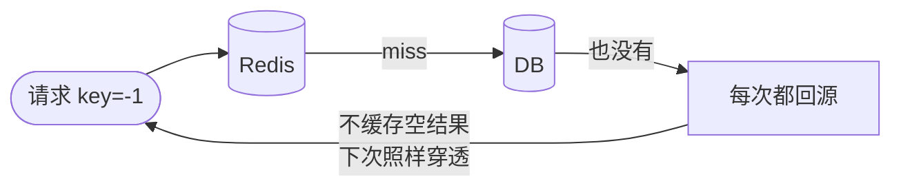

**问题分析**

1. key 在缓存和 DB 中都不存在，缓存永远无法命中。
2. 每次请求都穿透到 DB，高并发下 DB 连接数飙升、CPU 打满。
3. 常见诱因：恶意攻击、爬虫遍历不存在的 id、业务删除后未处理。

**解决方案**

| 方案 | 做法 | 优点 | 缺点 | 适用 |
|------|------|------|------|------|
| 缓存空值 | DB 查不到也缓存 `NULL`（短 TTL，如 60s） | 简单直接、实现成本低 | 浪费内存存空值、短 TTL 期间仍可能少量穿透 | key 种类有限、可枚举 |
| 布隆过滤器 | 请求前先查布隆过滤器，不存在直接拒绝 | 内存极省、查询 O(k) | 有误判（假阳性）、不能删除（计数布隆可删） | key 海量、要求高吞吐 |
| 接入层拦截 | 网关 / 拦截器对非法参数（负 id、超长串）直接拒绝 | 治本、防恶意流量 | 只能拦规则内的请求 | 参数可规则化校验 |

布隆过滤器流程：

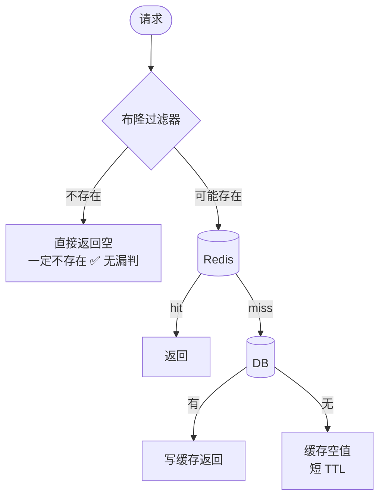

```java
// Redisson 布隆过滤器
RBloomFilter<Long> bloomFilter = redisson.getBloomFilter("user:bloom");
bloomFilter.tryInit(1_000_000L, 0.01);   // 容量100万，误判率1%
// 启动时或 DB 写入时把所有有效 id 加入
bloomFilter.add(userId);
// 请求时先过滤
if (!bloomFilter.contains(userId)) {
    return null;   // 一定不存在，直接拒绝
}
```

> ⚠️ 易错点/陷阱：布隆过滤器**只有误判（假阳性，说存在实际不存在），没有漏判**（说不存在就一定不存在）。所以"不存在直接返回"是安全的，但"可能存在"仍需回源。误判率设置越低，hash 函数和位数越多，内存越大。另外经典布隆过滤器**不支持删除**，数据变更时要用计数布隆或布谷鸟过滤器。

---

### 场景2：缓存击穿（热点 key 过期瞬间打 DB）

**场景描述**

某个**热点 key**（如秒杀商品详情、首页 Banner）过期的瞬间，成千上万个并发请求同时 miss，同时回源 DB，瞬间把 DB 打垮。区别于雪崩：击穿是**单个热点 key**，雪崩是**大量 key 同时失效**。

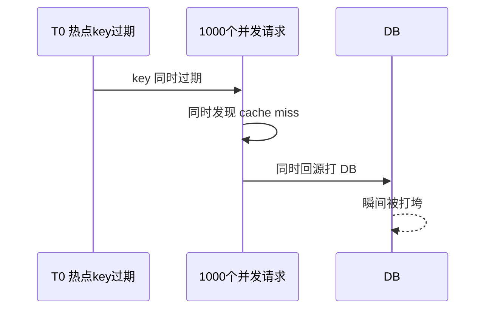

**问题分析**

1. 热点 key 过期是触发点，过期后第一个回源请求还没写回缓存，后续请求全部穿透。
2. 高并发下"查 DB + 写缓存"不是原子的，N 个请求重复执行 N 次。
3. 与穿透区别：穿透是 key **压根不存在**，击穿是 key **存在但刚过期**。

**解决方案**

| 方案 | 做法 | 优点 | 缺点 | 适用 |
|------|------|------|------|------|
| 互斥锁（重建锁） | cache miss 后用 `SETNX` 抢锁，只有一个线程查 DB 重建，其余等待重试 | 简单可靠、保证一致性 | 增加等待延迟、锁有死锁风险需 TTL | 一般场景首选 |
| 逻辑过期 | 缓存值带逻辑过期时间，过期不删数据，由发现者异步重建，期间返回旧值 | 不阻塞、不穿透 | 短暂数据不一致、实现复杂 | 强高可用、可容忍旧值 |
| 热点 key 永不过期 | 物理上不设 TTL，靠后台任务定期更新 | 彻底避免击穿 | 数据非实时、需主动维护 | 超级热点（首页/配置） |

互斥锁重建流程：

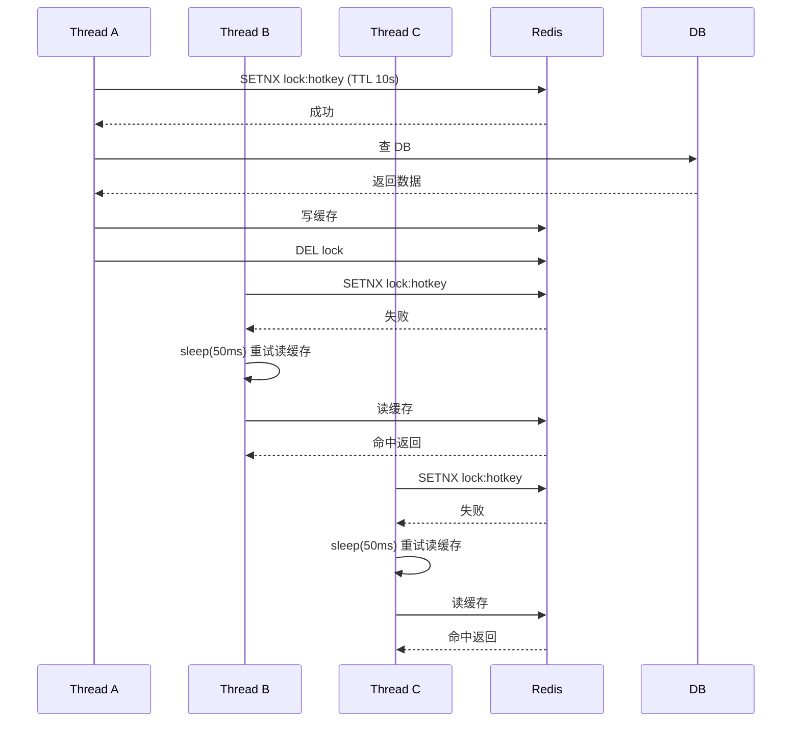

```java
public String getWithMutex(String key) {
    String val = redis.get(key);
    if (val != null) return val;
    // 抢互斥锁
    String lockKey = "lock:" + key;
    if (redis.setnx(lockKey, "1", 10, SECONDS)) {
        try {
            val = redis.get(key);            // 双重检查
            if (val != null) return val;
            val = db.query(key);             // 回源
            redis.set(key, val, 30, MINUTES);
            return val;
        } finally {
            redis.del(lockKey);              // 释放锁（注意要用 Lua 保证原子）
        }
    } else {
        Thread.sleep(50);                    // 短暂等待后重试
        return getWithMutex(key);
    }
}
```

> ⚠️ 易错点/陷阱：互斥锁释放必须用 Lua 脚本判断 value（防止超时后误删别人的锁），和分布式锁同理。"逻辑过期"返回的是**旧值**，业务必须能容忍短暂不一致（如商品库存不能这样）。"永不过期"不是真的不更新，而是不依赖 TTL 自动过期，靠主动刷新。

---

### 场景3：缓存雪崩（大量 key 同时过期或 Redis 宕机）

**场景描述**

两种情况都会雪崩：① 大量 key **同一时刻过期**（如批量预热的 key 设了相同 TTL）；② **Redis 整体宕机**（主节点挂了且未故障转移）。瞬间所有请求打到 DB，DB 被压垮，进而引发整个服务雪崩。

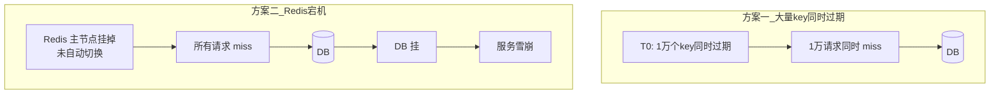

**问题分析**

1. 过期时间相同是直接原因（如批量预热时 `expire(key, 3600)` 全用 3600）。
2. Redis 单点 / 集群整体不可用是另一类原因。
3. 雪崩影响面比击穿大得多（击穿是单 key，雪崩是大面积）。

**解决方案**

| 诱因 | 方案 | 做法 |
|------|------|------|
| 大量 key 同时过期 | 过期时间加随机 | `TTL = base + random(0, 300s)`，打散过期时间点 |
| 大量 key 同时过期 | 多级缓存 | 本地缓存（Caffeine）+ Redis，本地缓存兜底 |
| Redis 宕机 | Redis 集群高可用 | 哨兵 / Cluster 主从自动故障转移 |
| Redis 宕机 | 熔断降级 | 对回源 DB 加限流/熔断（Sentinel），失败返回降级值 |
| Redis 宕机 | 服务降级 | 直接返回默认值 / 静态页 / 排队 |

```java
// 过期时间加随机，避免同时失效
int ttl = 3600 + ThreadLocalRandom.current().nextInt(300);
redis.set(key, val, ttl, SECONDS);

// 多级缓存（Caffeine + Redis）
@Cacheable(value = "user", key = "#id", cacheManager = "caffeineCacheManager")  // L1 本地
public User getUser(Long id) {
    User u = redis.get("user:" + id);   // L2 Redis
    if (u != null) return u;
    u = db.query(id);
    if (u != null) redis.set("user:" + id, u, 3600, SECONDS);
    return u;
}
```

> ⚠️ 易错点/陷阱：雪崩 vs 击穿 vs 穿透要分清——**穿透是 key 不存在，击穿是单热点 key 过期，雪崩是大面积 key 过期或 Redis 挂**。三者解法不同：穿透靠布隆/空值，击穿靠锁/逻辑过期，雪崩靠打散 TTL + 高可用 + 熔断。熔断降级是雪崩的最后一道防线，不能省。

---

### 场景4：DB 与缓存一致性（先更新 DB 再删缓存 vs 先删缓存再更新 DB）

**场景描述**

读写分离 + 缓存架构下，DB 和缓存是两个独立存储，无法做分布式事务，必然存在**短暂不一致**。面试高频：到底先动 DB 还是先动缓存？为什么是**删缓存**而不是**更新缓存**？并发下有哪些脏读？

**问题分析**

1. 缓存与 DB 是两个系统，写操作无法原子完成，中间必有时间窗口。
2. "更新缓存" vs "删缓存"：更新缓存在并发下易脏写，且部分缓存值计算成本高。
3. 操作顺序不同，并发异常场景不同。

**方案对比**

| 方案 | 流程 | 并发风险 | 推荐 |
|------|------|----------|------|
| 先更新缓存再更新 DB | 写缓存 → 写 DB | DB 写失败则缓存与 DB 不一致 | ❌ 不推荐 |
| 先更新 DB 再更新缓存 | 写 DB → 写缓存 | 并发写：A 先写 DB 但后写缓存，B 后写 DB 但先写缓存 → 缓存是 A 的旧值 | ❌ 不推荐 |
| 先删缓存再更新 DB | 删缓存 → 写 DB | **删后另一线程读旧 DB 回写缓存 → 长期脏数据** | ⚠️ 有坑 |
| **先更新 DB 再删缓存**（Cache Aside） | 写 DB → 删缓存 | 极端并发：A 读旧 DB（miss），B 写新 DB 删缓存，A 写旧值回缓存 → 罕见且可被读覆盖 | ✅ 推荐 |
| 延迟双删 | 删缓存 → 写 DB → sleep(N) → 再删缓存 | 缓解"先删后写"的脏读问题 | ✅ 配合主从 |

为什么推荐"先更新 DB 再删缓存"：

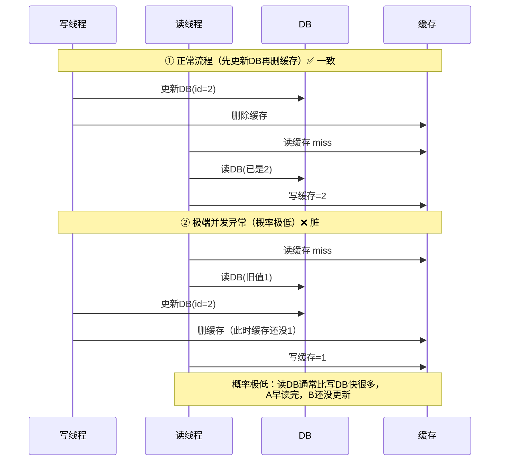

为什么是"删缓存"而不是"更新缓存"：

1. **并发脏写**：两个写并发更新缓存，乱序会导致缓存停留在旧值（见上表第 2 行）。
2. **计算成本**：有些缓存值需复杂计算（聚合多表），每次写都重算浪费。删缓存让下次读时按需重建，懒加载。
3. **一致性更易保证**：删除是幂等的，多次删结果一样；更新需保证最后一次写对。

延迟双删（针对"先删缓存再更新 DB"的脏读）：

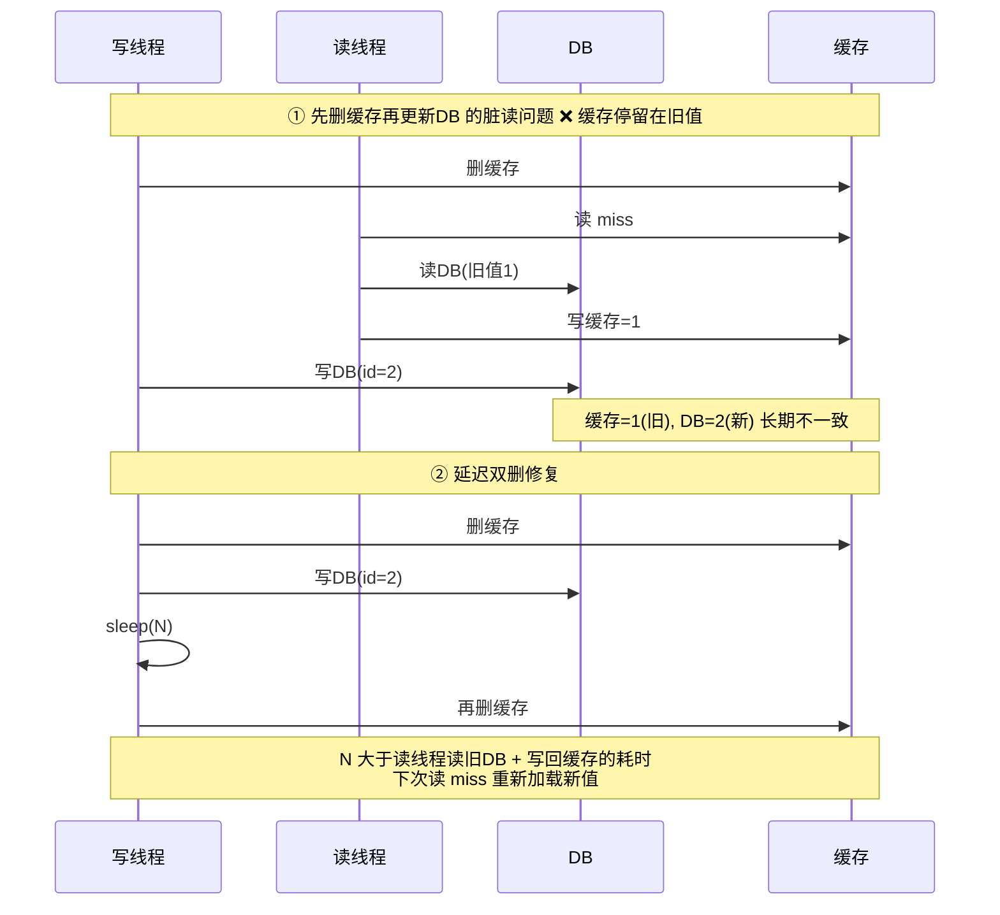

```java
// 延迟双删实现
public void updateWithDoubleDelete(Long id, User newUser) {
    redis.del("user:" + id);                 // 第一次删
    db.update(id, newUser);                  // 更新DB
    // 异步延迟第二次删（避免阻塞主线程）
    scheduler.schedule(() -> {
        redis.del("user:" + id);             // 第二次删
    }, 500, MILLISECONDS);                   // N 取决于读DB耗时 + 余量
}
```

> ⚠️ 易错点/陷阱：① 推荐的是**先更新 DB 再删缓存**（Cache Aside），不是更新缓存。② 延迟双删的"延迟"不是随便多删一次，而是**等读请求把旧值写回缓存后再删**，N 要大于读 DB + 写缓存的耗时（通常 500ms~1s，或基于主从同步延迟）。③ "先删缓存再更新 DB"在并发下有脏读：删后另一线程读旧 DB 回写缓存，导致缓存长期停留在旧值。④ 即便用"先更新 DB 再删缓存"，若删缓存失败也会不一致，需配合**重试 + 消息队列补偿**（删缓存失败发消息，消费者重试删）。

---

### 场景5：缓存热 key / 大 key 问题

**场景描述**

- **热 key**：某个 key 访问量极高（如明星热搜、秒杀商品），单节点 Redis 成为瓶颈，CPU 打满、网卡打满。
- **大 key**：单个 key 的 value 过大（如一个 List 存了 10 万元素，一个 Hash 几十 MB），导致：① 读写阻塞（单条命令耗时）；② 网络带宽打满；③ 删除时阻塞（Redis 4.0 前 `DEL` 大 key 是同步阻塞主线程）；④ 内存倾斜（集群中某分片过载）。

**问题分析**

1. 热 key：集中访问压垮单分片，本质是负载不均。
2. 大 key：单条命令耗时长，阻塞 Redis 单线程模型，影响其他请求。
3. 两者都可能引发 Redis 延迟突刺、连接超时。

**解决方案**

热 key：

| 方案 | 做法 | 适用 |
|------|------|------|
| 本地缓存 | 应用侧 Caffeine 缓存热 key，减少 Redis 访问 | 读多写少、可容忍秒级不一致 |
| 多副本 / 分片读 | 把热 key 复制到多个 Redis 节点，读时随机选节点 | key 不可拆分 |
| 读写分离 | 读走从节点，写主节点 | 读远大于写 |
| 限流 / 排队 | 对热 key 访问加限流，超过阈值排队 | 防止压垮下游 |

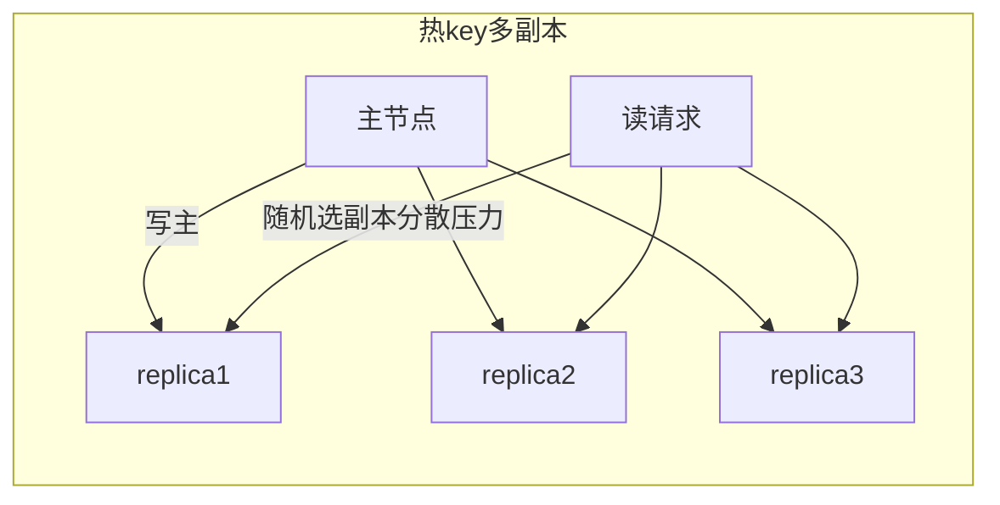

大 key：

| 方案 | 做法 |
|------|------|
| 拆分 | 大 Hash 按字段拆成多个小 key；大 List 按段拆（list:0, list:1...） |
| 压缩 | value 用压缩算法（Snappy/LZ4） |
| 异步删除 | Redis 4.0+ 用 `UNLINK` 异步删，避免阻塞主线程 |
| 监控 | `redis-cli --bigkeys` / `MEMORY USAGE` 巡检 |

> ⚠️ 易错点/陷阱：① 删除大 key 必须用 `UNLINK`（4.0+）或分批 `HSCAN + HDEL`，**不要用 `DEL`**（同步阻塞主线程，几十 MB 的 key 可能阻塞数百 ms）。② 热 key 多副本会引入**副本间一致性**问题，写主后副本同步有延迟，读到旧值。③ 大 key 拆分后业务需感知分段逻辑，查询要聚合多段。④ 不要把大 key 留到线上才发现，**开发期就应限制单个 key 大小**（如单 key 不超 10KB，List/Hash 元素数上限）。

---

### 场景6：缓存与 DB 双写强一致性场景如何设计

**场景描述**

金融、库存、账户等场景对一致性要求高，单纯的"最终一致"不够。问：如何设计才能让缓存和 DB 尽可能一致？有哪些保证手段？

**问题分析**

1. 缓存和 DB 是两个系统，无法强一致（无分布式事务），只能做到**最终一致**或**读时修复**。
2. 强一致的根因问题：写 DB 和删缓存之间有时间窗口。
3. 真正"强一致"要么不用缓存（直读 DB），要么用**事务消息 + 读时校验**。

**解决方案**

| 一致性级别 | 方案 | 做法 | 适用 |
|-----------|------|------|------|
| 最终一致（推荐） | Cache Aside + 失败重试 | 先更新 DB 再删缓存，删失败走 MQ 重试 | 大多数业务 |
| 最终一致增强 | 延迟双删 + 消息补偿 | 双删 + 订阅 binlog 异步删缓存 | 主从延迟场景 |
| 强一致（读时校验） | 读缓存带版本号 + DB 校验 | 缓存存 version，读后与 DB version 比对，不一致则回源 | 偶发强一致读 |
| 强一致（事务消息） | RocketMQ 事务消息 | DB 提交与消息发送原子化，消费者删缓存 | 高一致要求 |
| 强一致（放弃缓存） | 关键路径直读 DB | 强一致字段不缓存，只缓存派生数据 | 金融账户 |

Cache Aside Pattern（旁路缓存，最常用）：

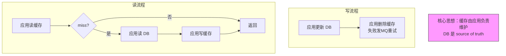

binlog 订阅异步删缓存（最终一致增强）：

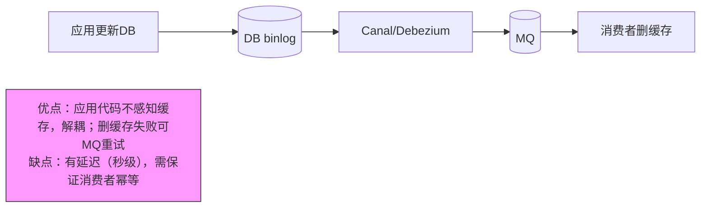

> ⚠️ 易错点/陷阱：① **没有真正的"缓存与 DB 强一致"**，除非不用缓存或用分布式事务（代价极高）。所谓"强一致方案"都是"最终一致 + 读时校验/补偿"。② Cache Aside 的本质是**应用负责维护缓存，DB 是唯一数据源**，不要让 DB 触发器或存储过程去管缓存。③ 若 DB 与缓存不一致，**以 DB 为准**，缓存可随时重建——所以"删缓存"是安全的，"更新缓存"反而危险。④ 强一致场景（如扣减库存）建议**直接操作 DB + 乐观锁**，不引入缓存层，避免一致性风险。

---

## 消息队列场景

### 场景7：MQ 消息丢失（生产者 / Broker / 消费者三端）

**场景描述**

消息从生产到消费经过三个环节，每个环节都可能丢消息：① 生产者到 Broker 传输丢失；② Broker 自身宕机丢消息；③ 消费者处理失败丢消息。问：如何保证消息不丢？

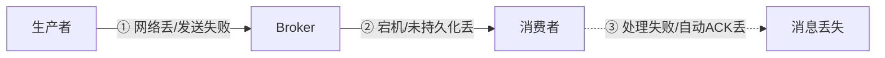

**问题分析**

1. 生产端：网络抖动、发送超时、未确认就认为成功。
2. Broker 端：消息在内存未刷盘、副本未同步就宕机。
3. 消费端：自动 ACK 后业务处理失败，消息就丢了。

**三端保障方案**

| 环节 | Kafka | RocketMQ | 关键点 |
|------|-------|----------|--------|
| 生产者 | `acks=all` + 重试 + 回调确认 | 同步发送 / 异步回调确认 | 必须等 Broker 确认 |
| Broker | 副本（replication） + `min.insync.replicas` + 持久化 | 同步刷盘 + 主从同步副本 | 多副本 + 刷盘策略 |
| 消费者 | 关闭自动提交，处理完手动提交 offset | 手动 ACK（`MessageListener` 返回状态） | 处理成功后再 ACK |

生产者端：

```java
// Kafka: acks=all 等所有 ISR 确认
props.put("acks", "all");
props.put("retries", Integer.MAX_VALUE);
props.put("enable.idempotence", "true");   // 幂等生产者，避免重试导致重复
producer.send(record, (metadata, e) -> {
    if (e != null) {
        log.error("发送失败，落库待补偿", e);
        // 失败时落本地表，后台任务重试
    }
});

// RocketMQ: 同步发送 + 重试
SendResult result = producer.send(msg);
if (result.getSendStatus() != SEND_OK) {
    // 重试或落库补偿
}
```

Broker 端：

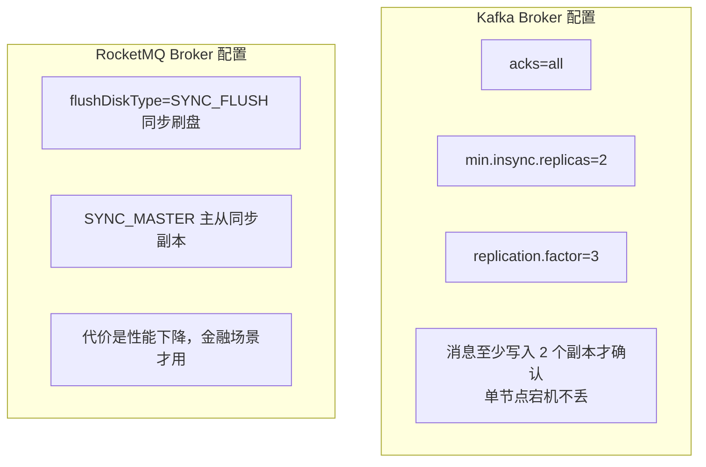

消费者端：

```java
// Kafka: 关闭自动提交，处理完手动提交
props.put("enable.auto.commit", "false");
consumer.subscribe(topic);
for (ConsumerRecord<String, String> r : records) {
    process(r);                  // 先处理业务
    // 处理成功后提交 offset
}
consumer.commitSync();           // 手动提交

// RocketMQ: 返回消费状态
consumer.registerMessageListener((msgs, context) -> {
    try {
        process(msgs);
        return ConsumeConcurrentlyStatus.CONSUME_SUCCESS;  // 成功才ACK
    } catch (Exception e) {
        return ConsumeConcurrentlyStatus.RECONSUME_LATER;  // 失败稍后重试
    }
});
```

> ⚠️ 易错点/陷阱：① **手动 ACK 必须配合幂等**——若处理失败不 ACK，Broker 会重投，导致重复消费；若处理成功但 ACK 前宕机，重启后也会重投。② "自动 ACK"（Kafka 自动提交 offset / RocketMQ 拉取即消费）是最容易丢消息的方式，生产环境必须关掉。③ 同步刷盘 + 同步副本性能代价大，只在金融等强可靠场景用，普通业务用异步刷盘 + 多副本即可。④ 生产者 `acks=all` 在 Kafka 中要求 `min.insync.replicas` 个副本存活才确认，副本不足时生产会被阻塞或抛异常。

---

### 场景8：MQ 消息重复消费（幂等设计）

**场景描述**

MQ 的语义大多是 **at-least-once**（至少一次），即消息可能重复投递：① 生产者重试（没收到 ACK 又发一次）；② 消费者处理成功但 ACK 前宕机，重启后重投；③ Rebalance 时 offset 未提交。问：如何保证重复消费不影响业务？

**问题分析**

1. 网络抖动、ACK 丢失、消费者重启都会导致重复。
2. MQ 本身难以做到 exactly-once（Kafka 事务/幂等生产者只能保证生产端，消费端仍需幂等）。
3. 根本解法：**消费端幂等**。

**幂等方案**

| 方案 | 做法 | 优点 | 缺点 | 适用 |
|------|------|------|------|------|
| 唯一 ID + 去重表 | 消费前查去重表，已处理则跳过 | 通用、可靠 | 依赖 DB、有查询开销 | 通用 |
| Redis setnx | `SETNX msgId` 成功才处理 | 高性能 | Redis 故障时失效（需兜底） | 高并发 |
| 数据库唯一索引 | 业务表对业务 ID 建唯一索引，重复插入报错 | 复用业务表 | 只适用于插入场景 | 写入类 |
| 状态机 | 业务状态流转校验（如订单 待支付→已支付） | 业务语义强 | 仅限有状态业务 | 订单/工单 |
| 乐观锁 | `UPDATE ... WHERE version=x` | 并发安全 | 需 version 字段 | 更新类 |

```java
// 唯一ID + Redis setnx 幂等
public void consume(String msgId, OrderMsg msg) {
    // 1. setnx 抢占，TTL 略大于业务处理时间
    Boolean ok = redis.setnx("idempotent:" + msgId, "1", 24, HOURS);
    if (!ok) {
        log.info("消息已处理，跳过: {}", msgId);
        return;
    }
    try {
        processOrder(msg);                // 业务处理
    } catch (Exception e) {
        redis.del("idempotent:" + msgId); // 处理失败回滚标记，允许重试
        throw e;
    }
}

// 数据库唯一索引幂等（插入类）
try {
    orderMapper.insert(order);            // orderNo 唯一索引
} catch (DuplicateKeyException e) {
    log.info("订单已存在，幂等返回");
}
```

> ⚠️ 易错点/陷阱：① **手动 ACK 不 ACK 都会重复**——ACK 前宕机会重投，所以幂等是必须的，不是可选的。② Redis setnx 做幂等要注意 TTL：太短（小于业务处理 + 重投间隔）会失效，太长占内存。③ 去重表方案要考虑**清理策略**（定时删历史记录）。④ "数据库唯一索引"是最稳的幂等，因为它依赖 DB 的 ACID，但只适用于插入。⑤ 状态机幂等要求业务有明确状态流转，且**状态流转必须是单向的**（如已支付不能再变回待支付）。

---

### 场景9：MQ 消息顺序性

**场景描述**

业务要求消息按顺序处理（如订单：创建→支付→发货→完成）。但 MQ 多队列并行消费，消息可能乱序。问：如何保证消息顺序？

**问题分析**

1. 全局有序需要单队列单消费者，吞吐极低。
2. 实际只需**分区内有序**（同一业务 key 的消息有序）。
3. 乱序来源：多队列并发发送、消费者多线程处理、Rebalance。

**解决方案**

```mermaid
graph TB
    subgraph 发送端
        S1[msg.setKey(orderId)] --> S2[queue = hash(orderId) % queueCount<br/>同一 orderId 进同一 queue]
    end
    subgraph 消费端
        C1[一个 queue 只被一个消费者实例消费] --> C2[该实例内串行处理<br/>不开多线程]
    end
    Note["核心原则：同一业务 key 进同一队列，单队列单消费者串行消费"]:::note
    classDef note fill:#f9f,stroke:#333,stroke-width:1px
```

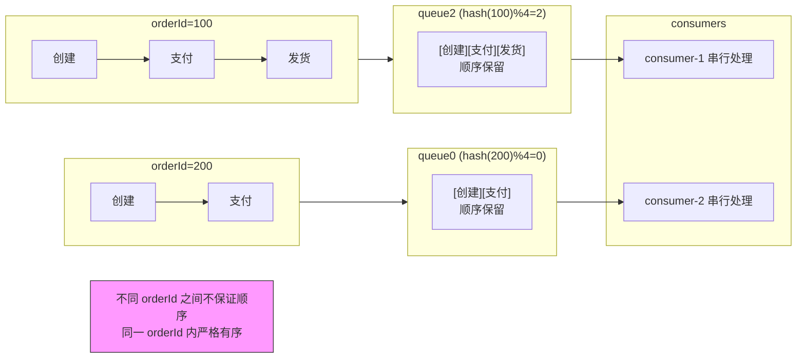

```java
// RocketMQ: 用 MessageQueueSelector 按 key 选 queue
producer.send(msg, (mqs, m, arg) -> {
    Long orderId = (Long) arg;
    return mqs.get(Math.toIntExact(orderId % mqs.size()));   // 同一orderId同一queue
}, orderId);

// RocketMQ 消费端: MessageListenerOrderly 顺序消费（会对queue加锁）
consumer.registerMessageListener((List<MessageExt> msgs, ConsumeOrderlyContext ctx) -> {
    for (MessageExt m : msgs) {
        process(m);   // 串行处理，同queue内有序
    }
    return ConsumeOrderlyStatus.SUCCESS;
});
```

Kafka 与 RocketMQ 顺序消息实现差异：

| 维度 | Kafka | RocketMQ |
|------|-------|----------|
| 发送端 | 按 key hash 选 partition（Producer 默认行为） | `MessageQueueSelector` 手动选 queue |
| 分区内有序 | partition 内天然有序 | queue 内天然有序 |
| 消费端顺序 | 一个 partition 只被消费组内一个消费者消费（天然单消费者） | `MessageListenerOrderly` 会对 queue 加锁，保证串行消费 |
| 消费端多线程 | 拉取有序，但若应用多线程处理需自行按 key 分发 | `Orderly` 模式框架保证串行，无需应用处理 |
| 全局顺序 | 用单 partition（牺牲并发） | 用单 queue（MessageQueueSelector 选 queue0） |
| 锁粒度 | 消费者拉取级，无显式锁 | Broker 端分布式锁 + 本地锁，锁 queue |

> ⚠️ 易错点/陷阱：① **消息顺序只能在同一队列/分区内保证，不能跨队列保证全局顺序**。要全局有序只能单队列单消费者，吞吐极低。② 消费顺序消息时**不能多线程并发处理**，否则同 queue 内仍会乱序——RocketMQ 的 `MessageListenerOrderly` 已串行，Kafka 拉取有序但若应用开线程池需按 key hash 分发到同一线程。③ 顺序消费时若某条消息处理失败，**不能跳过**，否则后续全部错位（RocketMQ 会暂停该 queue 等重试，Kafka 需自己控制）。④ 顺序消费会**降低吞吐**，只对真正需要顺序的业务（订单状态机）开启。

---

### 场景10：MQ 消息堆积

**场景描述**

消费者处理速度跟不上生产速度，消息在 Broker 积压，积压到磁盘满或内存满，Broker 拒收新消息。常见诱因：消费者宕机、消费逻辑变慢（如 DB 慢查询）、突发流量。

**问题分析**

1. 生产速率 > 消费速率，持续累积。
2. 积压会引发：磁盘满、消息过期被删、消费者追不上 lag 越来越大。
3. 治理思路：提升消费速率 或 降低生产速率。

**解决方案**

| 紧急程度 | 方案 | 做法 |
|---------|------|------|
| 应急 | 扩消费者实例 | 增加消费者数量（≤ 队列/分区数，超过无效） |
| 应急 | 扩队列/分区 | 队列数不足时先扩分区，再扩消费者 |
| 应急 | 临时 Topic 转发 | 消费者只做转发到多个新 Topic，新 Topic 多分区多消费者并行消化 |
| 应急 | 降级 / 限流 | 非核心消息丢弃 / 限流生产端 |
| 优化 | 批量消费 | 单次拉多条批量处理，减少 RPC 开销 |
| 优化 | 异步化 | 消费内把耗时操作异步化（落库后异步发通知） |
| 优化 | 提升单条处理速度 | 优化 DB 索引、减少外部调用、引入缓存 |

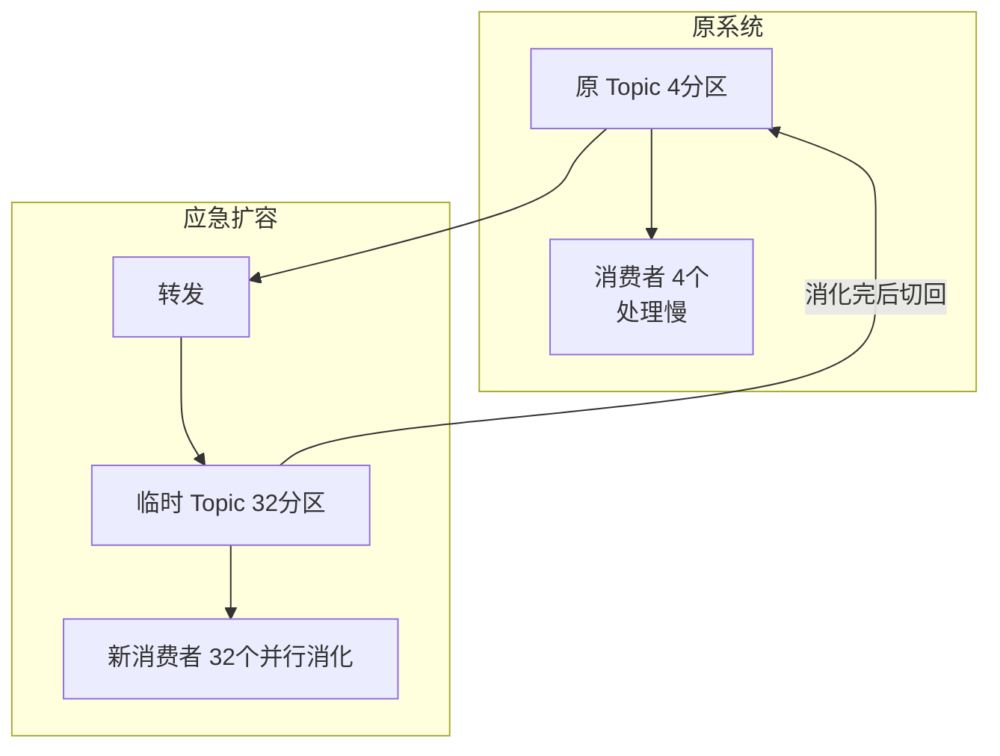

```java
// 批量消费提升吞吐
consumer.setMaxPollRecords(500);   // Kafka 单次拉500条
List<ConsumerRecord> batch = new ArrayList<>();
for (ConsumerRecord r : records) {
    batch.add(r);
    if (batch.size() >= 500) {
        batchInsert(batch);        // 批量入库，减少DB交互
        batch.clear();
    }
}
consumer.commitSync();
```

> ⚠️ 易错点/陷阱：① **扩消费者实例数不能超过队列/分区数**——Kafka 一个 partition 只能被消费组内一个消费者消费，partition=4 时扩到 8 个消费者，多出的 4 个闲置。② 应急时若消息有 TTL，堆积可能让消息**超时被删**，造成业务丢失，需先评估 TTL。③ "临时 Topic 转发法"会改变消息顺序，仅适用于无顺序要求的场景。④ 堆积根因往往是**消费端慢**（DB 慢查询、外部依赖超时），扩消费者是治标，优化消费逻辑才是治本。⑤ 监控 lag 是必须的，发现 lag 持续增长要及时告警。

---

### 场景11：MQ 延迟消息 / 定时任务

**场景描述**

业务需要"30 分钟后未支付自动取消订单"、"下单后 1 小时发提醒"。如何用 MQ 实现延迟消息？对比：定时任务扫表 vs MQ 延迟消息 vs 时间轮。

**问题分析**

1. 定时任务扫表：简单但有延迟（扫描间隔）、扫全表有压力。
2. MQ 延迟消息：精准触发、解耦、可水平扩展。
3. 不同 MQ 实现差异大。

**方案对比**

| 方案 | 实现 | 优点 | 缺点 | 适用 |
|------|------|------|------|------|
| 定时任务扫表 | 定时任务 `SELECT ... WHERE expire_time < now()` | 简单、易理解 | 延迟不精确、扫表有压力、数据量大时慢 | 小规模、延迟精度要求低 |
| RocketMQ 延迟消息 | `setDelayTimeLevel(N)`，Broker 按等级投递 | 精准、解耦、高可用 | 固定等级（1s/5s/...2h，共18级），5.x 支持任意时间 | 大多数延迟场景 |
| RocketMQ 任意延迟（5.x） | `setMessageTimer` 支持任意毫秒级延迟 | 灵活 | 5.x 新特性，需新版 | 精确延迟 |
| 死信队列 + 重试 | 消费失败进死信队列，定时处理 | 复用现有机制 | 不是真正的延迟，是重试兜底 | 重试/兜底场景 |
| 时间轮（自研） | HashedWheelTimer 调度 | 无依赖、低延迟 | 单机、重启丢失、需持久化 | 短延迟、进程内 |
| Redis 过期通知 | 监听 key 过期事件 | 简单 | 不可靠（过期事件会丢）、集群下通知混乱 | 不推荐生产用 |

RocketMQ 延迟等级：

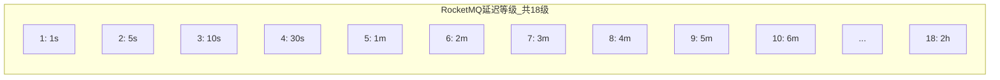

```java
// RocketMQ 延迟消息（4.x 固定等级）
Message msg = new Message("OrderTopic", "create", body);
msg.setDelayTimeLevel(3);   // 延迟10s
producer.send(msg);

// RocketMQ 5.x 任意延迟
msg.setDeliveryTimestamp(System.currentTimeMillis() + TimeUnit.MINUTES.toMillis(30));
producer.send(msg);

// 业务消费端正常消费，到时间才会收到
consumer.registerMessageListener((msgs, ctx) -> {
    cancelOrder(msgs);   // 30分钟后收到，检查支付状态并取消
    return ConsumeConcurrentlyStatus.CONSUME_SUCCESS;
});
```

> ⚠️ 易错点/陷阱：① RocketMQ 4.x 延迟消息是**固定 18 个等级**，不能任意指定时间，业务时间要往等级上靠。② Redis 的 keyspace notifications（key 过期通知）**不可靠**：过期事件可能因 Redis 重启、`maxmemory-policy` 淘汰而丢失，且集群模式下通知散乱，**不要用于生产延迟场景**。③ 死信队列不是延迟队列，它是消费失败后的兜底，不要混淆。④ 定时任务扫表在大数据量下要**加索引 + 分批查**，避免全表扫描。⑤ 延迟消息消费端同样要幂等，因为延迟后重投也可能重复。

---

### 场景12：如何保证消息的可靠性投递

**场景描述**

"可靠性投递"是消息不丢的完整工程方案，涵盖生产、存储、消费全链路。问：从 0 设计一套可靠的投递方案？

**问题分析**

1. 单靠 ACK 不够，需端到端保障 + 补偿机制。
2. 核心思路：**本地消息表 + 确认机制 + 重试 + 对账**。

**方案：本地消息表 + 确认重试**

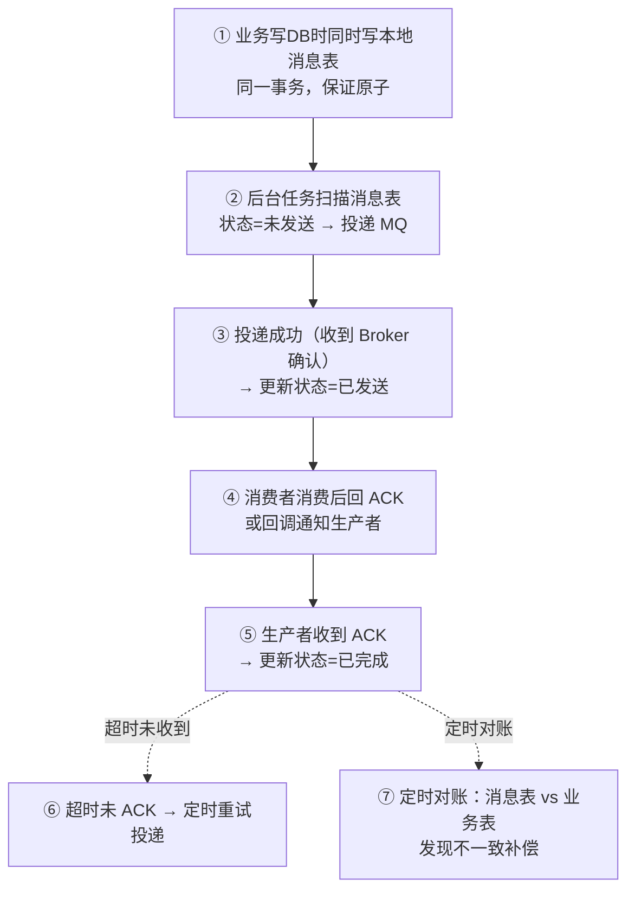

```mermaid
graph TB
    subgraph bizDB["业务 DB"]
        Biz[业务表写入]
    end
    subgraph msgTable["本地消息表"]
        Msg[msgId | payload | status | retryCount<br/>1 | {...} | INIT | 0]
    end
    Biz -.同一事务.-> Msg

    Scanner[后台扫描任务 每秒]
    MQ[(MQ)]
    Consumer[消费者处理]
    ACK[ACK 回调]
    Retry[超时未 ACK → retryCount++ → 重新投递]

    Msg --> Scanner
    Scanner -->|投递| MQ
    MQ -->|确认| SENT["status = SENT"]
    MQ --> Consumer
    Consumer -->|ACK| ACK
    ACK --> DONE["status = DONE"]
    Scanner -.超时未ACK.-> Retry
```

```java
// 1. 业务 + 消息表同事务写入
@Transactional
public void createOrder(Order order) {
    orderMapper.insert(order);
    // 本地消息表
    localMsgMapper.insert(new LocalMsg()
        .setMsgId(UUID.randomUUID().toString())
        .setPayload(JSON.toJSONString(order))
        .setStatus("INIT")
        .setRetryCount(0));
}

// 2. 定时扫描投递
@Scheduled(fixedDelay = 1000)
public void sendPendingMsg() {
    List<LocalMsg> pending = localMsgMapper.selectByStatus("INIT", 100);
    for (LocalMsg m : pending) {
        try {
            SendResult r = producer.send(buildMsg(m));
            if (r.getSendStatus() == SEND_OK) {
                localMsgMapper.updateStatus(m.getMsgId(), "SENT");
            }
        } catch (Exception e) {
            localMsgMapper.incrRetry(m.getMsgId());   // 失败重试计数
            if (m.getRetryCount() > MAX_RETRY) {
                localMsgMapper.updateStatus(m.getMsgId(), "FAILED");  // 进死信/告警
            }
        }
    }
}
```

**与三端保障的关系**

| 层次 | 机制 | 解决 |
|------|------|------|
| 生产端 | 本地消息表 + 确认重试 | 发送丢失、宕机丢失 |
| Broker | 持久化 + 多副本 | Broker 宕机丢失 |
| 消费端 | 手动 ACK + 幂等 | 处理失败丢失、重复消费 |
| 兜底 | 定时对账 + 死信告警 | 漏网之鱼 |

> ⚠️ 易错点/陷阱：① 本地消息表**必须和业务数据在同一个 DB 事务**，否则业务成功但消息没记，或消息记了但业务没成，都不一致。② 消费者必须**幂等**——因为超时重试会重复投递。③ 确认机制不能只用"Broker 收到"就算完，要等"消费者处理成功"才算真正投递成功（可用回调或消费者反向通知）。④ 死信队列 + 告警是最后一道防线，超过重试上限的消息进 DLQ 人工介入。⑤ 本地消息表方案的本质是用 DB 事务保证"业务 + 投递意图"原子，是**事务消息的轻量替代**；RocketMQ 事务消息（半消息 + 回查）是更原生的方案，但耦合 MQ。

---

## 常见面试题

### Q1：缓存穿透、击穿、雪崩三者区别？

| | 穿透 | 击穿 | 雪崩 |
|-|------|------|------|
| 本质 | key **不存在** | **单热点 key** 过期 | **大量 key** 同时过期 / Redis 宕机 |
| 现象 | 每次都打 DB | 瞬间并发打 DB | 大面积打 DB / DB 挂 |
| 解法 | 布隆过滤器 + 缓存空值 | 互斥锁 / 逻辑过期 / 永不过期 | TTL 加随机 + 高可用 + 熔断降级 |

### Q2：为什么是删缓存而不是更新缓存？

删缓存是幂等的，并发下不会脏写；更新缓存在并发写时乱序会停留旧值。且部分缓存值计算成本高，删除后按需懒加载更经济。

### Q3：延迟双删的延迟时间怎么定？

延迟要大于"读请求读 DB（旧值）+ 写回缓存"的耗时，通常 500ms~1s。若 DB 是主从架构，还要大于主从同步延迟。

### Q4：布隆过滤器能删数据吗？

经典布隆不能删（位是共享的，删了会影响其他 key）。要用计数布隆或布谷鸟过滤器支持删除。误判存在但无漏判。

### Q5：如何保证消息不丢？

三端保障：生产端确认（acks=all / 同步发送）+ 本地消息表重试；Broker 持久化 + 多副本；消费端手动 ACK + 幂等。兜底用死信队列 + 对账。

### Q6：如何保证消息不重复消费？

消费端幂等：唯一 ID + 去重表 / Redis setnx / 数据库唯一索引 / 状态机。MQ 本身 at-least-once，重复不可避免，幂等是唯一解。

### Q7：如何保证消息顺序？

同一业务 key 路由到同一队列（hash(key) % queueCount），单队列单消费者串行消费。不能跨队列保证全局顺序。Kafka 靠 partition 单消费者，RocketMQ 靠 `MessageListenerOrderly` 锁 queue。

### Q8：消息堆积怎么处理？

应急：扩消费者（≤ 分区数）、临时 Topic 扩分区转发、降级限流。根治：优化消费逻辑（批量、异步、DB 索引）。注意扩消费者超过分区数无效。

### Q9：RocketMQ 和 Kafka 如何实现延迟消息？

Kafka 原生不支持延迟消息，需自建（时间轮 + Topic 转发，或用外部调度）。RocketMQ 4.x 固定 18 个延迟等级，5.x 支持任意时间延迟。

### Q10：手动 ACK 为什么还要幂等？

ACK 前宕机会重投，ACK 后处理失败（若业务非原子）也可能重投。at-least-once 语义下重复不可避免，幂等是必须的。

---

## 资料勘误与重点提醒

> ⚠️ 这类场景题的常见误区与必须澄清的点：

1. **"先更新 DB 再删缓存"是推荐方案，不是"更新缓存"**。原因：① 并发更新缓存易脏写（A、B 并发写，乱序导致缓存停留在旧值）；② 部分缓存值计算成本高，每次写都重算浪费；③ 删除是幂等的，多次删结果一致，更易保证一致性。

2. **延迟双删的"延迟"不是随便多删一次**，而是**等读请求把旧值写回缓存后再删**。"先删缓存再更新 DB"在并发下有脏读：删缓存后另一线程读旧 DB 回写缓存，导致缓存长期停留旧值。延迟双删的 N 要大于"读 DB + 写缓存"耗时（通常 500ms~1s，主从架构还要加主从同步延迟）。

3. **布隆过滤器有误判（假阳性）但无漏判**。"说不存在一定不存在"是安全的，"说存在可能不存在"仍需回源。经典布隆不支持删除，需计数布隆或布谷鸟过滤器。误判率越低内存越大。

4. **消息顺序只能在同一队列/分区内保证，不能跨队列保证全局顺序**。要全局有序只能单队列单消费者，吞吐极低。Kafka 靠 partition 单消费者（天然有序），RocketMQ 靠 `MessageListenerOrderly` 锁 queue（框架保证串行）。**Kafka 消费者拉取有序但若应用多线程处理需自行按 key 分发**，这是两者在消费端顺序保证上的关键差异。

5. **手动 ACK 必须配合幂等**。ACK 前宕机会重投，处理失败不 ACK 也会重投（Broker 超时重发），at-least-once 语义下重复不可避免。"自动 ACK"是最容易丢消息的方式，生产必须关闭。

6. **"更新缓存" vs "删缓存"的并发分析常被搞混**：
   - "更新缓存"并发风险：A、B 并发写，A 先写 DB 后写缓存，B 后写 DB 但先写缓存 → 缓存停留在 A 的旧值。
   - "删缓存"并发风险极低：读旧值回写需满足"读 DB 在写 DB 前，写缓存在删缓存后"，概率极小且读通常比写快。

7. **重点补充（资料常漏）**：
   - **缓存与 DB 没有真正的"强一致"**，除非不用缓存或用分布式事务（代价极高）。所谓强一致方案都是"最终一致 + 读时校验/补偿"。
   - **删除大 key 必须用 `UNLINK`（Redis 4.0+）**，`DEL` 大 key 同步阻塞主线程，几十 MB 可能阻塞数百 ms。
   - **扩消费者实例数不能超过分区/队列数**，Kafka 一个 partition 只能被消费组内一个消费者消费，超过的闲置。
   - **Redis keyspace notifications 不可靠**，过期事件可能丢失、集群下通知散乱，**不要用于生产延迟场景**。RocketMQ 4.x 延迟是固定 18 等级，5.x 才支持任意时间。
   - **本地消息表必须与业务同 DB 事务**，否则业务与投递意图不一致；它本质是事务消息的轻量替代。

> 📌 **本章总结**：缓存场景主线是"不一致 + 打 DB"，解法是"拦截（布隆/空值）+ 锁（互斥重建）+ 兜底（降级/熔断）+ 一致性（Cache Aside 删缓存）"；MQ 场景主线是"丢失 + 重复 + 乱序 + 堆积"，解法是"三端保障（生产确认/Broker 持久化/消费手动 ACK）+ 幂等 + 顺序路由 + 堆积治理"。被问到时按"会出现什么问题 → 为什么 → 怎么解决"三段答，并把易错点主动点出，体现深度。
