# 04 - 系统设计实战

> 📌 **一句话理解**：系统设计题没有标准答案，考的是"在给定约束下做权衡"——先吃透需求与量级，再给核心数据模型与架构图，最后聊扩展性与取舍；套路是骨架，权衡是灵魂。

---

## 核心场景设计

### 设计1：短链系统

**需求理解**

- 核心功能：长链接 → 短链接 → 点击跳转回原链接；访问统计（PV/UV/来源）。
- 非功能需求：短链生成要快、唯一、不可猜测；跳转延迟低（<50ms）；高可用。
- 典型量级：日活 1000w，人均发 2 条短链 → 日新增 2000w 条；短链写 QPS ≈ 2000w/86400 ≈ 230，峰值 ×3 ≈ 700；读（跳转）QPS 假设每条被点 10 次 ≈ 2w+，峰值 6w+。存储：单条长链均 100B + 短码 7B + 索引，1 亿条 ≈ 几 GB，MySQL 单库可扛，读走缓存。

**核心设计**

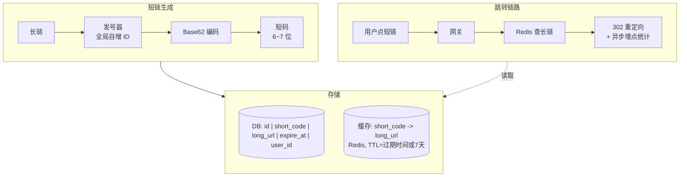

短码生成两条主流路线对比：

| 方案 | 做法 | 优点 | 缺点 |
|------|------|------|------|
| 自增ID+Base62 | 发号器拿自增ID，转62进制 | 短、唯一、可预测长度 | 可被遍历（加混淆位/雪花ID缓解） |
| MD5哈希取段 | 长链MD5后取前6位Base62 | 不可猜测、相同长链同码 | 冲突需重试或加盐，长度不可控 |

> Base62：`0-9 a-z A-Z` 共62字符，6 位可表示 62^6 ≈ 568 亿，足够；发号器可用 Redis INCR 或雪花算法（防止单点）。

**Base62 编码示例**（自增 ID -> 短码）：

```
ID = 123456789
62进制: 123456789 / 62 ... 不断取余映射字符 -> "8M0hK"
拼接: 短码 = "8M0hK" (5位, 可前面补0固定长度)
```

**数据模型**：

```sql
CREATE TABLE short_url (
  id          BIGINT PRIMARY KEY AUTO_INCREMENT,
  short_code  VARCHAR(10) UNIQUE,    -- 短码
  long_url    VARCHAR(2048),          -- 原始长链
  user_id     BIGINT,
  expire_at   DATETIME,               -- 过期时间
  create_time DATETIME,
  KEY idx_long (long_url(255))        -- 长链去重查询
);
```

**关键难点与方案**

1. **发号器唯一与性能**：Redis INCR 简单但单点；可分段发号（每台机器预取一段 ID 区间）或用雪花算法（时间戳+机器位+序列号）。
2. **长链去重**：同一长链是否生成同一短码？用 `long_url` 哈希做唯一索引，存在则复用；否则每次新码。看业务（营销活动需独立统计则不复用）。
3. **缓存击穿/穿透**：热点短码缓存预热；不存在的短码用布隆过滤器挡掉，缓存空值。

> ⚠️ 易错点/陷阱：**跳转必须用 302 而非 301**。301 是永久重定向，浏览器会缓存，之后点击直接走本地缓存、不再请求服务端，导致**访问统计完全失效**。301 仅适合"永不变更且不需要统计"的场景。主流短链（微博/t.cn）为统计访问量都用 302。面试官常追问"为什么不省点服务端压力用301"——答案就是统计。

---

### 设计2：Feed 流系统

**需求理解**

- 核心功能：用户发布动态 → 关注者首页 Feed 流按时间倒序展示；支持点赞/评论。
- 典型量级：日活 1 亿，人均关注 200 人、发布 5 条/天、刷 10 次/天。
  - 发布写 QPS ≈ 1亿×5/86400 ≈ 5800；刷读 QPS ≈ 1亿×10/86400 ≈ 1.16w，峰值数万。

**核心设计：三种模式**

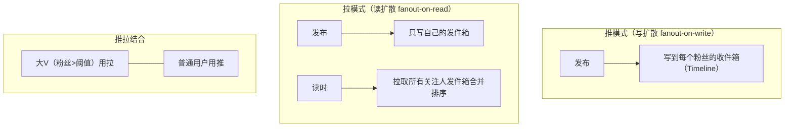

| 模式 | 写开销 | 读开销 | 适用场景 |
|------|--------|--------|----------|
| 推模式 | 高（×粉丝数） | 低（读自己收件箱） | 粉丝少、活跃用户占比高 |
| 拉模式 | 低（写1份） | 高（聚合多关注人） | 大V、不活跃用户多 |
| 推拉结合 | 折中 | 折中 | 工业主流（微博/Twitter） |

收件箱存储：Redis ZSet（score=发布时间戳）或 Redis List + 分页；只保留最近 N 条（如 1000），老数据落 DB。

**读时多路归并**（拉模式核心算法）：

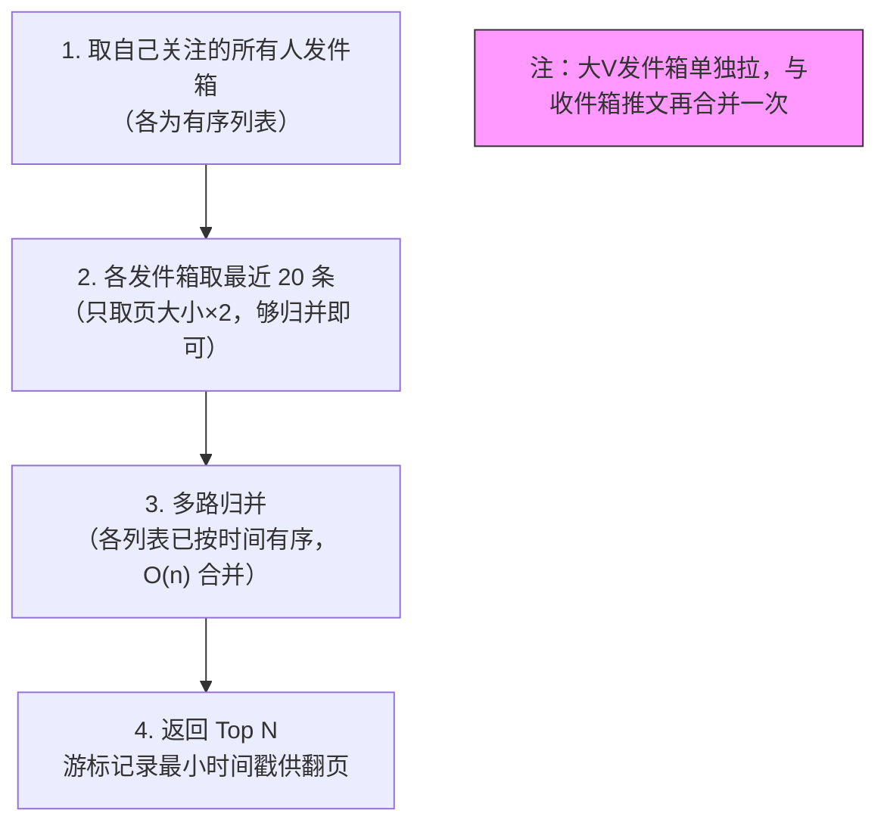

**关键难点与方案**

1. **大 V 写放大**：千万粉丝的大 V 发一条 → 推模式要写千万次，不可接受。推拉结合：大 V 只写发件箱，粉丝读时主动拉大 V 的最新 + 自己收件箱的推文合并。
2. **读时聚合排序**：拉模式要把多个关注人的发件箱合并做归并排序（各发件箱本身有序，多路归并 O(n)）。
3. **活跃度优化**：僵尸粉不推送浪费——只对"近期活跃"用户推，不活跃的降级为拉。

> ⚠️ 易错点/陷阱：网上有"**推模式适合活跃用户少**"的说法，**表述反了/不准**。正确表述：推模式（写扩散）适合**粉丝数不多 + 活跃用户占比高**的场景（推送的都会被读到，不浪费）；拉模式适合**大 V（粉丝多，避免写放大）或不活跃用户占比高**的场景。判断维度是"粉丝规模"和"活跃比例"，不是单看"活跃用户多少"。推拉结合是工业界主流。

---

### 设计3：IM 即时通讯系统

**需求理解**

- 核心功能：单聊/群聊、消息有序、已读未读、消息不丢不重、在线状态、离线消息。
- 典型量级：日活 5000w，同时在线 500w，单用户日均 100 条 → 消息 QPS ≈ 5000w×100/86400 ≈ 5.8w，峰值 20w+；万人群消息广播放大严重。

**核心设计**

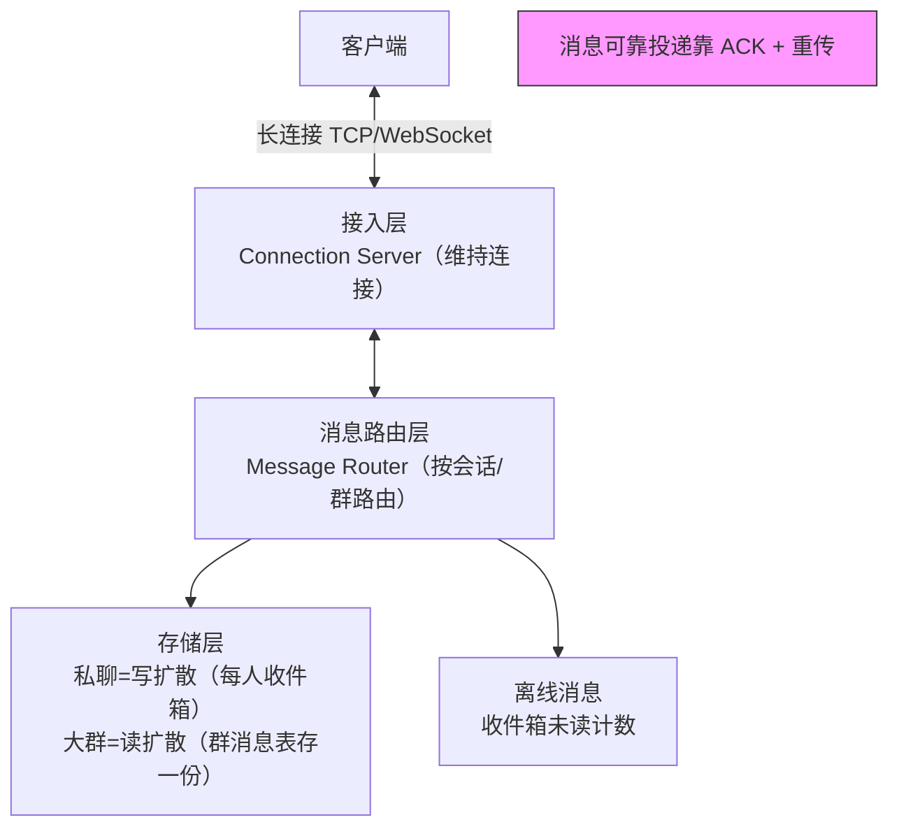

消息存储模式对比（与 Feed 同源思想，但 IM 更强调顺序与可靠）：

| 模式 | 做法 | 适合 | 缺点 |
|------|------|------|------|
| 写扩散（推） | 一条消息写到每个接收者收件箱 | 私聊、小群 | 群消息每人一份→存储爆炸 |
| 读扩散（拉） | 群消息存一份，接收者读时拉取+排序 | 大群（万人群） | 读延迟、在线拉取 |

> 实践：私聊 + 小群用写扩散（读快），大群用读扩散（群消息表存一份，按 seq 排序拉取）。

**消息可靠投递流程**：

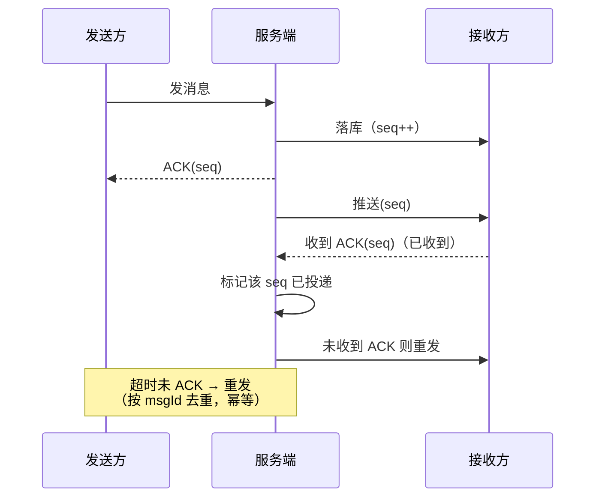

**关键难点与方案**

1. **消息有序**：单会话内用单调递增 seq（服务端分配），客户端按 seq 排序展示；跨会话无需全局有序。
2. **消息可靠投递**：发送→服务端落库→回 ACK→客户端确认收到→服务端标记已读。未 ACK 则重发（需去重，按 messageId 幂等）。
3. **已读未读**：群消息已读计数——服务端记录每个用户"已读到的 seq"，未读数 = 群最新 seq − 用户已读 seq。群已读回执量大可聚合/延迟同步。
4. **长连接与扩展**：单机连接数上限（10w~50w），水平扩容接入层；连接路由用一致性哈希或注册中心；消息推送按用户所在接入层节点下发。

> ⚠️ 易错点/陷阱：**写扩散（群消息每人一份）存储爆炸**——万人群一条消息写 1 万份不可持续。大群必须用读扩散（消息存一份 + seq 排序）。但读扩散要求用户在线时主动拉，离线消息要补拉。**不要把"读扩散只适合离线"和"写扩散只适合在线"混为一谈**——两者都能支持离线，区别在存一份还是存 N 份。

---

### 设计4：抢红包系统

**需求理解**

- 核心功能：发红包（指定总金额+个数）→ 多人抢 → 拆开看金额 → 金额入账；过期未领退回。
- 典型量级：春晚级峰值百万级 QPS 抢；普通群红包并发几十~几百。

**核心设计：拆红包算法**

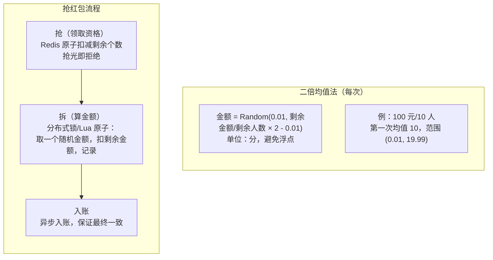

**Lua 原子拆红包脚本骨架**（防超发与并发）：

```lua
-- KEYS[1]=红包剩余金额, KEYS[2]=剩余个数, KEYS[3]=已领记录
local remain_amount = tonumber(redis.call('GET', KEYS[1]))
local remain_count  = tonumber(redis.call('GET', KEYS[2]))
if remain_count <= 0 then return -1 end            -- 抢光
if remain_count == 1 then                          -- 最后一个: 取全部
    redis.call('SET', KEYS[1], 0)
    redis.call('DECR', KEYS[2])
    return remain_amount
end
local max = math.floor(remain_amount / remain_count * 2)  -- 二倍均值上限
local money = math.random(1, max)                          -- 单位:分, 最小1
redis.call('DECRBY', KEYS[1], money)
redis.call('DECR', KEYS[2])
return money
```

**关键难点与方案**

1. **二倍均值法原理**：每次在 `[0.01, 剩余均值×2)` 内随机，保证剩余金额始终 ≥ 剩余人数 ×0.01（人人有份），**最后一个红包 = 剩余全部**（不再随机）。
2. **并发扣减**：剩余个数用 Redis 原子 DECR，抢完返回失败；拆金额用 Lua 脚本保证"取金额+扣余额+记录"原子性，防止超发。
3. **金额精度**：**全程用"分"整数计算**，绝不用 double（浮点误差累计会少钱/多钱）；落库用 DECIMAL 或分单位 BIGINT。

> ⚠️ 易错点/陷阱：① 二倍均值法**保证每次剩余有解（不出现后面人没钱分），但不保证绝对均匀**——方差较大，可能有人拿很多有人拿很少（这正是"拼手气"效果，不是 bug）。② **最后一个红包不按二倍均值法**，而是直接取剩余全部金额。③ 别用"剩余金额随机均分"之类会算出 0 或负数的写法。④ 过期未领退回：红包 24 小时未抢完，定时任务扫描状态，剩余金额原路退回发红包者账户。

---

### 设计5：排行榜系统

**需求理解**

- 核心功能：按分数实时排序、Top N、分页、多维度（日榜/周榜/总榜、按地区）。
- 典型量级：亿级用户，实时更新分数、实时查榜。单次更新 QPS 可能数万。

**核心设计**

```
Redis ZSet:  ZADD rank:score {score} {userId}
            ZREVRANGE rank:score 0 9   -- Top10
            ZREVRANGEBYSCORE ...       -- 分页
            ZSCORE / ZRANK             -- 我的排名与分数
```

> ZSet 底层 = **跳表（skiplist）+ 哈希表（dict）**：跳表按 score 有序支持范围查询 O(logN)，dict 支持按 member 取 score O(1)。

**核心命令**：

```redis
ZADD rank:total {score} {userId}          -- 更新分数
ZREVRANGE rank:total 0 9 WITHSCORES       -- Top10(分数从高到低)
ZREVRANGE rank:total 100 109               -- 分页(注意深分页性能)
ZSCORE rank:total {userId}                 -- 我的分数
ZRANK rank:total {userId}                  -- 我的排名(升序名次)
ZCOUNT rank:total 9000 9999                -- 分数区间内人数(同分并列统计)
```

**关键难点与方案**

1. **实时更新**：用户产生分数时直接 ZADD，ZSet 自维护有序，查询 O(logN)。
2. **分页**：`ZREVRANGE start stop`，注意大偏移量（深分页）性能差——`ZREVRANGE 100000 100009` 要跳过 10w 元素；可改用游标/分数区间分页。
3. **多维度**：日榜/周榜/总榜用不同 key（`rank:daily`/`rank:weekly`）；周榜可用日榜定时聚合或独立维护。
4. **亿级用户单 key 过大**：单个 ZSet 存 1 亿成员会变成大 key，ZADD/ZRANGE 延迟上升、阻塞风险。**分桶（分片）**：
   - 按分数区间分桶：`rank:0-1000`、`rank:1000-2000`…查 TopN 只需查最高几个桶；
   - 按用户 ID 取模分桶：各自排序后合并 TopN（归并）。
   - 分桶后各桶并行查询再合并，避免单 key 瓶颈。

> ⚠️ 易错点/陷阱：**ZSet 不是银弹**——单 key 成员过多（百万级以上）就是大 key，要做**分桶排行榜**。另外 ZSet 排名是"分数相同按 member 字典序"，业务上同分并列时要注意排名计算（`ZRANK` 返回的是有序集合位置，并列要用 `ZSCORE` + 区间统计）。

---

### 设计6：点赞系统

**需求理解**

- 核心功能：对内容点赞/取消、点赞计数、去重（一人一赞）、防刷、我的点赞列表。
- 典型量级：热门内容百万赞；总点赞 QPS 数万，热点内容突发更高。

**核心设计**

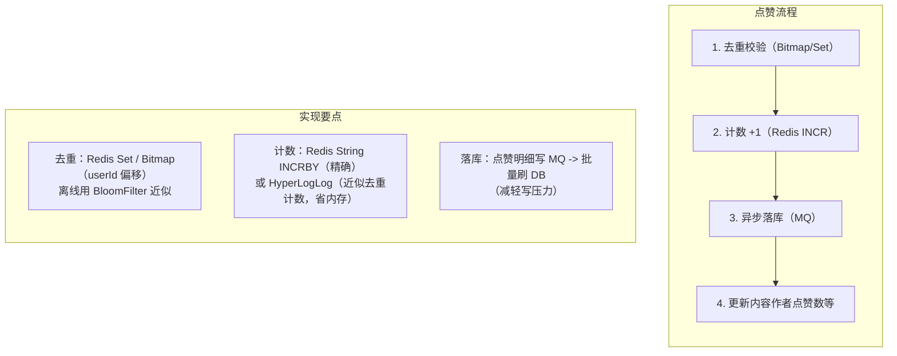

**点赞流程要点**：

```
点赞: SISMEMBER liked:{contentId} {userId}  -- 已赞?
      未赞 -> SADD 去重集合 + INCR 计数 + 发MQ(异步落库)
取消: SISMEMBER 已赞 -> SREM + DECR (原子, 防多减)
查询: 计数读 Redis; 我的点赞列表读 Set/Bitmap
```

**关键难点与方案**

1. **去重防刷**：一人一赞用 `Set<userId>`（小内容）或 `Bitmap`（用户ID连续，省内存）；超大流量近似用布隆过滤器。防刷：用户级频率限制、设备/IP 维度限频、风控。
2. **计数准确性 vs 性能**：精确计数用 Redis INCR；极致省内存的 UV 类计数用 HyperLogLog（误差 <1%，内存固定 12K）。
3. **热点写入**：单条热门内容点赞爆发，直接写 DB 会打死。先写 Redis 缓冲 + MQ 削峰，消费端批量落库；计数实时读 Redis，落库做最终一致。
4. **取消点赞**：原子操作——先查去重集合，已赞才允许取消并 INCR-1，防止并发多减。

> ⚠️ 易错点/陷阱：① 点赞计数别只靠 DB `count(*)`——大表 count 慢，必须用 Redis 维护计数器。② 去重用 Set 存 userId 在超级热门内容下也会膨胀，**Bitmap 比省内存**（前提是 userId 可映射为连续整数）。③ 异步落库要做好幂等（消息重复消费不能多加赞），用 `(userId, contentId)` 唯一约束 + 状态机。

---

### 设计7：秒杀系统

> 与 `09-系统设计与架构/经典场景设计.md` 互补：经典场景已详述限流/降级/熔断/分布式锁/幂等，此处聚焦**答题套路与分层防护骨架**，不重复展开。

**需求理解**

- 核心功能：限量商品瞬时开抢，防超卖、防刷、保证系统不崩。
- 典型量级：10 万库存，100w 用户同时抢 → 瞬时 QPS 几十万到百万。

**核心设计：分层防护（从外到内逐层削峰）**

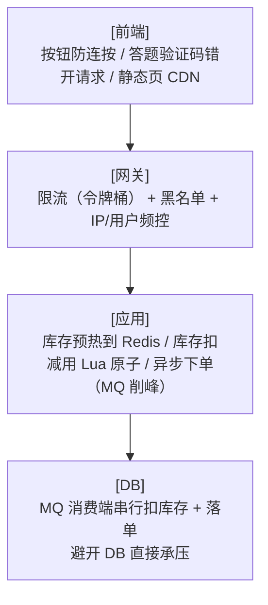

**库存 Lua 预扣脚本**（防超卖核心）：

```lua
-- KEYS[1]=商品库存, ARGV[1]=购买数
local stock = tonumber(redis.call('GET', KEYS[1]))
if not stock or stock < tonumber(ARGV[1]) then
    return 0                  -- 库存不足, 快速失败
end
redis.call('DECRBY', KEYS[1], ARGV[1])
return 1                      -- 预扣成功, 放行异步下单
```

**关键难点与方案（答题骨架）**

1. **削峰**：验证码/答题让请求错峰；MQ 排队把瞬时尖峰削平。
2. **库存防超卖**：Redis 预扣库存（Lua 脚本：判断>0 再 DECR，原子），扣成功才放行异步下单；DB 层再扣一次做兜底（乐观锁 `where stock>0`）。
3. **限流保护**：网关令牌桶限流，超出直接拒绝（快速失败比拖垮系统好）。
4. **异步化**：下单请求进 MQ，消费端按 DB 承受能力消费落单，用户先返回"排队中"。

> ⚠️ 易错点/陷阱：① **不要让请求直接打到 DB**——DB 扛不住瞬时百万 QPS，库存必须 Redis 预扣 + MQ 削峰。② Redis 预扣与 DB 实扣要做**最终一致**（本地消息表/事务消息），防止 Redis 扣了 DB 没扣。③ 限流要"快速失败"，别让请求堆积拖垮线程池（舱壁隔离）。

---

### 设计8：电商订单系统

**需求理解**

- 核心功能：下单→支付→发货→收货→完成；取消；超时未支付自动取消。
- 典型量级：日订单千万级，支付回调、超时取消是关键异步链路。

**核心设计**

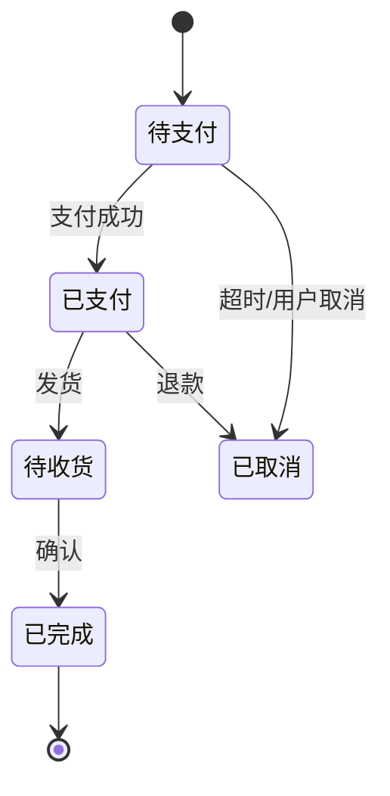

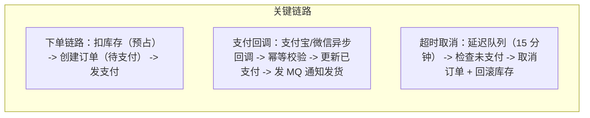

**订单表与库存预占**：

```sql
CREATE TABLE `order` (
  id          BIGINT PRIMARY KEY,
  order_no    VARCHAR(32) UNIQUE,   -- 业务订单号(幂等键)
  user_id     BIGINT,
  status      TINYINT,               -- 1待支付 2已支付 3已发货 4已完成 5已取消
  amount      DECIMAL(10,2),
  create_time DATETIME,
  pay_time    DATETIME,
  VERSION     INT DEFAULT 0          -- 乐观锁, 防并发改态
);
-- 库存预占(下单时): UPDATE stock SET locked=locked+1, available=available-1
--                   WHERE sku=? AND available>=?  (乐观锁兜底)
```

**关键难点与方案**

1. **订单状态机**：用状态字段 + 合法流转校验，禁止跳跃（如待支付直接到已完成）。落库前校验当前状态，用乐观锁防并发改态。
2. **分布式事务（库存+订单+支付）**：下单扣库存与创订单要么都成功要么都失败。方案：
   - **TCC**（Try 预占库存-Confirm 扣减-Cancel 回滚）；
   - **本地消息表/可靠消息**（创订单+发消息原子，消费端扣库存，失败重试）；
   - 库存预占 + 超时回滚是简化版最终一致。
3. **支付回调幂等**：支付平台可能重试回调，用 `out_trade_no`（订单号）做幂等键，已处理直接返回成功，避免重复发货。
4. **超时取消**：方案对比——
   - 定时任务扫表（简单，有延迟、扫全表）；
   - 延迟队列（RabbitMQ TTL+DLX / RocketMQ 延迟消息，精准及时）；
   - Redis 过期监听（不可靠，仅辅助）。

> ⚠️ 易错点/陷阱：① **库存扣减要用乐观锁或预占**，不能 `select` 再 `update`（并发超卖）。② 支付回调**必须幂等**，第三方重试是常态。③ 超时取消别只依赖 Redis 过期事件（keyspace notifications 不可靠，丢消息=订单永不取消），要用延迟队列兜底。④ 分布式事务别上来就 2PC（性能差），优先最终一致 + 业务补偿。

---

### 设计9：附近的人 / 附近商家

**需求理解**

- 核心功能：给定经纬度，查找半径 N 米内的人/商家，按距离排序、分页。
- 典型量级：LBS 服务，查询 QPS 中等但计算密集。

**核心设计**

```
写入:  GEOADD key 经度 纬度 member    -- Redis GEO, 底层是ZSet(member, score=Geohash编码)
查询:  GEOSEARCH key FROMLONLAT lon lat BYRADIUS r m ASC COUNT n   -- 半径内按距离升序
距离:  GEODIST key m1 m2 m
```

**Geohash 原理**：将经纬度二分编码交替组合成二进制串，再 Base32 编码成字符串。**前缀相同 = 空间相近**，可用字符串前缀匹配做粗筛。Redis GEO 的 score 就是 52 位 Geohash 整数。

**Geohash 编码示意**（经度 116.40, 纬度 39.90）：

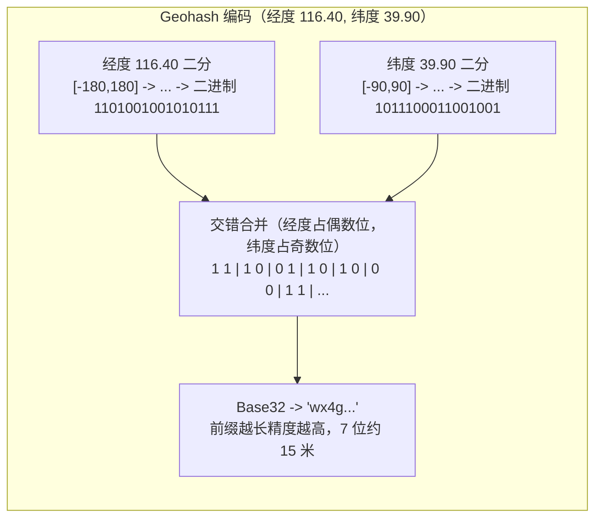

**关键难点与方案**

1. **Redis GEO 方案**：直接 `GEOADD`+`GEOSEARCH`，ZSet 范围查询，简单高效。适合百万级点。
2. **亿级数据分片**：单 key 扛不住，按**地理分片**——将地球按 Geohash 前缀（如前 4~5 位）切成网格，每格一个 key；查询时先算请求点所在网格及相邻 8 格，合并结果再按距离排序（边界点要查相邻格）。
3. **距离计算**：球面距离用 **Haversine 公式**（考虑地球曲率），不是平面欧氏距离；短距离可近似，长距离必须 Haversine。
4. **边界问题**：Geohash 编码相邻但实际在网格两侧时可能"编码相邻却不靠近"，需查相邻网格修正。

> ⚠️ 易错点/陷阱：① **Redis GEO 底层就是 ZSet**，score 存 52 位 Geohash 整数编码经纬度，不是裸经纬度。② Geohash 有**边界突变**问题——两个实际很近的点因分属不同网格而编码前缀不同，所以查询**必须带上相邻网格**。③ 距离别用平面勾股定理，经纬度是球面坐标，用 **Haversine**（Redis GEODIST 已内置）。④ Redis GEO 单成员上限随版本不同，亿级要分片。

---

## 通用答题套路

### 设计10：系统设计题通用答题框架

**核心套路：六步法 + STAR 表达**

系统设计题没有标准答案，评分看**结构化思维 + 权衡取舍**。切忌上来就画架构图，先花 2-3 分钟对齐需求与量级。

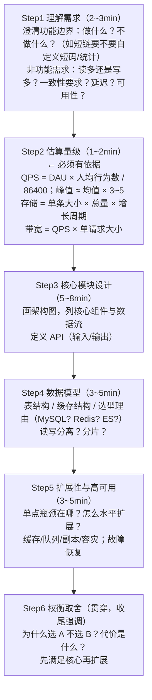

**STAR 式表达（讲故事）**：

| STAR | 对应 |
|------|------|
| Situation | 需求场景与量级约束 |
| Task | 要解决的核心问题 |
| Action | 你的设计方案与关键技术决策 |
| Result | 效果 + 取舍（哪里做了让步、为什么） |

**估算示例（短链系统）**：
- 假设日活 1000w，人均发 2 条 → 日新增 2000w 条。
- 写 QPS ≈ 2000w/86400 ≈ 230，峰值 ≈ 700。
- 读（跳转）假设每条被点 10 次 → 2w QPS，峰值 6w+ → 读多写少，必须缓存。
- 存储：1 亿条 × (100B 长链+7B 短码+索引) ≈ 几 GB → 单 MySQL 库够用。

**通用避坑**：

1. **先对齐需求再设计**——不要在错误假设上搭建，需求理解错全盘皆输。
2. **估算要给依据**——"DAU×行为/86400"比拍脑袋"我觉得大概几千 QPS"专业得多。
3. **先满足核心再扩展**——先让主流程跑通（核心数据模型+读写链路），再聊分片/容灾，别一上来就 over-engineer。
4. **主动暴露权衡**——每个技术选型都说清代价（如"用 302 牺牲了一点服务端压力换访问统计"），展现工程判断力。
5. **识别瓶颈并解决**——面试官最爱问"瓶颈在哪""怎么扩展"，主动指出单点（DB/单 key/单机连接）并给方案。

> ⚠️ 易错点/陷阱：① **不要一上来就画大而全的架构图**——先聊需求与量级，确认方向再画。② **估算别只给数字不给算法**——面试官要看推导过程。③ **别过度设计**——亿级用户才分片，几千 QPS 单库就够，别为了显摆上分库分表+集群。④ **没有银弹**，每个选择都有代价，把取舍讲清楚比"标准答案"更得分。

---

## 常见面试题

### Q1：短链跳转用 301 还是 302？为什么？

用 **302 临时重定向**。301 会被浏览器/CDN 永久缓存，用户再点直接走缓存不请求服务端，**访问统计完全失效**。302 每次都回源，能准确统计 PV/UV。代价是多一次服务端查询，靠缓存扛。

### Q2：发号器怎么做？Redis INCR 单点怎么办？

Redis INCR 简单但单点风险。方案：① 分段发号——每台应用预取一段 ID 区间，用完再取，降低 Redis 压力；② 雪花算法——时间戳+机器 ID+序列号，无中心、可分布式，但要处理时钟回拨；③ 数据库号段——批量取号。

### Q3：Feed 流推模式和拉模式怎么选？

看**粉丝规模**和**活跃比例**：粉丝少/活跃占比高用推（写扩散，读快）；大 V/僵尸粉多用拉（读扩散，省写）。工业界用**推拉结合**——大 V 只写发件箱（粉丝读时拉），普通用户推到粉丝收件箱。

### Q4：IM 群消息用读扩散还是写扩散？

小群（几十人）用写扩散（每人一份，读快）；大群（万人）用写扩散会存储爆炸，改用读扩散（消息存一份 + seq 排序拉取）。已读未读用"用户已读 seq"记录，未读数 = 群最新 seq − 已读 seq。

### Q5：抢红包为什么用二倍均值法？最后一个怎么算？

二倍均值法保证每次随机后剩余金额 ≥ 剩余人数 ×0.01，人人有份且不超发。**最后一个红包不随机**，直接取剩余全部。注意全程用"分"整数计算，避免浮点误差。

### Q6：排行榜亿级用户单 ZSet 扛不住怎么办？

分桶：按分数区间切（查 TopN 只查高分区）或按用户 ID 取模切（各桶排序后归并）。分桶后并行查询合并，避免单 key 大 key 阻塞。

### Q7：点赞计数为什么不能只靠数据库？

大表 `count(*)` 慢，高并发写入打爆 DB。用 Redis INCR 维护计数器实时读，明细异步入 MQ 批量落库；UV 类近似计数用 HyperLogLog 省 99% 内存。

### Q8：秒杀如何防超卖？

Redis 预扣库存（Lua 原子：判断>0 再 DECR），成功才异步下单；DB 层乐观锁 `where stock>0` 兜底；MQ 削峰让 DB 按承受能力消费。请求不直接打 DB。

### Q9：订单超时取消用 Redis 过期通知行不行？

不靠谱。Redis keyspace notifications 不可靠（丢消息则订单永不取消），只能辅助。主方案用**延迟队列**（RabbitMQ TTL+DLX / RocketMQ 延迟消息）+ 定时任务兜底。

### Q10：附近的人亿级数据怎么分片？

按 Geohash 前缀切网格，每格一个 key；查询时算请求点所在网格 + 相邻 8 格，合并结果按距离排序。必须带相邻网格，否则边界点漏查。距离用 Haversine 球面公式。

### Q11：系统设计题答题顺序？

六步法：理解需求 → 估算量级（给依据）→ 核心模块设计（架构图+API）→ 数据模型（选型理由）→ 扩展性/高可用 → 权衡取舍。先对齐需求再设计，先满足核心再扩展，每个选型讲清代价。

---

## 资料勘误与重点提醒

> ⚠️ 网络资料/面经里流传的常见错误与必须澄清的点：

1. **短链跳转用 301 是错的（要统计访问时）**。301 永久重定向被浏览器缓存，点击不再回源，访问统计全失效。需要统计 PV/UV 必须用 **302**。仅当"永不变更且不需统计"才考虑 301。

2. **"Feed 推模式适合活跃用户少"是误传/表述反了**。正确维度是"粉丝规模 + 活跃比例"：推模式（写扩散）适合**粉丝少且活跃占比高**（推送的会被读到）；拉模式（读扩散）适合**大 V 或不活跃用户多**。别单看"活跃用户多少"。

3. **IM 写扩散群消息每人一份会存储爆炸**。万人群一条消息写 1 万份不可持续，大群必须读扩散（存一份 + seq 拉取排序）。读扩散也能支持离线消息（补拉），不是"读扩散只适合在线"。

4. **抢红包二倍均值法不保证绝对均匀**。它只保证"每次剩余有解（不超发、人人有份）"，方差较大是"拼手气"特性非 bug。**最后一个红包不按该算法**，直接取剩余全部。全程用"分"整数计算，禁用 double。

5. **排行榜 ZSet 不是银弹**。ZSet 底层跳表+字典，单 key 成员过多（百万级+）就是大 key，要**分桶排行榜**。同分并列时 `ZRANK` 是位置排名，精确并列要用 `ZSCORE` + 区间统计。

6. **附近的人别用平面距离**。经纬度是球面坐标，用 **Haversine 公式**（Redis GEODIST 已内置）。Geohash 有边界突变，查询必须带相邻网格。Redis GEO 底层就是 ZSet，score 是 52 位 Geohash 编码。

7. **订单超时取消别只靠 Redis 过期通知**。keyspace notifications 不可靠，丢消息订单就永不取消。主方案用延迟队列，定时任务兜底。

8. **秒杀别让请求直打 DB**。库存必须 Redis 预扣 + MQ 削峰，DB 只承受消费端按节奏的写。Redis 预扣与 DB 实扣要做最终一致（本地消息表/事务消息）。

9. **点赞计数别只靠 DB count**。大表 count 慢，高并发写打爆 DB。用 Redis 计数器实时读 + MQ 异步落库；去重用 Bitmap 比 Set 省内存（userId 可映射为连续整数时）；UV 近似用 HyperLogLog。

10. **系统设计题没有标准答案**。考的是权衡取舍——先对齐需求与量级（估算要给 DAU×行为/86400 的依据），先满足核心再扩展，每个技术选型讲清代价。**别过度设计**（几千 QPS 不用上分库分表集群），也别一上来就画大而全的架构图。

11. **QPS/存储估算必须有依据**。`平均QPS = DAU × 人均行为数 / 86400`，峰值 ≈ 均值 × 3~5；存储 = 单条大小 × 总量。拍脑袋给数字是减分项。

> 📌 **本章总结**：系统设计题的核心是**结构化六步走（需求→估算→模块→数据模型→扩展→权衡）+ 主动暴露取舍**。十个典型系统覆盖了"ID 生成/时间线排序/消息扩散/并发扣减/有序集合/计数去重/削峰防护/状态机事务/空间索引"九类高频技术点。记住每个系统的一个"纠错点"（302、写扩散爆炸、二倍均值不均匀、ZSet 分桶、Haversine……），面试时主动点破误区，比背标准答案更能体现工程判断力。
